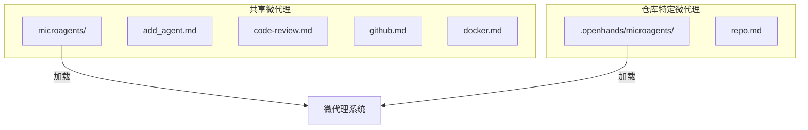
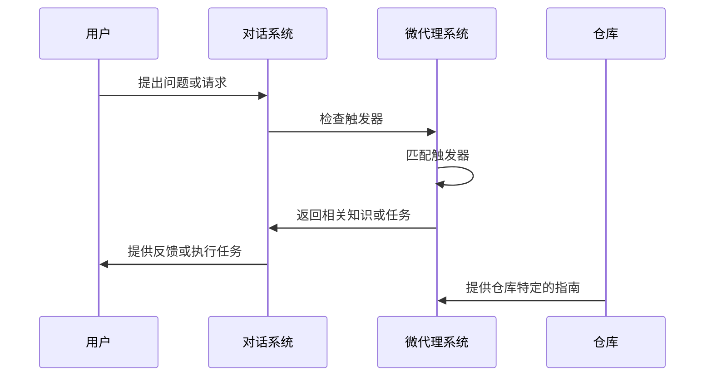
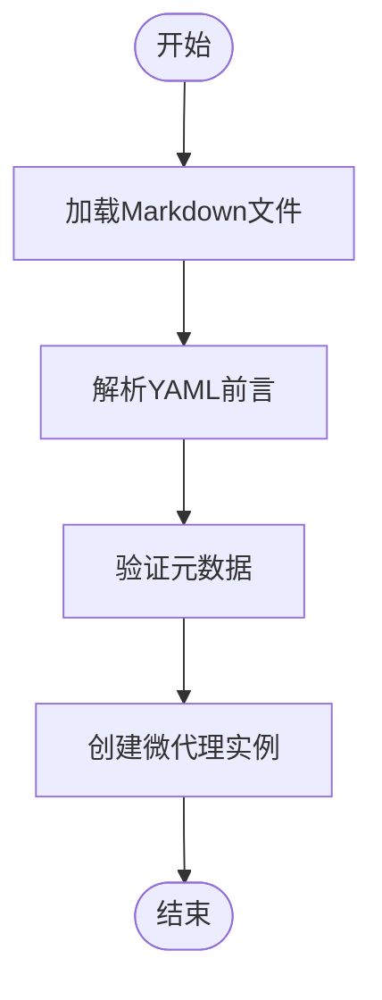
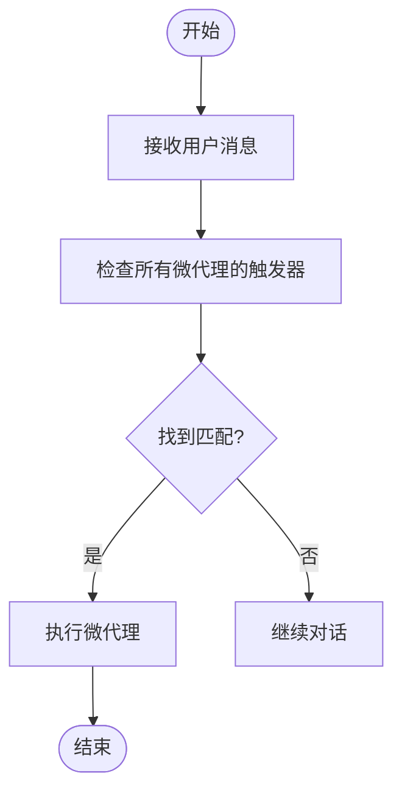
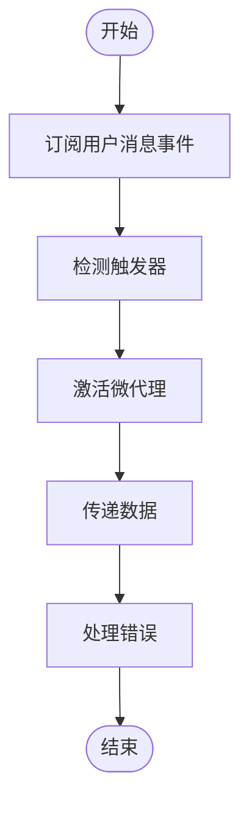
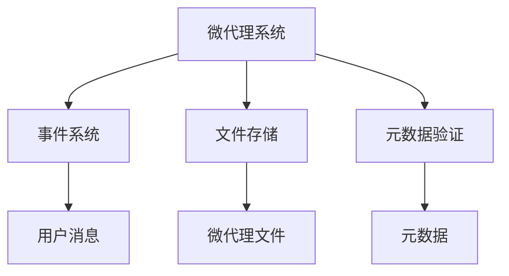

# 微代理系统

<cite>
**本文档引用的文件**
- [microagent.py](file://openhands/microagent/microagent.py)
- [types.py](file://openhands/microagent/types.py)
- [service_types.py](file://enterprise/integrations/service_types.py)
- [add_agent.md](file://microagents/add_agent.md)
- [code-review.md](file://microagents/code-review.md)
- [README.md](file://microagents/README.md)
</cite>

## 目录
1. [简介](#简介)
2. [项目结构](#项目结构)
3. [核心组件](#核心组件)
4. [架构概述](#架构概述)
5. [详细组件分析](#详细组件分析)
6. [依赖分析](#依赖分析)
7. [性能考虑](#性能考虑)
8. [故障排除指南](#故障排除指南)
9. [结论](#结论)
10. [附录](#附录)（如有必要）

## 简介
微代理系统是OpenHands平台的核心功能之一，它通过专门化的提示和任务工作流来增强开发者的生产力。微代理是针对特定领域或任务的专门化提示，它们通过提供上下文和能力来帮助AI助手理解可用的功能、如何使用特定的API或工具、存在哪些限制以及如何处理常见场景。微代理系统允许开发者通过关键词触发特定知识或自动化常见任务，确保项目中的一致实践。

微代理有两种主要来源：共享微代理（公共）和仓库指令（私有）。共享微代理存储在OpenHands仓库中，可供所有用户使用，适用于可重用的知识和常见工作流。仓库指令则存储在每个仓库的`.openhands/microagents/repo.md`文件中，是私有的，仅在处理该仓库时自动加载，非常适合仓库特定的指南和团队实践。

## 项目结构
微代理系统在OpenHands项目中具有清晰的结构，主要分为两个部分：共享微代理和仓库特定的微代理。共享微代理位于项目根目录下的`microagents/`目录中，包含各种通用知识和任务的微代理文件。这些文件以Markdown格式编写，包含YAML前言，定义了微代理的元数据，如名称、类型、版本、触发器等。

仓库特定的微代理则位于每个仓库的`.openhands/microagents/`目录中，其中`repo.md`文件包含了该仓库特定的指南和实践。当OpenHands与某个仓库交互时，会自动加载该仓库的`repo.md`文件，确保AI助手能够遵循该仓库的特定规则和约定。



**图示来源**
- [README.md](file://microagents/README.md)

**章节来源**
- [README.md](file://microagents/README.md)

## 核心组件
微代理系统的核心组件包括`BaseMicroagent`、`KnowledgeMicroagent`、`RepoMicroagent`和`TaskMicroagent`类，以及相关的元数据和类型定义。这些组件共同构成了微代理的生命周期管理、触发机制和执行流程。

`BaseMicroagent`是所有微代理的基类，负责从Markdown文件中加载微代理内容，并解析YAML前言中的元数据。`KnowledgeMicroagent`提供特定领域的专业知识，通过关键词触发。`RepoMicroagent`则专注于仓库特定的知识和指南，始终处于激活状态。`TaskMicroagent`是一种特殊的`KnowledgeMicroagent`，需要用户输入才能执行任务。

**章节来源**
- [microagent.py](file://openhands/microagent/microagent.py)
- [types.py](file://openhands/microagent/types.py)

## 架构概述
微代理系统的架构设计旨在提供灵活且可扩展的知识和任务自动化能力。系统通过事件驱动的方式工作，当用户在对话中提到特定关键词时，相应的微代理会被触发并提供相关的知识或执行特定任务。



**图示来源**
- [microagent.py](file://openhands/microagent/microagent.py)
- [service_types.py](file://enterprise/integrations/service_types.py)

## 详细组件分析

### 微代理生命周期管理
微代理的生命周期从文件加载开始，通过`BaseMicroagent.load`方法解析Markdown文件和YAML前言。加载后，微代理根据其类型被分类为`KnowledgeMicroagent`、`RepoMicroagent`或`TaskMicroagent`。微代理在对话过程中根据触发器被激活，并在任务完成后结束其生命周期。

#### 微代理加载流程


**图示来源**
- [microagent.py](file://openhands/microagent/microagent.py)

**章节来源**
- [microagent.py](file://openhands/microagent/microagent.py)

### 触发机制和执行流程
微代理的触发机制基于关键词匹配。当用户在对话中提到与微代理触发器匹配的关键词时，该微代理将被激活。`KnowledgeMicroagent`通过`match_trigger`方法检查消息中是否包含触发器，而`TaskMicroagent`则通过特定格式`/{agent_name}`触发。

#### 触发机制流程


**图示来源**
- [microagent.py](file://openhands/microagent/microagent.py)

**章节来源**
- [microagent.py](file://openhands/microagent/microagent.py)

### 开发指南
创建新的微代理需要遵循一定的规范。首先，创建一个Markdown文件并添加YAML前言，定义微代理的元数据。然后，在文件正文中编写微代理的内容，包括任务描述、上下文信息和指令。最后，将文件放置在适当的目录中，以便系统能够正确加载。

#### 创建微代理示例
```markdown
---
name: add_agent
type: knowledge
version: 1.0.0
agent: CodeActAgent
triggers:
  - new agent
  - create agent
  - add agent
---
This agent helps create new microagents in the `.openhands/microagents` directory by providing guidance and templates.
```

**章节来源**
- [add_agent.md](file://microagents/add_agent.md)

### 集成模式
微代理与核心系统的集成通过事件订阅、数据传递和错误处理实现。系统通过事件总线监听用户消息，并在检测到触发器时激活相应的微代理。数据通过事件对象在组件间传递，确保信息的一致性和完整性。错误处理机制确保在微代理执行失败时能够提供适当的反馈。

#### 集成模式流程


**图示来源**
- [service_types.py](file://enterprise/integrations/service_types.py)

**章节来源**
- [service_types.py](file://enterprise/integrations/service_types.py)

### 安全考虑和权限控制
微代理系统通过严格的元数据验证和权限控制确保安全性。所有微代理的元数据在加载时都会进行验证，确保其符合预期的格式和类型。此外，仓库特定的微代理仅在处理相应仓库时加载，防止跨仓库的信息泄露。

### 性能优化建议
为了优化微代理系统的性能，建议保持微代理文件的简洁和专注。避免在单个微代理中包含过多的知识或任务，这可能导致加载和匹配过程变慢。同时，使用具体的触发器以减少误触发的可能性。

## 依赖分析
微代理系统依赖于多个核心组件，包括事件系统、文件存储和元数据验证。事件系统负责监听用户消息并触发微代理，文件存储用于保存和加载微代理文件，元数据验证确保微代理的正确性和一致性。



**图示来源**
- [microagent.py](file://openhands/microagent/microagent.py)
- [types.py](file://openhands/microagent/types.py)

**章节来源**
- [microagent.py](file://openhands/microagent/microagent.py)

## 性能考虑
微代理系统的性能主要受文件加载速度、触发器匹配效率和执行流程复杂度的影响。为了提高性能，建议优化文件读取操作，使用高效的字符串匹配算法，并简化微代理的执行逻辑。

## 故障排除指南
在使用微代理系统时，可能会遇到一些常见问题，如微代理未被正确加载、触发器不匹配或执行失败。解决这些问题的方法包括检查文件路径和格式、验证元数据的正确性以及调试触发器匹配逻辑。

**章节来源**
- [microagent.py](file://openhands/microagent/microagent.py)
- [types.py](file://openhands/microagent/types.py)

## 结论
微代理系统是OpenHands平台中一个强大且灵活的功能，它通过专门化的提示和任务自动化显著提升了开发者的生产力。通过理解微代理的架构设计、生命周期管理、触发机制和执行流程，开发者可以更好地利用这一功能，创建高效且一致的开发工作流。

## 附录
### 示例微代理文件
```markdown
---
name: code-review
triggers:
- /codereview
---
PERSONA:
You are an expert software engineer and code reviewer with deep experience in modern programming best practices, secure coding, and clean code principles.

TASK:
Review the code changes in this pull request or merge request, and provide actionable feedback to help the author improve code quality, maintainability, and security. DO NOT modify the code; only provide specific feedback.
```

**章节来源**
- [code-review.md](file://microagents/code-review.md)