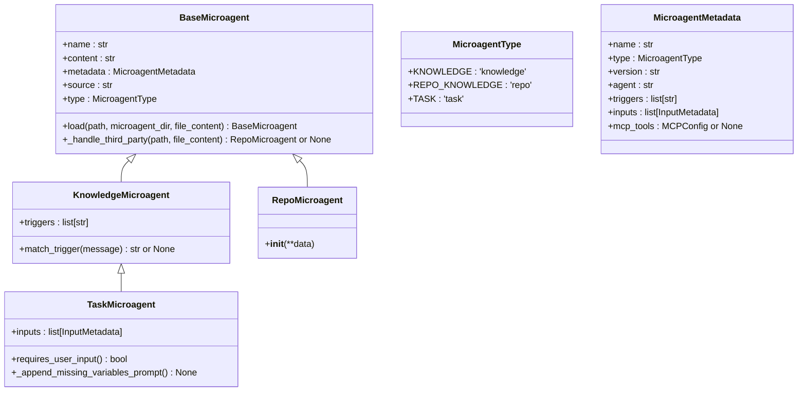
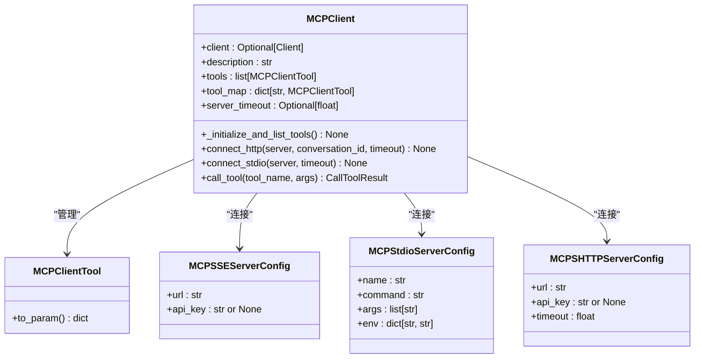
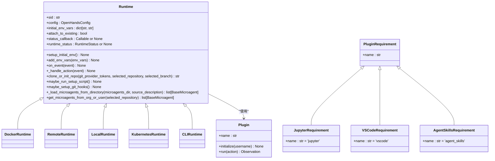

# 扩展机制

<cite>
**本文档引用的文件**   
- [microagent.py](file://openhands/microagent/microagent.py)
- [types.py](file://openhands/microagent/types.py)
- [client.py](file://openhands/mcp/client.py)
- [tool.py](file://openhands/mcp/tool.py)
- [base.py](file://openhands/runtime/base.py)
- [mcp_config.py](file://enterprise/server/mcp/mcp_config.py)
- [requirement.py](file://openhands/runtime/plugins/requirement.py)
- [plugins/__init__.py](file://openhands/runtime/plugins/__init__.py)
</cite>

## 目录
1. [引言](#引言)
2. [微代理系统架构](#微代理系统架构)
3. [MCP插件系统](#mcp插件系统)
4. [自定义运行时实现](#自定义运行时实现)
5. [扩展开发最佳实践](#扩展开发最佳实践)
6. [扩展发布与分发](#扩展发布与分发)
7. [调试与测试工具](#调试与测试工具)
8. [结论](#结论)

## 引言
OpenHands提供了一套全面的扩展机制，允许开发者通过微代理（microagents）、MCP（Model Context Protocol）插件和自定义运行时来扩展系统功能。这些扩展点构成了OpenHands可扩展性设计的核心，使开发者能够根据特定需求定制和增强系统能力。本文档详细描述了这些扩展机制的架构、使用方法和开发指南。

## 微代理系统架构

微代理系统是OpenHands的核心扩展机制之一，它允许开发者创建专门的知识代理来增强AI助手的能力。微代理系统基于Markdown文件定义，通过前端元数据（frontmatter）配置代理的元信息和行为。

微代理系统支持三种主要类型：
- **知识型微代理**：通过关键词触发的可选代理
- **仓库知识型微代理**：始终激活的仓库特定代理
- **任务型微代理**：需要用户输入的特殊代理

微代理的加载机制通过`BaseMicroagent.load()`方法实现，该方法从指定目录加载所有微代理文件，并根据文件内容和路径推断代理类型。系统会自动处理第三方代理指令文件（如.cursorrules和AGENTS.md），并将其转换为相应的微代理实例。

**Diagram sources**
- [microagent.py](file://openhands/microagent/microagent.py#L17-L342)
- [types.py](file://openhands/microagent/types.py#L11-L60)

**Section sources**
- [microagent.py](file://openhands/microagent/microagent.py#L1-L342)
- [types.py](file://openhands/microagent/types.py#L1-L60)

## MCP插件系统

MCP（Model Context Protocol）插件系统是OpenHands的另一个关键扩展机制，它允许集成外部工具和服务。MCP客户端通过不同的传输协议（stdio、SSE、SHTTP）连接到MCP服务器，并管理可用的工具。

MCP系统的核心组件包括：
- **MCPClient**：管理与MCP服务器的连接和工具列表
- **MCPClientTool**：表示可以在MCP服务器上调用的工具代理
- **MCP配置**：定义MCP服务器的连接参数和认证信息

系统支持多种MCP服务器配置：
- **MCPSSEServerConfig**：使用SSE（Server-Sent Events）传输的服务器配置
- **MCPStdioServerConfig**：使用标准输入/输出传输的服务器配置
- **MCPSHTTPServerConfig**：使用流式HTTP传输的服务器配置

在SaaS环境中，系统优先使用SHTTP连接，因为它具有更好的性能并且支持无状态连接，这对于分布式服务器环境至关重要。

**Diagram sources**
- [client.py](file://openhands/mcp/client.py#L24-L179)
- [tool.py](file://openhands/mcp/tool.py#L5-L24)
- [mcp_config.py](file://openhands/core/config/mcp_config.py#L46-L200)

**Section sources**
- [client.py](file://openhands/mcp/client.py#L1-L179)
- [tool.py](file://openhands/mcp/tool.py#L1-L24)
- [mcp_config.py](file://openhands/core/config/mcp_config.py#L1-L384)

## 自定义运行时实现

OpenHands的运行时系统是可扩展的，允许开发者创建自定义的运行时环境。所有运行时都继承自抽象基类`Runtime`，该类定义了运行时环境的基本接口和功能。

运行时系统的主要特性包括：
- **插件系统**：通过插件机制扩展运行时功能
- **环境管理**：管理环境变量和初始化脚本
- **Git集成**：支持Git操作和钩子管理
- **微代理集成**：支持从仓库加载微代理

运行时插件系统基于`Plugin`和`PluginRequirement`类，开发者可以通过实现`Plugin`接口来创建自定义插件。系统内置了多种插件，包括Jupyter、VSCode和AgentSkills插件。

**Diagram sources**
- [base.py](file://openhands/runtime/base.py#L91-L800)
- [requirement.py](file://openhands/runtime/plugins/requirement.py#L8-L32)
- [plugins/__init__.py](file://openhands/runtime/plugins/__init__.py#L2-L8)

**Section sources**
- [base.py](file://openhands/runtime/base.py#L1-L1241)
- [requirement.py](file://openhands/runtime/plugins/requirement.py#L1-L32)
- [plugins/__init__.py](file://openhands/runtime/plugins/__init__.py#L1-L26)

## 扩展开发最佳实践

### 性能考虑
在开发扩展时，应考虑以下性能因素：
- **连接超时**：为MCP服务器配置合理的超时时间，避免长时间等待
- **资源管理**：及时释放运行时资源，避免内存泄漏
- **异步处理**：尽可能使用异步方法处理I/O操作，提高响应速度
- **缓存机制**：对于频繁访问的数据，实现适当的缓存策略

### 安全要求
扩展开发必须遵循严格的安全要求：
- **输入验证**：对所有用户输入进行验证和清理
- **权限控制**：遵循最小权限原则，限制扩展的权限范围
- **数据保护**：敏感数据应加密存储和传输
- **错误处理**：提供有意义的错误信息，避免泄露系统细节

### 兼容性测试
确保扩展在不同环境下的兼容性：
- **跨平台测试**：在Windows、Linux和macOS上测试扩展
- **版本兼容**：确保扩展与不同版本的OpenHands兼容
- **依赖管理**：明确声明扩展的依赖关系，避免版本冲突
- **向后兼容**：在更新扩展时，尽量保持向后兼容性

**Section sources**
- [client.py](file://openhands/mcp/client.py#L1-L179)
- [base.py](file://openhands/runtime/base.py#L1-L1241)
- [mcp_config.py](file://openhands/core/config/mcp_config.py#L1-L384)

## 扩展发布与分发

### 发布流程
1. **版本管理**：遵循语义化版本控制规范
2. **文档更新**：更新扩展的文档和示例
3. **测试验证**：进行全面的测试，包括单元测试和集成测试
4. **打包发布**：使用适当的工具打包扩展
5. **发布渠道**：通过官方渠道发布扩展

### 分发机制
OpenHands支持多种扩展分发机制：
- **配置文件**：通过配置文件（如~/.openhands/mcp.json）分发MCP服务器配置
- **仓库集成**：通过仓库的.openhands目录分发微代理
- **组织级配置**：通过组织级仓库（如acme-co/.openhands）分发共享配置
- **包管理器**：通过Python包管理器分发运行时插件

**Section sources**
- [mcp_config.py](file://enterprise/server/mcp/mcp_config.py#L1-L55)
- [client.py](file://openhands-cli/openhands_cli/tui/settings/mcp_screen.py#L164-L202)

## 调试与测试工具

### 调试工具
OpenHands提供了一系列调试工具：
- **日志系统**：详细的日志记录，便于问题排查
- **状态回调**：实时监控运行时状态
- **事件流**：跟踪系统事件和观察结果
- **网络调试**：监控HTTP请求和响应

### 测试框架
系统提供了完善的测试框架：
- **单元测试**：针对单个组件的测试
- **集成测试**：测试组件间的交互
- **端到端测试**：模拟真实使用场景的测试
- **性能测试**：评估系统性能和响应时间

开发者可以使用pytest等测试框架编写测试用例，并通过CI/CD管道自动执行测试。

**Section sources**
- [test_mcp_action.py](file://tests/runtime/test_mcp_action.py#L313-L343)
- [test_microagent.py](file://tests/runtime/test_microagent.py)
- [build_vscode.py](file://build_vscode.py#L1-L113)

## 结论
OpenHands的扩展机制提供了一套强大而灵活的工具，使开发者能够根据特定需求定制和增强系统功能。通过微代理系统、MCP插件和自定义运行时，开发者可以创建专门的知识代理、集成外部工具和服务，以及构建定制的执行环境。遵循最佳实践和安全要求，可以确保扩展的性能、安全性和兼容性。通过完善的发布、分发、调试和测试工具，开发者可以高效地开发、部署和维护扩展。