# 自定义运行时实现

<cite>
**本文档引用的文件**
- [openhands/runtime/README.md](file://openhands/runtime/README.md)
- [openhands/runtime/base.py](file://openhands/runtime/base.py)
- [openhands/runtime/action_execution_server.py](file://openhands/runtime/action_execution_server.py)
- [openhands/runtime/impl/action_execution/action_execution_client.py](file://openhands/runtime/impl/action_execution/action_execution_client.py)
- [openhands/runtime/impl/docker/docker_runtime.py](file://openhands/runtime/impl/docker/docker_runtime.py)
- [openhands/runtime/impl/remote/remote_runtime.py](file://openhands/runtime/impl/remote/remote_runtime.py)
- [third_party/runtime/impl/e2b/e2b_runtime.py](file://third_party/runtime/impl/e2b/e2b_runtime.py)
- [third_party/runtime/impl/runloop/runloop_runtime.py](file://third_party/runtime/impl/runloop/runloop_runtime.py)
- [openhands/runtime/utils/command.py](file://openhands/runtime/utils/command.py)
- [openhands/runtime/plugins/__init__.py](file://openhands/runtime/plugins/__init__.py)
- [openhands/runtime/runtime_status.py](file://openhands/runtime/runtime_status.py)
- [openhands/controller/agent_controller.py](file://openhands/controller/agent_controller.py)
</cite>

## 目录
1. [简介](#简介)
2. [运行时抽象层设计理念](#运行时抽象层设计理念)
3. [核心接口契约](#核心接口契约)
4. [运行时生命周期管理](#运行时生命周期管理)
5. [具体运行时实现](#具体运行时实现)
6. [运行时与控制器通信协议](#运行时与控制器通信协议)
7. [状态同步机制](#状态同步机制)
8. [错误恢复策略](#错误恢复策略)
9. [性能基准测试](#性能基准测试)
10. [资源限制配置](#资源限制配置)
11. [安全隔离措施](#安全隔离措施)
12. [开发到部署流程](#开发到部署流程)
13. [系统集成注意事项](#系统集成注意事项)

## 简介

OpenHands运行时抽象层是一个高度模块化和可扩展的架构，旨在为智能体提供统一的外部环境交互接口。该系统通过抽象化不同的运行时后端（如Docker、远程服务器、云服务等），使开发者能够轻松切换和扩展执行环境，同时保持一致的行为模式。

运行时系统的核心价值在于：
- **统一接口**：所有运行时实现都遵循相同的接口契约
- **可插拔架构**：支持多种运行时后端的无缝切换
- **生命周期管理**：完整的容器/实例生命周期控制
- **状态同步**：实时的状态报告和错误处理机制
- **安全隔离**：多层安全防护和资源限制

## 运行时抽象层设计理念

### 分层架构设计

OpenHands运行时采用分层架构，确保各层职责清晰分离：

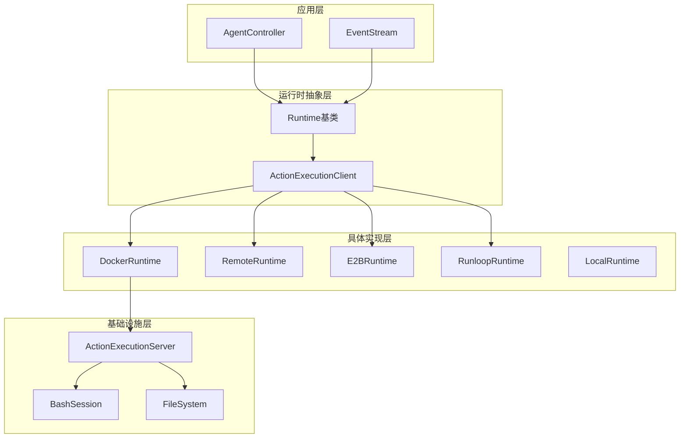

**图表来源**
- [openhands/runtime/base.py](file://openhands/runtime/base.py#L91-L120)
- [openhands/runtime/impl/action_execution/action_execution_client.py](file://openhands/runtime/impl/action_execution/action_execution_client.py#L61-L85)

### 核心设计原则

1. **接口一致性**：所有运行时必须实现相同的核心方法集合
2. **异步优先**：基于asyncio的异步编程模型
3. **资源隔离**：每个运行时实例独立的资源空间
4. **状态透明**：实时的状态报告和监控
5. **错误容错**：完善的错误检测和恢复机制

**章节来源**
- [openhands/runtime/base.py](file://openhands/runtime/base.py#L91-L120)

## 核心接口契约

### Runtime基类接口

Runtime基类定义了所有运行时实现必须遵循的核心接口契约：

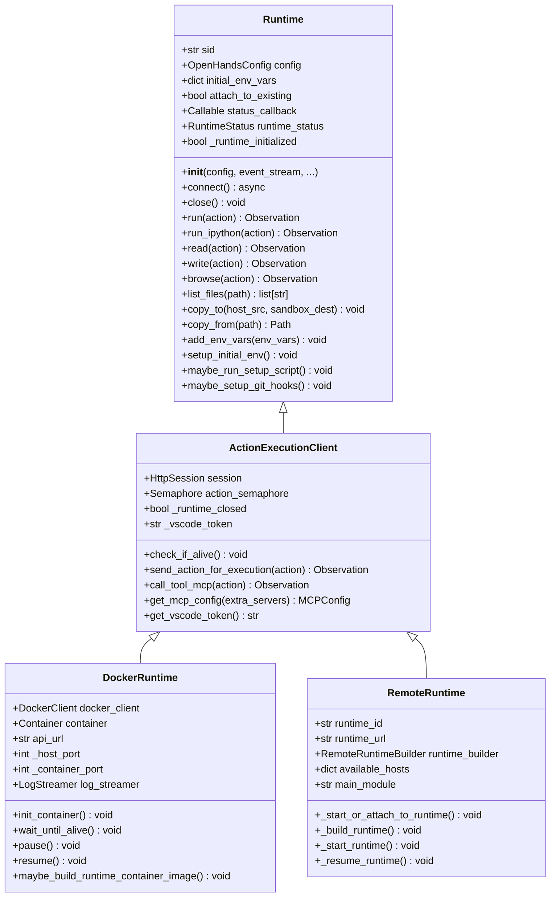

**图表来源**
- [openhands/runtime/base.py](file://openhands/runtime/base.py#L91-L120)
- [openhands/runtime/impl/action_execution/action_execution_client.py](file://openhands/runtime/impl/action_execution/action_execution_client.py#L61-L85)
- [openhands/runtime/impl/docker/docker_runtime.py](file://openhands/runtime/impl/docker/docker_runtime.py#L75-L105)

### 必需方法实现要求

每个运行时实现必须重写以下核心方法：

| 方法名 | 功能描述 | 实现要求 |
|--------|----------|----------|
| `__init__` | 初始化运行时实例 | 必须调用父类构造函数 |
| `connect()` | 启动和初始化运行时 | 异步方法，设置状态为READY |
| `close()` | 清理和关闭运行时 | 确保资源正确释放 |
| `run()` | 执行命令行操作 | 返回CmdOutputObservation |
| `run_ipython()` | 执行Python代码 | 返回IPythonRunCellObservation |
| `read()` | 读取文件内容 | 返回FileReadObservation |
| `write()` | 写入文件内容 | 返回FileWriteObservation |
| `browse()` | 浏览网页 | 返回BrowserOutputObservation |

**章节来源**
- [openhands/runtime/base.py](file://openhands/runtime/base.py#L370-L400)

## 运行时生命周期管理

### 生命周期阶段

运行时系统定义了完整的生命周期阶段，每个阶段都有明确的状态标识：

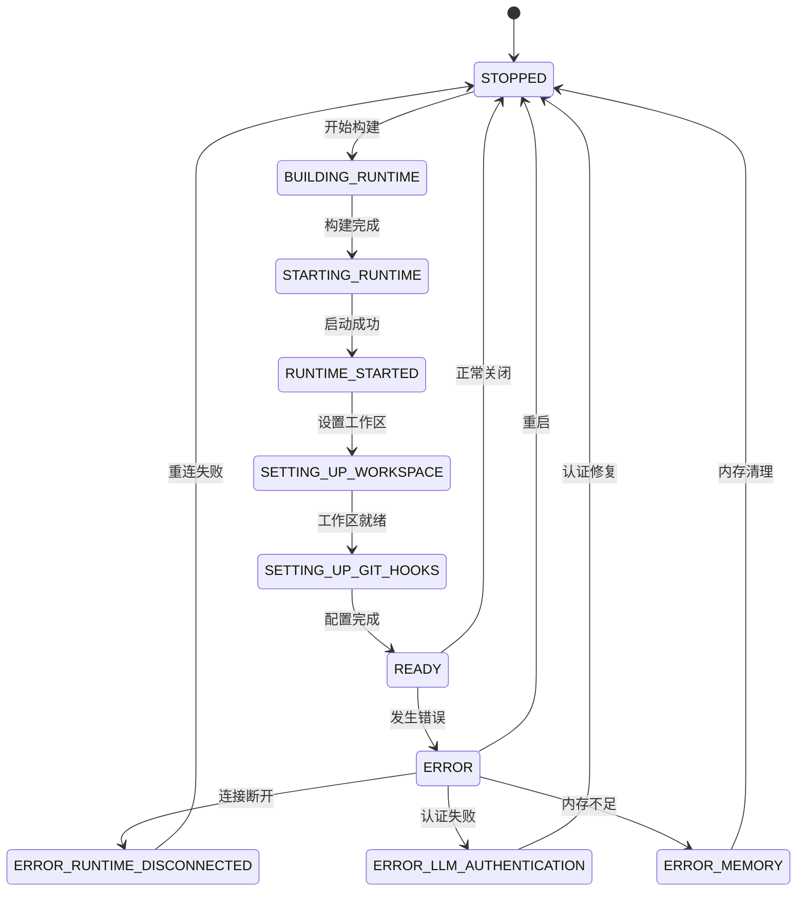

**图表来源**
- [openhands/runtime/runtime_status.py](file://openhands/runtime/runtime_status.py#L4-L25)

### 生命周期管理流程

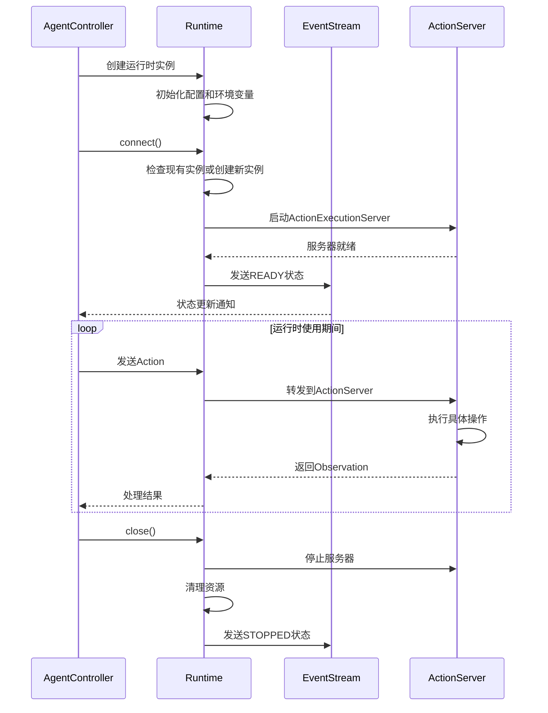

**图表来源**
- [openhands/runtime/base.py](file://openhands/runtime/base.py#L370-L400)
- [openhands/runtime/action_execution_server.py](file://openhands/runtime/action_execution_server.py#L697-L756)

**章节来源**
- [openhands/runtime/runtime_status.py](file://openhands/runtime/runtime_status.py#L4-L25)
- [openhands/runtime/base.py](file://openhands/runtime/base.py#L370-L400)

## 具体运行时实现

### Docker运行时

Docker运行时是默认的本地执行环境，提供完整的容器化隔离：

#### 核心特性
- **容器管理**：自动创建和管理Docker容器
- **端口映射**：动态端口分配和管理
- **文件系统挂载**：灵活的卷挂载策略
- **GPU支持**：可选的GPU设备访问
- **网络隔离**：独立的网络命名空间

#### 实现细节

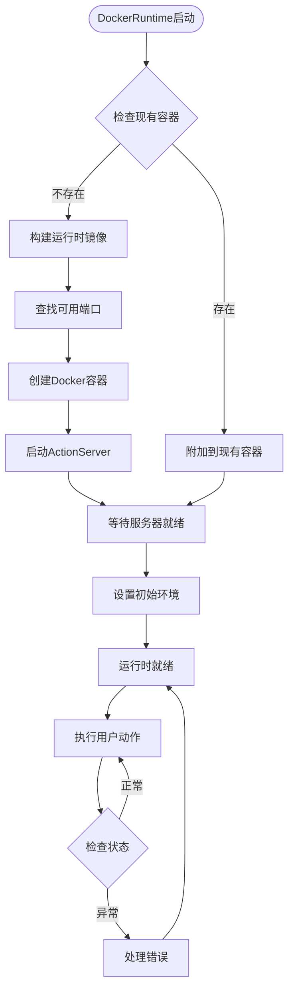

**图表来源**
- [openhands/runtime/impl/docker/docker_runtime.py](file://openhands/runtime/impl/docker/docker_runtime.py#L170-L200)

**章节来源**
- [openhands/runtime/impl/docker/docker_runtime.py](file://openhands/runtime/impl/docker/docker_runtime.py#L75-L105)

### 远程运行时

远程运行时允许在远程服务器上执行智能体操作：

#### 核心特性
- **API驱动**：通过REST API与远程服务通信
- **会话管理**：持久化的会话状态
- **资源弹性**：根据需求动态调整资源
- **高可用性**：自动故障转移和恢复

#### 实现架构

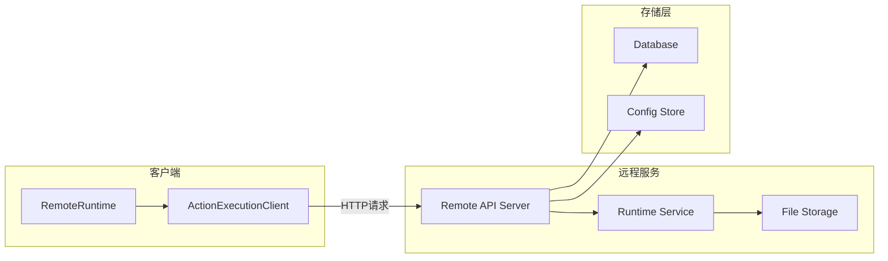

**图表来源**
- [openhands/runtime/impl/remote/remote_runtime.py](file://openhands/runtime/impl/remote/remote_runtime.py#L39-L65)

**章节来源**
- [openhands/runtime/impl/remote/remote_runtime.py](file://openhands/runtime/impl/remote/remote_runtime.py#L39-L65)

### 第三方运行时实现

#### E2B运行时

E2B运行时提供云端沙箱环境：

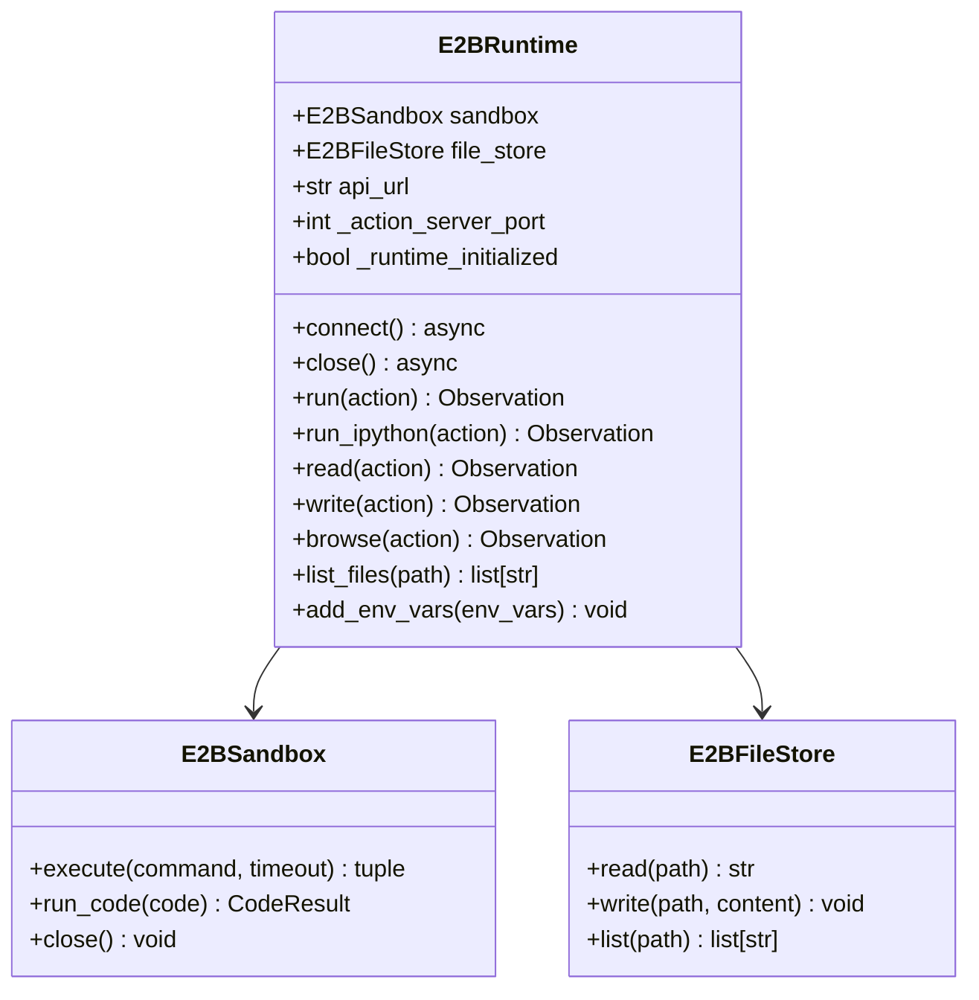

**图表来源**
- [third_party/runtime/impl/e2b/e2b_runtime.py](file://third_party/runtime/impl/e2b/e2b_runtime.py#L39-L82)

#### Runloop运行时

Runloop运行时利用Devbox技术提供快速的开发环境：

**章节来源**
- [third_party/runtime/impl/e2b/e2b_runtime.py](file://third_party/runtime/impl/e2b/e2b_runtime.py#L39-L82)
- [third_party/runtime/impl/runloop/runloop_runtime.py](file://third_party/runtime/impl/runloop/runloop_runtime.py#L25-L68)

## 运行时与控制器通信协议

### HTTP通信协议

运行时系统采用RESTful API进行通信，主要端点包括：

| 端点 | 方法 | 功能 | 请求格式 | 响应格式 |
|------|------|------|----------|----------|
| `/execute_action` | POST | 执行动作 | `{"action": {...}}` | `{"observation": {...}}` |
| `/alive` | GET | 健康检查 | 无参数 | `{"status": "ok"}` |
| `/list_files` | POST | 列出文件 | `{"path": "..."}` | `["file1", "file2"]` |
| `/upload_file` | POST | 上传文件 | 文件流 | `{"success": true}` |
| `/download_files` | GET | 下载文件 | `{"path": "..."}` | ZIP文件流 |
| `/vscode/connection_token` | GET | 获取VSCode令牌 | 无参数 | `{"token": "..."}` |

### 事件流通信

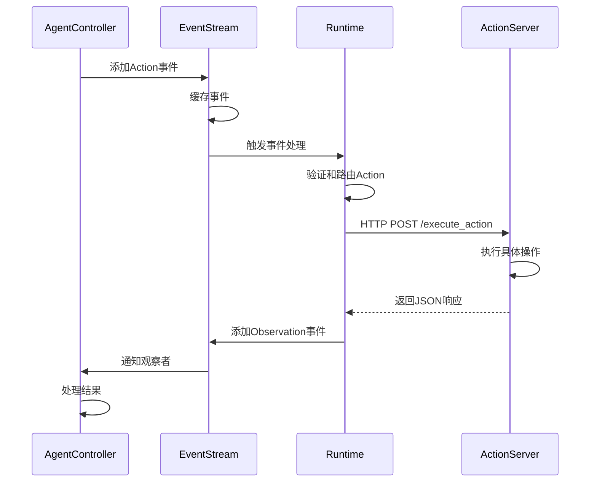

**图表来源**
- [openhands/runtime/impl/action_execution/action_execution_client.py](file://openhands/runtime/impl/action_execution/action_execution_client.py#L276-L342)

### API密钥认证

运行时系统支持基于API密钥的认证机制：

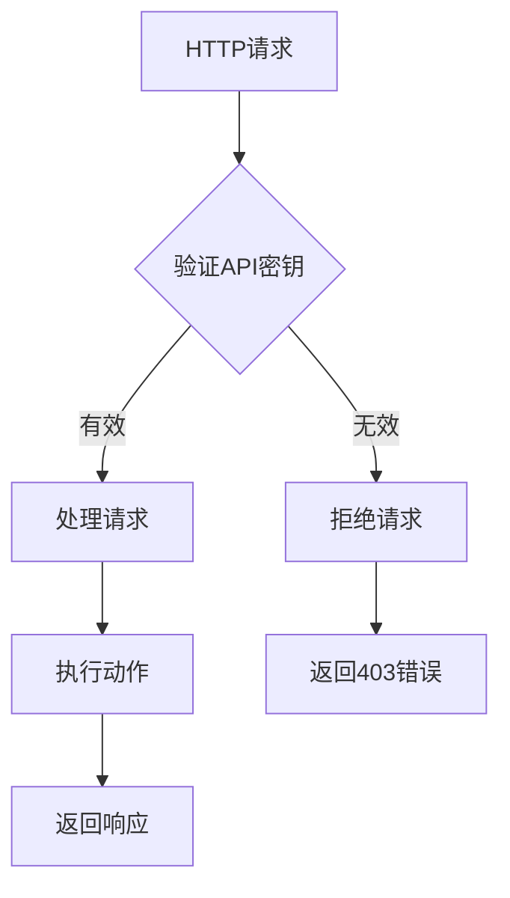

**图表来源**
- [openhands/runtime/action_execution_server.py](file://openhands/runtime/action_execution_server.py#L94-L98)

**章节来源**
- [openhands/runtime/impl/action_execution/action_execution_client.py](file://openhands/runtime/impl/action_execution/action_execution_client.py#L110-L130)
- [openhands/runtime/action_execution_server.py](file://openhands/runtime/action_execution_server.py#L94-L98)

## 状态同步机制

### 实时状态报告

运行时系统通过状态回调机制实现实时状态同步：

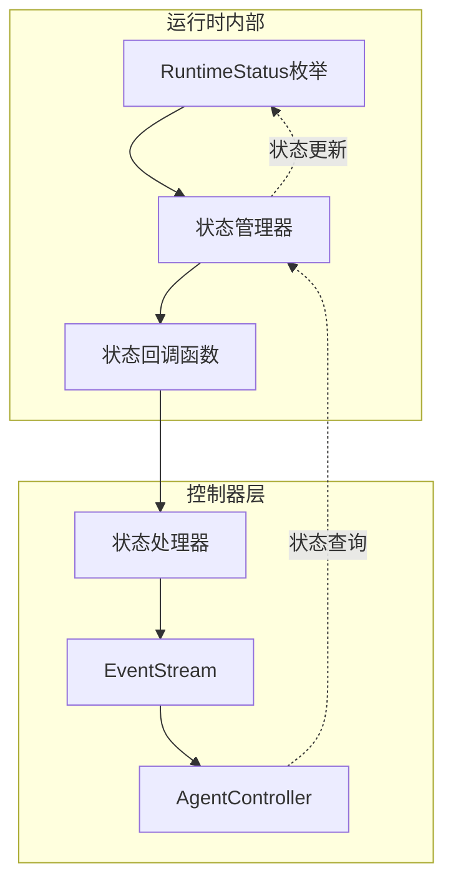

**图表来源**
- [openhands/runtime/runtime_status.py](file://openhands/runtime/runtime_status.py#L4-L25)

### 状态转换规则

| 当前状态 | 触发条件 | 新状态 | 处理动作 |
|----------|----------|--------|----------|
| STOPPED | 调用connect() | BUILDING_RUNTIME | 开始构建镜像 |
| BUILDING_RUNTIME | 镜像构建完成 | STARTING_RUNTIME | 启动容器 |
| STARTING_RUNTIME | 容器启动成功 | RUNTIME_STARTED | 初始化服务器 |
| RUNTIME_STARTED | 服务器就绪 | READY | 可以接收动作 |
| READY | 发生错误 | ERROR | 记录错误并尝试恢复 |
| ERROR | 恢复成功 | READY | 继续正常操作 |
| ERROR | 恢复失败 | STOPPED | 重新初始化 |

**章节来源**
- [openhands/runtime/runtime_status.py](file://openhands/runtime/runtime_status.py#L4-L25)

## 错误恢复策略

### 多层错误处理

运行时系统实现了多层次的错误检测和恢复机制：

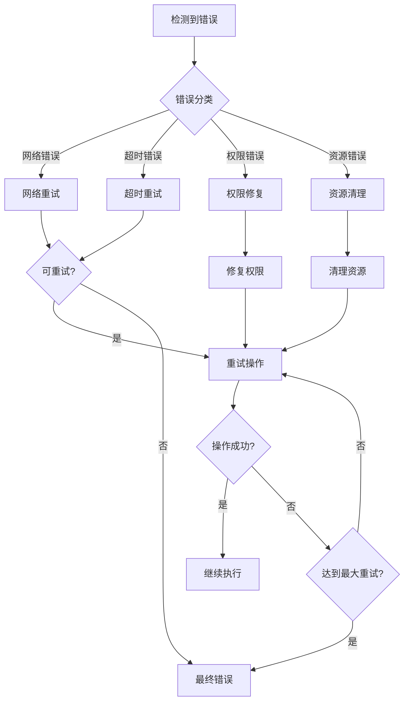

### 具体错误类型处理

#### 网络连接错误
- **重试策略**：指数退避重试
- **超时设置**：动态调整超时时间
- **断路器模式**：防止级联故障

#### 容器启动错误
- **镜像拉取**：自动拉取最新镜像
- **资源检查**：验证系统资源充足
- **端口冲突**：自动选择可用端口

#### 文件系统错误
- **权限修复**：自动修复文件权限
- **磁盘空间**：监控和清理临时文件
- **路径验证**：验证文件路径有效性

**章节来源**
- [openhands/runtime/impl/docker/docker_runtime.py](file://openhands/runtime/impl/docker/docker_runtime.py#L574-L590)
- [openhands/runtime/impl/remote/remote_runtime.py](file://openhands/runtime/impl/remote/remote_runtime.py#L561-L594)

## 性能基准测试

### 性能指标体系

运行时系统提供了全面的性能监控和基准测试框架：

| 指标类别 | 具体指标 | 测量单位 | 目标值 |
|----------|----------|----------|--------|
| 启动时间 | 容器启动时间 | 秒 | < 30秒 |
| 响应时间 | 平均响应延迟 | 毫秒 | < 1000ms |
| 吞吐量 | 每秒处理请求数 | QPS | > 10 QPS |
| 资源利用率 | CPU使用率 | 百分比 | < 80% |
| 内存使用 | 峰值内存占用 | MB | < 2GB |
| 网络带宽 | 并发连接数 | 个 | > 100 |

### 基准测试方法

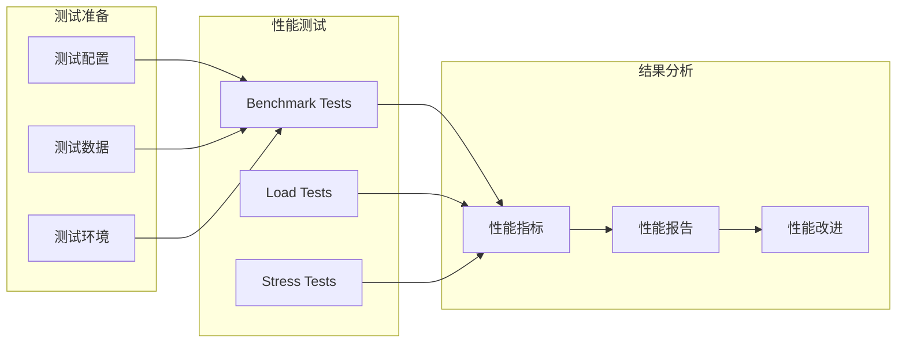

### 性能优化建议

1. **容器优化**
   - 使用轻量级基础镜像
   - 合理配置资源限制
   - 启用容器缓存机制

2. **网络优化**
   - 使用本地网络连接
   - 启用HTTP/2协议
   - 实现连接池管理

3. **存储优化**
   - 使用内存文件系统
   - 启用文件压缩
   - 实现增量备份

## 资源限制配置

### 资源配额管理

运行时系统提供了细粒度的资源限制配置：

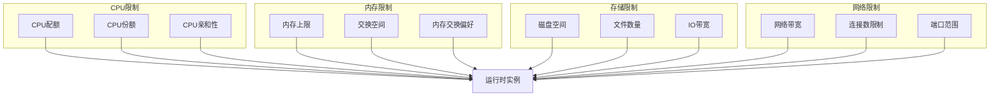

### 配置参数详解

| 配置项 | 默认值 | 说明 | 影响范围 |
|--------|--------|------|----------|
| `cpu_quota` | 1.0 | CPU配额限制 | CPU调度 |
| `memory_limit` | 2GB | 内存使用上限 | 内存管理 |
| `disk_quota` | 10GB | 磁盘空间限制 | 存储管理 |
| `network_bandwidth` | 100Mbps | 网络带宽限制 | 网络I/O |
| `timeout` | 600s | 操作超时时间 | 超时控制 |
| `max_connections` | 100 | 最大并发连接 | 连接管理 |

**章节来源**
- [openhands/runtime/utils/command.py](file://openhands/runtime/utils/command.py#L21-L83)

## 安全隔离措施

### 多层安全防护

运行时系统实现了多层次的安全隔离机制：

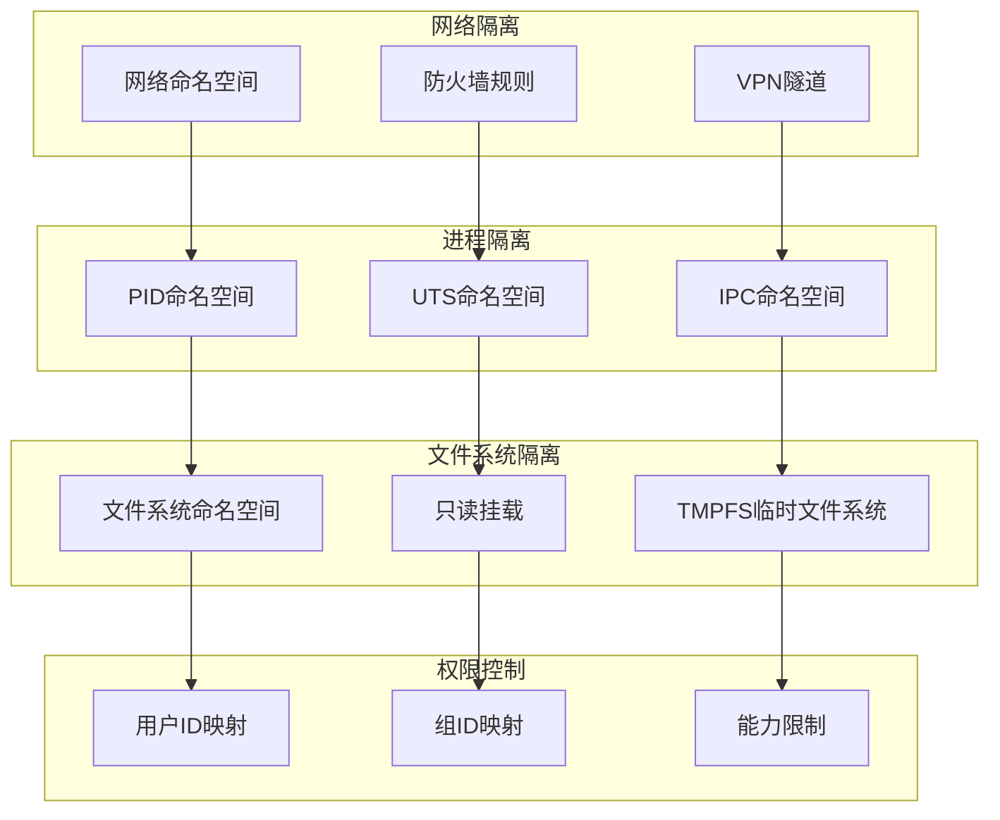

### 安全审计机制

1. **操作日志记录**
   - 记录所有文件操作
   - 跟踪网络连接
   - 监控系统调用

2. **威胁检测**
   - 异常行为识别
   - 恶意软件扫描
   - 权限滥用检测

3. **合规性检查**
   - 安全策略验证
   - 访问控制审计
   - 数据保护合规

**章节来源**
- [openhands/runtime/base.py](file://openhands/runtime/base.py#L223-L228)

## 开发到部署流程

### 开发环境搭建

#### 1. 环境准备
```bash
# 克隆项目
git clone https://github.com/OpenHands/OpenHands.git
cd OpenHands

# 安装依赖
pip install -r requirements.txt

# 配置环境变量
export OPENHANDS_CONFIG_PATH=./config.toml
export SANDBOX_API_KEY=your_api_key_here
```

#### 2. 运行时实现开发
```python
# 示例：自定义运行时实现
from openhands.runtime.impl.action_execution.action_execution_client import ActionExecutionClient

class CustomRuntime(ActionExecutionClient):
    def __init__(self, config, event_stream, sid="default"):
        super().__init__(config, event_stream, sid)
        # 自定义初始化逻辑
    
    async def connect(self):
        # 实现连接逻辑
        pass
    
    def run(self, action):
        # 实现命令执行逻辑
        pass
```

#### 3. 配置运行时
```toml
# config.toml
[openhands]
runtime = "custom.CustomRuntime"
```

### 部署最佳实践

#### 1. 生产环境部署
```bash
# 构建生产镜像
docker build -t openhands-custom-runtime:latest .

# 启动运行时服务
docker run -d \
  --name openhands-runtime \
  -p 8000:8000 \
  -e RUNTIME_API_KEY=your_secret_key \
  -v /var/run/docker.sock:/var/run/docker.sock \
  openhands-custom-runtime:latest
```

#### 2. 监控和告警
```yaml
# prometheus.yml
scrape_configs:
  - job_name: 'openhands-runtime'
    static_configs:
      - targets: ['localhost:8000']
    metrics_path: '/metrics'
    scrape_interval: 15s
```

#### 3. 日志管理
```json
{
  "version": "1",
  "formatters": {
    "json": {
      "format": "%(asctime)s %(levelname)s [%(name)s] %(message)s"
    }
  },
  "handlers": {
    "console": {
      "class": "logging.StreamHandler",
      "formatter": "json"
    }
  },
  "loggers": {
    "openhands.runtime": {
      "handlers": ["console"],
      "level": "INFO"
    }
  }
}
```

### CI/CD流水线

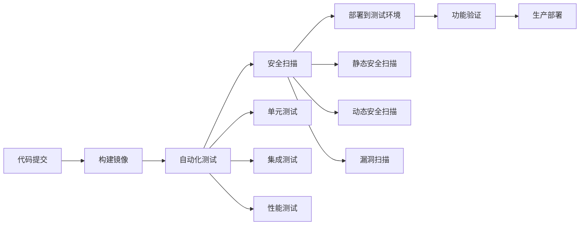

## 系统集成注意事项

### 与现有系统的兼容性

#### 1. API兼容性
- 保持向后兼容的API版本
- 提供详细的API文档
- 实现优雅的降级机制

#### 2. 数据格式标准化
```python
# 统一的事件格式
{
    "type": "action|observation",
    "content": {...},
    "timestamp": "2024-01-01T00:00:00Z",
    "source": "agent|runtime|controller"
}
```

#### 3. 错误处理标准化
```python
# 标准化错误响应
{
    "error": {
        "code": "RUNTIME_ERROR",
        "message": "详细错误信息",
        "details": {...},
        "timestamp": "2024-01-01T00:00:00Z"
    }
}
```

### 性能优化建议

#### 1. 连接池管理
- 实现HTTP连接池
- 合理设置连接超时
- 支持连接复用

#### 2. 缓存策略
- 缓存频繁访问的数据
- 实现智能缓存失效
- 支持分布式缓存

#### 3. 异步处理
- 使用异步I/O操作
- 实现非阻塞的文件操作
- 支持并发请求处理

### 扩展性设计

#### 1. 插件架构
```python
# 插件接口定义
class RuntimePlugin:
    def initialize(self, runtime):
        pass
    
    def execute(self, action):
        pass
    
    def cleanup(self):
        pass
```

#### 2. 配置管理
- 支持动态配置更新
- 实现配置验证机制
- 提供配置模板系统

#### 3. 监控集成
- 集成APM工具
- 实现自定义指标
- 支持告警通知

**章节来源**
- [openhands/runtime/plugins/__init__.py](file://openhands/runtime/plugins/__init__.py#L21-L26)
- [openhands/runtime/base.py](file://openhands/runtime/base.py#L370-L400)

## 结论

OpenHands运行时抽象层提供了一个强大而灵活的框架，支持多种运行时后端的无缝集成。通过统一的接口契约、完善的生命周期管理和强大的错误恢复机制，该系统能够满足各种复杂的部署场景需求。

关键优势包括：
- **高度可扩展性**：支持自定义运行时实现
- **强健的可靠性**：多层错误处理和恢复机制
- **优秀的性能**：优化的资源管理和并发处理
- **完善的安全性**：多层次的安全隔离措施
- **易于维护**：清晰的架构设计和文档支持

对于希望扩展OpenHands功能的开发者来说，理解并掌握这套运行时系统的设计理念和实现细节，将是成功集成和定制的关键。