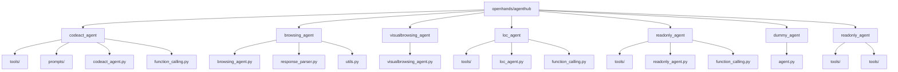
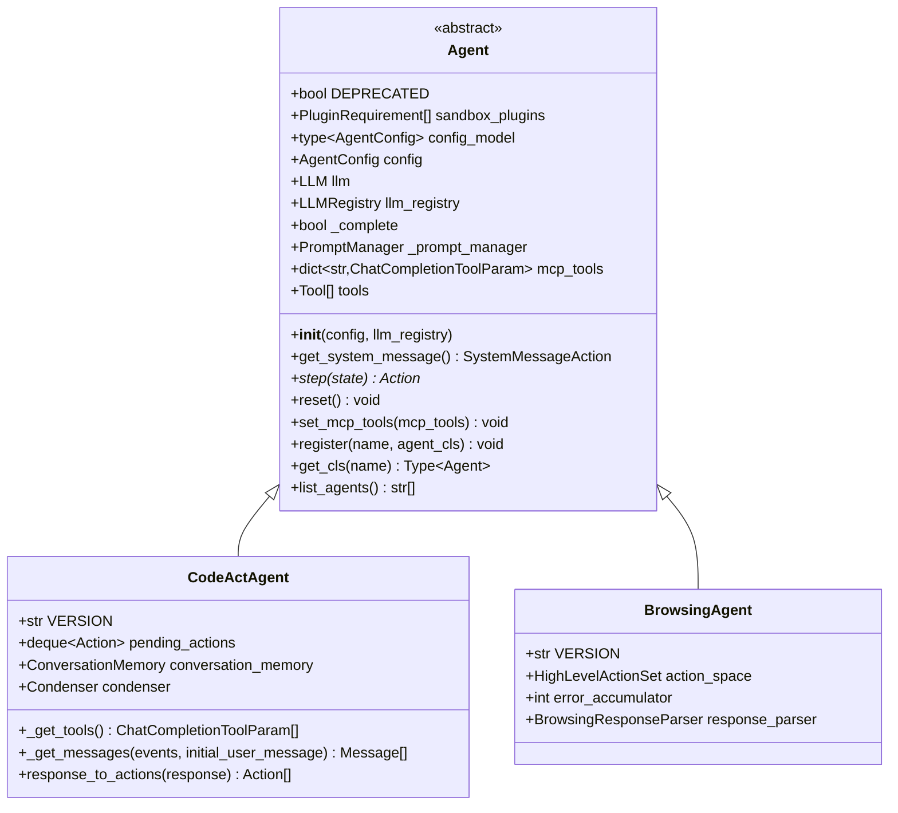
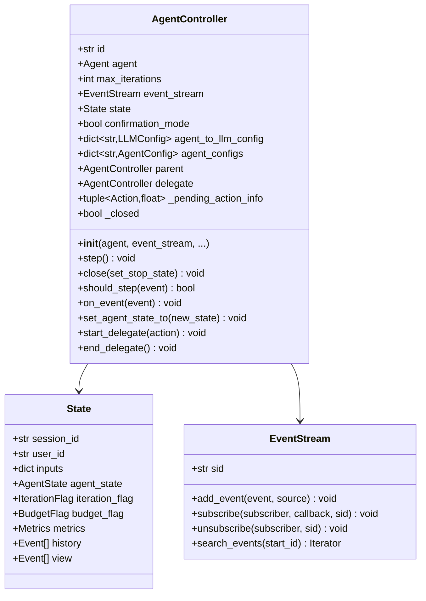
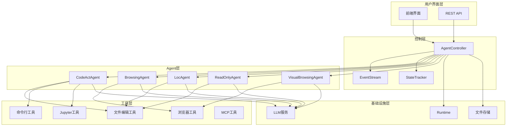
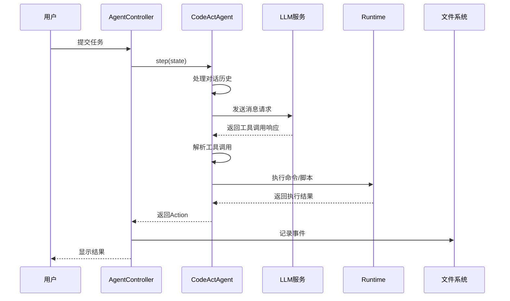
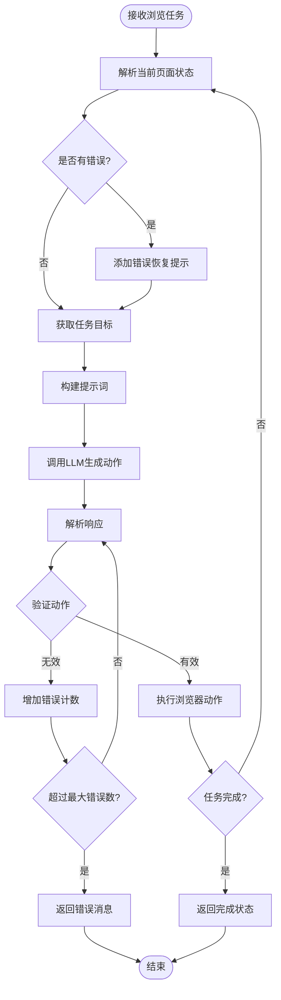
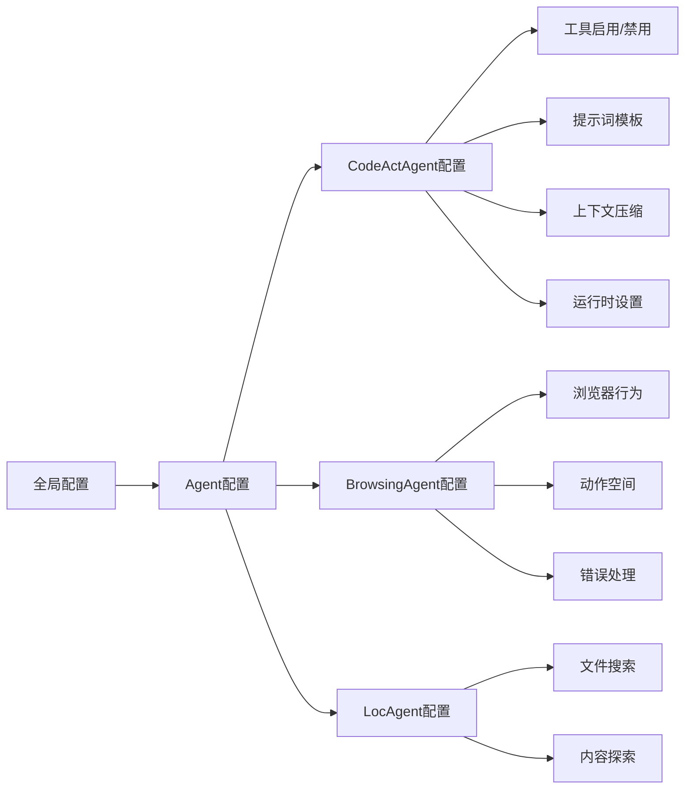
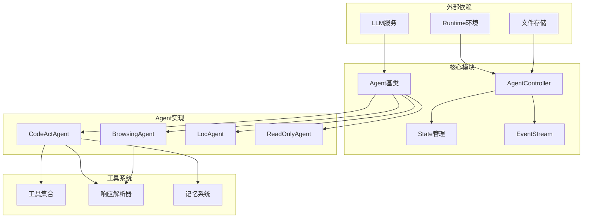

# Agent系统

<cite>
**本文档引用的文件**
- [openhands/agenthub/__init__.py](file://openhands/agenthub/__init__.py)
- [openhands/controller/agent.py](file://openhands/controller/agent.py)
- [openhands/agenthub/codeact_agent/codeact_agent.py](file://openhands/agenthub/codeact_agent/codeact_agent.py)
- [openhands/agenthub/browsing_agent/browsing_agent.py](file://openhands/agenthub/browsing_agent/browsing_agent.py)
- [openhands/controller/agent_controller.py](file://openhands/controller/agent_controller.py)
- [openhands/controller/action_parser.py](file://openhands/controller/action_parser.py)
- [openhands/core/config/agent_config.py](file://openhands/core/config/agent_config.py)
- [openhands/agenthub/dummy_agent/agent.py](file://openhands/agenthub/dummy_agent/agent.py)
- [openhands/agenthub/codeact_agent/function_calling.py](file://openhands/agenthub/codeact_agent/function_calling.py)
- [openhands/core/loop.py](file://openhands/core/loop.py)
</cite>

## 目录
1. [简介](#简介)
2. [项目结构](#项目结构)
3. [核心组件](#核心组件)
4. [架构概览](#架构概览)
5. [详细组件分析](#详细组件分析)
6. [依赖关系分析](#依赖关系分析)
7. [性能考虑](#性能考虑)
8. [故障排除指南](#故障排除指南)
9. [结论](#结论)

## 简介

OpenHands的Agent系统是一个高度模块化和可扩展的人工智能代理框架，旨在处理各种复杂的任务，从代码编辑到网页浏览。该系统采用分层架构设计，支持多种类型的Agent，每种Agent都有特定的职责和能力。

Agent系统的核心设计理念是通过统一的接口和标准化的动作执行机制，实现不同AI代理之间的无缝协作和任务委托。系统提供了完整的生命周期管理，包括初始化、执行循环、状态监控和优雅终止。

## 项目结构

OpenHands Agent系统采用模块化的目录结构，主要组织如下：

**图表来源**
- [openhands/agenthub/__init__.py](file://openhands/agenthub/__init__.py#L1-L25)

**章节来源**
- [openhands/agenthub/__init__.py](file://openhands/agenthub/__init__.py#L1-L25)

## 核心组件

### Agent抽象基类

Agent系统的核心是抽象基类 `Agent`，它定义了所有AI代理必须实现的基本接口：

**图表来源**
- [openhands/controller/agent.py](file://openhands/controller/agent.py#L25-L184)
- [openhands/agenthub/codeact_agent/codeact_agent.py](file://openhands/agenthub/codeact_agent/codeact_agent.py#L49-L301)
- [openhands/agenthub/browsing_agent/browsing_agent.py](file://openhands/agenthub/browsing_agent/browsing_agent.py#L94-L224)

### Agent控制器

AgentController负责管理单个Agent实例的生命周期，包括状态跟踪、事件处理和与其他组件的协调：

**图表来源**
- [openhands/controller/agent_controller.py](file://openhands/controller/agent_controller.py#L101-L135)

**章节来源**
- [openhands/controller/agent.py](file://openhands/controller/agent.py#L25-L184)
- [openhands/controller/agent_controller.py](file://openhands/controller/agent_controller.py#L101-L135)

## 架构概览

OpenHands Agent系统采用分层架构设计，确保了良好的模块化和可扩展性：

**图表来源**
- [openhands/controller/agent_controller.py](file://openhands/controller/agent_controller.py#L101-L135)
- [openhands/controller/agent.py](file://openhands/controller/agent.py#L25-L184)

## 详细组件分析

### CodeActAgent：代码操作代理

CodeActAgent是最主要的Agent类型，实现了"代码即行动"的概念，将所有操作统一为代码执行：

**图表来源**
- [openhands/agenthub/codeact_agent/codeact_agent.py](file://openhands/agenthub/codeact_agent/codeact_agent.py#L161-L226)
- [openhands/controller/agent_controller.py](file://openhands/controller/agent_controller.py#L368-L401)

CodeActAgent的核心特性包括：

1. **统一的代码执行空间**：所有操作都转换为代码执行
2. **动态工具加载**：根据配置动态启用或禁用工具
3. **智能状态管理**：维护对话历史和当前执行状态
4. **安全风险评估**：对每个操作进行安全风险分析

**章节来源**
- [openhands/agenthub/codeact_agent/codeact_agent.py](file://openhands/agenthub/codeact_agent/codeact_agent.py#L49-L301)

### BrowsingAgent：网页浏览代理

BrowsingAgent专门处理网页浏览任务，集成了BrowserGym框架：

**图表来源**
- [openhands/agenthub/browsing_agent/browsing_agent.py](file://openhands/agenthub/browsing_agent/browsing_agent.py#L133-L224)

**章节来源**
- [openhands/agenthub/browsing_agent/browsing_agent.py](file://openhands/agenthub/browsing_agent/browsing_agent.py#L94-L224)

### 工具系统

Agent系统提供了丰富的工具集合，支持各种操作：

| 工具类型 | 功能描述 | 使用场景 |
|---------|----------|----------|
| 文件编辑工具 | 支持文件读写、内容替换 | 代码修改、配置更新 |
| 命令行工具 | 执行bash命令 | 系统操作、环境配置 |
| 浏览器工具 | 网页导航、交互操作 | 网页浏览、自动化测试 |
| Jupyter工具 | Python代码执行 | 数据分析、算法开发 |
| MCP工具 | 多模型通信协议 | 跨模型协作 |
| 任务跟踪工具 | 任务规划和管理 | 复杂任务分解 |

**章节来源**
- [openhands/agenthub/codeact_agent/function_calling.py](file://openhands/agenthub/codeact_agent/function_calling.py#L73-L339)

### 配置系统

Agent系统采用灵活的配置机制，支持全局配置和特定Agent配置：

**图表来源**
- [openhands/core/config/agent_config.py](file://openhands/core/config/agent_config.py#L15-L159)

**章节来源**
- [openhands/core/config/agent_config.py](file://openhands/core/config/agent_config.py#L15-L159)

## 依赖关系分析

Agent系统的依赖关系体现了清晰的分层架构：

**图表来源**
- [openhands/controller/agent.py](file://openhands/controller/agent.py#L1-L25)
- [openhands/controller/agent_controller.py](file://openhands/controller/agent_controller.py#L1-L50)

**章节来源**
- [openhands/controller/agent.py](file://openhands/controller/agent.py#L1-L184)
- [openhands/controller/agent_controller.py](file://openhands/controller/agent_controller.py#L1-L1362)

## 性能考虑

Agent系统在设计时充分考虑了性能优化：

1. **异步执行**：使用asyncio实现非阻塞操作
2. **内存管理**：智能的对话历史压缩和清理
3. **缓存机制**：LLM响应缓存和提示词缓存
4. **资源限制**：迭代次数和预算控制
5. **并发处理**：多Agent并行执行支持

## 故障排除指南

### 常见问题及解决方案

1. **Agent初始化失败**
   - 检查LLM配置是否正确
   - 验证权限和认证设置
   - 确认网络连接状态

2. **工具调用错误**
   - 验证工具参数格式
   - 检查工具可用性
   - 查看安全风险级别

3. **内存溢出**
   - 启用对话历史压缩
   - 减少保留的历史长度
   - 优化工具使用频率

4. **性能问题**
   - 调整超时设置
   - 优化提示词长度
   - 使用更高效的工具组合

**章节来源**
- [openhands/controller/agent_controller.py](file://openhands/controller/agent_controller.py#L312-L401)

## 结论

OpenHands的Agent系统展现了现代AI代理架构的最佳实践，通过模块化设计、统一接口和灵活配置，实现了高度可扩展和可维护的系统架构。系统的核心优势包括：

1. **统一的抽象层**：所有Agent共享相同的接口和交互模式
2. **灵活的工具系统**：支持动态加载和组合不同的功能模块
3. **完善的生命周期管理**：从初始化到终止的全过程控制
4. **强大的配置机制**：支持细粒度的功能定制和优化
5. **安全可靠的设计**：内置安全检查和错误处理机制

该系统为构建复杂的AI代理应用提供了坚实的基础，支持从简单的文本处理到复杂的多步骤任务执行的各种场景。随着AI技术的不断发展，这套架构也为未来的功能扩展和技术升级预留了充足的空间。