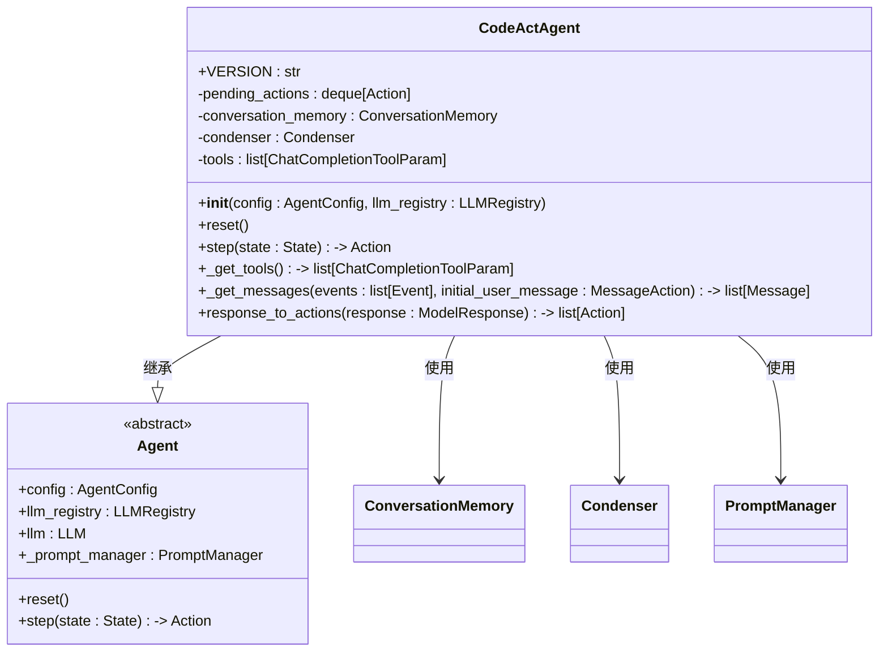
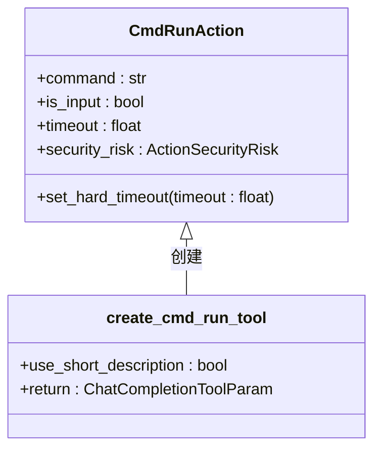
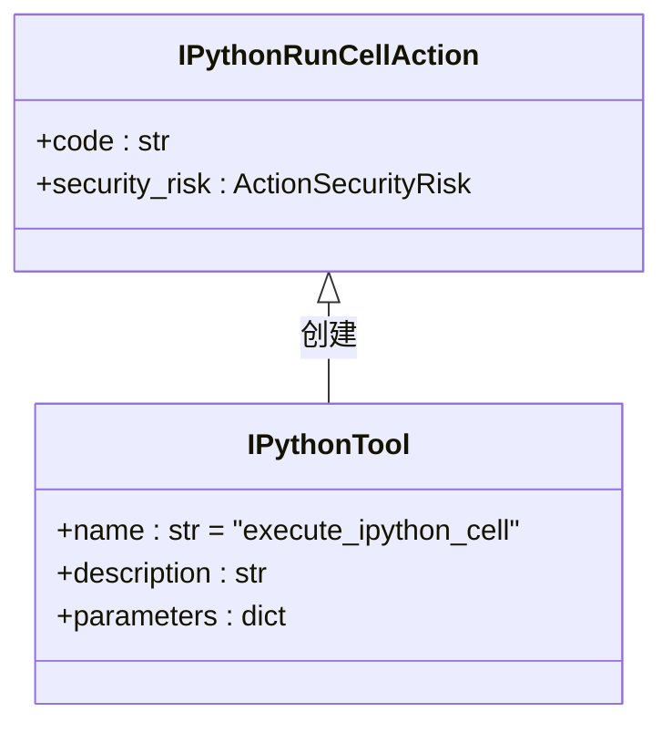
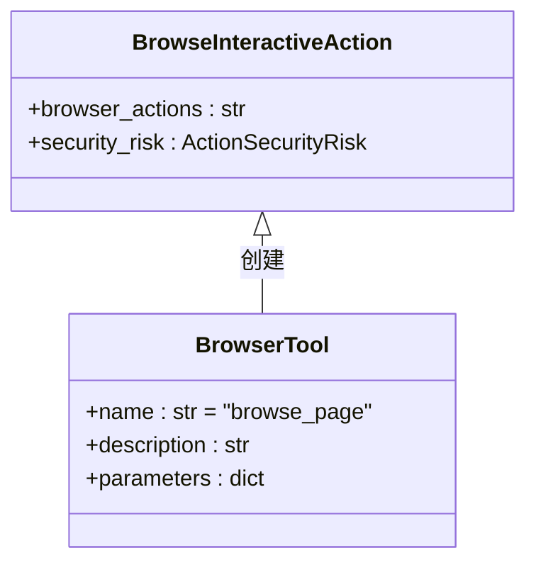
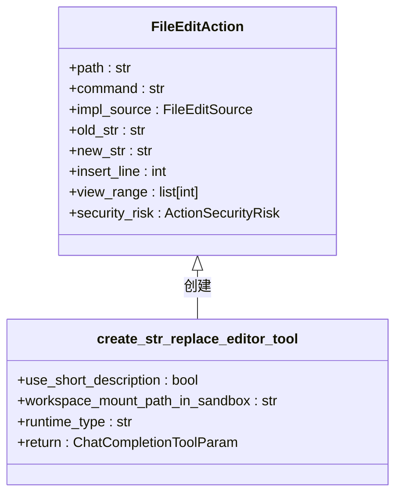
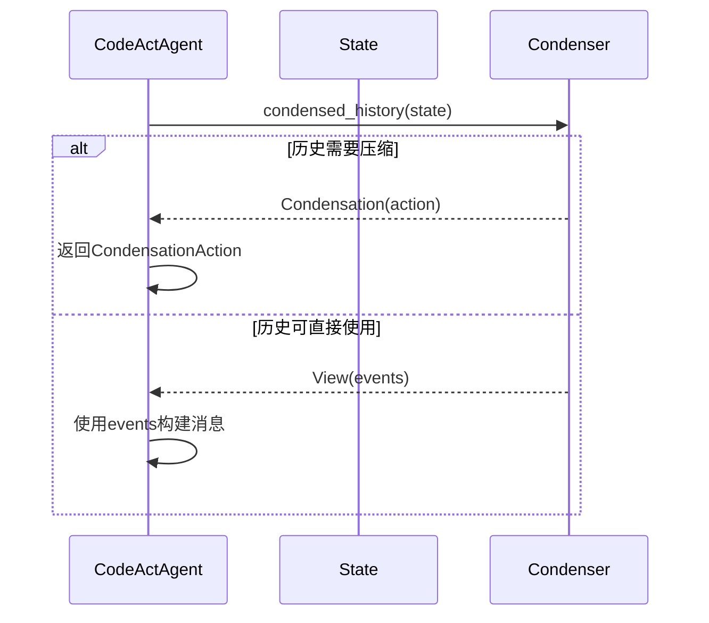
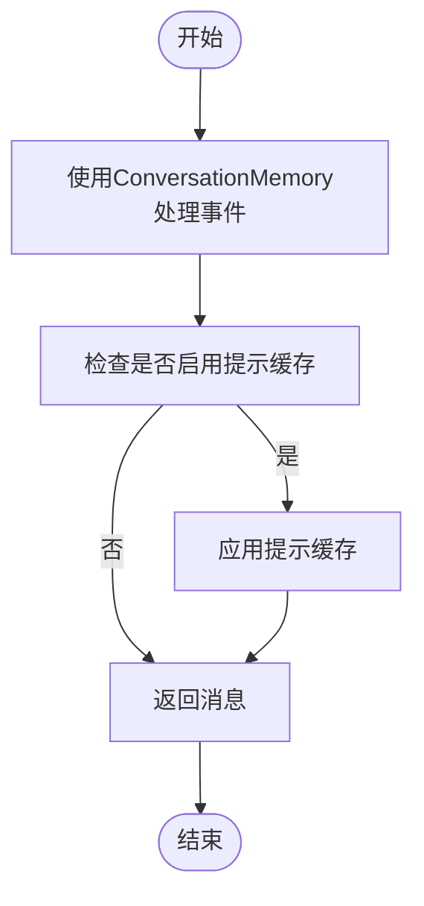
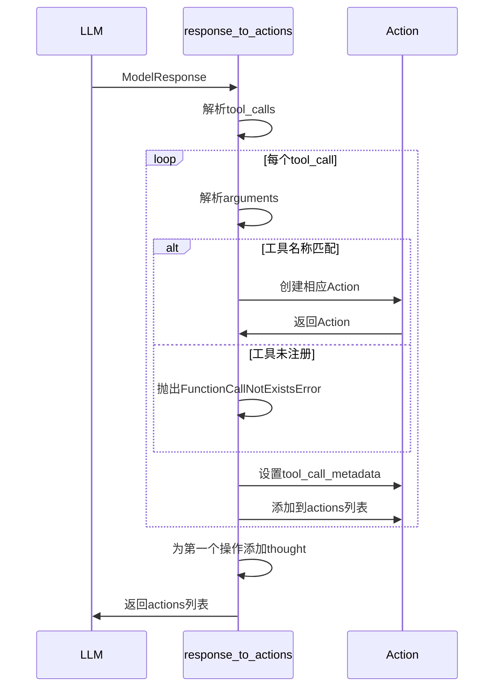
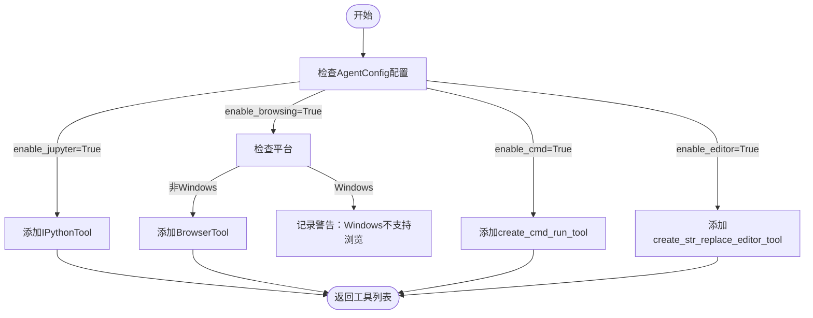
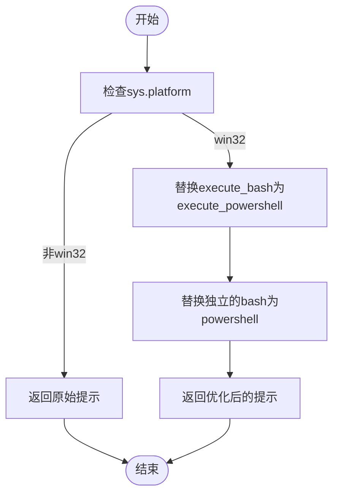

# CodeAct代理

<cite>
**本文档中引用的文件**  
- [codeact_agent.py](file://openhands/agenthub/codeact_agent/codeact_agent.py)
- [function_calling.py](file://openhands/agenthub/codeact_agent/function_calling.py)
- [bash.py](file://openhands/agenthub/codeact_agent/tools/bash.py)
- [ipython.py](file://openhands/agenthub/codeact_agent/tools/ipython.py)
- [browser.py](file://openhands/agenthub/codeact_agent/tools/browser.py)
- [str_replace_editor.py](file://openhands/agenthub/codeact_agent/tools/str_replace_editor.py)
- [prompt.py](file://openhands/agenthub/codeact_agent/tools/prompt.py)
- [test_config_utils.py](file://tests/unit/core/config/test_config_utils.py)
</cite>

## 目录
1. [简介](#简介)
2. [架构概述](#架构概述)
3. [内置工具集](#内置工具集)
4. [消息处理流程](#消息处理流程)
5. [与LLM的交互模式](#与llm的交互模式)
6. [配置与功能启用](#配置与功能启用)
7. [Windows平台特殊处理](#windows平台特殊处理)

## 简介

CodeAct代理是OpenHands项目中的核心代理，基于CodeAct理念实现。该代理通过函数调用接口操作，将LLM代理的**操作**（act）统一到**代码**（code）操作空间中，以实现简洁性和高性能。代理在每个步骤中可以执行自然语言对话或通过一组明确定义的工具执行操作。

**本节来源**
- [codeact_agent.py](file://openhands/agenthub/codeact_agent/codeact_agent.py#L1-L68)

## 架构概述

CodeAct代理采用基于函数调用的架构，通过一系列工具与环境交互。其核心组件包括：

- **工具管理**：通过`_get_tools`方法根据配置启用或禁用特定工具
- **状态管理**：使用`pending_actions`队列管理待执行的操作
- **对话历史管理**：通过`condenser`组件管理对话历史的压缩
- **消息处理**：通过`_get_messages`方法构建LLM对话消息历史



**图表来源**
- [codeact_agent.py](file://openhands/agenthub/codeact_agent/codeact_agent.py#L49-L97)

**本节来源**
- [codeact_agent.py](file://openhands/agenthub/codeact_agent/codeact_agent.py#L49-L97)

## 内置工具集

CodeAct代理提供了一组内置工具，通过函数调用机制与环境交互。这些工具的配置和使用方式如下：

### Bash命令执行工具

`execute_bash`工具允许执行Linux bash命令，具有以下特性：

- 支持在后台运行长时间运行的命令并重定向输出
- 支持带有STDIN输入和进程中断的交互式进程
- 通过设置超时参数处理命令超时
- 在Windows平台上自动替换为PowerShell



**图表来源**
- [bash.py](file://openhands/agenthub/codeact_agent/tools/bash.py#L42-L83)

### IPython代码运行工具

`execute_ipython_cell`工具允许在IPython环境中运行Python代码：

- 支持魔法命令如`%pip`
- 变量作用域限定在IPython环境中
- 需要在使用前定义变量和导入包



**图表来源**
- [ipython.py](file://openhands/agenthub/codeact_agent/tools/ipython.py#L8-L35)

### 网页浏览工具

`browser`工具允许与网页浏览器交互：

- 使用Python代码与浏览器交互
- 支持15种浏览器操作函数，包括导航、表单填写、点击等
- 支持同时执行多个操作，但通常2-3个操作后会导致失败



**图表来源**
- [browser.py](file://openhands/agenthub/codeact_agent/tools/browser.py#L17-L172)

### 文件编辑工具

`str_replace_editor`工具提供文件查看、创建和编辑功能：

- 支持查看文本文件和目录内容
- 支持创建和编辑文件
- 支持撤销编辑操作
- 要求`old_str`参数必须与文件内容完全匹配



**图表来源**
- [str_replace_editor.py](file://openhands/agenthub/codeact_agent/tools/str_replace_editor.py#L92-L162)

**本节来源**
- [bash.py](file://openhands/agenthub/codeact_agent/tools/bash.py#L42-L83)
- [ipython.py](file://openhands/agenthub/codeact_agent/tools/ipython.py#L8-L35)
- [browser.py](file://openhands/agenthub/codeact_agent/tools/browser.py#L17-L172)
- [str_replace_editor.py](file://openhands/agenthub/codeact_agent/tools/str_replace_editor.py#L92-L162)

## 消息处理流程

CodeAct代理的消息处理流程涉及对话历史的管理和压缩，核心是`_condensed_history_`方法的实现。

### 对话历史压缩

`condenser.condensed_history`方法负责管理对话历史的压缩：

- 当对话历史过长时，返回`Condensation`事件，触发历史压缩
- 否则返回`View`事件，包含压缩后的事件列表
- 压缩后的历史用于构建LLM的输入消息



**图表来源**
- [codeact_agent.py](file://openhands/agenthub/codeact_agent/codeact_agent.py#L197-L202)

### 消息构建流程

`_get_messages`方法构建LLM对话消息历史：

1. 使用`ConversationMemory`处理事件
2. 检查是否存在`SystemMessageAction`，如缺失则添加（向后兼容）
3. 处理事件（操作和观察）为消息，包括`SystemMessageAction`
4. 在函数调用模式下处理工具调用及其响应
5. 管理消息角色交替（用户/助手/工具）
6. 为特定LLM提供商（如Anthropic）应用缓存



**图表来源**
- [codeact_agent.py](file://openhands/agenthub/codeact_agent/codeact_agent.py#L247-L294)

**本节来源**
- [codeact_agent.py](file://openhands/agenthub/codeact_agent/codeact_agent.py#L197-L294)

## 与LLM的交互模式

CodeAct代理与LLM的交互模式包括工具描述的动态生成和响应解析机制。

### 工具描述动态生成

工具描述根据LLM模型类型动态生成，对于特定模型使用简短描述以避免OpenAI工具描述的token限制：

```python
SHORT_TOOL_DESCRIPTION_LLM_SUBSTRS = ['gpt-4', 'o3', 'o1', 'o4']
use_short_tool_desc = any(model_substr in self.llm.config.model for model_substr in SHORT_TOOL_DESCRIPTION_LLM_SUBSTRS)
```

工具的启用通过`AgentConfig`配置：

```python
def _get_tools(self) -> list['ChatCompletionToolParam']:
    tools = []
    if self.config.enable_cmd:
        tools.append(create_cmd_run_tool(use_short_description=use_short_tool_desc))
    if self.config.enable_think:
        tools.append(ThinkTool)
    if self.config.enable_finish:
        tools.append(FinishTool)
    # ... 其他工具
    return tools
```

### 响应解析机制

`response_to_actions`函数将LLM响应解析为具体操作：

- 解析工具调用参数
- 根据工具名称创建相应操作
- 设置操作的安全风险级别
- 处理多个工具调用



**图表来源**
- [function_calling.py](file://openhands/agenthub/codeact_agent/function_calling.py#L73-L339)

**本节来源**
- [codeact_agent.py](file://openhands/agenthub/codeact_agent/codeact_agent.py#L108-L153)
- [function_calling.py](file://openhands/agenthub/codeact_agent/function_calling.py#L73-L339)

## 配置与功能启用

通过`AgentConfig`可以启用或禁用特定功能，如浏览和Jupyter。

### AgentConfig配置

`AgentConfig`类用于配置代理行为：

```python
agent_config = AgentConfig(
    enable_jupyter=True,
    enable_browsing=True,
    enable_cmd=True,
    enable_think=True,
    enable_finish=True,
    enable_condensation_request=True,
    enable_plan_mode=False,
    enable_llm_editor=False,
    enable_editor=True
)
```

### 功能启用逻辑

在`_get_tools`方法中根据配置启用相应工具：

```python
def _get_tools(self) -> list['ChatCompletionToolParam']:
    tools = []
    if self.config.enable_cmd:
        tools.append(create_cmd_run_tool(use_short_description=use_short_tool_desc))
    if self.config.enable_think:
        tools.append(ThinkTool)
    if self.config.enable_finish:
        tools.append(FinishTool)
    if self.config.enable_condensation_request:
        tools.append(CondensationRequestTool)
    if self.config.enable_browsing:
        if sys.platform == 'win32':
            logger.warning('Windows runtime does not support browsing yet')
        else:
            tools.append(BrowserTool)
    if self.config.enable_jupyter:
        tools.append(IPythonTool)
    # ... 其他工具
    return tools
```

### 测试用例

测试用例验证了配置的正确性：

```python
def test_finalize_config_other_runtime_keeps_jupyter_and_browsing_true_by_default():
    app_config = OpenHandsConfig()
    app_config.runtime = 'docker'  # 非cli运行时
    agent_config = AgentConfig()  # 默认enable_jupyter和enable_browsing为True
    app_config.agents[DEFAULT_AGENT_NAME] = agent_config
    finalize_config(app_config)
    assert app_config.agents[DEFAULT_AGENT_NAME].enable_jupyter
    assert app_config.agents[DEFAULT_AGENT_NAME].enable_browsing
```

```python
def test_finalize_config_cli_runtime_disables_jupyter_and_browsing_by_default():
    app_config = OpenHandsConfig()
    app_config.runtime = 'cli'  # cli运行时
    agent_config = AgentConfig()  # 默认enable_jupyter和enable_browsing为True
    app_config.agents[DEFAULT_AGENT_NAME] = agent_config
    finalize_config(app_config)
    assert not app_config.agents[DEFAULT_AGENT_NAME].enable_jupyter
    assert not app_config.agents[DEFAULT_AGENT_NAME].enable_browsing
```



**图表来源**
- [codeact_agent.py](file://openhands/agenthub/codeact_agent/codeact_agent.py#L126-L153)
- [test_config_utils.py](file://tests/unit/core/config/test_config_utils.py#L51-L69)

**本节来源**
- [codeact_agent.py](file://openhands/agenthub/codeact_agent/codeact_agent.py#L126-L153)
- [test_config_utils.py](file://tests/unit/core/config/test_config_utils.py#L51-L69)

## Windows平台特殊处理

CodeAct代理在Windows平台上有一些特殊处理逻辑，主要是将bash命令替换为PowerShell。

### PowerShell替换逻辑

在Windows平台上，通过`refine_prompt`函数将'bash'替换为'powershell'：

```python
def refine_prompt(prompt: str):
    """根据平台优化提示。
    
    在Windows系统上，将'bash'替换为'powershell'，将'execute_bash'替换为'execute_powershell'
    以确保命令在Windows平台上正确工作。
    """
    if sys.platform == 'win32':
        # 首先替换'execute_bash'为'execute_powershell'以处理工具名称
        result = re.sub(
            r'\bexecute_bash\b', 'execute_powershell', prompt, flags=re.IGNORECASE
        )
        # 然后替换独立的'bash'为'powershell'
        result = re.sub(
            r'(?<!execute_)(?<!_)\bbash\b', 'powershell', result, flags=re.IGNORECASE
        )
        return result
    return prompt
```

### 浏览功能限制

在Windows平台上，浏览功能被禁用并记录警告：

```python
if self.config.enable_browsing:
    if sys.platform == 'win32':
        logger.warning('Windows runtime does not support browsing yet')
    else:
        tools.append(BrowserTool)
```

### 测试验证

测试用例验证了Windows平台上的提示优化功能：

```python
def test_refine_prompt_function_works():
    # 测试基本替换
    test_prompt = 'Execute a bash command to list files'
    refined_prompt = refine_prompt(test_prompt)
    assert 'bash' not in refined_prompt.lower()
    assert 'powershell' in refined_prompt.lower()
    assert refined_prompt == 'Execute a powershell command to list files'
    
    # 测试多个出现
    test_prompt = 'Use bash to run bash commands in the bash shell'
    refined_prompt = refine_prompt(test_prompt)
    assert 'bash' not in refined_prompt.lower()
    assert refined_prompt == 'Use powershell to run powershell commands in the powershell shell'
    
    # 测试大小写敏感性
    test_prompt = 'BASH and Bash and bash should all be replaced'
    refined_prompt = refine_prompt(test_prompt)
    assert 'bash' not in refined_prompt.lower()
    assert refined_prompt == 'powershell and powershell and powershell should all be replaced'
```



**图表来源**
- [prompt.py](file://openhands/agenthub/codeact_agent/tools/prompt.py#L5-L29)

**本节来源**
- [prompt.py](file://openhands/agenthub/codeact_agent/tools/prompt.py#L5-L29)
- [codeact_agent.py](file://openhands/agenthub/codeact_agent/codeact_agent.py#L134-L138)