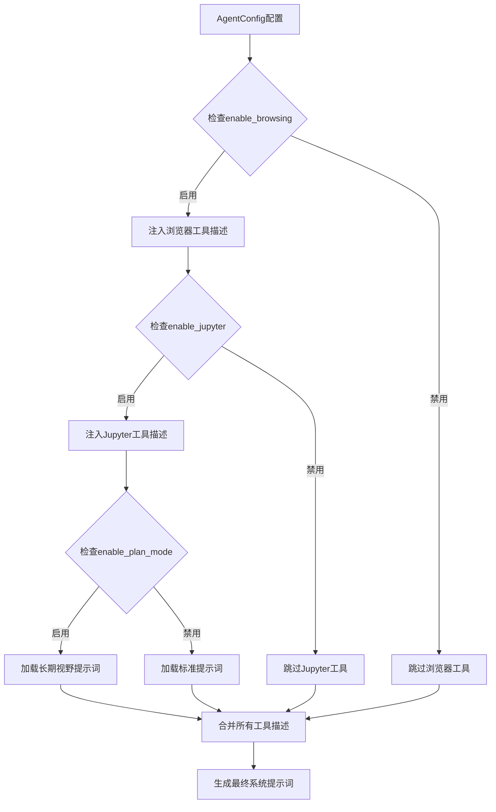
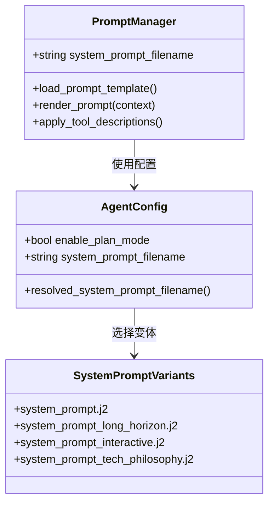
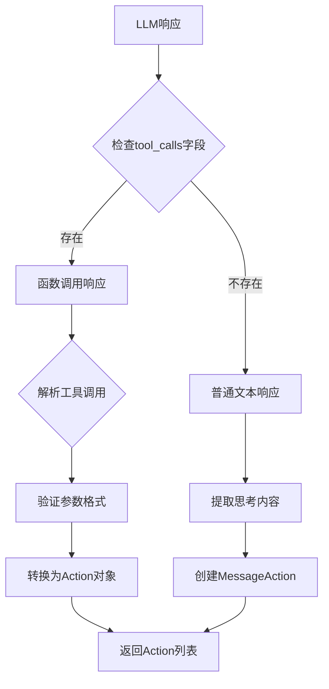
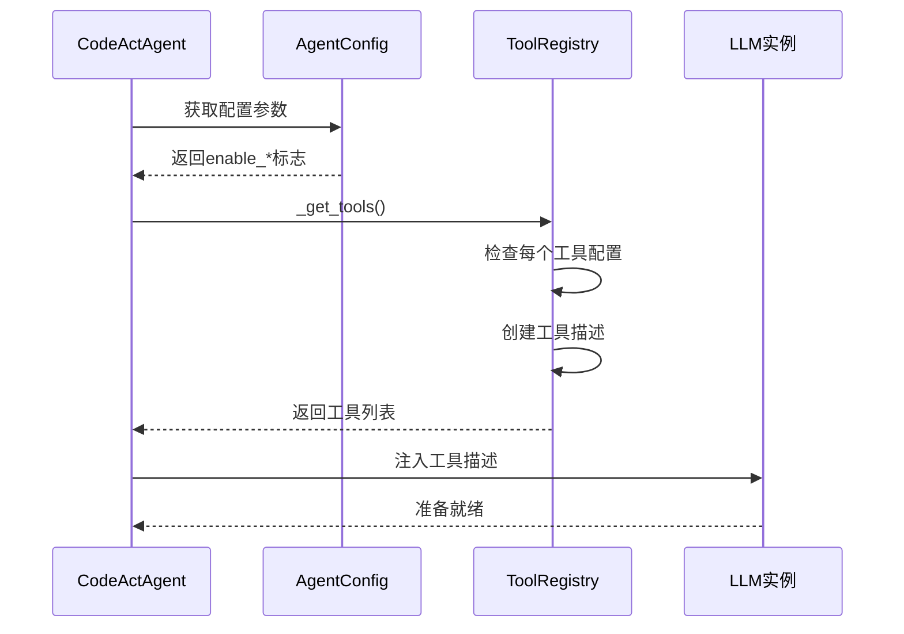
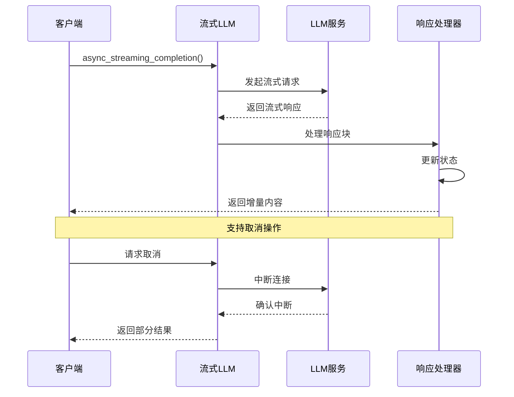
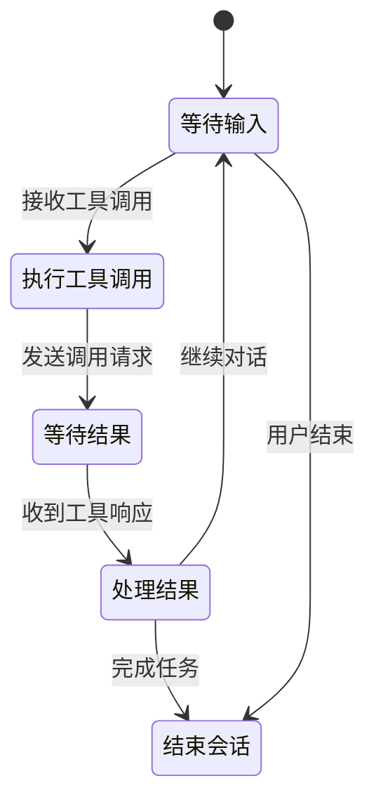
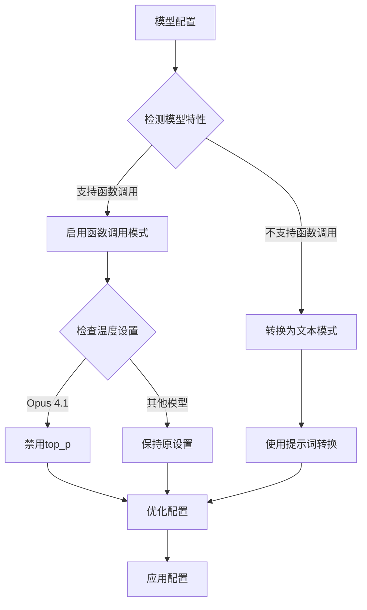

# LLM交互模式

<cite>
**本文档中引用的文件**
- [codeact_agent.py](file://openhands/agenthub/codeact_agent/codeact_agent.py)
- [function_calling.py](file://openhands/agenthub/codeact_agent/function_calling.py)
- [fn_call_converter.py](file://openhands/llm/fn_call_converter.py)
- [agent_config.py](file://openhands/core/config/agent_config.py)
- [system_prompt.j2](file://openhands/agenthub/codeact_agent/prompts/system_prompt.j2)
- [system_prompt_long_horizon.j2](file://openhands/agenthub/codeact_agent/prompts/system_prompt_long_horizon.j2)
- [llm.py](file://openhands/llm/llm.py)
- [streaming_llm.py](file://openhands/llm/streaming_llm.py)
- [async_llm.py](file://openhands/llm/async_llm.py)
- [conversation_memory.py](file://openhands/memory/conversation_memory.py)
</cite>

## 目录
1. [简介](#简介)
2. [系统提示词动态生成机制](#系统提示词动态生成机制)
3. [LLM响应解析逻辑](#llm响应解析逻辑)
4. [工具调用处理流程](#工具调用处理流程)
5. [流式响应处理](#流式响应处理)
6. [多轮函数调用管理](#多轮函数调用管理)
7. [LLM模型配置策略](#llm模型配置策略)
8. [配置示例](#配置示例)
9. [最佳实践](#最佳实践)
10. [故障排除](#故障排除)

## 简介

CodeActAgent与LLM的交互模式是OpenHands平台的核心组件，它通过动态系统提示词生成、智能响应解析和多模态工具调用来实现高效的AI代理交互。该系统支持多种LLM提供商（如GPT-4、Claude等），并能够根据配置动态调整行为模式。

## 系统提示词动态生成机制

### 配置驱动的提示词生成

CodeActAgent使用基于配置的动态提示词生成机制，根据agent_config中的设置自动注入相应的工具描述和行为约束。



**图表来源**
- [codeact_agent.py](file://openhands/agenthub/codeact_agent/codeact_agent.py#L108-L153)
- [agent_config.py](file://openhands/core/config/agent_config.py#L70-L79)

### 工具描述注入逻辑

系统根据以下配置参数动态注入工具描述：

| 配置参数 | 工具名称 | 描述注入位置 |
|---------|---------|-------------|
| `enable_browsing` | BrowserTool | 浏览器交互功能 |
| `enable_jupyter` | IPythonTool | Python代码执行环境 |
| `enable_cmd` | create_cmd_run_tool | Bash命令执行 |
| `enable_think` | ThinkTool | 思考过程记录 |
| `enable_finish` | FinishTool | 结束交互 |
| `enable_plan_mode` | task_tracker_tool | 任务跟踪管理 |

**章节来源**
- [codeact_agent.py](file://openhands/agenthub/codeact_agent/codeact_agent.py#L108-L153)

### 提示词变体管理

系统支持多种提示词变体以适应不同的使用场景：



**图表来源**
- [codeact_agent.py](file://openhands/agenthub/codeact_agent/codeact_agent.py#L98-L107)
- [agent_config.py](file://openhands/core/config/agent_config.py#L70-L79)

**章节来源**
- [system_prompt.j2](file://openhands/agenthub/codeact_agent/prompts/system_prompt.j2#L1-L114)
- [system_prompt_long_horizon.j2](file://openhands/agenthub/codeact_agent/prompts/system_prompt_long_horizon.j2#L1-L47)

## LLM响应解析逻辑

### 响应类型识别

CodeActAgent实现了智能的响应解析机制，能够区分不同类型的LLM输出：



**图表来源**
- [function_calling.py](file://openhands/agenthub/codeact_agent/function_calling.py#L73-L90)

### 函数调用解析流程

对于包含工具调用的响应，系统执行以下解析步骤：

1. **JSON参数解析**：将工具调用参数从JSON字符串转换为字典
2. **参数验证**：检查必需参数是否存在
3. **安全风险评估**：根据参数内容评估潜在安全风险
4. **Action对象创建**：将工具调用映射到具体的Action类型

**章节来源**
- [function_calling.py](file://openhands/agenthub/codeact_agent/function_calling.py#L95-L200)

### 内联命令处理

系统支持在普通文本响应中识别和处理内联命令，这些命令会被解析为相应的工具调用。

**章节来源**
- [fn_call_converter.py](file://openhands/llm/fn_call_converter.py#L845-L870)

## 工具调用处理流程

### 工具注册与发现

CodeActAgent根据配置动态注册可用工具：



**图表来源**
- [codeact_agent.py](file://openhands/agenthub/codeact_agent/codeact_agent.py#L108-L153)

### 工具调用转换机制

系统使用专门的转换器处理不同格式的工具调用：

| 转换方向 | 输入格式 | 输出格式 | 用途 |
|---------|---------|---------|------|
| 函数调用到非函数 | tool_calls数组 | 标准消息格式 | 兼容性处理 |
| 非函数到函数调用 | 文本+指令 | tool_calls格式 | 功能增强 |
| 多工具调用拆分 | 单一消息多个调用 | 多个独立消息 | 支持处理 |

**章节来源**
- [fn_call_converter.py](file://openhands/llm/fn_call_converter.py#L549-L615)

## 流式响应处理

### 异步流式处理架构

系统支持异步流式响应处理，实现实时的LLM交互体验：



**图表来源**
- [streaming_llm.py](file://openhands/llm/streaming_llm.py#L34-L97)
- [async_llm.py](file://openhands/llm/async_llm.py#L72-L106)

### 取消机制

流式响应支持用户主动取消操作，确保资源的有效利用。

**章节来源**
- [streaming_llm.py](file://openhands/llm/streaming_llm.py#L80-L96)

## 多轮函数调用管理

### 工具调用链管理

系统维护复杂的工具调用链状态，支持多轮对话中的连续工具调用：



**图表来源**
- [conversation_memory.py](file://openhands/memory/conversation_memory.py#L130-L155)

### 待处理工具调用跟踪

系统使用消息ID跟踪待完成的工具调用，确保调用链的完整性。

**章节来源**
- [conversation_memory.py](file://openhands/memory/conversation_memory.py#L253-L273)

## LLM模型配置策略

### 模型特性检测

系统根据LLM模型特性自动调整行为策略：



**图表来源**
- [llm.py](file://openhands/llm/llm.py#L191-L219)

### 模型特定优化

不同LLM模型采用特定的优化策略：

| 模型系列 | 特殊处理 | 原因 |
|---------|---------|------|
| Claude Opus 4.1 | 禁用top_p | 避免参数冲突 |
| Gemini Pro | 启用thinking预算 | 优化推理性能 |
| OpenAI o3系列 | 禁用温度参数 | 支持推理模式 |

**章节来源**
- [llm.py](file://openhands/llm/llm.py#L134-L164)

## 配置示例

### GPT-4配置示例

```toml
[llm]
model = "gpt-4"
api_key = "your-api-key"
temperature = 0.7
max_output_tokens = 4096

[agent]
enable_browsing = true
enable_jupyter = true
enable_plan_mode = true
```

### Claude配置示例

```toml
[llm]
model = "claude-3-5-sonnet-20241022"
api_key = "your-api-key"
temperature = 0.3
max_output_tokens = 4096

[agent]
enable_browsing = true
enable_jupyter = true
enable_plan_mode = true
```

### 自定义模型配置

```toml
[llm]
model = "custom-model-name"
base_url = "https://api.custom-provider.com/v1"
api_key = "your-api-key"
caching_prompt = true

[agent]
enable_browsing = false
enable_jupyter = true
enable_plan_mode = false
```

## 最佳实践

### 提示词设计原则

1. **明确角色定位**：清晰定义AI助手的角色和职责边界
2. **工具使用指导**：详细说明可用工具的功能和使用方法
3. **行为约束**：建立明确的行为准则和限制条件
4. **安全考虑**：包含安全风险评估和防护措施

### 工具配置建议

1. **按需启用**：根据具体任务需求选择合适的工具组合
2. **安全性优先**：谨慎启用可能带来安全风险的工具
3. **性能平衡**：在功能完整性和响应速度之间找到平衡点

### 响应处理优化

1. **错误处理**：实现健壮的错误处理和恢复机制
2. **超时控制**：设置合理的超时时间避免长时间等待
3. **资源管理**：有效管理内存和计算资源使用

## 故障排除

### 常见问题及解决方案

| 问题类型 | 症状 | 可能原因 | 解决方案 |
|---------|------|---------|---------|
| 工具调用失败 | 参数解析错误 | JSON格式不正确 | 检查参数格式和必需字段 |
| 提示词截断 | 内容被截断 | 上下文长度超限 | 启用对话压缩或减少历史记录 |
| 响应延迟 | 响应时间过长 | 网络或模型问题 | 检查网络连接和模型可用性 |
| 安全风险 | 高风险操作 | 参数验证不足 | 加强参数验证和安全检查 |

### 调试技巧

1. **日志记录**：启用详细的日志记录以便问题诊断
2. **分步测试**：逐步测试各个组件的功能
3. **配置验证**：验证配置文件的正确性和一致性
4. **版本兼容**：确保使用的库版本兼容

**章节来源**
- [llm.py](file://openhands/llm/llm.py#L355-L407)