# 内置工具集

<cite>
**本文档中引用的文件**  
- [codeact_agent.py](file://openhands/agenthub/codeact_agent/codeact_agent.py)
- [function_calling.py](file://openhands/agenthub/codeact_agent/function_calling.py)
- [bash.py](file://openhands/agenthub/codeact_agent/tools/bash.py)
- [browser.py](file://openhands/agenthub/codeact_agent/tools/browser.py)
- [finish.py](file://openhands/agenthub/codeact_agent/tools/finish.py)
- [ipython.py](file://openhands/agenthub/codeact_agent/tools/ipython.py)
- [str_replace_editor.py](file://openhands/agenthub/codeact_agent/tools/str_replace_editor.py)
- [llm_based_edit.py](file://openhands/agenthub/codeact_agent/tools/llm_based_edit.py)
- [task_tracker.py](file://openhands/agenthub/codeact_agent/tools/task_tracker.py)
- [think.py](file://openhands/agenthub/codeact_agent/tools/think.py)
- [security_utils.py](file://openhands/agenthub/codeact_agent/tools/security_utils.py)
- [tool_names.py](file://openhands/llm/tool_names.py)
</cite>

## 目录
1. [简介](#简介)
2. [工具实现原理与功能边界](#工具实现原理与功能边界)
   1. [bash工具](#bash工具)
   2. [IPython工具](#ipython工具)
   3. [Browser工具](#browser工具)
   4. [文件编辑工具](#文件编辑工具)
   5. [Finish工具](#finish工具)
   6. [TaskTracker工具](#tasktracker工具)
3. [函数调用机制](#函数调用机制)
   1. [工具描述生成](#工具描述生成)
   2. [参数解析](#参数解析)
   3. [执行结果格式化](#执行结果格式化)
4. [工具配置](#工具配置)
5. [安全性考虑](#安全性考虑)
6. [工具协作关系](#工具协作关系)

## 简介

CodeActAgent的内置工具集为智能体提供了与环境交互的核心能力。这些工具通过函数调用机制与大型语言模型（LLM）进行交互，使智能体能够执行各种任务，从执行命令到管理复杂的工作流。本文档详细说明了每个工具的实现原理、功能边界以及它们如何协同工作。

**Section sources**
- [codeact_agent.py](file://openhands/agenthub/codeact_agent/codeact_agent.py#L1-L301)
- [README.md](file://openhands/agenthub/codeact_agent/README.md#L1-L66)

## 工具实现原理与功能边界

### bash工具

bash工具允许CodeActAgent在终端中执行Linux bash命令。该工具通过`create_cmd_run_tool`函数创建，支持详细的命令执行描述和安全风险评估。

**功能特性：**
- **单命令执行**：一次只能执行一个bash命令。如果需要顺序执行多个命令，可以使用`&&`或`;`将它们链接在一起。
- **持久会话**：命令在持久的shell会话中执行，环境变量、虚拟环境和工作目录在命令之间保持不变。
- **超时处理**：命令有10秒的软超时，达到后可以选择继续或中断命令。
- **后台执行**：对于可能无限期运行的命令，建议在后台运行并重定向输出到文件。
- **交互式进程**：如果命令返回退出码-1，表示进程尚未完成，可以通过设置`is_input`为`true`与运行中的进程交互。

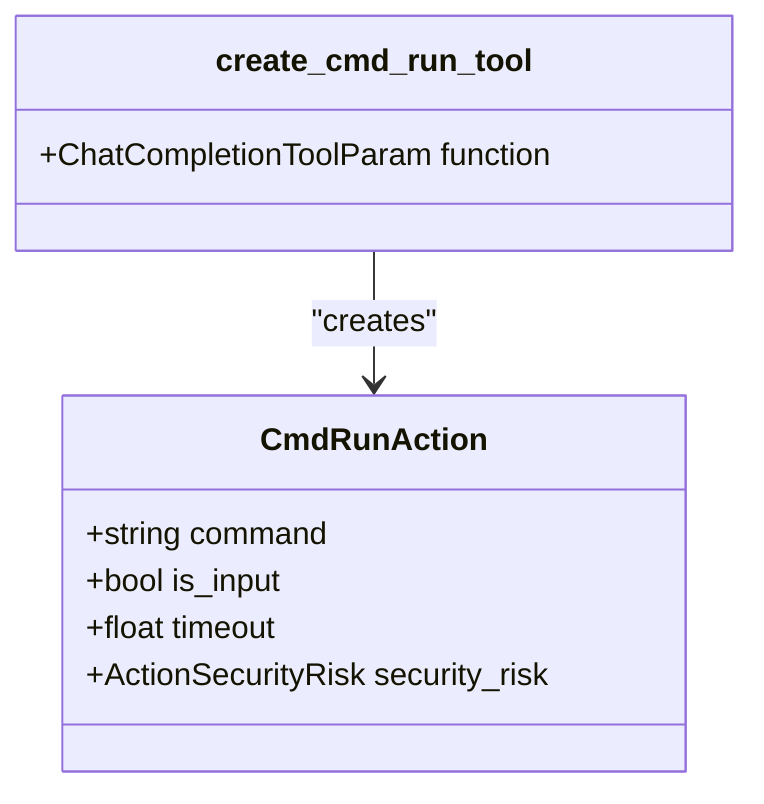

**Diagram sources**
- [bash.py](file://openhands/agenthub/codeact_agent/tools/bash.py#L1-L83)
- [codeact_agent.py](file://openhands/agenthub/codeact_agent/codeact_agent.py#L126-L127)

### IPython工具

IPython工具允许CodeActAgent在IPython环境中运行Python代码。该工具通过`IPythonTool`常量定义，支持魔法命令如`%pip`。

**功能特性：**
- **变量作用域**：在IPython环境中定义的变量仅在该环境中可用。
- **包导入**：需要在使用前定义变量和导入包。
- **持久状态**：变量和导入在会话中保持持久。

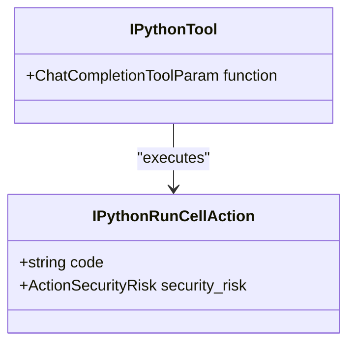

**Diagram sources**
- [ipython.py](file://openhands/agenthub/codeact_agent/tools/ipython.py#L1-L35)
- [codeact_agent.py](file://openhands/agenthub/codeact_agent/codeact_agent.py#L139-L140)

### Browser工具

Browser工具允许CodeActAgent通过Python代码与网页交互。该工具通过`BrowserTool`常量定义，支持多种浏览器操作。

**功能特性：**
- **导航**：支持`goto`、`go_back`、`go_forward`等导航操作。
- **表单交互**：支持`fill`、`select_option`、`click`、`dblclick`等表单交互操作。
- **滚动**：支持`scroll`操作进行页面滚动。
- **文件上传**：支持`upload_file`操作上传文件。
- **拖放**：支持`drag_and_drop`操作进行拖放。

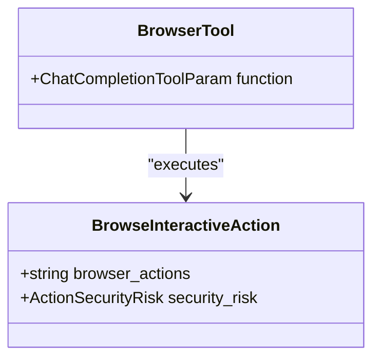

**Diagram sources**
- [browser.py](file://openhands/agenthub/codeact_agent/tools/browser.py#L1-L172)
- [codeact_agent.py](file://openhands/agenthub/codeact_agent/codeact_agent.py#L134-L138)

### 文件编辑工具

文件编辑工具允许CodeActAgent查看、创建和编辑文件。有两种实现方式：基于LLM的文件编辑和字符串替换编辑。

**功能特性：**
- **字符串替换编辑**：通过`create_str_replace_editor_tool`函数创建，支持查看、创建和编辑文件。
- **精确匹配**：`old_str`参数必须与文件内容完全匹配，包括所有空白和缩进。
- **唯一性**：`old_str`必须唯一标识文件中的单个实例。
- **撤销功能**：支持`undo_edit`命令撤销最后一次编辑。

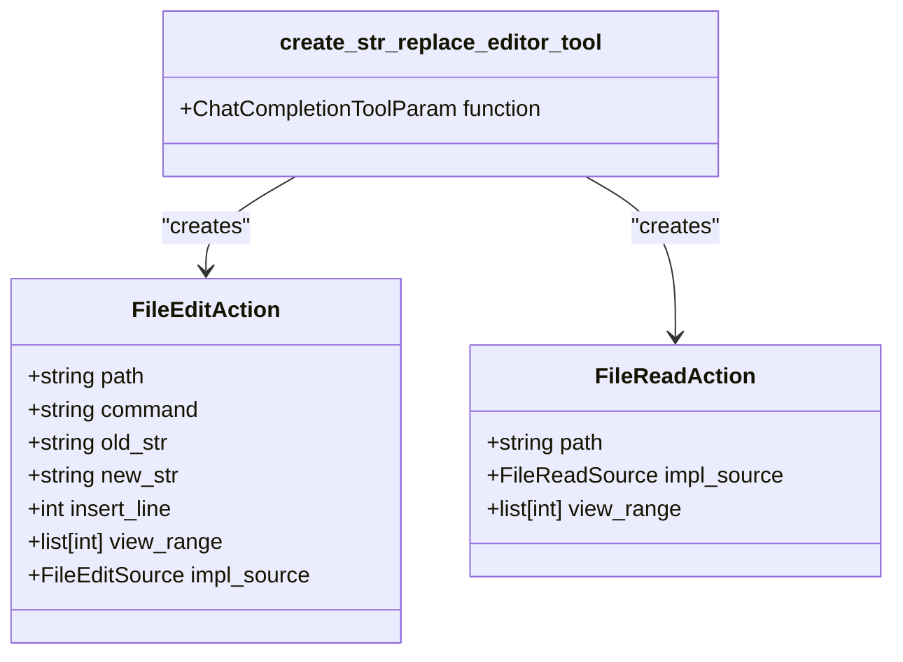

**Diagram sources**
- [str_replace_editor.py](file://openhands/agenthub/codeact_agent/tools/str_replace_editor.py#L1-L162)
- [llm_based_edit.py](file://openhands/agenthub/codeact_agent/tools/llm_based_edit.py#L1-L156)

### Finish工具

Finish工具用于信号当前任务或对话的完成。该工具通过`FinishTool`常量定义，允许智能体在完成任务时发送最终消息。

**功能特性：**
- **任务完成**：当成功完成用户请求的任务时使用。
- **无法继续**：当由于技术限制或缺少信息而无法继续时使用。
- **消息内容**：消息应包括操作摘要、用户下一步操作、未完成任务的解释以及任何后续问题。

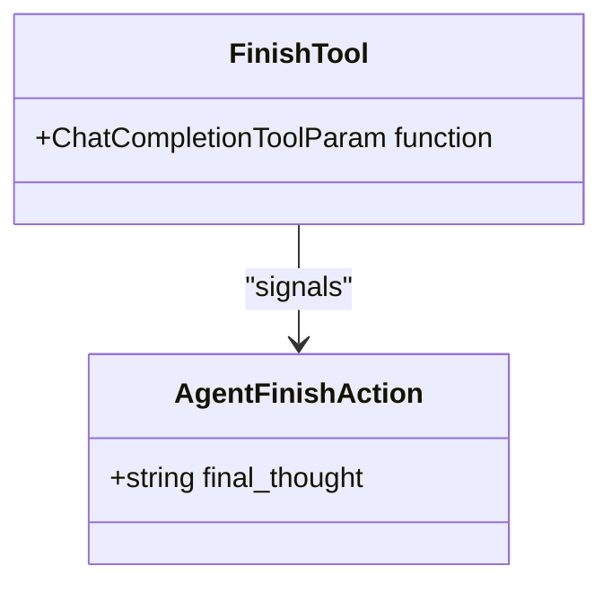

**Diagram sources**
- [finish.py](file://openhands/agenthub/codeact_agent/tools/finish.py#L1-L35)
- [codeact_agent.py](file://openhands/agenthub/codeact_agent/codeact_agent.py#L130-L131)

### TaskTracker工具

TaskTracker工具提供结构化的任务管理能力，用于开发工作流。该工具通过`create_task_tracker_tool`函数创建，支持任务列表的创建和更新。

**功能特性：**
- **多阶段开发**：适用于涉及多个顺序或并行活动的项目。
- **复杂实现**：适用于需要系统规划和跨多个组件协调的复杂工作。
- **状态管理**：支持`todo`、`in_progress`和`done`状态。
- **单一焦点**：任何时候都应保持单一活动任务的焦点。

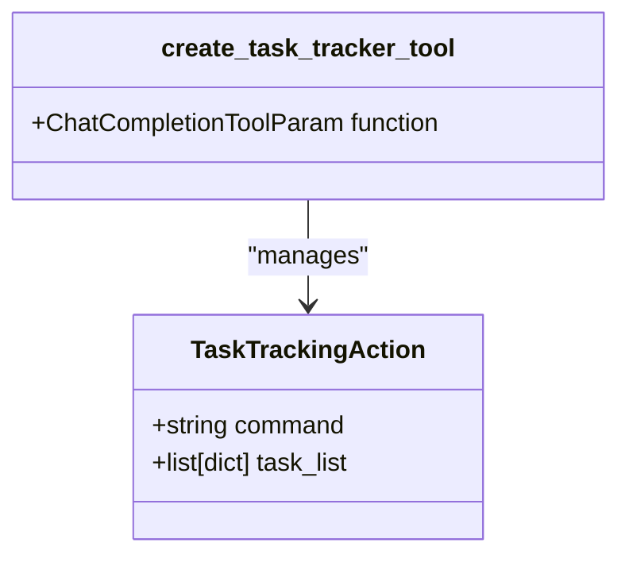

**Diagram sources**
- [task_tracker.py](file://openhands/agenthub/codeact_agent/tools/task_tracker.py#L1-L204)
- [codeact_agent.py](file://openhands/agenthub/codeact_agent/codeact_agent.py#L142-L143)

## 函数调用机制

### 工具描述生成

工具描述通过在工具定义文件中定义的常量和函数生成。每个工具都有详细的描述，包括使用指南、最佳实践和安全考虑。

**实现方式：**
- **详细描述**：对于大多数模型，使用详细的工具描述。
- **简短描述**：对于特定模型（如gpt-4、o3、o1、o4），使用简短的工具描述以避免超出OpenAI的工具描述令牌限制。

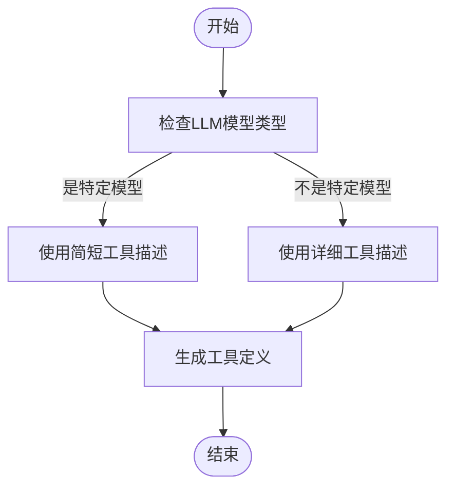

**Diagram sources**
- [codeact_agent.py](file://openhands/agenthub/codeact_agent/codeact_agent.py#L110-L124)
- [bash.py](file://openhands/agenthub/codeact_agent/tools/bash.py#L10-L39)

### 参数解析

参数解析在`response_to_actions`函数中实现，该函数将LLM的响应转换为具体的动作。

**实现方式：**
- **JSON解析**：使用`json.loads`解析工具调用参数。
- **验证**：验证必需参数是否存在。
- **类型转换**：将参数转换为正确的类型（如将字符串转换为布尔值）。

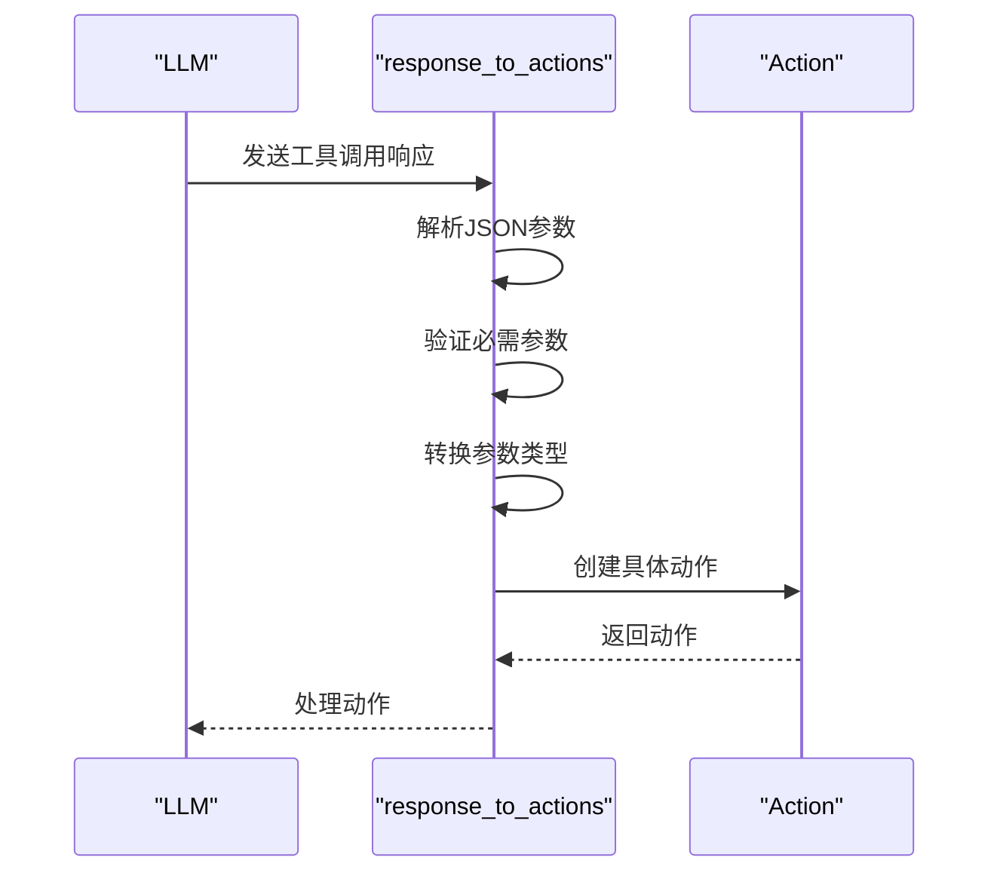

**Diagram sources**
- [function_calling.py](file://openhands/agenthub/codeact_agent/function_calling.py#L73-L339)
- [codeact_agent.py](file://openhands/agenthub/codeact_agent/codeact_agent.py#L296-L300)

### 执行结果格式化

执行结果通过将LLM的响应转换为具体的动作对象来格式化。每个工具调用都会生成一个对应的动作对象。

**实现方式：**
- **动作创建**：根据工具调用名称创建相应的动作对象。
- **元数据添加**：为动作添加工具调用元数据，包括工具调用ID、函数名称和模型响应。
- **响应ID**：为所有动作添加响应ID，以便与令牌使用数据匹配。

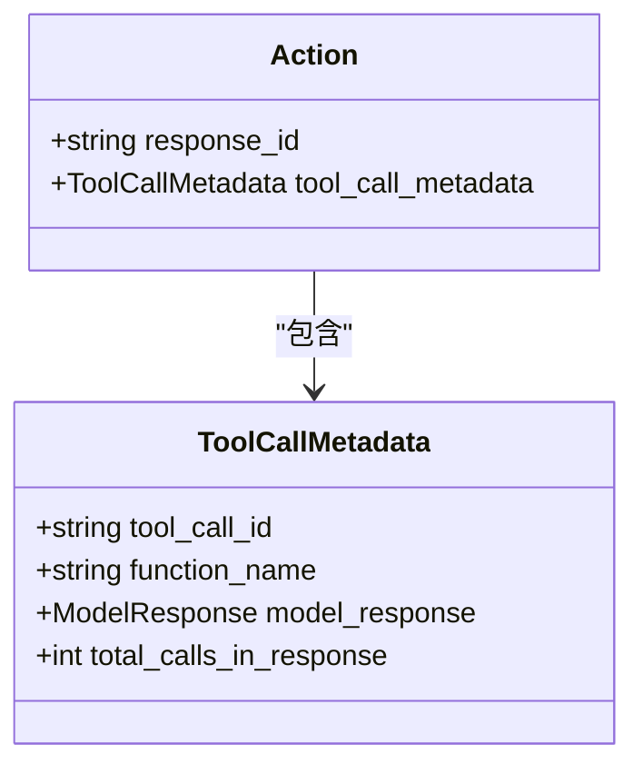

**Diagram sources**
- [function_calling.py](file://openhands/agenthub/codeact_agent/function_calling.py#L314-L320)
- [codeact_agent.py](file://openhands/agenthub/codeact_agent/codeact_agent.py#L330-L337)

## 工具配置

工具可以通过`agent_config`中的配置参数启用或禁用。每个工具都有对应的配置选项。

**配置示例：**

```python
from openhands.core.config import AgentConfig

# 创建代理配置
config = AgentConfig(
    enable_cmd=True,           # 启用bash命令
    enable_jupyter=True,       # 启用IPython
    enable_finish=True,        # 启用Finish工具
    enable_browsing=True,      # 启用浏览器交互
    enable_editor=True,        # 启用字符串替换编辑器
    enable_plan_mode=True,     # 启用计划模式（TaskTracker）
    enable_think=True,         # 启用思考工具
    enable_condensation_request=True  # 启用压缩请求
)

# 创建CodeActAgent实例
agent = CodeActAgent(config=config, llm_registry=llm_registry)
```

**配置参数说明：**
- `enable_cmd`：启用bash命令执行
- `enable_jupyter`：启用IPython代码执行
- `enable_finish`：启用Finish工具
- `enable_browsing`：启用浏览器交互工具
- `enable_editor`：启用字符串替换编辑器
- `enable_plan_mode`：启用计划模式（使用TaskTracker工具）
- `enable_think`：启用思考工具
- `enable_condensation_request`：启用压缩请求

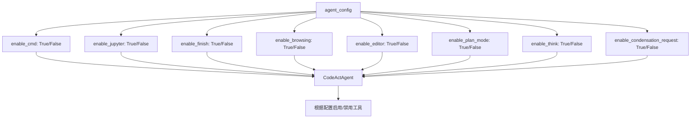

**Diagram sources**
- [codeact_agent.py](file://openhands/agenthub/codeact_agent/codeact_agent.py#L126-L147)
- [function_calling.py](file://openhands/agenthub/codeact_agent/function_calling.py#L73-L339)

## 安全性考虑

CodeActAgent的工具集实现了多层次的安全性考虑，以防止潜在的安全风险。

**安全特性：**
- **安全风险评估**：每个工具都支持安全风险评估，LLM可以评估每个动作的安全风险级别。
- **风险级别**：定义了三种风险级别：LOW、MEDIUM、HIGH。
- **沙箱执行**：bash命令在沙箱环境中执行，限制了对主机系统的直接访问。
- **代码注入防护**：通过严格的参数验证和输入检查防止代码注入攻击。

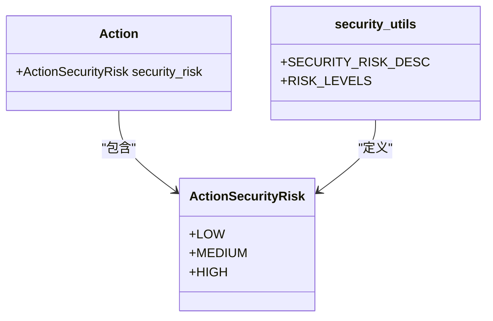

**安全风险描述：**
- **LOW**：低风险操作，如读取文件或查看状态。
- **MEDIUM**：中等风险操作，如修改配置文件或执行非关键命令。
- **HIGH**：高风险操作，如删除文件、修改系统配置或执行网络请求。

**安全措施：**
- **输入验证**：所有工具调用参数都经过严格验证，确保符合预期格式。
- **权限限制**：在沙箱环境中执行命令，限制了对敏感系统资源的访问。
- **审计日志**：记录所有工具调用和执行结果，便于审计和故障排除。

**Section sources**
- [security_utils.py](file://openhands/agenthub/codeact_agent/tools/security_utils.py#L1-L11)
- [bash.py](file://openhands/agenthub/codeact_agent/tools/bash.py#L73-L77)
- [ipython.py](file://openhands/agenthub/codeact_agent/tools/ipython.py#L25-L29)

## 工具协作关系

CodeActAgent的工具集设计为协同工作，形成一个完整的任务执行和管理生态系统。

**协作模式：**
- **TaskTracker与Finish工具**：TaskTracker工具用于管理复杂任务的状态，而Finish工具用于在任务完成后发送最终消息。
- **文件编辑与bash工具**：文件编辑工具用于修改代码，而bash工具用于执行编译或测试命令。
- **IPython与文件编辑工具**：IPython工具用于测试代码片段，而文件编辑工具用于将经过验证的代码集成到项目中。

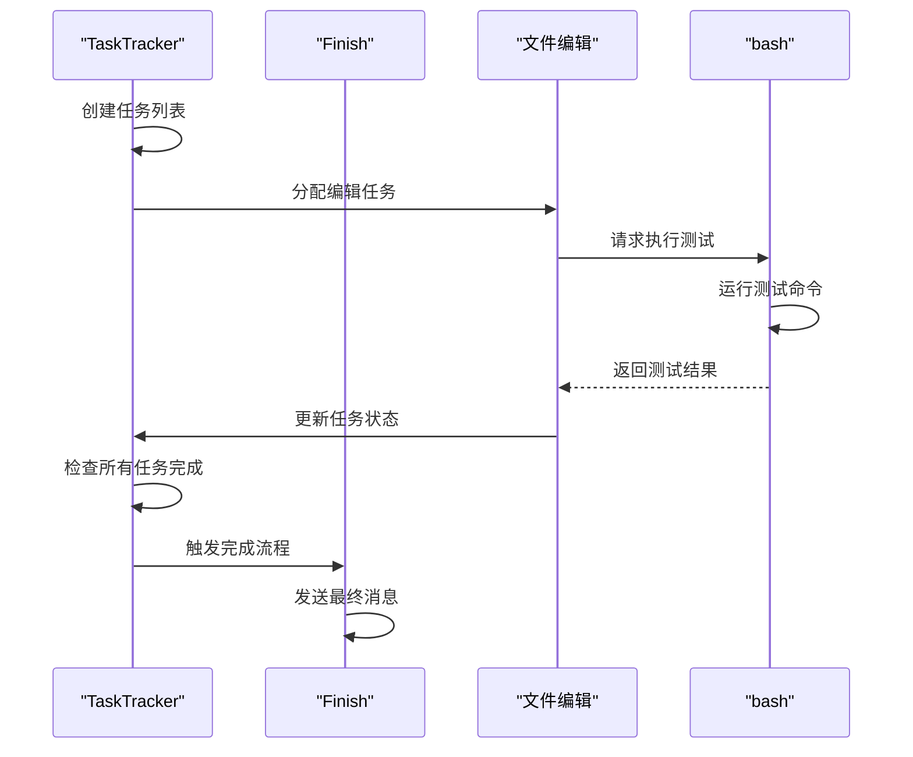

**协作示例：**
1. **任务规划**：用户请求实现一个新功能。
2. **任务分解**：TaskTracker工具将任务分解为多个子任务。
3. **代码编辑**：文件编辑工具用于实现各个子任务。
4. **测试执行**：bash工具用于执行单元测试。
5. **状态更新**：TaskTracker工具跟踪每个子任务的进度。
6. **任务完成**：当所有子任务完成后，Finish工具发送最终消息。

**Section sources**
- [task_tracker.py](file://openhands/agenthub/codeact_agent/tools/task_tracker.py#L1-L204)
- [finish.py](file://openhands/agenthub/codeact_agent/tools/finish.py#L1-L35)
- [codeact_agent.py](file://openhands/agenthub/codeact_agent/codeact_agent.py#L142-L143)