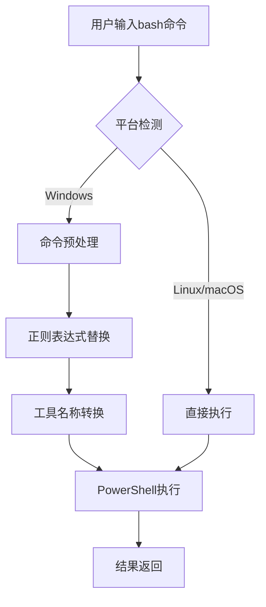
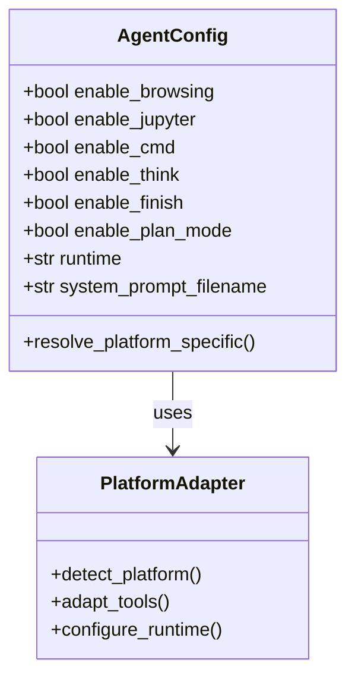
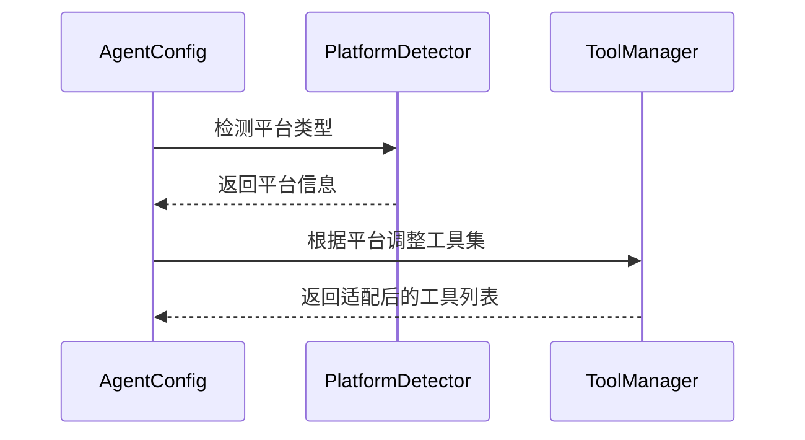
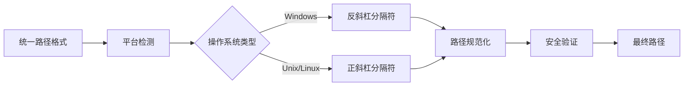
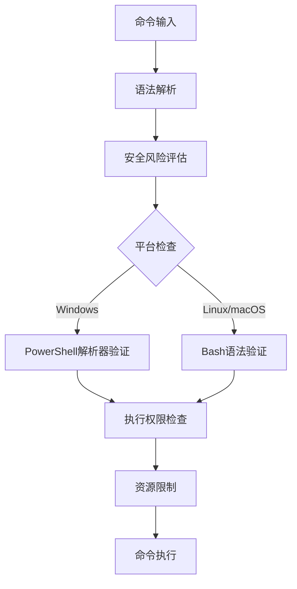
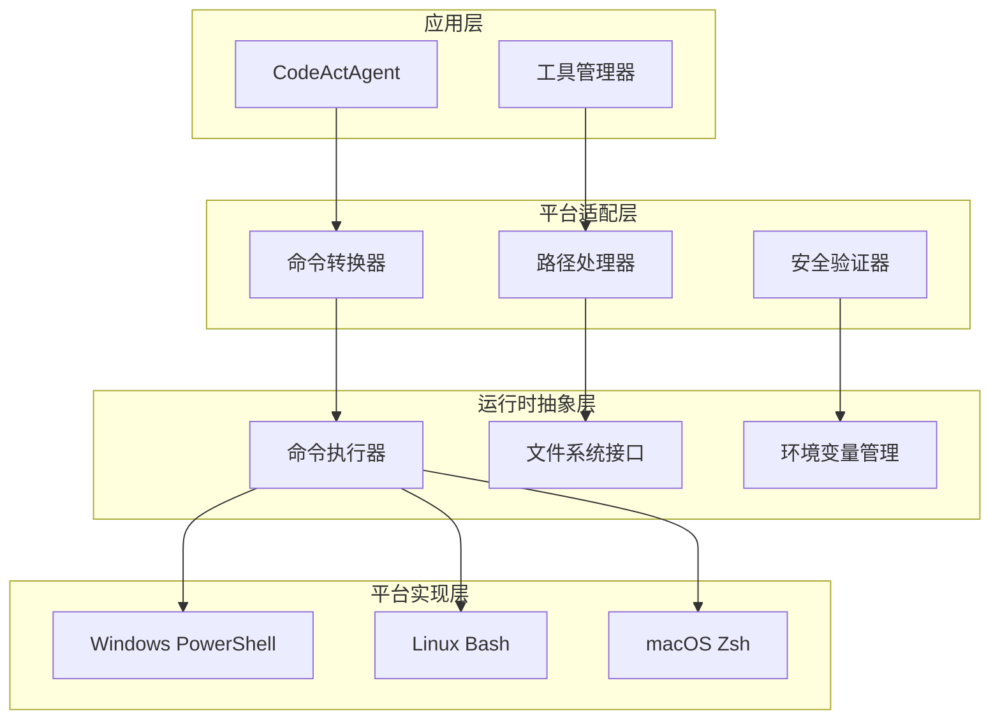
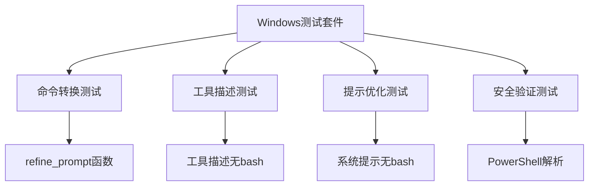

# 平台兼容性

<cite>
**本文档中引用的文件**
- [codeact_agent.py](file://openhands/agenthub/codeact_agent/codeact_agent.py)
- [bash.py](file://openhands/agenthub/codeact_agent/tools/bash.py)
- [prompt.py](file://openhands/agenthub/codeact_agent/tools/prompt.py)
- [agent_config.py](file://openhands/core/config/agent_config.py)
- [windows_bash.py](file://openhands/runtime/utils/windows_bash.py)
- [security_utils.py](file://openhands/agenthub/codeact_agent/tools/security_utils.py)
- [test_windows_prompt_refinement.py](file://tests/unit/agenthub/test_windows_prompt_refinement.py)
- [test_function_calling.py](file://tests/unit/agenthub/test_function_calling.py)
- [test_security.py](file://tests/unit/security/test_security.py)
- [file_ops.py](file://openhands/runtime/plugins/agent_skills/file_ops/file_ops.py)
- [path-component.tsx](file://frontend/src/components/features/chat/path-component.tsx)
- [get-language-from-path.ts](file://frontend/src/utils/get-language-from-path.ts)
</cite>

## 目录
1. [概述](#概述)
2. [Windows系统上的PowerShell命令转换](#windows系统上的powershell命令转换)
3. [agent_config中的platform参数](#agent_config中的platform参数)
4. [跨平台文件路径处理](#跨平台文件路径处理)
5. [安全工具的平台适配](#安全工具的平台适配)
6. [架构设计与实现](#架构设计与实现)
7. [测试与验证](#测试与验证)
8. [最佳实践](#最佳实践)

## 概述

CodeActAgent是一个跨平台的智能代理系统，能够在不同的操作系统环境中无缝运行。该系统通过多层次的平台适配机制，确保在Windows、Linux和macOS等不同平台上都能提供一致的功能体验。核心特性包括：

- **智能命令转换**：自动将bash命令转换为PowerShell命令（仅限Windows）
- **统一接口抽象**：提供跨平台的操作接口
- **安全风险评估**：针对不同平台的安全策略
- **文件系统适配**：处理不同操作系统的文件路径差异

## Windows系统上的PowerShell命令转换

### 自动命令映射机制

CodeActAgent在Windows平台上实现了智能的bash到PowerShell命令转换机制。这一机制通过多个层面的适配来确保命令的正确执行：

**图表来源**
- [prompt.py](file://openhands/agenthub/codeact_agent/tools/prompt.py#L5-L28)
- [bash.py](file://openhands/agenthub/codeact_agent/tools/bash.py#L42-L83)

### 命令转换规则

系统使用精确的正则表达式匹配来实现命令转换：

| 转换类型 | 源模式 | 目标模式 | 示例 |
|---------|--------|----------|------|
| 工具名称 | `execute_bash` | `execute_powershell` | `execute_bash` → `execute_powershell` |
| 命令文本 | `bash` | `powershell` | `bash -c "echo hello"` → `powershell -Command "echo hello"` |
| 保留词汇 | 包含`bash`但非独立词 | 保持不变 | `bashful` → `bashful` |

### 实现细节

转换逻辑的核心实现在[`refine_prompt`](file://openhands/agenthub/codeact_agent/tools/prompt.py#L5-L28)函数中：

- **平台识别**：使用`sys.platform == 'win32'`进行Windows检测
- **精确匹配**：使用单词边界`\b`确保只替换独立的`bash`实例
- **工具名称特殊处理**：优先替换`execute_bash`为`execute_powershell`

**章节来源**
- [prompt.py](file://openhands/agenthub/codeact_agent/tools/prompt.py#L5-L28)

## agent_config中的platform参数

### 配置系统架构

CodeActAgent的配置系统通过`AgentConfig`类提供了灵活的平台适配能力。虽然没有显式的`platform`参数，但系统通过多个配置选项实现平台感知：

**图表来源**
- [agent_config.py](file://openhands/core/config/agent_config.py#L15-L159)

### 运行时配置

关键的平台相关配置通过以下字段控制：

| 配置项 | 默认值 | 平台影响 | 描述 |
|--------|--------|----------|------|
| `enable_browsing` | `true` | Windows | Windows运行时不支持浏览器功能 |
| `enable_jupyter` | `true` | 通用 | Jupyter支持依赖于运行时类型 |
| `enable_cmd` | `true` | 通用 | 命令执行工具 |
| `runtime` | `None` | 通用 | 指定运行时类型（docker/local/cli） |

### 动态配置适配

系统在初始化时会根据平台特性动态调整配置：

**图表来源**
- [codeact_agent.py](file://openhands/agenthub/codeact_agent/codeact_agent.py#L108-L153)

**章节来源**
- [agent_config.py](file://openhands/core/config/agent_config.py#L15-L159)
- [codeact_agent.py](file://openhands/agenthub/codeact_agent/codeact_agent.py#L108-L153)

## 跨平台文件路径处理

### 路径分隔符适配

系统通过多层抽象处理不同操作系统的文件路径差异：

**图表来源**
- [path-component.tsx](file://frontend/src/components/features/chat/path-component.tsx#L20-L28)
- [file_ops.py](file://openhands/runtime/plugins/agent_skills/file_ops/file_ops.py#L41-L53)

### 文件名验证机制

系统实现了严格的文件名验证来防止路径遍历攻击：

| 操作系统 | 无效字符 | 验证规则 | 示例 |
|----------|----------|----------|------|
| Windows | `< > : " / \ \| ? *` | 禁止所有非法字符 | `file<name>.txt` → 错误 |
| Unix/Linux | `\0` | 禁止空字符 | `file\0name` → 错误 |

### 前端路径显示组件

前端实现了智能的路径显示组件，能够正确处理不同平台的路径格式：

- **HTML实体解码**：防止XSS攻击
- **目录判断**：基于扩展名和路径结构
- **截断显示**：长路径的友好展示

**章节来源**
- [path-component.tsx](file://frontend/src/components/features/chat/path-component.tsx#L1-L89)
- [file_ops.py](file://openhands/runtime/plugins/agent_skills/file_ops/file_ops.py#L41-L53)

## 安全工具的平台适配

### 多层次安全验证

CodeActAgent实现了全面的安全验证体系，针对不同平台采用相应的安全策略：

**图表来源**
- [security_utils.py](file://openhands/agenthub/codeact_agent/tools/security_utils.py#L1-L11)
- [test_security.py](file://tests/unit/security/test_security.py#L128-L302)

### 安全风险等级

系统定义了标准化的安全风险评估体系：

| 风险级别 | 数值范围 | 描述 | 典型场景 |
|----------|----------|------|----------|
| LOW | 0 | 低风险操作 | 文件查看、简单命令 |
| MEDIUM | 1 | 中等风险操作 | 文件修改、网络访问 |
| HIGH | 2 | 高风险操作 | 系统配置、权限提升 |

### 平台特定的安全措施

#### Windows平台安全特性

- **PowerShell解析器验证**：使用.NET PowerShell SDK进行语法分析
- **执行策略检查**：验证脚本执行权限
- **进程隔离**：限制PowerShell进程的系统访问权限

#### Linux/macOS平台安全特性

- **Bash语法验证**：标准的shell语法检查
- **权限模拟**：模拟用户权限环境
- **资源监控**：实时监控资源使用情况

**章节来源**
- [security_utils.py](file://openhands/agenthub/codeact_agent/tools/security_utils.py#L1-L11)
- [test_security.py](file://tests/unit/security/test_security.py#L128-L302)

## 架构设计与实现

### 分层架构设计

CodeActAgent采用分层架构来实现平台兼容性：

**图表来源**
- [codeact_agent.py](file://openhands/agenthub/codeact_agent/codeact_agent.py#L49-L98)
- [windows_bash.py](file://openhands/runtime/utils/windows_bash.py#L179-L200)

### 关键组件交互

各个组件之间的交互遵循明确的协议：

1. **命令转换流程**：输入 → 平台检测 → 命令转换 → 执行适配
2. **工具加载机制**：配置解析 → 平台适配 → 工具注册
3. **安全验证流程**：输入捕获 → 风险评估 → 权限检查 → 执行授权

**章节来源**
- [codeact_agent.py](file://openhands/agenthub/codeact_agent/codeact_agent.py#L49-L98)
- [windows_bash.py](file://openhands/runtime/utils/windows_bash.py#L179-L200)

## 测试与验证

### Windows平台专门测试

系统包含专门的Windows平台测试套件，确保平台适配的正确性：

**图表来源**
- [test_windows_prompt_refinement.py](file://tests/unit/agenthub/test_windows_prompt_refinement.py#L1-L179)

### 跨平台兼容性验证

测试覆盖了以下关键场景：

- **命令转换准确性**：验证bash到PowerShell的正确转换
- **工具描述一致性**：确保工具描述中不包含平台特定术语
- **安全策略有效性**：测试不同平台的安全验证机制
- **文件操作兼容性**：验证跨平台文件操作的一致性

**章节来源**
- [test_windows_prompt_refinement.py](file://tests/unit/agenthub/test_windows_prompt_refinement.py#L1-L179)
- [test_function_calling.py](file://tests/unit/agenthub/test_function_calling.py#L48-L78)

## 最佳实践

### 开发建议

1. **平台无关编程**：避免硬编码平台特定的路径和命令
2. **条件功能启用**：根据平台特性有条件地启用功能
3. **错误处理**：为不同平台的异常情况提供适当的处理
4. **测试覆盖**：在目标平台上充分测试功能

### 部署考虑

- **运行时选择**：根据目标平台选择合适的运行时环境
- **依赖管理**：确保平台特定的依赖正确安装
- **性能优化**：针对不同平台的特性进行性能调优
- **监控告警**：建立跨平台的监控和告警机制

### 维护策略

- **定期更新**：及时更新平台特定的依赖和工具
- **兼容性测试**：持续进行跨平台兼容性测试
- **文档维护**：保持平台适配文档的及时更新
- **社区反馈**：积极收集和响应平台相关的用户反馈

通过这些平台兼容性设计，CodeActAgent能够在不同操作系统环境中提供一致、安全、高效的用户体验，同时保持代码的可维护性和扩展性。