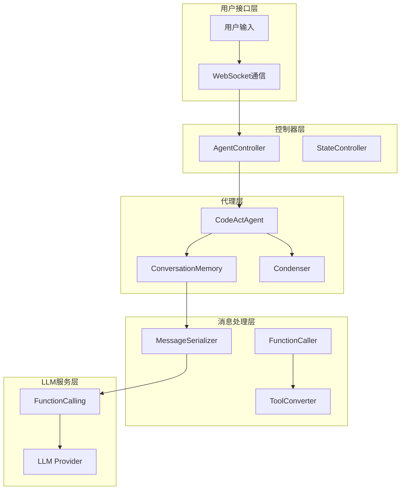
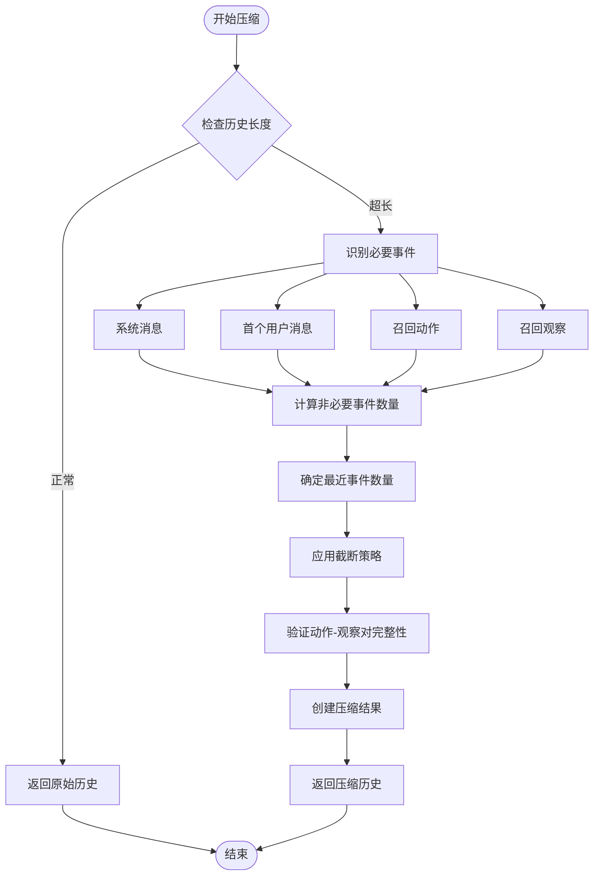
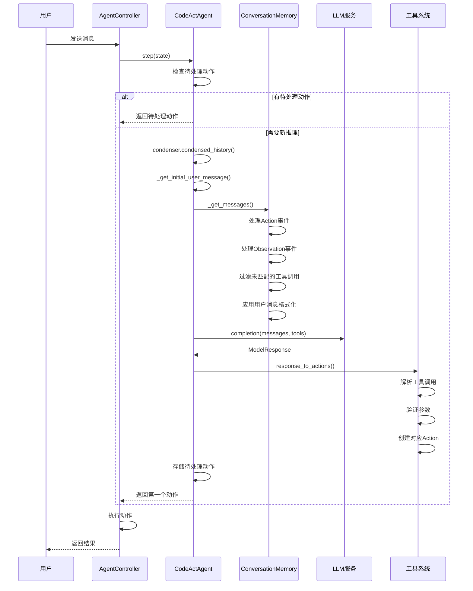
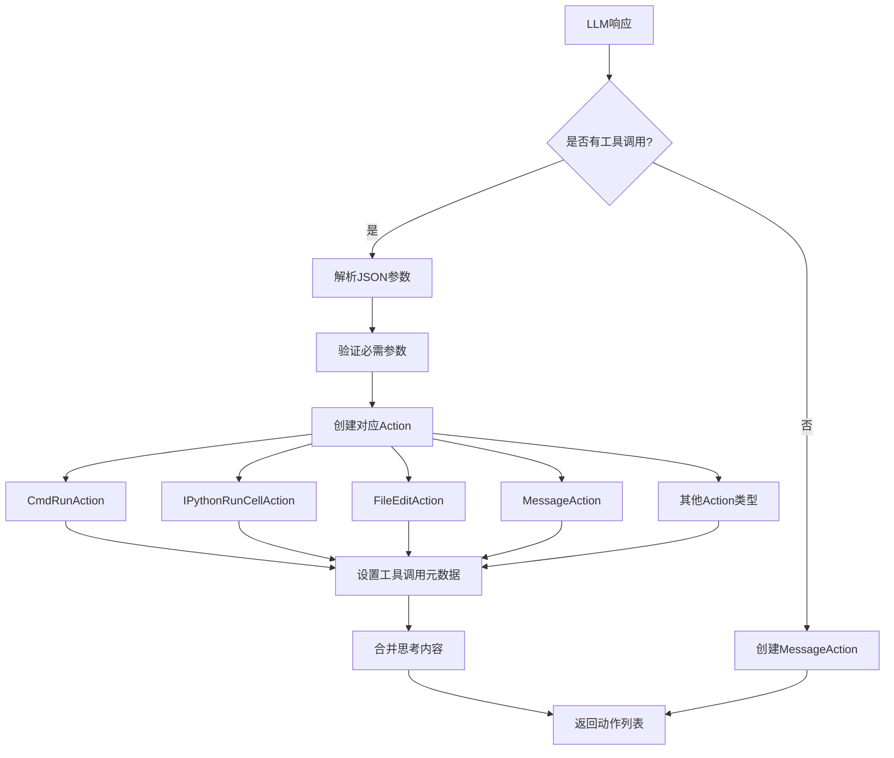
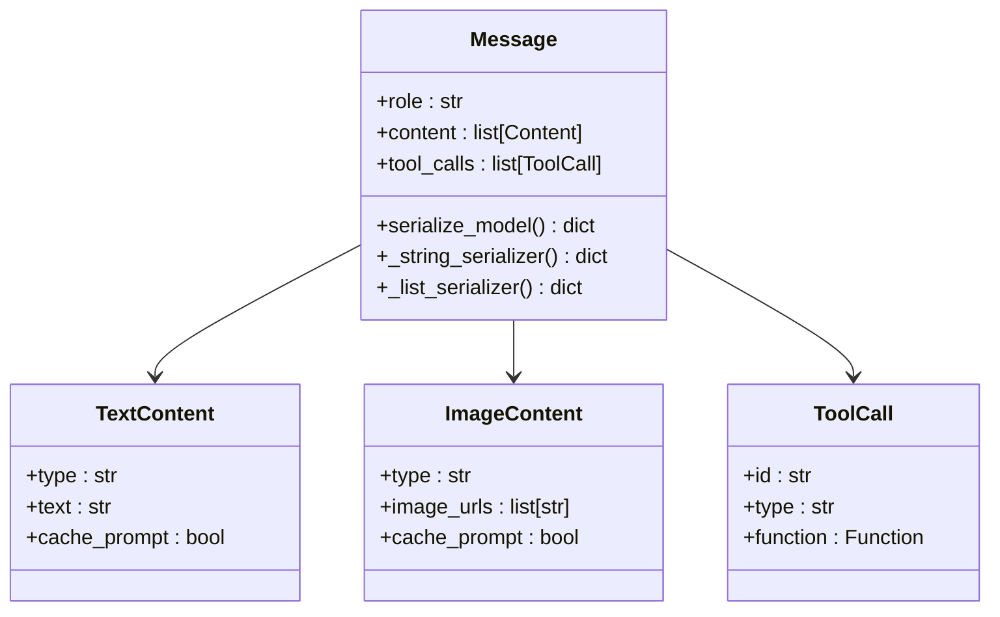
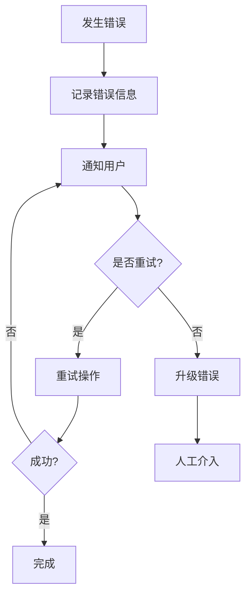

# CodeActAgent消息处理流程深度分析

<cite>
**本文档引用的文件**
- [codeact_agent.py](file://openhands/agenthub/codeact_agent/codeact_agent.py)
- [function_calling.py](file://openhands/agenthub/codeact_agent/function_calling.py)
- [conversation_memory.py](file://openhands/memory/conversation_memory.py)
- [condenser.py](file://openhands/memory/condenser/condenser.py)
- [conversation_window_condenser.py](file://openhands/memory/condenser/impl/conversation_window_condenser.py)
- [message.py](file://openhands/core/message.py)
- [message_format.md](file://openhands/core/message_format.md)
- [fn_call_converter.py](file://openhands/llm/fn_call_converter.py)
- [message.py](file://openhands/events/action/message.py)
- [agent_controller.py](file://openhands/controller/agent_controller.py)
</cite>

## 目录
1. [概述](#概述)
2. [系统架构](#系统架构)
3. [_condensed_history_方法详解](#_condensed_history_方法详解)
4. [消息处理生命周期](#消息处理生命周期)
5. [函数调用序列化机制](#函数调用序列化机制)
6. [实际交互示例](#实际交互示例)
7. [性能优化策略](#性能优化策略)
8. [总结](#总结)

## 概述

CodeActAgent是OpenHands项目中的核心智能代理，采用统一的代码行动空间（CodeAct）理念，将LLM代理的行动整合到一个统一的代码操作中。该代理通过复杂的对话历史压缩、消息预处理、工具调用决策和响应解析等机制，实现了高效的LLM交互。

## 系统架构

CodeActAgent的消息处理系统采用分层架构设计，主要包含以下核心组件：



**图表来源**
- [codeact_agent.py](file://openhands/agenthub/codeact_agent/codeact_agent.py#L49-L301)
- [agent_controller.py](file://openhands/controller/agent_controller.py#L402-L444)

**章节来源**
- [codeact_agent.py](file://openhands/agenthub/codeact_agent/codeact_agent.py#L49-L301)
- [conversation_memory.py](file://openhands/memory/conversation_memory.py#L56-L200)

## _condensed_history_方法详解

### 触发条件

`_condensed_history_`方法是CodeActAgent的核心历史压缩机制，负责在对话历史过长时进行智能压缩。该方法的触发条件主要包括：

1. **历史长度阈值**：当对话历史超过配置的最大长度限制时
2. **内存压力检测**：系统检测到LLM上下文窗口接近饱和
3. **性能优化需求**：为提高推理速度而主动压缩历史

### 压缩策略

#### 1. 必要事件保留策略

系统采用"Essential Events"保留策略，确保关键信息不被丢失：



**图表来源**
- [conversation_window_condenser.py](file://openhands/memory/condenser/impl/conversation_window_condenser.py#L20-L175)

#### 2. 对话窗口截断算法

系统采用动态截断算法，根据历史长度和事件类型智能分配保留空间：

- **必要事件固定保留**：系统消息、首个用户消息、召回相关事件
- **非必要事件按比例截断**：通常保留历史的50%，确保上下文连续性
- **动作-观察对完整性保护**：确保每个动作都有对应的观察结果

#### 3. 压缩结果格式

压缩后的结果有两种形式：
- **View对象**：包含压缩后的事件列表，直接用于LLM推理
- **Condensation对象**：包含压缩动作和遗忘事件ID，需要特殊处理

**章节来源**
- [conversation_window_condenser.py](file://openhands/memory/condenser/impl/conversation_window_condenser.py#L20-L175)
- [condenser.py](file://openhands/memory/condenser/condenser.py#L169-L194)

## 消息处理生命周期

### 完整处理流程

CodeActAgent的消息处理遵循严格的生命周期管理，确保每个步骤都得到正确执行：



**图表来源**
- [codeact_agent.py](file://openhands/agenthub/codeact_agent/codeact_agent.py#L161-L225)
- [agent_controller.py](file://openhands/controller/agent_controller.py#L402-L444)

### 消息预处理阶段

#### 1. 初始用户消息提取

系统首先从完整历史中提取初始用户消息，这是对话的起点：

```python
# 提取逻辑路径
initial_user_message = self._get_initial_user_message(state.history)
```

#### 2. 事件转换为消息

ConversationMemory负责将各种事件类型转换为LLM可理解的消息格式：

- **SystemMessageAction** → 系统消息
- **MessageAction** → 用户或助手消息  
- **CmdRunAction** → 命令执行消息
- **FileEditAction** → 文件编辑消息
- **Observation** → 执行结果反馈

#### 3. 工具调用处理

对于包含工具调用的消息，系统会：
- 分离工具调用和普通内容
- 维护工具调用ID映射关系
- 确保动作-观察配对完整性

**章节来源**
- [codeact_agent.py](file://openhands/agenthub/codeact_agent/codeact_agent.py#L227-L294)
- [conversation_memory.py](file://openhands/memory/conversation_memory.py#L75-L165)

### 工具调用决策

#### 1. 函数调用解析

LLM响应中的工具调用通过专门的解析器处理：



**图表来源**
- [function_calling.py](file://openhands/agenthub/codeact_agent/function_calling.py#L73-L339)

#### 2. 参数验证机制

每个工具调用都经过严格参数验证：

- **必需参数检查**：确保所有必需参数存在
- **类型验证**：验证参数类型正确性
- **范围约束**：检查数值参数是否在合理范围内
- **安全风险评估**：评估潜在的安全风险

**章节来源**
- [function_calling.py](file://openhands/agenthub/codeact_agent/function_calling.py#L73-L339)

### 响应解析与状态更新

#### 1. 动作队列管理

系统维护一个动作队列，支持批量处理多个工具调用：

```python
# 动作处理循环
for action in actions:
    self.pending_actions.append(action)
return self.pending_actions.popleft()
```

#### 2. 元数据关联

每个动作都关联相应的元数据信息：
- **工具调用ID**：与LLM响应的对应关系
- **模型响应**：完整的LLM响应信息
- **总调用数**：响应中的工具调用总数
- **响应ID**：用于令牌使用统计

**章节来源**
- [function_calling.py](file://openhands/agenthub/codeact_agent/function_calling.py#L310-L339)

## 函数调用序列化机制

### 序列化与反序列化

CodeActAgent实现了完整的函数调用序列化机制，支持不同格式之间的转换：

#### 1. 序列化策略

系统采用双重序列化策略，适应不同LLM提供商的需求：



**图表来源**
- [message.py](file://openhands/core/message.py#L53-L159)

#### 2. 格式转换器

系统提供了多种格式转换器：

- **函数调用字符串化**：将工具调用转换为文本格式
- **非函数调用消息转换**：将函数调用消息转换为普通消息格式
- **双向转换支持**：支持两种格式之间的无缝转换

**章节来源**
- [fn_call_converter.py](file://openhands/llm/fn_call_converter.py#L416-L724)
- [message_format.md](file://openhands/core/message_format.md#L38-L82)

### 安全风险评估

#### 1. 风险级别分类

系统定义了多级安全风险评估机制：

```python
RISK_LEVELS = [
    ActionSecurityRisk.UNKNOWN,
    ActionSecurityRisk.LOW,
    ActionSecurityRisk.MEDIUM,
    ActionSecurityRisk.HIGH,
    ActionSecurityRisk.CRITICAL
]
```

#### 2. 自动风险评估

对于可能有安全风险的操作，系统会自动评估并标记：

- **命令执行**：评估shell命令的安全性
- **文件操作**：检查文件访问权限
- **网络请求**：评估网络访问风险
- **系统调用**：监控系统级操作

**章节来源**
- [function_calling.py](file://openhands/agenthub/codeact_agent/function_calling.py#L59-L71)

## 实际交互示例

### 典型对话流程

以下是一个典型的CodeActAgent交互示例，展示了完整的消息流转过程：

#### 用户输入阶段
```
用户: "请帮我修改README.md文件，添加一个新的功能说明"
```

#### 系统处理阶段
1. **消息预处理**：
   - 提取初始用户消息
   - 构建对话历史
   - 添加系统提示词

2. **LLM推理**：
   - 将对话历史转换为消息格式
   - 调用LLM进行推理
   - 生成工具调用决策

3. **工具调用执行**：
   - 解析工具调用参数
   - 验证操作安全性
   - 执行相应操作

#### 输出结果
```
助手: "我已经开始修改README.md文件。首先需要查看当前文件内容，然后添加新的功能说明。"
```

### 错误处理示例

当遇到错误情况时，系统会进行适当的错误处理：



**章节来源**
- [codeact_agent.py](file://openhands/agenthub/codeact_agent/codeact_agent.py#L235-L245)

## 性能优化策略

### 上下文窗口优化

#### 1. 智能历史压缩

系统采用多层次的历史压缩策略：

- **滚动窗口压缩**：基于时间窗口的动态压缩
- **语义相似度过滤**：移除语义重复的内容
- **重要性评分**：根据内容重要性决定保留优先级

#### 2. 提示词缓存

对于支持提示词缓存的LLM提供商，系统实现了智能缓存机制：

```python
# 缓存启用检查
if self.llm.is_caching_prompt_active():
    self.conversation_memory.apply_prompt_caching(messages)
```

#### 3. 并行处理优化

系统支持并行处理多个工具调用，提高整体效率：

- **异步工具调用**：多个工具调用可以并发执行
- **批量处理**：将多个小操作合并为批量操作
- **流水线处理**：重叠执行不同阶段的任务

**章节来源**
- [conversation_memory.py](file://openhands/memory/conversation_memory.py#L156-L182)

### 内存管理优化

#### 1. 对象池化

系统使用对象池技术减少内存分配开销：

- **消息对象复用**：重用消息对象避免频繁创建
- **工具调用缓存**：缓存常用的工具调用配置
- **序列化结果缓存**：缓存序列化结果避免重复计算

#### 2. 垃圾回收优化

采用主动垃圾回收策略：

- **及时清理**：及时释放不再需要的对象引用
- **弱引用使用**：对临时对象使用弱引用
- **内存监控**：实时监控内存使用情况

## 总结

CodeActAgent的消息处理流程体现了现代AI代理系统的复杂性和精密性。通过`_condensed_history_`方法的智能历史压缩、完善的函数调用序列化机制、以及严格的安全风险评估，系统能够在保持功能完整性的同时，高效地处理复杂的对话场景。

### 关键特性总结

1. **智能历史压缩**：通过Essential Events保留策略，在压缩历史的同时保持上下文连贯性
2. **灵活的消息格式**：支持文本、图像、工具调用等多种内容类型的统一处理
3. **安全的风险评估**：内置多级安全风险评估机制，确保操作安全性
4. **高性能的处理能力**：采用多种优化策略，确保系统在高负载下的稳定性
5. **完整的错误处理**：提供全面的错误处理和恢复机制

### 技术创新点

- **统一的代码行动空间**：将所有操作抽象为代码执行，简化了代理的设计复杂度
- **智能的上下文管理**：动态调整上下文大小，平衡性能和功能需求
- **强大的工具集成**：支持广泛的工具调用，扩展了代理的功能边界
- **安全的执行环境**：内置安全检查机制，防止危险操作的发生

这种设计使得CodeActAgent能够处理复杂的开发任务，同时保持系统的稳定性和安全性，为用户提供可靠的AI辅助开发体验。