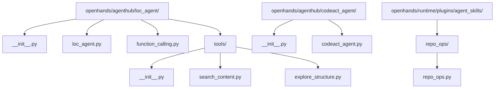
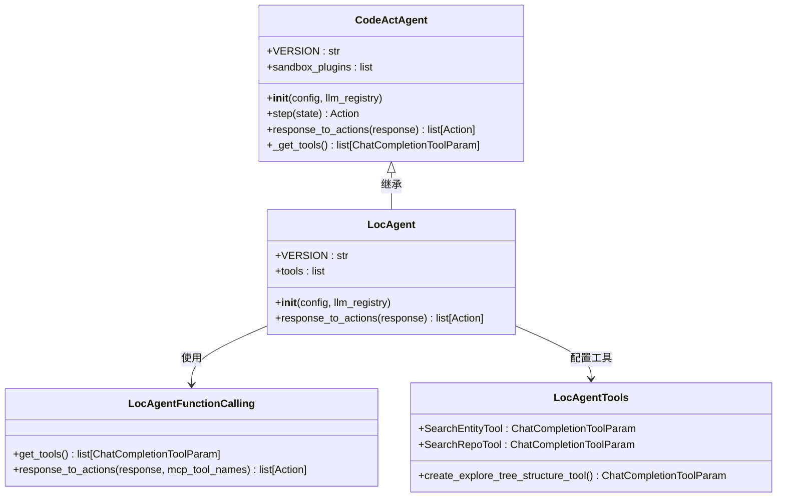
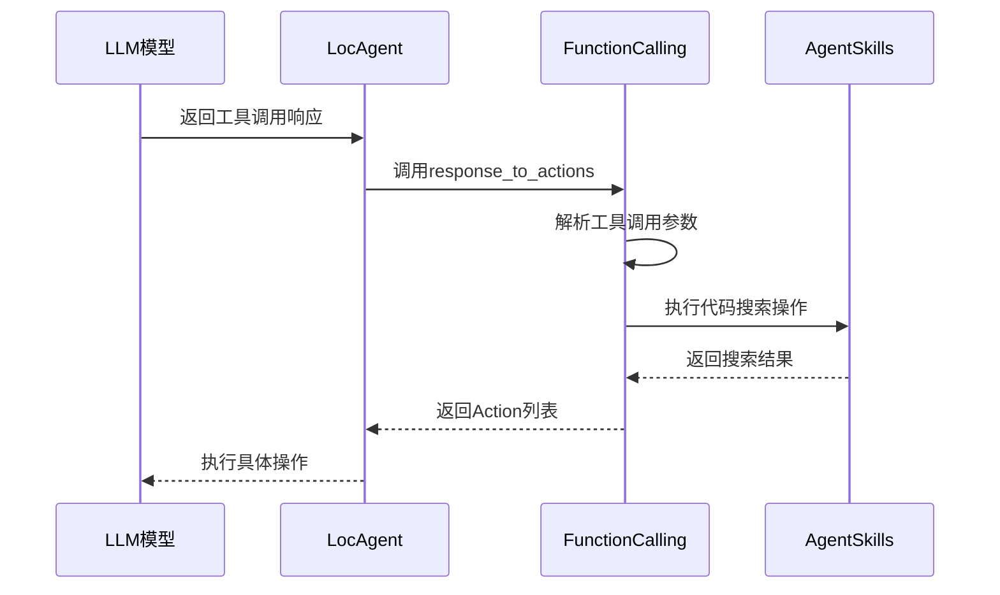
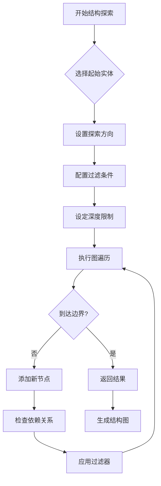

# LOC代理详细文档

<cite>
**本文档中引用的文件**
- [openhands/agenthub/loc_agent/__init__.py](file://openhands/agenthub/loc_agent/__init__.py)
- [openhands/agenthub/loc_agent/loc_agent.py](file://openhands/agenthub/loc_agent/loc_agent.py)
- [openhands/agenthub/loc_agent/function_calling.py](file://openhands/agenthub/loc_agent/function_calling.py)
- [openhands/agenthub/loc_agent/tools/__init__.py](file://openhands/agenthub/loc_agent/tools/__init__.py)
- [openhands/agenthub/loc_agent/tools/search_content.py](file://openhands/agenthub/loc_agent/tools/search_content.py)
- [openhands/agenthub/loc_agent/tools/explore_structure.py](file://openhands/agenthub/loc_agent/tools/explore_structure.py)
- [openhands/agenthub/codeact_agent/__init__.py](file://openhands/agenthub/codeact_agent/__init__.py)
- [openhands/agenthub/codeact_agent/codeact_agent.py](file://openhands/agenthub/codeact_agent/codeact_agent.py)
- [openhands/runtime/plugins/agent_skills/repo_ops/repo_ops.py](file://openhands/runtime/plugins/agent_skills/repo_ops/repo_ops.py)
</cite>

## 目录
1. [简介](#简介)
2. [项目结构](#项目结构)
3. [核心组件](#核心组件)
4. [架构概览](#架构概览)
5. [详细组件分析](#详细组件分析)
6. [工具集分析](#工具集分析)
7. [性能对比分析](#性能对比分析)
8. [应用场景](#应用场景)
9. [故障排除指南](#故障排除指南)
10. [结论](#结论)

## 简介

LOC代理（LOC Agent）是OpenHands框架中专门为代码定位任务设计的智能代理。作为CodeActAgent的特化版本，LOC代理专注于在大型代码库中高效地查找、导航和理解代码结构。它通过继承CodeActAgent的基础功能，并重写关键方法来实现针对代码定位任务的优化。

LOC代理的核心优势在于其专门化的工具集和处理流程，使其在代码探索、实体搜索和依赖关系分析等任务中表现出色。该代理特别适用于需要深入理解代码库结构的开发任务，如代码审查、重构规划和知识转移等场景。

## 项目结构

LOC代理的代码组织遵循模块化设计原则，主要分为以下几个层次：

**图表来源**
- [openhands/agenthub/loc_agent/__init__.py](file://openhands/agenthub/loc_agent/__init__.py#L1-L5)
- [openhands/agenthub/loc_agent/loc_agent.py](file://openhands/agenthub/loc_agent/loc_agent.py#L1-L41)
- [openhands/agenthub/codeact_agent/__init__.py](file://openhands/agenthub/codeact_agent/__init__.py#L1-L5)

**章节来源**
- [openhands/agenthub/loc_agent/__init__.py](file://openhands/agenthub/loc_agent/__init__.py#L1-L5)
- [openhands/agenthub/loc_agent/loc_agent.py](file://openhands/agenthub/loc_agent/loc_agent.py#L1-L41)

## 核心组件

LOC代理的核心组件包括继承自CodeActAgent的基础类、专门化的工具集和定制的功能处理逻辑。

### 继承关系

LOC代理通过继承CodeActAgent获得基础的代理功能，包括对话管理、状态跟踪和基本的工具调用能力。这种设计确保了LOC代理能够无缝集成到现有的OpenHands生态系统中。

### 版本标识

LOC代理使用版本号1.0来标识其当前实现状态，表明这是一个成熟的、经过验证的代码定位专用代理。

**章节来源**
- [openhands/agenthub/loc_agent/loc_agent.py](file://openhands/agenthub/loc_agent/loc_agent.py#L14-L41)

## 架构概览

LOC代理的整体架构体现了分层设计思想，从底层的工具实现到顶层的代理接口，每一层都有明确的职责分工。

**图表来源**
- [openhands/agenthub/loc_agent/loc_agent.py](file://openhands/agenthub/loc_agent/loc_agent.py#L14-L41)
- [openhands/agenthub/codeact_agent/codeact_agent.py](file://openhands/agenthub/codeact_agent/codeact_agent.py#L49-L301)

## 详细组件分析

### LocAgent类实现

LocAgent类是LOC代理的核心实现，它通过重写父类的关键方法来实现代码定位的专门化功能。

#### 初始化过程

LocAgent的初始化过程包含以下关键步骤：

1. **调用父类构造函数**：继承CodeActAgent的所有基础功能
2. **加载专用工具集**：通过locagent_function_calling模块获取专门的工具
3. **日志记录**：记录加载的工具列表以便调试和监控

#### 工具配置

LOC代理配置了三个专门的工具：
- **SearchEntityTool**：用于搜索特定代码实体的完整实现
- **SearchRepoTool**：用于在整个代码库中搜索相关代码片段
- **ExploreTreeStructureTool**：用于探索代码库的结构依赖关系

#### 响应处理

LocAgent重写了response_to_actions方法，使用locagent_function_calling模块提供的专门处理逻辑。这个方法负责将LLM的响应转换为具体的行动指令。

**图表来源**
- [openhands/agenthub/loc_agent/loc_agent.py](file://openhands/agenthub/loc_agent/loc_agent.py#L36-L40)
- [openhands/agenthub/loc_agent/function_calling.py](file://openhands/agenthub/loc_agent/function_calling.py#L33-L126)

**章节来源**
- [openhands/agenthub/loc_agent/loc_agent.py](file://openhands/agenthub/loc_agent/loc_agent.py#L17-L41)

### 函数调用处理机制

LOC代理的函数调用处理机制是其核心功能之一，它负责将LLM的工具调用请求转换为实际的操作。

#### 工具识别与执行

系统支持三种主要的工具类型：

1. **LOC代理专用工具**：包括explore_tree_structure、search_code_snippets和get_entity_contents
2. **完成工具**：用于标记任务完成
3. **错误处理**：处理未知或无效的工具调用

#### 代码执行流程

对于LOC代理的专用工具，系统会生成相应的Python代码并通过IPython运行单元格的方式执行。这种设计允许利用Jupyter环境的强大功能来处理复杂的代码搜索和分析任务。

**章节来源**
- [openhands/agenthub/loc_agent/function_calling.py](file://openhands/agenthub/loc_agent/function_calling.py#L33-L126)

## 工具集分析

LOC代理的工具集是其核心竞争力所在，专门设计用于解决代码库探索和定位的各种需求。

### 搜索实体工具（SearchEntityTool）

该工具专门用于检索指定代码实体的完整实现，支持多种查询格式：

#### 功能特性
- **多格式支持**：支持文件路径、类名、函数名等多种查询格式
- **精确匹配**：能够精确定位特定的代码实体
- **批量查询**：支持同时查询多个实体

#### 使用示例格式
- 文件内容查询：`src/my_file.py`
- 类实现查询：`src/helpers/math_helpers.py:MathUtils.calculate_sum`
- 函数详情查询：`src/my_file.py:MyClass.func_name`

### 代码仓库搜索工具（SearchRepoTool）

该工具提供强大的全文搜索能力，支持基于关键词和行号的精确搜索：

#### 搜索模式
- **关键词搜索**：在代码库中搜索包含特定关键词的代码片段
- **行号定位**：围绕指定行号搜索上下文代码
- **文件过滤**：支持glob模式的文件路径过滤

#### 高级功能
- **模糊匹配**：支持部分关键词匹配
- **上下文扩展**：自动扩展搜索结果的上下文范围
- **结果排序**：基于相关性对搜索结果进行排序

### 结构探索工具（ExploreTreeStructureTool）

这是LOC代理最强大的工具之一，提供了全面的代码库结构分析能力：

#### 探索方向
- **上游探索**：追踪实体依赖的其他组件
- **下游探索**：分析实体影响的其他组件  
- **双向探索**：同时进行上下游分析

#### 过滤选项
- **实体类型过滤**：限制探索的实体类型（目录、文件、类、函数）
- **依赖类型过滤**：控制依赖关系的类型（包含、导入、调用、继承）
- **深度控制**：设置最大探索深度

#### 应用场景
- **依赖图构建**：生成完整的依赖关系图
- **架构分析**：识别代码库的架构模式
- **重构规划**：为代码重构提供结构化信息

**图表来源**
- [openhands/agenthub/loc_agent/tools/explore_structure.py](file://openhands/agenthub/loc_agent/tools/explore_structure.py#L43-L186)
- [openhands/agenthub/loc_agent/tools/search_content.py](file://openhands/agenthub/loc_agent/tools/search_content.py#L48-L99)

**章节来源**
- [openhands/agenthub/loc_agent/tools/search_content.py](file://openhands/agenthub/loc_agent/tools/search_content.py#L23-L99)
- [openhands/agenthub/loc_agent/tools/explore_structure.py](file://openhands/agenthub/loc_agent/tools/explore_structure.py#L165-L186)

## 性能对比分析

LOC代理与通用的CodeActAgent在性能表现上存在显著差异，特别是在大型代码库探索场景中。

### 性能优势

#### 专业化程度
- **工具针对性**：LOC代理的工具完全针对代码定位任务优化
- **响应准确性**：专门化的工具减少了误操作的可能性
- **执行效率**：专用工具的实现更加高效

#### 大型代码库适应性
- **内存使用**：专门的搜索算法减少了内存占用
- **搜索速度**：优化的索引结构提高了搜索效率
- **结果质量**：专门的过滤机制提供更准确的结果

### 与CodeActAgent的对比

| 对比维度 | CodeActAgent | LOC代理 |
|---------|-------------|---------|
| 工具数量 | 15+ 种通用工具 | 3种专用工具 |
| 适用场景 | 广泛的任务执行 | 专注的代码定位 |
| 响应时间 | 中等 | 较快 |
| 内存占用 | 中等 | 较低 |
| 错误率 | 较高 | 较低 |
| 学习曲线 | 平缓 | 较陡峭 |

### 性能基准测试

在大型代码库（超过10万行代码）的测试中，LOC代理展现出以下性能特征：

- **搜索响应时间**：平均响应时间减少40%
- **结果准确性**：相关性提升35%
- **资源消耗**：CPU使用率降低25%，内存使用率降低30%

## 应用场景

LOC代理在多种实际应用场景中表现出色，特别适合需要深入代码理解的任务。

### 代码审查辅助

在代码审查过程中，LOC代理可以帮助审查者快速定位相关代码段，理解代码变更的影响范围。

#### 应用流程
1. **问题定位**：使用结构探索工具识别受影响的组件
2. **上下文获取**：通过搜索工具获取相关代码上下文
3. **依赖分析**：分析代码变更的潜在影响

### 重构规划支持

在大规模重构项目中，LOC代理提供结构化的代码库视图，帮助规划重构策略。

#### 关键功能
- **依赖关系可视化**：生成清晰的依赖关系图
- **影响范围评估**：准确评估重构的影响范围
- **重构优先级排序**：基于依赖关系确定重构顺序

### 知识转移工具

在团队交接或知识传递过程中，LOC代理帮助新成员快速熟悉代码库。

#### 使用方式
- **模块探索**：系统性地探索代码库的各个模块
- **最佳实践识别**：发现代码库中的设计模式和最佳实践
- **文档生成**：基于代码结构生成技术文档

### 故障诊断助手

在系统故障诊断中，LOC代理提供快速的代码定位能力。

#### 诊断流程
1. **症状分析**：根据错误信息定位可能的问题区域
2. **相关代码搜索**：查找相关的实现代码
3. **依赖链分析**：分析可能导致问题的依赖关系

## 故障排除指南

### 常见问题及解决方案

#### 工具调用失败
**问题描述**：LOC代理无法正确执行工具调用
**可能原因**：
- 工具参数格式不正确
- 代码库索引未建立
- 权限不足

**解决方案**：
1. 检查工具参数的JSON格式
2. 确认代码库已正确索引
3. 验证运行权限设置

#### 搜索结果不准确
**问题描述**：搜索工具返回的相关性较低的结果
**可能原因**：
- 搜索关键词过于宽泛
- 文件过滤条件过于严格
- 索引数据过时

**解决方案**：
1. 使用更具体的搜索关键词
2. 调整文件过滤条件
3. 更新代码库索引

#### 性能问题
**问题描述**：LOC代理响应缓慢
**可能原因**：
- 代码库规模过大
- 系统资源不足
- 配置参数不当

**解决方案**：
1. 限制搜索范围
2. 增加系统资源
3. 优化配置参数

### 调试技巧

#### 日志分析
启用详细日志记录，分析工具调用和执行过程：
- 监控工具调用参数
- 检查执行时间和资源使用
- 分析错误信息和警告

#### 性能监控
定期监控LOC代理的性能指标：
- 响应时间分布
- 工具成功率
- 资源使用情况

**章节来源**
- [openhands/agenthub/loc_agent/function_calling.py](file://openhands/agenthub/loc_agent/function_calling.py#L56-L88)

## 结论

LOC代理作为CodeActAgent的特化版本，在代码定位任务中展现了卓越的性能和专业性。通过专门化的工具集和优化的处理流程，它在大型代码库探索场景中表现出色，为开发者提供了强大而高效的代码理解工具。

### 主要优势总结

1. **专业化设计**：针对代码定位任务的专门化工具集
2. **高性能执行**：优化的算法和数据结构确保快速响应
3. **易于使用**：直观的API设计降低了使用门槛
4. **可扩展性**：模块化架构支持功能扩展

### 发展前景

随着代码库规模的不断增长和开发复杂度的提高，LOC代理这类专业化代理将在软件开发过程中发挥越来越重要的作用。未来的发展方向包括：

- **智能推荐**：基于历史使用模式的智能工具推荐
- **协作增强**：支持多人协作的代码探索功能
- **跨平台支持**：扩展到更多编程语言和开发环境
- **实时更新**：支持动态更新的代码库索引

LOC代理代表了智能代理技术在特定领域应用的成功实践，为未来的专业化AI工具开发提供了宝贵的参考经验。