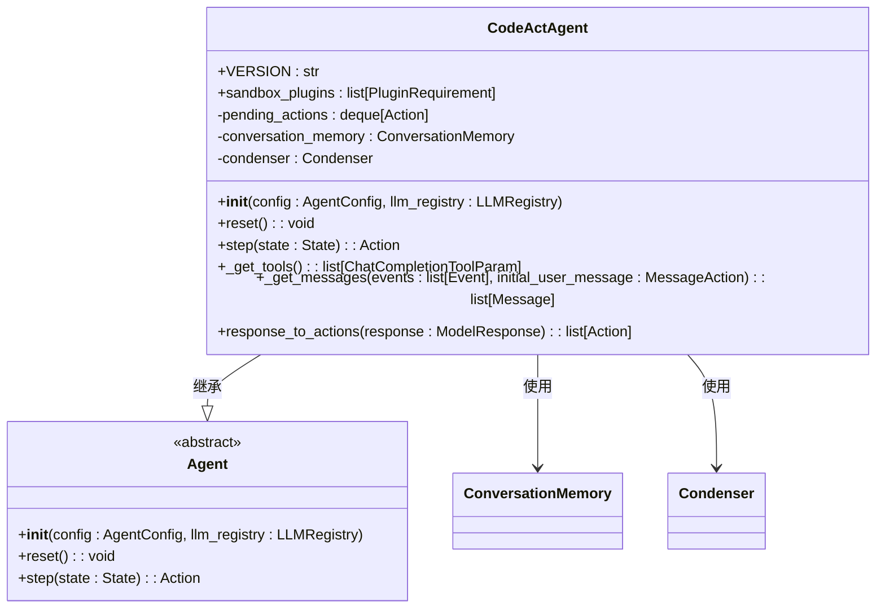
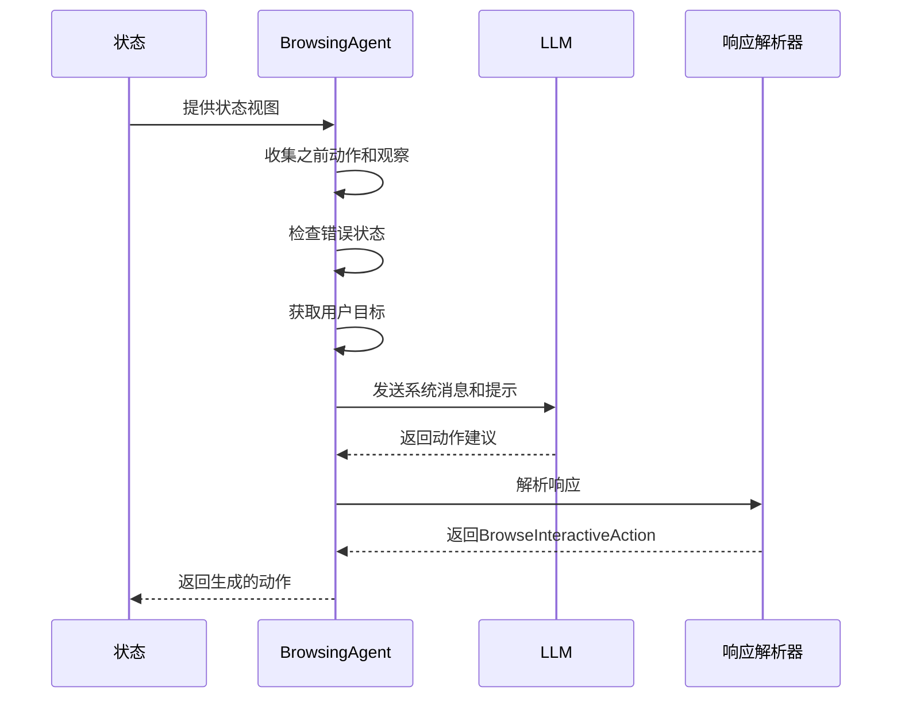
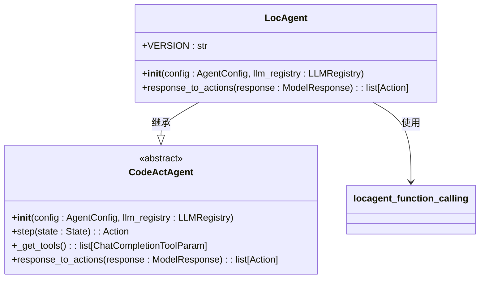
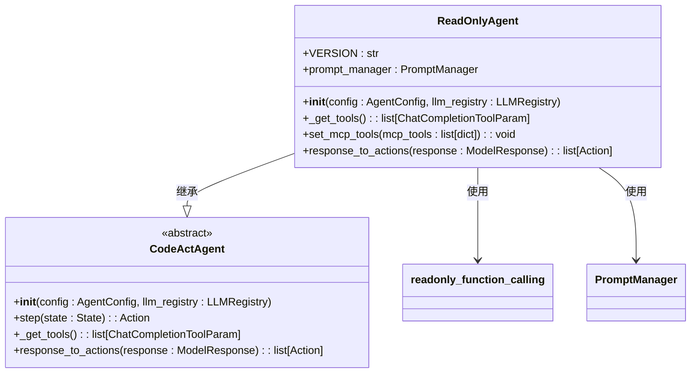
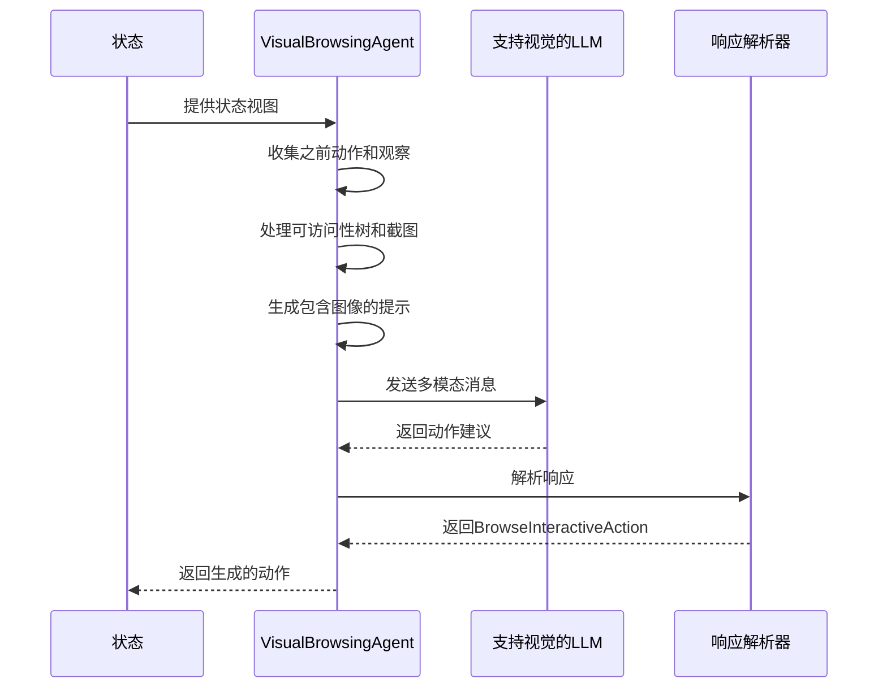
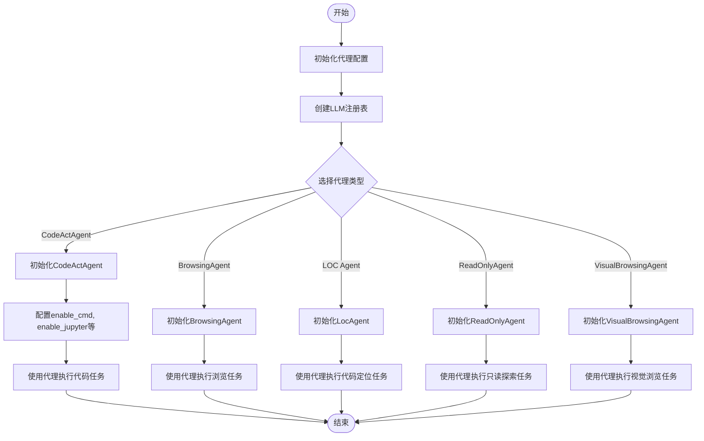

# 代理实现类型

<cite>
**本文档中引用的文件**  
- [codeact_agent.py](file://openhands/agenthub/codeact_agent/codeact_agent.py)
- [browsing_agent.py](file://openhands/agenthub/browsing_agent/browsing_agent.py)
- [loc_agent.py](file://openhands/agenthub/loc_agent/loc_agent.py)
- [readonly_agent.py](file://openhands/agenthub/readonly_agent/readonly_agent.py)
- [visualbrowsing_agent.py](file://openhands/agenthub/visualbrowsing_agent/visualbrowsing_agent.py)
- [function_calling.py](file://openhands/agenthub/codeact_agent/function_calling.py)
- [loc_agent/function_calling.py](file://openhands/agenthub/loc_agent/function_calling.py)
- [readonly_agent/function_calling.py](file://openhands/agenthub/readonly_agent/function_calling.py)
- [agent.py](file://openhands/controller/agent.py)
- [agent_config.py](file://openhands/core/config/agent_config.py)
</cite>

## 目录
1. [简介](#简介)
2. [CodeActAgent实现机制](#codeactagent实现机制)
3. [BrowsingAgent网页浏览处理](#browsingagent网页浏览处理)
4. [LOC Agent代码定位功能](#loc-agent代码定位功能)
5. [ReadOnlyAgent只读操作特性](#readonlyagent只读操作特性)
6. [VisualBrowsingAgent视觉化浏览能力](#visualbrowsingagent视觉化浏览能力)
7. [代理类型对比分析](#代理类型对比分析)
8. [初始化和调用示例](#初始化和调用示例)

## 简介
OpenHands框架提供了多种代理（Agent）实现类型，每种代理针对不同的任务场景进行了优化。这些代理类型包括CodeActAgent、BrowsingAgent、LOC Agent、ReadOnlyAgent和VisualBrowsingAgent，它们在工具调用模式、代码编辑能力、网页浏览处理和视觉化浏览等方面具有不同的特性和功能。本文档将详细分析这些代理的实现机制、使用场景、配置选项和性能特征。

**Section sources**
- [codeact_agent.py](file://openhands/agenthub/codeact_agent/codeact_agent.py#L1-L301)
- [browsing_agent.py](file://openhands/agenthub/browsing_agent/browsing_agent.py#L1-L224)

## CodeActAgent实现机制

CodeActAgent是OpenHands框架中的核心代理类型，它通过将模型的动作统一到代码执行空间来实现简单而高效的性能。该代理的工作原理是将模型的输出转换为具体的代码执行动作，从而在Linux bash环境或交互式Python解释器中执行。

### 工具调用模式
CodeActAgent支持多种工具调用，包括：
- **Bash命令执行**：通过`create_cmd_run_tool`工具执行任何有效的Linux bash命令
- **Python代码执行**：通过`IPythonTool`在交互式Python解释器中执行代码
- **代码编辑**：通过`LLMBasedFileEditTool`或`create_str_replace_editor_tool`进行文件编辑
- **浏览器交互**：通过`BrowserTool`与网页进行交互
- **任务跟踪**：通过`create_task_tracker_tool`进行任务管理

这些工具的启用由代理配置中的相应标志控制，如`enable_cmd`、`enable_jupyter`、`enable_browsing`等。

### 代码编辑能力
CodeActAgent具有强大的代码编辑能力，可以通过两种方式实现：
1. **基于LLM的编辑**：使用`LLMBasedFileEditTool`工具，通过LLM生成代码修改
2. **基于ACI的编辑**：使用`create_str_replace_editor_tool`工具，通过字符串替换方式进行精确编辑

代理通过`_get_tools`方法根据配置动态选择可用的工具，并在`step`方法中处理状态更新和动作生成。

**Diagram sources**
- [codeact_agent.py](file://openhands/agenthub/codeact_agent/codeact_agent.py#L49-L301)

**Section sources**
- [codeact_agent.py](file://openhands/agenthub/codeact_agent/codeact_agent.py#L49-L301)
- [function_calling.py](file://openhands/agenthub/codeact_agent/function_calling.py#L1-L339)

## BrowsingAgent网页浏览处理

BrowsingAgent专门用于处理网页浏览任务，它通过BrowserGym框架与网页进行交互。该代理能够解析网页的可访问性树（AXTree）并根据用户目标生成相应的浏览动作。

### 浏览任务处理机制
BrowsingAgent通过以下步骤处理浏览任务：
1. **状态收集**：从当前状态视图中收集之前的动作和观察结果
2. **错误处理**：如果上一个动作执行失败，添加错误恢复提示前缀
3. **目标设定**：获取用户意图作为浏览目标
4. **动作生成**：结合系统消息、当前URL、可访问性树和之前的动作生成提示
5. **响应解析**：使用`BrowsingResponseParser`解析LLM响应并生成相应的动作

代理支持多种动作子集，包括聊天（chat）、基于bid的元素交互（bid）和网页导航（nav），这些动作通过`HighLevelActionSet`进行配置。

**Diagram sources**
- [browsing_agent.py](file://openhands/agenthub/browsing_agent/browsing_agent.py#L94-L224)

**Section sources**
- [browsing_agent.py](file://openhands/agenthub/browsing_agent/browsing_agent.py#L94-L224)
- [browsing_agent/response_parser.py](file://openhands/agenthub/browsing_agent/response_parser.py)

## LOC Agent代码定位功能

LOC Agent（Line of Code Agent）专注于代码定位功能，它通过特定的工具集来搜索和探索代码库中的实体和代码片段。

### 代码定位功能
LOC Agent继承自CodeActAgent，但使用了不同的工具集，主要包括：
- **树结构探索**：通过`create_explore_tree_structure_tool`工具探索代码库的目录结构
- **代码片段搜索**：通过`SearchRepoTool`在代码库中搜索特定的代码模式
- **实体内容获取**：通过`SearchEntityTool`获取特定代码实体的内容

这些工具通过`locagent_function_calling`模块进行管理，代理在初始化时加载这些工具，并在`response_to_actions`方法中处理工具调用。

**Diagram sources**
- [loc_agent.py](file://openhands/agenthub/loc_agent/loc_agent.py#L14-L41)
- [loc_agent/function_calling.py](file://openhands/agenthub/loc_agent/function_calling.py)

**Section sources**
- [loc_agent.py](file://openhands/agenthub/loc_agent/loc_agent.py#L14-L41)
- [loc_agent/function_calling.py](file://openhands/agenthub/loc_agent/function_calling.py#L1-L126)

## ReadOnlyAgent只读操作特性

ReadOnlyAgent是一种特殊的CodeActAgent变体，它仅使用只读工具，设计用于安全地探索代码库而不进行任何修改。

### 只读操作特性
ReadOnlyAgent的主要特性包括：
- **只读工具集**：仅包含不修改系统的工具，如grep、glob、view、think和finish
- **安全探索**：允许用户在不改变代码库的情况下研究和理解代码结构
- **配置隔离**：使用独立的提示管理器和工具集，确保只读行为的一致性

代理通过重写`_get_tools`方法来确保只加载只读工具，并通过`readonly_function_calling`模块处理工具调用。它还重写了`prompt_manager`属性以使用专门的只读提示。

**Diagram sources**
- [readonly_agent.py](file://openhands/agenthub/readonly_agent/readonly_agent.py#L23-L84)
- [readonly_agent/function_calling.py](file://openhands/agenthub/readonly_agent/function_calling.py)

**Section sources**
- [readonly_agent.py](file://openhands/agenthub/readonly_agent/readonly_agent.py#L23-L84)
- [readonly_agent/function_calling.py](file://openhands/agenthub/readonly_agent/function_calling.py#L1-L249)

## VisualBrowsingAgent视觉化浏览能力

VisualBrowsingAgent扩展了BrowsingAgent的功能，增加了对网页截图的视觉化浏览能力，使其能够更好地处理需要视觉信息的浏览任务。

### 视觉化浏览能力
VisualBrowsingAgent的主要能力包括：
- **截图集成**：能够接收和处理网页截图，结合可访问性树进行更全面的页面理解
- **多模态输入**：支持文本和图像的混合输入，使LLM能够基于视觉信息做出决策
- **详细的页面状态**：提供标签、焦点元素、错误信息和动作历史的完整上下文

代理通过`ImageContent`类处理图像输入，并在生成提示时将截图URL包含在消息内容中。它还提供了详细的示例和提示，指导LLM如何生成正确的浏览动作。

**Diagram sources**
- [visualbrowsing_agent.py](file://openhands/agenthub/visualbrowsing_agent/visualbrowsing_agent.py#L121-L311)

**Section sources**
- [visualbrowsing_agent.py](file://openhands/agenthub/visualbrowsing_agent/visualbrowsing_agent.py#L121-L311)
- [browsing_agent/response_parser.py](file://openhands/agenthub/browsing_agent/response_parser.py)

## 代理类型对比分析

以下表格对比了各种代理类型的使用场景、配置选项和性能特征：

| 代理类型 | 使用场景 | 配置选项 | 性能特征 |
|---------|--------|---------|---------|
| **CodeActAgent** | 通用代码操作和任务执行 | enable_cmd, enable_jupyter, enable_browsing, enable_editor, enable_plan_mode | 支持完整的代码执行和编辑功能，性能取决于启用的工具数量 |
| **BrowsingAgent** | 网页浏览和交互任务 | 无特定配置，依赖环境变量USE_NAV和USE_CONCISE_ANSWER | 专注于浏览任务，性能优化于网页交互，不支持代码编辑 |
| **LOC Agent** | 代码库探索和定位 | 继承CodeActAgent配置，但工具集固定 | 专注于代码搜索和定位，性能优化于代码库探索任务 |
| **ReadOnlyAgent** | 安全代码库探索 | 继承CodeActAgent配置，但工具集限制为只读 | 仅支持读取操作，性能安全但功能受限，适合研究场景 |
| **VisualBrowsingAgent** | 视觉化网页浏览任务 | 无特定配置，依赖视觉支持的LLM | 支持多模态输入，性能取决于LLM的视觉处理能力 |

**Section sources**
- [codeact_agent.py](file://openhands/agenthub/codeact_agent/codeact_agent.py)
- [browsing_agent.py](file://openhands/agenthub/browsing_agent/browsing_agent.py)
- [loc_agent.py](file://openhands/agenthub/loc_agent/loc_agent.py)
- [readonly_agent.py](file://openhands/agenthub/readonly_agent/readonly_agent.py)
- [visualbrowsing_agent.py](file://openhands/agenthub/visualbrowsing_agent/visualbrowsing_agent.py)

## 初始化和调用示例

以下是不同类型代理的初始化和调用方式示例：

**Diagram sources**
- [agent.py](file://openhands/controller/agent.py#L116-L161)
- [agent_config.py](file://openhands/core/config/agent_config.py)

**Section sources**
- [agent.py](file://openhands/controller/agent.py#L116-L161)
- [agent_config.py](file://openhands/core/config/agent_config.py#L68-L158)