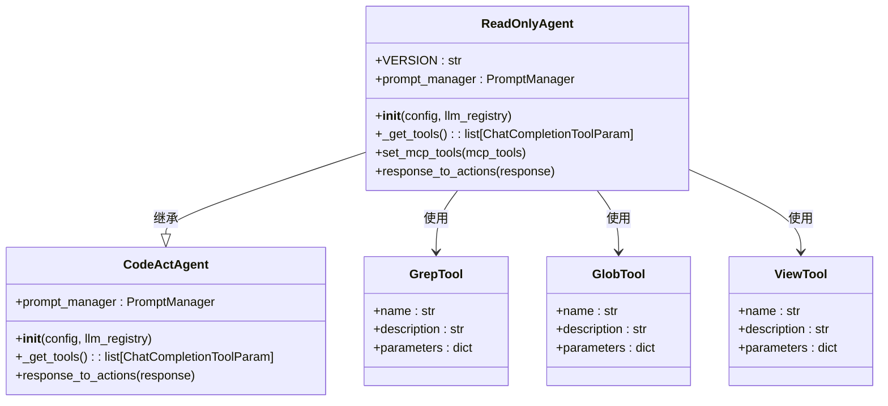

# 只读代理

<cite>
**本文档引用的文件**
- [readonly_agent.py](file://openhands/agenthub/readonly_agent/readonly_agent.py)
- [function_calling.py](file://openhands/agenthub/readonly_agent/function_calling.py)
- [__init__.py](file://openhands/agenthub/readonly_agent/__init__.py)
- [tools/grep.py](file://openhands/agenthub/readonly_agent/tools/grep.py)
- [tools/glob.py](file://openhands/agenthub/readonly_agent/tools/glob.py)
- [tools/view.py](file://openhands/agenthub/readonly_agent/tools/view.py)
- [prompts/system_prompt.j2](file://openhands/agenthub/readonly_agent/prompts/system_prompt.j2)
- [tools/__init__.py](file://openhands/agenthub/readonly_agent/tools/__init__.py)
</cite>

## 目录
1. [简介](#简介)
2. [核心设计与实现](#核心设计与实现)
3. [工具集限制机制](#工具集限制机制)
4. [提示管理器配置](#提示管理器配置)
5. [MCP工具处理](#mcp工具处理)
6. [应用场景分析](#应用场景分析)
7. [架构概览](#架构概览)

## 简介
只读代理（ReadOnlyAgent）是OpenHands框架中的一个专门化代理，设计用于安全地探索和分析代码库而不会对系统进行任何修改。它继承自CodeActAgent，但通过限制可用工具集来确保所有操作都是只读的。这种设计使得ReadOnlyAgent成为代码库研究、安全审计和探索性分析的理想选择。

## 核心设计与实现

只读代理的核心设计目标是提供一个安全的探索环境，允许用户在不改变系统状态的情况下进行代码分析和研究。该代理通过继承CodeActAgent并重写关键方法来实现这一目标。

ReadOnlyAgent的主要特性包括：
- 仅允许执行不会修改系统的操作
- 提供专门的只读工具集
- 使用独立的提示管理系统
- 忽略不支持的MCP工具警告

该代理的实现位于`openhands/agenthub/readonly_agent/readonly_agent.py`文件中，通过继承CodeActAgent类并重写其方法来定制行为。

**本节来源**
- [readonly_agent.py](file://openhands/agenthub/readonly_agent/readonly_agent.py#L23-L37)

## 工具集限制机制

只读代理通过重写`_get_tools`方法来严格限制可用工具集，确保只包含不会修改系统的读取操作。这是其实现安全探索功能的核心机制。

### 受限工具集
只读代理仅提供以下工具：
- **grep**：用于在文件内容中搜索模式
- **glob**：用于列出匹配特定模式的文件
- **view**：用于读取文件内容或列出目录
- **think**：用于内部思考和分析
- **finish**：用于完成当前任务
- **web_read**：用于访问网络资源

这些工具的定义位于`openhands/agenthub/readonly_agent/tools/`目录下，每个工具都通过`ChatCompletionToolParam`进行定义，明确指定了其功能、参数和使用限制。

### 工具集实现
工具集的获取是通过`function_calling.py`文件中的`get_tools()`函数实现的：

```python
def get_tools() -> list[ChatCompletionToolParam]:
    return [
        ThinkTool,
        FinishTool,
        GrepTool,
        GlobTool,
        ViewTool,
    ]
```

这个函数返回一个包含所有只读工具的列表，确保代理只能使用这些安全的操作。



**图表来源**
- [readonly_agent.py](file://openhands/agenthub/readonly_agent/readonly_agent.py#L65-L68)
- [function_calling.py](file://openhands/agenthub/readonly_agent/function_calling.py#L241-L248)
- [tools/grep.py](file://openhands/agenthub/readonly_agent/tools/grep.py#L13-L37)
- [tools/glob.py](file://openhands/agenthub/readonly_agent/tools/glob.py#L11-L31)
- [tools/view.py](file://openhands/agenthub/readonly_agent/tools/view.py#L13-L34)

**本节来源**
- [readonly_agent.py](file://openhands/agenthub/readonly_agent/readonly_agent.py#L65-L68)
- [function_calling.py](file://openhands/agenthub/readonly_agent/function_calling.py#L241-L248)

## 提示管理器配置

只读代理使用独立的提示管理器配置，这是通过重写`prompt_manager`属性来实现的。这种设计确保了代理使用专门为其功能定制的提示。

### 提示管理器实现
```python
@property
def prompt_manager(self) -> PromptManager:
    # 设置我们自己的提示管理器
    if self._prompt_manager is None:
        self._prompt_manager = PromptManager(
            prompt_dir=os.path.join(os.path.dirname(__file__), 'prompts'),
        )
    return self._prompt_manager
```

这个实现创建了一个指向`prompts`目录的独立`PromptManager`实例，该目录包含专门为只读代理设计的提示模板。

### 提示模板
只读代理的提示模板位于`openhands/agenthub/readonly_agent/prompts/`目录下，主要包括：
- `system_prompt.j2`：系统提示，定义了代理的能力和限制
- `user_prompt.j2`：用户提示模板
- `in_context_learning_example.j2`：上下文学习示例

系统提示明确指出了代理的能力和限制：

```
<CAPABILITIES>
✓ READ-ONLY TOOLS:
- view: Read file contents
- grep: Search for patterns
- glob: List matching files
- think: Analyze information
- web_read: Access web resources
- finish: Complete current task

✗ RESTRICTIONS:
- Cannot modify any files
- Cannot execute state-changing commands
</CAPABILITIES>
```

这种清晰的提示设计帮助用户理解代理的功能边界，避免尝试执行不支持的操作。

**本节来源**
- [readonly_agent.py](file://openhands/agenthub/readonly_agent/readonly_agent.py#L57-L63)
- [prompts/system_prompt.j2](file://openhands/agenthub/readonly_agent/prompts/system_prompt.j2#L1-L35)

## MCP工具处理

只读代理明确不支持MCP（Model Calling Protocol）工具，这是通过重写`set_mcp_tools`方法来实现的。当尝试设置MCP工具时，代理会记录警告信息并忽略这些工具。

### MCP工具处理实现
```python
def set_mcp_tools(self, mcp_tools: list[dict]) -> None:
    """Sets the list of MCP tools for the agent.
    
    Args:
    - mcp_tools (list[dict]): The list of MCP tools.
    """
    logger.warning(
        'ReadOnlyAgent does not support MCP tools. MCP tools will be ignored by the agent.'
    )
```

这个实现的关键点包括：
- 方法接受MCP工具列表作为参数，保持与父类的接口兼容性
- 记录警告信息，通知用户MCP工具不被支持
- 不执行任何实际操作，完全忽略传入的MCP工具

这种设计确保了只读代理的安全性，防止通过MCP工具执行潜在的修改操作。同时，通过记录警告信息而不是抛出异常，保持了系统的稳定性，允许在配置中包含MCP工具而不会导致代理失败。

**本节来源**
- [readonly_agent.py](file://openhands/agenthub/readonly_agent/readonly_agent.py#L70-L78)

## 应用场景分析

只读代理在多种场景下具有重要价值，特别是在需要安全探索和分析的环境中。

### 代码库研究
在探索新代码库时，只读代理是理想的选择：
- 可以安全地浏览文件结构
- 搜索特定模式或代码片段
- 理解代码库的整体架构
- 分析依赖关系和模块组织

由于代理无法修改任何文件，用户可以放心地进行探索，而不必担心意外更改代码。

### 安全审计
在安全审计场景中，只读代理提供了重要的安全保障：
- 可以检查代码中的安全漏洞
- 分析权限和访问控制机制
- 审查敏感信息的处理方式
- 验证安全配置

代理的只读特性确保了审计过程本身不会引入新的安全风险。

### 教学与培训
只读代理也适用于教学和培训环境：
- 学生可以安全地探索代码示例
- 新员工可以学习项目结构而不影响生产代码
- 团队成员可以共享代码库知识

通过限制修改能力，组织可以提供访问权限而无需担心代码被意外破坏。

### 调试与问题排查
在调试现有系统时，只读代理可以帮助：
- 定位问题代码
- 分析错误日志
- 理解系统行为
- 验证假设

代理可以快速搜索相关代码并提供上下文信息，而不会改变系统的当前状态。

**本节来源**
- [readonly_agent.py](file://openhands/agenthub/readonly_agent/readonly_agent.py#L28-L37)

## 架构概览

只读代理的架构设计体现了其作为安全探索工具的核心理念。它通过继承和重写机制，在CodeActAgent的基础上构建了一个专门化的只读版本。

```mermaid
graph TD
subgraph "只读代理组件"
RA[ReadOnlyAgent]
PM[PromptManager]
FT[Function Calling]
TL[Tools]
end
subgraph "核心功能"
Grep[grep工具]
Glob[glob工具]
View[view工具]
Think[think工具]
Finish[finish工具]
end
RA --> PM : 使用独立提示管理器
RA --> FT : 使用只读函数调用
FT --> TL : 获取工具集
TL --> Grep
TL --> Glob
TL --> View
TL --> Think
TL --> Finish
style RA fill:#f9f,stroke:#333
style PM fill:#bbf,stroke:#333
style FT fill:#bbf,stroke:#333
style TL fill:#bbf,stroke:#333
style Grep fill:#dfd,stroke:#333
style Glob fill:#dfd,stroke:#333
style View fill:#dfd,stroke:#333
style Think fill:#dfd,stroke:#333
style Finish fill:#dfd,stroke:#333
```

**图表来源**
- [readonly_agent.py](file://openhands/agenthub/readonly_agent/readonly_agent.py#L23-L83)
- [function_calling.py](file://openhands/agenthub/readonly_agent/function_calling.py#L1-L249)
- [tools/__init__.py](file://openhands/agenthub/readonly_agent/tools/__init__.py#L1-L22)

**本节来源**
- [readonly_agent.py](file://openhands/agenthub/readonly_agent/readonly_agent.py#L23-L83)
- [__init__.py](file://openhands/agenthub/readonly_agent/__init__.py#L1-L4)