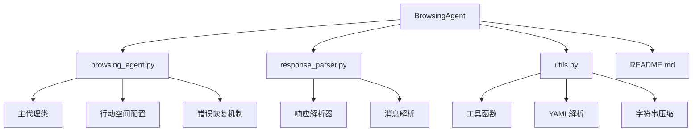
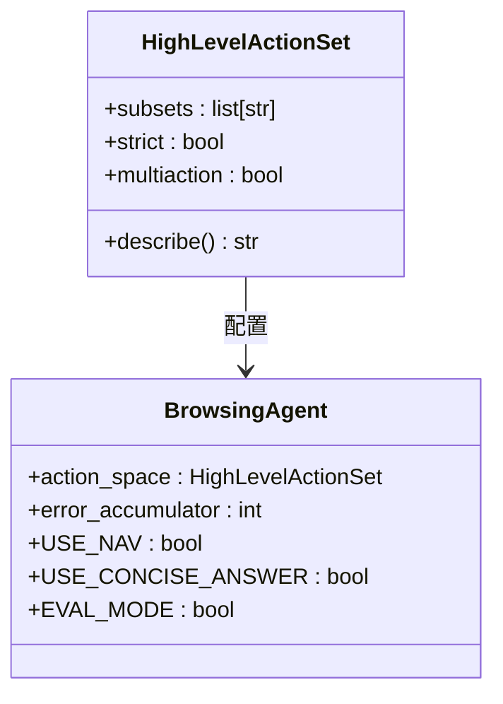
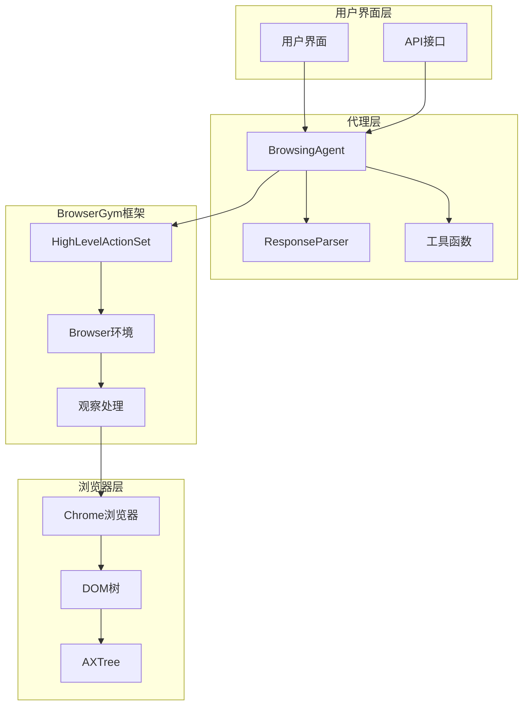
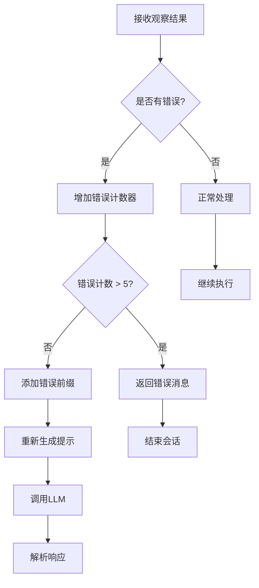
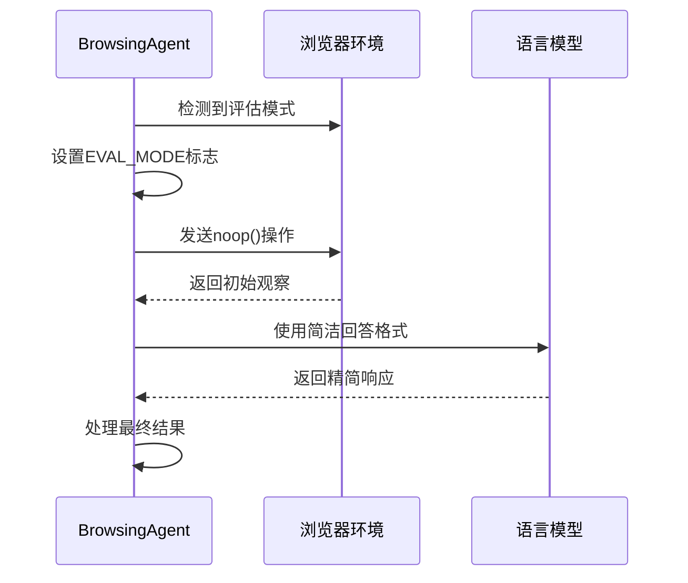
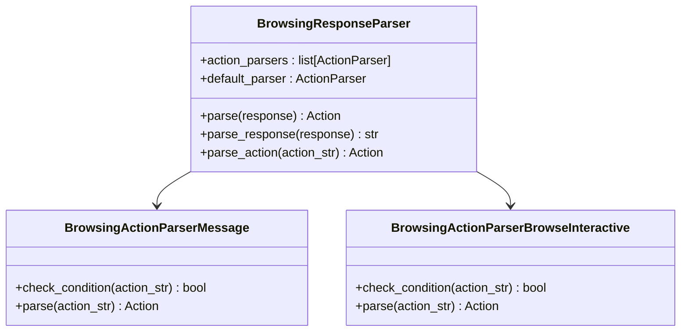
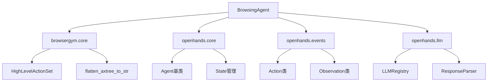

# 浏览代理

<cite>
**本文档中引用的文件**
- [browsing_agent.py](file://openhands/agenthub/browsing_agent/browsing_agent.py)
- [response_parser.py](file://openhands/agenthub/browsing_agent/response_parser.py)
- [utils.py](file://openhands/agenthub/browsing_agent/utils.py)
- [README.md](file://openhands/agenthub/browsing_agent/README.md)
- [visualbrowsing_agent.py](file://openhands/agenthub/visualbrowsing_agent/visualbrowsing_agent.py)
- [browser_env.py](file://openhands/runtime/browser/browser_env.py)
- [utils.py](file://openhands/runtime/browser/utils.py)
</cite>

## 目录
1. [简介](#简介)
2. [项目结构](#项目结构)
3. [核心组件](#核心组件)
4. [架构概览](#架构概览)
5. [详细组件分析](#详细组件分析)
6. [依赖关系分析](#依赖关系分析)
7. [性能考虑](#性能考虑)
8. [故障排除指南](#故障排除指南)
9. [结论](#结论)

## 简介

BrowsingAgent是OpenHands框架中的一个智能网页浏览代理，专门设计用于通过BrowserGym框架与网页进行交互。该代理利用可访问性树（AXTree）和HTML内容来精确定位页面元素，并通过配置化的行动空间（action space）执行复杂的网页任务。

BrowsingAgent的核心优势在于其能够理解复杂的网页结构，通过可访问性树进行精确的元素定位，并结合高级语言模型（如GPT-4）来处理复杂的交互任务。它支持多种行动类型，包括聊天、导航和基于元素标识符的操作。

## 项目结构

BrowsingAgent位于`openhands/agenthub/browsing_agent/`目录下，包含以下核心文件：

**图表来源**
- [browsing_agent.py](file://openhands/agenthub/browsing_agent/browsing_agent.py#L1-L224)
- [response_parser.py](file://openhands/agenthub/browsing_agent/response_parser.py#L1-L127)
- [utils.py](file://openhands/agenthub/browsing_agent/utils.py#L1-L175)

**章节来源**
- [browsing_agent.py](file://openhands/agenthub/browsing_agent/browsing_agent.py#L1-L224)
- [README.md](file://openhands/agenthub/browsing_agent/README.md#L1-L17)

## 核心组件

### BrowsingAgent类

BrowsingAgent是主要的代理类，继承自基础Agent类，负责管理与浏览器环境的交互。它具有以下核心特性：

- **可配置的行动空间**：支持聊天、导航和基于元素标识符的操作
- **错误恢复机制**：通过`error_accumulator`计数器处理连续错误
- **评估模式支持**：在特定基准测试中启用特殊行为
- **多模态输入处理**：结合AXTree和HTML内容进行决策

### 行动空间配置

BrowsingAgent使用BrowserGym的HighLevelActionSet来定义可执行的操作集合：

**图表来源**
- [browsing_agent.py](file://openhands/agenthub/browsing_agent/browsing_agent.py#L116-L123)

行动空间包含以下子集：
- **chat**：支持与用户进行文本交流
- **bid**：基于元素唯一标识符（bid）的操作
- **nav**：网页导航功能（可选）

**章节来源**
- [browsing_agent.py](file://openhands/agenthub/browsing_agent/browsing_agent.py#L114-L123)

## 架构概览

BrowsingAgent的整体架构展示了其与BrowserGym框架的深度集成：

**图表来源**
- [browsing_agent.py](file://openhands/agenthub/browsing_agent/browsing_agent.py#L93-L224)
- [browser_env.py](file://openhands/runtime/browser/browser_env.py#L103-L187)

## 详细组件分析

### 错误恢复机制

BrowsingAgent实现了robust的错误恢复机制，通过`error_accumulator`计数器来处理连续错误：

**图表来源**
- [browsing_agent.py](file://openhands/agenthub/browsing_agent/browsing_agent.py#L181-L202)

错误恢复的关键特性：
- **错误计数限制**：当连续错误超过5次时终止任务
- **错误前缀添加**：为后续LLM调用提供上下文信息
- **异常处理**：捕获AXTree处理过程中的异常

**章节来源**
- [browsing_agent.py](file://openhands/agenthub/browsing_agent/browsing_agent.py#L181-L202)

### 评估模式（EVAL_MODE）

在评估模式下，BrowsingAgent表现出特殊的行为特征：

**图表来源**
- [browsing_agent.py](file://openhands/agenthub/browsing_agent/browsing_agent.py#L153-L157)

评估模式的配置参数：
- **USE_NAV**：禁用导航动作（默认启用）
- **USE_CONCISE_ANSWER**：启用简洁回答模式
- **EVAL_MODE**：综合上述两个标志的状态

**章节来源**
- [browsing_agent.py](file://openhands/agenthub/browsing_agent/browsing_agent.py#L26-L36)

### 响应解析器

BrowsingAgent使用专门的响应解析器来处理LLM的输出：

**图表来源**
- [response_parser.py](file://openhands/agenthub/browsing_agent/response_parser.py#L12-L127)

解析器支持两种主要的响应格式：
1. **消息格式**：直接返回文本消息
2. **交互式格式**：包含思考过程和具体操作

**章节来源**
- [response_parser.py](file://openhands/agenthub/browsing_agent/response_parser.py#L12-L127)

### 可访问性树（AXTree）处理

BrowsingAgent通过AXTree进行精确的页面元素定位：

**图表来源**
- [browsing_agent.py](file://openhands/agenthub/browsing_agent/browsing_agent.py#L191-L202)
- [utils.py](file://openhands/runtime/browser/utils.py#L19-L31)

AXTree处理的关键步骤：
- **元素属性提取**：包含bid、role、state等信息
- **可点击性标记**：识别可交互的元素
- **可见性过滤**：只处理当前可见的元素
- **字符串格式化**：生成适合LLM理解的格式

**章节来源**
- [browsing_agent.py](file://openhands/agenthub/browsing_agent/browsing_agent.py#L191-L202)

## 依赖关系分析

BrowsingAgent的依赖关系展现了其在OpenHands生态系统中的位置：

**图表来源**
- [browsing_agent.py](file://openhands/agenthub/browsing_agent/browsing_agent.py#L1-L25)

主要依赖项：
- **BrowserGym**：提供行动空间和AXTree处理功能
- **OpenHands核心模块**：提供事件系统和状态管理
- **LLM服务**：支持与各种语言模型的集成

**章节来源**
- [browsing_agent.py](file://openhands/agenthub/browsing_agent/browsing_agent.py#L1-L25)

## 性能考虑

### LLM配置建议

对于复杂的网页任务，推荐使用以下LLM配置：

| 配置项 | 推荐值 | 说明 |
|--------|--------|------|
| 模型 | GPT-4、Claude-3.5-Sonnet | 支持复杂推理和多步操作 |
| 温度 | 0.0 | 减少随机性，提高一致性 |
| 最大令牌 | 4000+ | 允许处理大型AXTree和上下文 |
| 并行行动 | 启用 | 提高执行效率 |

### 优化策略

1. **AXTree压缩**：对重复的元素内容进行去重
2. **上下文窗口管理**：合理控制历史记录长度
3. **错误频率限制**：避免无限循环的错误尝试
4. **行动验证**：在执行前验证行动的有效性

## 故障排除指南

### 常见问题及解决方案

| 问题 | 可能原因 | 解决方案 |
|------|----------|----------|
| AXTree解析失败 | 页面结构复杂或元素过多 | 启用可见性过滤，减少元素数量 |
| 连续错误导致任务失败 | 网页交互不稳定 | 调整错误计数阈值，增加重试机制 |
| LLM响应格式错误 | 输出格式不规范 | 使用更严格的响应解析器 |
| 评估模式行为异常 | 环境变量设置错误 | 检查USE_NAV和USE_CONCISE_ANSWER设置 |

### 调试技巧

1. **启用详细日志**：监控AXTree生成和错误处理过程
2. **检查环境变量**：确保评估模式配置正确
3. **验证LLM响应**：测试不同LLM模型的兼容性
4. **监控资源使用**：避免内存泄漏和性能瓶颈

**章节来源**
- [browsing_agent.py](file://openhands/agenthub/browsing_agent/browsing_agent.py#L181-L202)
- [response_parser.py](file://openhands/agenthub/browsing_agent/response_parser.py#L104-L126)

## 结论

BrowsingAgent是一个功能强大且设计精良的网页浏览代理，通过以下关键特性实现了高效的网页交互：

1. **灵活的行动空间**：支持多种类型的网页操作
2. **robust的错误恢复**：通过计数器机制防止无限循环
3. **评估模式适配**：专门为基准测试优化
4. **多模态输入处理**：结合AXTree和HTML内容进行决策
5. **LLM集成**：支持高级语言模型处理复杂任务

该代理特别适用于需要复杂网页交互的任务，如数据抓取、表单填写、在线购物等场景。通过合理的LLM配置和环境设置，可以显著提高任务完成率和用户体验。

对于开发者而言，BrowsingAgent提供了一个可扩展的框架，可以根据具体需求进行定制和优化。其模块化的设计使得添加新的功能或改进现有机制变得相对简单。