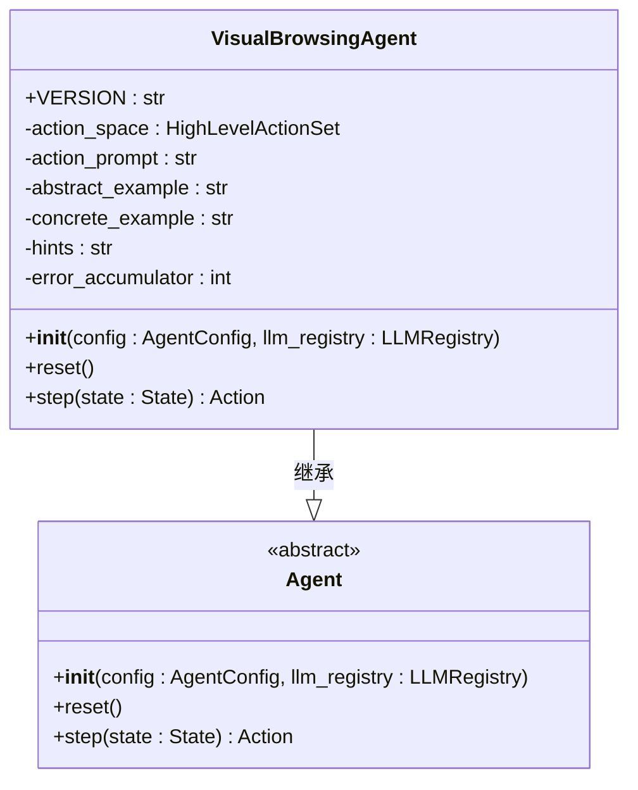
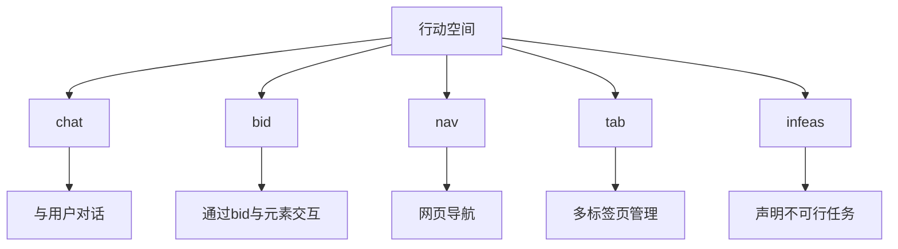
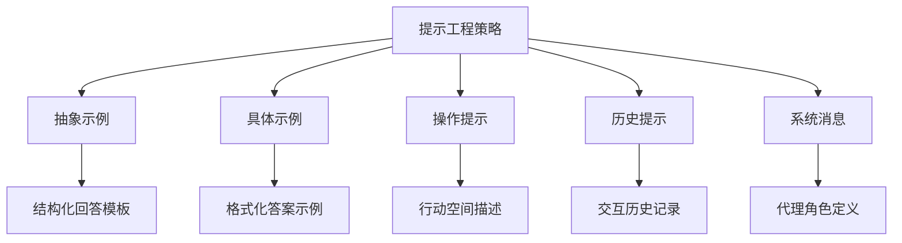
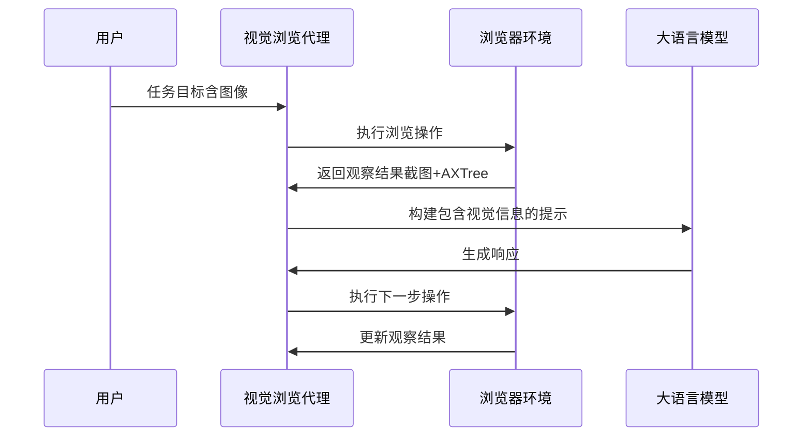
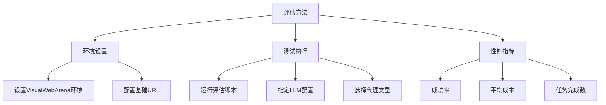

# 视觉浏览代理

<cite>
**本文档中引用的文件**   
- [visualbrowsing_agent.py](file://openhands/agenthub/visualbrowsing_agent/visualbrowsing_agent.py)
- [README.md](file://openhands/agenthub/visualbrowsing_agent/README.md)
- [run_infer.py](file://evaluation/benchmarks/visualwebarena/run_infer.py)
- [README.md](file://evaluation/benchmarks/visualwebarena/README.md)
- [run_infer.sh](file://evaluation/benchmarks/visualwebarena/scripts/run_infer.sh)
- [browse.py](file://openhands/events/action/browse.py)
- [browser_env.py](file://openhands/runtime/browser/browser_env.py)
- [utils.py](file://openhands/runtime/browser/utils.py)
- [conversation_memory.py](file://openhands/memory/conversation_memory.py)
</cite>

## 目录
1. [简介](#简介)
2. [核心功能与实现](#核心功能与实现)
3. [增强的行动空间](#增强的行动空间)
4. [提示工程策略](#提示工程策略)
5. [视觉信息处理](#视觉信息处理)
6. [评估方法](#评估方法)
7. [结论](#结论)

## 简介

视觉浏览代理（VisualBrowsingAgent）是一种先进的网页交互代理，它结合了视觉信息（如网页截图）和结构化数据（如可访问性树）来实现更智能的网页浏览。该代理通过利用网页的视觉表示和语义结构，能够更好地理解网页内容并执行复杂的交互任务。VisualBrowsingAgent的设计旨在解决传统文本基础代理在处理现代动态网页时的局限性，特别是在需要视觉上下文理解的任务中。

**Section sources**
- [visualbrowsing_agent.py](file://openhands/agenthub/visualbrowsing_agent/visualbrowsing_agent.py#L121-L125)
- [README.md](file://openhands/agenthub/visualbrowsing_agent/README.md#L1-L8)

## 核心功能与实现

视觉浏览代理的核心功能在于其能够同时利用网页的视觉和结构化信息进行决策。代理通过获取网页的截图和可访问性树（AXTree）来构建对当前页面状态的全面理解。可访问性树提供了网页元素的层次结构和属性信息，而截图则提供了视觉布局和上下文。

代理的实现基于BrowserGym框架，该框架提供了一套丰富的交互功能。VisualBrowsingAgent继承自基础Agent类，并通过HighLevelActionSet定义了其行动空间。在每一步执行中，代理会收集之前步骤的信息，并提示模型生成要执行的浏览命令。

**Diagram sources**
- [visualbrowsing_agent.py](file://openhands/agenthub/visualbrowsing_agent/visualbrowsing_agent.py#L121-L311)

**Section sources**
- [visualbrowsing_agent.py](file://openhands/agenthub/visualbrowsing_agent/visualbrowsing_agent.py#L121-L311)

## 增强的行动空间

视觉浏览代理具有增强的行动空间，包括多个子集来支持复杂的网页交互。行动空间由HighLevelActionSet定义，包含以下子集：

- **chat**: 允许代理与用户进行对话交流
- **bid**: 基于唯一标识符（bid）与网页元素交互
- **nav**: 提供网页导航功能
- **tab**: 支持多标签页管理
- **infeas**: 用于声明不可行任务

**Diagram sources**
- [visualbrowsing_agent.py](file://openhands/agenthub/visualbrowsing_agent/visualbrowsing_agent.py#L139-L145)

**Section sources**
- [visualbrowsing_agent.py](file://openhands/agenthub/visualbrowsing_agent/visualbrowsing_agent.py#L139-L150)

## 提示工程策略

视觉浏览代理采用了复杂的提示工程策略，结合了抽象示例、具体示例和操作提示的组合使用。这种多层次的提示结构旨在引导模型生成高质量的响应。

提示系统包括以下几个关键组件：
- **抽象示例**: 提供回答的抽象结构描述，确保模型遵循正确的格式
- **具体示例**: 展示如何格式化答案的具体示例
- **操作提示**: 描述可用的行动空间和交互方式
- **历史提示**: 记录所有先前的交互历史

**Diagram sources**
- [visualbrowsing_agent.py](file://openhands/agenthub/visualbrowsing_agent/visualbrowsing_agent.py#L152-L171)

**Section sources**
- [visualbrowsing_agent.py](file://openhands/agenthub/visualbrowsing_agent/visualbrowsing_agent.py#L152-L171)

## 视觉信息处理

视觉浏览代理能够处理包含图像的目标和观察结果，这是其核心优势之一。代理通过以下方式处理视觉信息：

1. **目标图像处理**: 当任务包含目标图像时，代理能够接收并处理这些图像URL，将其作为任务目标的一部分。
2. **截图处理**: 代理接收当前页面的截图（set-of-marks标注的截图），并将其包含在观察结果中。
3. **可访问性树处理**: 代理将网页的可访问性树转换为文本格式，包括元素的可见性和可点击性信息。

**Diagram sources**
- [visualbrowsing_agent.py](file://openhands/agenthub/visualbrowsing_agent/visualbrowsing_agent.py#L272-L287)
- [conversation_memory.py](file://openhands/memory/conversation_memory.py#L479-L499)

**Section sources**
- [visualbrowsing_agent.py](file://openhands/agenthub/visualbrowsing_agent/visualbrowsing_agent.py#L272-L287)

## 评估方法

视觉浏览代理在VisualWebArena基准测试中进行了评估，这是一个专门设计用于测试代理网页浏览能力的基准。评估方法包括：

1. **环境设置**: 需要设置包含预填充内容的网站，可通过URL访问。
2. **测试执行**: 使用专门的脚本运行评估，支持不同的LLM配置和代理类型。
3. **性能指标**: 主要评估指标包括成功率、平均成本和完成的任务数量。

评估结果显示，VisualBrowsingAgent V1.0在VisualWebArena基准测试中的表现如下：
- GPT4o: 26.15% 成功率
- Claude-3.5 Sonnet: 25.27% 成功率

**Diagram sources**
- [run_infer.py](file://evaluation/benchmarks/visualwebarena/run_infer.py#L215-L249)
- [README.md](file://evaluation/benchmarks/visualwebarena/README.md#L43-L51)

**Section sources**
- [run_infer.py](file://evaluation/benchmarks/visualwebarena/run_infer.py#L215-L249)
- [README.md](file://evaluation/benchmarks/visualwebarena/README.md#L43-L51)

## 结论

视觉浏览代理代表了网页交互代理技术的重要进步，通过结合视觉信息和结构化数据，实现了更智能和高效的网页浏览能力。其增强的行动空间支持多标签页管理和不可行任务声明，使其能够处理更复杂的交互场景。复杂的提示工程策略确保了模型能够生成高质量的响应，而对图像目标和观察结果的处理能力则扩展了代理的应用范围。

在VisualWebArena基准测试中的评估结果表明，该代理在处理真实世界网页任务方面具有显著能力，尽管仍有提升空间。未来的工作可能包括优化提示策略、扩展行动空间以及提高在复杂动态网页上的性能。