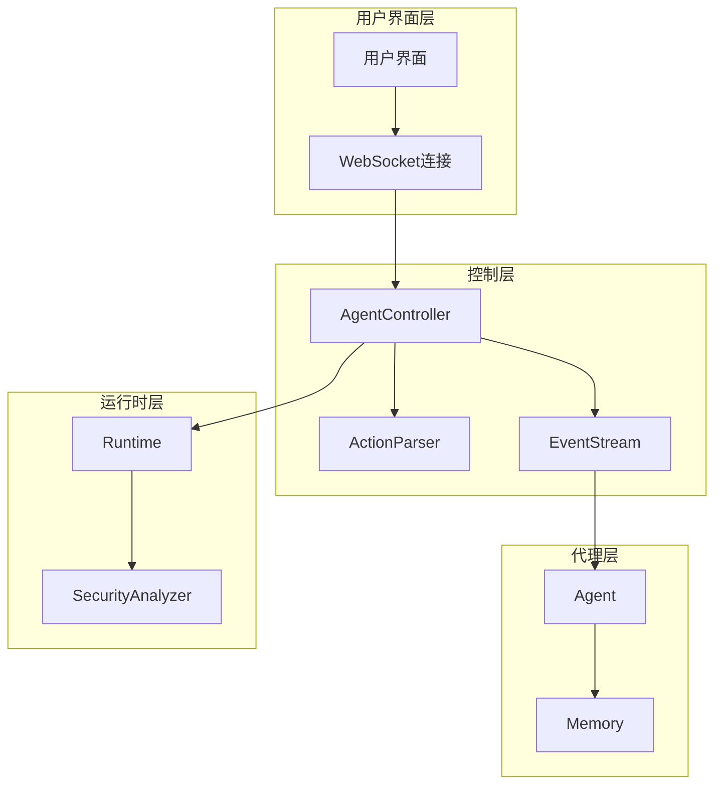
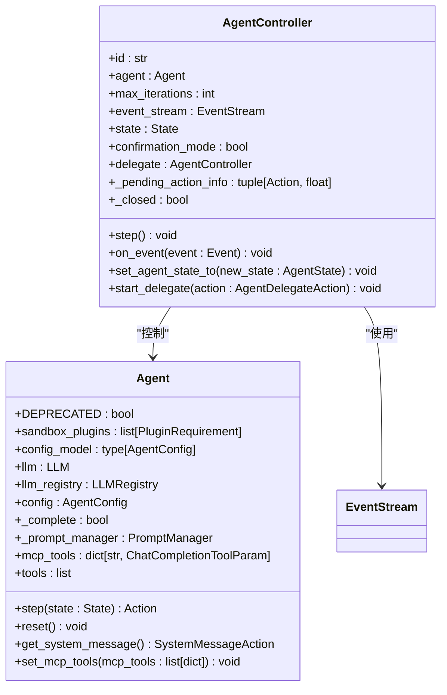
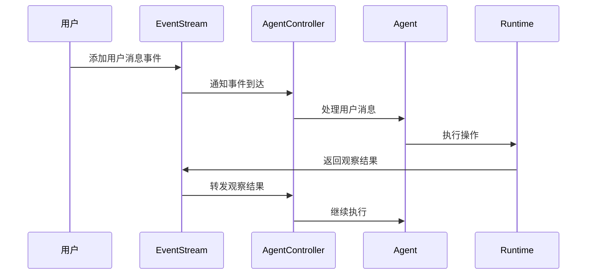
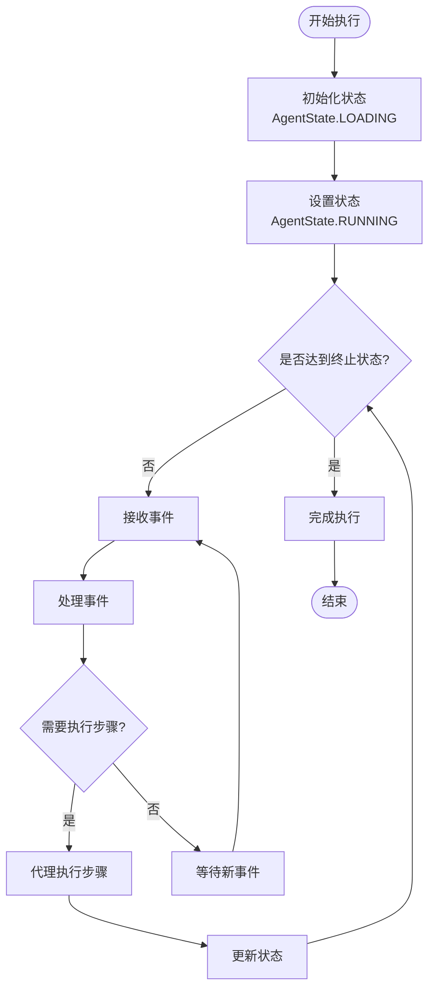
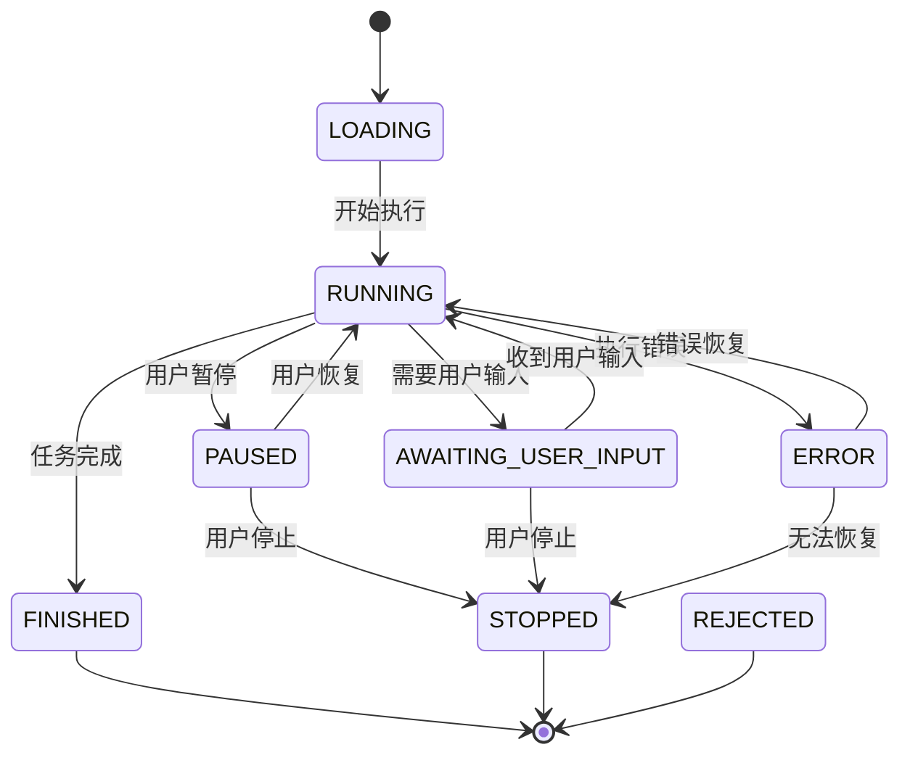
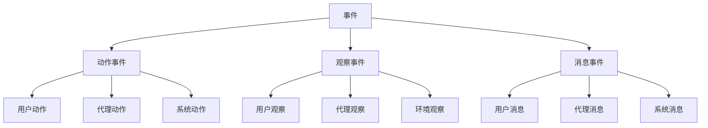
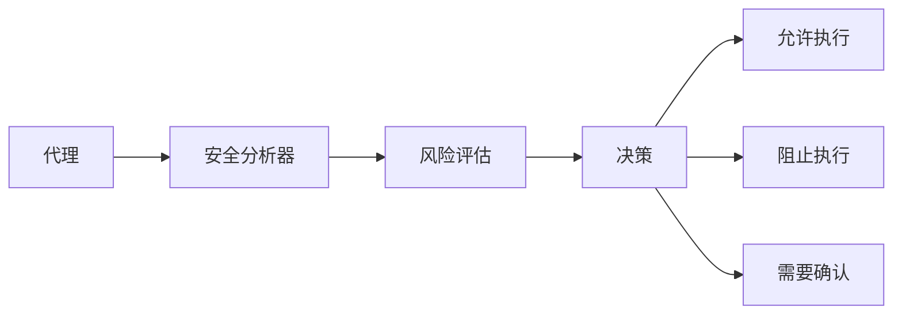
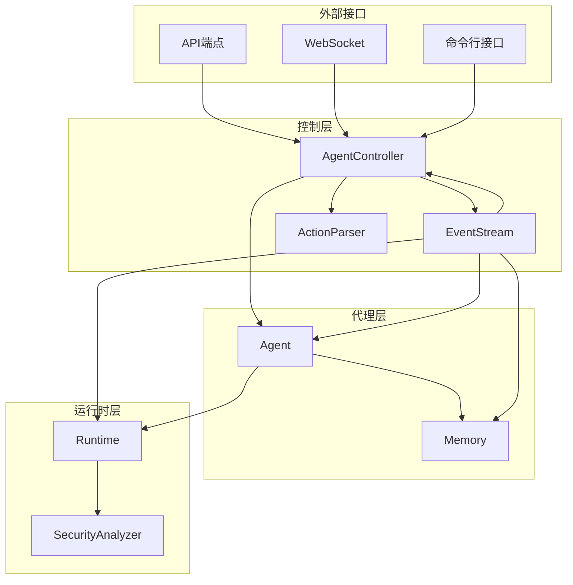
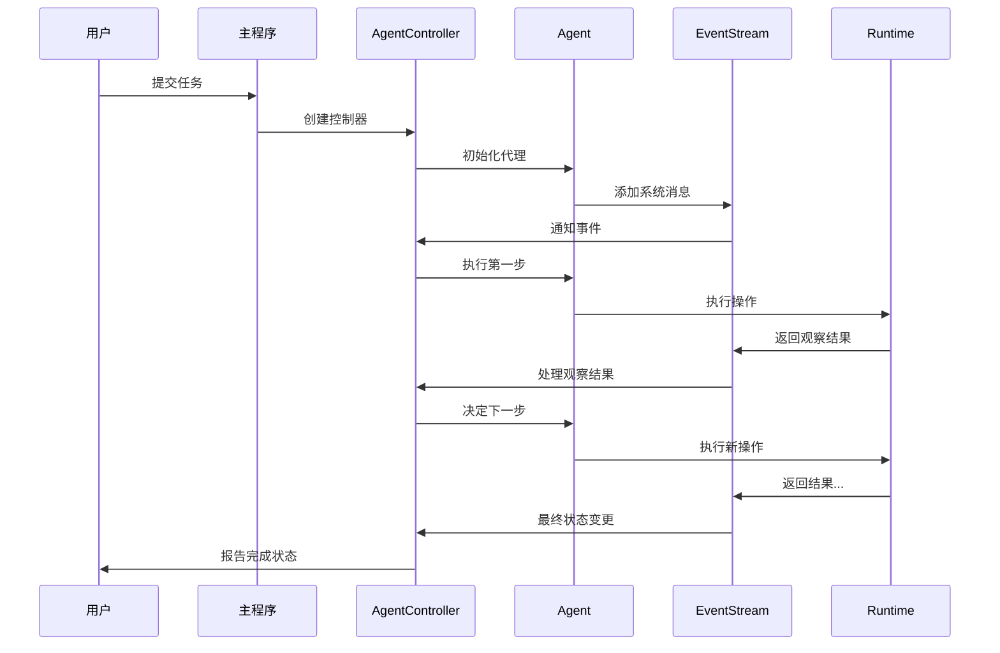

# 核心概念

<cite>
**本文档引用的文件**
- [agent.py](file://openhands/controller/agent.py)
- [agent_controller.py](file://openhands/controller/agent_controller.py)
- [stream.py](file://openhands/events/stream.py)
- [base.py](file://openhands/runtime/base.py)
- [loop.py](file://openhands/core/loop.py)
- [main.py](file://openhands/core/main.py)
- [event.py](file://openhands/events/event.py)
- [action_parser.py](file://openhands/controller/action_parser.py)
- [agent.py](file://openhands/core/schema/agent.py)
- [state.py](file://openhands/controller/state/state.py)
</cite>

## 目录
1. [简介](#简介)
2. [系统架构概览](#系统架构概览)
3. [核心组件详解](#核心组件详解)
4. [代理执行循环](#代理执行循环)
5. [状态管理系统](#状态管理系统)
6. [事件流处理](#事件流处理)
7. [运行时环境](#运行时环境)
8. [交互关系图](#交互关系图)
9. [生命周期流程](#生命周期流程)
10. [故障排除指南](#故障排除指南)
11. [总结](#总结)

## 简介

OpenHands是一个先进的多智能体系统，其核心围绕着Agent、Controller、EventStream和Runtime四个关键组件构建。这些组件通过精心设计的交互机制协同工作，实现复杂的任务执行和状态管理。本文档深入探讨了这些核心概念及其相互关系，为开发者提供全面的系统理解。

## 系统架构概览

OpenHands采用分层架构设计，每个组件都有明确的职责和边界：

**图表来源**
- [agent_controller.py](file://openhands/controller/agent_controller.py#L101-L200)
- [stream.py](file://openhands/events/stream.py#L43-L100)
- [base.py](file://openhands/runtime/base.py#L91-L150)

## 核心组件详解

### Agent（代理）

Agent是系统的核心执行实体，负责理解和执行用户指令。每个Agent都继承自抽象基类，具有统一的接口规范：

**图表来源**
- [agent.py](file://openhands/controller/agent.py#L25-L184)
- [agent_controller.py](file://openhands/controller/agent_controller.py#L101-L200)

**章节来源**
- [agent.py](file://openhands/controller/agent.py#L25-L184)
- [agent_controller.py](file://openhands/controller/agent_controller.py#L101-L200)

### Controller（控制器）

AgentController作为代理的管理者，负责协调代理执行、状态管理和事件处理：

- **代理生命周期管理**：创建、启动、暂停、停止代理实例
- **状态监控**：跟踪代理执行状态和性能指标
- **事件路由**：在代理、运行时和内存之间转发事件
- **委托管理**：支持多代理协作和任务分解

### EventStream（事件流）

EventStream是系统的通信中枢，提供异步事件传递机制：

**图表来源**
- [stream.py](file://openhands/events/stream.py#L130-L200)
- [agent_controller.py](file://openhands/controller/agent_controller.py#L443-L475)

**章节来源**
- [stream.py](file://openhands/events/stream.py#L43-L292)
- [agent_controller.py](file://openhands/controller/agent_controller.py#L443-L475)

### Runtime（运行时）

Runtime提供代理执行的沙箱环境，支持多种执行模式：

- **容器化执行**：Docker容器隔离
- **远程执行**：云端资源利用
- **本地开发**：快速原型验证
- **安全控制**：权限和资源限制

**章节来源**
- [base.py](file://openhands/runtime/base.py#L91-L300)

## 代理执行循环

代理执行循环是系统的核心工作机制，实现了持续的任务执行和状态更新：

**图表来源**
- [loop.py](file://openhands/core/loop.py#L11-L48)
- [main.py](file://openhands/core/main.py#L237-L241)

**章节来源**
- [loop.py](file://openhands/core/loop.py#L11-L48)
- [main.py](file://openhands/core/main.py#L237-L241)

### 执行循环的关键特性

1. **异步处理**：基于asyncio的非阻塞执行模型
2. **状态驱动**：根据当前状态决定下一步行动
3. **事件响应**：实时响应各种类型的事件
4. **错误恢复**：具备异常情况下的恢复机制

## 状态管理系统

OpenHands定义了丰富的代理状态集合，支持复杂的执行流程控制：

| 状态 | 描述 | 触发条件 |
|------|------|----------|
| LOADING | 代理正在加载 | 初始化代理实例 |
| RUNNING | 代理正在执行任务 | 接收到用户输入或环境变化 |
| AWAITING_USER_INPUT | 等待用户输入 | 需要用户确认或进一步指示 |
| PAUSED | 代理已暂停 | 用户主动暂停或系统暂停 |
| STOPPED | 代理已停止 | 用户主动停止或系统停止 |
| FINISHED | 任务已完成 | 成功完成所有任务要求 |
| REJECTED | 任务被拒绝 | 代理认为任务无法完成 |
| ERROR | 发生错误 | 执行过程中出现异常 |
| AWAITING_USER_CONFIRMATION | 等待用户确认 | 需要用户批准高风险操作 |
| USER_CONFIRMED | 用户已确认 | 用户批准了操作 |
| USER_REJECTED | 用户已拒绝 | 用户拒绝了操作 |
| RATE_LIMITED | 受到速率限制 | LLM API调用频率过高 |

**章节来源**
- [agent.py](file://openhands/core/schema/agent.py#L3-L52)

### 状态转换机制

**图表来源**
- [agent.py](file://openhands/core/schema/agent.py#L3-L52)

## 事件流处理

事件流系统提供了强大的异步通信能力，支持多种事件类型和处理模式：

### 事件类型分类

**图表来源**
- [event.py](file://openhands/events/event.py#L35-L132)

### 事件处理流程

1. **事件生成**：由Agent、Runtime或其他组件产生
2. **事件验证**：检查事件格式和完整性
3. **事件路由**：根据目标订阅者分发事件
4. **事件处理**：各订阅者执行相应的处理逻辑
5. **状态更新**：更新相关组件的状态信息

**章节来源**
- [stream.py](file://openhands/events/stream.py#L130-L292)
- [event.py](file://openhands/events/event.py#L35-L132)

## 运行时环境

运行时环境为代理提供安全、隔离的执行空间：

### 运行时特性

- **沙箱隔离**：防止恶意代码影响系统
- **资源控制**：CPU、内存、网络资源限制
- **工具集成**：支持多种开发工具和编辑器
- **持久化存储**：文件系统和数据库访问
- **网络访问**：受控的互联网连接

### 安全机制

**图表来源**
- [base.py](file://openhands/runtime/base.py#L196-L206)

**章节来源**
- [base.py](file://openhands/runtime/base.py#L91-L800)

## 交互关系图

系统各组件之间的复杂交互关系：

**图表来源**
- [agent_controller.py](file://openhands/controller/agent_controller.py#L101-L200)
- [stream.py](file://openhands/events/stream.py#L43-L100)
- [base.py](file://openhands/runtime/base.py#L91-L150)

## 生命周期流程

从任务开始到结束的完整生命周期：

**图表来源**
- [main.py](file://openhands/core/main.py#L52-L170)
- [agent_controller.py](file://openhands/controller/agent_controller.py#L477-L495)

**章节来源**
- [main.py](file://openhands/core/main.py#L52-L311)

### 关键里程碑

1. **初始化阶段**：配置加载、依赖注入、环境准备
2. **启动阶段**：代理激活、系统消息发送、初始状态设置
3. **执行阶段**：任务分解、子任务执行、状态监控
4. **协作阶段**：多代理协作、委托机制、资源共享
5. **完成阶段**：结果汇总、状态清理、资源释放

## 故障排除指南

### 常见问题及解决方案

#### 代理状态异常

**问题**：代理卡在某个状态无法继续
**原因**：事件丢失、状态同步失败、死锁
**解决**：
- 检查EventStream连接状态
- 验证代理状态机逻辑
- 查看日志中的错误信息

#### 执行超时

**问题**：代理长时间无响应
**原因**：LLM调用超时、资源竞争、死循环
**解决**：
- 调整超时参数配置
- 检查资源使用情况
- 分析执行路径是否存在循环

#### 内存泄漏

**问题**：系统内存持续增长
**原因**：事件缓存过多、对象未正确释放
**解决**：
- 清理EventStream缓存
- 实现对象池管理
- 监控内存使用趋势

**章节来源**
- [agent_controller.py](file://openhands/controller/agent_controller.py#L312-L400)
- [base.py](file://openhands/runtime/base.py#L223-L228)

## 总结

OpenHands的Agent系统通过精心设计的架构实现了高度模块化和可扩展性。核心组件Agent、Controller、EventStream和Runtime各司其职，通过事件驱动的异步通信机制协同工作。这种设计不仅保证了系统的稳定性和可靠性，还为未来的功能扩展和优化奠定了坚实基础。

理解这些核心概念对于开发和维护OpenHands系统至关重要。通过掌握代理执行循环的工作原理、状态管理机制和事件处理流程，开发者能够更好地利用系统能力，构建高效、可靠的自动化解决方案。