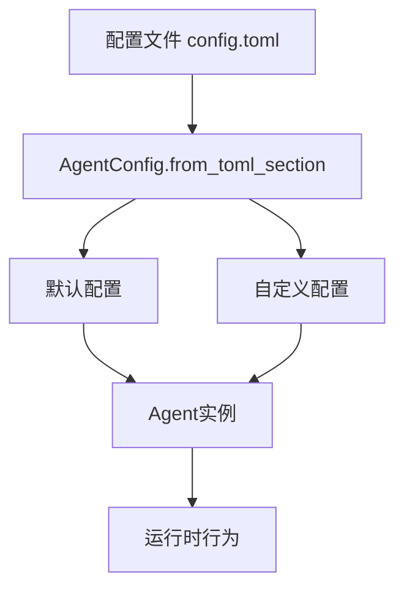
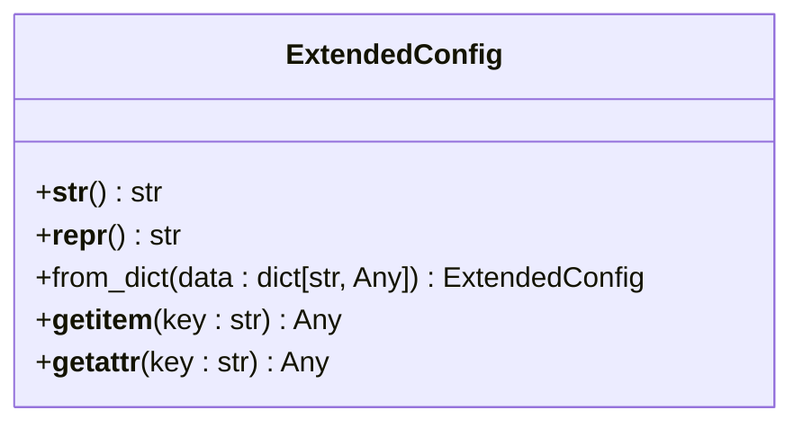
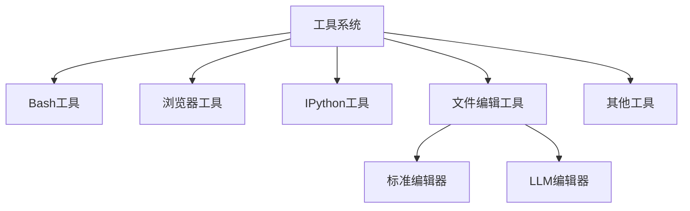

# 配置与扩展

<cite>
**本文档中引用的文件**  
- [agent_config.py](file://openhands/core/config/agent_config.py)
- [extended_config.py](file://openhands/core/config/extended_config.py)
- [codeact_agent.py](file://openhands/agenthub/codeact_agent/codeact_agent.py)
- [bash.py](file://openhands/agenthub/codeact_agent/tools/bash.py)
- [browser.py](file://openhands/agenthub/codeact_agent/tools/browser.py)
- [ipython.py](file://openhands/agenthub/codeact_agent/tools/ipython.py)
- [str_replace_editor.py](file://openhands/agenthub/codeact_agent/tools/str_replace_editor.py)
- [llm_based_edit.py](file://openhands/agenthub/codeact_agent/tools/llm_based_edit.py)
- [config.template.toml](file://config.template.toml)
</cite>

## 目录
1. [简介](#简介)
2. [Agent配置体系](#agent配置体系)
3. [核心配置参数详解](#核心配置参数详解)
4. [扩展配置机制](#扩展配置机制)
5. [工具系统与插件机制](#工具系统与插件机制)
6. [自定义工具开发指南](#自定义工具开发指南)
7. [最佳实践与注意事项](#最佳实践与注意事项)

## 简介
本文档全面介绍OpenHands Agent系统的配置与扩展机制。重点阐述agent_config.py中的各项配置参数及其作用范围，包括LLM配置、工具启用开关、安全限制等。详细说明如何通过扩展配置（extended_config）自定义Agent行为，以及Agent的插件机制，特别是codeact_agent中tools目录下的各种工具（bash、browser、ipython等）的集成方式。提供添加自定义工具和修改现有工具的步骤指南，包含代码示例和最佳实践。

## Agent配置体系
OpenHands Agent的配置体系基于Pydantic模型构建，通过分层配置实现灵活的系统定制。核心配置类AgentConfig定义了Agent的运行时行为，包括工具启用状态、LLM配置、安全限制等。配置系统支持从TOML文件加载配置，并允许通过classpath指定自定义Agent实现。

配置体系采用默认配置与自定义配置相结合的方式，通过from_toml_section方法解析配置文件中的[agent]部分，构建默认配置和针对特定Agent的自定义配置映射。这种设计使得系统能够为不同类型的Agent应用不同的配置策略，同时保持配置的一致性和可维护性。



**图表来源**
- [agent_config.py](file://openhands/core/config/agent_config.py#L82-L158)

**本节来源**
- [agent_config.py](file://openhands/core/config/agent_config.py#L15-L159)

## 核心配置参数详解
AgentConfig类定义了控制Agent行为的核心参数，这些参数可分为多个功能类别：

### LLM与运行时配置
| 参数 | 类型 | 默认值 | 说明 |
|------|------|--------|------|
| llm_config | str \| None | None | 指定使用的LLM配置名称，优先级高于全局LLM配置 |
| runtime | str \| None | None | 运行时类型（如'docker'、'local'、'cli'），用于控制运行时特定行为 |
| cli_mode | bool | False | 是否在CLI模式下运行，可用于禁用不支持的工具 |

### 工具启用开关
| 参数 | 类型 | 默认值 | 说明 |
|------|------|--------|------|
| enable_cmd | bool | True | 是否启用bash工具 |
| enable_jupyter | bool | True | 是否启用Jupyter工具（在CLIRuntime中应禁用） |
| enable_browsing | bool | True | 是否启用浏览工具（在CLIRuntime中应禁用） |
| enable_editor | bool | True | 是否启用标准编辑器工具（str_replace_editor） |
| enable_llm_editor | bool | False | 是否启用LLM编辑器工具 |
| enable_think | bool | True | 是否启用思考工具 |
| enable_finish | bool | True | 是否启用完成工具 |

### 安全与扩展配置
| 参数 | 类型 | 默认值 | 说明 |
|------|------|--------|------|
| disabled_microagents | list[str] | [] | 要禁用的微代理列表（按名称） |
| enable_prompt_extensions | bool | True | 是否启用提示扩展 |
| enable_mcp | bool | True | 是否启用MCP工具 |
| extended | ExtendedConfig | {} | 代理的扩展配置 |
| condenser | CondenserConfig | ConversationWindowCondenserConfig() | 消息压缩器配置 |

**本节来源**
- [agent_config.py](file://openhands/core/config/agent_config.py#L15-L67)

## 扩展配置机制
扩展配置机制通过ExtendedConfig类实现，为系统提供了灵活的配置扩展能力。ExtendedConfig继承自Pydantic的RootModel，允许存储任意键值对的配置数据，支持通过属性访问或字典式访问。

### 扩展配置的实现
ExtendedConfig类的设计允许在不修改核心配置模型的情况下添加新的配置项。通过from_dict类方法可以创建ExtendedConfig实例，而__getitem__和__getattr__方法提供了灵活的配置访问方式。



### 扩展配置的使用场景
扩展配置主要用于以下场景：
- 存储特定于某个Agent或插件的自定义配置
- 动态添加运行时需要的配置参数
- 实现向后兼容的配置扩展
- 存储实验性功能的配置选项

扩展配置在Agent初始化时被注入，可以通过agent.config.extended访问。这种机制使得开发者可以在不修改核心代码的情况下，为Agent添加新的功能和行为。

**图表来源**
- [extended_config.py](file://openhands/core/config/extended_config.py#L6-L42)

**本节来源**
- [extended_config.py](file://openhands/core/config/extended_config.py#L1-L42)

## 工具系统与插件机制
OpenHands Agent的工具系统基于CodeAct架构设计，通过工具注册机制实现功能扩展。每个工具以函数调用的形式暴露给LLM，允许Agent通过执行代码来完成任务。

### 工具注册与管理
CodeActAgent通过_get_tools方法管理可用工具，根据配置参数动态启用或禁用工具。工具的启用状态由AgentConfig中的相应布尔值控制，如enable_cmd、enable_browsing等。

```python
def _get_tools(self) -> list['ChatCompletionToolParam']:
    tools = []
    if self.config.enable_cmd:
        tools.append(create_cmd_run_tool(use_short_description=use_short_tool_desc))
    if self.config.enable_browsing:
        tools.append(BrowserTool)
    # ... 其他工具
    return tools
```

### 核心工具实现
#### Bash工具
Bash工具通过create_cmd_run_tool函数创建，支持执行终端命令。工具参数包括：
- command: 要执行的bash命令
- is_input: 是否为运行中进程的输入
- timeout: 命令执行的硬超时（秒）
- security_risk: 安全风险级别

#### 浏览器工具
浏览器工具通过BrowserTool实现，基于BrowserGym核心动作集。支持通过Python代码与网页交互，包括导航、表单填写、点击等操作。工具参数包括：
- code: 与浏览器交互的Python代码
- security_risk: 安全风险级别

#### IPython工具
IPython工具通过IPythonTool实现，允许在IPython环境中执行代码单元。适用于需要持久化变量和包导入的场景。工具参数包括：
- code: 要执行的Python代码
- security_risk: 安全风险级别

#### 文件编辑工具
系统提供两种文件编辑工具：
1. **标准编辑器(str_replace_editor)**：通过精确字符串替换进行文件编辑
2. **LLM编辑器(llm_based_edit)**：基于LLM的智能文件编辑



**图表来源**
- [codeact_agent.py](file://openhands/agenthub/codeact_agent/codeact_agent.py#L108-L153)
- [bash.py](file://openhands/agenthub/codeact_agent/tools/bash.py#L42-L83)
- [browser.py](file://openhands/agenthub/codeact_agent/tools/browser.py#L147-L172)
- [ipython.py](file://openhands/agenthub/codeact_agent/tools/ipython.py#L13-L35)

**本节来源**
- [codeact_agent.py](file://openhands/agenthub/codeact_agent/codeact_agent.py#L108-L153)
- [bash.py](file://openhands/agenthub/codeact_agent/tools/bash.py#L1-L83)
- [browser.py](file://openhands/agenthub/codeact_agent/tools/browser.py#L1-L172)
- [ipython.py](file://openhands/agenthub/codeact_agent/tools/ipython.py#L1-L35)
- [str_replace_editor.py](file://openhands/agenthub/codeact_agent/tools/str_replace_editor.py#L1-L162)
- [llm_based_edit.py](file://openhands/agenthub/codeact_agent/tools/llm_based_edit.py#L1-L156)

## 自定义工具开发指南
开发自定义工具需要遵循OpenHands的工具接口规范，主要步骤如下：

### 创建新工具
1. 在tools目录下创建新的工具模块
2. 定义工具函数或类，遵循ChatCompletionToolParam格式
3. 在__init__.py中导出新工具

```python
# 示例：创建自定义工具
from litellm import ChatCompletionToolParam, ChatCompletionToolParamFunctionChunk

_CUSTOM_TOOL_DESCRIPTION = """自定义工具描述"""

CustomTool = ChatCompletionToolParam(
    type='function',
    function=ChatCompletionToolParamFunctionChunk(
        name='custom_tool_name',
        description=_CUSTOM_TOOL_DESCRIPTION,
        parameters={
            'type': 'object',
            'properties': {
                'param1': {
                    'type': 'string',
                    'description': '参数1描述'
                },
                'security_risk': {
                    'type': 'string',
                    'description': '安全风险描述',
                    'enum': ['LOW', 'MEDIUM', 'HIGH']
                }
            },
            'required': ['param1', 'security_risk']
        }
    )
)
```

### 集成到Agent
1. 在Agent的_get_tools方法中添加新工具
2. 添加相应的配置开关到AgentConfig
3. 在codeact_agent.py中导入并注册工具

### 最佳实践
- 工具描述应清晰明确，包含使用示例
- 参数设计应考虑安全性和易用性
- 添加适当的错误处理和边界检查
- 遵循现有工具的命名和结构规范
- 在工具描述中明确安全风险级别

**本节来源**
- [bash.py](file://openhands/agenthub/codeact_agent/tools/bash.py#L42-L83)
- [browser.py](file://openhands/agenthub/codeact_agent/tools/browser.py#L147-L172)
- [codeact_agent.py](file://openhands/agenthub/codeact_agent/codeact_agent.py#L108-L153)

## 最佳实践与注意事项
### 配置管理最佳实践
- 使用config.template.toml作为配置模板
- 为不同环境创建独立的配置文件
- 避免在生产环境中启用调试模式
- 定期审查和更新安全配置

### 工具使用注意事项
- 在CLIRuntime中禁用Jupyter和浏览工具
- 合理设置命令超时，避免长时间运行的进程
- 使用绝对路径进行文件操作
- 在编辑文件时确保old_str参数的精确匹配

### 安全考虑
- 严格管理API密钥和敏感信息
- 启用安全分析器以检测潜在风险
- 限制文件上传类型和大小
- 定期审查工具的安全风险级别

### 性能优化
- 根据LLM模型选择合适的工具描述长度
- 合理配置消息压缩策略
- 优化工具调用频率和参数
- 监控和调整超时设置

**本节来源**
- [agent_config.py](file://openhands/core/config/agent_config.py#L15-L67)
- [utils.py](file://openhands/core/config/utils.py#L456-L467)
- [config.template.toml](file://config.template.toml#L1-L200)