# 事件处理流程

<cite>
**本文档中引用的文件**
- [event_filter.py](file://openhands/events/event_filter.py)
- [tool.py](file://openhands/events/tool.py)
- [agent_controller.py](file://openhands/controller/agent_controller.py)
- [use-event-store.ts](file://frontend/src/stores/use-event-store.ts)
- [event_store.py](file://openhands/events/event_store.py)
- [stream.py](file://openhands/events/stream.py)
- [use-handle-ws-events.ts](file://frontend/src/hooks/use-handle-ws-events.ts)
- [handle-event-for-ui.ts](file://frontend/src/utils/handle-event-for-ui.ts)
- [event-logger.ts](file://frontend/src/utils/event-logger.ts)
- [conversation-websocket-handler.test.tsx](file://frontend/__tests__/conversation-websocket-handler.test.tsx)
- [test_event_stream.py](file://tests/unit/events/test_event_stream.py)
- [test_contextual_events.py](file://tests/unit/events/test_contextual_events.py)
- [test_nested_event_store.py](file://tests/unit/events/test_nested_event_store.py)
</cite>

## 目录
1. [概述](#概述)
2. [事件生命周期](#事件生命周期)
3. [事件过滤器架构](#事件过滤器架构)
4. [工具模块设计](#工具模块设计)
5. [控制器机制](#控制器机制)
6. [前端事件存储](#前端事件存储)
7. [错误处理与调试](#错误处理与调试)
8. [事件流分析示例](#事件流分析示例)
9. [性能优化策略](#性能优化策略)
10. [总结](#总结)

## 概述

OpenHands事件处理系统是一个复杂而精密的架构，负责管理从事件生成到消费的完整生命周期。该系统采用分层设计，包含事件过滤、工具调用、控制器协调和前端实时更新等多个核心组件。

### 系统架构概览

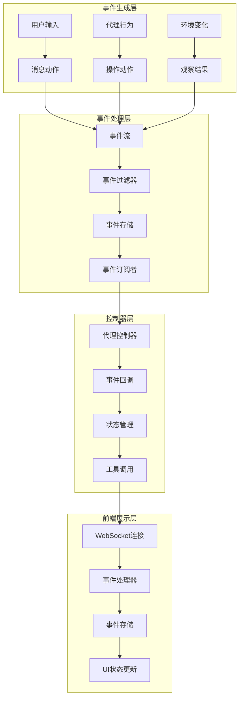
```mermaid
graph TB
subgraph "事件生成层"
A[用户输入] --> B[消息动作]
C[代理行为] --> D[操作动作]
E[环境变化] --> F[观察结果]
end
subgraph "事件处理层"
G[事件流] --> H[事件过滤器]
H --> I[事件存储]
I --> J[事件订阅者]
end
subgraph "控制器层"
K[代理控制器] --> L[事件回调]
L --> M[状态管理]
M --> N[工具调用]
end
subgraph "前端展示层"
O[WebSocket连接] --> P[事件处理器]
P --> Q[事件存储]
Q --> R[UI状态更新]
end
B --> G
D --> G
F --> G
J --> K
N --> O
```

**图表来源**
- [stream.py](file://openhands/events/stream.py#L43-L292)
- [agent_controller.py](file://openhands/controller/agent_controller.py#L101-L800)
- [use-event-store.ts](file://frontend/src/stores/use-event-store.ts#L1-L39)

## 事件生命周期

### 事件生成阶段

事件生命周期的第一阶段是事件的生成，涉及多种类型的事件源：

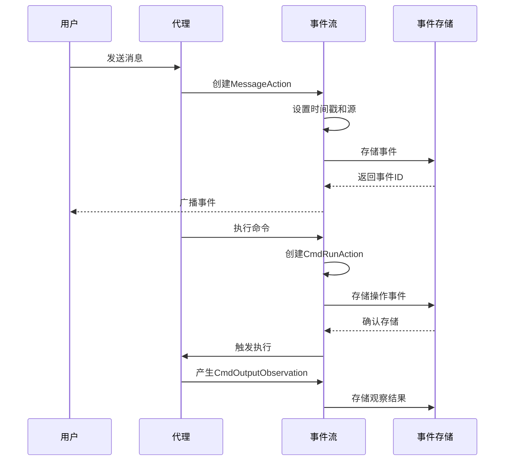
```mermaid
sequenceDiagram
participant U as 用户
participant A as 代理
participant E as 事件流
participant S as 事件存储
U->>A : 发送消息
A->>E : 创建MessageAction
E->>E : 设置时间戳和源
E->>S : 存储事件
S-->>E : 返回事件ID
E-->>U : 广播事件
A->>E : 执行命令
E->>E : 创建CmdRunAction
E->>S : 存储操作事件
S-->>E : 确认存储
E->>A : 触发执行
A->>E : 产生CmdOutputObservation
E->>S : 存储观察结果
```

**图表来源**
- [stream.py](file://openhands/events/stream.py#L163-L203)
- [agent_controller.py](file://openhands/controller/agent_controller.py#L477-L510)

### 事件传播机制

事件在系统中的传播遵循严格的订阅-发布模式：

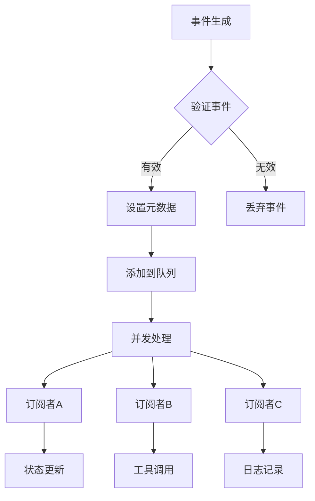
```mermaid
flowchart TD
A[事件生成] --> B{验证事件}
B --> |有效| C[设置元数据]
B --> |无效| D[丢弃事件]
C --> E[添加到队列]
E --> F[并发处理]
F --> G[订阅者A]
F --> H[订阅者B]
F --> I[订阅者C]
G --> J[状态更新]
H --> K[工具调用]
I --> L[日志记录]
```

**节来源**
- [stream.py](file://openhands/events/stream.py#L246-L292)

## 事件过滤器架构

### 过滤器设计原理

EventFilter提供了灵活的事件筛选机制，支持多维度的过滤条件：

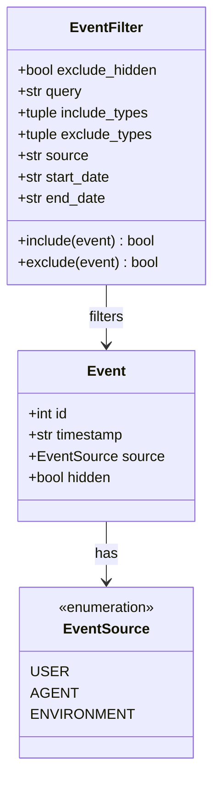
```mermaid
classDiagram
class EventFilter {
+bool exclude_hidden
+str query
+tuple include_types
+tuple exclude_types
+str source
+str start_date
+str end_date
+include(event) bool
+exclude(event) bool
}
class Event {
+int id
+str timestamp
+EventSource source
+bool hidden
}
class EventSource {
<<enumeration>>
USER
AGENT
ENVIRONMENT
}
EventFilter --> Event : filters
Event --> EventSource : has
```

**图表来源**
- [event_filter.py](file://openhands/events/event_filter.py#L8-L99)

### 过滤逻辑实现

过滤器的核心算法实现了复杂的匹配逻辑：

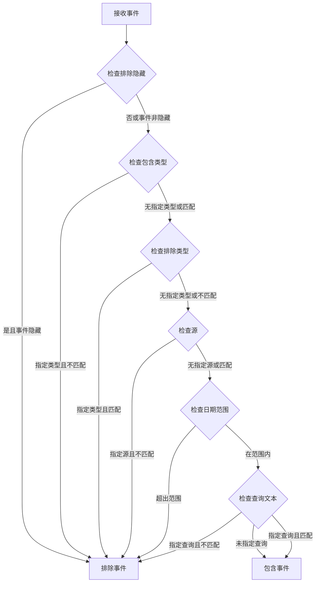
```mermaid
flowchart TD
A[接收事件] --> B{检查排除隐藏}
B --> |是且事件隐藏| C[排除事件]
B --> |否或事件非隐藏| D{检查包含类型}
D --> |指定类型且不匹配| C
D --> |无指定类型或匹配| E{检查排除类型}
E --> |指定类型且匹配| C
E --> |无指定类型或不匹配| F{检查源}
F --> |指定源且不匹配| C
F --> |无指定源或匹配| G{检查日期范围}
G --> |超出范围| C
G --> |在范围内| H{检查查询文本}
H --> |未指定查询| I[包含事件]
H --> |指定查询且匹配| I
H --> |指定查询且不匹配| C
```

**图表来源**
- [event_filter.py](file://openhands/events/event_filter.py#L38-L86)

**节来源**
- [event_filter.py](file://openhands/events/event_filter.py#L8-L99)

## 工具模块设计

### 工具调用架构

Tool模块负责处理各种工具的调用和管理：

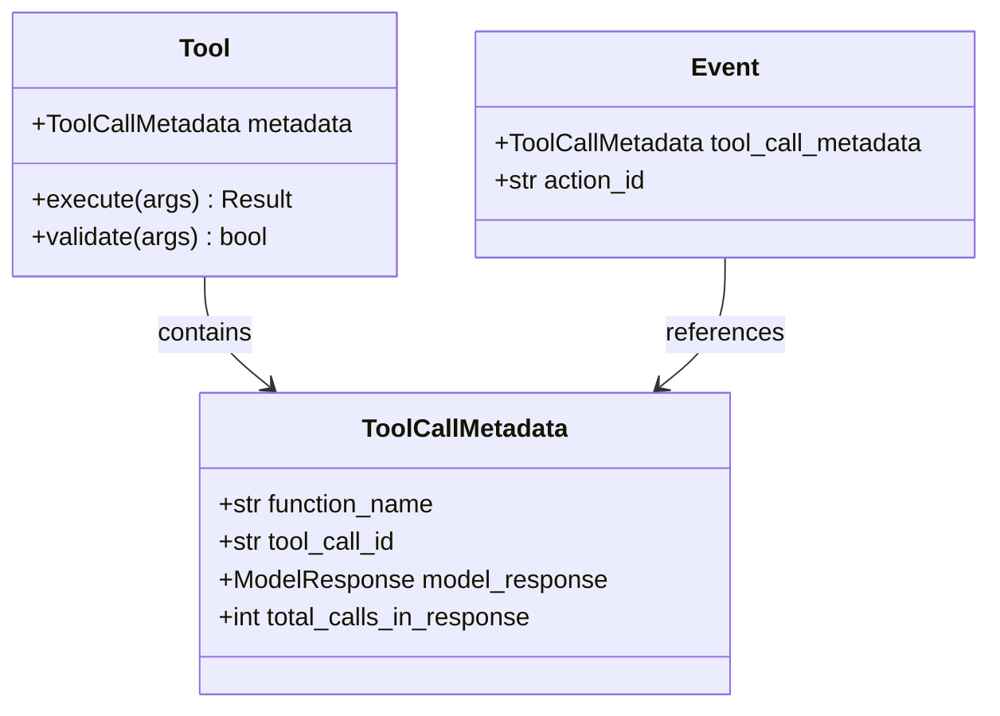
```mermaid
classDiagram
class ToolCallMetadata {
+str function_name
+str tool_call_id
+ModelResponse model_response
+int total_calls_in_response
}
class Tool {
+ToolCallMetadata metadata
+execute(args) Result
+validate(args) bool
}
class Event {
+ToolCallMetadata tool_call_metadata
+str action_id
}
Tool --> ToolCallMetadata : contains
Event --> ToolCallMetadata : references
```

**图表来源**
- [tool.py](file://openhands/events/tool.py#L5-L12)

### 工具调用流程

工具调用遵循严格的执行序列：

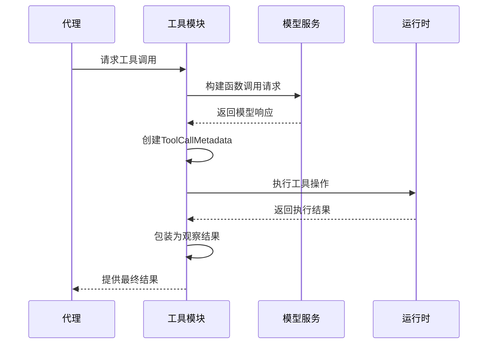
```mermaid
sequenceDiagram
participant A as 代理
participant T as 工具模块
participant M as 模型服务
participant R as 运行时
A->>T : 请求工具调用
T->>M : 构建函数调用请求
M-->>T : 返回模型响应
T->>T : 创建ToolCallMetadata
T->>R : 执行工具操作
R-->>T : 返回执行结果
T->>T : 包装为观察结果
T-->>A : 提供最终结果
```

**图表来源**
- [tool.py](file://openhands/events/tool.py#L1-L12)

**节来源**
- [tool.py](file://openhands/events/tool.py#L1-L12)

## 控制器机制

### 代理控制器架构

AgentController是事件处理的核心协调器：

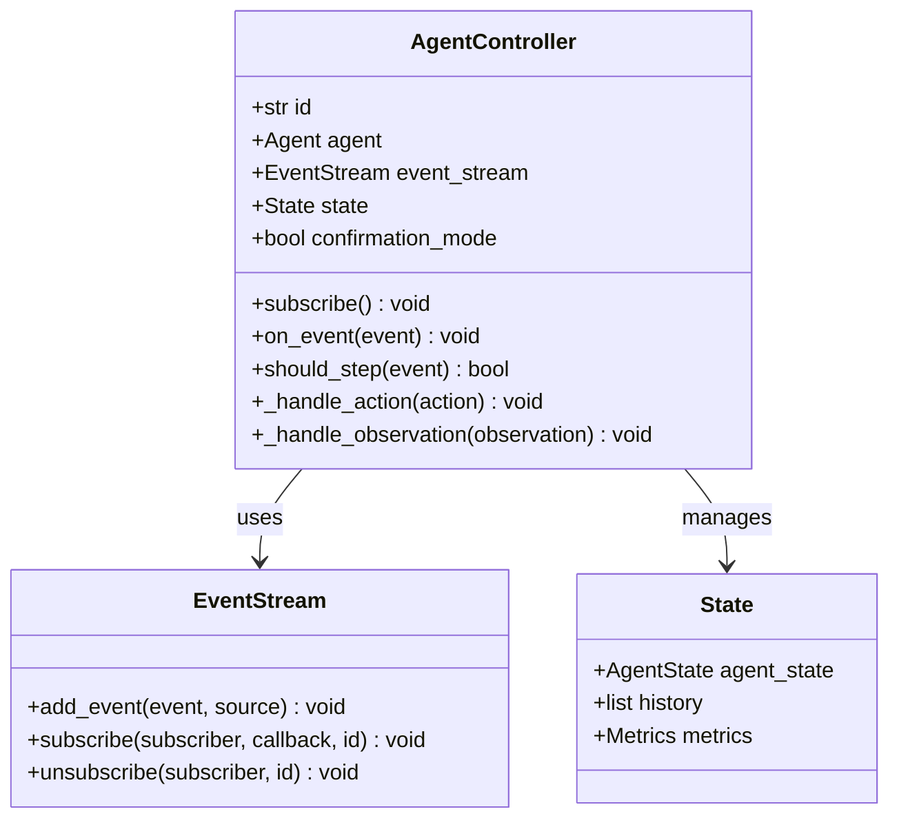
```mermaid
classDiagram
class AgentController {
+str id
+Agent agent
+EventStream event_stream
+State state
+bool confirmation_mode
+subscribe() void
+on_event(event) void
+should_step(event) bool
+_handle_action(action) void
+_handle_observation(observation) void
}
class EventStream {
+add_event(event, source) void
+subscribe(subscriber, callback, id) void
+unsubscribe(subscriber, id) void
}
class State {
+AgentState agent_state
+list history
+Metrics metrics
}
AgentController --> EventStream : uses
AgentController --> State : manages
```

**图表来源**
- [agent_controller.py](file://openhands/controller/agent_controller.py#L101-L800)

### 事件响应机制

控制器对不同类型的事件采用差异化的响应策略：

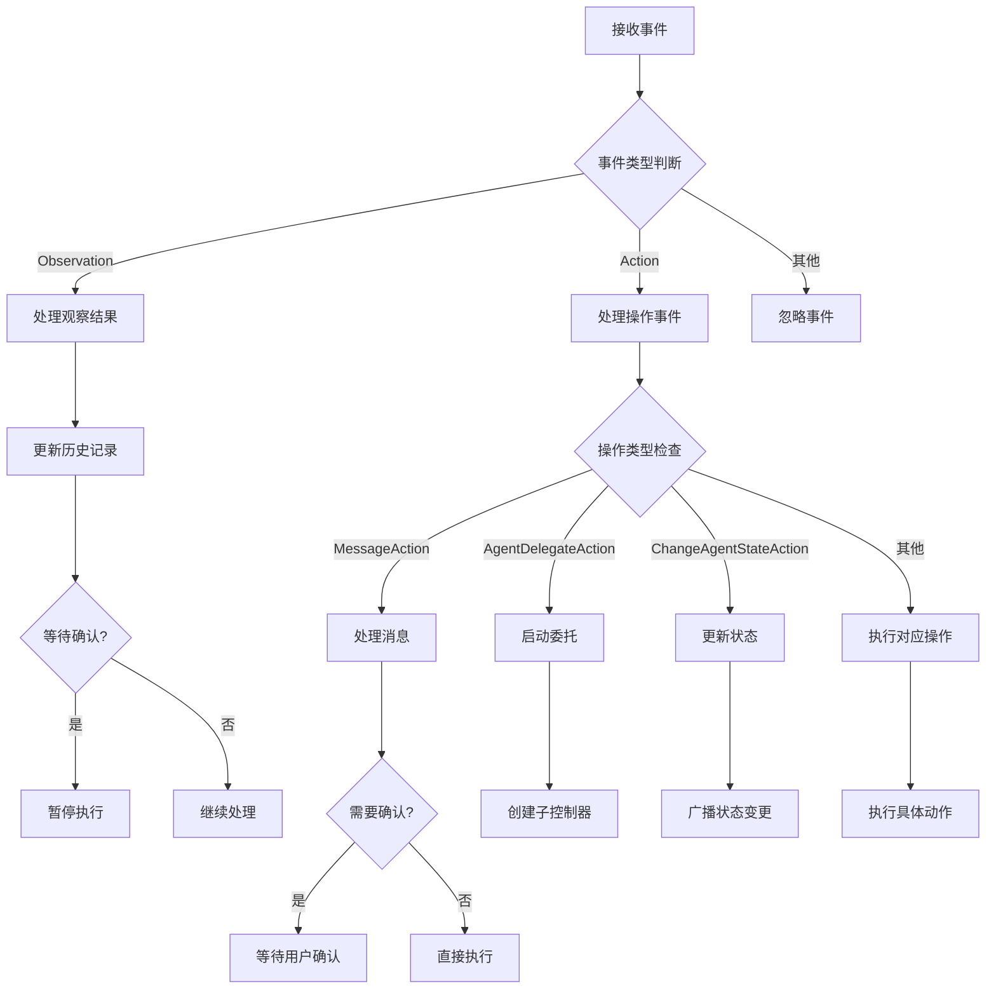
```mermaid
flowchart TD
A[接收事件] --> B{事件类型判断}
B --> |Action| C[处理操作事件]
B --> |Observation| D[处理观察结果]
B --> |其他| E[忽略事件]
C --> F{操作类型检查}
F --> |MessageAction| G[处理消息]
F --> |AgentDelegateAction| H[启动委托]
F --> |ChangeAgentStateAction| I[更新状态]
F --> |其他| J[执行对应操作]
D --> K[更新历史记录]
K --> L{等待确认?}
L --> |是| M[暂停执行]
L --> |否| N[继续处理]
G --> O{需要确认?}
O --> |是| P[等待用户确认]
O --> |否| Q[直接执行]
H --> R[创建子控制器]
I --> S[广播状态变更]
J --> T[执行具体动作]
```

**图表来源**
- [agent_controller.py](file://openhands/controller/agent_controller.py#L443-L510)

**节来源**
- [agent_controller.py](file://openhands/controller/agent_controller.py#L101-L800)

## 前端事件存储

### 状态管理架构

前端使用Zustand进行事件状态管理：

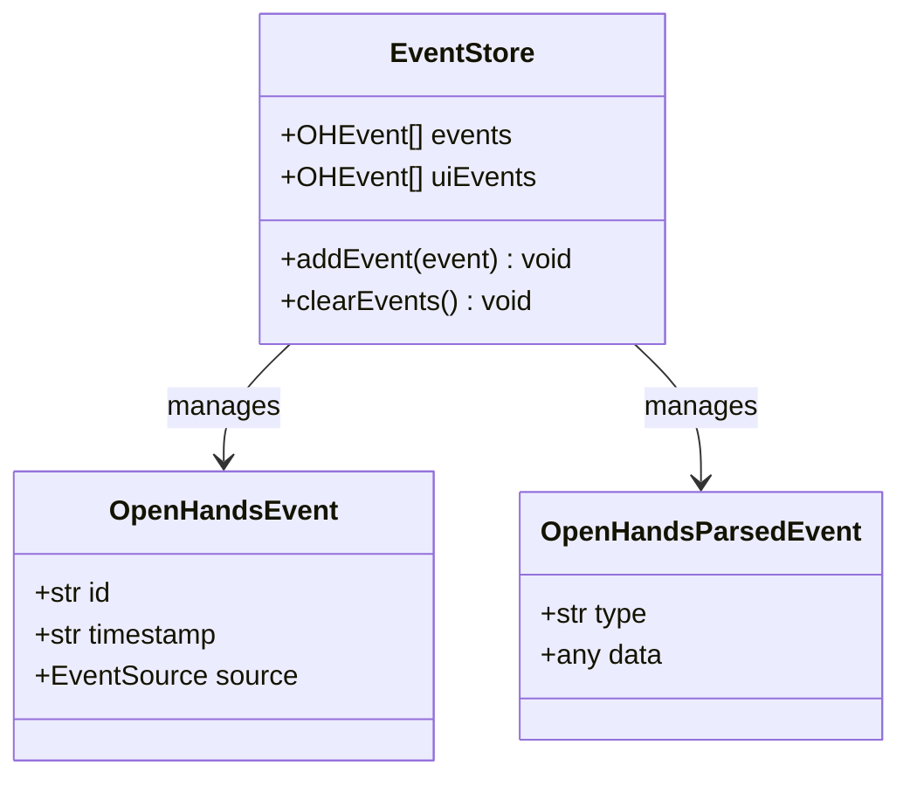
```mermaid
classDiagram
class EventStore {
+OHEvent[] events
+OHEvent[] uiEvents
+addEvent(event) void
+clearEvents() void
}
class OpenHandsEvent {
+str id
+str timestamp
+EventSource source
}
class OpenHandsParsedEvent {
+str type
+any data
}
EventStore --> OpenHandsEvent : manages
EventStore --> OpenHandsParsedEvent : manages
```

**图表来源**
- [use-event-store.ts](file://frontend/src/stores/use-event-store.ts#L10-L39)

### 实时更新机制

前端通过WebSocket连接实现实时事件更新：

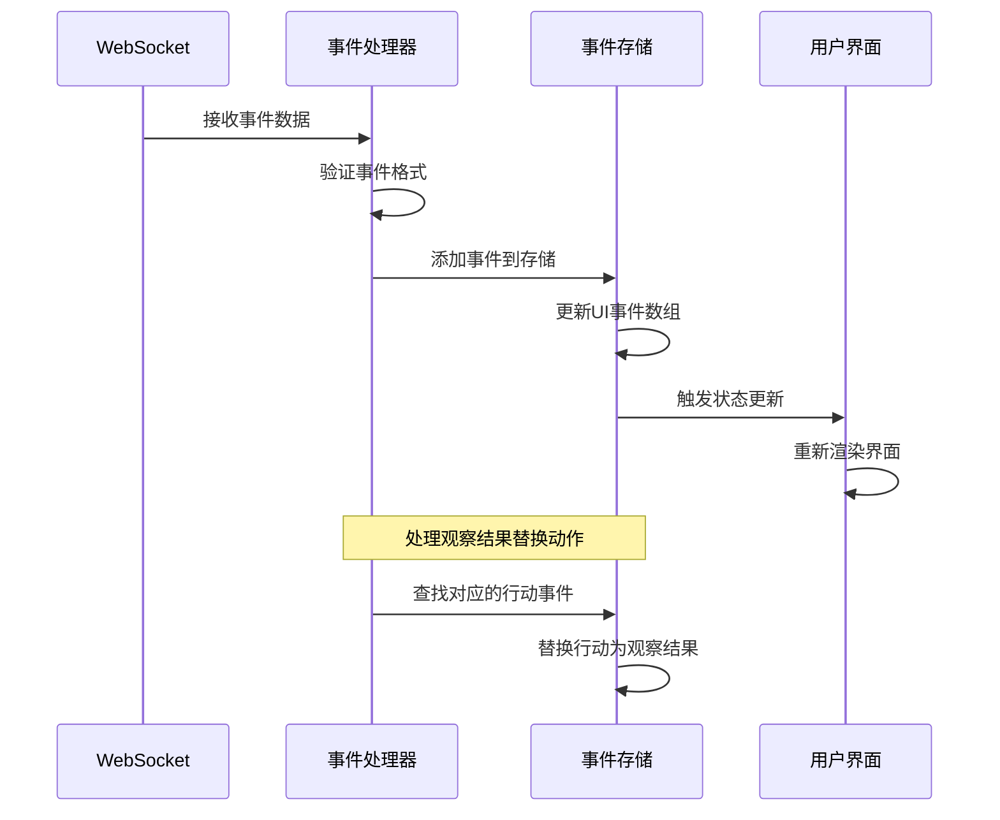
```mermaid
sequenceDiagram
participant WS as WebSocket
participant H as 事件处理器
participant S as 事件存储
participant UI as 用户界面
WS->>H : 接收事件数据
H->>H : 验证事件格式
H->>S : 添加事件到存储
S->>S : 更新UI事件数组
S->>UI : 触发状态更新
UI->>UI : 重新渲染界面
Note over H,S : 处理观察结果替换动作
H->>S : 查找对应的行动事件
S->>S : 替换行动为观察结果
```

**图表来源**
- [use-handle-ws-events.ts](file://frontend/src/hooks/use-handle-ws-events.ts#L16-L49)
- [handle-event-for-ui.ts](file://frontend/src/utils/handle-event-for-ui.ts#L8-L33)

**节来源**
- [use-event-store.ts](file://frontend/src/stores/use-event-store.ts#L1-L39)
- [use-handle-ws-events.ts](file://frontend/src/hooks/use-handle-ws-events.ts#L1-L49)
- [handle-event-for-ui.ts](file://frontend/src/utils/handle-event-for-ui.ts#L1-L33)

## 错误处理与调试

### 多层次错误处理

系统实现了多层次的错误处理机制：

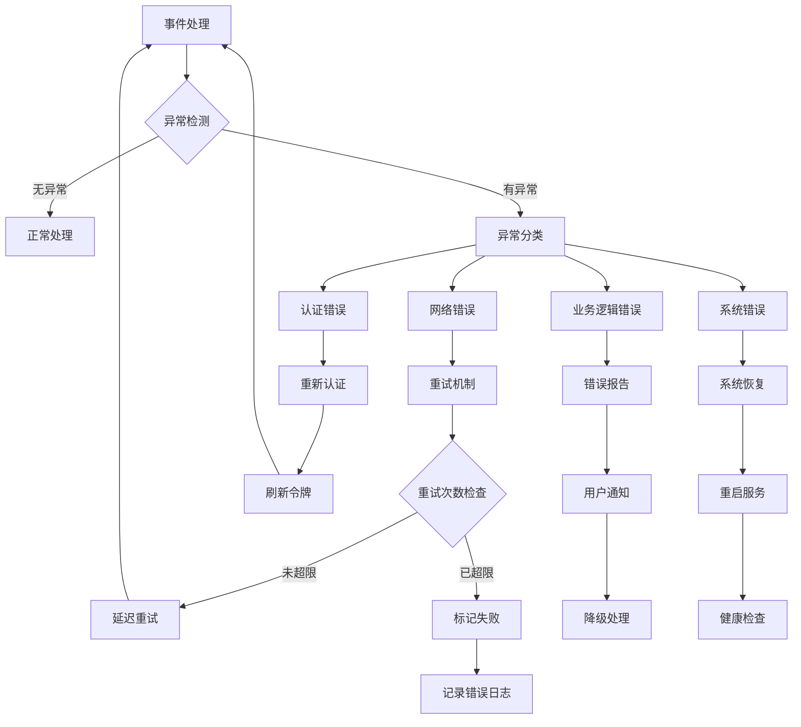
```mermaid
flowchart TD
A[事件处理] --> B{异常检测}
B --> |无异常| C[正常处理]
B --> |有异常| D[异常分类]
D --> E[网络错误]
D --> F[认证错误]
D --> G[业务逻辑错误]
D --> H[系统错误]
E --> I[重试机制]
F --> J[重新认证]
G --> K[错误报告]
H --> L[系统恢复]
I --> M{重试次数检查}
M --> |未超限| N[延迟重试]
M --> |已超限| O[标记失败]
J --> P[刷新令牌]
K --> Q[用户通知]
L --> R[重启服务]
N --> A
O --> S[记录错误日志]
P --> A
Q --> T[降级处理]
R --> U[健康检查]
```

### 调试日志系统

事件日志系统提供了全面的调试能力：

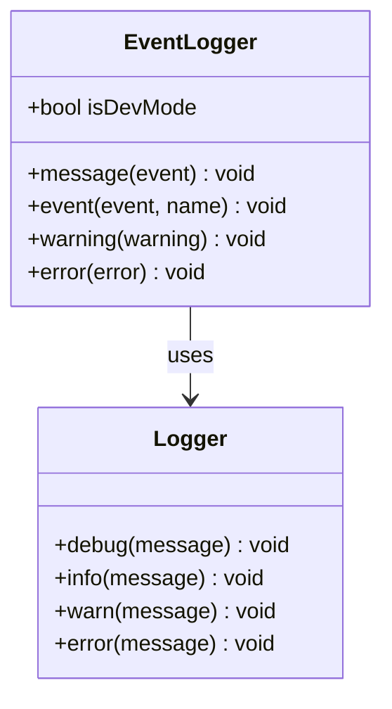
```mermaid
classDiagram
class EventLogger {
+bool isDevMode
+message(event) void
+event(event, name) void
+warning(warning) void
+error(error) void
}
class Logger {
+debug(message) void
+info(message) void
+warn(message) void
+error(message) void
}
EventLogger --> Logger : uses
```

**图表来源**
- [event-logger.ts](file://frontend/src/utils/event-logger.ts#L6-L51)

**节来源**
- [event-logger.ts](file://frontend/src/utils/event-logger.ts#L1-L51)

## 事件流分析示例

### 实际场景分析

以下是一个典型的事件流分析示例：

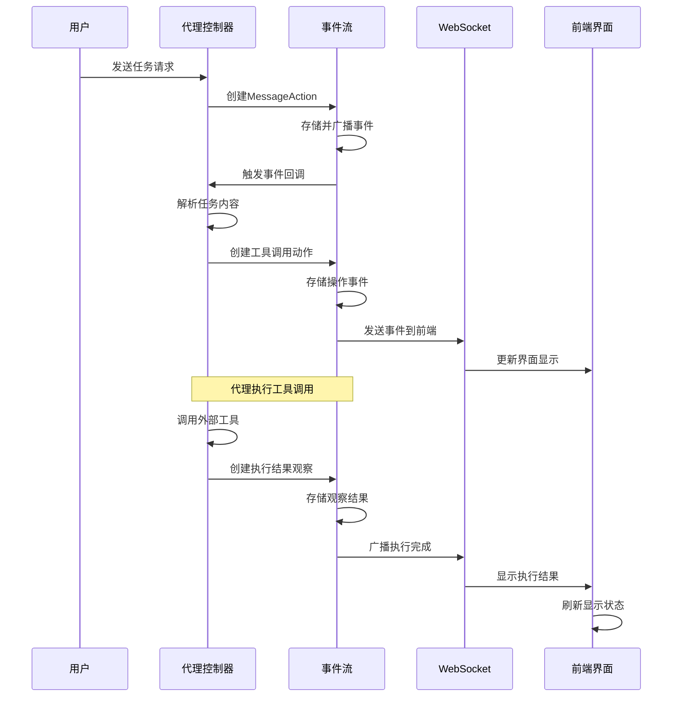
```mermaid
sequenceDiagram
participant U as 用户
participant AC as 代理控制器
participant ES as 事件流
participant WS as WebSocket
participant UI as 前端界面
U->>AC : 发送任务请求
AC->>ES : 创建MessageAction
ES->>ES : 存储并广播事件
ES->>AC : 触发事件回调
AC->>AC : 解析任务内容
AC->>ES : 创建工具调用动作
ES->>ES : 存储操作事件
ES->>WS : 发送事件到前端
WS->>UI : 更新界面显示
Note over AC,ES : 代理执行工具调用
AC->>AC : 调用外部工具
AC->>ES : 创建执行结果观察
ES->>ES : 存储观察结果
ES->>WS : 广播执行完成
WS->>UI : 显示执行结果
UI->>UI : 刷新显示状态
```

### 性能监控指标

系统监控的关键性能指标包括：

| 指标类别 | 具体指标 | 监控方法 | 告警阈值 |
|---------|---------|---------|---------|
| 事件处理 | 事件吞吐量 | 计数器统计 | >1000事件/秒 |
| 响应时间 | 事件处理延迟 | 时间测量 | >500毫秒 |
| 错误率 | 处理失败比例 | 异常计数 | >5% |
| 内存使用 | 事件缓存大小 | 内存监控 | >1GB |
| 网络状态 | WebSocket连接 | 连接状态检查 | 断开超过30秒 |

**节来源**
- [conversation-websocket-handler.test.tsx](file://frontend/__tests__/conversation-websocket-handler.test.tsx#L83-L193)
- [test_event_stream.py](file://tests/unit/events/test_event_stream.py#L95-L127)

## 性能优化策略

### 缓存机制

系统实现了多级缓存策略以提升性能：

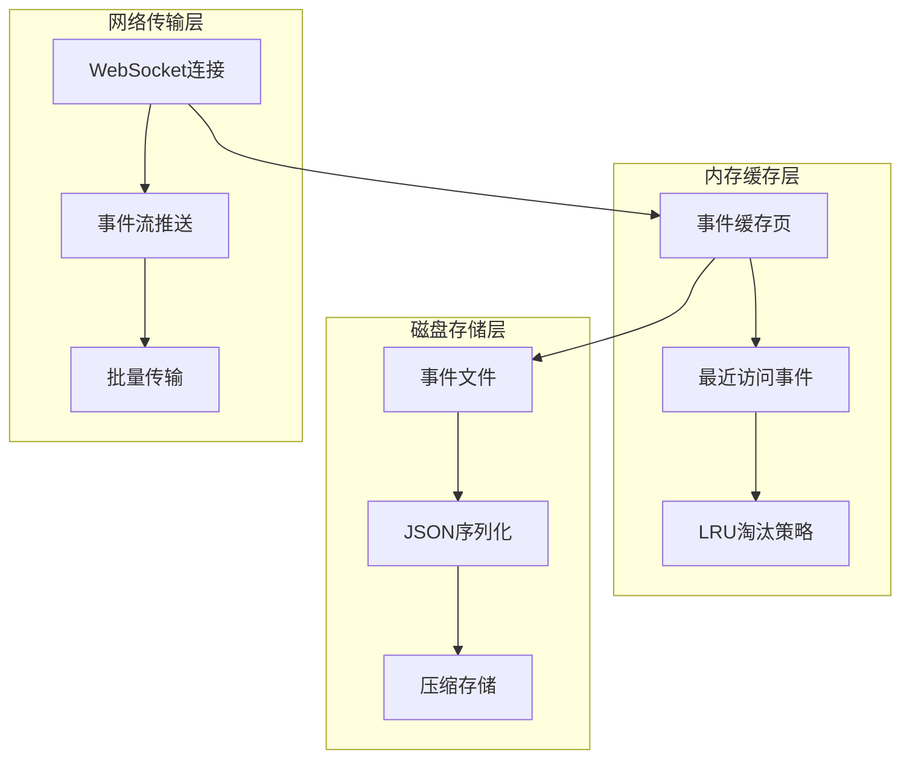
```mermaid
graph TB
subgraph "内存缓存层"
A[事件缓存页] --> B[最近访问事件]
B --> C[LRU淘汰策略]
end
subgraph "磁盘存储层"
D[事件文件] --> E[JSON序列化]
E --> F[压缩存储]
end
subgraph "网络传输层"
G[WebSocket连接] --> H[事件流推送]
H --> I[批量传输]
end
A --> D
G --> A
```

### 并发处理优化

系统采用异步并发处理提高效率：

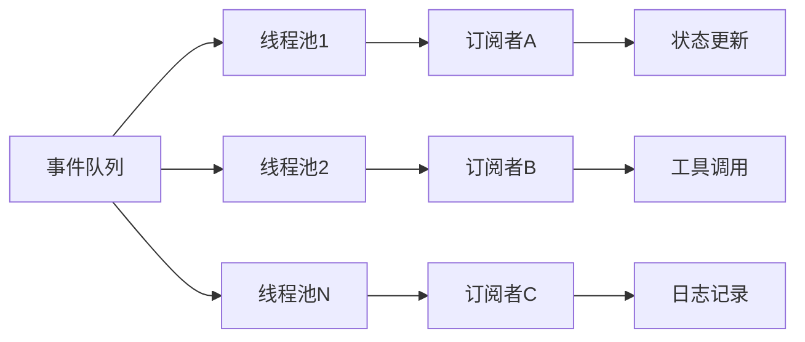
```mermaid
flowchart LR
A[事件队列] --> B[线程池1]
A --> C[线程池2]
A --> D[线程池N]
B --> E[订阅者A]
C --> F[订阅者B]
D --> G[订阅者C]
E --> H[状态更新]
F --> I[工具调用]
G --> J[日志记录]
```

**节来源**
- [stream.py](file://openhands/events/stream.py#L43-L292)
- [event_store.py](file://openhands/events/event_store.py#L18-L184)

## 总结

OpenHands事件处理系统展现了现代软件架构的最佳实践，通过分层设计、模块化组件和完善的错误处理机制，构建了一个高效、可靠且可扩展的事件处理平台。

### 核心优势

1. **模块化设计**：清晰的职责分离使得系统易于维护和扩展
2. **高性能处理**：多级缓存和并发处理确保了系统的响应速度
3. **完善监控**：全面的日志记录和错误处理机制保证了系统的稳定性
4. **实时性**：WebSocket技术实现了事件的实时传播和界面更新

### 技术特色

- **事件过滤器**：灵活的多维度事件筛选机制
- **工具调用**：标准化的工具执行和管理流程  
- **控制器协调**：智能的事件响应和状态管理
- **前端集成**：无缝的实时界面更新体验

这个事件处理系统为OpenHands平台提供了坚实的基础，支撑着整个智能代理系统的运行和交互。