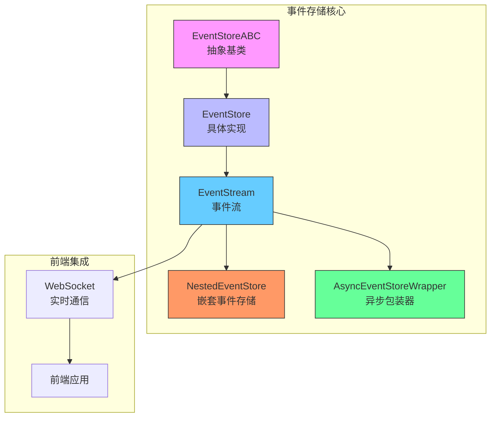
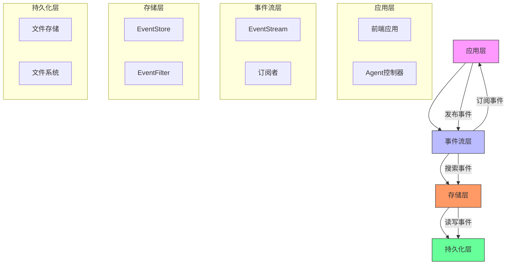
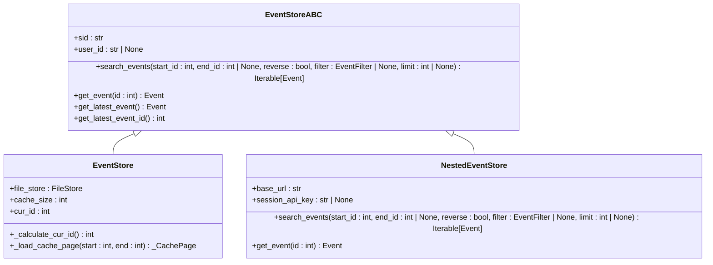
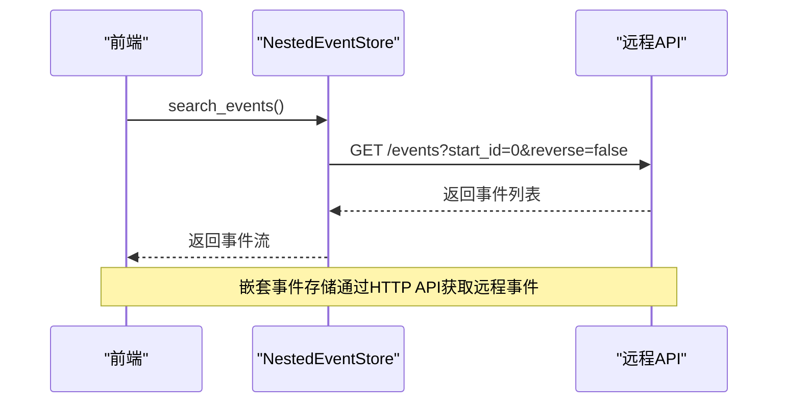
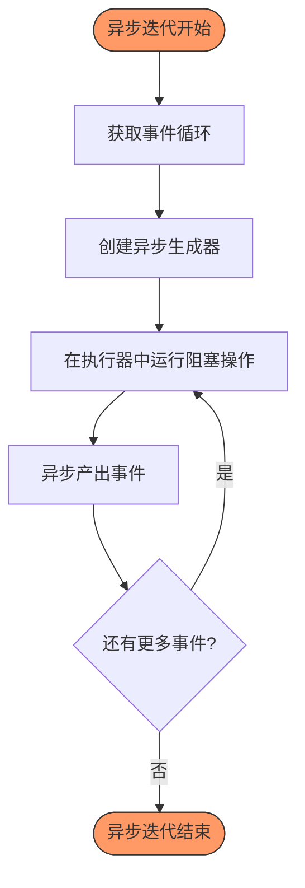
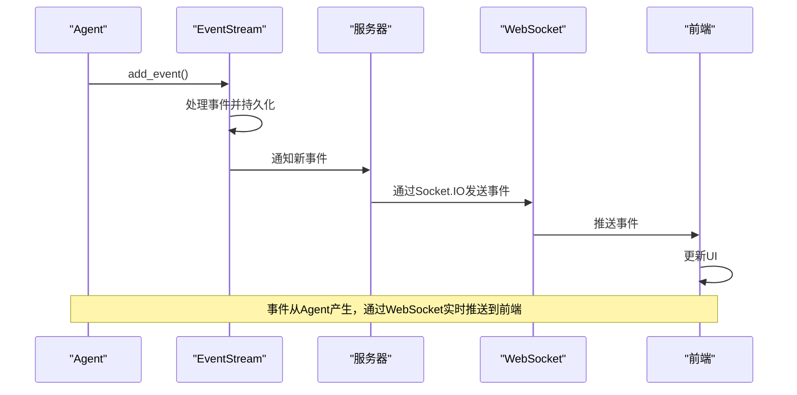
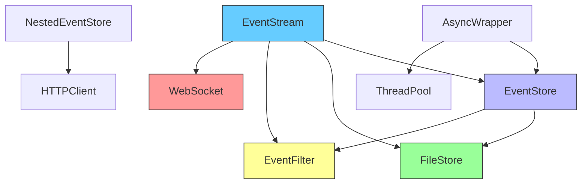

# 事件存储机制

<cite>
**本文档引用的文件**
- [event_store_abc.py](file://openhands/events/event_store_abc.py)
- [event_store.py](file://openhands/events/event_store.py)
- [nested_event_store.py](file://openhands/events/nested_event_store.py)
- [async_event_store_wrapper.py](file://openhands/events/async_event_store_wrapper.py)
- [stream.py](file://openhands/events/stream.py)
- [event.py](file://openhands/events/event.py)
- [event_filter.py](file://openhands/events/event_filter.py)
- [buildWebSocketUrl.ts](file://frontend/src/utils/websocket-url.ts)
- [use-websocket.ts](file://frontend/src/hooks/use-websocket.ts)
- [listen_socket.py](file://openhands/server/listen_socket.py)
</cite>

## 目录
1. [简介](#简介)
2. [项目结构](#项目结构)
3. [核心组件](#核心组件)
4. [架构概述](#架构概述)
5. [详细组件分析](#详细组件分析)
6. [依赖分析](#依赖分析)
7. [性能考虑](#性能考虑)
8. [故障排查指南](#故障排查指南)
9. [结论](#结论)

## 简介
本文档全面介绍OpenHands项目中的事件存储机制，重点分析EventStore抽象基类的设计与实现。文档详细解释了嵌套事件存储（NestedEventStore）如何管理会话层次结构中的事件流，以及异步事件包装器（AsyncEventStoreWrapper）如何提升系统性能。同时，文档深入描述了事件流（Stream）的实时推送机制和订阅模式，涵盖事件持久化策略、内存管理以及与前端WebSocket的集成方式。最后，文档提供性能优化建议和故障排查指南，包括处理高并发事件流的最佳实践。

## 项目结构
事件存储机制主要位于`openhands/events/`目录下，核心组件包括抽象基类、具体实现和流处理机制。该机制与前端WebSocket集成，实现事件的实时推送。

**图表来源**
- [event_store_abc.py](file://openhands/events/event_store_abc.py)
- [event_store.py](file://openhands/events/event_store.py)
- [nested_event_store.py](file://openhands/events/nested_event_store.py)
- [async_event_store_wrapper.py](file://openhands/events/async_event_store_wrapper.py)
- [stream.py](file://openhands/events/stream.py)

**章节来源**
- [event_store_abc.py](file://openhands/events/event_store_abc.py)
- [event_store.py](file://openhands/events/event_store.py)

## 核心组件
事件存储机制的核心是EventStore抽象基类，它定义了事件存储的基本接口。具体实现包括EventStore、NestedEventStore和AsyncEventStoreWrapper，它们分别处理本地存储、远程会话和异步操作。EventStream类作为事件流的管理器，负责事件的发布、订阅和持久化。

**章节来源**
- [event_store_abc.py](file://openhands/events/event_store_abc.py#L11-L112)
- [event_store.py](file://openhands/events/event_store.py#L43-L184)
- [nested_event_store.py](file://openhands/events/nested_event_store.py#L15-L102)
- [async_event_store_wrapper.py](file://openhands/events/async_event_store_wrapper.py#L8-L24)

## 架构概述
事件存储机制采用分层架构，从抽象基类到具体实现，再到流处理和前端集成。这种设计实现了关注点分离，提高了系统的可维护性和可扩展性。

**图表来源**
- [stream.py](file://openhands/events/stream.py#L43-L292)
- [event_store.py](file://openhands/events/event_store.py#L43-L184)
- [event_filter.py](file://openhands/events/event_filter.py#L8-L99)

## 详细组件分析

### EventStore抽象基类分析
EventStoreABC是事件存储的抽象基类，定义了所有事件存储实现必须遵循的接口。它提供了事件搜索、获取单个事件、获取最新事件等核心功能。

**图表来源**
- [event_store_abc.py](file://openhands/events/event_store_abc.py#L11-L112)
- [event_store.py](file://openhands/events/event_store.py#L43-L184)
- [nested_event_store.py](file://openhands/events/nested_event_store.py#L15-L102)

### 嵌套事件存储分析
NestedEventStore用于管理会话层次结构中的事件流，通过HTTP API与远程服务器通信获取事件。它支持分页和反向搜索，能够高效处理大量事件。

**图表来源**
- [nested_event_store.py](file://openhands/events/nested_event_store.py#L15-L102)
- [listen_socket.py](file://openhands/server/listen_socket.py#L35-L64)

### 异步事件包装器分析
AsyncEventStoreWrapper将同步的事件存储操作转换为异步生成器，避免阻塞事件循环。它使用线程池执行阻塞的搜索操作，确保UI的响应性。

**图表来源**
- [async_event_store_wrapper.py](file://openhands/events/async_event_store_wrapper.py#L8-L24)
- [stream.py](file://openhands/events/stream.py#L43-L292)

### 事件流实时推送机制
事件流通过WebSocket实现从服务器到前端的实时推送。当新事件产生时，服务器通过WebSocket连接将事件推送给所有订阅的客户端。

**图表来源**
- [stream.py](file://openhands/events/stream.py#L163-L204)
- [listen_socket.py](file://openhands/server/listen_socket.py#L35-L64)
- [use-websocket.ts](file://frontend/src/hooks/use-websocket.ts#L37-L71)

## 依赖分析
事件存储机制依赖于多个核心组件，包括文件存储、事件过滤和WebSocket通信。这些依赖关系确保了事件的持久化、查询和实时推送功能。

**图表来源**
- [stream.py](file://openhands/events/stream.py#L11-L15)
- [event_store.py](file://openhands/events/event_store.py#L10-L15)
- [event_filter.py](file://openhands/events/event_filter.py#L4-L5)

## 性能考虑
事件存储机制通过多种方式优化性能，包括缓存页面、异步处理和分页查询。这些优化确保了系统在处理大量事件时仍能保持良好的响应性。

- **缓存机制**：使用_cache_page存储事件页面，减少文件系统I/O操作
- **异步处理**：通过AsyncEventStoreWrapper避免阻塞事件循环
- **分页查询**：支持limit参数限制返回事件数量，防止内存溢出
- **批量写入**：将多个事件写入缓存页面，减少磁盘写入次数

**章节来源**
- [event_store.py](file://openhands/events/event_store.py#L19-L41)
- [async_event_store_wrapper.py](file://openhands/events/async_event_store_wrapper.py#L8-L24)
- [stream.py](file://openhands/events/stream.py#L69-L70)

## 故障排查指南
### 常见问题及解决方案
1. **WebSocket连接失败**
   - 检查服务器是否正常运行
   - 验证会话ID和API密钥是否正确
   - 确认网络连接正常

2. **事件丢失**
   - 检查文件存储权限
   - 验证事件ID生成逻辑
   - 确认缓存页面写入是否成功

3. **性能下降**
   - 检查缓存大小设置
   - 验证异步处理是否正常工作
   - 监控文件系统I/O性能

### 高并发最佳实践
- 使用合适的缓存大小平衡内存使用和性能
- 限制事件查询的返回数量
- 合理使用异步处理避免阻塞
- 定期清理过期的会话数据

**章节来源**
- [stream.py](file://openhands/events/stream.py#L79-L92)
- [listen_socket.py](file://openhands/server/listen_socket.py#L35-L64)
- [use-websocket.ts](file://frontend/src/hooks/use-websocket.ts#L73-L113)

## 结论
OpenHands的事件存储机制通过分层设计和多种优化策略，实现了高效、可靠的事件管理。EventStore抽象基类提供了统一的接口，具体实现类处理不同的存储需求，而事件流机制则确保了事件的实时推送。该机制与前端WebSocket的集成，为用户提供了流畅的交互体验。通过合理的性能优化和故障排查策略，系统能够在高并发场景下稳定运行。