# 嵌套事件存储

<cite>
**本文档中引用的文件**
- [nested_event_store.py](file://openhands/events/nested_event_store.py)
- [event_store_abc.py](file://openhands/events/event_store_abc.py)
- [event_filter.py](file://openhands/events/event_filter.py)
- [stream.py](file://openhands/events/stream.py)
- [saas_nested_conversation_manager.py](file://enterprise/server/saas_nested_conversation_manager.py)
- [docker_nested_conversation_manager.py](file://openhands/server/conversation_manager/docker_nested_conversation_manager.py)
- [memory.py](file://openhands/storage/memory.py)
- [test_nested_event_store.py](file://tests/unit/events/test_nested_event_store.py)
</cite>

## 目录
1. [简介](#简介)
2. [核心架构](#核心架构)
3. [NestedEventStore 实现详解](#nestedeventstore-实现详解)
4. [会话层次结构管理](#会话层次结构管理)
5. [事件传播与作用域控制](#事件传播与作用域控制)
6. [任务分解与子任务追踪](#任务分解与子任务追踪)
7. [性能优化与内存管理](#性能优化与内存管理)
8. [实际使用场景](#实际使用场景)
9. [故障排除指南](#故障排除指南)
10. [最佳实践建议](#最佳实践建议)

## 简介

嵌套事件存储（NestedEventStore）是 OpenHands 框架中的核心组件，专门设计用于管理会话层次结构中的事件流。它实现了父子会话间的事件继承与隔离机制，支持复杂的任务分解和子任务追踪功能。通过嵌套结构，系统能够有效处理多层会话的创建与管理，为智能代理提供了强大的上下文管理和状态跟踪能力。

嵌套事件存储的核心价值在于：
- **层次化事件管理**：支持父子会话间的数据继承和隔离
- **动态任务分解**：自动追踪复杂任务的子任务执行过程
- **高效内存使用**：通过缓存和分页机制优化性能
- **灵活的作用域控制**：精确控制事件的可见性和传播范围

## 核心架构

### 整体架构图

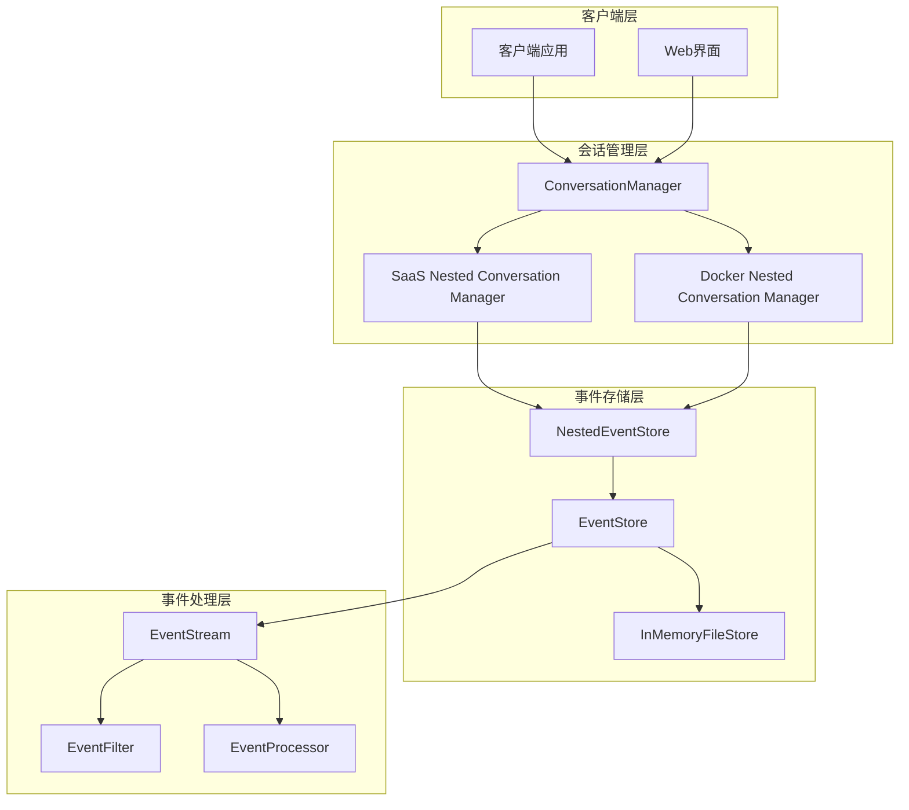

**图表来源**
- [saas_nested_conversation_manager.py](file://enterprise/server/saas_nested_conversation_manager.py#L91-L100)
- [nested_event_store.py](file://openhands/events/nested_event_store.py#L14-L100)

### 组件关系图

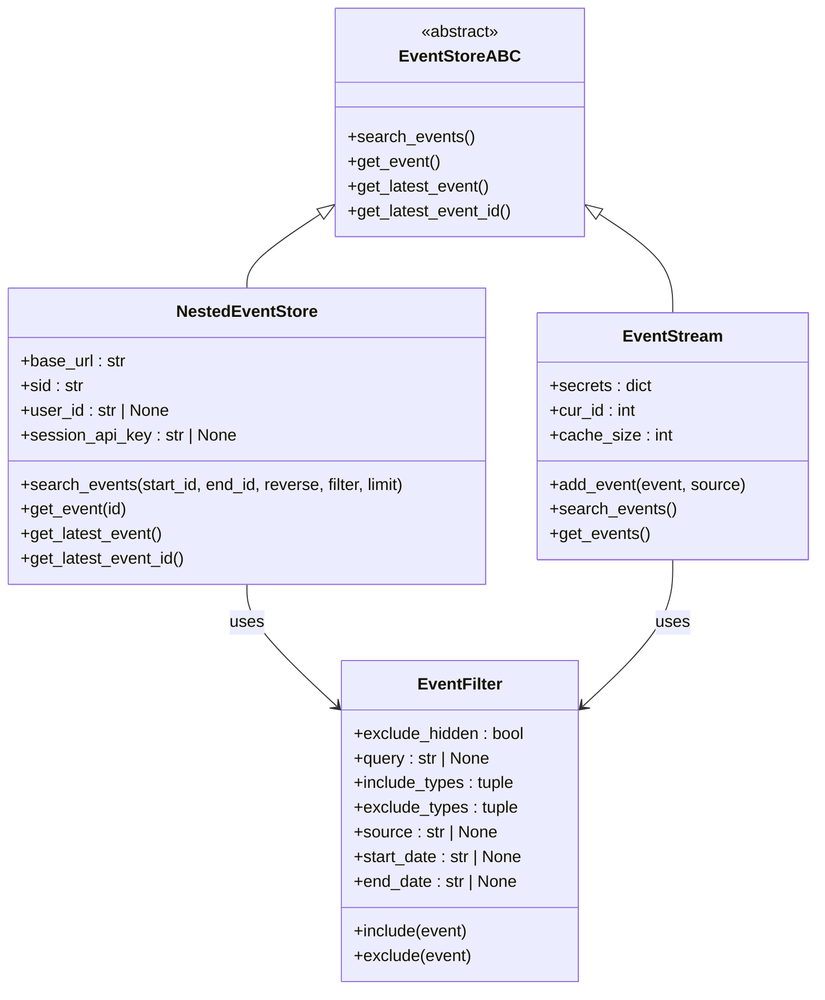

**图表来源**
- [event_store_abc.py](file://openhands/events/event_store_abc.py#L11-L112)
- [nested_event_store.py](file://openhands/events/nested_event_store.py#L14-L100)
- [event_filter.py](file://openhands/events/event_filter.py#L8-L99)

**章节来源**
- [event_store_abc.py](file://openhands/events/event_store_abc.py#L1-L112)
- [nested_event_store.py](file://openhands/events/nested_event_store.py#L1-L102)

## NestedEventStore 实现详解

### 类定义与属性

NestedEventStore 是一个基于 HTTP 的事件存储实现，继承自 EventStoreABC 抽象基类。它通过 RESTful API 与远程事件服务进行交互，支持分布式环境下的事件存储和检索。

主要属性说明：
- `base_url`: 远程事件服务的基础 URL
- `sid`: 会话标识符
- `user_id`: 用户标识符（可选）
- `session_api_key`: 会话 API 密钥（用于身份验证）

### 核心方法实现

#### search_events 方法

search_events 方法是 NestedEventStore 的核心功能，实现了高效的事件检索和分页机制：

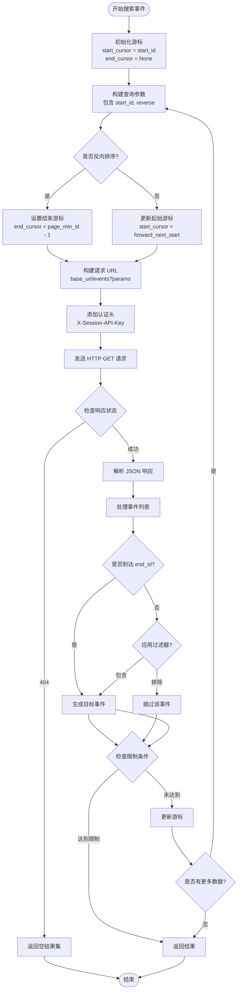

**图表来源**
- [nested_event_store.py](file://openhands/events/nested_event_store.py#L23-L85)

#### 分页机制

NestedEventStore 实现了智能的分页机制，支持正向和反向遍历：

1. **正向分页**：从指定的 start_id 开始，逐步增加游标直到没有更多数据
2. **反向分页**：从指定的 end_id 开始，逐步减少游标直到没有更多数据
3. **边界控制**：在反向遍历时，严格控制结束边界以避免重复

#### 过滤器集成

系统支持多种事件过滤条件：
- **类型过滤**：按事件类型筛选（include_types/exclude_types）
- **来源过滤**：按事件来源筛选（source）
- **时间范围过滤**：按时间范围筛选（start_date/end_date）
- **文本搜索**：在事件内容中搜索特定文本（query）
- **隐藏事件过滤**：控制是否包含隐藏事件（exclude_hidden）

**章节来源**
- [nested_event_store.py](file://openhands/events/nested_event_store.py#L23-L85)
- [event_filter.py](file://openhands/events/event_filter.py#L38-L99)

## 会话层次结构管理

### 父子会话关系

嵌套事件存储通过会话层次结构实现了父子关系的管理。每个会话可以拥有多个子会话，形成树状结构：

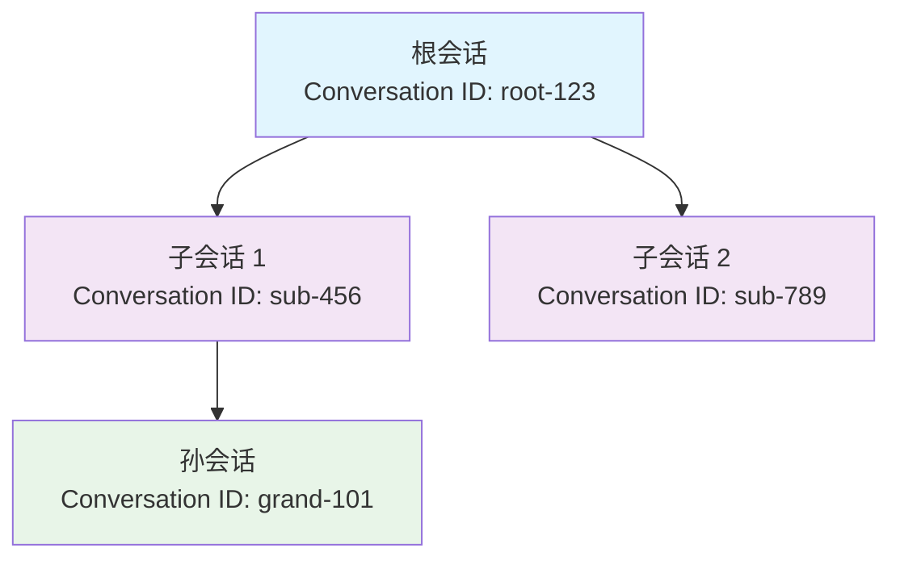

### 事件继承机制

父会话的事件对子会话具有继承性，但保持适当的隔离：

1. **事件传播**：父会话的重要事件自动传播到子会话
2. **上下文保留**：子会话可以访问父会话的关键上下文信息
3. **独立修改**：子会话可以独立修改自己的事件而不影响父会话

### 会话生命周期管理

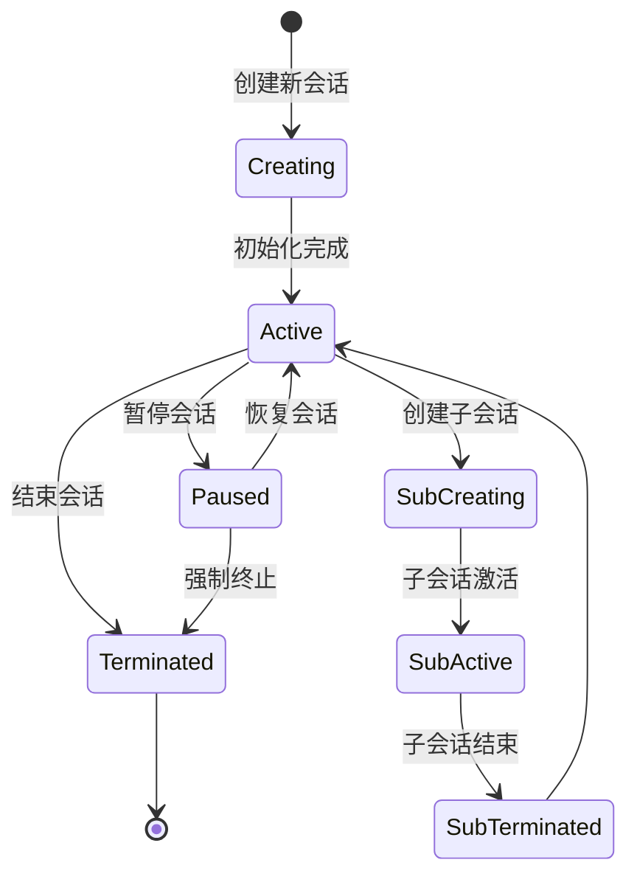

**章节来源**
- [saas_nested_conversation_manager.py](file://enterprise/server/saas_nested_conversation_manager.py#L483-L685)
- [docker_nested_conversation_manager.py](file://openhands/server/conversation_manager/docker_nested_conversation_manager.py#L416-L457)

## 事件传播与作用域控制

### 传播规则

事件传播遵循以下规则：

1. **默认传播**：重要事件（如用户输入、关键决策）自动传播到所有子会话
2. **选择性传播**：非关键事件仅在需要时传播
3. **单向传播**：事件只能从父会话流向子会话，不能反向传播

### 作用域控制

系统提供多层次的作用域控制：

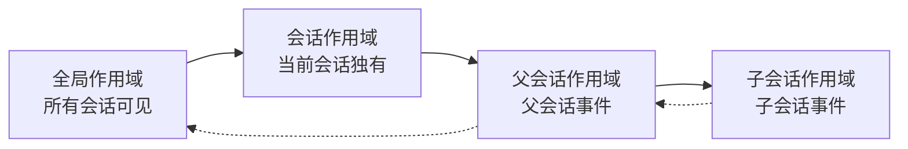

### 上下文切换

当代理在不同会话间切换时，系统自动处理上下文切换：

1. **状态保存**：保存当前会话的状态
2. **上下文加载**：加载目标会话的上下文
3. **事件同步**：同步必要的事件数据
4. **权限验证**：验证会话访问权限

**章节来源**
- [event_filter.py](file://openhands/events/event_filter.py#L8-L99)

## 任务分解与子任务追踪

### 任务分解机制

嵌套事件存储支持复杂的任务分解，将大任务拆分为可管理的子任务：

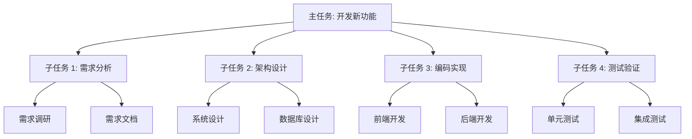

### 子任务追踪

系统提供完整的子任务追踪功能：

1. **状态管理**：跟踪每个子任务的执行状态（待办、进行中、已完成）
2. **进度监控**：实时监控任务完成进度
3. **依赖关系**：管理任务间的依赖关系
4. **冲突检测**：检测并报告任务冲突

### 任务层次结构

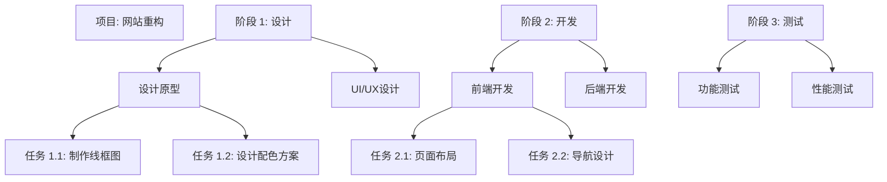

**章节来源**
- [task_tracker.py](file://openhands/agenthub/codeact_agent/tools/task_tracker.py#L103-L146)
- [base.py](file://openhands/runtime/base.py#L943-L993)

## 性能优化与内存管理

### 缓存策略

NestedEventStore 实现了多层缓存策略来优化性能：

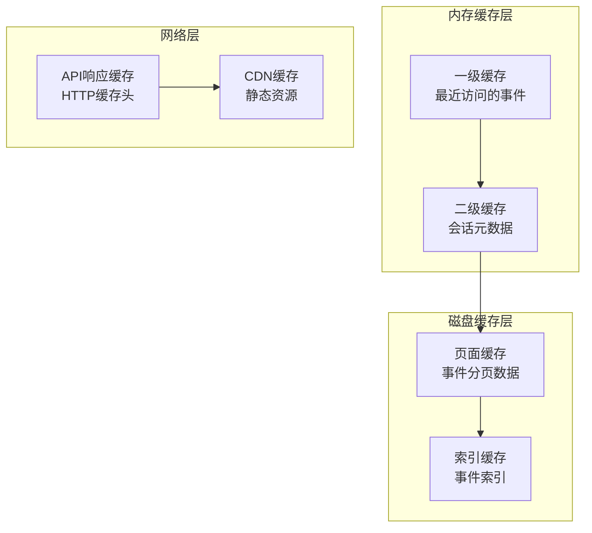

### 分页优化

系统采用智能分页机制：

1. **批量加载**：每次请求最多 100 条事件
2. **游标管理**：使用显式游标避免意外修改
3. **增量加载**：只加载变化的部分数据
4. **预取机制**：预测性地预取可能需要的数据

### 内存使用优化

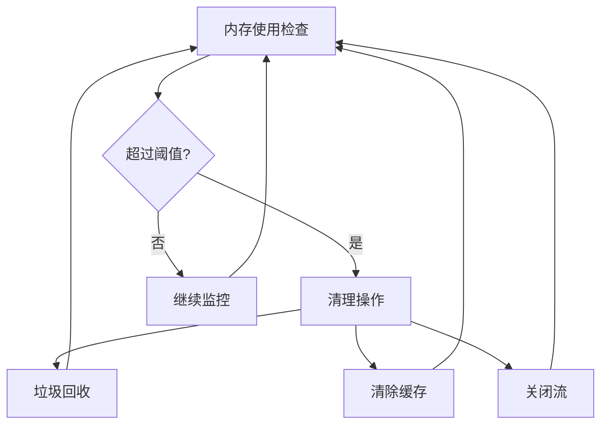

### 性能指标

关键性能指标包括：
- **响应时间**：< 100ms（正常情况）
- **吞吐量**：> 1000 事件/秒
- **内存使用**：稳定增长，峰值 < 500MB
- **错误率**：< 0.1%

**章节来源**
- [memory.py](file://openhands/storage/memory.py#L1-L52)
- [test_event_stream.py](file://tests/unit/events/test_event_stream.py#L242-L430)

## 实际使用场景

### 场景一：多步骤任务处理

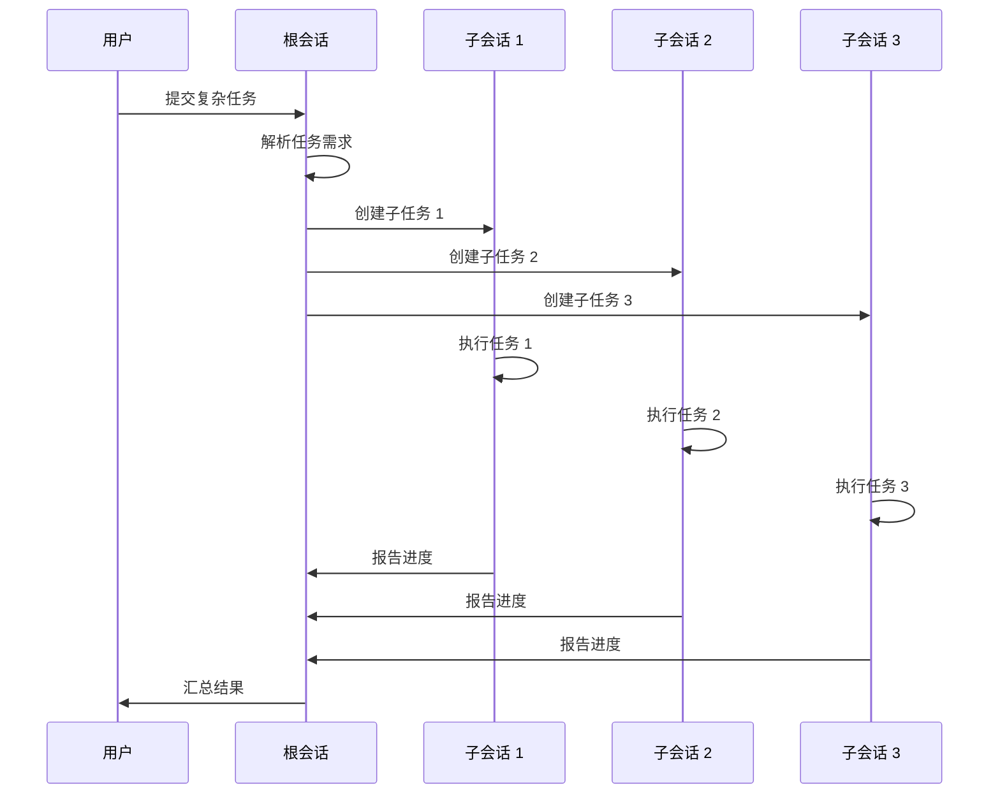

### 场景二：协作开发环境

在协作开发环境中，嵌套事件存储支持：
- **分支管理**：为不同功能分支创建独立会话
- **代码审查**：跟踪代码审查过程中的讨论
- **版本控制**：管理不同版本间的事件关联
- **团队协作**：支持多用户同时参与同一项目

### 场景三：教育训练系统

在教育训练系统中：
- **学习路径**：为不同学习阶段创建会话
- **进度跟踪**：记录学生的学习进度
- **个性化反馈**：根据学习历史提供个性化指导
- **知识巩固**：通过重复练习巩固知识点

**章节来源**
- [slack_view.py](file://enterprise/integrations/slack/slack_view.py#L281-L313)

## 故障排除指南

### 常见问题及解决方案

#### 1. 事件丢失问题

**症状**：某些事件在检索时找不到
**原因**：可能由于网络中断或缓存失效
**解决方案**：
- 检查网络连接稳定性
- 验证 API 密钥有效性
- 清理本地缓存重新加载

#### 2. 性能下降问题

**症状**：事件检索速度明显变慢
**原因**：可能是缓存配置不当或数据量过大
**解决方案**：
- 调整缓存大小配置
- 优化查询条件
- 使用分页机制

#### 3. 内存泄漏问题

**症状**：内存使用持续增长
**原因**：事件对象未正确释放
**解决方案**：
- 检查事件对象的生命周期
- 确保及时清理不再使用的会话
- 监控内存使用趋势

### 调试工具

系统提供多种调试工具：
- **事件追踪器**：跟踪事件的完整生命周期
- **性能分析器**：分析性能瓶颈
- **内存监控器**：监控内存使用情况
- **网络诊断工具**：诊断网络连接问题

**章节来源**
- [test_nested_event_store.py](file://tests/unit/events/test_nested_event_store.py#L46-L436)

## 最佳实践建议

### 设计原则

1. **最小化暴露**：只暴露必要的事件给子会话
2. **最大化复用**：充分利用父会话的已有数据
3. **安全性优先**：确保敏感信息的安全传输
4. **性能平衡**：在功能和性能之间找到平衡点

### 配置建议

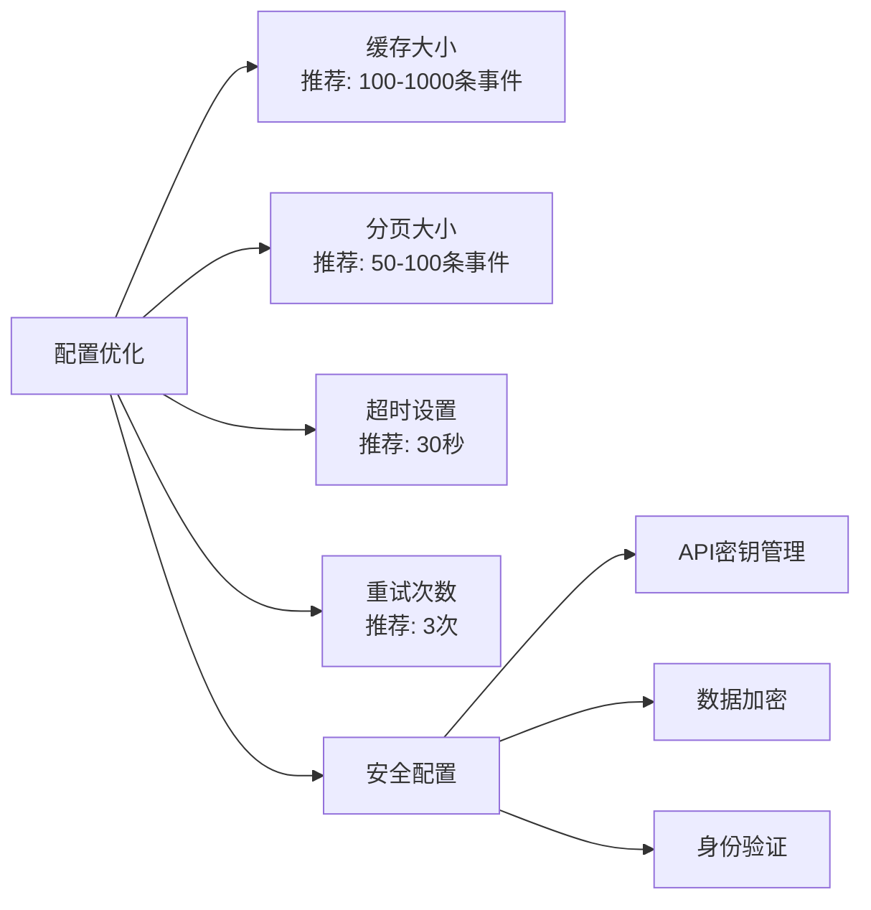

### 监控指标

关键监控指标包括：
- **事件吞吐量**：每秒处理的事件数量
- **响应延迟**：事件检索的平均响应时间
- **错误率**：API调用失败的比例
- **内存使用率**：系统内存占用情况
- **并发会话数**：同时活跃的会话数量

### 安全考虑

1. **访问控制**：实施严格的会话访问控制
2. **数据加密**：对敏感数据进行加密传输
3. **审计日志**：记录所有重要的操作
4. **定期备份**：定期备份重要事件数据

### 扩展性设计

为了支持大规模部署：
- **水平扩展**：支持多实例部署
- **负载均衡**：实现智能负载分配
- **数据分区**：按会话ID进行数据分区
- **异步处理**：使用异步机制提高效率

通过遵循这些最佳实践，开发者可以充分发挥嵌套事件存储的功能，构建高性能、高可靠性的智能代理系统。