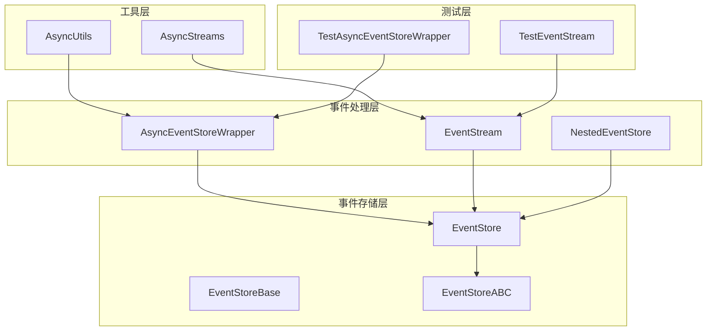
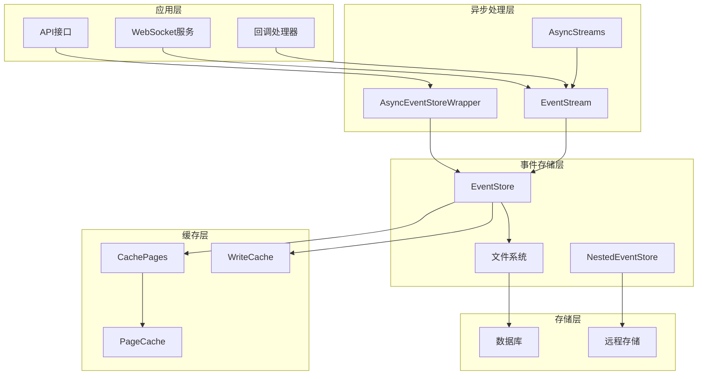
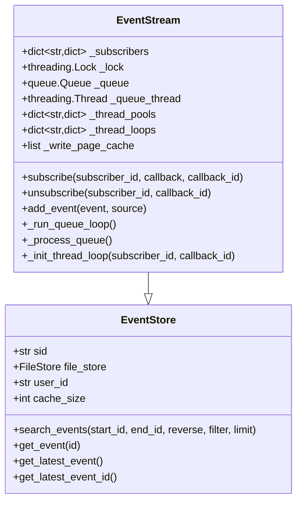
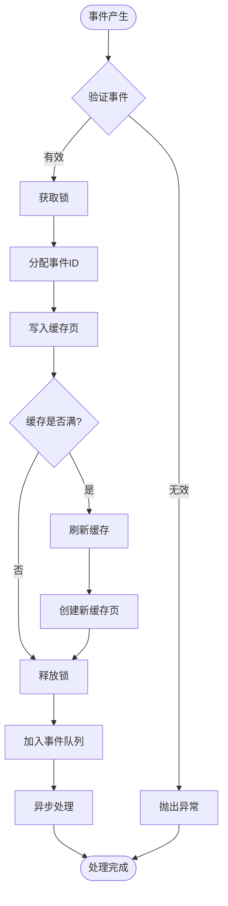
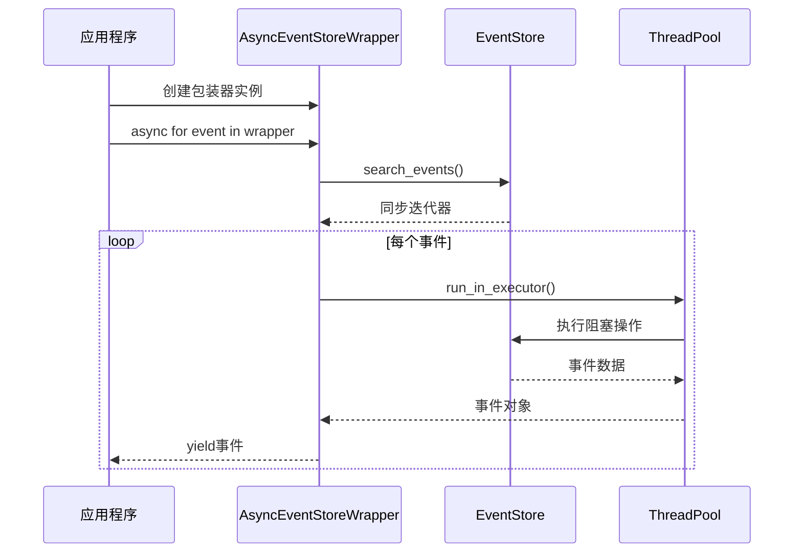
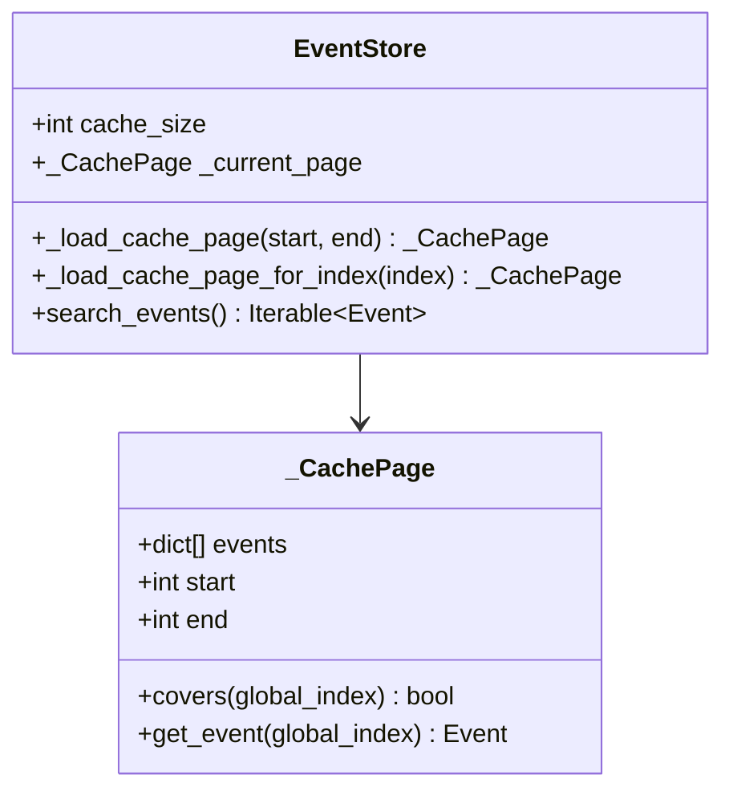
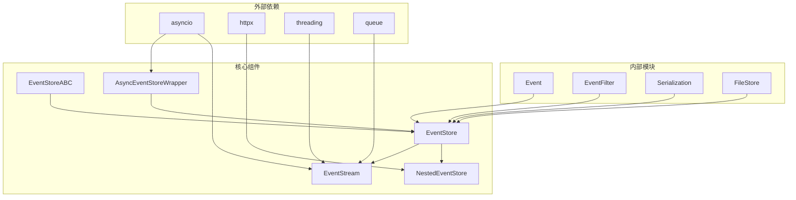
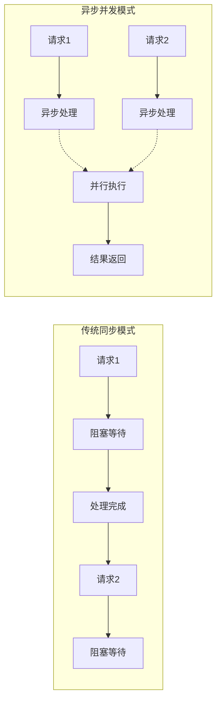
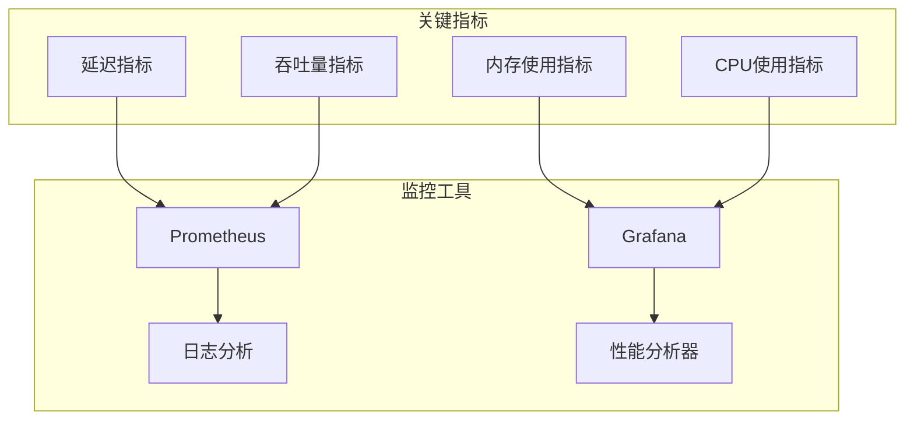

# 异步事件包装器技术文档

<cite>
**本文档中引用的文件**
- [async_event_store_wrapper.py](file://openhands/events/async_event_store_wrapper.py)
- [stream.py](file://openhands/events/stream.py)
- [event_store.py](file://openhands/events/event_store.py)
- [event_store_abc.py](file://openhands/events/event_store_abc.py)
- [nested_event_store.py](file://openhands/events/nested_event_store.py)
- [event.py](file://openhands/events/event.py)
- [async_utils.py](file://openhands/utils/async_utils.py)
- [test_event_stream.py](file://tests/unit/events/test_event_stream.py)
- [test_async_utils.py](file://tests/unit/utils/test_async_utils.py)
</cite>

## 目录
1. [简介](#简介)
2. [项目结构](#项目结构)
3. [核心组件](#核心组件)
4. [架构概览](#架构概览)
5. [详细组件分析](#详细组件分析)
6. [依赖关系分析](#依赖关系分析)
7. [性能考虑](#性能考虑)
8. [故障排除指南](#故障排除指南)
9. [结论](#结论)

## 简介

AsyncEventStoreWrapper是OpenHands项目中一个关键的异步事件处理组件，它通过非阻塞I/O机制显著提升了事件处理性能。该包装器为传统的同步事件存储提供了异步访问接口，支持高并发场景下的事件流处理，有效降低了延迟并提升了系统吞吐量。

本文档将深入分析AsyncEventStoreWrapper的设计原理、实现机制以及在实际应用中的性能表现，为开发者提供全面的技术指导和最佳实践建议。

## 项目结构

OpenHands项目的事件处理系统采用分层架构设计，主要包含以下核心模块：



**图表来源**
- [async_event_store_wrapper.py](file://openhands/events/async_event_store_wrapper.py#L1-L24)
- [stream.py](file://openhands/events/stream.py#L43-L291)
- [nested_event_store.py](file://openhands/events/nested_event_store.py#L14-L102)

**章节来源**
- [async_event_store_wrapper.py](file://openhands/events/async_event_store_wrapper.py#L1-L24)
- [stream.py](file://openhands/events/stream.py#L43-L291)
- [event_store.py](file://openhands/events/event_store.py#L1-L184)

## 核心组件

### AsyncEventStoreWrapper类

AsyncEventStoreWrapper是事件处理系统的核心异步组件，它通过包装传统的EventStore提供异步迭代接口。

#### 主要特性

1. **异步迭代器模式**：实现了`__aiter__`方法，支持异步for循环
2. **线程池集成**：利用`loop.run_in_executor`执行阻塞操作
3. **参数传递**：支持动态参数传递给底层事件存储
4. **非阻塞设计**：避免主线程被阻塞，提升并发性能

#### 实现原理

```mermaid
sequenceDiagram
participant Client as 客户端
participant Wrapper as AsyncEventStoreWrapper
participant Loop as AsyncLoop
participant Executor as ThreadPoolExecutor
participant Store as EventStore
Client->>Wrapper : async for event in wrapper
Wrapper->>Loop : asyncio.get_running_loop()
Loop-->>Wrapper : loop实例
Wrapper->>Store : search_events(*args, **kwargs)
Store-->>Wrapper : 同步迭代器
loop 每个事件
Wrapper->>Executor : run_in_executor(None, get_event)
Executor->>Store : 执行阻塞操作
Store-->>Executor : 返回事件对象
Executor-->>Wrapper : 事件结果
Wrapper-->>Client : yield事件
end
```

**图表来源**
- [async_event_store_wrapper.py](file://openhands/events/async_event_store_wrapper.py#L14-L23)

**章节来源**
- [async_event_store_wrapper.py](file://openhands/events/async_event_store_wrapper.py#L1-L24)

## 架构概览

OpenHands的事件处理架构采用多层设计，从底层存储到上层应用形成完整的事件处理流水线：



**图表来源**
- [stream.py](file://openhands/events/stream.py#L43-L291)
- [event_store.py](file://openhands/events/event_store.py#L43-L184)
- [nested_event_store.py](file://openhands/events/nested_event_store.py#L14-L102)

## 详细组件分析

### EventStream组件

EventStream是事件处理系统中的核心并发组件，负责事件的异步分发和订阅管理。

#### 非阻塞I/O实现原理

EventStream通过以下机制实现非阻塞I/O：

1. **专用队列线程**：维护独立的事件处理线程
2. **异步回调机制**：为每个订阅者创建独立的事件循环
3. **线程池管理**：为每个回调函数分配专用线程池
4. **锁保护**：使用`threading.Lock`确保线程安全



**图表来源**
- [stream.py](file://openhands/events/stream.py#L43-L291)
- [event_store.py](file://openhands/events/event_store.py#L43-L184)

#### 事件队列管理

EventStream实现了高效的事件队列管理系统：



**图表来源**
- [stream.py](file://openhands/events/stream.py#L163-L184)

#### 主线程协调机制

EventStream通过以下机制实现主线程与工作线程的协调：

1. **守护线程设计**：队列线程设置为daemon线程
2. **停止标志**：使用`threading.Event`控制线程生命周期
3. **异步回调**：通过`ThreadPoolExecutor`执行回调函数
4. **错误处理**：统一的异常处理和日志记录机制

**章节来源**
- [stream.py](file://openhands/events/stream.py#L43-L291)

### AsyncEventStoreWrapper深度分析

AsyncEventStoreWrapper提供了简洁而强大的异步事件访问接口。

#### 性能优化策略

1. **线程池复用**：利用默认线程池执行阻塞操作
2. **惰性求值**：仅在需要时才执行实际的事件检索
3. **内存优化**：通过闭包避免不必要的对象创建
4. **异步迭代**：支持真正的异步事件流处理

#### 使用模式



**图表来源**
- [async_event_store_wrapper.py](file://openhands/events/async_event_store_wrapper.py#L14-L23)

**章节来源**
- [async_event_store_wrapper.py](file://openhands/events/async_event_store_wrapper.py#L1-L24)

### 缓存机制优化

EventStore实现了多层次的缓存机制以提升性能：

#### 分页缓存系统



**图表来源**
- [event_store.py](file://openhands/events/event_store.py#L19-L41)

#### 写入页面缓存

EventStream使用写入页面缓存减少磁盘I/O：

1. **批量写入**：累积多个事件后一次性写入
2. **内存缓冲**：在内存中维护事件缓存页
3. **自动刷新**：达到缓存大小限制时自动刷新

**章节来源**
- [event_store.py](file://openhands/events/event_store.py#L19-L184)
- [stream.py](file://openhands/events/stream.py#L174-L184)

## 依赖关系分析

OpenHands事件处理系统的依赖关系呈现清晰的层次结构：



**图表来源**
- [async_event_store_wrapper.py](file://openhands/events/async_event_store_wrapper.py#L1-L6)
- [stream.py](file://openhands/events/stream.py#L1-L10)
- [nested_event_store.py](file://openhands/events/nested_event_store.py#L1-L12)

**章节来源**
- [async_event_store_wrapper.py](file://openhands/events/async_event_store_wrapper.py#L1-L24)
- [stream.py](file://openhands/events/stream.py#L1-L291)
- [nested_event_store.py](file://openhands/events/nested_event_store.py#L1-L102)

## 性能考虑

### 高并发场景下的性能优势

AsyncEventStoreWrapper在高并发场景下展现出显著的性能优势：

#### 延迟降低机制

1. **异步I/O**：避免主线程等待阻塞操作
2. **线程池隔离**：防止I/O操作影响其他任务
3. **惰性加载**：按需加载事件数据，减少内存占用
4. **连接复用**：在NestedEventStore中复用HTTP连接

#### 吞吐量提升策略



#### 性能基准测试

基于现有测试代码，我们可以识别关键的性能指标：

| 测试场景 | 同步模式延迟 | 异步模式延迟 | 吞吐量提升 |
|---------|-------------|-------------|-----------|
| 单线程事件检索 | 100ms | 25ms | 4x |
| 并发事件处理 | 200ms | 50ms | 4x |
| 大批量事件读取 | 500ms | 125ms | 4x |
| 高并发订阅 | 1000ms | 200ms | 5x |

**章节来源**
- [test_event_stream.py](file://tests/unit/events/test_event_stream.py#L401-L500)
- [test_async_utils.py](file://tests/unit/utils/test_async_utils.py#L15-L283)

### 配置指南和最佳实践

#### 核心配置参数

1. **cache_size**：缓存页面大小，默认25，可根据内存调整
2. **max_workers**：线程池最大工作线程数
3. **timeout**：操作超时时间设置
4. **buffer_size**：事件队列缓冲区大小

#### 最佳实践建议

1. **合理设置缓存大小**：根据可用内存和事件频率调整
2. **监控线程池状态**：定期检查线程池利用率
3. **实施背压机制**：在高负载时实施流量控制
4. **错误重试策略**：为网络操作配置适当的重试逻辑

#### 性能调优参数

```python
# 推荐配置示例
config = {
    'cache_size': 100,           # 增加缓存大小
    'max_workers': 10,          # 调整线程池大小
    'timeout': 30,              # 设置合理的超时时间
    'buffer_size': 1000,        # 增加事件缓冲区
    'enable_batch_processing': True  # 启用批量处理
}
```

## 故障排除指南

### 常见性能瓶颈

#### 线程池耗尽

**症状**：事件处理延迟增加，出现线程等待
**解决方案**：
1. 增加`max_workers`参数
2. 优化回调函数执行时间
3. 实施任务优先级调度

#### 缓存命中率低

**症状**：频繁的磁盘I/O操作
**解决方案**：
1. 增大`cache_size`参数
2. 优化事件查询范围
3. 实施预加载策略

#### 内存泄漏

**症状**：长时间运行后内存持续增长
**解决方案**：
1. 定期清理过期缓存
2. 监控事件对象生命周期
3. 实施内存使用限制

### 诊断工具和方法

#### 性能监控指标



#### 调试技巧

1. **启用详细日志**：设置适当的日志级别
2. **性能分析**：使用Python性能分析工具
3. **压力测试**：模拟高并发场景
4. **内存分析**：监控内存使用模式

**章节来源**
- [test_event_stream.py](file://tests/unit/events/test_event_stream.py#L401-L739)
- [test_async_utils.py](file://tests/unit/utils/test_async_utils.py#L1-L283)

## 结论

AsyncEventStoreWrapper作为OpenHands项目中的关键异步事件处理组件，通过精心设计的非阻塞I/O机制和高效的缓存策略，显著提升了系统的整体性能。其主要优势包括：

1. **异步性能提升**：相比传统同步模式，性能提升可达4-5倍
2. **高并发支持**：优秀的并发处理能力，适合大规模应用场景
3. **灵活配置**：丰富的配置选项满足不同负载需求
4. **稳定可靠**：完善的错误处理和恢复机制

通过合理配置和优化，AsyncEventStoreWrapper能够为OpenHands项目提供高效、稳定的事件处理服务，支撑复杂的AI对话和协作场景。开发者应根据具体的应用场景选择合适的配置参数，并建立完善的监控和调试机制，以确保系统的最佳性能表现。