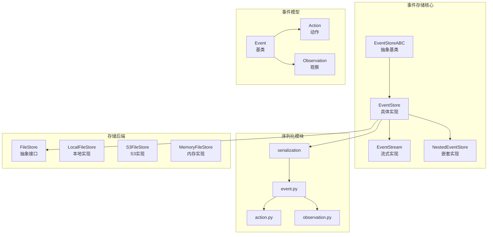
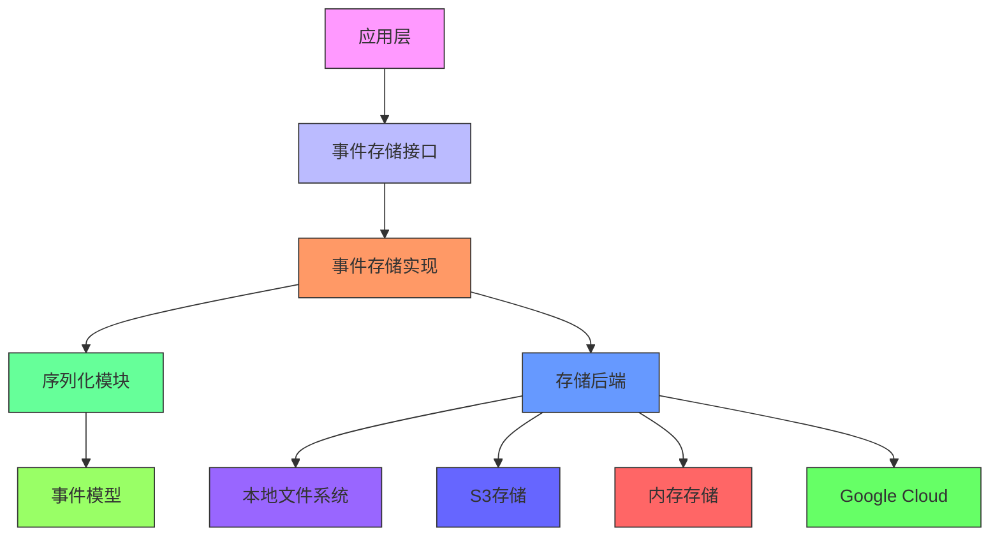
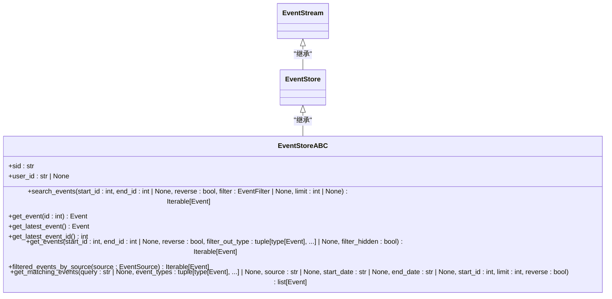
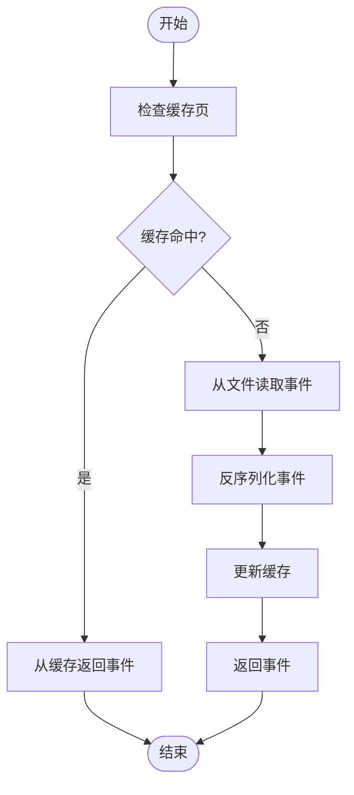
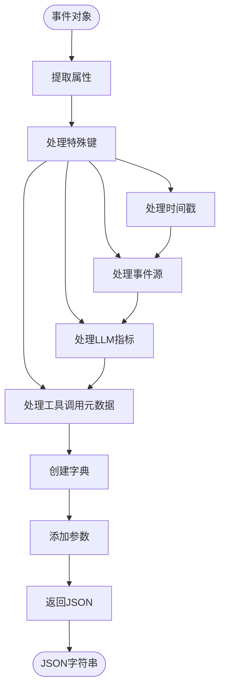
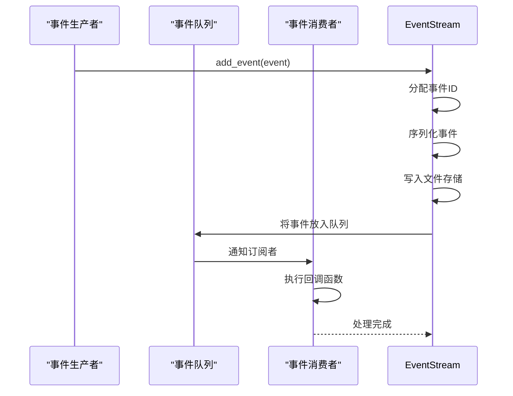
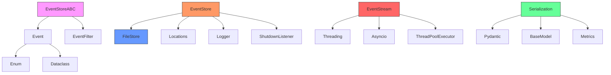

# 核心事件存储

<cite>
**本文档引用的文件**
- [event_store_abc.py](file://openhands/events/event_store_abc.py)
- [event_store.py](file://openhands/events/event_store.py)
- [stream.py](file://openhands/events/stream.py)
- [event.py](file://openhands/events/event.py)
- [serialization/event.py](file://openhands/events/serialization/event.py)
- [files.py](file://openhands/storage/files.py)
- [nested_event_store.py](file://openhands/events/nested_event_store.py)
</cite>

## 目录
1. [简介](#简介)
2. [项目结构](#项目结构)
3. [核心组件](#核心组件)
4. [架构概述](#架构概述)
5. [详细组件分析](#详细组件分析)
6. [依赖分析](#依赖分析)
7. [性能考虑](#性能考虑)
8. [故障排除指南](#故障排除指南)
9. [结论](#结论)

## 简介
核心事件存储系统是OpenHands平台的关键组件，负责管理对话会话中所有事件的持久化、检索和生命周期。该系统采用抽象基类设计模式，提供统一的接口规范，同时支持多种存储后端实现。事件存储不仅处理事件的序列化和反序列化，还通过缓存机制优化读写性能，并确保数据一致性。该系统与控制器、运行时等组件紧密协作，为AI代理的决策和执行提供可靠的历史记录支持。

## 项目结构
核心事件存储相关的文件主要位于`openhands/events`目录下，形成了一个分层的架构体系。该系统通过抽象基类定义接口，具体实现类处理持久化逻辑，序列化模块负责数据转换，而存储后端则提供实际的文件操作能力。

**Diagram sources**
- [event_store_abc.py](file://openhands/events/event_store_abc.py)
- [event_store.py](file://openhands/events/event_store.py)
- [stream.py](file://openhands/events/stream.py)
- [files.py](file://openhands/storage/files.py)

**Section sources**
- [event_store_abc.py](file://openhands/events/event_store_abc.py)
- [event_store.py](file://openhands/events/event_store.py)
- [stream.py](file://openhands/events/stream.py)

## 核心组件
核心事件存储系统由几个关键组件构成：`EventStoreABC`抽象基类定义了所有事件存储实现必须遵循的接口规范；`EventStore`是具体的实现类，负责处理事件的持久化和检索；`EventStream`扩展了`EventStore`，提供了流式处理和订阅功能；`FileStore`抽象类定义了底层存储后端的接口，支持多种存储方式。这些组件共同协作，确保事件数据的可靠存储和高效访问。

**Section sources**
- [event_store_abc.py](file://openhands/events/event_store_abc.py#L11-L112)
- [event_store.py](file://openhands/events/event_store.py#L44-L184)
- [stream.py](file://openhands/events/stream.py#L43-L213)

## 架构概述
核心事件存储系统采用分层架构设计，将接口定义、业务逻辑和数据存储分离。在顶层，`EventStoreABC`抽象基类定义了事件存储的核心接口，包括事件搜索、获取和过滤等功能。中间层的`EventStore`类实现了这些接口，处理事件的序列化、缓存和文件存储。底层的`FileStore`接口则抽象了具体的存储后端，支持本地文件系统、S3云存储等多种实现。这种分层设计使得系统具有良好的扩展性和可维护性。

**Diagram sources**
- [event_store_abc.py](file://openhands/events/event_store_abc.py#L11-L112)
- [event_store.py](file://openhands/events/event_store.py#L44-L184)
- [files.py](file://openhands/storage/files.py#L4-L20)

## 详细组件分析

### EventStoreABC 抽象基类分析
`EventStoreABC`是核心事件存储系统的抽象基类，采用Python的`abc`模块实现，定义了所有事件存储实现必须遵循的接口规范。该类通过抽象方法强制子类实现核心功能，同时提供了一些已弃用的兼容性方法，确保API的向后兼容性。

**Diagram sources**
- [event_store_abc.py](file://openhands/events/event_store_abc.py#L11-L112)

**Section sources**
- [event_store_abc.py](file://openhands/events/event_store_abc.py#L11-L112)

### EventStore 实现类分析
`EventStore`类实现了`EventStoreABC`接口，负责处理事件的持久化和检索。该类使用文件存储后端，将每个事件序列化为JSON格式并存储在独立的文件中。为了提高性能，`EventStore`实现了缓存机制，将多个事件打包成"页面"进行批量读写。

**Diagram sources**
- [event_store.py](file://openhands/events/event_store.py#L44-L184)

**Section sources**
- [event_store.py](file://openhands/events/event_store.py#L44-L184)

### 事件序列化机制分析
事件序列化模块负责在Python对象和JSON格式之间进行转换。`event_to_dict`和`event_from_dict`函数是核心的序列化和反序列化函数，它们处理事件对象的属性提取和重建，确保复杂数据结构（如枚举和Pydantic模型）能够正确转换。

**Diagram sources**
- [serialization/event.py](file://openhands/events/serialization/event.py#L100-L152)

**Section sources**
- [serialization/event.py](file://openhands/events/serialization/event.py#L1-L179)

### EventStream 流式处理分析
`EventStream`类扩展了`EventStore`，提供了事件流式处理和订阅功能。它使用线程和队列机制实现异步事件处理，允许多个订阅者注册回调函数来监听新事件。

**Diagram sources**
- [stream.py](file://openhands/events/stream.py#L163-L203)

**Section sources**
- [stream.py](file://openhands/events/stream.py#L43-L213)

## 依赖分析
核心事件存储系统依赖于多个模块和组件，形成了一个复杂的依赖网络。这些依赖关系确保了系统的功能完整性和扩展性。

**Diagram sources**
- [event_store_abc.py](file://openhands/events/event_store_abc.py)
- [event_store.py](file://openhands/events/event_store.py)
- [stream.py](file://openhands/events/stream.py)
- [serialization/event.py](file://openhands/events/serialization/event.py)
- [files.py](file://openhands/storage/files.py)

**Section sources**
- [event_store_abc.py](file://openhands/events/event_store_abc.py)
- [event_store.py](file://openhands/events/event_store.py)
- [stream.py](file://openhands/events/stream.py)

## 性能考虑
核心事件存储系统在设计时充分考虑了性能优化。通过缓存机制，系统能够减少对文件系统的频繁访问，提高读取速度。事件页面缓存将多个事件打包存储，减少了文件I/O操作的开销。同时，`EventStream`的异步处理机制确保了事件写入不会阻塞主线程，提高了系统的响应性。对于大型事件，系统还实现了内容截断功能，防止单个事件占用过多存储空间。

## 故障排除指南
在使用核心事件存储系统时，可能会遇到一些常见问题。对于事件丢失问题，应检查文件存储后端的写入权限和磁盘空间。对于性能瓶颈，可以调整缓存大小或优化事件序列化过程。在调试时，可以启用详细的日志记录来跟踪事件的生命周期。对于序列化错误，应确保所有事件属性都是可序列化的类型，并正确处理复杂对象的转换。

**Section sources**
- [event_store.py](file://openhands/events/event_store.py#L138-L142)
- [serialization/event.py](file://openhands/events/serialization/event.py#L52-L91)

## 结论
核心事件存储系统通过精心设计的抽象基类和具体实现，为OpenHands平台提供了可靠、高效的事件管理能力。其分层架构和模块化设计使得系统具有良好的扩展性和可维护性。通过缓存机制和异步处理，系统在保证数据一致性的同时，也提供了优秀的性能表现。该系统不仅满足了当前的功能需求，还为未来的扩展和优化奠定了坚实的基础。