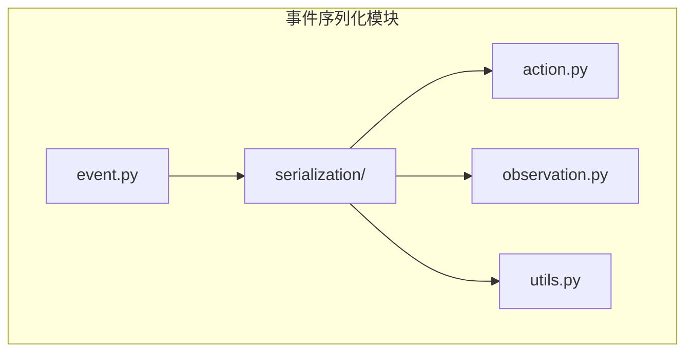
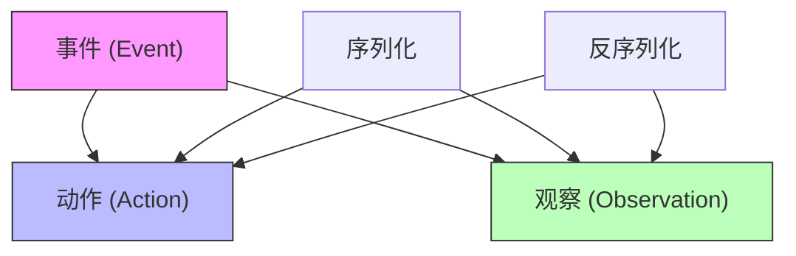
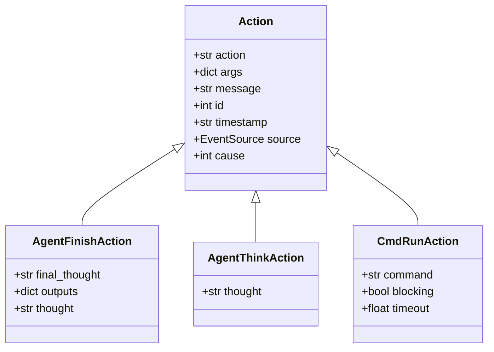
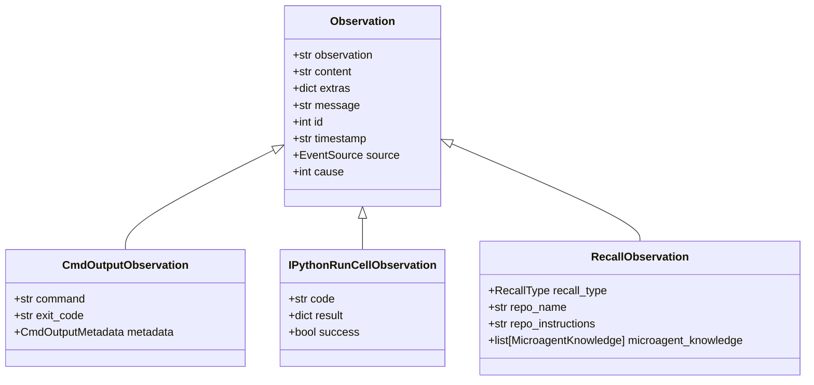
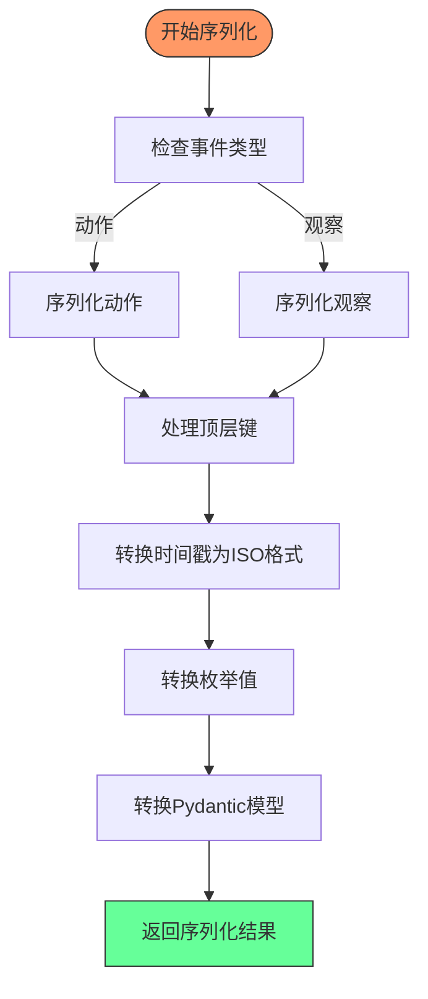
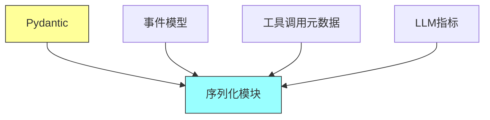

# 事件序列化

<cite>
**本文档中引用的文件**  
- [event.py](file://openhands/events/event.py)
- [serialization/event.py](file://openhands/events/serialization/event.py)
- [serialization/action.py](file://openhands/events/serialization/action.py)
- [serialization/observation.py](file://openhands/events/serialization/observation.py)
- [action/agent.py](file://openhands/events/action/agent.py)
- [observation/agent.py](file://openhands/events/observation/agent.py)
- [utils.py](file://openhands/events/serialization/utils.py)
</cite>

## 目录
1. [简介](#简介)
2. [项目结构](#项目结构)
3. [核心组件](#核心组件)
4. [架构概述](#架构概述)
5. [详细组件分析](#详细组件分析)
6. [依赖分析](#依赖分析)
7. [性能考虑](#性能考虑)
8. [故障排除指南](#故障排除指南)
9. [结论](#结论)
10. [附录](#附录)（如有必要）

## 简介
本文档系统性地介绍了OpenHands事件系统的序列化机制，重点说明基于Pydantic模型的JSON序列化方案。文档涵盖事件类型字段（'type'）的映射逻辑、多态序列化处理、自定义序列化器的实现以及反序列化过程中如何根据'type'字段正确重建具体事件对象。同时包括序列化过程中的版本兼容性处理、数据验证和错误恢复策略，并提供代码示例展示事件的序列化/反序列化流程。

## 项目结构
OpenHands事件序列化系统位于`openhands/events/serialization/`目录下，包含核心的序列化和反序列化功能。该系统基于Pydantic模型实现JSON序列化，通过`event_to_dict`和`event_from_dict`函数处理事件对象的序列化和反序列化。

**Diagram sources**
- [event.py](file://openhands/events/event.py)
- [serialization/event.py](file://openhands/events/serialization/event.py)

**Section sources**
- [event.py](file://openhands/events/event.py)
- [serialization/event.py](file://openhands/events/serialization/event.py)

## 核心组件
事件序列化系统的核心组件包括事件基类、动作和观察的序列化处理器，以及工具调用和指标的序列化支持。系统通过`event_to_dict`函数将事件对象转换为字典，通过`event_from_dict`函数将字典反序列化为事件对象。

**Section sources**
- [serialization/event.py](file://openhands/events/serialization/event.py)
- [event.py](file://openhands/events/event.py)

## 架构概述
OpenHands事件序列化系统采用基于Pydantic的JSON序列化方案，通过类型字段映射实现多态序列化。系统将事件分为动作和观察两大类，每类都有特定的序列化处理器。

**Diagram sources**
- [event.py](file://openhands/events/event.py)
- [serialization/event.py](file://openhands/events/serialization/event.py)

## 详细组件分析

### 动作序列化分析
动作序列化通过`action_from_dict`函数实现，根据'type'字段映射到具体的动作类。系统维护一个`ACTION_TYPE_TO_CLASS`映射表，将动作类型字符串映射到对应的类。

**Diagram sources**
- [action/agent.py](file://openhands/events/action/agent.py)
- [serialization/action.py](file://openhands/events/serialization/action.py)

### 观察序列化分析
观察序列化通过`observation_from_dict`函数实现，根据'type'字段映射到具体的观察类。系统维护一个`OBSERVATION_TYPE_TO_CLASS`映射表，将观察类型字符串映射到对应的类。

**Diagram sources**
- [observation/agent.py](file://openhands/events/observation/agent.py)
- [serialization/observation.py](file://openhands/events/serialization/observation.py)

### 序列化流程分析
事件序列化流程包括将事件对象转换为字典表示，处理特殊字段如时间戳、枚举值和嵌套的Pydantic模型。

**Diagram sources**
- [serialization/event.py](file://openhands/events/serialization/event.py)

**Section sources**
- [serialization/event.py](file://openhands/events/serialization/event.py)
- [event.py](file://openhands/events/event.py)

## 依赖分析
事件序列化系统依赖于Pydantic库进行数据验证和序列化，同时依赖于OpenHands的核心事件模型和工具调用元数据。

**Diagram sources**
- [serialization/event.py](file://openhands/events/serialization/event.py)
- [event.py](file://openhands/events/event.py)

**Section sources**
- [serialization/event.py](file://openhands/events/serialization/event.py)
- [event.py](file://openhands/events/event.py)

## 性能考虑
事件序列化系统在性能方面考虑了以下因素：
- 使用`model_dump()`方法高效地序列化Pydantic模型
- 对大型内容进行截断处理，避免内存溢出
- 通过`remove_fields`函数移除不必要的字段，减少序列化数据大小

**Section sources**
- [serialization/event.py](file://openhands/events/serialization/event.py)
- [utils.py](file://openhands/events/serialization/utils.py)

## 故障排除指南
在使用事件序列化系统时，可能会遇到以下常见问题：

1. **反序列化失败**：确保'type'字段的值与`ACTION_TYPE_TO_CLASS`或`OBSERVATION_TYPE_TO_CLASS`映射表中的键匹配。
2. **字段缺失**：检查序列化后的字典是否包含必要的字段，如'id'、'timestamp'等。
3. **类型错误**：确保传递给`action_from_dict`或`observation_from_dict`的参数是字典类型。

**Section sources**
- [serialization/action.py](file://openhands/events/serialization/action.py)
- [serialization/observation.py](file://openhands/events/serialization/observation.py)

## 结论
OpenHands事件序列化系统通过基于Pydantic的JSON序列化方案，实现了高效、可靠的事件对象序列化和反序列化。系统通过类型字段映射实现多态序列化，支持各种动作和观察类型，并提供了版本兼容性处理和错误恢复策略。该系统为OpenHands的事件处理提供了坚实的基础。