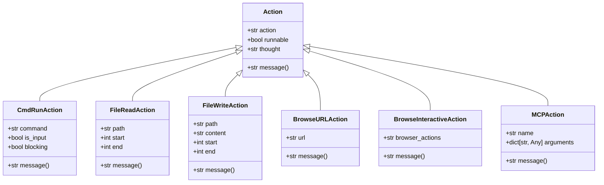
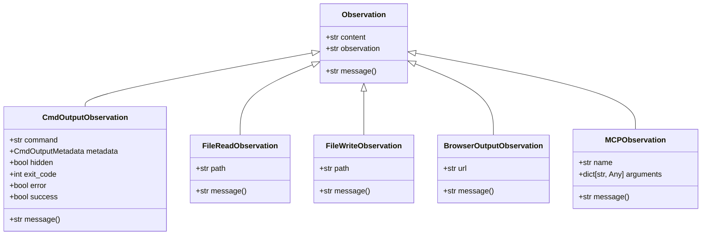
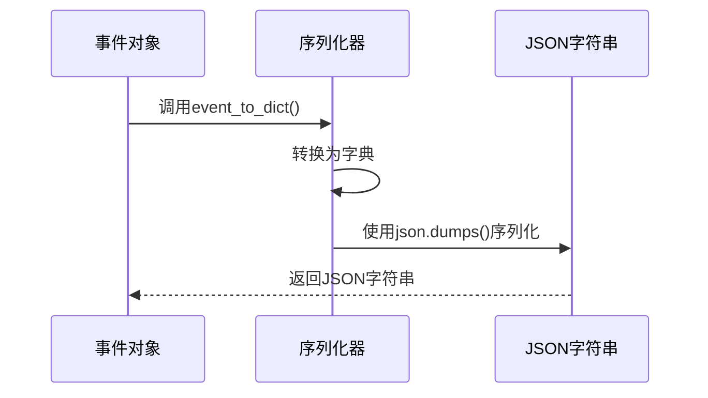
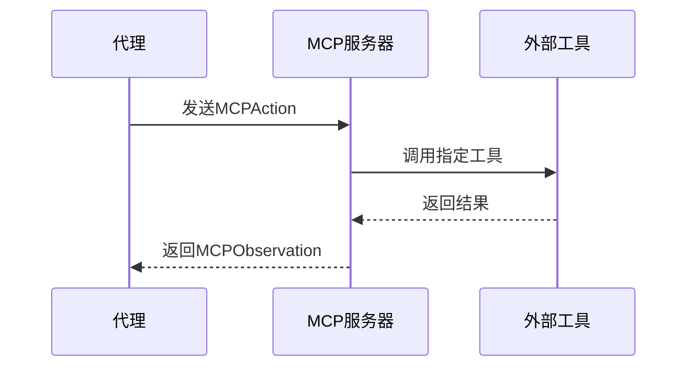

# 事件模型

<cite>
**本文档引用的文件**   
- [action.py](file://openhands/events/action/action.py)
- [observation.py](file://openhands/events/observation/observation.py)
- [commands.py](file://openhands/events/action/commands.py)
- [files.py](file://openhands/events/action/files.py)
- [browse.py](file://openhands/events/action/browse.py)
- [mcp.py](file://openhands/events/action/mcp.py)
- [commands.py](file://openhands/events/observation/commands.py)
- [files.py](file://openhands/events/observation/files.py)
- [browse.py](file://openhands/events/observation/browse.py)
- [mcp.py](file://openhands/events/observation/mcp.py)
- [event.py](file://openhands/events/event.py)
- [serialization.py](file://openhands/events/serialization/event.py)
</cite>

## 目录
1. [简介](#简介)
2. [动作事件类型体系](#动作事件类型体系)
3. [观察事件类型体系](#观察事件类型体系)
4. [事件序列化机制](#事件序列化机制)
5. [MCP事件特殊处理](#mcp事件特殊处理)
6. [事件模型的可扩展性与类型安全](#事件模型的可扩展性与类型安全)

## 简介
OpenHands系统中的事件模型是其核心架构的重要组成部分，它定义了系统中所有交互的基本单元。事件模型主要由两大类事件构成：动作（Action）和观察（Observation）。动作事件代表系统中发生的各种操作，如命令执行、文件操作和浏览行为等；而观察事件则代表系统对这些操作的反馈，包括成功、错误和循环恢复等状态。这种清晰的分离使得系统能够有效地跟踪和管理复杂的交互流程。

**Section sources**
- [event.py](file://openhands/events/event.py#L1-L132)

## 动作事件类型体系
OpenHands中的动作事件类型体系设计得非常全面，涵盖了从命令执行到文件操作再到浏览行为的各种子类型。每个动作事件都继承自基类Action，并根据具体用途进行扩展。例如，CmdRunAction用于执行命令，FileReadAction和FileWriteAction分别用于读取和写入文件，而BrowseURLAction和BrowseInteractiveAction则用于处理网页浏览相关的操作。

**Diagram sources**
- [action.py](file://openhands/events/action/action.py#L21-L24)
- [commands.py](file://openhands/events/action/commands.py#L13-L65)
- [files.py](file://openhands/events/action/files.py#L10-L139)
- [browse.py](file://openhands/events/action/browse.py#L8-L49)
- [mcp.py](file://openhands/events/action/mcp.py#L8-L33)

**Section sources**
- [action.py](file://openhands/events/action/action.py#L21-L24)
- [commands.py](file://openhands/events/action/commands.py#L13-L65)
- [files.py](file://openhands/events/action/files.py#L10-L139)
- [browse.py](file://openhands/events/action/browse.py#L8-L49)
- [mcp.py](file://openhands/events/action/mcp.py#L8-L33)

## 观察事件类型体系
观察事件类型体系与动作事件相对应，提供了对各种操作结果的反馈。每个观察事件都继承自基类Observation，并根据具体用途进行扩展。例如，CmdOutputObservation用于表示命令执行的结果，FileReadObservation和FileWriteObservation分别用于表示文件读取和写入的结果，而BrowserOutputObservation则用于表示网页浏览的结果。

**Diagram sources**
- [observation.py](file://openhands/events/observation/observation.py#L6-L16)
- [commands.py](file://openhands/events/observation/commands.py#L96-L232)
- [files.py](file://openhands/events/observation/files.py#L10-L58)
- [browse.py](file://openhands/events/observation/browse.py#L8-L27)
- [mcp.py](file://openhands/events/observation/mcp.py#L8-L20)

**Section sources**
- [observation.py](file://openhands/events/observation/observation.py#L6-L16)
- [commands.py](file://openhands/events/observation/commands.py#L96-L232)
- [files.py](file://openhands/events/observation/files.py#L10-L58)
- [browse.py](file://openhands/events/observation/browse.py#L8-L27)
- [mcp.py](file://openhands/events/observation/mcp.py#L8-L20)

## 事件序列化机制
OpenHands的事件序列化机制确保了事件可以在不同组件之间高效地传输和存储。事件通过JSON格式进行序列化，这使得它们可以轻松地在网络上传输或保存到数据库中。序列化过程由event_to_dict函数处理，该函数将事件对象转换为字典，然后可以使用标准的JSON库进行序列化。

**Diagram sources**
- [serialization.py](file://openhands/events/serialization/event.py#L6-L7)

**Section sources**
- [serialization.py](file://openhands/events/serialization/event.py#L6-L7)

## MCP事件特殊处理
MCP（Model Control Protocol）事件在OpenHands中具有特殊的地位，因为它们涉及到与外部工具的交互。MCPAction和MCPObservation类专门用于处理这些交互。MCPAction包含要调用的工具名称和参数，而MCPObservation则包含执行结果。这种设计允许系统灵活地集成各种外部工具，同时保持一致的接口。

**Diagram sources**
- [mcp.py](file://openhands/events/action/mcp.py#L8-L33)
- [mcp.py](file://openhands/events/observation/mcp.py#L8-L20)

**Section sources**
- [mcp.py](file://openhands/events/action/mcp.py#L8-L33)
- [mcp.py](file://openhands/events/observation/mcp.py#L8-L20)

## 事件模型的可扩展性与类型安全
OpenHands的事件模型设计充分考虑了可扩展性和类型安全。通过使用dataclass和枚举类型，系统确保了事件结构的一致性和完整性。同时，通过继承机制，新的事件类型可以很容易地添加到系统中，而不会影响现有代码。这种设计不仅提高了代码的可维护性，还增强了系统的灵活性和适应性。

**Section sources**
- [action.py](file://openhands/events/action/action.py#L21-L24)
- [observation.py](file://openhands/events/observation/observation.py#L6-L16)
- [event.py](file://openhands/events/event.py#L35-L132)