# 动作事件

<cite>
**本文档中引用的文件**   
- [action.py](file://openhands/events/action/action.py)
- [files.py](file://openhands/events/action/files.py)
- [browse.py](file://openhands/events/action/browse.py)
- [message.py](file://openhands/events/action/message.py)
- [commands.py](file://openhands/events/action/commands.py)
- [base.py](file://openhands/runtime/base.py)
- [action_execution_client.py](file://openhands/runtime/impl/action_execution/action_execution_client.py)
- [event.py](file://openhands/events/event.py)
- [stream.py](file://openhands/events/stream.py)
</cite>

## 目录
1. [引言](#引言)
2. [核心动作事件类型](#核心动作事件类型)
3. [动作事件执行流程](#动作事件执行流程)
4. [动作事件验证与确认机制](#动作事件验证与确认机制)
5. [动作事件与观察事件的对应关系](#动作事件与观察事件的对应关系)
6. [事件流驱动的代理行为](#事件流驱动的代理行为)
7. [错误处理策略](#错误处理策略)
8. [总结](#总结)

## 引言

OpenHands中的动作事件系统是代理与运行时环境交互的核心机制。该系统通过事件流驱动代理行为，实现了命令执行、文件操作、网页浏览和消息发送等关键功能。动作事件由代理生成并发送到事件流，然后由运行时环境执行并返回相应的观察事件。这种设计实现了代理逻辑与执行环境的解耦，使得系统具有良好的可扩展性和灵活性。

## 核心动作事件类型

OpenHands定义了多种核心动作事件类型，每种类型都有特定的接口定义和参数结构。这些动作事件构成了代理与环境交互的基础。

### 命令执行动作（RunAction）

命令执行动作允许代理在运行时环境中执行shell命令。该动作通过`CmdRunAction`类实现，其主要参数包括：

- `command`: 要执行的shell命令
- `is_input`: 指示命令是否为正在运行的进程的输入
- `thought`: 代理执行此操作的思考过程
- `blocking`: 指示命令是否以阻塞方式运行
- `security_risk`: 命令的安全风险级别

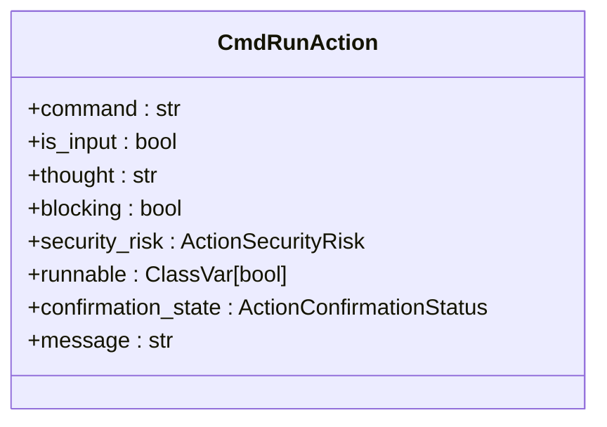

**Diagram sources**
- [commands.py](file://openhands/events/action/commands.py#L11-L38)

### 文件操作动作

文件操作动作包括文件读取和文件写入两种基本操作，通过`FileReadAction`和`FileWriteAction`类实现。

#### 文件读取动作（FileReadAction）

文件读取动作允许代理读取指定路径的文件内容。其主要参数包括：

- `path`: 要读取的文件路径
- `start`: 读取的起始行（默认为0）
- `end`: 读取的结束行（默认为-1，表示文件末尾）
- `thought`: 代理执行此操作的思考过程
- `security_risk`: 操作的安全风险级别

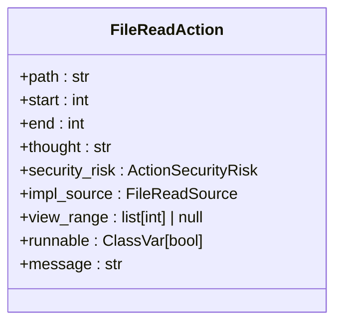

**Diagram sources**
- [files.py](file://openhands/events/action/files.py#L9-L27)

#### 文件写入动作（FileWriteAction）

文件写入动作允许代理向指定路径的文件写入内容。其主要参数包括：

- `path`: 要写入的文件路径
- `content`: 要写入的文件内容
- `start`: 写入的起始行
- `end`: 写入的结束行
- `thought`: 代理执行此操作的思考过程

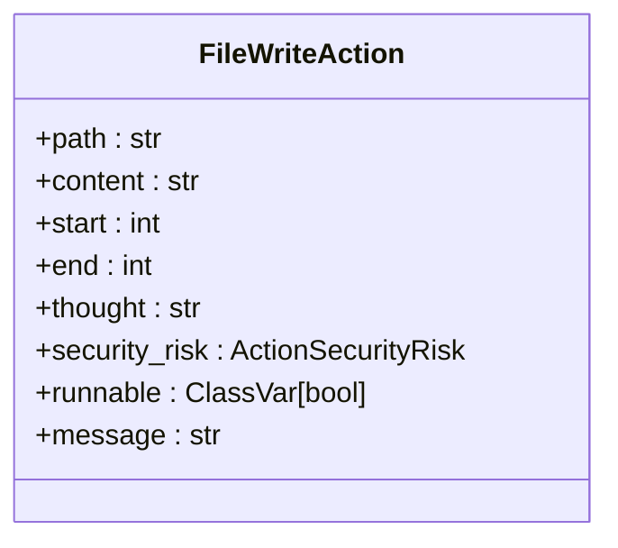

**Diagram sources**
- [files.py](file://openhands/events/action/files.py#L31-L57)

### 网页浏览动作（BrowseURLAction）

网页浏览动作允许代理浏览指定的URL。该动作通过`BrowseURLAction`类实现，其主要参数包括：

- `url`: 要浏览的URL地址
- `thought`: 代理执行此操作的思考过程
- `return_axtree`: 指示是否返回可访问性树

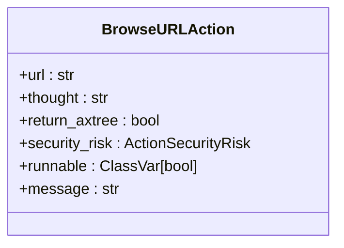

**Diagram sources**
- [browse.py](file://openhands/events/action/browse.py#L8-L25)

### 消息发送动作（MessageAction）

消息发送动作用于在代理和用户之间传递消息。该动作通过`MessageAction`类实现，其主要参数包括：

- `content`: 消息内容
- `file_urls`: 附加文件的URL列表
- `image_urls`: 附加图片的URL列表
- `wait_for_response`: 指示代理是否等待用户响应

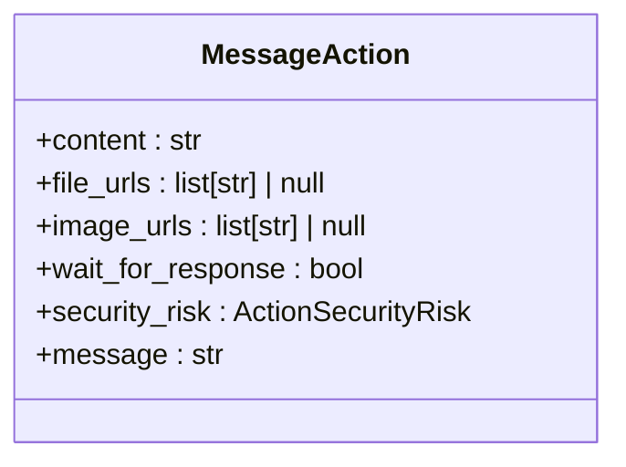

**Diagram sources**
- [message.py](file://openhands/events/action/message.py#L9-L39)

## 动作事件执行流程

动作事件的执行流程是OpenHands系统的核心工作流，它定义了从动作创建到执行完成的完整过程。

### 事件流驱动机制

动作事件通过事件流驱动代理行为。当代理决定执行某个动作时，它会创建相应的动作事件并将其添加到事件流中。运行时环境监听事件流，当检测到新的动作事件时，会执行相应的操作并返回观察事件。

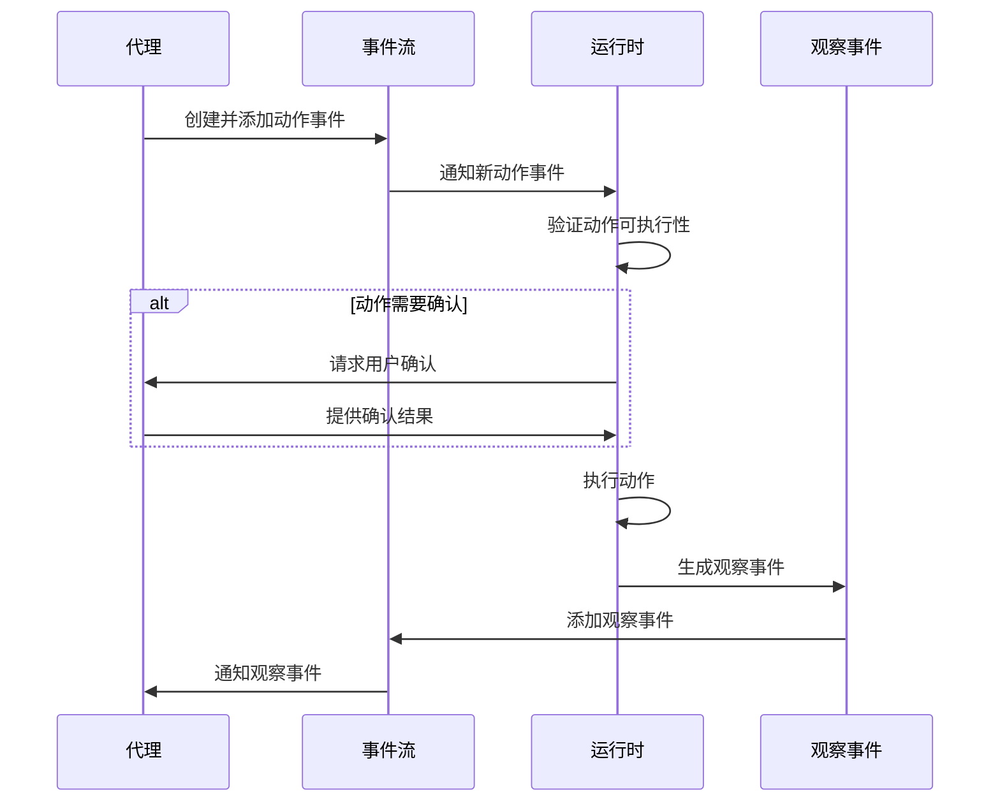

**Diagram sources**
- [base.py](file://openhands/runtime/base.py#L927-L1014)
- [stream.py](file://openhands/events/stream.py#L163-L184)

### 动作执行过程

动作执行过程在`Runtime`类的`run_action`方法中实现。该方法首先检查动作的可执行性，然后根据动作类型调用相应的执行方法。

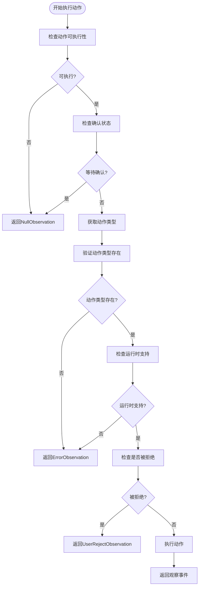

**Diagram sources**
- [base.py](file://openhands/runtime/base.py#L927-L1014)

## 动作事件验证与确认机制

OpenHands系统实现了完善的动作事件验证与确认机制，确保系统的安全性和可靠性。

### 安全风险分级

系统定义了四种安全风险级别，用于评估动作事件的潜在风险：

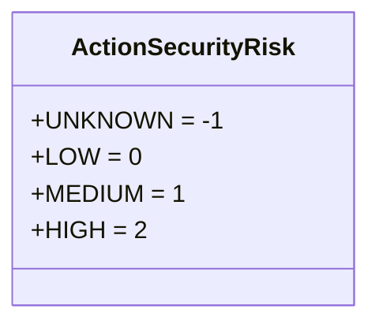

**Diagram sources**
- [action.py](file://openhands/events/action/action.py#L14-L18)

### 确认状态管理

动作事件的确认状态通过`ActionConfirmationStatus`枚举管理，包含三种状态：

- `CONFIRMED`: 已确认
- `REJECTED`: 已拒绝
- `AWAITING_CONFIRMATION`: 等待确认

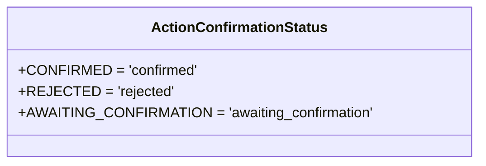

**Diagram sources**
- [action.py](file://openhands/events/action/action.py#L8-L11)

### 确认流程

当动作事件具有高安全风险时，系统会要求用户确认。确认流程如下：

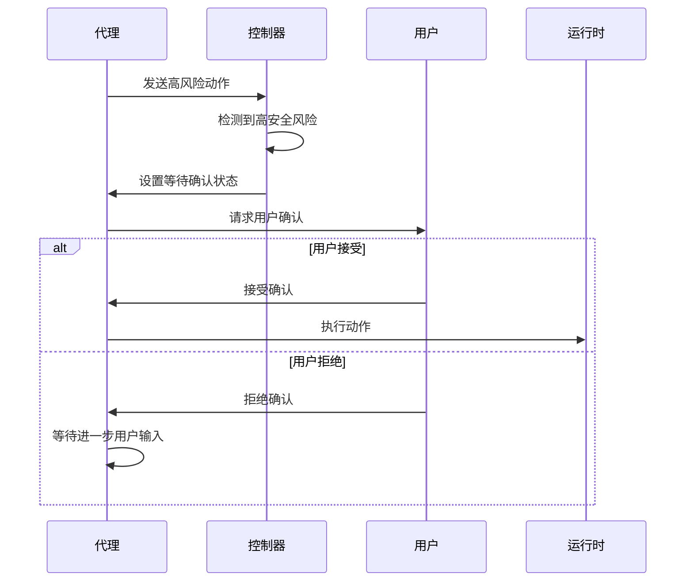

**Diagram sources**
- [agent_controller.py](file://openhands/controller/agent_controller.py#L972-L991)

## 动作事件与观察事件的对应关系

在OpenHands系统中，每个动作事件执行后都会产生相应的观察事件，形成完整的反馈循环。

### 事件对应关系

| 动作事件类型 | 对应的观察事件类型 | 说明 |
|------------|-----------------|------|
| CmdRunAction | CmdOutputObservation | 命令执行结果 |
| FileReadAction | FileReadObservation | 文件读取结果 |
| FileWriteAction | FileWriteObservation | 文件写入结果 |
| BrowseURLAction | BrowserOutputObservation | 浏览结果 |
| MessageAction | UserMessageObservation | 用户消息确认 |

### 前端事件处理

前端通过`handleEventForUI`函数处理事件，将动作事件替换为对应的观察事件：

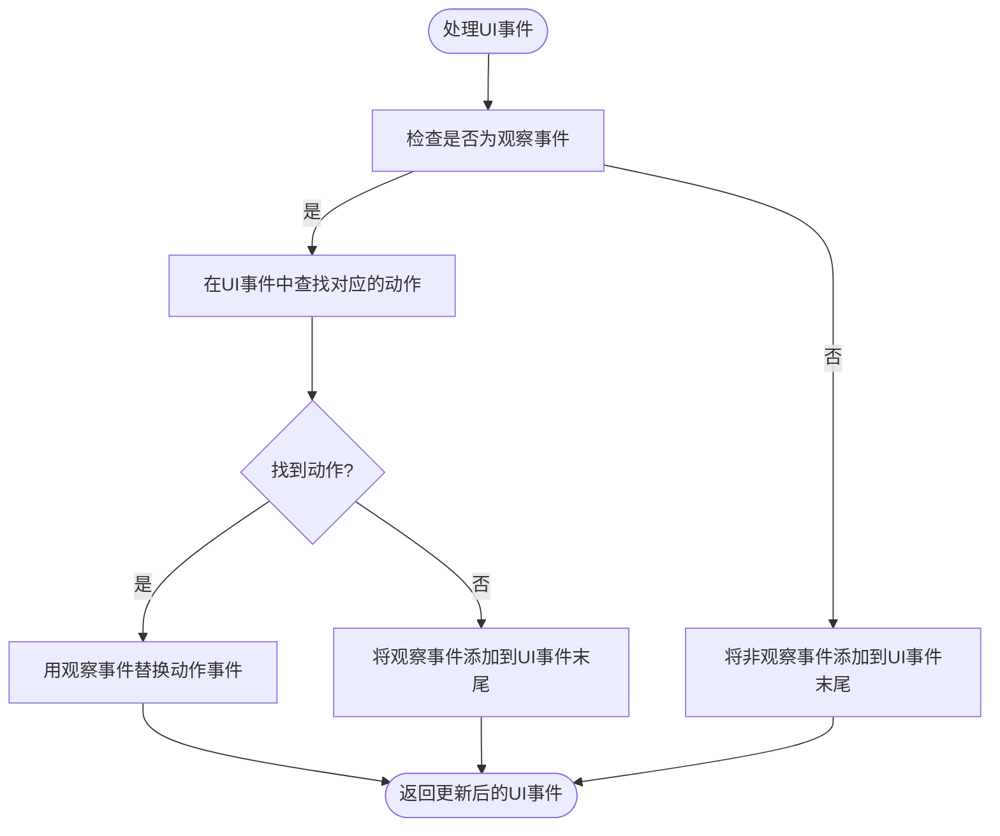

**Diagram sources**
- [handle-event-for-ui.ts](file://frontend/src/utils/handle-event-for-ui.ts#L1-L32)

## 事件流驱动的代理行为

事件流是OpenHands系统的核心，它驱动着代理的整个行为流程。

### 事件流架构

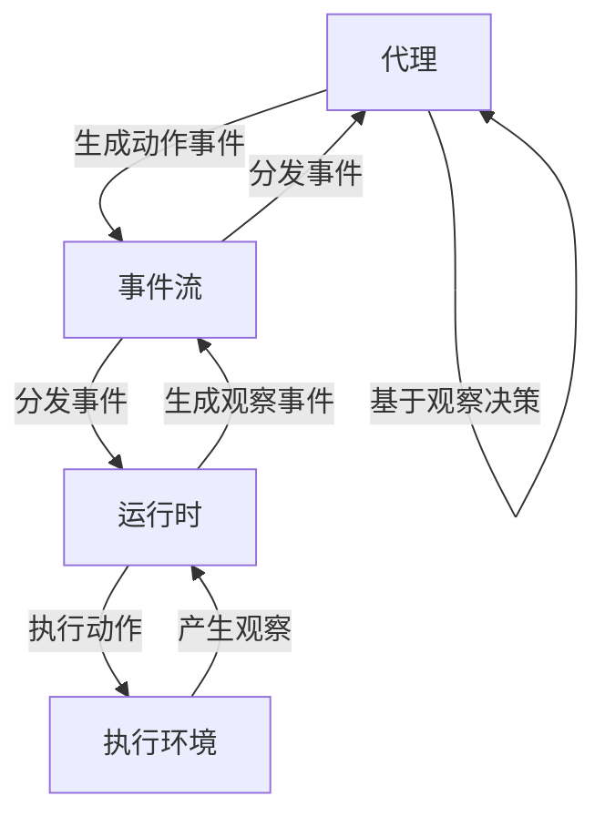

**Diagram sources**
- [stream.py](file://openhands/events/stream.py#L43-L184)

### 事件生命周期

动作事件的生命周期包括创建、验证、执行和完成四个阶段：

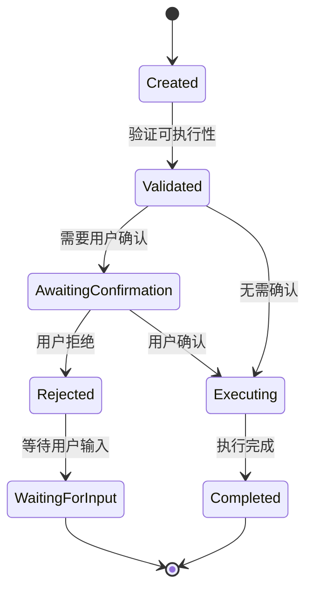

**Diagram sources**
- [base.py](file://openhands/runtime/base.py#L927-L1014)

## 错误处理策略

OpenHands系统实现了全面的错误处理策略，确保系统的稳定性和可靠性。

### 错误类型

系统定义了多种错误观察类型：

- `ErrorObservation`: 一般错误
- `UserRejectObservation`: 用户拒绝
- `NullObservation`: 空观察（用于等待状态）

### 错误处理流程

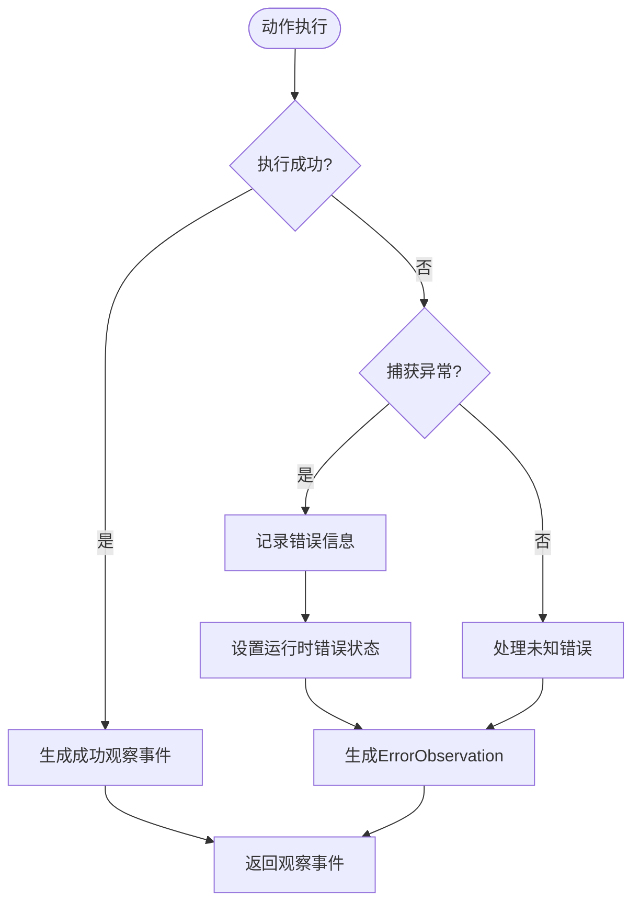

**Diagram sources**
- [base.py](file://openhands/runtime/base.py#L392-L398)

## 总结

OpenHands的动作事件系统通过事件流驱动代理行为，实现了命令执行、文件操作、网页浏览和消息发送等核心功能。系统通过完善的验证与确认机制确保安全性，通过清晰的错误处理策略保证可靠性。动作事件与观察事件的对应关系形成了完整的反馈循环，使得代理能够基于环境反馈做出智能决策。这种设计模式不仅提高了系统的可扩展性，也为未来的功能扩展提供了坚实的基础。

**Section sources**
- [action.py](file://openhands/events/action/action.py)
- [files.py](file://openhands/events/action/files.py)
- [browse.py](file://openhands/events/action/browse.py)
- [message.py](file://openhands/events/action/message.py)
- [commands.py](file://openhands/events/action/commands.py)
- [base.py](file://openhands/runtime/base.py)
- [action_execution_client.py](file://openhands/runtime/impl/action_execution/action_execution_client.py)
- [event.py](file://openhands/events/event.py)
- [stream.py](file://openhands/events/stream.py)