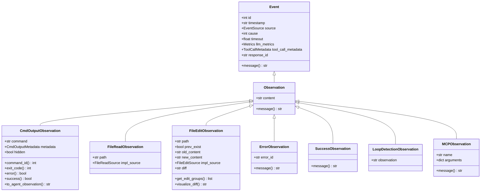
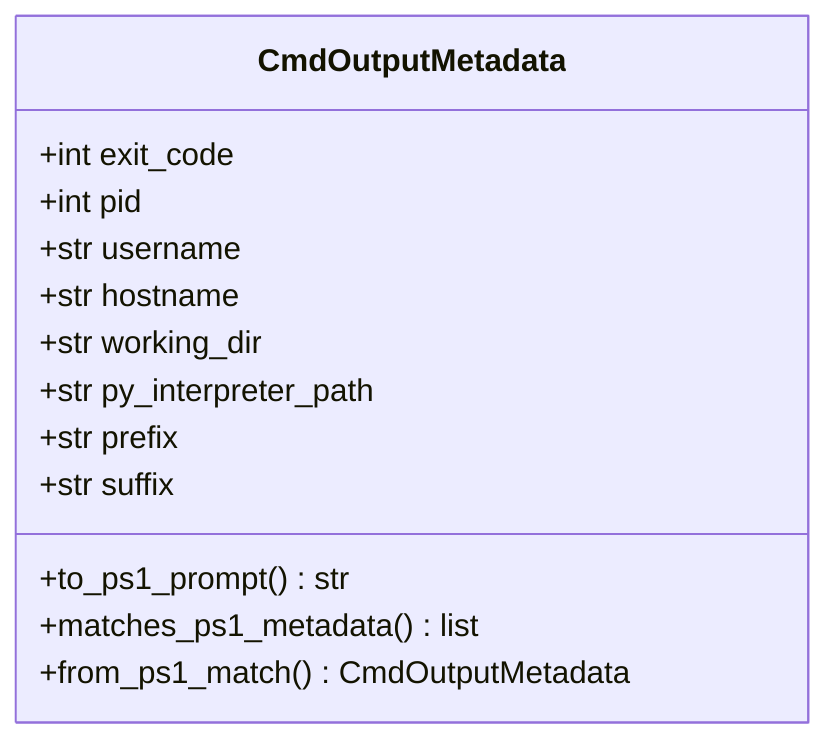
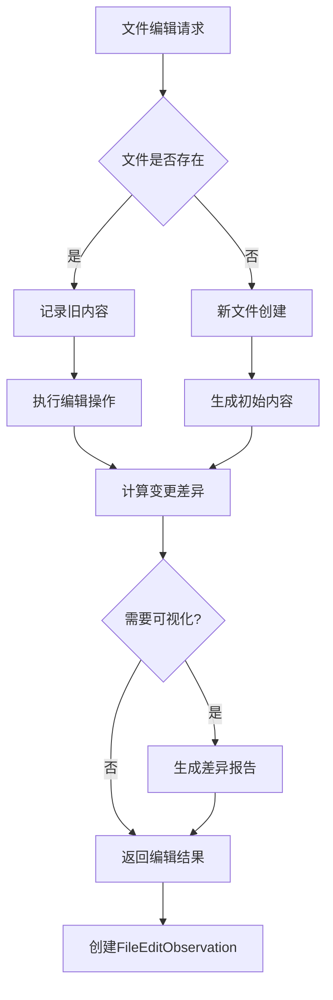
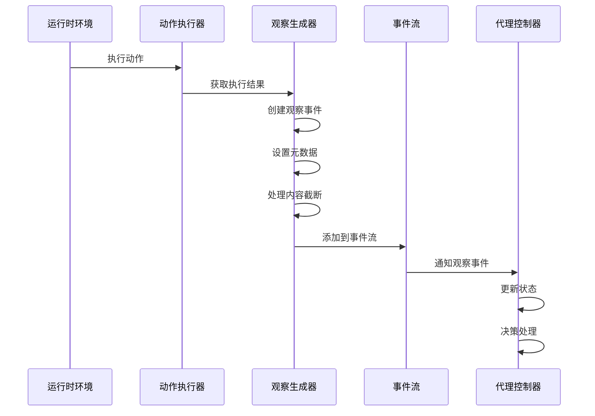
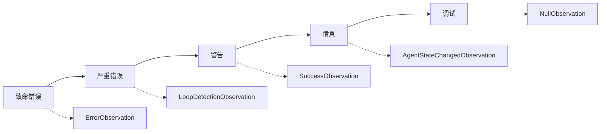
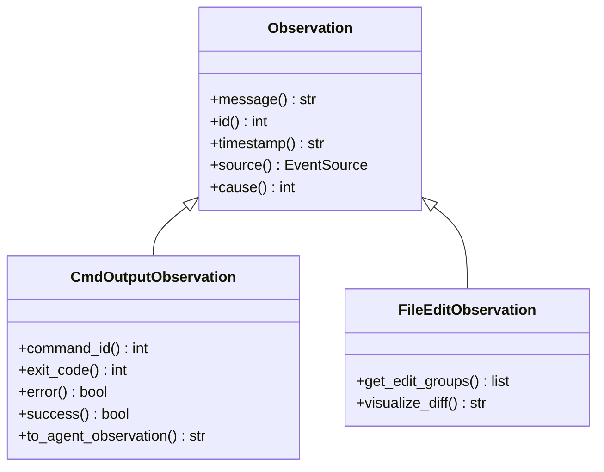
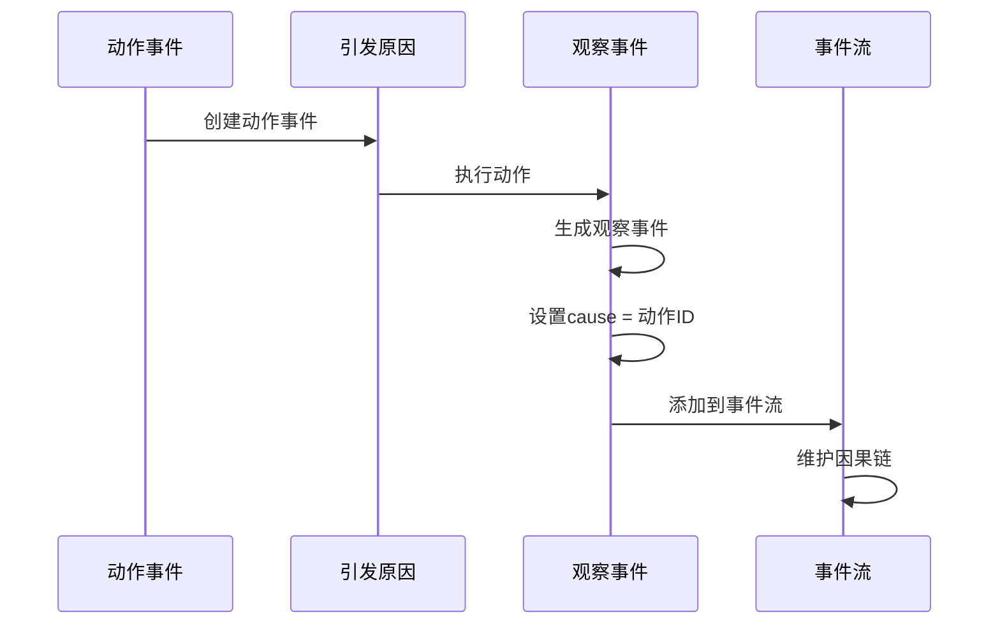
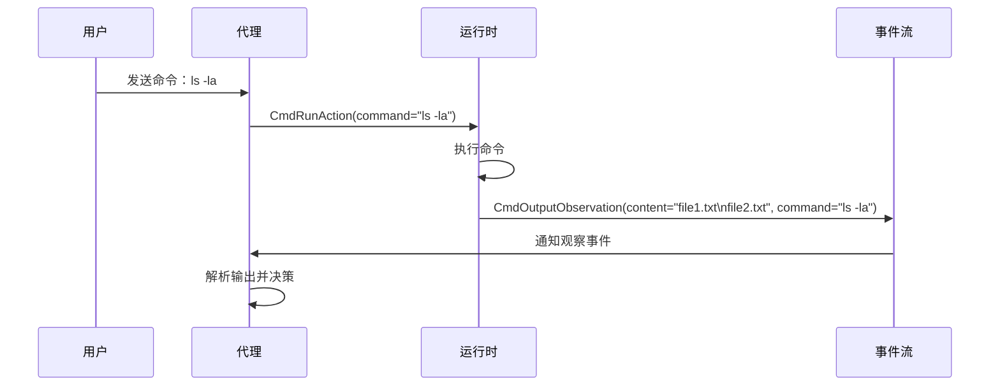
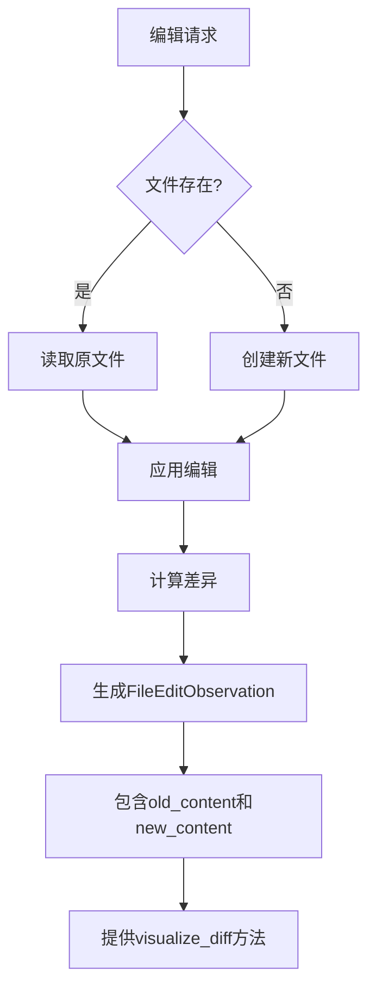
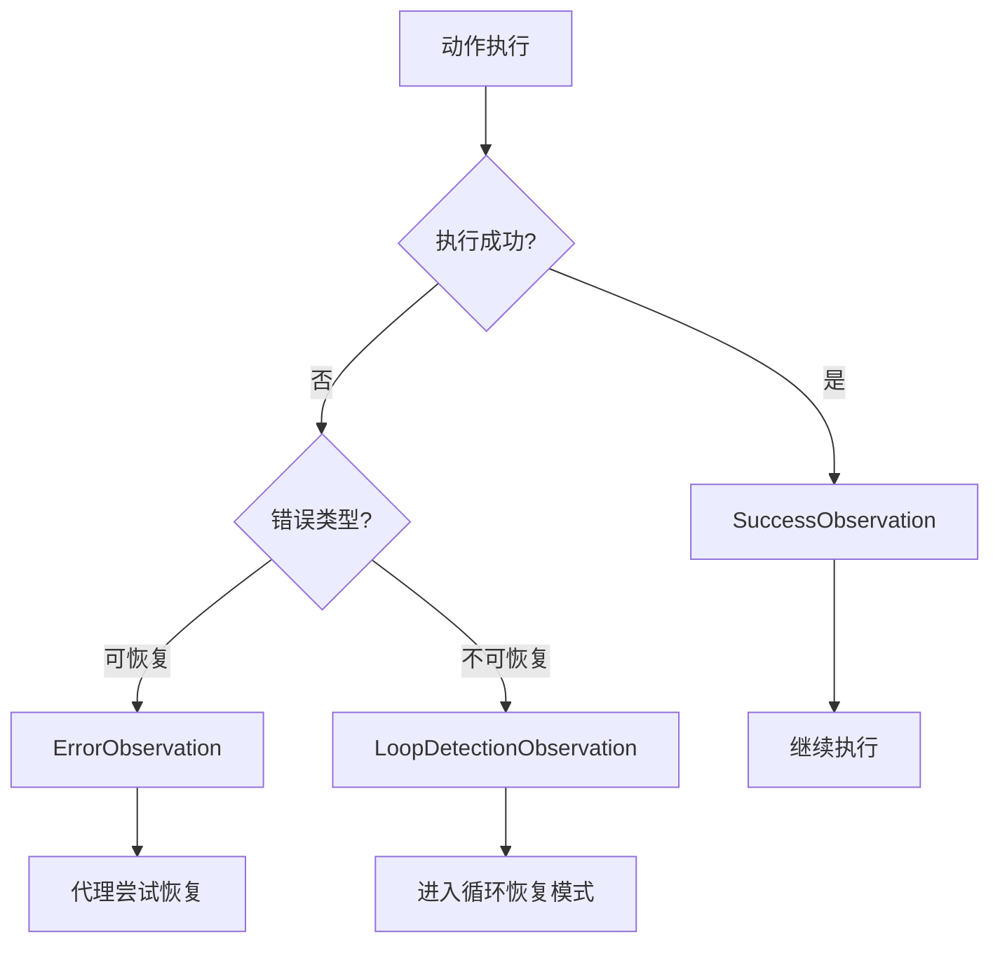

# 观察事件

<cite>
**本文档引用的文件**
- [observation.py](file://openhands/events/observation/observation.py)
- [error.py](file://openhands/events/observation/error.py)
- [success.py](file://openhands/events/observation/success.py)
- [commands.py](file://openhands/events/observation/commands.py)
- [files.py](file://openhands/events/observation/files.py)
- [loop_recovery.py](file://openhands/events/observation/loop_recovery.py)
- [mcp.py](file://openhands/events/observation/mcp.py)
- [empty.py](file://openhands/events/observation/empty.py)
- [event.py](file://openhands/events/event.py)
- [observation.py](file://openhands/events/serialization/observation.py)
- [agent_controller.py](file://openhands/controller/agent_controller.py)
- [stream.py](file://openhands/events/stream.py)
</cite>

## 目录
1. [简介](#简介)
2. [观察事件架构概览](#观察事件架构概览)
3. [核心观察类型详解](#核心观察类型详解)
4. [观察事件生成机制](#观察事件生成机制)
5. [观察事件分类体系](#观察事件分类体系)
6. [元数据字段与属性](#元数据字段与属性)
7. [与动作事件的关联关系](#与动作事件的关联关系)
8. [实际应用示例](#实际应用示例)
9. [性能考虑与优化](#性能考虑与优化)
10. [故障排除指南](#故障排除指南)
11. [总结](#总结)

## 简介

观察事件（Observation Events）是OpenHands系统中用于描述环境状态变化和系统反馈的核心机制。它们作为代理控制器与运行时环境之间的桥梁，将执行结果、状态变更和错误信息等关键信息传递给代理进行决策。观察事件构成了系统反馈闭环的重要组成部分，确保代理能够基于准确的环境信息做出智能决策。

观察事件系统采用统一的基类设计，支持多种类型的观察，包括命令执行结果、文件系统变更、错误反馈、成功确认等。每种观察类型都有其特定的数据结构和用途，共同构建了一个完整而灵活的反馈机制。

## 观察事件架构概览

OpenHands的观察事件系统采用分层架构设计，从底层的基础事件类到上层的具体观察类型，形成了一个完整的类型体系。

**图表来源**
- [observation.py](file://openhands/events/observation/observation.py#L6-L16)
- [commands.py](file://openhands/events/observation/commands.py#L96-L232)
- [files.py](file://openhands/events/observation/files.py#L11-L196)
- [error.py](file://openhands/events/observation/error.py#L7-L24)
- [success.py](file://openhands/events/observation/success.py#L7-L16)
- [loop_recovery.py](file://openhands/events/observation/loop_recovery.py#L7-L19)
- [mcp.py](file://openhands/events/observation/mcp.py#L8-L21)

**章节来源**
- [observation.py](file://openhands/events/observation/observation.py#L1-L16)
- [event.py](file://openhands/events/event.py#L35-L132)

## 核心观察类型详解

### 命令输出观察（CmdOutputObservation）

命令输出观察是最常用的观察类型之一，用于记录命令行操作的执行结果和相关信息。

#### 数据结构特征
- **命令属性**：记录执行的具体命令字符串
- **元数据管理**：包含退出码、进程ID、工作目录等详细信息
- **隐藏控制**：支持隐藏命令输出以保护敏感信息
- **截断机制**：自动处理大型输出内容

#### 关键属性说明

| 属性名 | 类型 | 描述 | 默认值 |
|--------|------|------|--------|
| command | str | 执行的命令字符串 | 必需 |
| metadata | CmdOutputMetadata | 命令执行元数据 | CmdOutputMetadata() |
| hidden | bool | 是否隐藏输出内容 | False |
| content | str | 命令的标准输出内容 | 必需 |

#### 元数据字段详解

**图表来源**
- [commands.py](file://openhands/events/observation/commands.py#L25-L94)

### 文件系统观察

文件系统观察涵盖文件读取、写入和编辑操作的完整生命周期。

#### 文件读取观察（FileReadObservation）
- **路径标识**：明确记录读取的文件路径
- **源类型**：区分不同读取来源（默认或ACI模式）
- **内容传递**：直接传递文件内容给代理

#### 文件编辑观察（FileEditObservation）
- **变更追踪**：记录文件修改前后的完整内容
- **差异可视化**：提供直观的变更对比视图
- **编辑组分析**：支持分块式的变更分析

**图表来源**
- [files.py](file://openhands/events/observation/files.py#L47-L196)

### 错误观察（ErrorObservation）

错误观察专门用于报告代理执行过程中遇到的问题和异常情况。

#### 设计原则
- **可恢复性**：标记LLM可以从中恢复的错误类型
- **错误标识**：提供唯一的错误标识符便于追踪
- **内容传递**：完整传递错误信息给代理

### 成功观察（SuccessObservation）

成功观察表示操作成功完成的状态反馈。

#### 特点
- **简洁性**：仅包含成功消息和可选的详细内容
- **状态确认**：为代理提供明确的成功确认
- **后续指导**：可能包含下一步操作建议

### 循环检测观察（LoopDetectionObservation）

循环检测观察用于通知UI层代理处于循环恢复模式。

#### 应用场景
- **CLI界面**：主要在命令行界面显示
- **循环识别**：当检测到代理陷入循环时触发
- **恢复提示**：向用户显示恢复选项

**章节来源**
- [commands.py](file://openhands/events/observation/commands.py#L96-L232)
- [files.py](file://openhands/events/observation/files.py#L11-L196)
- [error.py](file://openhands/events/observation/error.py#L7-L24)
- [success.py](file://openhands/events/observation/success.py#L7-L16)
- [loop_recovery.py](file://openhands/events/observation/loop_recovery.py#L7-L19)

## 观察事件生成机制

观察事件的生成遵循严格的流程，确保系统的稳定性和一致性。

### 生成流程

**图表来源**
- [agent_controller.py](file://openhands/controller/agent_controller.py#L531-L710)
- [stream.py](file://openhands/events/stream.py#L163-L184)

### 自动化生成规则

1. **动作匹配**：每个动作执行后自动生成对应的观察事件
2. **状态同步**：观察事件反映动作执行后的最终状态
3. **错误捕获**：异常情况自动转换为ErrorObservation
4. **成功确认**：正常完成的动作生成SuccessObservation

### 内容处理机制

#### 截断策略
- **大小限制**：超过30000字符的内容自动截断
- **中间截断**：保留首尾部分，插入截断提示
- **日志记录**：记录截断操作的详细信息

#### 隐藏机制
- **敏感信息**：支持隐藏命令输出中的敏感内容
- **配置控制**：通过hidden标志控制是否隐藏
- **安全考虑**：保护密码、密钥等敏感数据

**章节来源**
- [commands.py](file://openhands/events/observation/commands.py#L138-L166)
- [agent_controller.py](file://openhands/controller/agent_controller.py#L531-L710)

## 观察事件分类体系

OpenHands的观察事件采用层次化的分类体系，便于管理和使用。

### 按功能分类

| 分类 | 观察类型 | 主要用途 | 数据复杂度 |
|------|----------|----------|------------|
| 命令执行 | CmdOutputObservation | 命令行操作结果 | 中等 |
| 文件操作 | FileReadObservation FileWriteObservation FileEditObservation | 文件系统变更 | 高 |
| 状态反馈 | SuccessObservation ErrorObservation NullObservation | 操作状态确认 | 低 |
| 系统监控 | LoopDetectionObservation AgentStateChangedObservation | 系统状态监控 | 中等 |
| 工具集成 | MCPObservation | MCP服务器交互 | 中等 |

### 按严重程度分类

### 按使用场景分类

#### 用户交互场景
- **命令执行**：CmdOutputObservation
- **文件操作**：FileReadObservation, FileEditObservation
- **工具调用**：MCPObservation

#### 系统维护场景
- **状态监控**：AgentStateChangedObservation
- **错误诊断**：ErrorObservation
- **性能分析**：LoopDetectionObservation

**章节来源**
- [observation.py](file://openhands/events/serialization/observation.py#L36-L56)

## 元数据字段与属性

观察事件的元数据字段提供了丰富的上下文信息，支持复杂的查询和分析需求。

### 基础元数据

所有观察事件都继承自Event基类，具有以下基础属性：

| 字段名 | 类型 | 描述 | 必需性 |
|--------|------|------|--------|
| id | int | 唯一标识符 | 自动生成 |
| timestamp | str | ISO格式时间戳 | 自动生成 |
| source | EventSource | 事件来源（agent/user/environment） | 自动生成 |
| cause | int | 引发该事件的动作ID | 可选 |
| timeout | float | 超时设置 | 可选 |
| llm_metrics | Metrics | LLM调用指标 | 可选 |
| tool_call_metadata | ToolCallMetadata | 工具调用元数据 | 可选 |
| response_id | str | LLM响应ID | 可选 |

### 观察特有属性

#### 命令输出观察元数据
- **exit_code**：命令退出码（0表示成功）
- **pid**：进程ID
- **username**：执行用户名
- **hostname**：主机名
- **working_dir**：当前工作目录
- **py_interpreter_path**：Python解释器路径

#### 文件编辑观察属性
- **prev_exist**：文件是否存在
- **old_content**：修改前内容
- **new_content**：修改后内容
- **diff**：原始差异内容
- **impl_source**：实现来源类型

### 元数据访问方法

**图表来源**
- [commands.py](file://openhands/events/observation/commands.py#L167-L204)
- [files.py](file://openhands/events/observation/files.py#L72-L196)

**章节来源**
- [event.py](file://openhands/events/event.py#L35-L132)
- [commands.py](file://openhands/events/observation/commands.py#L25-L94)

## 与动作事件的关联关系

观察事件与动作事件之间存在明确的因果关系，这种关联确保了系统的可追溯性和一致性。

### 关联机制

**图表来源**
- [agent_controller.py](file://openhands/controller/agent_controller.py#L531-L540)

### 关联属性

#### cause属性
- **定义**：指向引发该观察事件的动作事件ID
- **作用**：建立观察与动作的直接关联
- **验证**：确保因果关系的完整性

#### 时间顺序
- **严格顺序**：动作必须先于观察发生
- **原子性**：动作和观察在同一线程中处理
- **一致性**：保证因果关系的一致性

### 关联验证

系统通过多种机制确保关联关系的正确性：

1. **ID验证**：检查cause字段的有效性
2. **时间戳比较**：验证事件的时间顺序
3. **因果链追踪**：维护完整的事件历史

**章节来源**
- [agent_controller.py](file://openhands/controller/agent_controller.py#L531-L540)

## 实际应用示例

### 命令执行示例

以下是一个典型的命令执行流程示例：

**图表来源**
- [commands.py](file://openhands/events/observation/commands.py#L96-L232)

### 文件编辑示例

文件编辑过程展示了更复杂的观察事件生成：

**图表来源**
- [files.py](file://openhands/events/observation/files.py#L47-L196)

### 错误处理示例

错误观察的典型应用场景：

**图表来源**
- [error.py](file://openhands/events/observation/error.py#L7-L24)
- [loop_recovery.py](file://openhands/events/observation/loop_recovery.py#L7-L19)

### 系统状态监控示例

系统监控场景中的观察事件使用：

| 场景 | 观察类型 | 触发条件 | 处理方式 |
|------|----------|----------|----------|
| 循环检测 | LoopDetectionObservation | 检测到循环行为 | 启动恢复机制 |
| 状态变更 | AgentStateChangedObservation | 代理状态改变 | 更新UI显示 |
| 错误发生 | ErrorObservation | 执行失败 | 尝试错误恢复 |
| 成功完成 | SuccessObservation | 操作成功 | 记录成功状态 |

**章节来源**
- [commands.py](file://openhands/events/observation/commands.py#L96-L232)
- [files.py](file://openhands/events/observation/files.py#L47-L196)
- [error.py](file://openhands/events/observation/error.py#L7-L24)
- [loop_recovery.py](file://openhands/events/observation/loop_recovery.py#L7-L19)

## 性能考虑与优化

观察事件系统在设计时充分考虑了性能因素，采用了多种优化策略。

### 内存管理

#### 对象池化
- **重用机制**：常用观察类型对象的重用
- **生命周期管理**：及时释放不再需要的对象
- **内存监控**：跟踪观察事件的内存占用

#### 内容压缩
- **延迟加载**：大内容按需加载
- **缓存策略**：频繁访问内容的缓存
- **垃圾回收**：定期清理无用的观察数据

### 序列化优化

#### JSON序列化
- **字段过滤**：只序列化必要的字段
- **类型优化**：使用高效的数据类型
- **批量处理**：减少序列化调用次数

#### 压缩算法
- **内容压缩**：对大内容进行压缩存储
- **增量更新**：只传输变更的部分
- **去重机制**：避免重复序列化相同内容

### 并发处理

#### 线程安全
- **锁机制**：保护共享资源的并发访问
- **无锁设计**：在可能的情况下使用无锁算法
- **异步处理**：非阻塞的观察事件处理

#### 负载均衡
- **事件分发**：合理分配观察事件处理负载
- **优先级队列**：重要事件优先处理
- **背压控制**：防止事件积压过多

**章节来源**
- [stream.py](file://openhands/events/stream.py#L163-L184)
- [observation.py](file://openhands/events/serialization/observation.py#L101-L143)

## 故障排除指南

### 常见问题及解决方案

#### 观察事件丢失
**症状**：某些动作没有对应的观察事件
**原因**：
- 动作执行异常中断
- 事件流配置错误
- 网络连接问题

**解决**：
- 检查动作执行日志
- 验证事件流配置
- 确认网络连接状态

#### 元数据不一致
**症状**：观察事件的元数据与预期不符
**原因**：
- 并发访问冲突
- 数据初始化错误
- 类型转换问题

**解决**：
- 使用线程安全的访问方法
- 检查数据初始化逻辑
- 验证类型转换正确性

#### 性能问题
**症状**：观察事件处理速度慢
**原因**：
- 内存泄漏
- 序列化开销过大
- 并发竞争激烈

**解决**：
- 运行内存分析工具
- 优化序列化逻辑
- 减少并发竞争

### 调试技巧

#### 日志分析
- **启用详细日志**：增加观察事件的调试信息
- **时间戳追踪**：分析事件处理的时间分布
- **因果链验证**：检查事件间的关联关系

#### 监控指标
- **事件吞吐量**：监控观察事件的处理速率
- **内存使用**：跟踪观察事件的内存占用
- **错误率**：统计观察事件生成的错误比例

**章节来源**
- [agent_controller.py](file://openhands/controller/agent_controller.py#L648-L661)

## 总结

OpenHands的观察事件系统是一个设计精良、功能完备的反馈机制。它通过统一的架构设计，支持多种类型的观察事件，满足了复杂代理系统的需求。

### 核心优势

1. **完整性**：覆盖了代理系统的所有关键反馈场景
2. **灵活性**：支持扩展新的观察类型
3. **性能**：优化的序列化和处理机制
4. **可靠性**：完善的错误处理和恢复机制

### 设计亮点

- **类型安全**：强类型系统确保使用正确
- **元数据丰富**：提供足够的上下文信息
- **关联明确**：清晰的动作-观察关系
- **易于扩展**：模块化的设计便于添加新功能

### 应用价值

观察事件系统为OpenHands提供了强大的反馈能力，使代理能够基于准确的环境信息做出智能决策。它不仅支持基本的操作反馈，还提供了系统监控、错误恢复等高级功能，是整个系统稳定运行的重要保障。

通过深入理解观察事件的机制和应用，开发者可以更好地利用OpenHands的强大功能，构建更加智能和可靠的自动化系统。