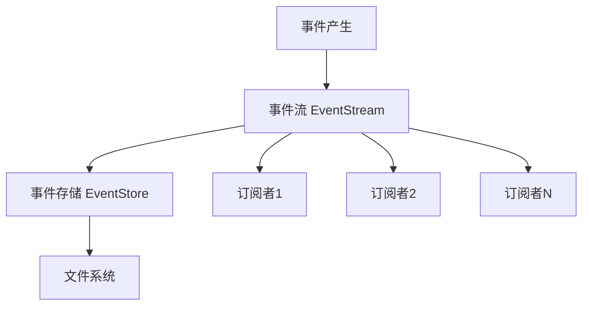
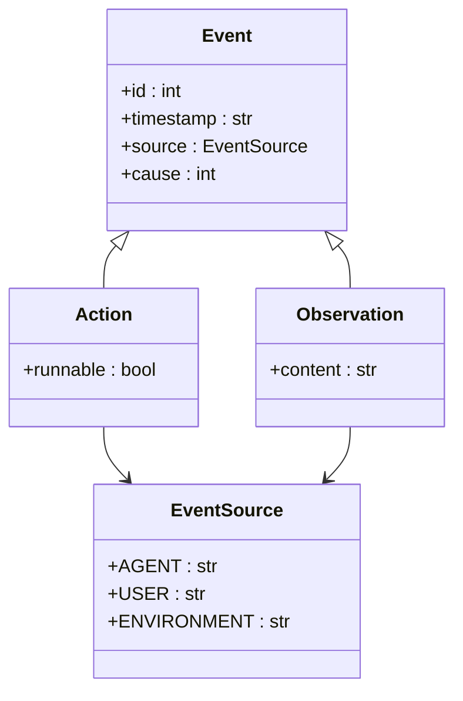
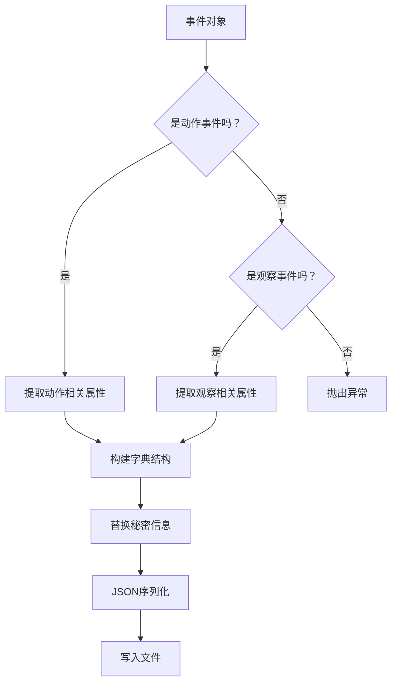
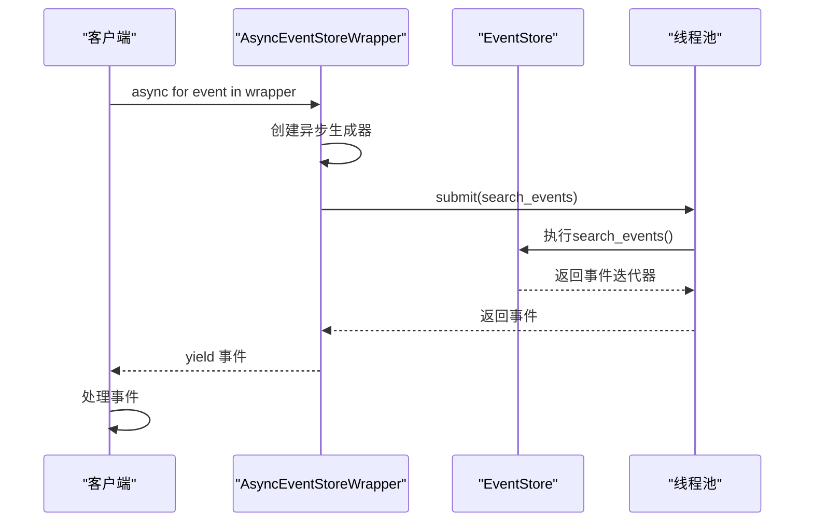
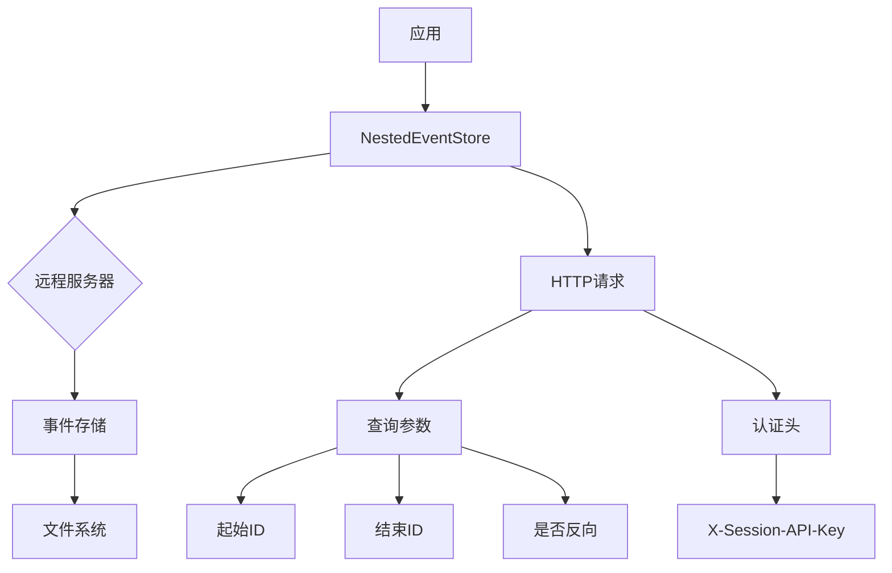
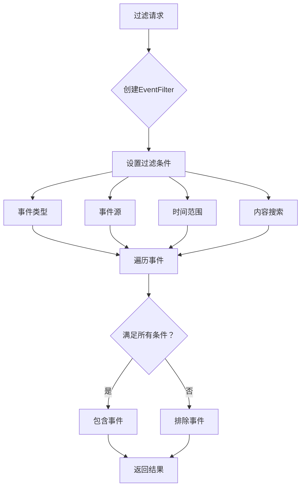
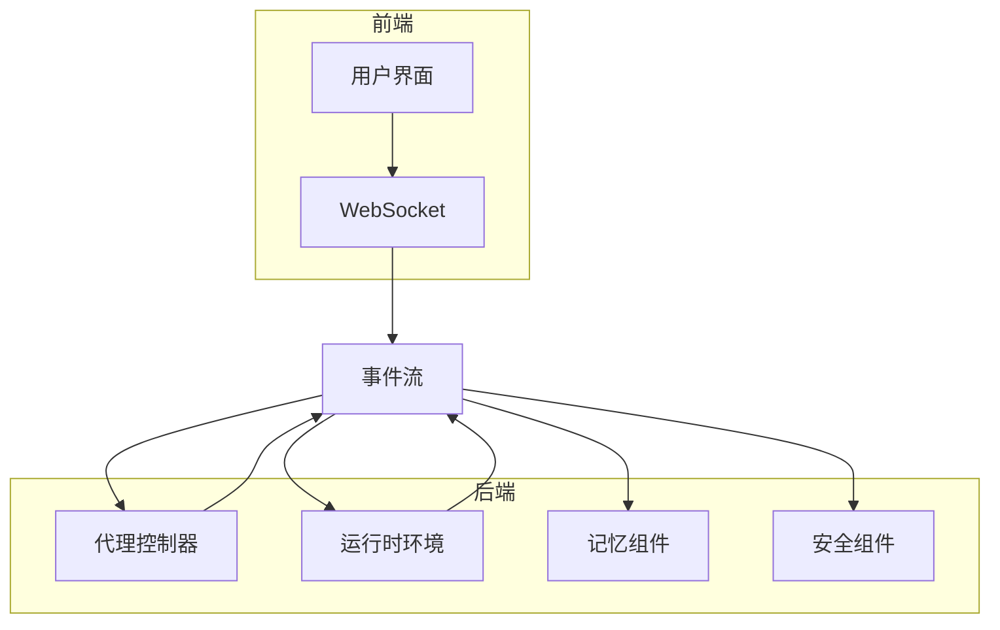
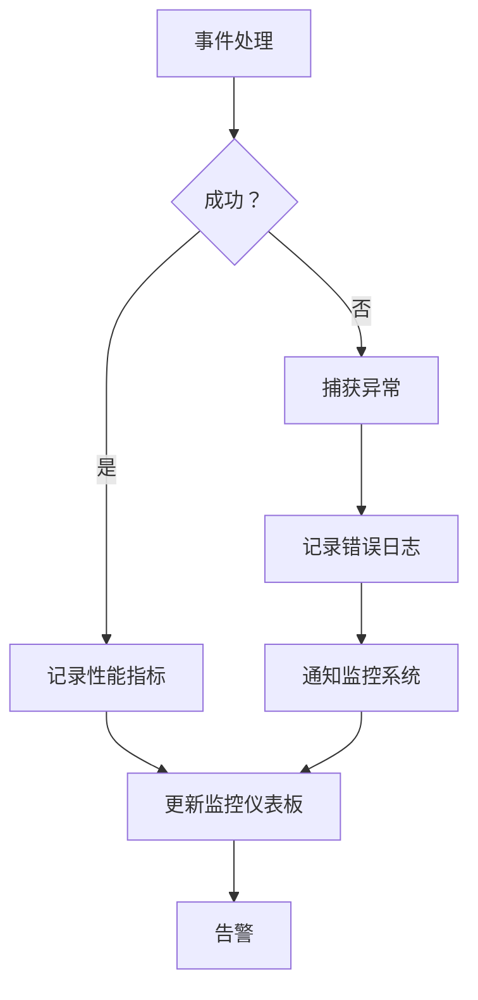

# 事件系统

<cite>
**本文档引用的文件**   
- [event_store.py](file://openhands/events/event_store.py)
- [stream.py](file://openhands/events/stream.py)
- [async_event_store_wrapper.py](file://openhands/events/async_event_store_wrapper.py)
- [nested_event_store.py](file://openhands/events/nested_event_store.py)
- [event_filter.py](file://openhands/events/event_filter.py)
- [event_store_abc.py](file://openhands/events/event_store_abc.py)
- [event.py](file://openhands/events/event.py)
- [serialization/event.py](file://openhands/events/serialization/event.py)
- [action/__init__.py](file://openhands/events/action/__init__.py)
- [observation/__init__.py](file://openhands/events/observation/__init__.py)
</cite>

## 目录
1. [引言](#引言)
2. [事件存储与事件流](#事件存储与事件流)
3. [事件分类体系](#事件分类体系)
4. [序列化机制](#序列化机制)
5. [异步事件包装器](#异步事件包装器)
6. [嵌套事件存储](#嵌套事件存储)
7. [过滤机制](#过滤机制)
8. [集成模式](#集成模式)
9. [性能监控与故障排查](#性能监控与故障排查)
10. [结论](#结论)

## 引言

OpenHands的事件系统是其核心架构的重要组成部分，采用事件驱动的设计模式来管理代理与环境之间的交互。该系统通过事件存储（EventStore）、事件流（Stream）和序列化机制，实现了高效、可扩展的事件管理。事件系统不仅支持动作（Action）和观察（Observation）事件的分类处理，还提供了异步事件包装器、嵌套事件存储和过滤机制等高级功能。本文档将全面描述OpenHands的事件驱动架构，深入分析其设计与实现细节。

## 事件存储与事件流

OpenHands的事件系统基于事件存储（EventStore）和事件流（EventStream）构建，实现了事件的持久化存储和实时处理。事件存储负责将事件持久化到文件系统中，而事件流则提供了事件的实时处理和订阅机制。

事件存储（EventStore）是事件系统的核心组件，它继承自抽象基类EventStoreABC，实现了事件的存储、检索和搜索功能。EventStore使用文件系统作为底层存储，每个会话（session）的事件存储在独立的目录中，事件文件以ID命名，确保了事件的有序性和可追溯性。为了提高性能，EventStore实现了缓存机制，将多个事件打包成缓存页（cache page），减少了文件I/O操作。

事件流（EventStream）扩展了EventStore的功能，增加了事件的实时处理能力。EventStream通过一个内部队列（queue）接收新事件，并在后台线程中异步处理这些事件。当新事件被添加到事件流时，它会被立即写入文件存储，然后放入队列中等待处理。事件流支持多个订阅者（subscriber），每个订阅者可以注册一个回调函数来处理特定类型的事件。这种设计实现了事件的解耦，使得不同的组件可以独立地处理感兴趣的事件。

**事件来源**
- [event_store.py](file://openhands/events/event_store.py#L43-L184)
- [stream.py](file://openhands/events/stream.py#L43-L292)

## 事件分类体系

OpenHands的事件系统将事件分为两大类：动作（Action）和观察（Observation）。这种分类体系反映了代理与环境之间的交互模式，其中动作代表代理发起的操作，而观察代表环境对这些操作的响应。

动作事件（Action）是代理发起的操作，它们被发送到环境执行。动作事件包括多种类型，如命令执行（CmdRunAction）、文件读写（FileReadAction、FileWriteAction）、浏览（BrowseURLAction）等。每个动作事件都有一个唯一的ID和时间戳，并且可以包含执行所需的参数。动作事件的基类是Action，它继承自Event类，并定义了动作的通用属性和方法。

观察事件（Observation）是环境对动作事件的响应，它们包含了动作执行的结果。观察事件也分为多种类型，如命令输出（CmdOutputObservation）、文件读取结果（FileReadObservation）、浏览器输出（BrowserOutputObservation）等。观察事件的基类是Observation，它同样继承自Event类，并包含了观察结果的内容。

事件系统还定义了事件源（EventSource）枚举，用于标识事件的来源。事件源包括AGENT（代理）、USER（用户）和ENVIRONMENT（环境）三种类型。这种设计使得系统能够区分不同来源的事件，从而实现更精细的事件处理和过滤。

**事件来源**
- [event.py](file://openhands/events/event.py#L9-L78)
- [action/__init__.py](file://openhands/events/action/__init__.py#L1-L51)
- [observation/__init__.py](file://openhands/events/observation/__init__.py#L1-L56)

## 序列化机制

OpenHands的事件系统实现了高效的序列化机制，用于在内存和持久化存储之间转换事件对象。序列化机制的核心是event_to_dict和event_from_dict函数，它们分别负责将事件对象转换为字典和从字典重建事件对象。

序列化过程首先通过asdict函数获取事件对象的所有属性，然后根据事件类型（动作或观察）进行不同的处理。对于动作事件，相关的属性被放入args字段中；对于观察事件，内容被放入content字段，其他属性被放入extras字段。这种设计使得序列化后的事件结构清晰，易于解析和处理。

反序列化过程则根据字典中的action或observation字段判断事件类型，然后调用相应的工厂函数（action_from_dict或observation_from_dict）创建具体的事件对象。反序列化过程中还会处理特殊字段，如source、tool_call_metadata和llm_metrics，将它们转换为正确的类型。

为了保护敏感信息，事件系统还实现了秘密信息替换功能。在序列化过程中，所有在secrets字典中定义的敏感信息都会被替换为"<secret_hidden>"，防止敏感数据泄露。这种设计既保证了事件的完整性，又确保了数据的安全性。

**事件来源**
- [serialization/event.py](file://openhands/events/serialization/event.py#L52-L179)
- [event_store.py](file://openhands/events/event_store.py#L138-L142)
- [stream.py](file://openhands/events/stream.py#L177-L180)

## 异步事件包装器

异步事件包装器（AsyncEventStoreWrapper）是OpenHands事件系统的重要组件，它解决了同步事件存储与异步处理之间的兼容性问题。在异步编程环境中，直接调用同步的事件存储方法会导致阻塞，影响系统性能。异步事件包装器通过将同步操作包装在异步生成器中，实现了非阻塞的事件处理。

AsyncEventStoreWrapper类实现了异步迭代器协议（__aiter__），允许在异步上下文中使用async for语法遍历事件。当异步迭代器被创建时，它会启动一个事件循环，并在该循环中运行同步的search_events方法。通过使用run_in_executor，同步方法被提交到线程池中执行，避免了阻塞主事件循环。

这种设计模式充分利用了Python的异步编程特性，实现了高效的事件处理。异步事件包装器不仅提高了系统的响应性，还使得事件处理逻辑可以与其他异步操作无缝集成。例如，在Web服务器中，可以使用异步事件包装器实时流式传输事件到前端，而不会阻塞其他请求的处理。

**事件来源**
- [async_event_store_wrapper.py](file://openhands/events/async_event_store_wrapper.py#L8-L24)
- [stream.py](file://openhands/events/stream.py#L246-L292)

## 嵌套事件存储

嵌套事件存储（NestedEventStore）是OpenHands事件系统的高级特性，它允许通过HTTP API访问远程的事件存储。这种设计支持分布式架构，使得事件数据可以跨多个服务实例共享和访问。

NestedEventStore实现了EventStoreABC接口，但其底层数据存储在远程服务器上。当需要检索事件时，NestedEventStore会向远程服务器发送HTTP GET请求，查询参数包括起始ID、结束ID、是否反向等。服务器返回JSON格式的事件列表，NestedEventStore将其反序列化为事件对象。

为了提高性能和可靠性，嵌套事件存储实现了分页机制。当事件数量较多时，请求会被分批处理，每次只获取一部分事件。这种设计减少了单次请求的数据量，降低了网络传输的开销。同时，分页机制还支持断点续传，即使在请求过程中出现网络中断，也可以从上次中断的位置继续获取数据。

嵌套事件存储还支持会话API密钥认证，确保只有授权的客户端可以访问事件数据。通过在HTTP请求头中添加X-Session-API-Key字段，客户端可以证明其身份。这种安全机制保护了事件数据的隐私和完整性。

**事件来源**
- [nested_event_store.py](file://openhands/events/nested_event_store.py#L14-L102)
- [stream.py](file://openhands/events/stream.py#L33-L41)

## 过滤机制

OpenHands的事件系统提供了灵活的过滤机制，允许根据多种条件筛选事件。过滤机制的核心是EventFilter类，它定义了多种过滤条件，包括事件类型、事件源、时间范围和内容搜索等。

EventFilter类通过include和exclude方法实现过滤逻辑。include方法检查事件是否满足所有过滤条件，只有当事件通过所有条件检查时才会被包含在结果中。exclude方法则是include的反向操作，用于排除不符合条件的事件。这种设计使得过滤逻辑清晰且易于扩展。

过滤机制支持多种过滤条件的组合使用。例如，可以同时按事件类型和事件源进行过滤，或者在指定时间范围内搜索包含特定关键词的事件。对于内容搜索，系统会将事件序列化为JSON字符串，然后进行不区分大小写的文本匹配。这种设计使得过滤功能强大且灵活，能够满足各种复杂的查询需求。

为了提高过滤性能，事件系统还实现了缓存机制。当频繁执行相同的过滤查询时，结果会被缓存起来，避免重复的计算和I/O操作。这种优化显著提高了系统的响应速度，特别是在处理大量事件数据时。

**事件来源**
- [event_filter.py](file://openhands/events/event_filter.py#L8-L99)
- [event_store.py](file://openhands/events/event_store.py#L85-L137)

## 集成模式

OpenHands的事件系统与前端、后端和其他核心组件紧密集成，形成了一个完整的事件驱动架构。这种集成模式确保了系统各部分之间的高效通信和数据同步。

在前端集成方面，事件系统通过WebSocket或HTTP长轮询将事件实时推送到前端界面。前端接收到事件后，会根据事件类型更新UI状态，如显示命令输出、文件变更或代理思考过程。这种实时更新机制提供了流畅的用户体验，使用户能够即时了解代理的执行状态。

在后端集成方面，事件系统作为各个组件之间的通信枢纽。代理控制器（AgentController）通过事件流接收用户输入和环境反馈，然后生成新的动作事件。运行时环境（Runtime）执行动作事件后，将结果作为观察事件返回。这种基于事件的通信模式实现了组件间的松耦合，使得系统更易于维护和扩展。

与其他核心组件的集成主要体现在事件的处理和响应上。例如，记忆组件（Memory）订阅事件流，记录代理的执行历史，用于后续的上下文理解和决策。安全组件（Security）监控事件流，检测潜在的安全风险，如危险的命令执行。这种集成模式使得各个组件能够协同工作，共同实现复杂的代理功能。

**事件来源**
- [stream.py](file://openhands/events/stream.py#L130-L162)
- [controller/agent_controller.py](file://openhands/controller/agent_controller.py)
- [runtime/base.py](file://openhands/runtime/base.py)

## 性能监控与故障排查

OpenHands的事件系统提供了完善的性能监控和故障排查机制，确保系统的稳定运行和高效性能。这些机制包括事件处理性能监控、错误处理和日志记录等。

性能监控主要关注事件处理的延迟和吞吐量。系统通过Metrics类记录每个事件处理的响应时间、令牌使用量和成本等指标。这些指标可以用于分析系统性能瓶颈，优化事件处理流程。例如，当发现某个类型的事件处理时间过长时，可以针对性地优化相应的处理逻辑。

错误处理机制确保了系统的健壮性。事件流中的每个订阅者都有独立的错误处理器，当订阅者的回调函数抛出异常时，错误会被捕获并记录到日志中，但不会影响其他订阅者的正常运行。这种设计实现了错误隔离，防止单个组件的故障导致整个系统崩溃。

日志记录提供了详细的系统运行信息，是故障排查的重要工具。事件系统使用结构化日志记录，每个日志条目都包含时间戳、事件ID、组件名称等上下文信息。当出现问题时，可以通过这些信息快速定位故障点。例如，当某个事件未能正确处理时，可以通过日志追溯该事件的完整处理流程，找出问题所在。

**事件来源**
- [stream.py](file://openhands/events/stream.py#L277-L290)
- [event.py](file://openhands/events/event.py#L98-L108)
- [core/logger.py](file://openhands/core/logger.py)

## 结论

OpenHands的事件系统是一个精心设计的事件驱动架构，它通过事件存储、事件流和序列化机制实现了高效、可扩展的事件管理。系统采用动作和观察的分类体系，清晰地划分了代理与环境之间的交互模式。异步事件包装器和嵌套事件存储等高级特性，使得系统能够适应复杂的分布式环境。灵活的过滤机制和完善的性能监控，为系统的稳定运行提供了保障。整体而言，OpenHands的事件系统不仅满足了当前的功能需求，还为未来的扩展和优化奠定了坚实的基础。