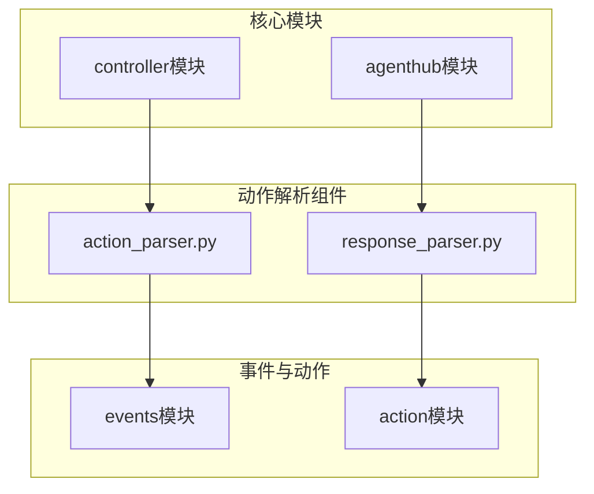
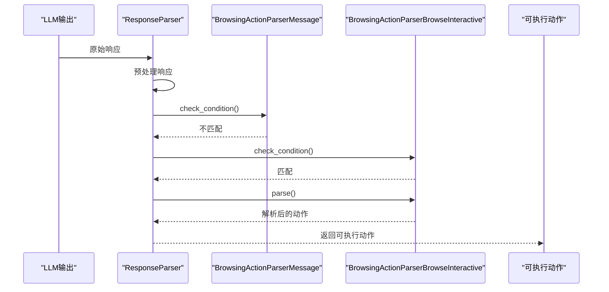
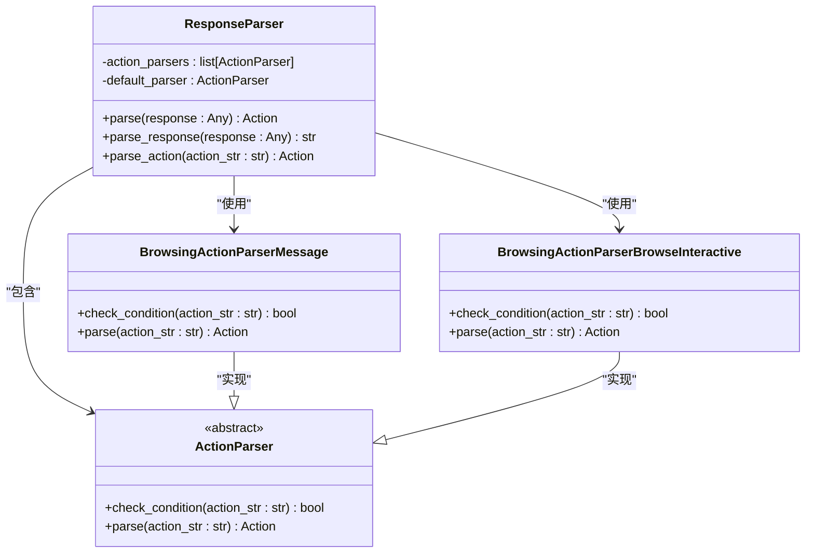
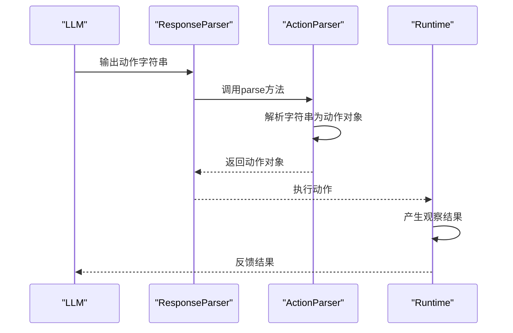
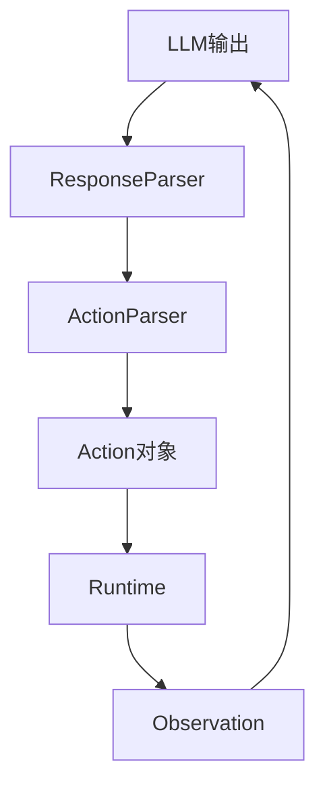

# 动作解析

<cite>
**本文档中引用的文件**  
- [action_parser.py](file://openhands/controller/action_parser.py)
- [response_parser.py](file://openhands/agenthub/browsing_agent/response_parser.py)
- [commands.py](file://openhands/events/action/commands.py)
- [files.py](file://openhands/events/action/files.py)
- [test_browsing_agent_parser.py](file://tests/unit/agenthub/browsing_agent/test_browsing_agent_parser.py)
</cite>

## 目录
1. [简介](#简介)
2. [项目结构](#项目结构)
3. [核心组件](#核心组件)
4. [架构概述](#架构概述)
5. [详细组件分析](#详细组件分析)
6. [依赖分析](#依赖分析)
7. [性能考虑](#性能考虑)
8. [故障排除指南](#故障排除指南)
9. [结论](#结论)

## 简介
本文件全面阐述了OpenHands项目中ActionParser的解析算法和语法处理机制。文档详细解释了如何将大型语言模型（LLM）的输出转换为可执行动作，涵盖了支持的动作类型、格式验证规则和错误处理策略。此外，还提供了自定义动作扩展的实现指南和解析性能优化建议，并包含实际解析案例和常见解析错误的解决方案。

## 项目结构
OpenHands项目采用模块化设计，其中动作解析功能主要集中在controller和agenthub模块中。核心的ActionParser实现在controller模块中，而特定代理（如浏览代理）的解析器则在agenthub模块中实现。这种结构使得基础解析框架可以被不同类型的代理复用，同时允许特定代理根据需要定制解析逻辑。

**Diagram sources**
- [action_parser.py](file://openhands/controller/action_parser.py#L1-L79)
- [response_parser.py](file://openhands/agenthub/browsing_agent/response_parser.py#L1-L127)

**Section sources**
- [action_parser.py](file://openhands/controller/action_parser.py#L1-L79)
- [response_parser.py](file://openhands/agenthub/browsing_agent/response_parser.py#L1-L127)

## 核心组件
动作解析系统的核心是ActionParser抽象基类，它定义了所有动作解析器必须实现的接口。系统通过ResponseParser协调多个ActionParser实例，根据输入内容的特征选择合适的解析器进行处理。当LLM输出不符合预期格式时，系统能够通过默认解析器进行容错处理，确保系统的鲁棒性。

**Section sources**
- [action_parser.py](file://openhands/controller/action_parser.py#L64-L77)
- [response_parser.py](file://openhands/agenthub/browsing_agent/response_parser.py#L12-L17)

## 架构概述
动作解析系统采用策略模式设计，通过ResponseParser管理多个ActionParser策略实例。系统首先对LLM的原始响应进行预处理，然后依次尝试各个解析器的条件检查，找到匹配的解析器后执行具体解析。如果所有专用解析器都不匹配，则使用默认解析器进行兜底处理。这种设计既保证了对特定格式的精确解析，又确保了对异常输入的容错能力。

**Diagram sources**
- [response_parser.py](file://openhands/agenthub/browsing_agent/response_parser.py#L19-L50)
- [action_parser.py](file://openhands/controller/action_parser.py#L64-L77)

## 详细组件分析

### 动作解析器分析
动作解析系统的核心是基于抽象基类ActionParser的策略模式实现。系统通过定义check_condition和parse两个抽象方法，为所有具体解析器提供了统一的接口规范。这种设计使得新的解析器可以轻松地添加到系统中，而无需修改现有的解析逻辑。

#### 对于面向对象的组件：

**Diagram sources**
- [action_parser.py](file://openhands/controller/action_parser.py#L64-L77)
- [response_parser.py](file://openhands/agenthub/browsing_agent/response_parser.py#L51-L125)

**Section sources**
- [action_parser.py](file://openhands/controller/action_parser.py#L64-L77)
- [response_parser.py](file://openhands/agenthub/browsing_agent/response_parser.py#L12-L127)

### 动作类型分析
系统支持多种类型的动作，每种动作都有其特定的数据结构和语义。从文件操作到命令执行，再到浏览器交互，各种动作类型构成了系统功能的基础。这些动作类型通过继承Action基类来确保接口的一致性，同时通过具体属性来表达各自特有的行为特征。

#### 对于API/服务组件：

**Diagram sources**
- [response_parser.py](file://openhands/agenthub/browsing_agent/response_parser.py#L19-L50)
- [base.py](file://openhands/runtime/base.py#L991-L1015)

**Section sources**
- [commands.py](file://openhands/events/action/commands.py#L12-L65)
- [files.py](file://openhands/events/action/files.py#L9-L139)

## 依赖分析
动作解析系统与其他组件存在紧密的依赖关系。它依赖于events模块中的动作定义，同时为runtime模块提供可执行的动作指令。这种依赖关系形成了一个完整的闭环：LLM生成动作建议，解析器将其转换为标准格式，运行时环境执行动作并产生观察结果，这些结果又作为新的上下文反馈给LLM。

**Diagram sources**
- [action_parser.py](file://openhands/controller/action_parser.py#L4-L79)
- [base.py](file://openhands/runtime/base.py#L991-L1015)

**Section sources**
- [action_parser.py](file://openhands/controller/action_parser.py#L1-L79)
- [base.py](file://openhands/runtime/base.py#L991-L1015)

## 性能考虑
动作解析系统的性能主要受解析算法复杂度和正则表达式匹配效率的影响。对于简单的条件检查，系统采用字符串包含检测等高效算法；对于复杂的语法解析，则使用AST解析确保准确性。在实际应用中，应避免在解析器中进行耗时的IO操作，以保持解析过程的轻量级特性。

## 故障排除指南
常见的解析问题包括格式不匹配、语法错误和边界情况处理。当遇到解析失败时，应首先检查LLM输出是否符合预期格式，然后验证解析器的条件检查逻辑是否正确。对于复杂的语法错误，可以使用AST解析结合正则表达式回退策略来提高解析的鲁棒性。

**Section sources**
- [test_browsing_agent_parser.py](file://tests/unit/agenthub/browsing_agent/test_browsing_agent_parser.py#L1-L84)
- [response_parser.py](file://openhands/agenthub/browsing_agent/response_parser.py#L104-L120)

## 结论
OpenHands的动作解析系统通过灵活的策略模式设计，实现了对LLM输出的高效、可靠解析。系统不仅支持多种动作类型，还具备良好的扩展性和容错能力。通过理解其核心机制和设计原则，开发者可以轻松地添加新的动作类型或定制解析逻辑，以满足特定应用场景的需求。