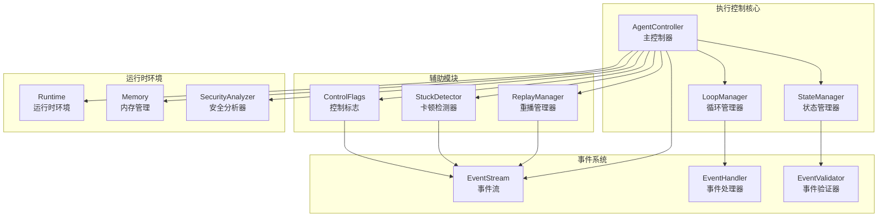
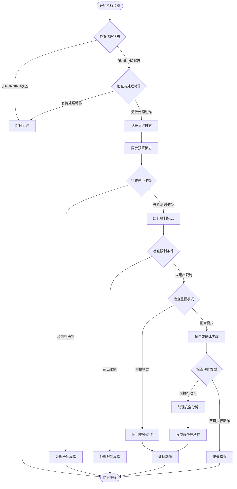
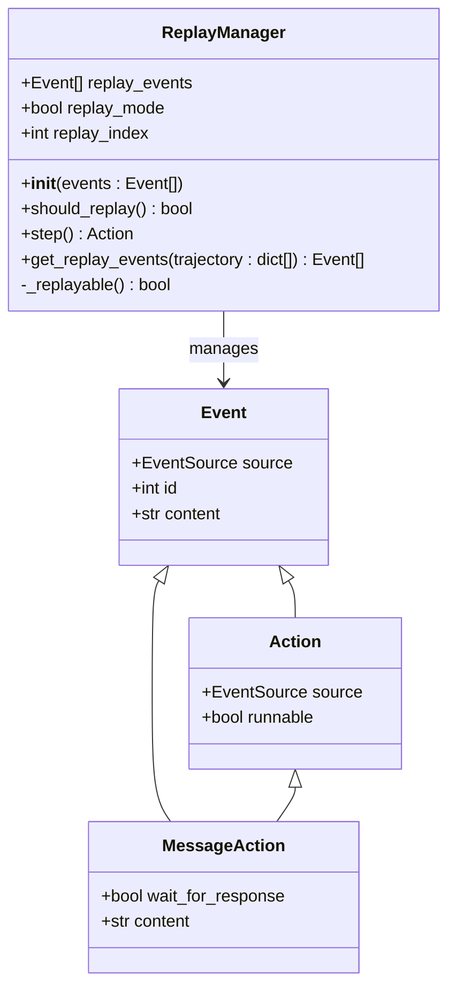
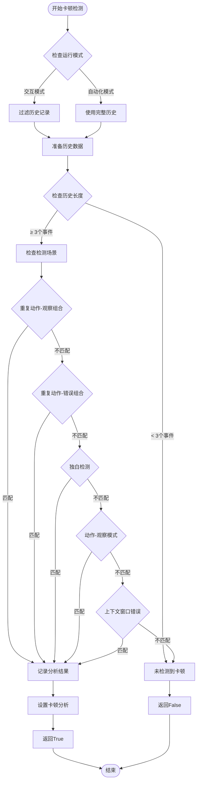
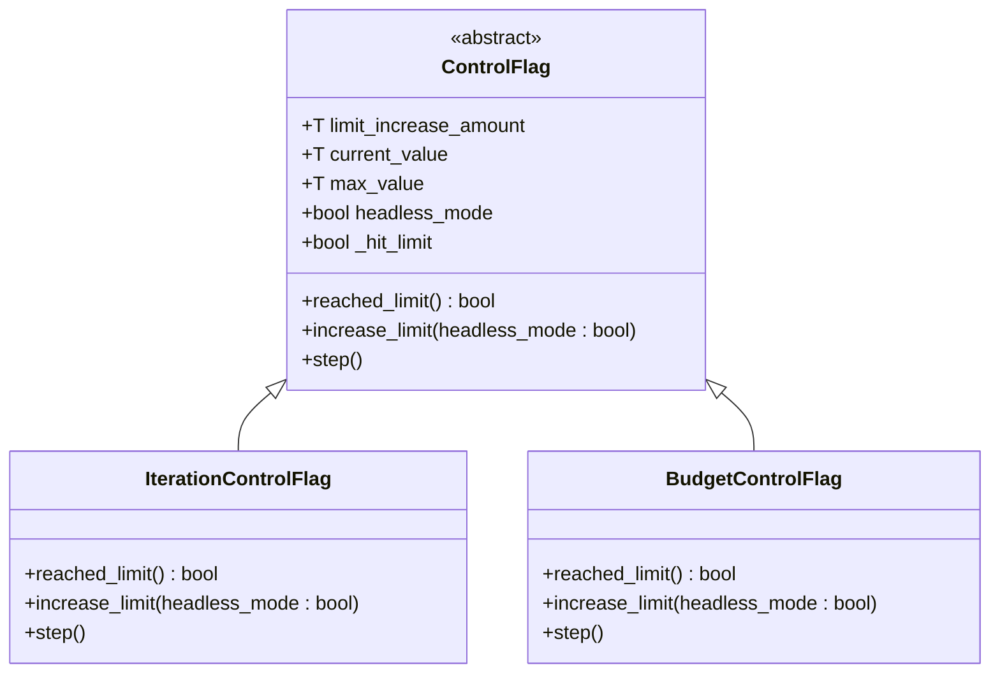
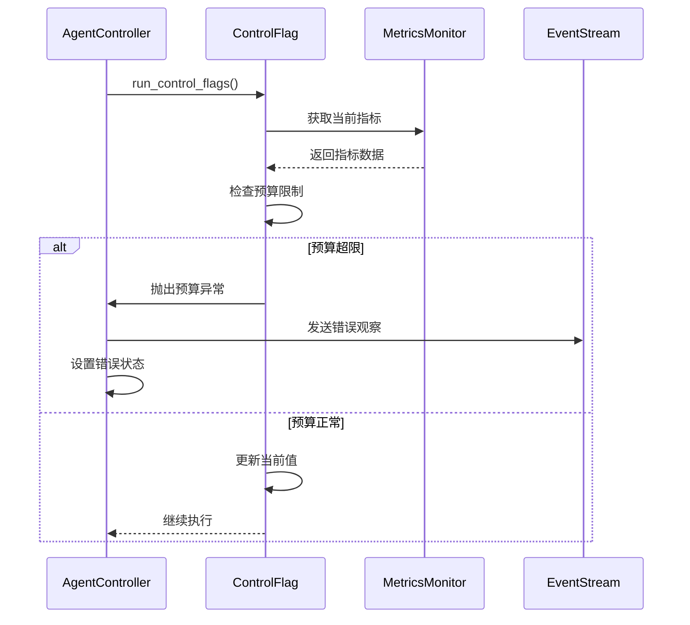

# 执行控制

<cite>
**本文档中引用的文件**
- [agent_controller.py](file://openhands/controller/agent_controller.py)
- [replay.py](file://openhands/controller/replay.py)
- [stuck.py](file://openhands/controller/stuck.py)
- [main.py](file://openhands/core/main.py)
- [loop.py](file://openhands/core/loop.py)
- [state.py](file://openhands/controller/state/state.py)
- [control_flags.py](file://openhands/controller/state/control_flags.py)
- [event_store.py](file://openhands/events/event_store.py)
</cite>

## 目录
1. [简介](#简介)
2. [系统架构概览](#系统架构概览)
3. [AgentController主控循环](#agentcontroller主控循环)
4. [Replay模块会话恢复功能](#replay模块会话恢复功能)
5. [Stuck模块卡顿检测算法](#stuck模块卡顿检测算法)
6. [执行监控与超时处理](#执行监控与超时处理)
7. [资源管理最佳实践](#资源管理最佳实践)
8. [性能调优建议](#性能调优建议)
9. [故障排除指南](#故障排除指南)
10. [总结](#总结)

## 简介

OpenHands执行控制系统是一个高度复杂的多层架构，负责协调智能体的执行过程、状态管理和异常处理。该系统通过AgentController作为核心控制器，结合Replay模块的历史回放功能和Stuck模块的卡顿检测算法，为智能体提供了稳定可靠的执行环境。

执行控制系统的主要职责包括：
- 主控循环的协调与调度
- 任务状态的跟踪与管理
- 异常情况的检测与恢复
- 资源使用的监控与限制
- 历史轨迹的保存与恢复

## 系统架构概览

OpenHands执行控制系统采用分层架构设计，各组件协同工作以确保系统的稳定性和可靠性。

**图表来源**
- [agent_controller.py](file://openhands/controller/agent_controller.py#L101-L200)
- [main.py](file://openhands/core/main.py#L52-L100)

## AgentController主控循环

AgentController是整个执行控制系统的核心，负责协调智能体的执行过程和状态转换。

### 主控循环机制

主控循环通过`_step()`方法实现单步执行，该方法包含以下关键逻辑：

**图表来源**
- [agent_controller.py](file://openhands/controller/agent_controller.py#L851-L1006)

### 任务调度机制

AgentController的任务调度遵循以下优先级规则：

1. **委托代理优先级**：如果存在活跃的委托代理，优先处理委托代理的事件
2. **用户输入优先级**：用户消息具有最高优先级
3. **观察结果优先级**：环境观察结果次之
4. **定时执行**：在满足条件时定期执行

**章节来源**
- [agent_controller.py](file://openhands/controller/agent_controller.py#L368-L442)

## Replay模块会话恢复功能

Replay模块提供了强大的会话恢复和历史回放功能，支持轨迹重放和调试分析。

### 会话恢复架构

**图表来源**
- [replay.py](file://openhands/controller/replay.py#L11-L99)

### 历史回放技术

ReplayManager通过以下机制实现历史回放：

1. **事件过滤**：自动过滤环境事件和空观察结果
2. **响应等待处理**：重置消息等待响应标志
3. **索引管理**：维护重播事件的索引位置
4. **模式切换**：在重播模式和正常模式间无缝切换

**章节来源**
- [replay.py](file://openhands/controller/replay.py#L23-L81)

## Stuck模块卡顿检测算法

Stuck模块实现了智能的卡顿检测算法，能够识别多种类型的执行卡顿并提供相应的恢复策略。

### 卡顿检测算法

**图表来源**
- [stuck.py](file://openhands/controller/stuck.py#L38-L131)

### 检测场景详解

Stuck模块支持五种主要的卡顿检测场景：

1. **重复动作-观察组合**：连续四个相同的动作-观察对
2. **重复动作-错误组合**：连续三个相同的动作导致错误
3. **独白检测**：智能体持续发送相同的消息
4. **动作-观察模式**：每两个步骤重复相同的模式
5. **上下文窗口错误**：连续的压缩操作失败

**章节来源**
- [stuck.py](file://openhands/controller/stuck.py#L84-L129)

## 执行监控与超时处理

执行监控系统通过多层次的控制机制确保系统的稳定运行。

### 控制标志系统

**图表来源**
- [control_flags.py](file://openhands/controller/state/control_flags.py#L11-L96)

### 超时处理机制

系统提供了多种超时处理策略：

1. **硬超时**：强制终止长时间运行的操作
2. **软超时**：标记但允许继续执行
3. **资源超时**：基于资源使用情况的超时
4. **预算超时**：基于成本控制的超时

**章节来源**
- [agent_controller.py](file://openhands/controller/agent_controller.py#L886-L893)

## 资源管理最佳实践

资源管理系统通过控制标志和状态跟踪确保资源的合理使用。

### 预算控制

**图表来源**
- [control_flags.py](file://openhands/controller/state/control_flags.py#L72-L95)

### 迭代控制

迭代控制确保智能体不会陷入无限循环：

1. **初始限制**：设置基础迭代上限
2. **动态扩展**：根据需要增加限制
3. **异常处理**：超出限制时抛出异常
4. **状态恢复**：支持从限制状态恢复

**章节来源**
- [control_flags.py](file://openhands/controller/state/control_flags.py#L46-L66)

## 性能调优建议

### 循环优化

1. **减少不必要的状态检查**：在非必要情况下跳过状态验证
2. **批量事件处理**：合并多个小事件以提高效率
3. **缓存机制**：缓存频繁访问的数据结构
4. **异步处理**：使用异步操作避免阻塞

### 内存优化

1. **事件压缩**：定期压缩历史事件以节省内存
2. **懒加载**：按需加载大型数据结构
3. **垃圾回收**：及时清理不再使用的对象
4. **内存监控**：实时监控内存使用情况

### 并发优化

1. **任务池化**：使用任务池管理并发操作
2. **锁优化**：最小化锁的使用范围和时间
3. **队列管理**：合理配置事件队列大小
4. **负载均衡**：分散计算负载

## 故障排除指南

### 常见问题诊断

#### 卡顿问题

**症状**：智能体长时间无响应或重复相同操作
**诊断步骤**：
1. 检查StuckDetector的分析结果
2. 查看历史事件中的重复模式
3. 分析错误日志中的异常信息
4. 检查资源使用情况

**解决方案**：
- 启用重播模式进行调试
- 调整卡顿检测阈值
- 优化智能体的决策逻辑
- 增加超时处理机制

#### 内存泄漏

**症状**：系统内存使用持续增长
**诊断步骤**：
1. 检查事件历史的大小
2. 分析对象引用关系
3. 监控垃圾回收频率
4. 检查异常处理中的资源释放

**解决方案**：
- 实施事件压缩策略
- 使用弱引用避免循环引用
- 定期清理临时对象
- 优化数据结构设计

#### 性能瓶颈

**症状**：执行速度明显下降
**诊断步骤**：
1. 分析CPU使用率分布
2. 检查I/O操作频率
3. 监控网络连接状态
4. 分析事件处理延迟

**解决方案**：
- 优化算法复杂度
- 减少不必要的序列化操作
- 实施异步处理
- 调整并发参数

### 调试工具

1. **事件追踪**：启用详细的事件日志记录
2. **状态快照**：定期保存系统状态
3. **性能分析**：使用内置的性能监控工具
4. **异常报告**：收集和分析异常信息

**章节来源**
- [agent_controller.py](file://openhands/controller/agent_controller.py#L312-L367)

## 总结

OpenHands执行控制系统通过精心设计的架构和算法，为智能体提供了稳定、高效的执行环境。系统的核心优势包括：

1. **鲁棒性**：多重保护机制确保系统稳定性
2. **灵活性**：支持多种运行模式和配置选项
3. **可观测性**：全面的状态跟踪和监控能力
4. **可扩展性**：模块化设计便于功能扩展

通过合理使用执行控制系统的各项功能，开发者可以构建更加可靠和高效的智能体应用。建议在实际部署中根据具体需求调整控制参数，并建立完善的监控和告警机制。