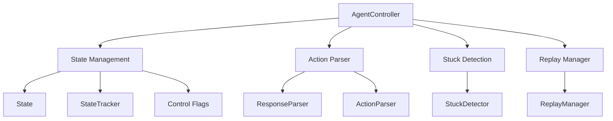
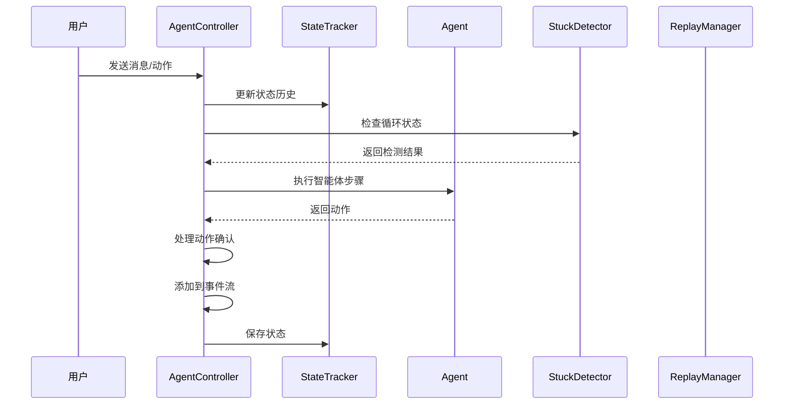
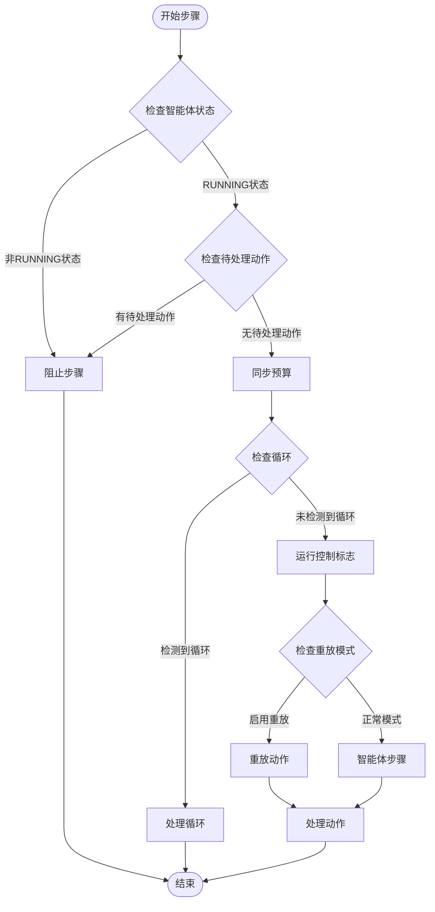
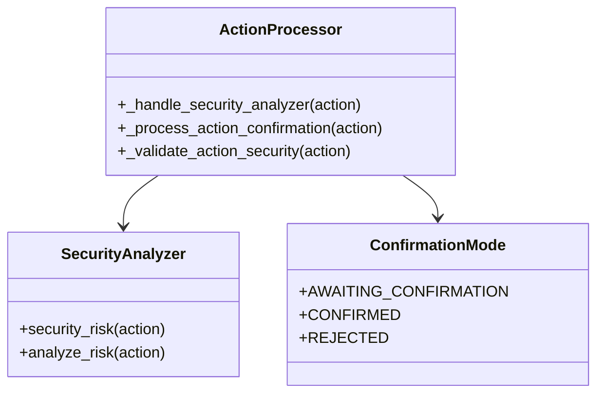
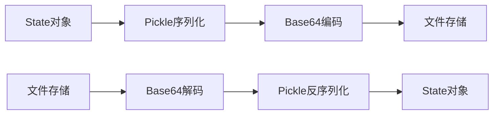
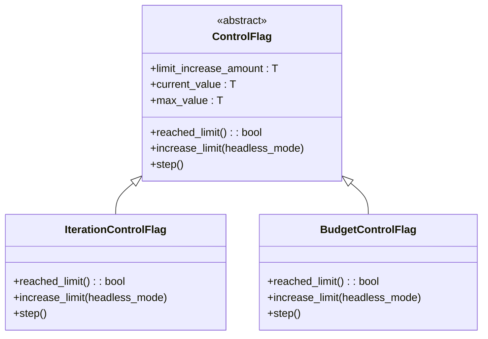
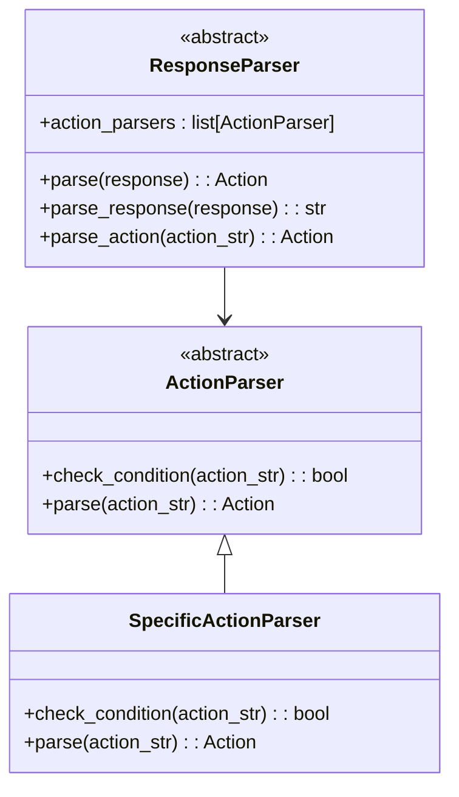
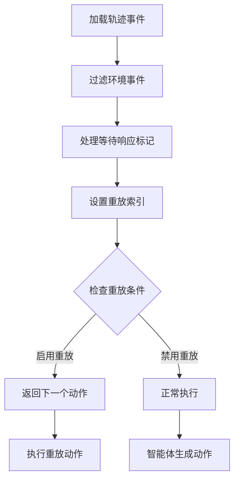
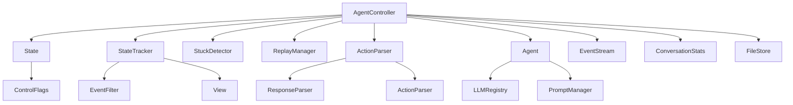

# 控制器

<cite>
**本文档中引用的文件**
- [agent_controller.py](file://openhands/controller/agent_controller.py)
- [action_parser.py](file://openhands/controller/action_parser.py)
- [agent.py](file://openhands/controller/agent.py)
- [replay.py](file://openhands/controller/replay.py)
- [stuck.py](file://openhands/controller/stuck.py)
- [state/state.py](file://openhands/controller/state/state.py)
- [state/state_tracker.py](file://openhands/controller/state/state_tracker.py)
- [state/control_flags.py](file://openhands/controller/state/control_flags.py)
</cite>

## 目录
1. [简介](#简介)
2. [项目结构](#项目结构)
3. [核心组件](#核心组件)
4. [架构概览](#架构概览)
5. [详细组件分析](#详细组件分析)
6. [依赖关系分析](#依赖关系分析)
7. [性能考虑](#性能考虑)
8. [故障排除指南](#故障排除指南)
9. [结论](#结论)

## 简介

OpenHands控制器是系统的核心协调器，负责管理智能体的生命周期、状态转换和执行流程。该控制器实现了复杂的多层架构，包括状态管理、动作解析、循环检测、重放机制和安全控制等功能模块。

控制器的主要职责包括：
- 协调智能体与运行时环境的交互
- 管理智能体的状态转换和生命周期
- 处理动作解析和安全验证
- 检测和处理循环问题
- 支持任务重放和恢复机制
- 实现预算和迭代限制控制

## 项目结构

控制器模块采用分层架构设计，主要包含以下核心文件：

**图表来源**
- [agent_controller.py](file://openhands/controller/agent_controller.py#L101-L1362)
- [state/state.py](file://openhands/controller/state/state.py#L48-L312)
- [action_parser.py](file://openhands/controller/action_parser.py#L17-L79)

**章节来源**
- [agent_controller.py](file://openhands/controller/agent_controller.py#L1-L50)
- [state/state.py](file://openhands/controller/state/state.py#L1-L50)

## 核心组件

### AgentController - 主控制器

AgentController是整个系统的核心组件，负责协调智能体的所有操作。它维护智能体的状态、处理事件流、管理执行循环，并提供各种辅助功能。

主要特性：
- **状态管理**：跟踪智能体的当前状态和历史记录
- **事件处理**：响应用户输入和系统事件
- **执行控制**：管理智能体的执行循环和限制
- **委托支持**：支持多智能体协作和任务分解

### State - 状态管理

State类封装了智能体的完整运行状态，包括历史记录、指标数据和配置信息。

核心功能：
- **会话持久化**：支持状态的保存和恢复
- **历史跟踪**：记录所有事件和交互历史
- **指标监控**：跟踪执行成本和资源使用
- **多代理支持**：支持委托场景下的状态管理

### ActionParser - 动作解析

ActionParser提供了灵活的动作解析框架，支持多种格式和验证机制。

设计特点：
- **抽象接口**：定义统一的解析接口
- **类型安全**：确保动作的有效性和安全性
- **扩展性**：支持自定义解析器的添加

**章节来源**
- [agent_controller.py](file://openhands/controller/agent_controller.py#L101-L200)
- [state/state.py](file://openhands/controller/state/state.py#L48-L120)
- [action_parser.py](file://openhands/controller/action_parser.py#L17-L79)

## 架构概览

控制器采用事件驱动的架构模式，通过事件流协调各个组件的交互：

**图表来源**
- [agent_controller.py](file://openhands/controller/agent_controller.py#L443-L500)
- [state/state_tracker.py](file://openhands/controller/state/state_tracker.py#L200-L269)

## 详细组件分析

### AgentController 核心功能

AgentController实现了复杂的执行循环，包含多个关键阶段：

#### 1. 状态检查和初始化

**图表来源**
- [agent_controller.py](file://openhands/controller/agent_controller.py#L852-L950)

#### 2. 动作处理和安全验证

控制器实现了多层次的安全验证机制：

**图表来源**
- [agent_controller.py](file://openhands/controller/agent_controller.py#L950-L990)

#### 3. 循环检测和恢复机制

StuckDetector提供了多种循环检测算法：

| 检测类型 | 描述 | 触发条件 |
|---------|------|----------|
| 重复动作-观察 | 连续相同的动作-观察对 | 4个连续的相同动作-观察对 |
| 重复动作-错误 | 连续相同的动作-错误对 | 3个连续的相同动作-错误对 |
| 单调输出 | 智能体自我对话 | 3个连续的相同消息动作 |
| 模式循环 | 交替的动作-观察模式 | 6步内的交替模式 |
| 上下文窗口错误 | 上下文窗口溢出循环 | 10个连续的压缩观察 |

**章节来源**
- [agent_controller.py](file://openhands/controller/agent_controller.py#L852-L1000)
- [stuck.py](file://openhands/controller/stuck.py#L21-L482)

### State管理系统

State管理系统提供了完整的状态持久化和历史跟踪功能：

#### 状态序列化和恢复

**图表来源**
- [state/state.py](file://openhands/controller/state/state.py#L122-L190)

#### 控制标志管理

控制器实现了迭代和预算的双重限制机制：

**图表来源**
- [state/control_flags.py](file://openhands/controller/state/control_flags.py#L11-L96)

**章节来源**
- [state/state.py](file://openhands/controller/state/state.py#L122-L240)
- [state/control_flags.py](file://openhands/controller/state/control_flags.py#L11-L96)

### ActionParser 解析机制

ActionParser提供了灵活的解析框架，支持多种动作类型的处理：

#### 解析器层次结构

**图表来源**
- [action_parser.py](file://openhands/controller/action_parser.py#L17-L79)

**章节来源**
- [action_parser.py](file://openhands/controller/action_parser.py#L17-L79)

### ReplayManager 重放机制

ReplayManager支持轨迹重放功能，用于测试和调试：

#### 重放流程

**图表来源**
- [replay.py](file://openhands/controller/replay.py#L23-L99)

**章节来源**
- [replay.py](file://openhands/controller/replay.py#L11-L99)

## 依赖关系分析

控制器模块的依赖关系体现了清晰的分层架构：

**图表来源**
- [agent_controller.py](file://openhands/controller/agent_controller.py#L1-L50)
- [state/state_tracker.py](file://openhands/controller/state/state_tracker.py#L1-L30)

**章节来源**
- [agent_controller.py](file://openhands/controller/agent_controller.py#L1-L50)
- [state/state_tracker.py](file://openhands/controller/state/state_tracker.py#L1-L30)

## 性能考虑

### 内存管理

控制器实现了多项内存优化策略：

1. **历史记录截断**：定期清理过期的历史记录
2. **状态缓存**：使用视图缓存减少重复计算
3. **延迟加载**：按需加载事件历史和状态数据

### 并发处理

控制器支持异步操作以提高并发性能：

- **事件处理异步化**：事件回调使用异步处理
- **状态更新原子性**：确保状态变更的一致性
- **资源池管理**：复用LLM连接和工具实例

### 性能监控

内置的指标系统提供了全面的性能监控：

- **执行时间统计**：跟踪各阶段的执行时间
- **资源使用监控**：监控内存和CPU使用情况
- **错误率统计**：跟踪各类错误的发生频率

## 故障排除指南

### 常见问题和解决方案

#### 1. 智能体卡死问题

**症状**：智能体长时间处于同一状态，不产生新的动作

**诊断步骤**：
- 检查StuckDetector的循环检测日志
- 分析事件历史中的重复模式
- 验证控制标志是否达到限制

**解决方案**：
- 启用循环恢复机制
- 调整控制标志的增加幅度
- 检查智能体的提示词和配置

#### 2. 状态丢失问题

**症状**：重启后状态无法恢复或历史记录不完整

**诊断步骤**：
- 检查文件存储的可访问性
- 验证序列化过程的完整性
- 查看状态保存的日志记录

**解决方案**：
- 确保文件存储权限正确
- 检查磁盘空间和I/O性能
- 验证状态对象的序列化兼容性

#### 3. 安全验证失败

**症状**：动作被拒绝或需要额外确认

**诊断步骤**：
- 检查安全分析器的配置
- 验证动作的安全风险评估
- 查看确认模式的设置

**解决方案**：
- 调整安全阈值设置
- 配置适当的分析器
- 在开发环境中临时禁用安全检查

**章节来源**
- [agent_controller.py](file://openhands/controller/agent_controller.py#L312-L400)
- [stuck.py](file://openhands/controller/stuck.py#L38-L131)

## 结论

OpenHands控制器是一个设计精良的复杂系统，成功地整合了状态管理、动作解析、循环检测、重放机制等多个功能模块。其分层架构和事件驱动的设计模式为系统的可扩展性和可维护性奠定了坚实基础。

### 主要优势

1. **模块化设计**：清晰的职责分离和接口定义
2. **容错能力**：完善的异常处理和恢复机制
3. **性能优化**：多层次的缓存和资源管理
4. **扩展性**：支持插件化的解析器和分析器

### 改进建议

1. **监控增强**：增加更详细的性能指标和告警机制
2. **配置管理**：提供更灵活的运行时配置调整
3. **测试覆盖**：完善单元测试和集成测试
4. **文档完善**：补充更多的使用示例和最佳实践

控制器作为OpenHands系统的核心组件，其设计理念和实现方式为构建可靠的智能体控制系统提供了宝贵的参考价值。