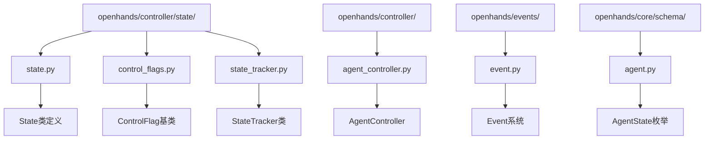
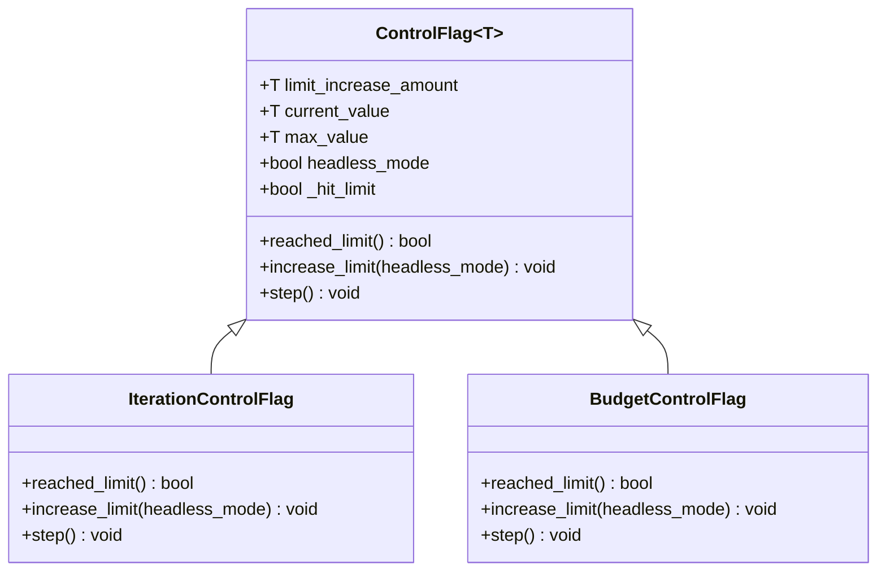
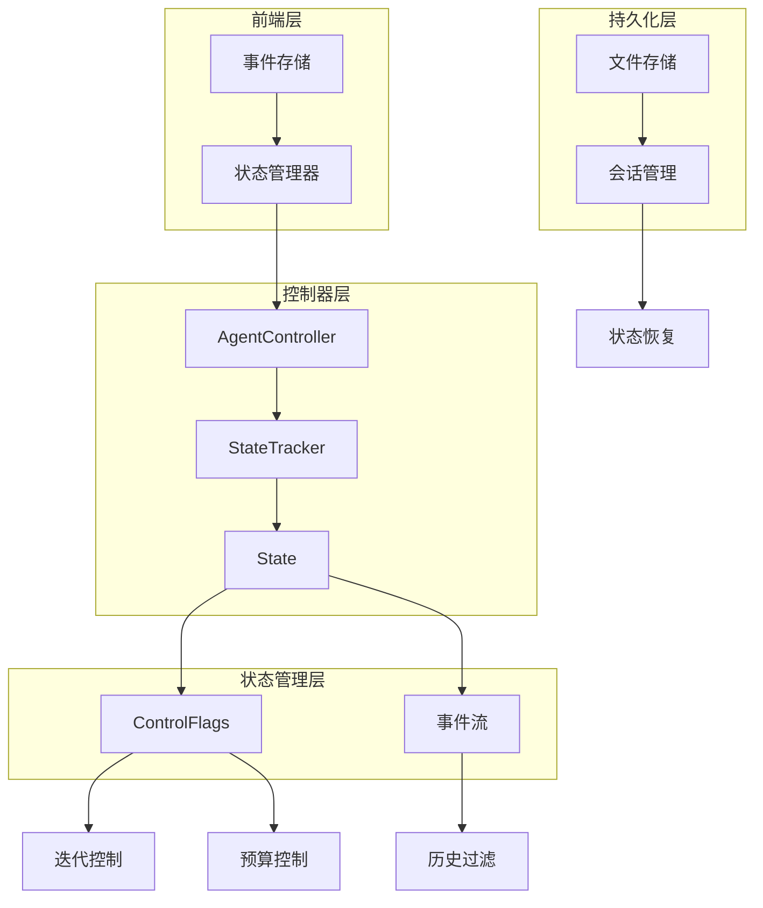
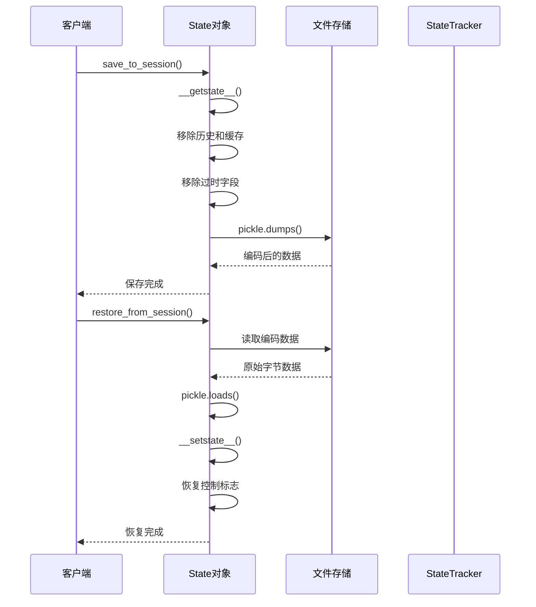
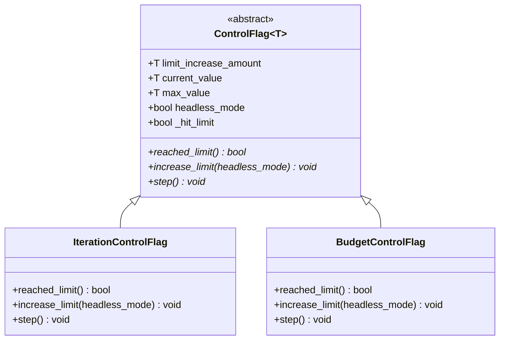
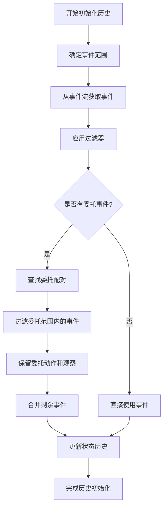
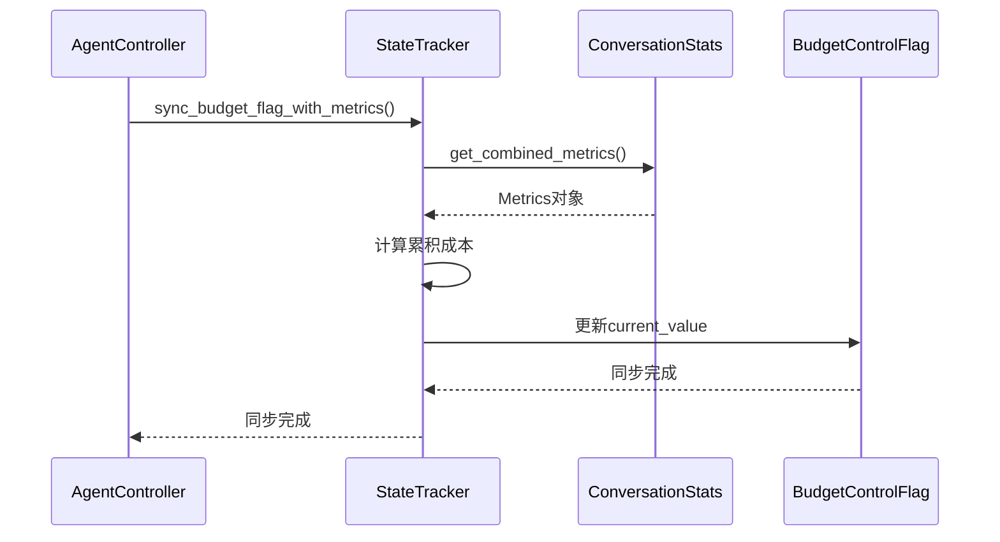
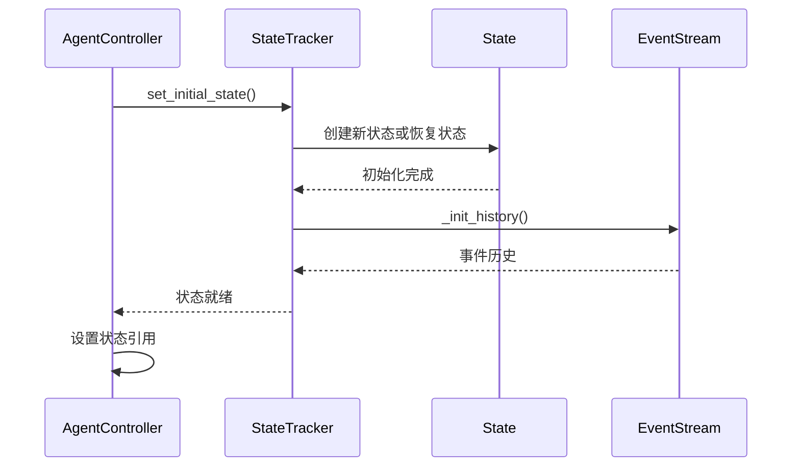
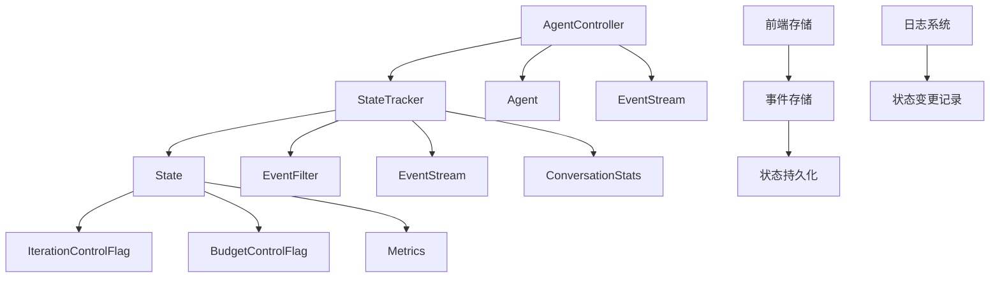
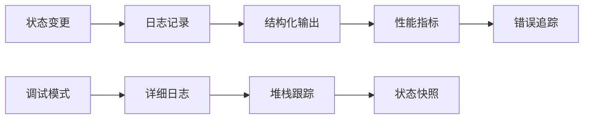

# 状态管理

<cite>
**本文档中引用的文件**
- [state.py](file://openhands/controller/state/state.py)
- [control_flags.py](file://openhands/controller/state/control_flags.py)
- [state_tracker.py](file://openhands/controller/state/state_tracker.py)
- [agent_controller.py](file://openhands/controller/agent_controller.py)
- [event.py](file://openhands/events/event.py)
- [agent.py](file://openhands/core/schema/agent.py)
- [logger.py](file://openhands/core/logger.py)
- [test_state.py](file://tests/unit/controller/state/test_state.py)
- [test_agent_controller.py](file://tests/unit/controller/test_agent_delegation.py)
- [test_state_metrics_exposure.py](file://tests/unit/test_state_metrics_exposure.py)
</cite>

## 目录
1. [简介](#简介)
2. [项目结构](#项目结构)
3. [核心组件](#核心组件)
4. [架构概览](#架构概览)
5. [详细组件分析](#详细组件分析)
6. [依赖关系分析](#依赖关系分析)
7. [性能考虑](#性能考虑)
8. [故障排除指南](#故障排除指南)
9. [结论](#结论)

## 简介

OpenHands的状态管理系统是一个复杂而精密的架构，负责维护和协调智能代理在整个生命周期中的状态。该系统通过三个核心组件协同工作：State类（表示代理的运行状态）、ControlFlags（控制代理行为和执行流程）和StateTracker（监控功能和性能优化）。本文档深入探讨了这些组件的设计模式、状态转换机制以及它们与其他系统组件的集成方式。

## 项目结构

状态管理相关的文件主要分布在以下目录结构中：

**图表来源**
- [state.py](file://openhands/controller/state/state.py#L1-L50)
- [control_flags.py](file://openhands/controller/state/control_flags.py#L1-L30)
- [state_tracker.py](file://openhands/controller/state/state_tracker.py#L1-L30)

## 核心组件

### State类 - 代理运行状态的核心表示

State类是整个状态管理系统的核心，它封装了代理在OpenHands系统中的所有运行状态数据。该类不仅保存代理操作的数据，还维护其内存和历史记录。

#### 主要特性：
- **多代理/委托状态管理**：存储任务（代理与用户之间的对话）和子任务（代理与用户或其他代理之间的对话）
- **迭代计数器**：跟踪全局和本地迭代次数
- **代理层级**：支持多代理交互的委托级别
- **错误处理**：记录最后遇到的错误
- **会话持久化**：支持序列化和反序列化以保存和恢复状态

#### 关键字段说明：

| 字段名 | 类型 | 描述 |
|--------|------|------|
| `session_id` | str | 会话标识符 |
| `agent_state` | AgentState | 当前代理状态（LOADING, RUNNING, PAUSED等） |
| `iteration_flag` | IterationControlFlag | 迭代限制控制标志 |
| `budget_flag` | BudgetControlFlag \| None | 预算限制控制标志 |
| `history` | list[Event] | 事件历史记录 |
| `metrics` | Metrics | 全局指标统计 |
| `last_error` | str | 最后一个错误消息 |

**章节来源**
- [state.py](file://openhands/controller/state/state.py#L48-L120)

### ControlFlags - 代理行为控制机制

ControlFlags系统提供了两个专门的控制标志类，用于管理代理的关键限制条件。

#### IterationControlFlag - 迭代限制管理

**图表来源**
- [control_flags.py](file://openhands/controller/state/control_flags.py#L11-L96)

#### BudgetControlFlag - 预算限制管理

BudgetControlFlag专门用于管理基于成本的操作限制，与LLM服务的成本计算紧密集成。

#### 控制标志的工作原理：

1. **限制检查**：通过`reached_limit()`方法检查是否达到预设上限
2. **限制扩展**：在需要时通过`increase_limit()`方法动态扩展限制
3. **状态步进**：通过`step()`方法推进到下一个状态并进行边界检查

**章节来源**
- [control_flags.py](file://openhands/controller/state/control_flags.py#L42-L96)

### StateTracker - 状态监控和同步

StateTracker类负责管理代理状态的生命周期，包括持久化、历史管理和指标同步。

#### 主要职责：
- **状态持久化**：跨会话保持代理状态
- **历史管理**：过滤和跟踪相关事件
- **指标同步**：在控制器和LLM组件之间同步指标
- **控制标志更新**：更新预算和迭代限制

**章节来源**
- [state_tracker.py](file://openhands/controller/state/state_tracker.py#L20-L29)

## 架构概览

状态管理系统采用分层架构设计，确保各组件之间的松耦合和高内聚：

**图表来源**
- [agent_controller.py](file://openhands/controller/agent_controller.py#L101-L200)
- [state_tracker.py](file://openhands/controller/state/state_tracker.py#L31-L100)

## 详细组件分析

### State类的详细分析

State类采用了数据类模式，提供了完整的状态表示和持久化能力。

#### 序列化机制

State类实现了自定义的序列化逻辑，通过`__getstate__()`和`__setstate__()`方法处理向后兼容性：

**图表来源**
- [state.py](file://openhands/controller/state/state.py#L122-L246)

#### 状态转换机制

State类支持多种状态转换，通过`RESUMABLE_STATES`列表定义可恢复的状态：

| 状态 | 可恢复性 | 描述 |
|------|----------|------|
| RUNNING | ✓ | 代理正在运行 |
| PAUSED | ✓ | 代理已暂停 |
| AWAITING_USER_INPUT | ✓ | 等待用户输入 |
| FINISHED | ✓ | 任务已完成 |
| LOADING | ✗ | 正在加载（临时状态） |
| ERROR | ✗ | 发生错误 |
| REJECTED | ✗ | 任务被拒绝 |

**章节来源**
- [state.py](file://openhands/controller/state/state.py#L28-L33)

### ControlFlags的详细分析

ControlFlags系统采用了泛型设计，支持不同类型（整数和浮点数）的限制管理。

#### 泛型设计模式

**图表来源**
- [control_flags.py](file://openhands/controller/state/control_flags.py#L11-L96)

#### 限制扩展策略

不同类型的控制标志采用不同的限制扩展策略：

- **迭代控制标志**：在达到限制时增加固定数量的迭代
- **预算控制标志**：在达到限制时将最大值设置为当前值加初始增量

**章节来源**
- [control_flags.py](file://openhands/controller/state/control_flags.py#L51-L96)

### StateTracker的详细分析

StateTracker类负责协调状态管理的各个方面，包括历史初始化、指标同步和状态保存。

#### 历史管理算法

StateTracker使用复杂的算法来管理代理的历史记录，特别是处理委托事件：

**图表来源**
- [state_tracker.py](file://openhands/controller/state/state_tracker.py#L104-L193)

#### 指标同步机制

StateTracker实现了与LLM服务的成本同步机制：

**图表来源**
- [state_tracker.py](file://openhands/controller/state/state_tracker.py#L260-L269)

**章节来源**
- [state_tracker.py](file://openhands/controller/state/state_tracker.py#L231-L269)

### AgentController与状态管理的集成

AgentController作为状态管理系统的入口点，协调所有状态相关操作：

#### 状态初始化流程

**图表来源**
- [agent_controller.py](file://openhands/controller/agent_controller.py#L175-L182)

**章节来源**
- [agent_controller.py](file://openhands/controller/agent_controller.py#L175-L182)

## 依赖关系分析

状态管理系统的依赖关系体现了清晰的分层架构：

**图表来源**
- [state_tracker.py](file://openhands/controller/state/state_tracker.py#L1-L18)
- [state.py](file://openhands/controller/state/state.py#L1-L27)

### 外部依赖

状态管理系统依赖于以下外部组件：

- **文件存储系统**：用于状态持久化
- **事件流系统**：提供事件历史访问
- **指标系统**：收集LLM使用统计
- **日志系统**：记录状态变更和调试信息

**章节来源**
- [state_tracker.py](file://openhands/controller/state/state_tracker.py#L1-L18)

## 性能考虑

状态管理系统在设计时充分考虑了性能优化：

### 内存管理策略

1. **延迟加载**：视图缓存在首次访问时计算
2. **历史截断**：定期清理不需要的历史记录
3. **增量更新**：只在必要时重新计算视图

### 序列化优化

1. **选择性序列化**：不序列化历史记录和缓存
2. **向后兼容**：支持旧版本状态的自动迁移
3. **压缩存储**：使用base64编码减少存储空间

### 并发安全

状态管理系统通过以下机制确保并发安全：

- **不可变性**：状态对象在创建后不可修改
- **原子操作**：关键状态变更采用原子操作
- **锁机制**：在必要时使用锁保护共享资源

## 故障排除指南

### 常见状态问题及解决方案

#### 状态恢复失败

**症状**：无法从会话恢复状态
**原因**：文件损坏或格式不匹配
**解决方案**：
1. 检查文件是否存在且可读
2. 验证pickle数据完整性
3. 使用备份状态文件

#### 控制标志溢出

**症状**：达到迭代或预算限制时异常终止
**原因**：限制设置过低或动态扩展失败
**解决方案**：
1. 调整初始限制值
2. 检查headless模式配置
3. 验证限制扩展逻辑

#### 历史记录不一致

**症状**：事件历史显示不正确的时间顺序
**原因**：事件流同步问题或过滤器配置错误
**解决方案**：
1. 检查事件流订阅状态
2. 验证历史过滤器配置
3. 强制重新初始化历史

### 调试工具和技术

#### 日志分析

状态管理系统提供了丰富的日志记录功能：

**图表来源**
- [logger.py](file://openhands/core/logger.py#L1-L200)

#### 状态监控

通过以下方式监控状态健康：

1. **指标收集**：跟踪状态变更频率和持续时间
2. **异常检测**：识别不正常的状态转换
3. **性能分析**：监控状态操作的响应时间

**章节来源**
- [logger.py](file://openhands/core/logger.py#L1-L200)

### 错误恢复机制

状态管理系统包含多层次的错误恢复机制：

#### 自动恢复

1. **循环检测**：自动检测和恢复无限循环
2. **内存截断**：在检测到问题时截断内存历史
3. **状态重置**：在严重错误后重置到安全状态

#### 手动干预

1. **状态检查点**：定期创建状态检查点
2. **紧急停止**：提供手动停止和重置机制
3. **状态导出**：支持状态导出用于离线分析

**章节来源**
- [agent_controller.py](file://openhands/controller/agent_controller.py#L1273-L1361)

## 结论

OpenHands的状态管理系统展现了现代软件架构的最佳实践，通过精心设计的分层结构和模块化组件，实现了高度的可维护性和可扩展性。该系统的核心优势包括：

1. **清晰的职责分离**：每个组件都有明确的职责边界
2. **强大的扩展性**：支持新的控制标志和状态类型
3. **完善的错误处理**：多层次的错误检测和恢复机制
4. **优秀的性能表现**：通过各种优化技术确保高效运行

该状态管理系统不仅满足了当前的功能需求，还为未来的功能扩展和性能优化奠定了坚实的基础。通过深入理解这些设计模式和实现细节，开发者可以更好地利用和扩展OpenHands平台的能力。