# OpenHands核心架构文档

<cite>
**本文档中引用的文件**
- [openhands/core/main.py](file://openhands/core/main.py)
- [openhands/controller/agent_controller.py](file://openhands/controller/agent_controller.py)
- [openhands/events/stream.py](file://openhands/events/stream.py)
- [openhands/runtime/base.py](file://openhands/runtime/base.py)
- [openhands/app_server/v1_router.py](file://openhands/app_server/v1_router.py)
- [openhands/core/loop.py](file://openhands/core/loop.py)
- [openhands/memory/memory.py](file://openhands/memory/memory.py)
- [openhands/core/config/__init__.py](file://openhands/core/config/__init__.py)
- [openhands/server/app.py](file://openhands/server/app.py)
- [openhands/app_server/services/injector.py](file://openhands/app_server/services/injector.py)
- [openhands/mcp/error_collector.py](file://openhands/mcp/error_collector.py)
- [openhands/storage/README.md](file://openhands/storage/README.md)
- [containers/README.md](file://containers/README.md)
- [README.md](file://README.md)
</cite>

## 目录
1. [引言](#引言)
2. [系统架构概览](#系统架构概览)
3. [核心组件分析](#核心组件分析)
4. [事件驱动架构](#事件驱动架构)
5. [依赖注入与配置管理](#依赖注入与配置管理)
6. [数据流与生命周期](#数据流与生命周期)
7. [微服务架构决策](#微服务架构决策)
8. [容错机制与错误处理](#容错机制与错误处理)
9. [性能优化与可扩展性](#性能优化与可扩展性)
10. [监控与可观测性](#监控与可观测性)
11. [总结](#总结)

## 引言

OpenHands是一个基于人工智能的软件开发平台，采用事件驱动的微服务架构设计。该系统通过Agent、Controller、Runtime和EventStream等核心模块的协同工作，实现了从用户输入到执行结果的完整自动化开发流程。本文档详细阐述了OpenHands的系统设计原理、架构模式和技术实现细节。

## 系统架构概览

OpenHands采用分层架构设计，包含前端界面层、应用服务器层、核心业务逻辑层和运行时环境层。整个系统围绕事件驱动模式构建，确保各组件之间的松耦合和高内聚。

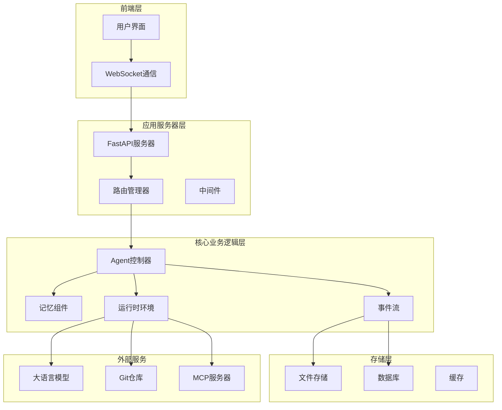

**图表来源**
- [openhands/server/app.py](file://openhands/server/app.py#L66-L97)
- [openhands/app_server/v1_router.py](file://openhands/app_server/v1_router.py#L1-L19)

**章节来源**
- [openhands/server/app.py](file://openhands/server/app.py#L1-L97)
- [README.md](file://README.md#L1-L185)

## 核心组件分析

### Agent控制器（AgentController）

Agent控制器是OpenHands系统的核心协调器，负责管理智能体的状态转换、动作执行和决策过程。它实现了复杂的多代理协作机制，支持代理委托和状态恢复功能。

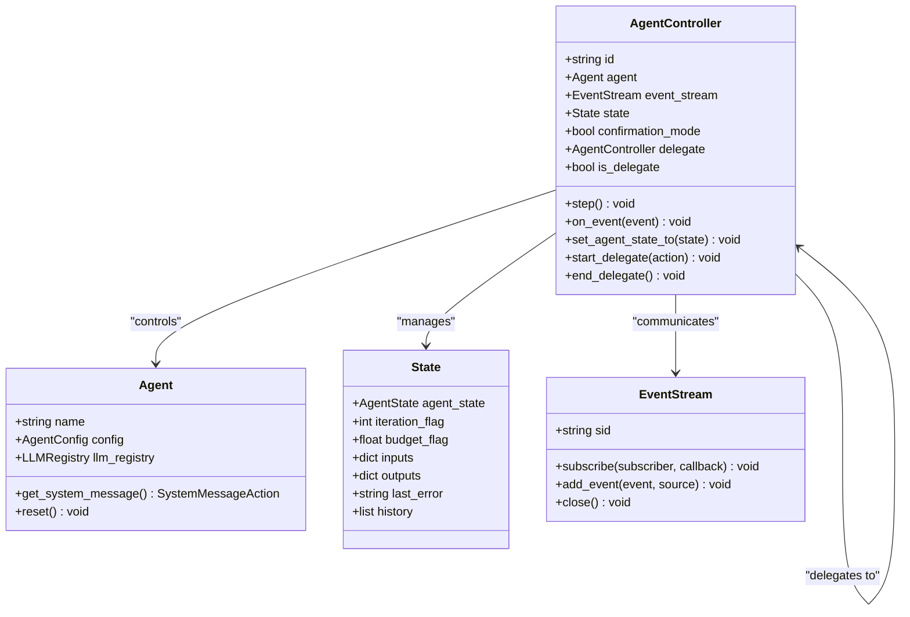

**图表来源**
- [openhands/controller/agent_controller.py](file://openhands/controller/agent_controller.py#L101-L800)

Agent控制器的主要职责包括：
- **状态管理**：跟踪智能体的执行状态，包括运行、暂停、完成、错误等状态
- **动作协调**：处理来自用户的操作请求和智能体的动作输出
- **代理委托**：支持子任务的代理分配和协作执行
- **异常处理**：实现优雅的错误恢复和状态重置机制

**章节来源**
- [openhands/controller/agent_controller.py](file://openhands/controller/agent_controller.py#L1-L800)

### 事件流（EventStream）

事件流是OpenHands系统的信息传输中枢，采用发布-订阅模式实现组件间的异步通信。它提供了强大的事件持久化、缓存机制和并发控制能力。

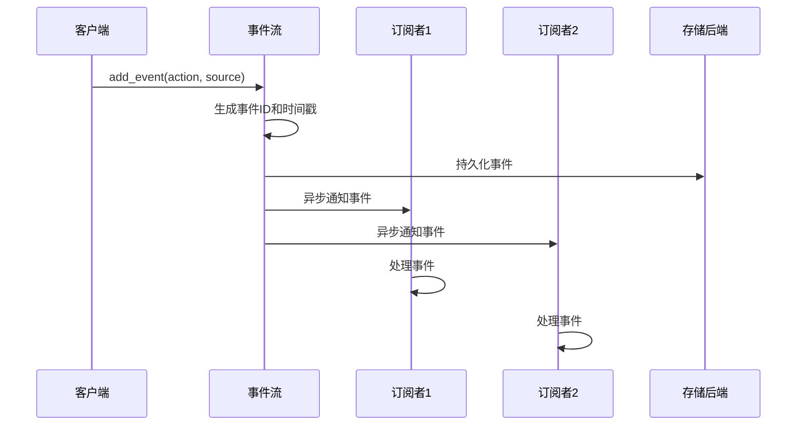

**图表来源**
- [openhands/events/stream.py](file://openhands/events/stream.py#L163-L292)

事件流的关键特性：
- **异步处理**：使用线程池和事件循环确保非阻塞的事件处理
- **持久化存储**：支持多种存储后端（本地文件、内存、S3等）
- **缓存优化**：采用页面缓存机制提升大量事件的读取性能
- **安全过滤**：自动隐藏敏感信息，保护用户隐私

**章节来源**
- [openhands/events/stream.py](file://openhands/events/stream.py#L1-L292)

### 运行时环境（Runtime）

运行时环境为智能体提供隔离的执行环境，支持多种部署方式和沙箱技术。它抽象了底层基础设施差异，为上层应用提供统一的操作接口。

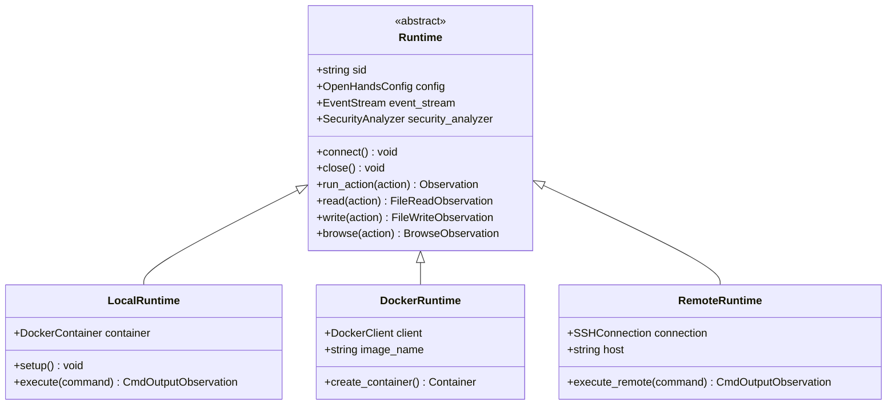

**图表来源**
- [openhands/runtime/base.py](file://openhands/runtime/base.py#L91-L800)

运行时环境的设计原则：
- **可插拔架构**：支持多种运行时实现，适应不同的部署需求
- **安全隔离**：提供进程级和网络级的安全隔离机制
- **资源管理**：动态分配和回收计算资源，避免资源泄漏
- **状态保持**：支持会话状态的持久化和恢复

**章节来源**
- [openhands/runtime/base.py](file://openhands/runtime/base.py#L1-L800)

### 内存管理（Memory）

内存组件负责智能体的知识管理和上下文维护，通过微代理系统提供丰富的领域知识和工具调用能力。

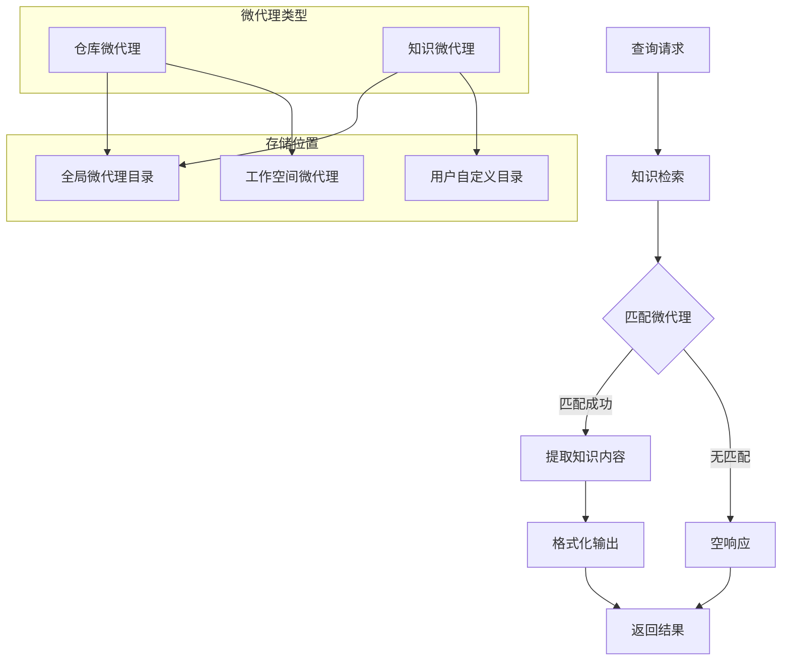

**图表来源**
- [openhands/memory/memory.py](file://openhands/memory/memory.py#L225-L388)

内存管理的核心功能：
- **知识检索**：基于关键词匹配的智能知识提取
- **微代理系统**：支持领域特定的自动化工具
- **上下文维护**：保存和恢复对话历史和项目信息
- **MCP集成**：与外部工具和服务的无缝集成

**章节来源**
- [openhands/memory/memory.py](file://openhands/memory/memory.py#L1-L388)

## 事件驱动架构

OpenHands采用高度解耦的事件驱动架构，所有组件通过事件进行通信，实现了系统的灵活性和可扩展性。

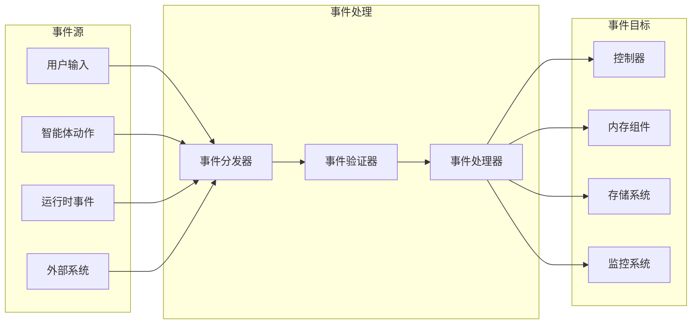

**图表来源**
- [openhands/events/stream.py](file://openhands/events/stream.py#L23-L31)

事件驱动架构的优势：
- **松耦合设计**：组件间通过事件解耦，降低系统复杂度
- **异步处理**：支持高并发和实时响应
- **可扩展性**：易于添加新的事件类型和处理逻辑
- **可观测性**：完整的事件追踪和审计能力

**章节来源**
- [openhands/events/stream.py](file://openhands/events/stream.py#L1-L292)

## 依赖注入与配置管理

OpenHands实现了完善的依赖注入框架和灵活的配置管理系统，支持运行时的组件替换和配置热更新。

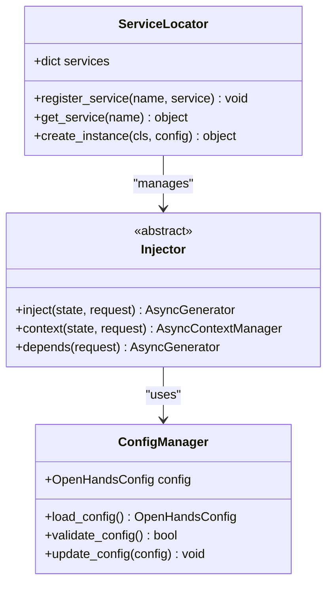

**图表来源**
- [openhands/app_server/services/injector.py](file://openhands/app_server/services/injector.py#L1-L34)

配置管理的关键特性：
- **层次化配置**：支持环境变量、配置文件、命令行参数的优先级覆盖
- **类型安全**：使用Pydantic模型确保配置的类型安全和验证
- **动态更新**：支持运行时配置的热更新而不影响服务可用性
- **环境适配**：自动检测和适配不同的运行环境

**章节来源**
- [openhands/core/config/__init__.py](file://openhands/core/config/__init__.py#L1-L60)
- [openhands/app_server/services/injector.py](file://openhands/app_server/services/injector.py#L1-L34)

## 数据流与生命周期

OpenHands的数据流从用户输入开始，经过多个处理阶段，最终产生执行结果。整个生命周期包含初始化、执行、监控和清理等阶段。

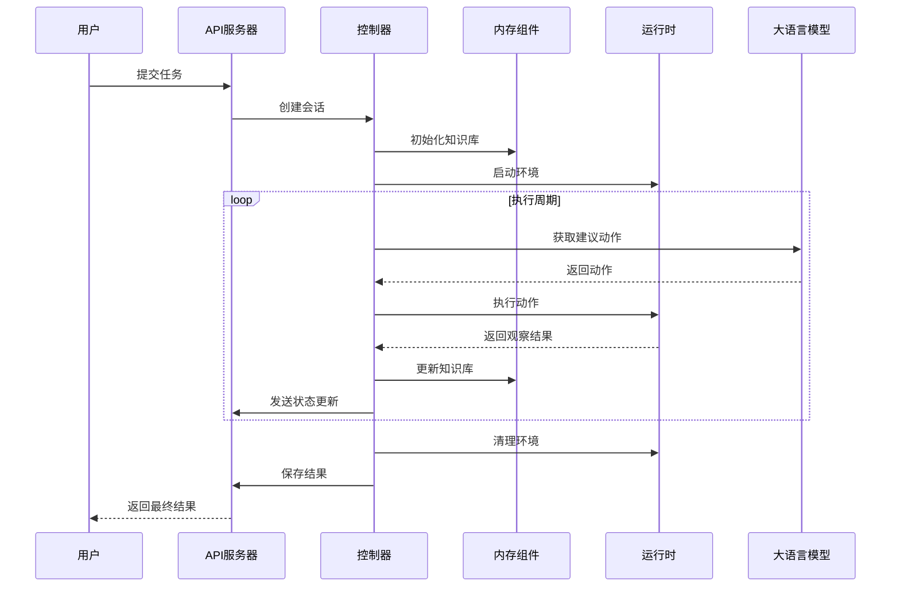

**图表来源**
- [openhands/core/main.py](file://openhands/core/main.py#L52-L311)
- [openhands/core/loop.py](file://openhands/core/loop.py#L11-L48)

数据流的关键节点：
- **输入验证**：确保用户输入的合法性和安全性
- **状态同步**：维护各组件间的一致性状态
- **错误传播**：建立清晰的错误处理和传播路径
- **结果聚合**：整合来自不同组件的执行结果

**章节来源**
- [openhands/core/main.py](file://openhands/core/main.py#L1-L388)
- [openhands/core/loop.py](file://openhands/core/loop.py#L1-L48)

## 微服务架构决策

OpenHands采用微服务架构，将系统拆分为独立的服务单元，每个服务专注于特定的功能领域。

| 组件 | 职责 | 部署方式 | 扩展策略 |
|------|------|----------|----------|
| 应用服务器 | HTTP API处理和路由 | 单实例或多实例 | 水平扩展 |
| 事件流服务 | 事件持久化和分发 | 独立服务 | 分片和复制 |
| 运行时服务 | 智能体执行环境 | 容器化部署 | 动态扩缩容 |
| 存储服务 | 数据持久化 | 多后端支持 | 主从复制 |

容器化部署架构：
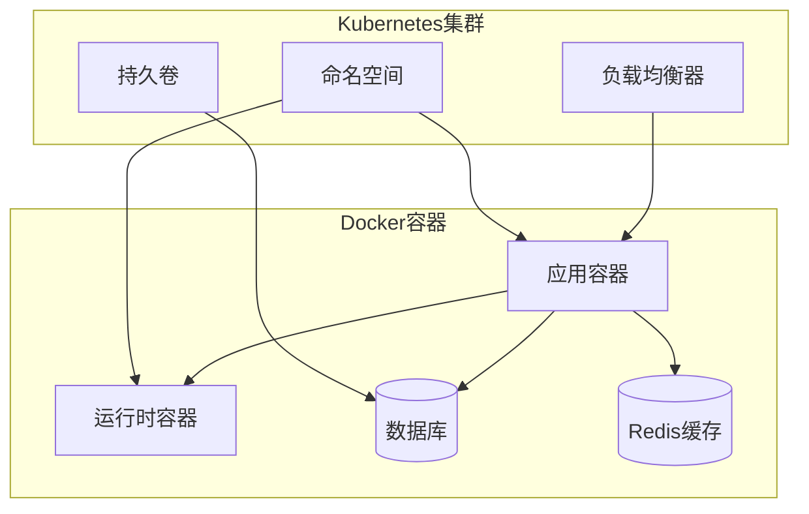

**图表来源**
- [containers/README.md](file://containers/README.md#L1-L13)

微服务架构的优势：
- **独立部署**：各服务可以独立开发、测试和部署
- **故障隔离**：单个服务故障不会影响整体系统
- **技术栈多样性**：支持不同的编程语言和框架
- **运维简化**：容器化和编排技术降低运维复杂度

**章节来源**
- [containers/README.md](file://containers/README.md#L1-L13)
- [README.md](file://README.md#L77-L98)

## 容错机制与错误处理

OpenHands实现了多层次的容错机制，确保系统在面对各种异常情况时能够保持稳定运行。

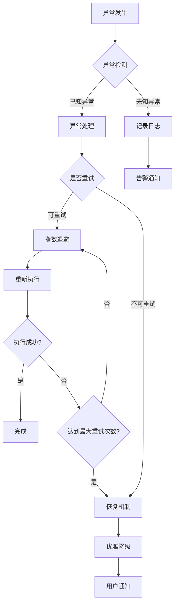

**图表来源**
- [openhands/mcp/error_collector.py](file://openhands/mcp/error_collector.py#L53-L78)

错误处理策略：
- **分类处理**：根据异常类型采用不同的处理策略
- **重试机制**：对临时性错误实施指数退避重试
- **熔断保护**：防止级联故障的发生
- **监控告警**：及时发现和报告系统异常

**章节来源**
- [openhands/mcp/error_collector.py](file://openhands/mcp/error_collector.py#L1-L78)

## 性能优化与可扩展性

OpenHands在多个层面实现了性能优化，确保系统能够处理大规模并发请求和复杂的工作负载。

### 缓存策略

| 缓存层级 | 类型 | 用途 | 生命周期 |
|----------|------|------|----------|
| 内存缓存 | 事件页面 | 高频访问的事件数据 | 会话级别 |
| 文件缓存 | 配置文件 | 减少磁盘I/O | 永久存储 |
| 数据库缓存 | 查询结果 | 优化数据库访问 | TTL控制 |
| CDN缓存 | 静态资源 | 加速前端加载 | 版本控制 |

### 并发优化

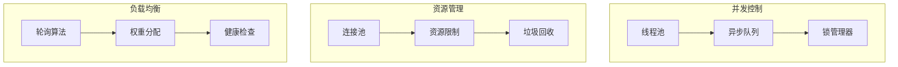

性能优化措施：
- **异步处理**：广泛使用async/await模式提升并发性能
- **连接复用**：数据库和HTTP客户端连接池减少建立开销
- **批量操作**：事件和文件操作的批量处理提升吞吐量
- **资源预分配**：关键资源的预分配避免运行时分配延迟

**章节来源**
- [openhands/storage/README.md](file://openhands/storage/README.md#L1-L128)

## 监控与可观测性

OpenHands提供了完整的监控和可观测性解决方案，帮助开发者和运维人员了解系统状态和性能指标。

### 监控指标

| 指标类别 | 具体指标 | 监控目的 | 告警阈值 |
|----------|----------|----------|----------|
| 系统指标 | CPU使用率、内存占用 | 资源监控 | >80% |
| 应用指标 | 请求响应时间、错误率 | 服务质量 | >5秒、>5% |
| 业务指标 | 任务成功率、并发数 | 业务健康度 | <95%、>100 |
| 自定义指标 | 微代理调用次数、缓存命中率 | 性能优化 | <80% |

### 日志体系

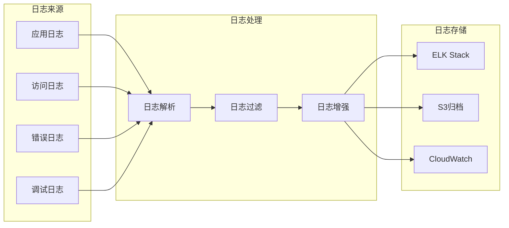

可观测性特性：
- **结构化日志**：统一的日志格式便于分析和查询
- **分布式追踪**：跨服务的请求链路追踪
- **指标收集**：实时的系统和业务指标监控
- **告警机制**：基于规则的智能告警和通知

## 总结

OpenHands代表了现代AI驱动软件开发平台的先进设计理念。其核心架构具有以下突出特点：

### 技术优势
- **事件驱动**：高度解耦的架构设计，支持灵活的扩展和定制
- **微服务化**：模块化的服务架构，便于独立开发和部署
- **容器化**：标准化的容器化部署，确保环境一致性
- **可观测性**：完整的监控和日志体系，支持问题快速定位

### 架构创新
- **多代理协作**：支持智能体间的协作和委托机制
- **运行时抽象**：统一的运行时接口，支持多种部署方式
- **知识管理**：智能化的记忆和知识检索系统
- **安全隔离**：多层次的安全防护机制

### 可扩展性
- **水平扩展**：支持基于负载的自动扩缩容
- **插件化**：丰富的插件和扩展点
- **云原生**：完全兼容云原生生态系统

OpenHands的架构设计不仅满足了当前的功能需求，更为未来的功能扩展和技术演进奠定了坚实的基础。这种前瞻性的架构设计使其能够在快速变化的技术环境中保持竞争力和创新活力。