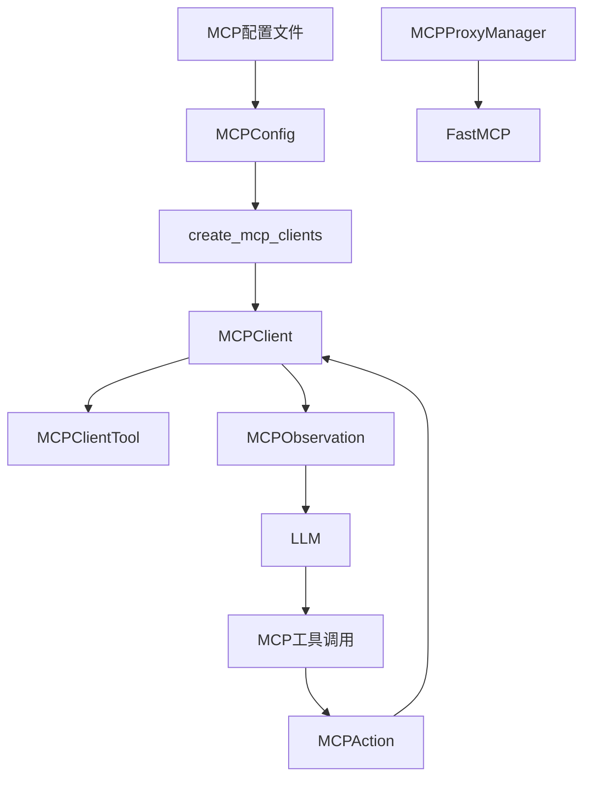
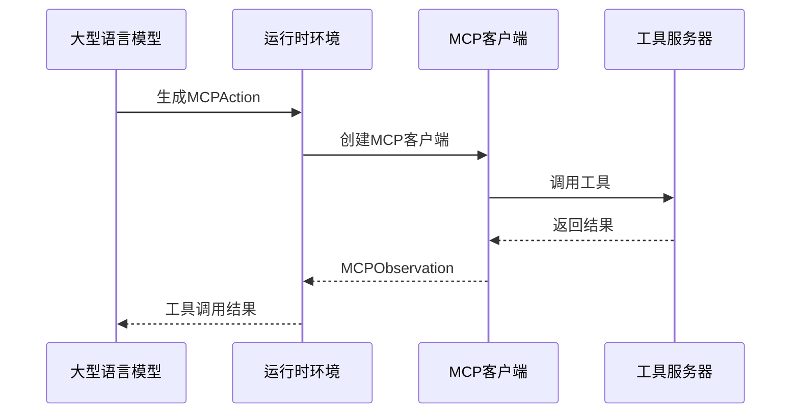
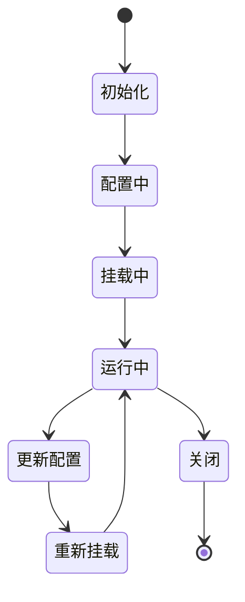
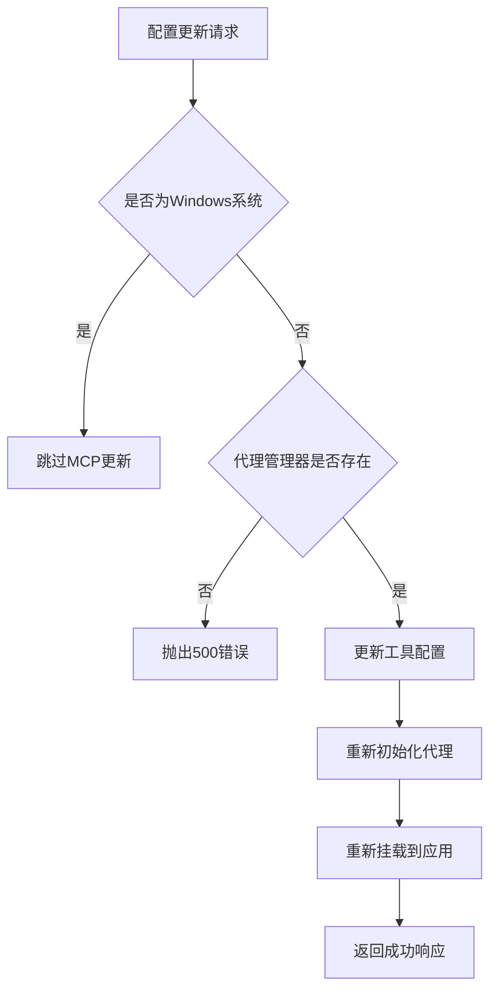
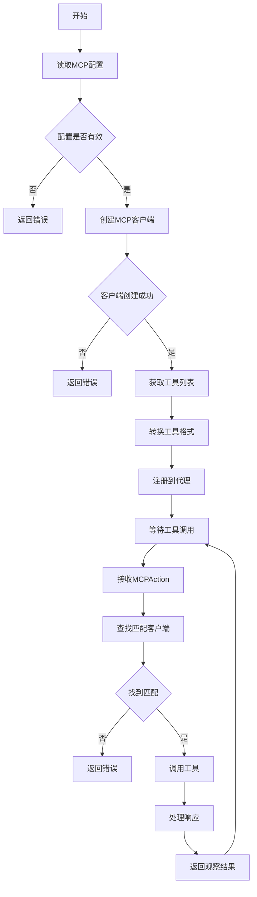
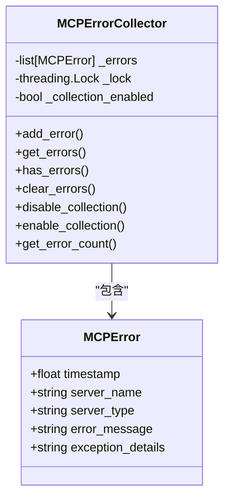

# MCP代理集成

<cite>
**本文档中引用的文件**   
- [mcp_config.py](file://openhands/core/config/mcp_config.py)
- [client.py](file://openhands/mcp/client.py)
- [utils.py](file://openhands/mcp/utils.py)
- [tool.py](file://openhands/mcp/tool.py)
- [error_collector.py](file://openhands/mcp/error_collector.py)
- [manager.py](file://openhands/runtime/mcp/proxy/manager.py)
- [action_execution_server.py](file://openhands/runtime/action_execution_server.py)
- [cli_runtime.py](file://openhands/runtime/impl/cli/cli_runtime.py)
</cite>

## 目录
1. [简介](#简介)
2. [MCP代理架构设计](#mcp代理架构设计)
3. [运行时工具调用机制](#运行时工具调用机制)
4. [代理管理器生命周期管理](#代理管理器生命周期管理)
5. [MCP配置文件结构](#mcp配置文件结构)
6. [安全策略与动态更新](#安全策略与动态更新)
7. [工具注册、发现与调用流程](#工具注册发现与调用流程)
8. [错误处理与性能监控](#错误处理与性能监控)

## 简介
MCP（Model Context Protocol）代理集成是OpenHands系统的核心组件，为大型语言模型（LLM）提供工具调用能力。该系统通过MCP协议实现LLM与外部工具的无缝集成，使AI代理能够执行复杂的任务。MCP代理在运行时环境中作为桥梁，连接LLM与各种工具服务器，支持SSE、SHTTP和stdio三种连接方式。本文档详细阐述MCP代理的架构设计、工作原理、配置管理、安全策略以及错误处理机制。

## MCP代理架构设计
MCP代理架构采用分层设计，包含配置管理层、客户端管理层、工具管理层和代理管理层。配置管理层负责解析和验证MCP配置文件，客户端管理层管理与MCP服务器的连接，工具管理层负责工具的注册和发现，代理管理层则负责MCP代理实例的生命周期管理。



**图表来源**
- [mcp_config.py](file://openhands/core/config/mcp_config.py)
- [client.py](file://openhands/mcp/client.py)
- [tool.py](file://openhands/mcp/tool.py)
- [manager.py](file://openhands/runtime/mcp/proxy/manager.py)

**章节来源**
- [mcp_config.py](file://openhands/core/config/mcp_config.py#L222-L332)
- [client.py](file://openhands/mcp/client.py#L24-L179)

## 运行时工具调用机制
MCP代理在运行时环境中为LLM提供工具调用能力。当LLM需要执行特定任务时，会生成MCPAction请求，该请求包含工具名称和参数。运行时系统通过create_mcp_clients函数创建MCP客户端，然后使用call_tool_mcp函数调用相应的工具。工具调用结果以MCPObservation形式返回给LLM，形成完整的交互循环。



**图表来源**
- [cli_runtime.py](file://openhands/runtime/impl/cli/cli_runtime.py#L701-L736)
- [utils.py](file://openhands/mcp/utils.py#L212-L287)

**章节来源**
- [cli_runtime.py](file://openhands/runtime/impl/cli/cli_runtime.py#L701-L736)
- [utils.py](file://openhands/mcp/utils.py#L212-L287)

## 代理管理器生命周期管理
MCPProxyManager负责管理MCP代理实例的完整生命周期，包括初始化、配置、挂载和关闭。代理管理器采用惰性初始化策略，仅在需要时创建代理实例。在Windows系统上，MCP功能被禁用，以避免兼容性问题。代理管理器支持动态更新配置，可以在运行时重新配置工具服务器并重新挂载代理。



**图表来源**
- [manager.py](file://openhands/runtime/mcp/proxy/manager.py#L22-L158)
- [action_execution_server.py](file://openhands/runtime/action_execution_server.py#L715-L744)

**章节来源**
- [manager.py](file://openhands/runtime/mcp/proxy/manager.py#L22-L158)
- [action_execution_server.py](file://openhands/runtime/action_execution_server.py#L715-L744)

## MCP配置文件结构
MCP配置文件采用分层结构，支持三种类型的服务器配置：SSE服务器、SHTTP服务器和stdio服务器。每种服务器类型都有特定的配置参数，如URL、API密钥、超时设置等。配置文件支持从字符串URL自动转换为完整的服务器配置对象，并进行严格的格式验证。

```mermaid
erDiagram
MCPConfig {
list[MCPSSEServerConfig] sse_servers
list[MCPStdioServerConfig] stdio_servers
list[MCPSHTTPServerConfig] shttp_servers
}
MCPSSEServerConfig {
string url
string api_key
}
MCPStdioServerConfig {
string name
string command
list[string] args
map[string,string] env
}
MCPSHTTPServerConfig {
string url
string api_key
int timeout
}
MCPConfig ||--o{ MCPSSEServerConfig : 包含
MCPConfig ||--o{ MCPStdioServerConfig : 包含
MCPConfig ||--o{ MCPSHTTPServerConfig : 包含
```

**图表来源**
- [mcp_config.py](file://openhands/core/config/mcp_config.py#L46-L234)

**章节来源**
- [mcp_config.py](file://openhands/core/config/mcp_config.py#L46-L234)

## 安全策略与动态更新
MCP系统实施多层次安全策略，包括API密钥认证、连接超时控制和错误收集机制。代理管理器支持动态更新配置，允许在运行时添加或移除工具服务器。错误收集器（MCPErrorCollector）采用线程安全设计，能够捕获和存储MCP相关的错误信息，便于后续分析和调试。



**图表来源**
- [action_execution_server.py](file://openhands/runtime/action_execution_server.py#L838-L858)
- [error_collector.py](file://openhands/mcp/error_collector.py#L19-L78)

**章节来源**
- [action_execution_server.py](file://openhands/runtime/action_execution_server.py#L838-L858)
- [error_collector.py](file://openhands/mcp/error_collector.py#L19-L78)

## 工具注册、发现与调用流程
MCP工具的注册、发现和调用遵循标准化流程。首先，系统通过fetch_mcp_tools_from_config函数从配置中获取工具列表。然后，使用create_mcp_clients函数创建MCP客户端并连接到工具服务器。最后，通过call_tool_mcp函数调用具体工具。整个流程支持超时处理和错误恢复机制。



**图表来源**
- [utils.py](file://openhands/mcp/utils.py#L64-L339)
- [client.py](file://openhands/mcp/client.py#L24-L179)

**章节来源**
- [utils.py](file://openhands/mcp/utils.py#L64-L339)
- [client.py](file://openhands/mcp/client.py#L24-L179)

## 错误处理与性能监控
MCP系统实现了全面的错误处理和性能监控机制。错误收集器（MCPErrorCollector）能够捕获连接失败、超时、认证错误等各种异常情况，并记录详细的错误信息。系统支持设置工具调用超时，防止长时间阻塞。性能监控通过日志记录关键操作的执行时间和状态，便于性能分析和优化。



**图表来源**
- [error_collector.py](file://openhands/mcp/error_collector.py#L8-L78)
- [utils.py](file://openhands/mcp/utils.py#L262-L277)

**章节来源**
- [error_collector.py](file://openhands/mcp/error_collector.py#L8-L78)
- [utils.py](file://openhands/mcp/utils.py#L262-L277)