# 浏览器环境集成

<cite>
**本文档中引用的文件**   
- [browser_env.py](file://openhands/runtime/browser/browser_env.py)
- [base64.py](file://openhands/runtime/browser/base64.py)
- [utils.py](file://openhands/runtime/browser/utils.py)
- [browser.py](file://openhands/agenthub/codeact_agent/tools/browser.py)
- [runtime_build.py](file://openhands/runtime/utils/runtime_build.py)
- [browser-store.ts](file://frontend/src/stores/browser-store.ts)
- [browser.tsx](file://frontend/src/components/features/browser/browser.tsx)
- [test_browsergym_envs.py](file://tests/runtime/test_browsergym_envs.py)
- [test_browsing.py](file://tests/runtime/test_browsing.py)
</cite>

## 目录
1. [简介](#简介)
2. [项目结构](#项目结构)
3. [核心组件](#核心组件)
4. [架构概述](#架构概述)
5. [详细组件分析](#详细组件分析)
6. [依赖分析](#依赖分析)
7. [性能考虑](#性能考虑)
8. [故障排除指南](#故障排除指南)
9. [结论](#结论)

## 简介
本文档全面描述了OpenHands中浏览器自动化功能的实现。文档详细解释了BrowserEnv类的设计原理和核心功能，包括页面导航、元素交互和内容提取。同时涵盖了浏览器会话管理、资源清理和安全隔离机制。文档还提供了浏览器自动化脚本的编写指南和最佳实践，包括处理动态内容、等待策略和错误恢复。

## 项目结构
OpenHands的浏览器环境集成主要分布在以下几个目录中：
- `openhands/runtime/browser/`: 包含浏览器环境的核心实现，包括BrowserEnv类、Base64编码工具和浏览器工具函数
- `openhands/agenthub/codeact_agent/tools/`: 包含浏览器工具的定义和可用操作
- `frontend/src/components/features/browser/`: 包含前端浏览器界面组件
- `tests/runtime/`: 包含浏览器功能的测试用例

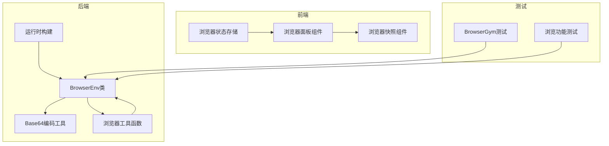

**Diagram sources**
- [browser_env.py](file://openhands/runtime/browser/browser_env.py)
- [base64.py](file://openhands/runtime/browser/base64.py)
- [utils.py](file://openhands/runtime/browser/utils.py)
- [runtime_build.py](file://openhands/runtime/utils/runtime_build.py)
- [browser-store.ts](file://frontend/src/stores/browser-store.ts)
- [browser.tsx](file://frontend/src/components/features/browser/browser.tsx)
- [test_browsergym_envs.py](file://tests/runtime/test_browsergym_envs.py)
- [test_browsing.py](file://tests/runtime/test_browsing.py)

**Section sources**
- [browser_env.py](file://openhands/runtime/browser/browser_env.py)
- [base64.py](file://openhands/runtime/browser/base64.py)
- [utils.py](file://openhands/runtime/browser/utils.py)
- [runtime_build.py](file://openhands/runtime/utils/runtime_build.py)
- [browser-store.ts](file://frontend/src/stores/browser-store.ts)
- [browser.tsx](file://frontend/src/components/features/browser/browser.tsx)
- [test_browsergym_envs.py](file://tests/runtime/test_browsergym_envs.py)
- [test_browsing.py](file://tests/runtime/test_browsing.py)

## 核心组件
OpenHands的浏览器环境集成由多个核心组件构成，主要包括BrowserEnv类、Base64编码工具、浏览器工具函数和前端界面组件。这些组件协同工作，实现了完整的浏览器自动化功能。

**Section sources**
- [browser_env.py](file://openhands/runtime/browser/browser_env.py)
- [base64.py](file://openhands/runtime/browser/base64.py)
- [utils.py](file://openhands/runtime/browser/utils.py)
- [browser-store.ts](file://frontend/src/stores/browser-store.ts)

## 架构概述
OpenHands的浏览器环境集成采用多进程架构，通过BrowserEnv类封装浏览器功能，提供安全的浏览器自动化能力。系统通过Base64编码在前后端之间传输浏览器截图，确保数据的安全性和兼容性。

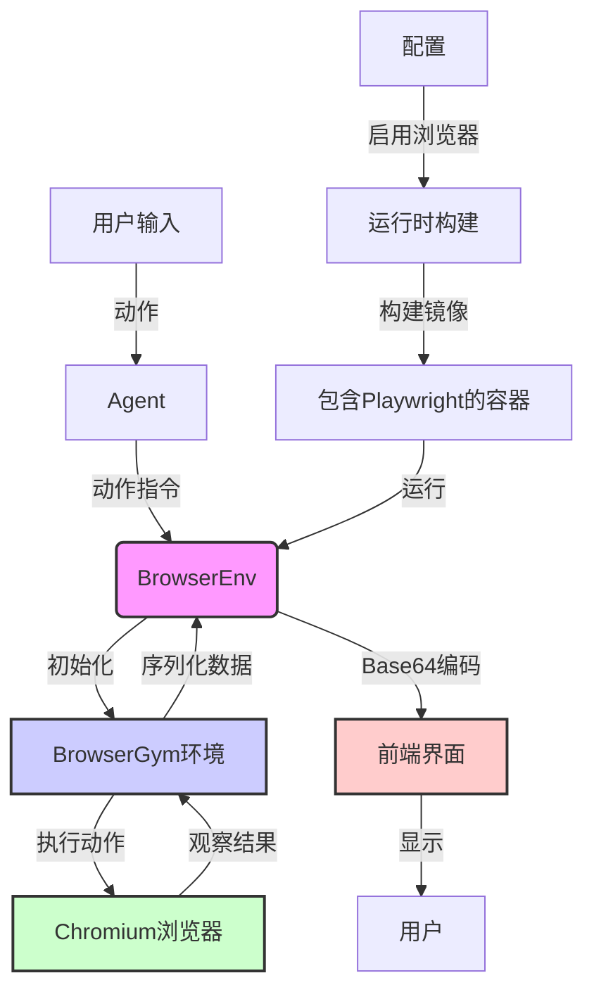

**Diagram sources**
- [browser_env.py](file://openhands/runtime/browser/browser_env.py)
- [base64.py](file://openhands/runtime/browser/base64.py)
- [utils.py](file://openhands/runtime/browser/utils.py)
- [runtime_build.py](file://openhands/runtime/utils/runtime_build.py)
- [browser-store.ts](file://frontend/src/stores/browser-store.ts)
- [browser.tsx](file://frontend/src/components/features/browser/browser.tsx)

## 详细组件分析

### BrowserEnv类分析
BrowserEnv类是OpenHands浏览器功能的核心，负责管理浏览器会话、执行操作和处理观察结果。

#### BrowserEnv类设计
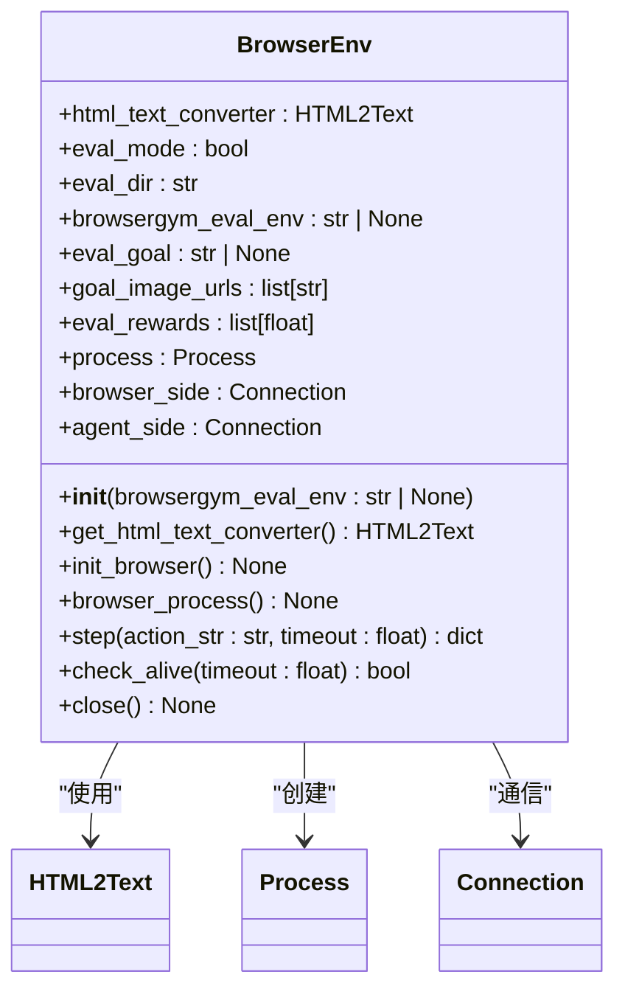

**Diagram sources**
- [browser_env.py](file://openhands/runtime/browser/browser_env.py)

#### 浏览器操作流程
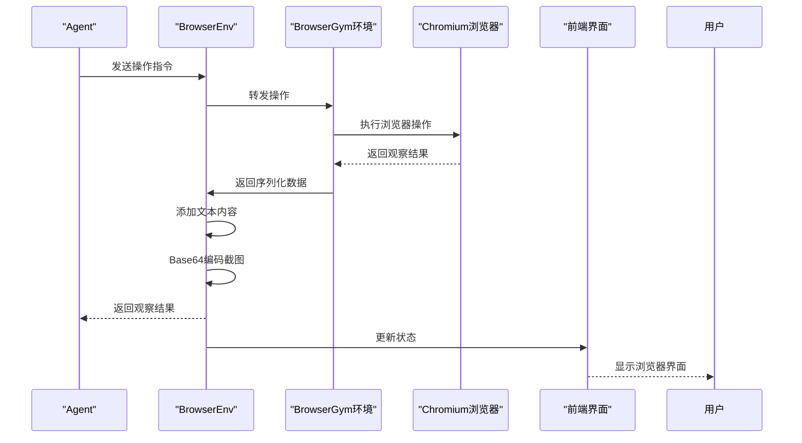

**Diagram sources**
- [browser_env.py](file://openhands/runtime/browser/browser_env.py)
- [utils.py](file://openhands/runtime/browser/utils.py)
- [browser-store.ts](file://frontend/src/stores/browser-store.ts)
- [browser.tsx](file://frontend/src/components/features/browser/browser.tsx)

#### 浏览器会话管理流程
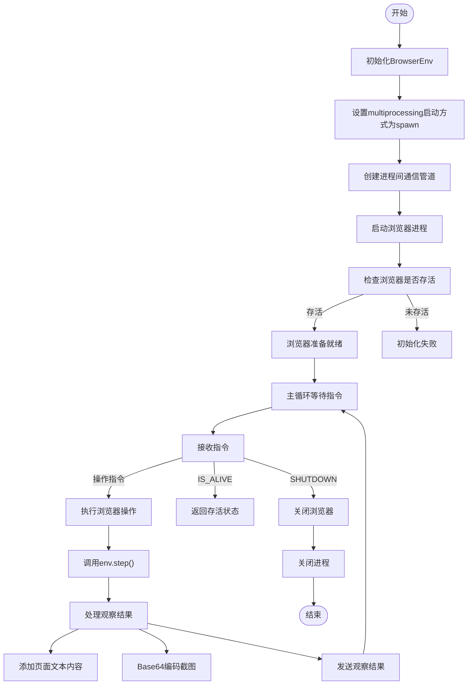

**Diagram sources**
- [browser_env.py](file://openhands/runtime/browser/browser_env.py)

### Base64编码分析
Base64编码在OpenHands的浏览器功能中扮演着关键角色，主要用于在前后端之间安全传输浏览器截图。

#### Base64编码工具
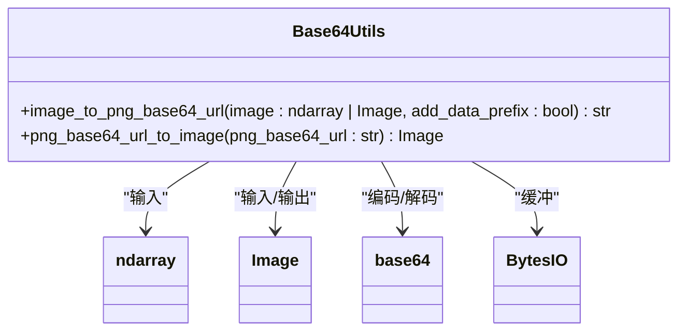

**Diagram sources**
- [base64.py](file://openhands/runtime/browser/base64.py)

#### Base64编码流程
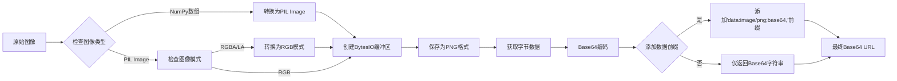

**Diagram sources**
- [base64.py](file://openhands/runtime/browser/base64.py)

### 浏览器工具分析
浏览器工具为Agent提供了与网页交互的能力，包括导航、表单填写和元素操作等功能。

#### 浏览器工具功能
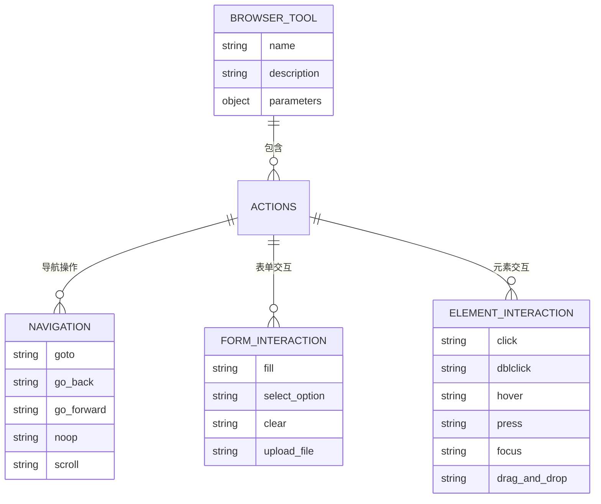

**Diagram sources**
- [browser.py](file://openhands/agenthub/codeact_agent/tools/browser.py)

#### 浏览器工具操作流程
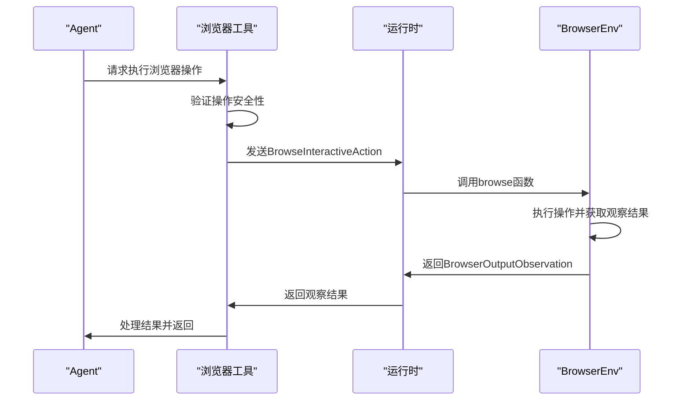

**Diagram sources**
- [browser.py](file://openhands/agenthub/codeact_agent/tools/browser.py)
- [utils.py](file://openhands/runtime/browser/utils.py)
- [browser_env.py](file://openhands/runtime/browser/browser_env.py)

### 前端界面分析
前端界面负责显示浏览器内容，包括URL和截图，并提供用户交互功能。

#### 前端状态管理
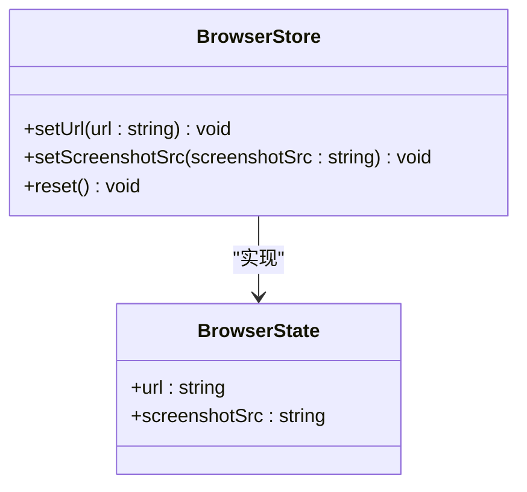

**Diagram sources**
- [browser-store.ts](file://frontend/src/stores/browser-store.ts)

#### 前端组件结构
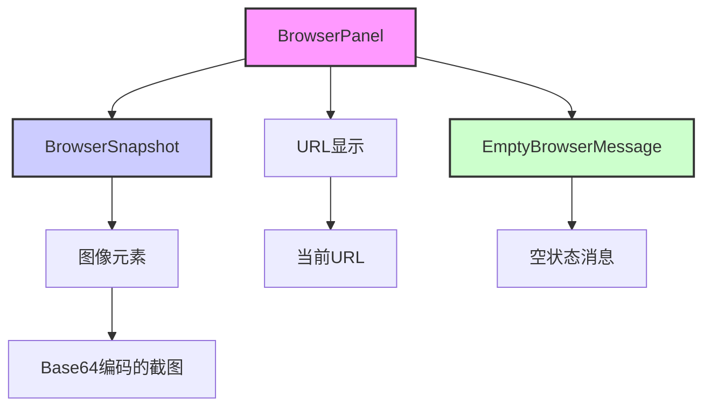

**Diagram sources**
- [browser.tsx](file://frontend/src/components/features/browser/browser.tsx)
- [browser-snapshot.tsx](file://frontend/src/components/features/browser/browser-snapshot.tsx)
- [empty-browser-message.tsx](file://frontend/src/components/features/browser/empty-browser-message.tsx)

## 依赖分析
OpenHands的浏览器环境集成功能依赖于多个外部库和内部组件，形成了复杂的依赖关系网络。

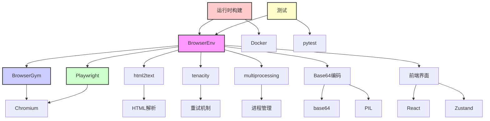

**Diagram sources**
- [browser_env.py](file://openhands/runtime/browser/browser_env.py)
- [base64.py](file://openhands/runtime/browser/base64.py)
- [utils.py](file://openhands/runtime/browser/utils.py)
- [runtime_build.py](file://openhands/runtime/utils/runtime_build.py)
- [test_browsergym_envs.py](file://tests/runtime/test_browsergym_envs.py)
- [test_browsing.py](file://tests/runtime/test_browsing.py)

## 性能考虑
在设计和使用OpenHands的浏览器自动化功能时，需要考虑以下性能因素：

1. **进程开销**：BrowserEnv使用独立的进程运行浏览器，这会带来一定的内存和CPU开销
2. **Base64编码开销**：截图的Base64编码和解码需要消耗计算资源，特别是对于大尺寸截图
3. **网络传输**：Base64编码的截图数据量较大，可能影响前后端通信性能
4. **内存使用**：浏览器进程本身会占用较多内存，特别是在打开多个页面时
5. **启动时间**：浏览器环境的初始化需要一定时间，影响响应速度

为了优化性能，建议：
- 合理控制截图频率，避免不必要的截图操作
- 使用适当的截图尺寸，平衡清晰度和性能
- 在不需要浏览器功能时及时关闭BrowserEnv
- 考虑使用缓存机制减少重复操作

## 故障排除指南
在使用OpenHands的浏览器功能时，可能会遇到以下常见问题及解决方案：

**Section sources**
- [browser_env.py](file://openhands/runtime/browser/browser_env.py)
- [utils.py](file://openhands/runtime/browser/utils.py)
- [test_browsergym_envs.py](file://tests/runtime/test_browsergym_envs.py)
- [test_browsing.py](file://tests/runtime/test_browsing.py)

### 浏览器初始化失败
**问题**：BrowserEnv初始化失败，无法启动浏览器进程
**可能原因**：
- 系统不支持（如Windows系统）
- 缺少必要的依赖库
- 内存不足
- 权限问题

**解决方案**：
1. 检查操作系统是否支持（目前不支持Windows）
2. 确保已安装所有必要的依赖
3. 检查系统资源是否充足
4. 以适当权限运行程序

### Base64编码错误
**问题**：截图的Base64编码出现问题，导致前端无法显示
**可能原因**：
- 图像数据损坏
- 编码过程中出现异常
- 数据传输不完整

**解决方案**：
1. 检查图像数据的完整性
2. 确保编码过程正确处理异常
3. 验证数据传输的完整性
4. 实现编码失败时的备用方案

### 浏览器操作超时
**问题**：浏览器操作执行超时
**可能原因**：
- 网络延迟
- 页面加载缓慢
- 操作过于复杂
- 浏览器响应慢

**解决方案**：
1. 增加操作超时时间
2. 优化操作序列，减少复杂操作
3. 实现重试机制
4. 添加适当的等待操作

### 内存泄漏
**问题**：长时间运行后内存使用持续增长
**可能原因**：
- 浏览器进程未正确关闭
- 缓存未清理
- 对象引用未释放

**解决方案**：
1. 确保在使用完毕后正确关闭BrowserEnv
2. 实现定期清理机制
3. 检查对象引用，避免内存泄漏

## 结论
OpenHands的浏览器环境集成提供了一套完整的浏览器自动化解决方案，通过BrowserEnv类封装了浏览器功能，实现了安全的页面导航、元素交互和内容提取。系统采用多进程架构，通过Base64编码在前后端之间传输浏览器截图，确保了数据的安全性和兼容性。

核心设计特点包括：
1. **模块化设计**：将浏览器功能封装在独立的BrowserEnv类中，便于维护和扩展
2. **安全隔离**：使用独立进程运行浏览器，避免对主程序造成影响
3. **标准化接口**：通过统一的API提供浏览器操作，简化使用
4. **错误处理**：完善的错误处理机制，确保系统的稳定性
5. **资源管理**：有效的会话管理和资源清理，防止资源泄漏

在实际使用中，建议遵循最佳实践，合理使用浏览器功能，注意性能优化和错误处理，以充分发挥OpenHands浏览器自动化能力的优势。