# Docker运行时

<cite>
**本文档引用的文件**
- [docker_runtime.py](file://openhands/runtime/impl/docker/docker_runtime.py)
- [docker_sandbox_service.py](file://openhands/app_server/sandbox/docker_sandbox_service.py)
- [docker.py](file://openhands/runtime/builder/docker.py)
- [runtime_build.py](file://openhands/runtime/utils/runtime_build.py)
- [log_streamer.py](file://openhands/runtime/utils/log_streamer.py)
- [docker.md](file://microagents/docker.md)
</cite>

## 目录
1. [简介](#简介)
2. [容器生命周期管理](#容器生命周期管理)
3. [网络配置](#网络配置)
4. [卷挂载](#卷挂载)
5. [资源限制](#资源限制)
6. [Docker API调用方式](#docker-api调用方式)
7. [镜像拉取策略](#镜像拉取策略)
8. [容器状态同步机制](#容器状态同步机制)
9. [健康检查](#健康检查)
10. [日志收集](#日志收集)
11. [性能监控](#性能监控)
12. [高级配置选项](#高级配置选项)
13. [故障排查指南](#故障排查指南)
14. [性能优化建议](#性能优化建议)
15. [多租户环境中的安全隔离实践](#多租户环境中的安全隔离实践)

## 简介
Docker运行时是OpenHands项目的核心组件，负责创建和管理容器化执行环境。它通过Docker API与Docker守护进程交互，实现容器的生命周期管理、网络配置、卷挂载和资源限制等功能。Docker运行时为代理提供了一个安全、隔离的沙箱环境，用于执行各种任务和操作。

**Section sources**
- [docker_runtime.py](file://openhands/runtime/impl/docker/docker_runtime.py#L1-L766)
- [README.md](file://openhands/runtime/README.md#L1-L162)

## 容器生命周期管理
Docker运行时通过Docker API管理容器的完整生命周期，包括创建、启动、暂停、恢复和删除等操作。容器生命周期管理的核心是`DockerRuntime`类，它负责初始化、连接、暂停和恢复容器。

容器的创建和启动过程如下：
1. 检查运行时容器镜像是否存在，如果不存在则构建
2. 初始化Docker客户端
3. 处理卷挂载和端口映射
4. 配置环境变量
5. 启动容器

容器的暂停和恢复通过`pause()`和`resume()`方法实现。暂停操作会停止容器，但保留其状态和环境变量，以便后续恢复。恢复操作会重新启动已暂停的容器，并等待其完全启动。

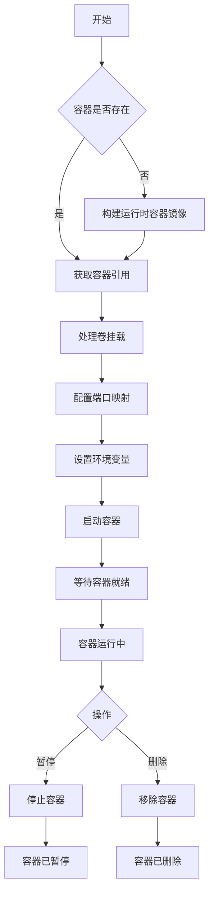

**Diagram sources**
- [docker_runtime.py](file://openhands/runtime/impl/docker/docker_runtime.py#L391-L533)
- [docker_runtime.py](file://openhands/runtime/impl/docker/docker_runtime.py#L717-L744)

**Section sources**
- [docker_runtime.py](file://openhands/runtime/impl/docker/docker_runtime.py#L75-L766)

## 网络配置
Docker运行时通过端口映射和网络模式配置实现容器的网络访问。网络配置主要涉及执行服务器端口、VSCode端口和应用端口的分配与映射。

运行时定义了多个端口范围：
- 执行服务器端口范围：30000-39999
- VSCode端口范围：40000-49999
- 应用端口范围1：50000-54999
- 应用端口范围2：55000-59999

在Windows或WSL2环境中，这些端口范围会相应调整以避免冲突。端口分配使用文件锁机制防止竞争条件，确保多个工作进程不会分配相同的端口。

当使用主机网络模式时，容器会共享主机的网络命名空间，这在某些特定场景下很有用，但需要注意平台兼容性。

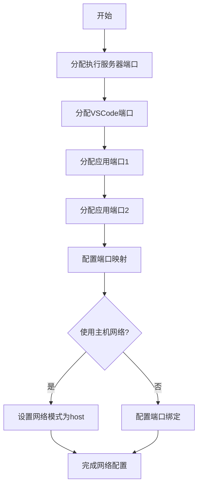

**Diagram sources**
- [docker_runtime.py](file://openhands/runtime/impl/docker/docker_runtime.py#L45-L54)
- [docker_runtime.py](file://openhands/runtime/impl/docker/docker_runtime.py#L396-L458)

**Section sources**
- [docker_runtime.py](file://openhands/runtime/impl/docker/docker_runtime.py#L391-L458)

## 卷挂载
Docker运行时支持多种卷挂载方式，包括绑定挂载、命名卷和覆盖挂载。卷挂载配置通过`sandbox.volumes`参数指定，支持逗号分隔的多个挂载点。

对于绑定挂载，运行时会处理绝对路径和相对路径。绝对路径会被转换为绝对路径，而相对路径则被视为命名卷。挂载模式默认为读写（rw），也可以指定为只读（ro）。

覆盖挂载是一种特殊的挂载方式，它使用overlay文件系统提供读写分离。底层目录（lowerdir）是只读的，而上层目录（upperdir）和工作目录（workdir）是每个容器独有的，实现写时复制（copy-on-write）功能。

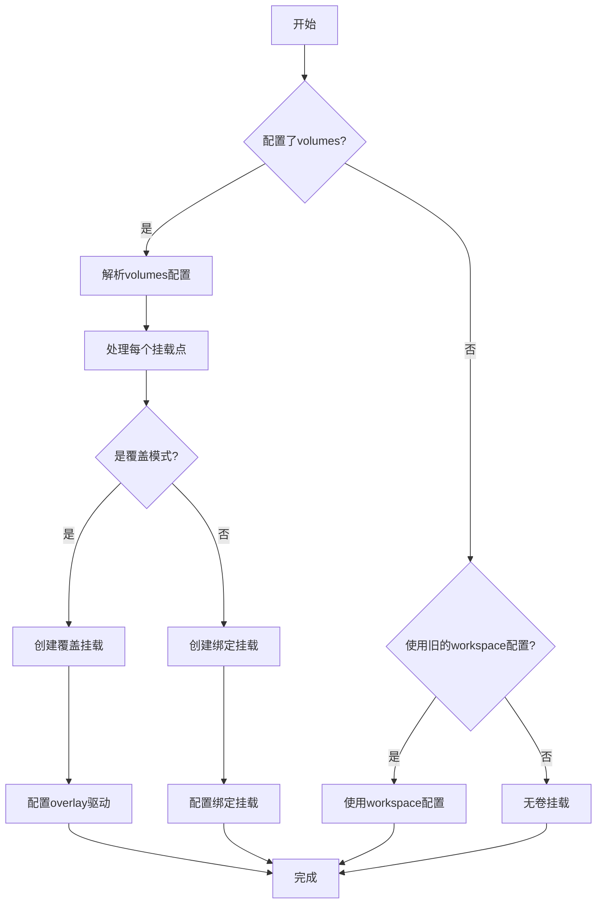

**Diagram sources**
- [docker_runtime.py](file://openhands/runtime/impl/docker/docker_runtime.py#L261-L304)
- [docker_runtime.py](file://openhands/runtime/impl/docker/docker_runtime.py#L324-L388)

**Section sources**
- [docker_runtime.py](file://openhands/runtime/impl/docker/docker_runtime.py#L261-L388)

## 资源限制
Docker运行时支持对容器的CPU和内存资源进行限制。资源限制通过`docker_runtime_kwargs`配置参数实现，允许设置CPU周期、CPU配额、内存限制等。

内存限制配置包括：
- `mem_limit`: 内存限制，如'4G'表示4GB
- `memswap_limit`: 交换内存限制，设为'0'表示禁用交换
- `mem_swappiness`: 内存交换倾向，设为0表示禁用交换
- `oom_kill_disable`: OOM（内存不足）终止器，设为False表示启用

CPU限制配置包括：
- `cpu_period`: CPU周期，单位为微秒
- `cpu_quota`: CPU配额，表示在每个周期内可用的CPU时间

这些资源限制在容器创建时通过Docker API传递给Docker守护进程，确保容器不会消耗超过指定的资源。

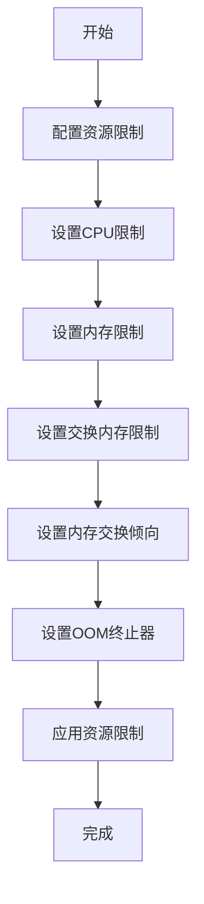

**Diagram sources**
- [docker_runtime.py](file://openhands/runtime/impl/docker/docker_runtime.py#L47-L53)
- [test_runtime_resource.py](file://tests/runtime/test_runtime_resource.py#L47-L53)

**Section sources**
- [docker_runtime.py](file://openhands/runtime/impl/docker/docker_runtime.py#L518-L532)
- [test_runtime_resource.py](file://tests/runtime/test_runtime_resource.py#L41-L76)

## Docker API调用方式
Docker运行时通过docker-py库与Docker守护进程交互。API调用主要通过`docker.DockerClient`实例进行，该实例通过`docker.from_env()`方法创建，使用环境变量中的Docker配置。

关键的API调用包括：
- `containers.run()`: 创建并启动容器
- `containers.get()`: 获取容器引用
- `containers.list()`: 列出容器
- `images.get()`: 获取镜像
- `images.build()`: 构建镜像
- `api.pull()`: 拉取镜像

API调用通常包装在异常处理中，以处理连接错误、超时和权限问题。对于长时间运行的操作，如镜像构建和拉取，使用流式API获取进度信息。

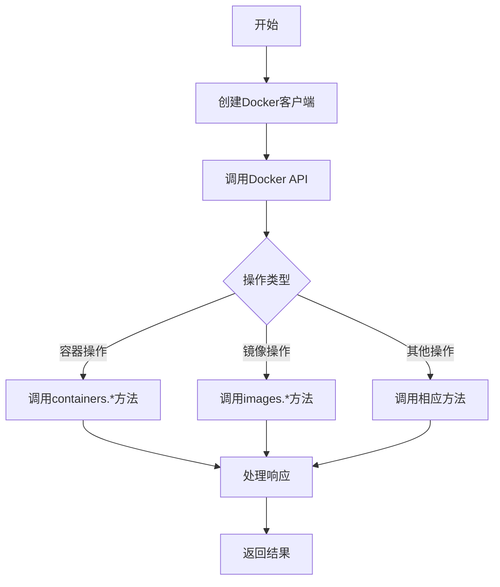

**Diagram sources**
- [docker_runtime.py](file://openhands/runtime/impl/docker/docker_runtime.py#L251-L259)
- [docker_runtime.py](file://openhands/runtime/impl/docker/docker_runtime.py#L518-L533)

**Section sources**
- [docker_runtime.py](file://openhands/runtime/impl/docker/docker_runtime.py#L251-L259)
- [docker.py](file://openhands/runtime/builder/docker.py#L289-L295)

## 镜像拉取策略
Docker运行时采用智能的镜像拉取策略，优先检查本地镜像是否存在，如果不存在则从远程仓库拉取。镜像拉取通过`image_exists()`方法实现，该方法首先尝试获取本地镜像，如果失败则尝试从远程拉取。

镜像拉取过程包括：
1. 检查镜像是否存在于本地
2. 如果本地不存在，从远程仓库拉取
3. 显示拉取进度
4. 处理拉取过程中的各种错误

运行时使用构建缓存来加速镜像构建过程。如果启用了本地缓存且缓存可用，构建过程会使用和更新本地缓存目录中的缓存。

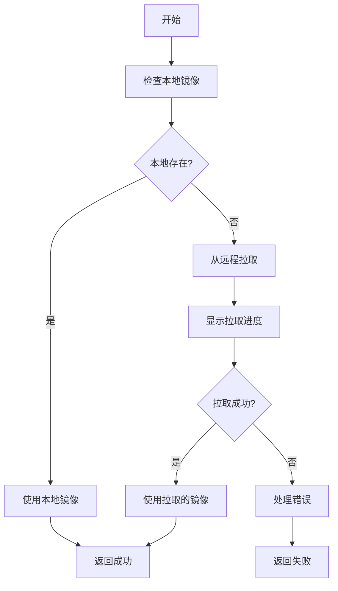

**Diagram sources**
- [docker.py](file://openhands/runtime/builder/docker.py#L264-L298)
- [docker.py](file://openhands/runtime/builder/docker.py#L144-L151)

**Section sources**
- [docker.py](file://openhands/runtime/builder/docker.py#L251-L308)

## 容器状态同步机制
Docker运行时通过定期查询容器状态实现状态同步。容器状态从Docker守护进程获取，并映射到内部的`sandbox_status`枚举。

状态映射关系如下：
- 'running' → RUNNING
- 'paused' → PAUSED
- 'exited' → PAUSED
- 'created' → STARTING
- 'restarting' → STARTING
- 'removing' → MISSING
- 'dead' → ERROR

状态同步通过`_docker_status_to_sandbox_status()`方法实现，该方法将Docker容器状态转换为内部沙箱状态。对于未知状态，统一映射为ERROR状态。

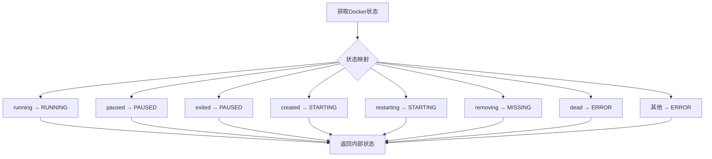

**Diagram sources**
- [docker_sandbox_service.py](file://openhands/app_server/sandbox/docker_sandbox_service.py#L88-L100)

**Section sources**
- [docker_sandbox_service.py](file://openhands/app_server/sandbox/docker_sandbox_service.py#L88-L100)

## 健康检查
Docker运行时通过健康检查端点监控容器的运行状态。健康检查通过向容器的健康检查路径发送HTTP请求实现，如果请求成功则认为容器运行正常。

健康检查配置包括：
- `health_check_path`: 健康检查的URL路径，默认为'/health'
- HTTP客户端用于发送健康检查请求
- 异常处理机制，捕获网络错误和超时

当容器状态为RUNNING时，会执行健康检查。如果健康检查失败，容器状态会被标记为ERROR。

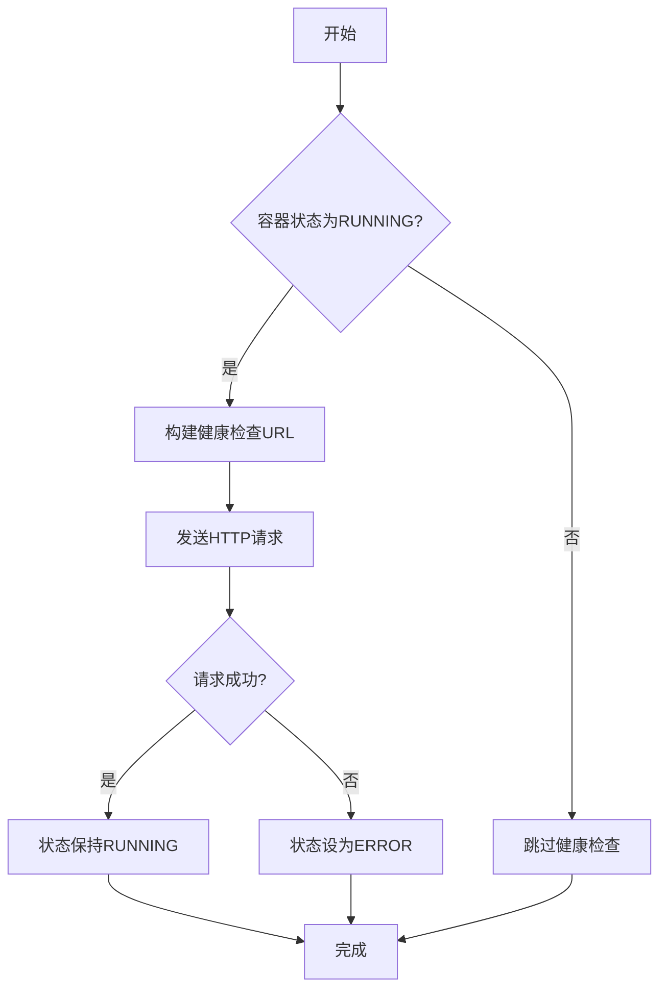

**Diagram sources**
- [docker_sandbox_service.py](file://openhands/app_server/sandbox/docker_sandbox_service.py#L175-L199)

**Section sources**
- [docker_sandbox_service.py](file://openhands/app_server/sandbox/docker_sandbox_service.py#L175-L199)

## 日志收集
Docker运行时通过`LogStreamer`类实现日志收集功能。`LogStreamer`创建一个后台线程，持续从容器日志流中读取日志并输出到指定的日志函数。

日志收集过程包括：
1. 初始化`LogStreamer`实例
2. 启动日志流线程
3. 从容器日志流中读取日志
4. 解码日志行并输出
5. 处理日志流异常
6. 清理资源

日志收集在调试模式下启用，可以通过`DEBUG_RUNTIME`环境变量控制。`LogStreamer`实现了优雅关闭，确保在运行时关闭时正确释放资源。

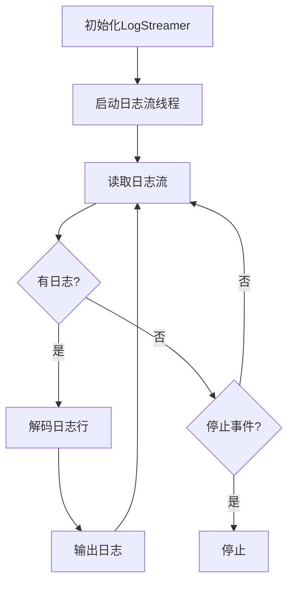

**Diagram sources**
- [log_streamer.py](file://openhands/runtime/utils/log_streamer.py#L7-L49)

**Section sources**
- [log_streamer.py](file://openhands/runtime/utils/log_streamer.py#L7-L66)
- [docker_runtime.py](file://openhands/runtime/impl/docker/docker_runtime.py#L191-L194)

## 性能监控
Docker运行时通过资源限制和性能测试实现性能监控。性能监控主要关注内存使用情况，通过设置内存限制和OOM（内存不足）终止器来防止容器消耗过多内存。

性能测试用例验证了运行时在资源限制下的行为：
- 当内存使用超过限制时，容器会被OOM终止器终止
- 当内存使用在限制范围内时，容器可以正常运行

这些测试确保运行时在资源受限环境下能够正确处理内存压力，防止系统资源耗尽。

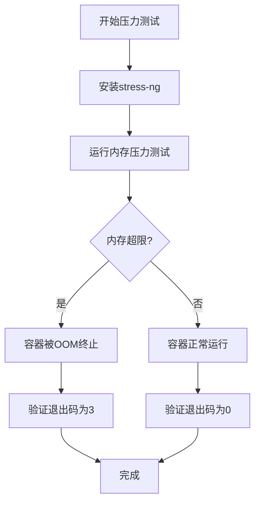

**Diagram sources**
- [test_runtime_resource.py](file://tests/runtime/test_runtime_resource.py#L41-L76)

**Section sources**
- [test_runtime_resource.py](file://tests/runtime/test_runtime_resource.py#L41-L115)

## 高级配置选项
Docker运行时支持多种高级配置选项，通过配置文件或环境变量进行设置。主要配置选项包括：

**沙箱配置**
- `base_container_image`: 基础容器镜像
- `runtime_container_image`: 运行时容器镜像
- `volumes`: 卷挂载配置
- `use_host_network`: 是否使用主机网络
- `runtime_binding_address`: 运行时绑定地址
- `vscode_port`: VSCode端口
- `enable_gpu`: 是否启用GPU支持
- `cuda_visible_devices`: CUDA可见设备

**资源限制配置**
- `docker_runtime_kwargs`: Docker运行时参数，包括CPU和内存限制
- `runtime_startup_env_vars`: 运行时启动环境变量

**构建配置**
- `runtime_extra_deps`: 运行时额外依赖
- `force_rebuild_runtime`: 是否强制重建运行时
- `runtime_extra_build_args`: 运行时额外构建参数

这些配置选项提供了灵活的定制能力，可以根据具体需求调整运行时行为。

**Section sources**
- [docker_runtime.py](file://openhands/runtime/impl/docker/docker_runtime.py#L134-L135)
- [docker_runtime.py](file://openhands/runtime/impl/docker/docker_runtime.py#L476-L477)
- [docker_runtime.py](file://openhands/runtime/impl/docker/docker_runtime.py#L497-L511)

## 故障排查指南
Docker运行时提供了详细的故障排查信息，帮助用户诊断和解决问题。常见问题及解决方案包括：

**Docker客户端初始化失败**
- 现象：无法启动Docker客户端
- 原因：Docker未安装或Docker守护进程未运行
- 解决方案：确保已安装Docker并启动Docker桌面/守护进程

**端口冲突**
- 现象：容器无法启动，端口已被占用
- 原因：端口分配冲突
- 解决方案：运行时使用文件锁机制防止端口冲突，如果问题持续，检查系统端口使用情况

**镜像拉取失败**
- 现象：无法拉取镜像
- 原因：网络问题或镜像不存在
- 解决方案：检查网络连接，确认镜像名称正确

**容器启动失败**
- 现象：容器启动后立即退出
- 原因：容器内应用程序启动失败
- 解决方案：检查容器日志，查看具体错误信息

**GPU支持问题**
- 现象：无法使用GPU
- 原因：未正确配置GPU设备请求
- 解决方案：确保Docker配置了GPU支持，正确设置`enable_gpu`和`cuda_visible_devices`参数

**Section sources**
- [docker_runtime.py](file://openhands/runtime/impl/docker/docker_runtime.py#L256-L258)
- [docker.py](file://openhands/runtime/builder/docker.py#L296-L307)
- [docker_runtime.py](file://openhands/runtime/impl/docker/docker_runtime.py#L537-L542)

## 性能优化建议
为了优化Docker运行时的性能，建议采取以下措施：

**使用构建缓存**
- 启用本地构建缓存，加速镜像构建过程
- 定期清理旧的缓存文件，避免磁盘空间耗尽

**合理配置资源限制**
- 根据工作负载需求设置适当的CPU和内存限制
- 避免设置过高的资源限制，以免影响系统稳定性

**优化卷挂载**
- 使用命名卷而非绑定挂载，提高性能
- 对于频繁读写的目录，考虑使用tmpfs挂载

**减少镜像大小**
- 使用轻量级基础镜像
- 在Dockerfile中合并RUN指令，减少镜像层

**网络优化**
- 在可能的情况下使用主机网络模式，减少网络开销
- 合理规划端口分配，避免端口冲突

**监控和调优**
- 启用日志收集，监控运行时行为
- 定期进行性能测试，识别瓶颈

**Section sources**
- [docker.py](file://openhands/runtime/builder/docker.py#L144-L151)
- [docker_runtime.py](file://openhands/runtime/impl/docker/docker_runtime.py#L47-L53)
- [docker_runtime.py](file://openhands/runtime/impl/docker/docker_runtime.py#L270-L304)

## 多租户环境中的安全隔离实践
在多租户环境中，Docker运行时通过容器隔离确保各租户之间的安全。安全隔离实践包括：

**容器隔离**
- 每个会话使用独立的容器，确保租户间隔离
- 使用唯一的容器名称前缀（openhands-runtime-）管理容器

**资源隔离**
- 为每个容器设置资源限制，防止资源耗尽攻击
- 使用OOM终止器防止内存耗尽

**网络隔离**
- 默认使用桥接网络，限制容器间的直接通信
- 可以配置额外网络，实现特定的网络拓扑

**卷隔离**
- 使用覆盖挂载实现文件系统隔离
- 每个容器有独立的上层目录和工作目录

**安全监控**
- 集成安全分析器，实时监控容器活动
- 检测高风险操作，如删除关键文件

这些安全实践确保在多租户环境中，各租户的活动相互隔离，防止恶意行为影响其他租户。

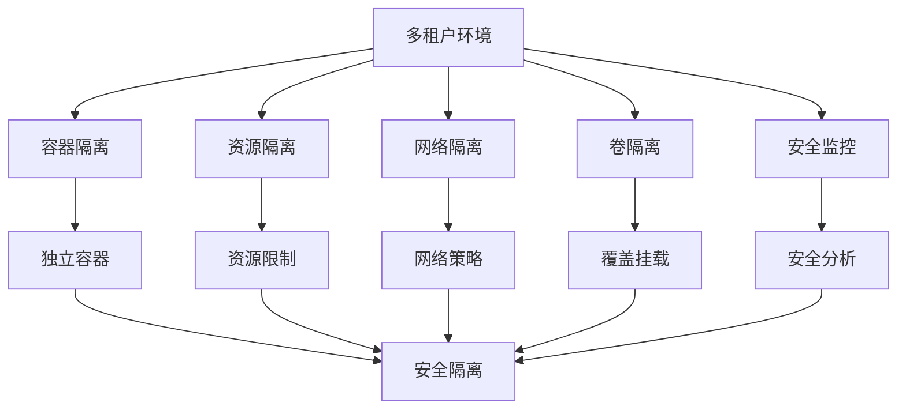

**Diagram sources**
- [docker_runtime.py](file://openhands/runtime/impl/docker/docker_runtime.py#L136-L137)
- [docker_runtime.py](file://openhands/runtime/impl/docker/docker_runtime.py#L47-L53)
- [analyzer.py](file://openhands/security/invariant/analyzer.py#L37-L92)

**Section sources**
- [docker_runtime.py](file://openhands/runtime/impl/docker/docker_runtime.py#L134-L137)
- [analyzer.py](file://openhands/security/invariant/analyzer.py#L37-L92)