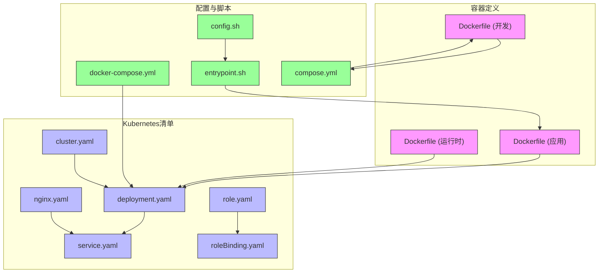
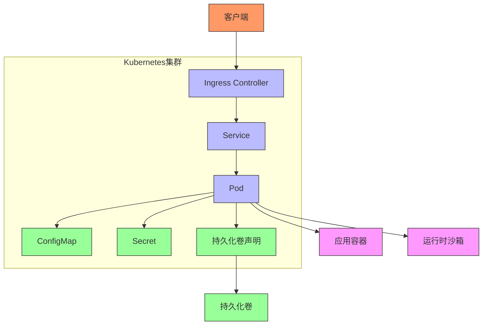
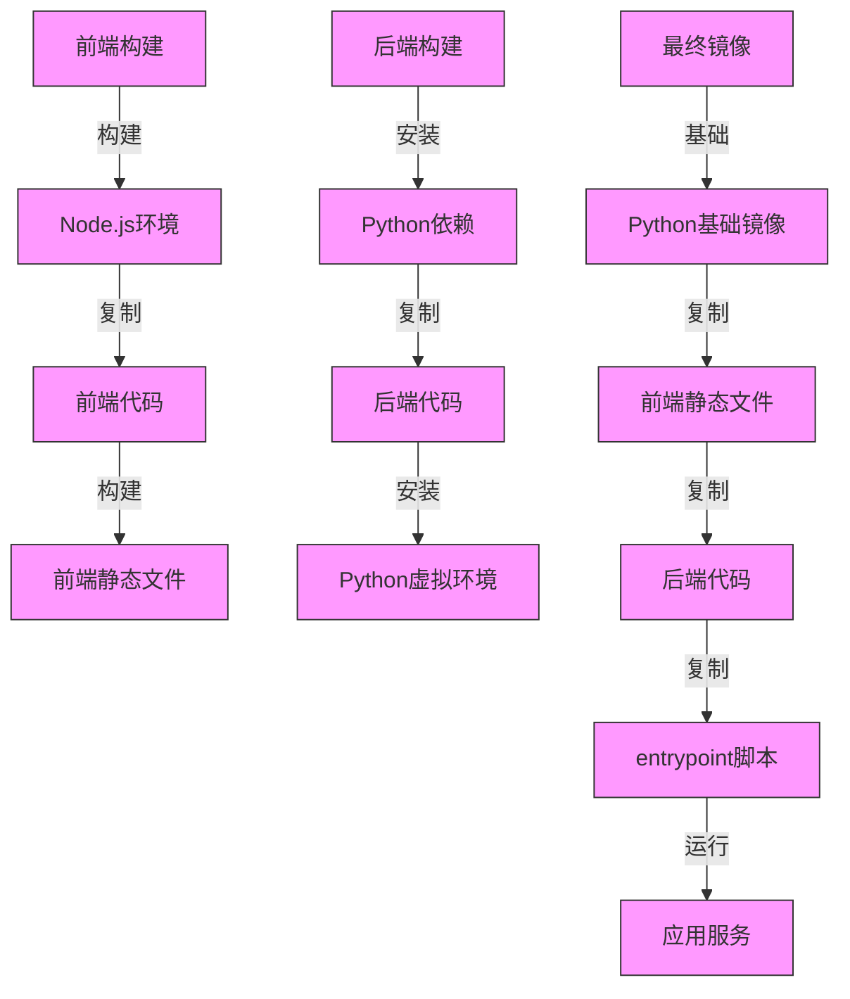
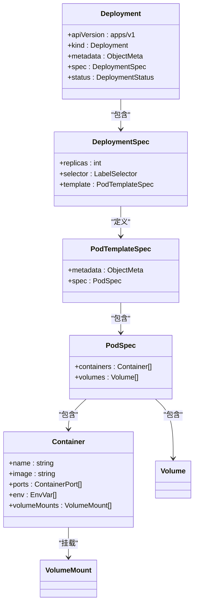
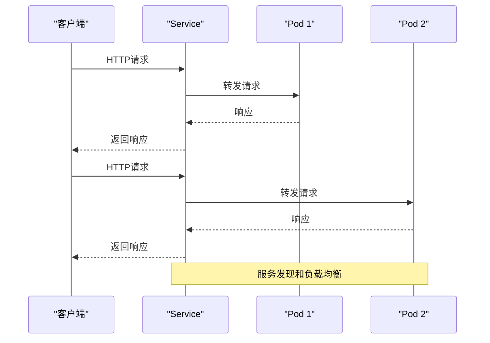
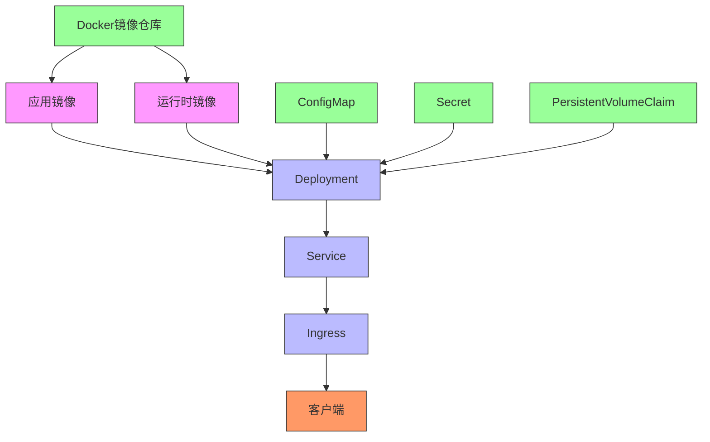

# Kubernetes运行时

<cite>
**本文档中引用的文件**  
- [deployment.yaml](file://kind/manifests/deployment.yaml)
- [service.yaml](file://kind/manifests/service.yaml)
- [nginx.yaml](file://kind/manifests/nginx.yaml)
- [cluster.yaml](file://kind/cluster.yaml)
- [role.yaml](file://kind/manifests/role.yaml)
- [roleBinding.yaml](file://kind/manifests/roleBinding.yaml)
- [Dockerfile](file://containers/app/Dockerfile)
- [entrypoint.sh](file://containers/app/entrypoint.sh)
- [docker-compose.yml](file://docker-compose.yml)
- [compose.yml](file://containers/dev/compose.yml)
- [config.sh](file://containers/app/config.sh)
- [README.md](file://containers/runtime/README.md)
</cite>

## 目录
1. [简介](#简介)
2. [项目结构](#项目结构)
3. [核心组件](#核心组件)
4. [架构概述](#架构概述)
5. [详细组件分析](#详细组件分析)
6. [依赖分析](#依赖分析)
7. [性能考虑](#性能考虑)
8. [故障排除指南](#故障排除指南)
9. [结论](#结论)

## 简介
本文档深入解析OpenHands在Kubernetes环境中的运行时架构，涵盖Pod部署与管理、资源请求与限制、服务发现和网络策略等核心主题。文档详细说明ConfigMap和Secret的配置注入机制、持久化存储卷的使用方法，以及Horizontal Pod Autoscaler集成、健康探针配置和日志聚合方案。此外，还提供在生产环境中部署OpenHands的高可用架构设计和运维最佳实践。

## 项目结构
OpenHands项目的结构围绕容器化部署和Kubernetes集成设计，主要包含容器定义、Kubernetes清单文件和配置脚本。项目通过Docker和Kubernetes实现应用的容器化和编排，支持本地开发和生产环境部署。

**图表来源**  
- [Dockerfile](file://containers/app/Dockerfile)
- [deployment.yaml](file://kind/manifests/deployment.yaml)
- [service.yaml](file://kind/manifests/service.yaml)
- [nginx.yaml](file://kind/manifests/nginx.yaml)
- [cluster.yaml](file://kind/cluster.yaml)
- [role.yaml](file://kind/manifests/role.yaml)
- [roleBinding.yaml](file://kind/manifests/roleBinding.yaml)
- [entrypoint.sh](file://containers/app/entrypoint.sh)
- [config.sh](file://containers/app/config.sh)
- [docker-compose.yml](file://docker-compose.yml)
- [compose.yml](file://containers/dev/compose.yml)

**章节来源**  
- [containers/app/Dockerfile](file://containers/app/Dockerfile)
- [kind/manifests/deployment.yaml](file://kind/manifests/deployment.yaml)
- [kind/manifests/service.yaml](file://kind/manifests/service.yaml)
- [kind/manifests/nginx.yaml](file://kind/manifests/nginx.yaml)
- [kind/cluster.yaml](file://kind/cluster.yaml)

## 核心组件
OpenHands的核心组件包括应用容器、运行时沙箱、Kubernetes部署和服务。应用容器包含前端和后端服务，运行时沙箱提供隔离的执行环境，Kubernetes部署管理Pod生命周期，服务提供网络访问。

**章节来源**  
- [containers/app/Dockerfile](file://containers/app/Dockerfile)
- [containers/runtime/README.md](file://containers/runtime/README.md)
- [kind/manifests/deployment.yaml](file://kind/manifests/deployment.yaml)
- [kind/manifests/service.yaml](file://kind/manifests/service.yaml)

## 架构概述
OpenHands的Kubernetes架构采用多层设计，包括入口控制器、服务、部署和持久化存储。架构通过Ingress控制器暴露服务，使用Deployment管理Pod副本，通过ConfigMap和Secret注入配置。

**图表来源**  
- [kind/manifests/nginx.yaml](file://kind/manifests/nginx.yaml)
- [kind/manifests/service.yaml](file://kind/manifests/service.yaml)
- [kind/manifests/deployment.yaml](file://kind/manifests/deployment.yaml)

## 详细组件分析

### 应用容器分析
应用容器通过多阶段Docker构建实现，包含前端构建、后端构建和最终镜像。容器使用非root用户运行，通过entrypoint脚本进行初始化配置。

**图表来源**  
- [containers/app/Dockerfile](file://containers/app/Dockerfile)
- [containers/app/entrypoint.sh](file://containers/app/entrypoint.sh)

### Kubernetes部署分析
Kubernetes部署配置定义了应用的副本数、选择器和Pod模板。部署通过标签选择器关联Pod，确保指定数量的Pod副本运行。

**图表来源**  
- [kind/manifests/deployment.yaml](file://kind/manifests/deployment.yaml)

### 服务发现分析
服务通过ClusterIP类型暴露，将外部请求转发到后端Pod。服务使用标签选择器定位目标Pod，实现服务发现和负载均衡。

**图表来源**  
- [kind/manifests/service.yaml](file://kind/manifests/service.yaml)

## 依赖分析
OpenHands的组件依赖关系包括容器镜像依赖、Kubernetes资源依赖和外部服务依赖。系统通过Docker镜像仓库管理容器依赖，通过Kubernetes清单文件定义资源依赖。

**图表来源**  
- [docker-compose.yml](file://docker-compose.yml)
- [containers/app/Dockerfile](file://containers/app/Dockerfile)
- [kind/manifests/deployment.yaml](file://kind/manifests/deployment.yaml)
- [kind/manifests/service.yaml](file://kind/manifests/service.yaml)
- [kind/manifests/nginx.yaml](file://kind/manifests/nginx.yaml)

**章节来源**  
- [docker-compose.yml](file://docker-compose.yml)
- [containers/app/Dockerfile](file://containers/app/Dockerfile)
- [kind/manifests/deployment.yaml](file://kind/manifests/deployment.yaml)
- [kind/manifests/service.yaml](file://kind/manifests/service.yaml)
- [kind/manifests/nginx.yaml](file://kind/manifests/nginx.yaml)

## 性能考虑
在Kubernetes环境中部署OpenHands时，需要考虑资源请求与限制、水平Pod自动扩展、健康探针配置和日志聚合等性能因素。合理的资源配置可以确保应用稳定运行，自动扩展机制可以应对流量波动，健康探针确保服务可用性，日志聚合便于监控和故障排除。

## 故障排除指南
当遇到Kubernetes部署问题时，首先检查Pod状态和日志，验证资源配置是否合理，确认服务和入口配置正确。使用kubectl命令查看部署状态、Pod日志和事件，可以帮助快速定位和解决问题。

**章节来源**  
- [containers/app/entrypoint.sh](file://containers/app/entrypoint.sh)
- [kind/manifests/deployment.yaml](file://kind/manifests/deployment.yaml)
- [kind/manifests/service.yaml](file://kind/manifests/service.yaml)

## 结论
OpenHands通过精心设计的Kubernetes配置实现了高可用、可扩展的应用部署。项目采用多阶段Docker构建、合理的资源配置和完整的Kubernetes清单文件，确保了应用在生产环境中的稳定运行。通过深入理解这些组件和配置，可以更好地部署和管理OpenHands应用。