# 本地运行时

<cite>
**本文档中引用的文件**
- [openhands/runtime/README.md](file://openhands/runtime/README.md)
- [openhands/runtime/base.py](file://openhands/runtime/base.py)
- [openhands/runtime/impl/local/local_runtime.py](file://openhands/runtime/impl/local/local_runtime.py)
- [openhands/runtime/action_execution_server.py](file://openhands/runtime/action_execution_server.py)
- [openhands/runtime/utils/memory_monitor.py](file://openhands/runtime/utils/memory_monitor.py)
- [openhands/runtime/utils/shutdown_listener.py](file://openhands/runtime/utils/shutdown_listener.py)
- [openhands/runtime/utils/files.py](file://openhands/runtime/utils/files.py)
- [openhands/security/README.md](file://openhands/security/README.md)
- [openhands/core/config/__init__.py](file://openhands/core/config/__init__.py)
- [openhands/runtime/utils/system_stats.py](file://openhands/runtime/utils/system_stats.py)
</cite>

## 目录
1. [简介](#简介)
2. [项目结构](#项目结构)
3. [核心组件](#核心组件)
4. [架构概览](#架构概览)
5. [详细组件分析](#详细组件分析)
6. [依赖关系分析](#依赖关系分析)
7. [性能考虑](#性能考虑)
8. [故障排除指南](#故障排除指南)
9. [结论](#结论)

## 简介

OpenHands本地运行时是一个强大的执行环境，专门设计用于在本地机器上直接执行AI代理的操作。它提供了无容器化的直接执行方式，通过启动本地服务器来处理各种操作请求，包括命令执行、文件操作、浏览器交互等。本地运行时特别适用于开发和测试场景，因为它提供了快速的反馈循环和对本地资源的直接访问。

本地运行时的核心优势在于其简单性和效率：无需Docker容器开销，直接利用主机资源，同时保持必要的安全隔离。然而，它也提供了完整的功能集，包括内存监控、进程管理、文件系统访问控制和安全分析。

## 项目结构

OpenHands本地运行时的项目结构体现了模块化和可扩展的设计理念：

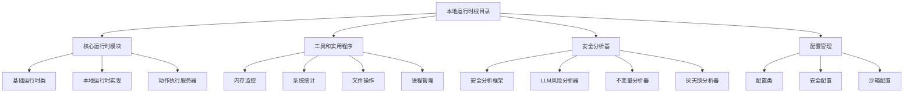

**图表来源**
- [openhands/runtime/README.md](file://openhands/runtime/README.md#L1-L162)
- [openhands/runtime/base.py](file://openhands/runtime/base.py#L1-L100)

**章节来源**
- [openhands/runtime/README.md](file://openhands/runtime/README.md#L1-L162)

## 核心组件

### 基础运行时类 (Runtime)

基础运行时类是整个本地运行时系统的核心抽象层，定义了所有运行时环境必须实现的基本接口：

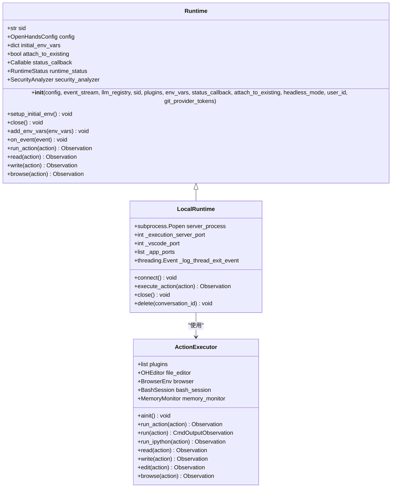

**图表来源**
- [openhands/runtime/base.py](file://openhands/runtime/base.py#L91-L200)
- [openhands/runtime/impl/local/local_runtime.py](file://openhands/runtime/impl/local/local_runtime.py#L124-L200)
- [openhands/runtime/action_execution_server.py](file://openhands/runtime/action_execution_server.py#L166-L250)

### 动作执行服务器 (ActionExecutor)

动作执行服务器是本地运行时的核心处理器，负责接收和执行来自前端的各种操作请求：

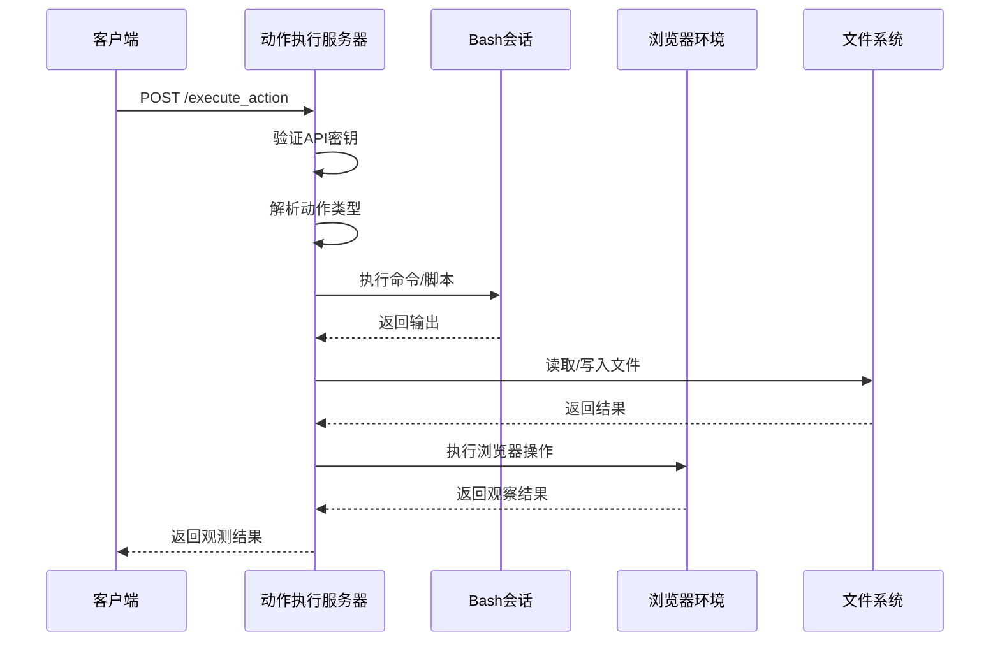

**图表来源**
- [openhands/runtime/action_execution_server.py](file://openhands/runtime/action_execution_server.py#L379-L450)
- [openhands/runtime/impl/local/local_runtime.py](file://openhands/runtime/impl/local/local_runtime.py#L435-L480)

**章节来源**
- [openhands/runtime/base.py](file://openhands/runtime/base.py#L91-L300)
- [openhands/runtime/impl/local/local_runtime.py](file://openhands/runtime/impl/local/local_runtime.py#L124-L400)

## 架构概览

本地运行时采用分层架构设计，确保了良好的分离关注点和可扩展性：

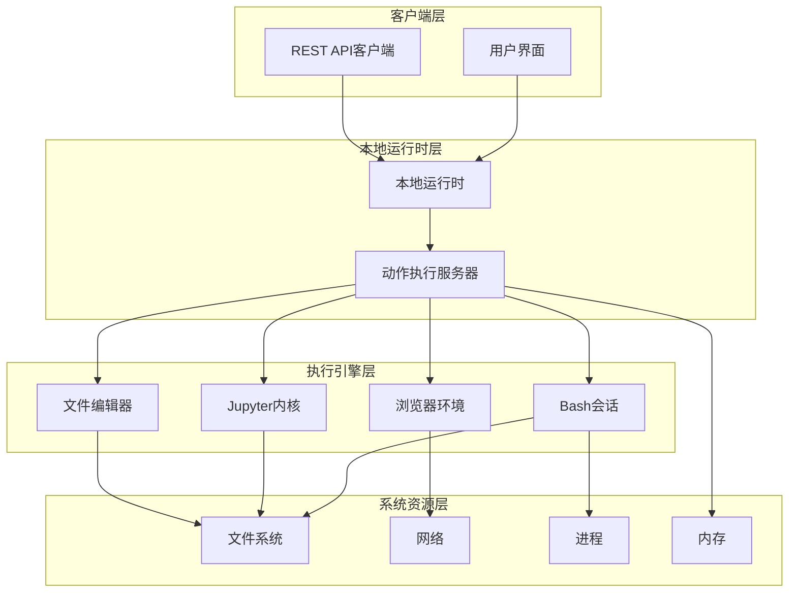

**图表来源**
- [openhands/runtime/impl/local/local_runtime.py](file://openhands/runtime/impl/local/local_runtime.py#L218-L350)
- [openhands/runtime/action_execution_server.py](file://openhands/runtime/action_execution_server.py#L166-L300)

## 详细组件分析

### 进程沙箱与资源隔离

本地运行时虽然不使用容器化技术，但仍然实现了多层次的安全隔离：

#### 用户权限管理

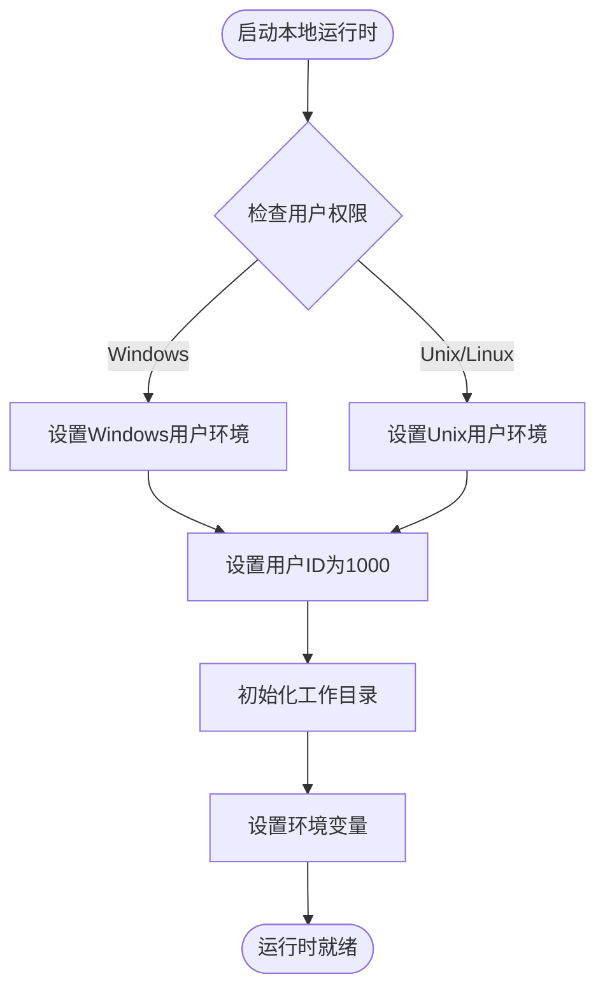

**图表来源**
- [openhands/runtime/impl/local/local_runtime.py](file://openhands/runtime/impl/local/local_runtime.py#L69-L80)
- [openhands/runtime/action_execution_server.py](file://openhands/runtime/action_execution_server.py#L180-L200)

#### 文件系统访问控制

本地运行时实现了严格的文件系统访问控制机制：

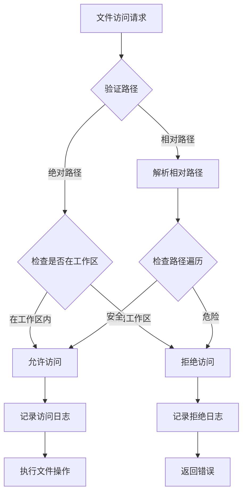

**图表来源**
- [openhands/runtime/utils/files.py](file://openhands/runtime/utils/files.py#L12-L41)
- [openhands/runtime/impl/cli/cli_runtime.py](file://openhands/runtime/impl/cli/cli_runtime.py#L495-L523)

**章节来源**
- [openhands/runtime/utils/files.py](file://openhands/runtime/utils/files.py#L1-L41)
- [openhands/runtime/impl/local/local_runtime.py](file://openhands/runtime/impl/local/local_runtime.py#L69-L100)

### 信号处理与进程监控

本地运行时实现了完善的信号处理和进程监控机制：

#### 内存监控系统

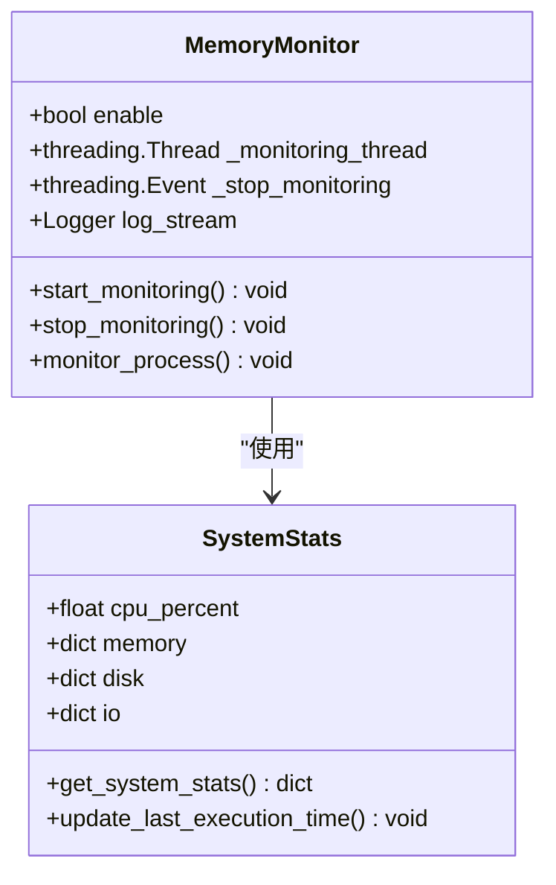

**图表来源**
- [openhands/runtime/utils/memory_monitor.py](file://openhands/runtime/utils/memory_monitor.py#L37-L66)
- [openhands/runtime/utils/system_stats.py](file://openhands/runtime/utils/system_stats.py#L27-L82)

#### 进程生命周期管理

本地运行时提供了完整的进程生命周期管理功能：

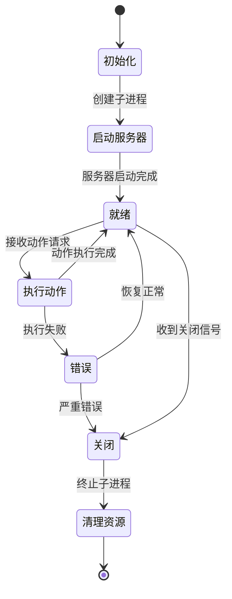

**图表来源**
- [openhands/runtime/impl/local/local_runtime.py](file://openhands/runtime/impl/local/local_runtime.py#L482-L520)
- [openhands/runtime/utils/shutdown_listener.py](file://openhands/runtime/utils/shutdown_listener.py#L50-L116)

**章节来源**
- [openhands/runtime/utils/memory_monitor.py](file://openhands/runtime/utils/memory_monitor.py#L37-L66)
- [openhands/runtime/impl/local/local_runtime.py](file://openhands/runtime/impl/local/local_runtime.py#L482-L550)

### 异常恢复机制

本地运行时实现了多层次的异常恢复机制：

#### 自动重启和恢复

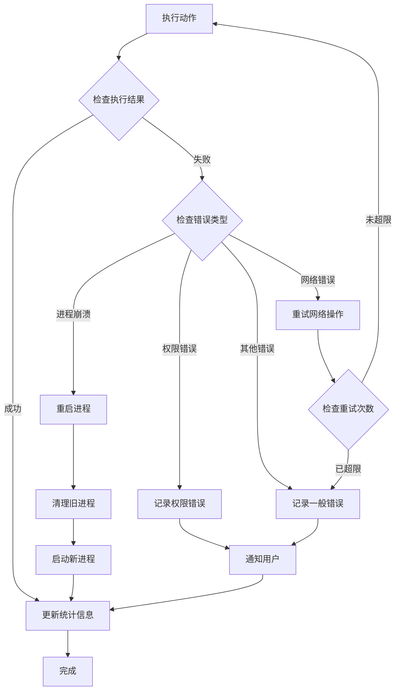

**图表来源**
- [openhands/runtime/base.py](file://openhands/runtime/base.py#L370-L400)
- [openhands/runtime/impl/local/local_runtime.py](file://openhands/runtime/impl/local/local_runtime.py#L435-L480)

**章节来源**
- [openhands/runtime/base.py](file://openhands/runtime/base.py#L370-L420)
- [openhands/runtime/impl/local/local_runtime.py](file://openhands/runtime/impl/local/local_runtime.py#L435-L500)

### 安全分析框架

本地运行时集成了强大的安全分析框架，提供多层安全保护：

#### 安全分析器架构

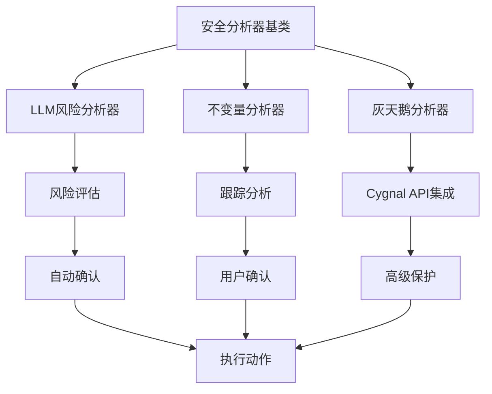

**图表来源**
- [openhands/security/README.md](file://openhands/security/README.md#L21-L130)

**章节来源**
- [openhands/security/README.md](file://openhands/security/README.md#L1-L130)

## 依赖关系分析

本地运行时的依赖关系体现了清晰的分层架构：

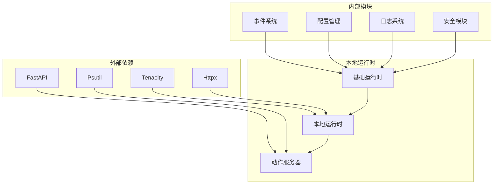

**图表来源**
- [openhands/runtime/base.py](file://openhands/runtime/base.py#L1-L50)
- [openhands/runtime/action_execution_server.py](file://openhands/runtime/action_execution_server.py#L1-L50)

**章节来源**
- [openhands/runtime/base.py](file://openhands/runtime/base.py#L1-L100)
- [openhands/runtime/action_execution_server.py](file://openhands/runtime/action_execution_server.py#L1-L100)

## 性能考虑

本地运行时在设计时充分考虑了性能优化：

### 资源监控和优化

本地运行时提供了全面的系统资源监控功能：

| 监控指标 | 描述 | 实现方式 | 性能影响 |
|---------|------|----------|----------|
| CPU使用率 | 当前进程CPU占用百分比 | psutil.Process.cpu_percent() | 低 |
| 内存使用 | RSS、VMS和内存百分比 | psutil.Process.memory_info() | 低 |
| 磁盘I/O | 读写字节数统计 | /proc/[pid]/io文件 | 低 |
| 网络状态 | 连接状态和带宽使用 | 系统调用监控 | 中等 |

### 缓存和预热机制

本地运行时实现了智能的缓存和预热机制：

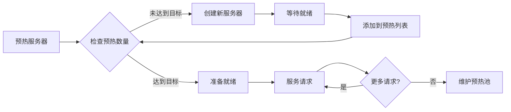

**图表来源**
- [openhands/runtime/impl/local/local_runtime.py](file://openhands/runtime/impl/local/local_runtime.py#L750-L823)

## 故障排除指南

### 常见问题和解决方案

#### 依赖项检查失败

当本地运行时启动时，会进行依赖项检查：

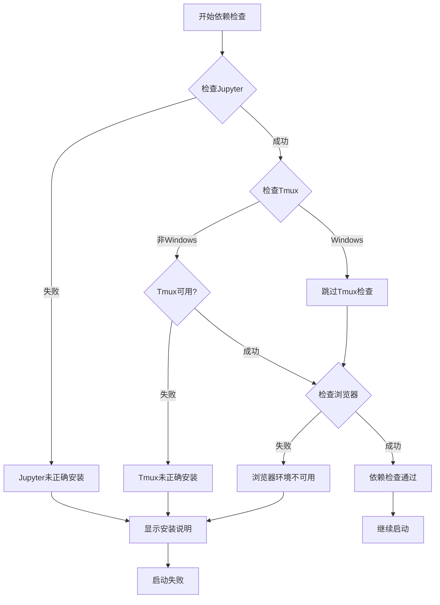

**图表来源**
- [openhands/runtime/impl/local/local_runtime.py](file://openhands/runtime/impl/local/local_runtime.py#L70-L115)

#### 内存泄漏检测

本地运行时提供了内存泄漏检测功能：

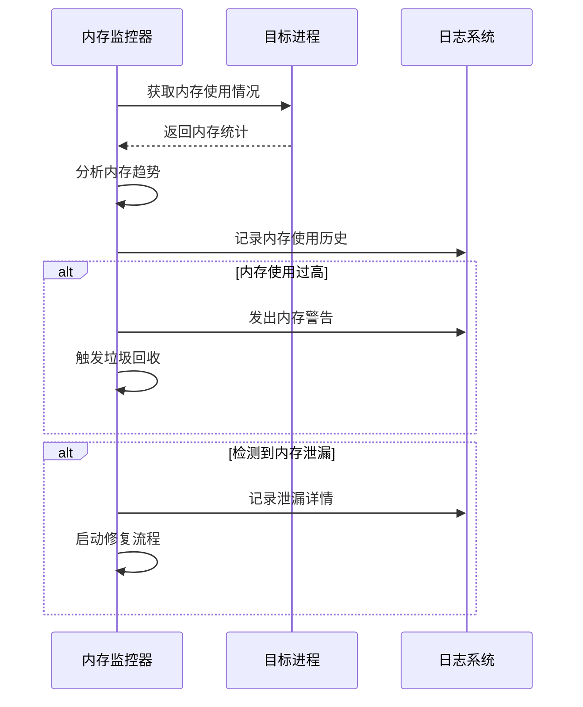

**图表来源**
- [openhands/runtime/utils/memory_monitor.py](file://openhands/runtime/utils/memory_monitor.py#L37-L66)

**章节来源**
- [openhands/runtime/impl/local/local_runtime.py](file://openhands/runtime/impl/local/local_runtime.py#L70-L120)
- [openhands/runtime/utils/memory_monitor.py](file://openhands/runtime/utils/memory_monitor.py#L37-L82)

## 结论

OpenHands本地运行时提供了一个强大而灵活的执行环境，特别适合开发和测试场景。它通过以下关键特性实现了高性能和高安全性：

1. **简化部署**：无需Docker容器，直接利用本地资源
2. **完整功能**：支持命令执行、文件操作、浏览器交互等所有核心功能
3. **安全隔离**：实现严格的文件系统访问控制和权限管理
4. **监控能力**：提供全面的资源监控和异常检测
5. **可扩展性**：模块化设计支持自定义扩展和插件

本地运行时的最佳实践包括：
- 在开发环境中优先使用本地运行时以获得更快的迭代速度
- 在生产环境中考虑使用Docker运行时以获得更好的隔离性
- 启用安全分析器以增强安全性
- 定期监控资源使用情况以优化性能

通过合理配置和使用本地运行时，开发者可以构建高效、安全且可扩展的AI代理应用。