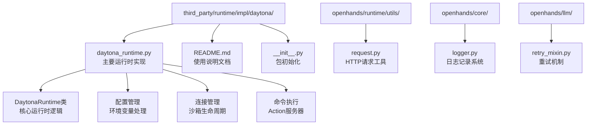
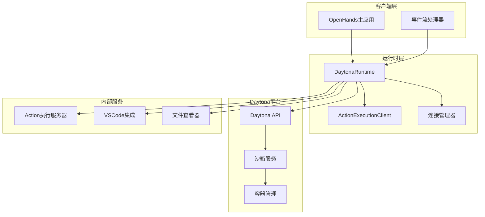
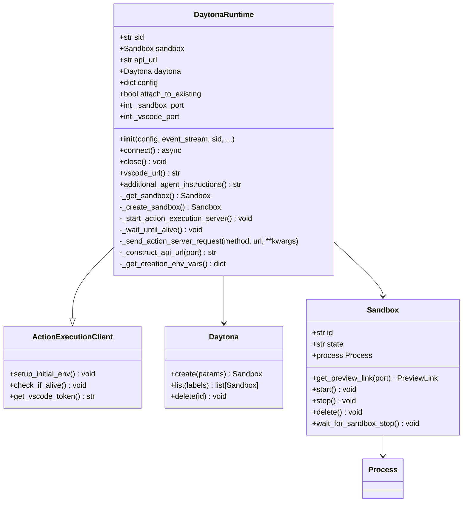
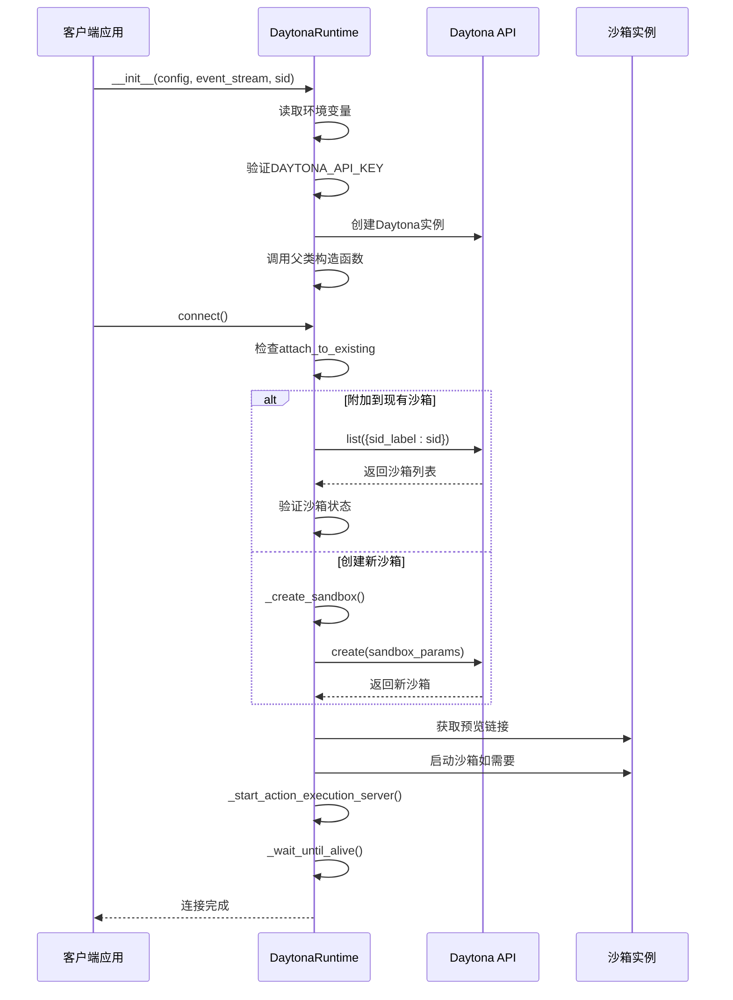
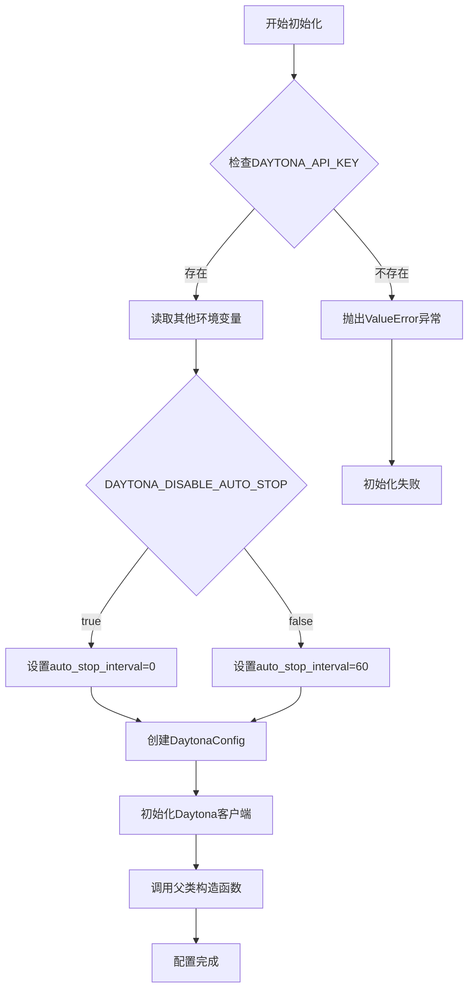
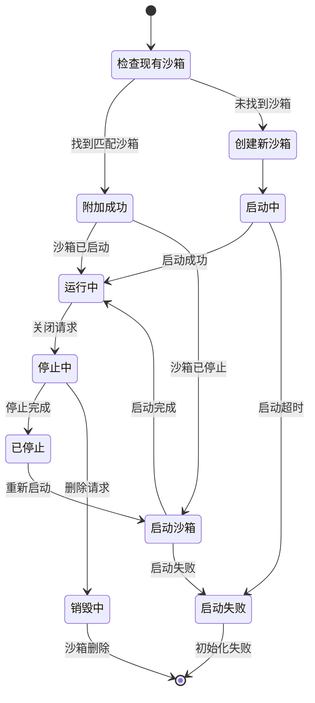
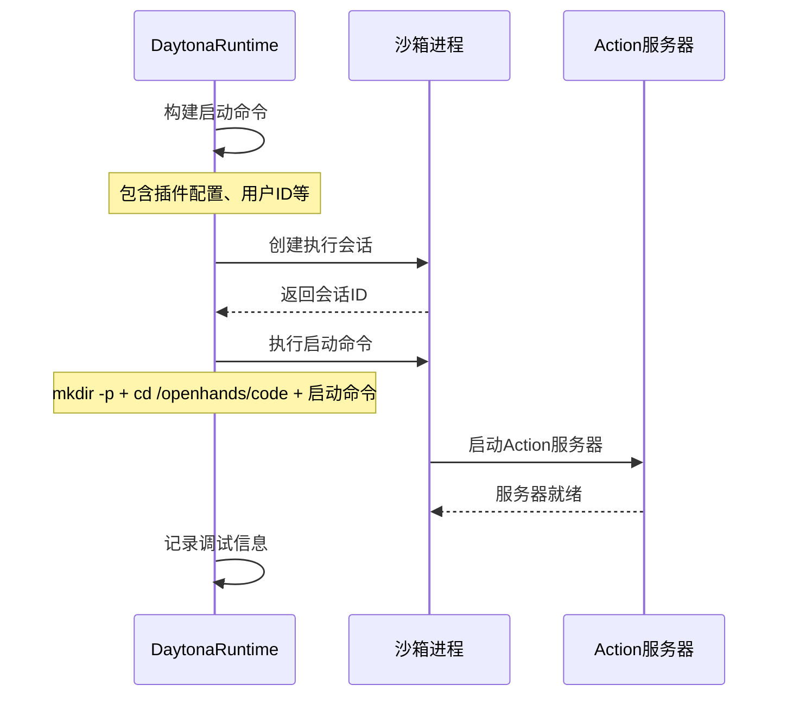
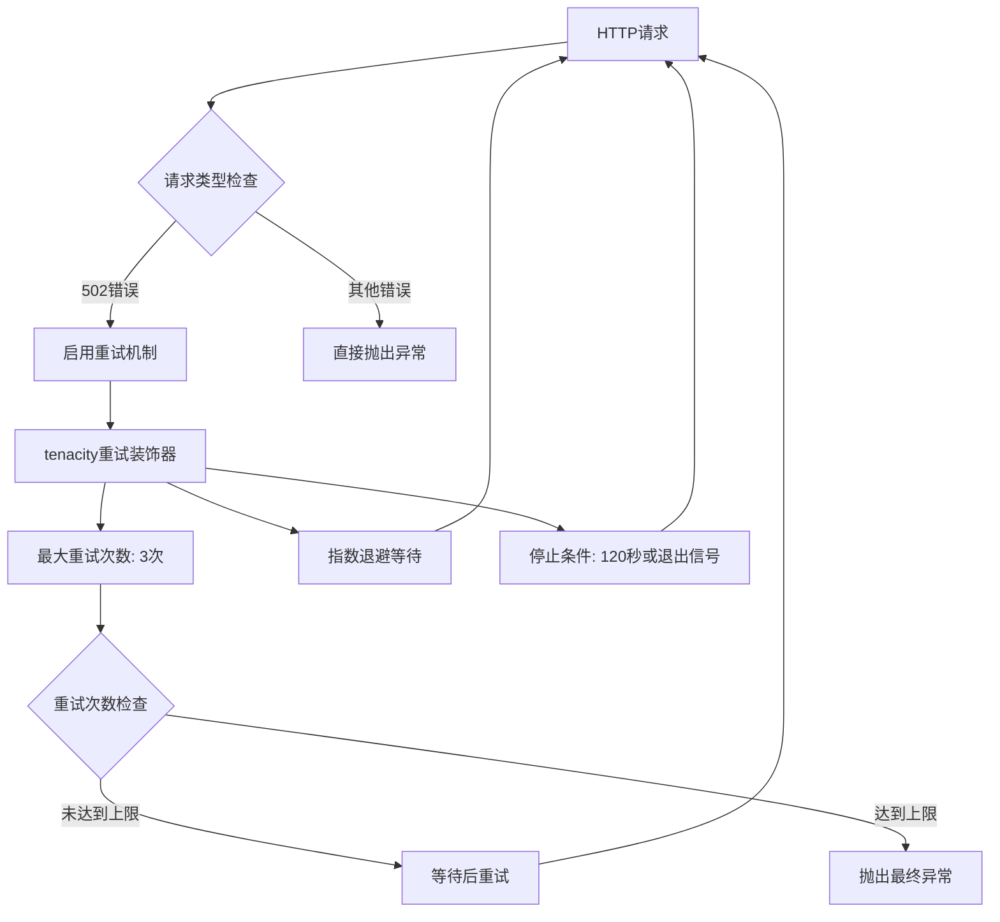
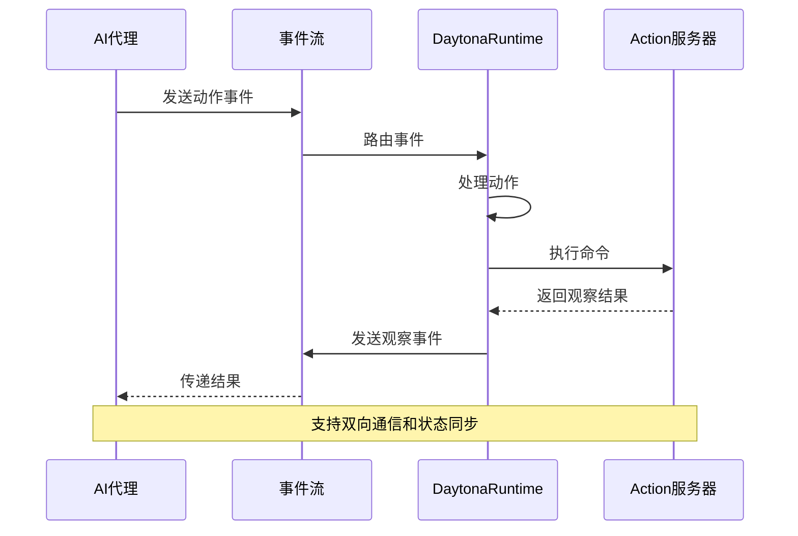

# Daytona 集成

<cite>
**本文档中引用的文件**
- [daytona_runtime.py](file://third_party/runtime/impl/daytona/daytona_runtime.py)
- [README.md](file://third_party/runtime/impl/daytona/README.md)
- [__init__.py](file://third_party/runtime/impl/daytona/__init__.py)
- [request.py](file://openhands/runtime/utils/request.py)
- [logger.py](file://openhands/core/logger.py)
- [retry_mixin.py](file://openhands/llm/retry_mixin.py)
- [config.template.toml](file://config.template.toml)
</cite>

## 目录
1. [简介](#简介)
2. [项目结构](#项目结构)
3. [核心组件](#核心组件)
4. [架构概览](#架构概览)
5. [详细组件分析](#详细组件分析)
6. [配置管理](#配置管理)
7. [连接协议与会话管理](#连接协议与会话管理)
8. [命令执行机制](#命令执行机制)
9. [错误处理与重试策略](#错误处理与重试策略)
10. [OpenHands事件系统集成](#openhands事件系统集成)
11. [性能优化与稳定性](#性能优化与稳定性)
12. [故障排除指南](#故障排除指南)
13. [结论](#结论)

## 简介

Daytona运行时集成是OpenHands平台中的一个重要组成部分，它提供了与Daytona托管开发环境的无缝连接能力。Daytona是一个为AI代理提供安全且弹性基础设施的平台，支持程序化管理和代码执行。该集成通过`DaytonaRuntime`类实现了远程开发环境的连接、会话管理和命令执行功能。

本文档详细描述了Daytona运行时集成的核心功能，包括API密钥配置、目标项目地址设置、SSH凭证管理，以及处理长时间运行任务的稳定性解决方案。同时涵盖了连接诊断方法、超时重试策略和与OpenHands事件系统的深度集成。

## 项目结构

Daytona运行时集成的文件组织结构如下：



**图表来源**
- [daytona_runtime.py](file://third_party/runtime/impl/daytona/daytona_runtime.py#L1-L298)
- [request.py](file://openhands/runtime/utils/request.py#L1-L60)
- [logger.py](file://openhands/core/logger.py#L43-L156)

**章节来源**
- [daytona_runtime.py](file://third_party/runtime/impl/daytona/daytona_runtime.py#L1-L50)
- [README.md](file://third_party/runtime/impl/daytona/README.md#L1-L135)

## 核心组件

Daytona运行时集成包含以下核心组件：

### DaytonaRuntime类
这是主要的运行时实现类，继承自`ActionExecutionClient`，负责：
- 沙箱环境的创建和管理
- 连接状态的维护
- 命令执行服务器的启动
- 与Daytona API的交互

### 配置管理系统
通过环境变量进行配置管理：
- `DAYTONA_API_KEY`: Daytona认证API密钥
- `DAYTONA_API_URL`: Daytona API端点URL
- `DAYTONA_TARGET`: 目标区域（默认：eu）
- `DAYTONA_DISABLE_AUTO_STOP`: 禁用自动停止功能
- `DAYTONA_DELETE_ON_CLOSE`: 关闭时删除沙箱

### 连接管理器
负责沙箱生命周期管理：
- 沙箱状态检查和等待
- 自动启动和停止逻辑
- 连接重试机制

**章节来源**
- [daytona_runtime.py](file://third_party/runtime/impl/daytona/daytona_runtime.py#L30-L88)
- [__init__.py](file://third_party/runtime/impl/daytona/__init__.py#L1-L7)

## 架构概览

Daytona运行时集成采用分层架构设计，确保了系统的可扩展性和可靠性：



**图表来源**
- [daytona_runtime.py](file://third_party/runtime/impl/daytona/daytona_runtime.py#L30-L88)
- [daytona_runtime.py](file://third_party/runtime/impl/daytona/daytona_runtime.py#L142-L175)

## 详细组件分析

### DaytonaRuntime类分析



**图表来源**
- [daytona_runtime.py](file://third_party/runtime/impl/daytona/daytona_runtime.py#L30-L88)
- [daytona_runtime.py](file://third_party/runtime/impl/daytona/daytona_runtime.py#L90-L136)

### 初始化流程分析



**图表来源**
- [daytona_runtime.py](file://third_party/runtime/impl/daytona/daytona_runtime.py#L184-L233)
- [daytona_runtime.py](file://third_party/runtime/impl/daytona/daytona_runtime.py#L90-L136)

**章节来源**
- [daytona_runtime.py](file://third_party/runtime/impl/daytona/daytona_runtime.py#L36-L88)
- [daytona_runtime.py](file://third_party/runtime/impl/daytona/daytona_runtime.py#L184-L233)

## 配置管理

### 环境变量配置

Daytona运行时集成通过环境变量进行配置管理，支持灵活的部署选项：

| 配置项 | 默认值 | 描述 | 示例 |
|--------|--------|------|------|
| `DAYTONA_API_KEY` | 必需 | Daytona认证API密钥 | `dhk_xxxxxxxxxxxx` |
| `DAYTONA_API_URL` | `https://app.daytona.io/api` | Daytona API端点URL | `https://api.daytona.io` |
| `DAYTONA_TARGET` | `eu` | 目标部署区域 | `us`, `eu`, `asia` |
| `DAYTONA_DISABLE_AUTO_STOP` | `false` | 禁用自动停止功能 | `true`, `false` |
| `DAYTONA_DELETE_ON_CLOSE` | `false` | 关闭时删除沙箱 | `true`, `false` |

### 配置验证机制



**图表来源**
- [daytona_runtime.py](file://third_party/runtime/impl/daytona/daytona_runtime.py#L49-L67)

### 工作空间配置限制

Daytona运行时集成了对工作空间挂载的特殊处理：

- **不支持工作空间挂载**: 由于无法将工作空间绑定挂载到沙箱中，系统会发出警告
- **替代方案**: 使用容器内的文件系统进行代码存储和操作
- **路径映射**: 通过`workspace_mount_path_in_sandbox`参数进行路径转换

**章节来源**
- [daytona_runtime.py](file://third_party/runtime/impl/daytona/daytona_runtime.py#L49-L76)
- [README.md](file://third_party/runtime/impl/daytona/README.md#L63-L81)

## 连接协议与会话管理

### 沙箱生命周期管理

Daytona运行时实现了完整的沙箱生命周期管理，包括创建、启动、监控和销毁：



**图表来源**
- [daytona_runtime.py](file://third_party/runtime/impl/daytona/daytona_runtime.py#L184-L233)
- [daytona_runtime.py](file://third_party/runtime/impl/daytona/daytona_runtime.py#L90-L106)

### 连接状态管理

系统实现了多级连接状态管理：

1. **STARTING_RUNTIME**: 正在启动运行时
2. **BUILDING_RUNTIME**: 正在构建运行时环境
3. **READY**: 运行时已就绪

### 自动停止机制

Daytona运行时集成了智能的自动停止机制：

- **默认行为**: 沙箱在60分钟后自动停止
- **禁用选项**: 通过`DAYTONA_DISABLE_AUTO_STOP=true`禁用自动停止
- **条件判断**: 只有在沙箱处于"started"状态时才执行停止操作

**章节来源**
- [daytona_runtime.py](file://third_party/runtime/impl/daytona/daytona_runtime.py#L121-L136)
- [daytona_runtime.py](file://third_party/runtime/impl/daytona/daytona_runtime.py#L200-L211)

## 命令执行机制

### Action执行服务器启动

Daytona运行时通过`_start_action_execution_server`方法启动Action执行服务器：



**图表来源**
- [daytona_runtime.py](file://third_party/runtime/impl/daytona/daytona_runtime.py#L146-L175)

### 命令执行流程

系统支持多种类型的命令执行：

1. **同步命令**: 立即执行并等待结果
2. **异步命令**: 在后台执行，返回命令ID
3. **会话管理**: 支持多个并发执行会话

### VSCode集成

Daytona运行时提供了完整的VSCode集成支持：

- **Token生成**: 自动生成VSCode访问令牌
- **URL构建**: 动态构建VSCode访问URL
- **文件夹映射**: 将工作空间路径映射到VSCode

**章节来源**
- [daytona_runtime.py](file://third_party/runtime/impl/daytona/daytona_runtime.py#L146-L175)
- [daytona_runtime.py](file://third_party/runtime/impl/daytona/daytona_runtime.py#L268-L293)

## 错误处理与重试策略

### HTTP请求重试机制

Daytona运行时集成了多层次的错误处理和重试策略：



**图表来源**
- [daytona_runtime.py](file://third_party/runtime/impl/daytona/daytona_runtime.py#L235-L249)
- [request.py](file://openhands/runtime/utils/request.py#L32-L36)

### 连接重试策略

对于连接相关的重试，系统采用了专门的策略：

- **重试时间**: 最大120秒
- **等待间隔**: 固定1秒
- **重试条件**: 仅在遇到`ConnectionRefusedError`时重试
- **退出检查**: 集成系统退出信号检查

### 错误分类处理

系统对不同类型的错误采用不同的处理策略：

| 错误类型 | 处理策略 | 重试参数 |
|----------|----------|----------|
| HTTP 502错误 | 指数退避重试 | 最大3次，等待4-60秒 |
| 连接拒绝 | 固定间隔重试 | 最大120秒，1秒间隔 |
| 其他HTTP错误 | 直接抛出 | 不重试 |
| 系统退出信号 | 立即停止 | 不重试 |

**章节来源**
- [daytona_runtime.py](file://third_party/runtime/impl/daytona/daytona_runtime.py#L176-L186)
- [request.py](file://openhands/runtime/utils/request.py#L25-L36)

## OpenHands事件系统集成

### 事件流处理

Daytona运行时与OpenHands事件系统深度集成，支持完整的事件生命周期：



**图表来源**
- [daytona_runtime.py](file://third_party/runtime/impl/daytona/daytona_runtime.py#L184-L233)

### 日志记录系统

Daytona运行时集成了OpenHands的日志记录系统：

- **级别控制**: 支持DEBUG、INFO、WARNING、ERROR级别
- **彩色输出**: 提供可配置的彩色终端输出
- **事件日志**: 集成`LOG_ALL_EVENTS`配置选项
- **调试模式**: 支持`DEBUG_RUNTIME`调试运行时日志

### 状态报告机制

系统提供了完整的状态报告机制：

- **运行时状态**: 实时报告运行时状态变化
- **沙箱状态**: 监控沙箱生命周期事件
- **连接状态**: 报告连接建立和断开事件
- **错误状态**: 记录和报告各种错误情况

**章节来源**
- [daytona_runtime.py](file://third_party/runtime/impl/daytona/daytona_runtime.py#L184-L233)
- [logger.py](file://openhands/core/logger.py#L43-L156)

## 性能优化与稳定性

### 资源管理

Daytona运行时实现了多项资源管理优化：

1. **内存管理**: 及时释放不再使用的沙箱资源
2. **连接池**: 复用HTTP连接减少开销
3. **缓存策略**: 缓存VSCode URL避免重复计算
4. **垃圾回收**: 自动清理无用的临时文件和数据

### 并发控制

系统支持多并发连接管理：

- **会话隔离**: 每个会话独立的执行环境
- **资源限制**: 防止资源耗尽的保护机制
- **负载均衡**: 智能分配计算资源

### 监控指标

Daytona运行时提供了丰富的监控指标：

- **连接成功率**: 统计连接建立的成功率
- **响应时间**: 监控各操作的响应时间
- **错误率**: 跟踪各类错误的发生频率
- **资源使用**: 监控CPU、内存使用情况

## 故障排除指南

### 常见问题诊断

#### API密钥问题

**症状**: `ValueError: DAYTONA_API_KEY environment variable is required`

**解决方案**:
1. 检查环境变量是否正确设置
2. 验证API密钥的有效性
3. 确认网络连接正常

#### 连接超时问题

**症状**: 连接过程卡在"Waiting for client to become ready..."

**解决方案**:
1. 检查防火墙设置
2. 验证网络连通性
3. 增加重试超时时间
4. 查看日志获取详细错误信息

#### 沙箱创建失败

**症状**: 沙箱创建过程中出现错误

**解决方案**:
1. 检查Daytona账户配额
2. 验证镜像可用性
3. 检查网络代理设置
4. 查看沙箱状态详情

### 调试技巧

#### 启用详细日志

```bash
export DEBUG=true
export LOG_ALL_EVENTS=true
export DEBUG_RUNTIME=true
```

#### 网络诊断

```bash
# 检查API连接
curl -I $DAYTONA_API_URL

# 测试沙箱访问
curl -I $(python -c "import os; print(os.getenv('DAYTONA_API_URL'))")/health
```

#### 状态检查

```python
# 检查沙箱状态
sandbox = daytona.list({"OpenHands_SID": "your_sid"})
print(f"Sandbox state: {sandbox[0].state}")
```

### 性能优化建议

1. **合理设置自动停止时间**: 根据使用场景调整`DAYTONA_DISABLE_AUTO_STOP`
2. **优化网络配置**: 使用稳定的网络连接
3. **监控资源使用**: 定期检查系统资源消耗
4. **定期清理**: 清理不再使用的沙箱实例

**章节来源**
- [daytona_runtime.py](file://third_party/runtime/impl/daytona/daytona_runtime.py#L49-L54)
- [logger.py](file://openhands/core/logger.py#L43-L57)

## 结论

Daytona运行时集成为OpenHands平台提供了强大而可靠的远程开发环境支持。通过精心设计的架构和完善的错误处理机制，它确保了在各种复杂环境下的稳定运行。

### 主要优势

1. **无缝集成**: 与OpenHands事件系统的深度集成
2. **高可用性**: 完善的重试和错误恢复机制
3. **灵活配置**: 通过环境变量实现灵活部署
4. **性能优化**: 多层次的性能优化策略
5. **易于诊断**: 详细的日志记录和监控支持

### 最佳实践

1. **环境变量管理**: 使用配置文件统一管理环境变量
2. **监控告警**: 设置适当的监控和告警机制
3. **定期维护**: 定期清理和更新沙箱环境
4. **安全考虑**: 保护API密钥和敏感信息
5. **文档维护**: 保持文档的及时更新

Daytona运行时集成代表了现代AI代理开发环境的重要进步，为开发者提供了可靠、高效的远程开发体验。随着技术的不断发展，该集成将继续演进以满足更复杂的开发需求。