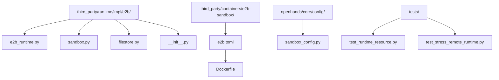
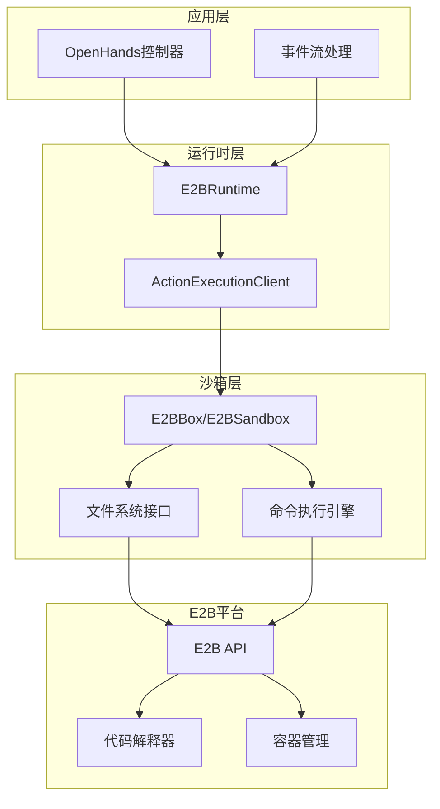
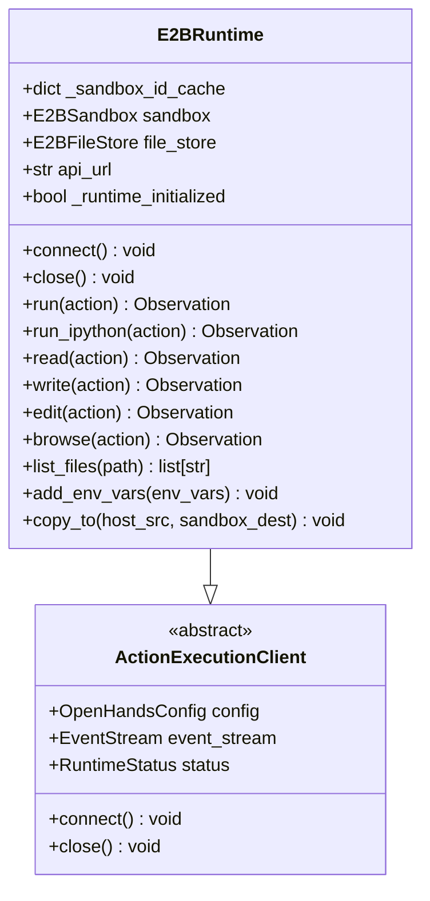
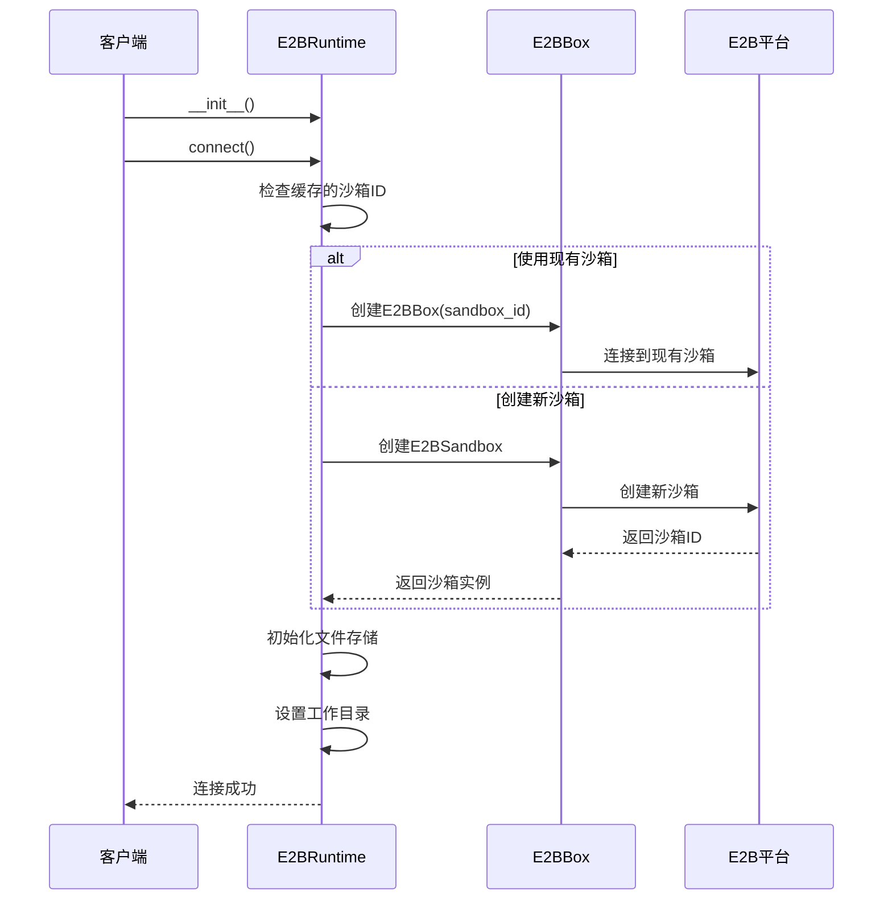
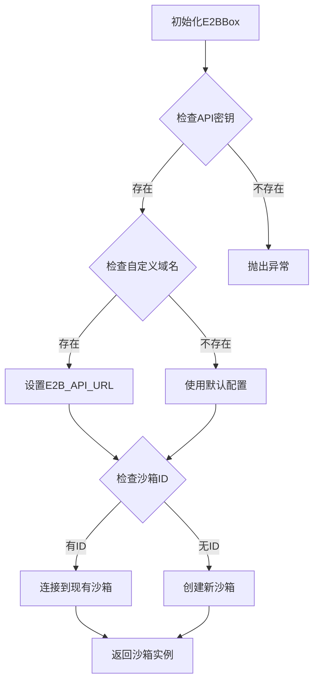
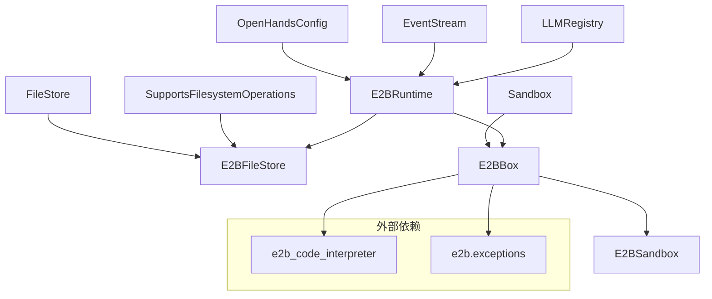
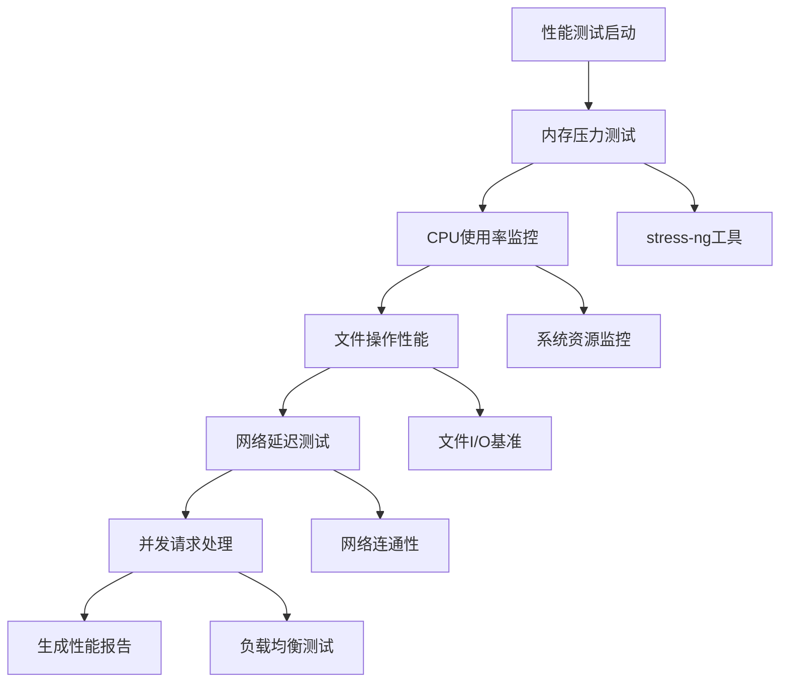
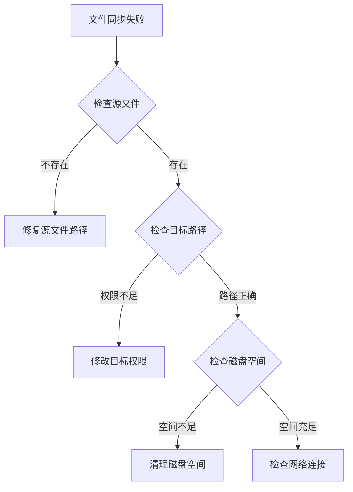

# E2B 集成

<cite>
**本文档中引用的文件**
- [e2b_runtime.py](file://third_party/runtime/impl/e2b/e2b_runtime.py)
- [sandbox.py](file://third_party/runtime/impl/e2b/sandbox.py)
- [filestore.py](file://third_party/runtime/impl/e2b/filestore.py)
- [e2b.toml](file://third_party/containers/e2b-sandbox/e2b.toml)
- [__init__.py](file://third_party/runtime/impl/e2b/__init__.py)
- [sandbox_config.py](file://openhands/core/config/sandbox_config.py)
- [test_runtime_resource.py](file://tests/runtime/test_runtime_resource.py)
- [test_stress_remote_runtime.py](file://tests/runtime/test_stress_remote_runtime.py)
</cite>

## 目录
1. [简介](#简介)
2. [项目结构](#项目结构)
3. [核心组件](#核心组件)
4. [架构概览](#架构概览)
5. [详细组件分析](#详细组件分析)
6. [依赖关系分析](#依赖关系分析)
7. [性能考虑](#性能考虑)
8. [故障排除指南](#故障排除指南)
9. [结论](#结论)

## 简介

E2B集成是OpenHands项目中的重要组成部分，提供了强大的沙箱管理和容器化执行环境。该集成通过E2B平台的代码解释器功能，为AI代理提供了安全、隔离的执行环境，支持文件操作、命令执行、浏览器访问等多种功能。

E2B集成的核心优势包括：
- 安全的容器化执行环境
- 持久化存储支持
- GPU加速能力
- 网络策略控制
- 资源限制管理
- 多种编程语言支持

## 项目结构

E2B集成在OpenHands项目中的组织结构如下：



**图表来源**
- [e2b_runtime.py](file://third_party/runtime/impl/e2b/e2b_runtime.py#L1-L403)
- [sandbox.py](file://third_party/runtime/impl/e2b/sandbox.py#L1-L153)
- [filestore.py](file://third_party/runtime/impl/e2b/filestore.py#L1-L28)

**章节来源**
- [e2b_runtime.py](file://third_party/runtime/impl/e2b/e2b_runtime.py#L1-L50)
- [sandbox.py](file://third_party/runtime/impl/e2b/sandbox.py#L1-L30)

## 核心组件

E2B集成包含以下核心组件：

### 1. E2BRuntime类
负责管理E2B沙箱的生命周期，提供命令执行、文件操作、环境变量管理等功能。

### 2. E2BBox/E2BSandbox类  
封装了E2B平台的沙箱操作，包括创建、连接、执行命令和文件传输。

### 3. E2BFileStore类  
实现了文件存储接口，提供文件的读写、列表和删除操作。

### 4. 配置系统
通过环境变量和配置文件管理E2B API密钥、域名等参数。

**章节来源**
- [e2b_runtime.py](file://third_party/runtime/impl/e2b/e2b_runtime.py#L39-L82)
- [sandbox.py](file://third_party/runtime/impl/e2b/sandbox.py#L13-L67)
- [filestore.py](file://third_party/runtime/impl/e2b/filestore.py#L13-L28)

## 架构概览

E2B集成的整体架构采用分层设计，确保了模块化和可扩展性：



**图表来源**
- [e2b_runtime.py](file://third_party/runtime/impl/e2b/e2b_runtime.py#L39-L152)
- [sandbox.py](file://third_party/runtime/impl/e2b/sandbox.py#L13-L152)

## 详细组件分析

### E2BRuntime类分析

E2BRuntime是E2B集成的核心类，继承自ActionExecutionClient，提供了完整的沙箱管理功能。

#### 主要特性



**图表来源**
- [e2b_runtime.py](file://third_party/runtime/impl/e2b/e2b_runtime.py#L39-L403)

#### 实例创建与销毁流程



**图表来源**
- [e2b_runtime.py](file://third_party/runtime/impl/e2b/e2b_runtime.py#L90-L147)
- [sandbox.py](file://third_party/runtime/impl/e2b/sandbox.py#L19-L62)

**章节来源**
- [e2b_runtime.py](file://third_party/runtime/impl/e2b/e2b_runtime.py#L90-L147)
- [sandbox.py](file://third_party/runtime/impl/e2b/sandbox.py#L19-L62)

### E2BBox沙箱管理

E2BBox类封装了E2B平台的沙箱操作，提供了统一的接口来管理沙箱生命周期。

#### 沙箱配置



**图表来源**
- [sandbox.py](file://third_party/runtime/impl/e2b/sandbox.py#L19-L62)

#### 文件传输机制

E2BBox实现了高效的文件传输机制，支持单个文件和递归目录复制：

```mermaid
sequenceDiagram
participant Host as 主机
participant Box as E2BBox
participant Archive as 归档文件
participant Sandbox as 沙箱
Host->>Box : copy_to(host_src, sandbox_dest)
Box->>Archive : 创建.tar归档
Box->>Sandbox : 上传归档文件
Box->>Sandbox : 解压到目标路径
Box->>Sandbox : 删除临时归档
Box->>Host : 清理本地归档
Box-->>Host : 传输完成
```

**图表来源**
- [sandbox.py](file://third_party/runtime/impl/e2b/sandbox.py#L112-L138)

**章节来源**
- [sandbox.py](file://third_party/runtime/impl/e2b/sandbox.py#L112-L138)

### 文件存储接口

E2BFileStore实现了FileStore协议，提供了标准化的文件操作接口：

#### 支持的操作

| 操作类型 | 方法 | 功能描述 |
|---------|------|----------|
| 写入 | `write(path, contents)` | 将内容写入指定路径 |
| 读取 | `read(path)` | 从指定路径读取内容 |
| 列表 | `list(path)` | 列出指定路径下的文件 |
| 删除 | `delete(path)` | 删除指定路径的文件 |

**章节来源**
- [filestore.py](file://third_party/runtime/impl/e2b/filestore.py#L13-L28)

## 依赖关系分析

E2B集成的依赖关系图展示了各组件之间的相互依赖：



**图表来源**
- [e2b_runtime.py](file://third_party/runtime/impl/e2b/e2b_runtime.py#L1-L35)
- [sandbox.py](file://third_party/runtime/impl/e2b/sandbox.py#L1-L8)

**章节来源**
- [e2b_runtime.py](file://third_party/runtime/impl/e2b/e2b_runtime.py#L1-L35)
- [sandbox.py](file://third_party/runtime/impl/e2b/sandbox.py#L1-L8)

## 性能考虑

### 资源限制设置

E2B集成支持多种资源限制配置：

#### 默认配置参数

| 参数 | 默认值 | 描述 |
|------|--------|------|
| 超时时间 | 120秒 | 命令执行超时时间 |
| 工作空间路径 | /workspace | 沙箱内工作目录 |
| 用户ID | 自动检测 | 容器内用户权限 |
| 网络模式 | 隔离 | 是否使用主机网络 |

#### 性能基准测试

系统提供了全面的性能测试框架，用于评估沙箱性能：



**图表来源**
- [test_stress_remote_runtime.py](file://tests/runtime/test_stress_remote_runtime.py#L251-L459)

**章节来源**
- [sandbox_config.py](file://openhands/core/config/sandbox_config.py#L49-L74)
- [test_stress_remote_runtime.py](file://tests/runtime/test_stress_remote_runtime.py#L251-L459)

### GPU支持优化

虽然当前版本主要关注CPU计算，但E2B平台支持GPU加速，可以通过以下方式优化AI代理任务：

1. **模型推理优化**：利用GPU加速大语言模型推理
2. **数据处理加速**：并行处理大量数据集
3. **图像处理优化**：加速视觉相关任务

## 故障排除指南

### 常见问题及解决方案

#### 1. 连接超时问题

**症状**：E2B沙箱连接失败或超时

**原因分析**：
- 网络连接不稳定
- API密钥无效或过期
- E2B服务不可用

**解决方案**：
```python
# 检查环境变量配置
import os
api_key = os.getenv("E2B_API_KEY")
domain = os.getenv("E2B_DOMAIN")

# 验证配置
assert api_key, "E2B_API_KEY环境变量未设置"
logger.info(f"使用E2B API密钥: {api_key[:8]}...")
if domain:
    logger.info(f"使用自定义域名: {domain}")
```

#### 2. 文件同步失败

**症状**：文件复制或传输过程中出现错误

**诊断步骤**：


**解决方案**：
- 验证源文件存在性和可读性
- 确认目标路径权限
- 检查可用磁盘空间
- 验证网络连接稳定性

#### 3. 内存不足问题

**症状**：长时间运行后出现内存溢出

**预防措施**：
```python
# 设置内存限制
config.sandbox.runtime_startup_env_vars = {
    'RUNTIME_MAX_MEMORY_GB': '4',
    'RUNTIME_MEMORY_MONITOR': 'true',
}

# 监控内存使用
def monitor_memory_usage():
    import psutil
    memory = psutil.virtual_memory()
    logger.info(f"内存使用率: {memory.percent}%")
    logger.info(f"可用内存: {memory.available / 1024**3:.2f}GB")
```

**章节来源**
- [sandbox.py](file://third_party/runtime/impl/e2b/sandbox.py#L27-L32)
- [test_runtime_resource.py](file://tests/runtime/test_runtime_resource.py#L41-L115)

### 日志记录和调试

E2B集成提供了详细的日志记录功能，帮助诊断问题：

```python
# 启用详细日志
import logging
logging.getLogger('third_party.runtime.impl.e2b').setLevel(logging.DEBUG)

# 关键日志点
logger.info(f"创建E2B沙箱: {sandbox_id}")
logger.warning(f"缓存沙箱失败: {cached_sandbox_id}")
logger.error(f"命令执行失败: {command}")
```

## 结论

E2B集成为OpenHands项目提供了强大而灵活的沙箱管理解决方案。通过其模块化的架构设计，系统能够：

1. **提供安全隔离的执行环境**：确保AI代理在受控环境中运行
2. **支持多样化的编程需求**：覆盖多种编程语言和工具链
3. **实现高效的资源管理**：通过配置系统优化资源使用
4. **具备良好的可扩展性**：支持自定义配置和第三方集成

随着AI代理任务复杂度的增加，E2B集成将继续发挥重要作用，特别是在需要高性能计算和大规模数据处理的场景中。通过持续的性能优化和功能增强，E2B集成将为OpenHands生态系统提供更加稳定和高效的服务。