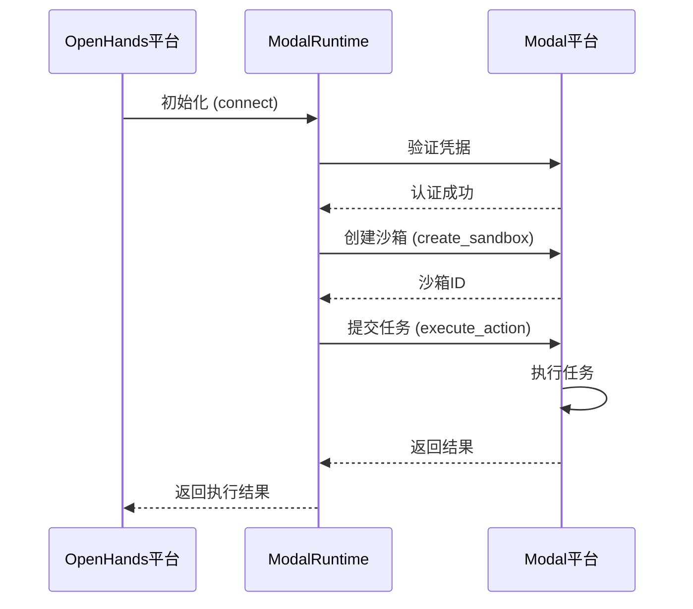
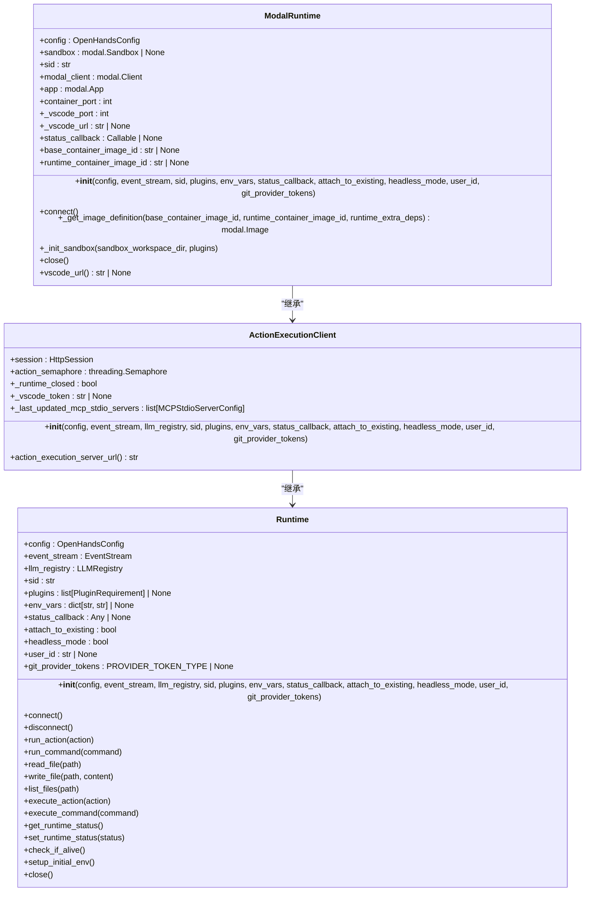
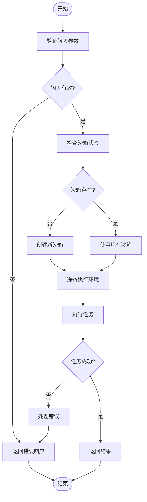
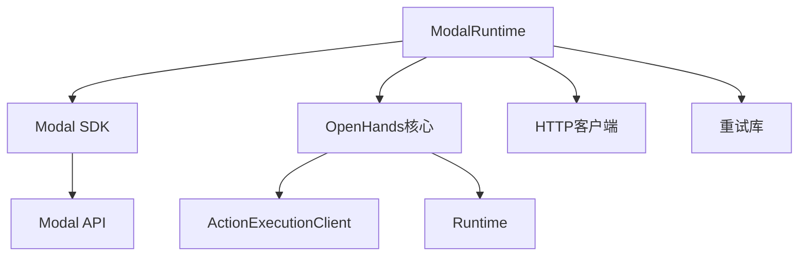

# Modal 集成

<cite>
**本文档引用的文件**   
- [modal_runtime.py](file://third_party/runtime/impl/modal/modal_runtime.py)
- [__init__.py](file://third_party/runtime/impl/modal/__init__.py)
</cite>

## 目录
1. [介绍](#介绍)
2. [项目结构](#项目结构)
3. [核心组件](#核心组件)
4. [架构概述](#架构概述)
5. [详细组件分析](#详细组件分析)
6. [依赖分析](#依赖分析)
7. [性能考虑](#性能考虑)
8. [故障排除指南](#故障排除指南)
9. [结论](#结论)
10. [附录](#附录) (如有必要)

## 介绍
Modal 集成文档详细阐述了OpenHands平台如何利用Modal平台的无服务器计算能力。文档重点介绍了modal_runtime.py中实现的无服务器函数调用模型、异步任务提交与结果轮询机制。同时说明了Modal App的部署配置、Secrets管理、GPU资源申请和费用控制策略。通过从本地开发到生产部署的完整工作流示例，帮助开发者高效利用Modal的弹性计算能力。

## 项目结构
OpenHands项目中的Modal集成主要位于third_party/runtime/impl/modal目录下。该集成通过Modal平台的API实现无服务器计算功能，为OpenHands提供弹性计算资源。核心文件包括modal_runtime.py和__init__.py，其中实现了与Modal平台的连接、沙箱环境管理、任务执行和资源控制等功能。

```mermaid
graph TD
subgraph "Modal 集成"
modal_runtime[modal_runtime.py]
init_py[__init__.py]
end
subgraph "OpenHands 核心"
action_execution_client[ActionExecutionClient]
runtime_base[Runtime]
end
modal_runtime --> action_execution_client : "继承"
modal_runtime --> runtime_base : "继承"
init_py --> modal_runtime : "导入"
```

**Diagram sources**
- [modal_runtime.py](file://third_party/runtime/impl/modal/modal_runtime.py)
- [__init__.py](file://third_party/runtime/impl/modal/__init__.py)

**Section sources**
- [modal_runtime.py](file://third_party/runtime/impl/modal/modal_runtime.py)
- [__init__.py](file://third_party/runtime/impl/modal/__init__.py)

## 核心组件
Modal集成的核心是ModalRuntime类，它继承自ActionExecutionClient，实现了与Modal平台的交互。该类负责管理Modal沙箱环境的生命周期，包括创建、连接、执行任务和终止。通过环境变量MODAL_TOKEN_ID和MODAL_TOKEN_SECRET进行身份验证，确保安全访问Modal平台资源。

**Section sources**
- [modal_runtime.py](file://third_party/runtime/impl/modal/modal_runtime.py)

## 架构概述
Modal集成的架构基于无服务器计算模型，通过Modal平台的API创建和管理沙箱环境。当需要执行任务时，系统会创建一个Modal沙箱，加载必要的依赖项，并在其中运行任务。任务完成后，沙箱可以被终止以节省资源，或保持运行以减少后续任务的冷启动时间。



**Diagram sources**
- [modal_runtime.py](file://third_party/runtime/impl/modal/modal_runtime.py)

## 详细组件分析

### ModalRuntime 分析
ModalRuntime是Modal集成的核心组件，负责管理与Modal平台的交互。它通过Modal SDK创建和管理沙箱环境，并在其中执行OpenHands的任务。

#### 类结构分析


**Diagram sources**
- [modal_runtime.py](file://third_party/runtime/impl/modal/modal_runtime.py)

### 无服务器函数调用模型
Modal集成实现了基于无服务器架构的函数调用模型，通过Modal平台的沙箱环境执行任务。这种模型具有弹性伸缩、按需付费和高可用性等优势。

#### 函数调用流程


**Diagram sources**
- [modal_runtime.py](file://third_party/runtime/impl/modal/modal_runtime.py)

## 依赖分析
Modal集成依赖于Modal SDK和OpenHands的核心组件。通过这些依赖，实现了与Modal平台的无缝集成和任务执行能力。



**Diagram sources**
- [modal_runtime.py](file://third_party/runtime/impl/modal/modal_runtime.py)

## 性能考虑
Modal集成在性能方面主要考虑冷启动时间、任务执行效率和资源利用率。通过预热沙箱和优化依赖加载，可以显著减少冷启动时间，提高任务执行效率。

## 故障排除指南
当遇到Modal集成问题时，首先检查环境变量MODAL_TOKEN_ID和MODAL_TOKEN_SECRET是否正确设置。其次，查看日志中的错误信息，特别是沙箱创建和任务执行过程中的错误。如果遇到网络问题，可以增加重试次数和超时时间。

**Section sources**
- [modal_runtime.py](file://third_party/runtime/impl/modal/modal_runtime.py)

## 结论
Modal集成通过无服务器架构为OpenHands提供了强大的弹性计算能力。通过合理的配置和优化，开发者可以高效利用Modal平台的资源，实现高性能的任务执行。未来可以进一步优化冷启动性能，增加对更多GPU类型的支持，并完善费用监控和控制功能。