# Runloop 集成

<cite>
**本文档中引用的文件**
- [runloop_runtime.py](file://third_party/runtime/impl/runloop/runloop_runtime.py)
- [__init__.py](file://third_party/runtime/impl/runloop/__init__.py)
- [README.md](file://third_party/runtime/impl/runloop/README.md)
- [runtime_status.py](file://openhands/runtime/runtime_status.py)
- [action_execution_client.py](file://openhands/runtime/impl/action_execution/action_execution_client.py)
- [task_tracker.py](file://openhands/agenthub/codeact_agent/tools/task_tracker.py)
- [error.py](file://openhands/events/observation/error.py)
</cite>

## 目录
1. [简介](#简介)
2. [项目结构](#项目结构)
3. [核心组件](#核心组件)
4. [架构概览](#架构概览)
5. [详细组件分析](#详细组件分析)
6. [依赖关系分析](#依赖关系分析)
7. [性能考虑](#性能考虑)
8. [故障排除指南](#故障排除指南)
9. [结论](#结论)

## 简介

Runloop集成是OpenHands平台中的一个重要组成部分，它提供了基于Runloop Devbox的自动化代理协调机制。Runloop是一个快速、安全且可扩展的AI沙箱环境，为OpenHands的智能代理提供了强大的运行时基础设施。

该集成系统实现了以下核心功能：
- 自动化代理协调机制
- 任务队列管理和状态同步协议
- Runloop API访问令牌配置
- 代理工作流管道定义
- 错误恢复策略
- 进度跟踪
- 跨平台数据交换

## 项目结构

Runloop集成的核心文件位于第三方运行时实现目录中：

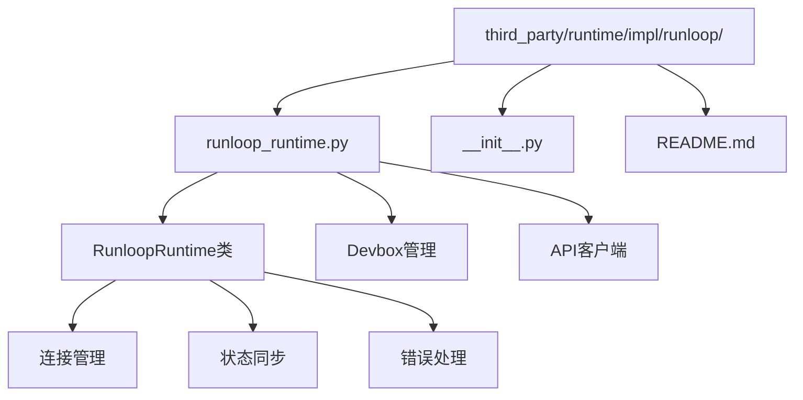

**图表来源**
- [runloop_runtime.py](file://third_party/runtime/impl/runloop/runloop_runtime.py#L1-L206)
- [__init__.py](file://third_party/runtime/impl/runloop/__init__.py#L1-L6)

**章节来源**
- [runloop_runtime.py](file://third_party/runtime/impl/runloop/runloop_runtime.py#L1-L206)
- [README.md](file://third_party/runtime/impl/runloop/README.md#L1-L32)

## 核心组件

### RunloopRuntime类

RunloopRuntime是Runloop集成的核心类，继承自ActionExecutionClient，负责管理Runloop Devbox的生命周期和与OpenHands代理的交互。

#### 主要特性
- **Devbox生命周期管理**：创建、启动、监控和关闭Runloop Devbox
- **API客户端集成**：与Runloop API进行安全通信
- **状态同步**：维护运行时状态并提供状态回调机制
- **错误恢复**：实现重试机制和错误恢复策略

#### 关键配置参数
- `RUNLOOP_API_KEY`：Runloop API访问令牌
- `sid`：会话标识符
- `headless_mode`：无头模式控制
- `attach_to_existing`：附加到现有Devbox

**章节来源**
- [runloop_runtime.py](file://third_party/runtime/impl/runloop/runloop_runtime.py#L25-L68)

## 架构概览

Runloop集成采用分层架构设计，确保了系统的模块化和可扩展性：

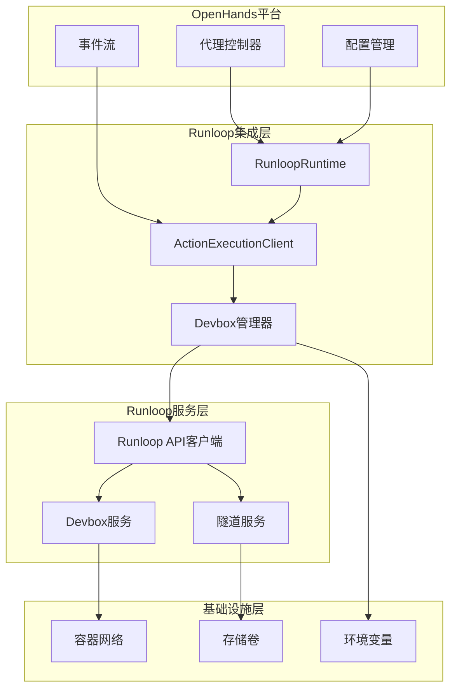

**图表来源**
- [runloop_runtime.py](file://third_party/runtime/impl/runloop/runloop_runtime.py#L25-L68)
- [action_execution_client.py](file://openhands/runtime/impl/action_execution/action_execution_client.py#L61-L100)

## 详细组件分析

### 自动化代理协调机制

RunloopRuntime实现了复杂的自动化代理协调机制，通过以下方式确保代理的高效运行：

#### 连接管理流程

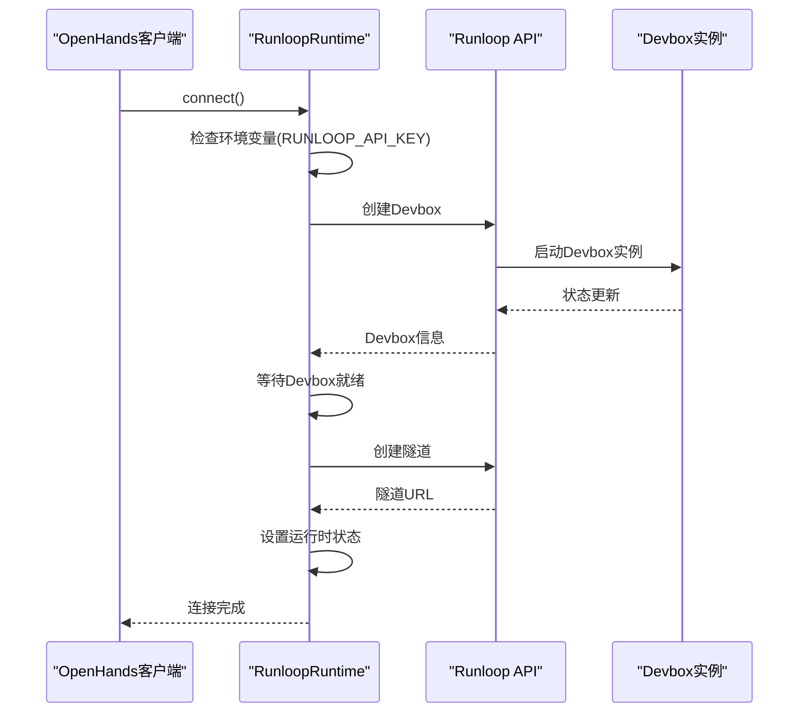

**图表来源**
- [runloop_runtime.py](file://third_party/runtime/impl/runloop/runloop_runtime.py#L129-L164)

#### 状态同步协议

系统实现了多级状态同步机制：

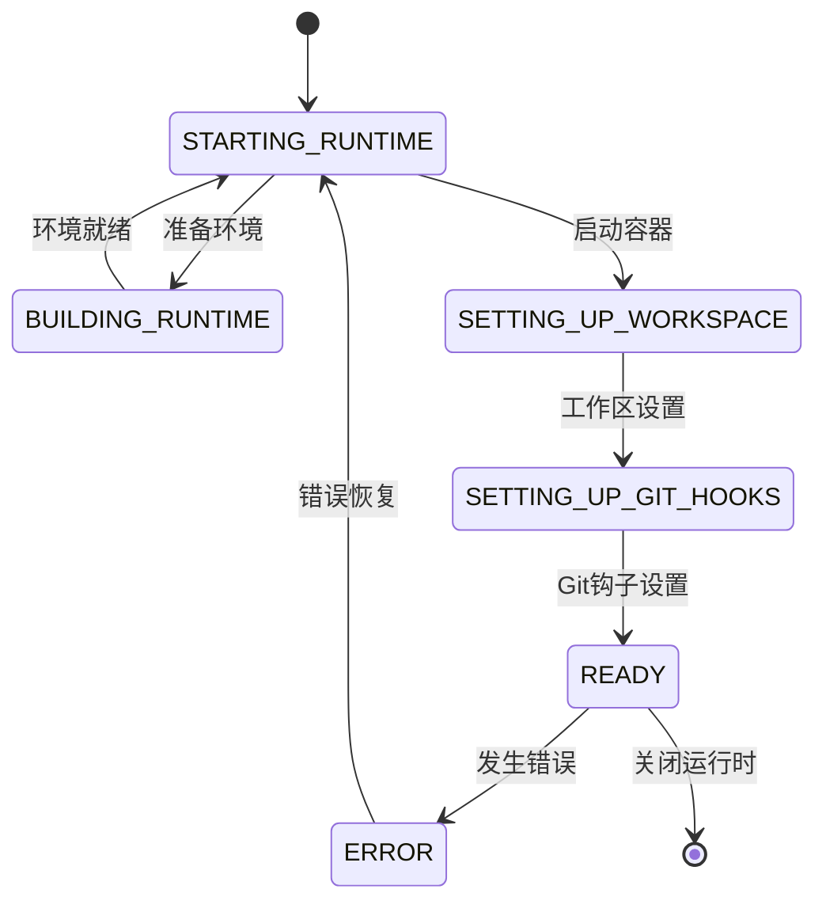

**图表来源**
- [runtime_status.py](file://openhands/runtime/runtime_status.py#L4-L25)

**章节来源**
- [runloop_runtime.py](file://third_party/runtime/impl/runloop/runloop_runtime.py#L129-L164)
- [runtime_status.py](file://openhands/runtime/runtime_status.py#L4-L25)

### 任务队列管理

虽然Runloop本身不直接提供任务队列功能，但通过ActionExecutionClient实现了类似的任务管理机制：

#### 并发控制机制

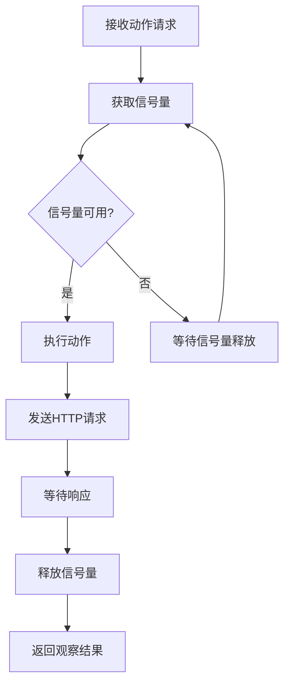

**图表来源**
- [action_execution_client.py](file://openhands/runtime/impl/action_execution/action_execution_client.py#L82-L84)

#### 动作执行流程

系统支持多种类型的动作执行，包括命令运行、IPython单元格执行等：

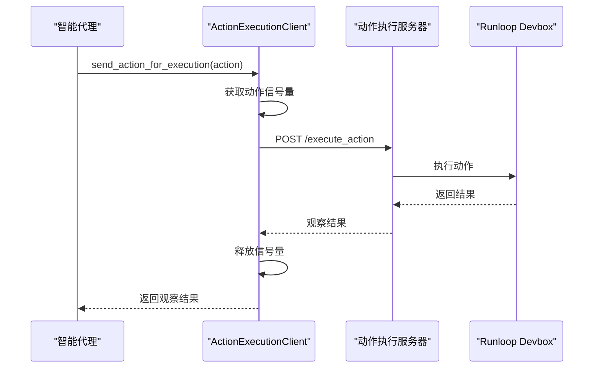

**图表来源**
- [action_execution_client.py](file://openhands/runtime/impl/action_execution/action_execution_client.py#L317-L342)

**章节来源**
- [action_execution_client.py](file://openhands/runtime/impl/action_execution/action_execution_client.py#L61-L348)

### 状态同步协议

#### 运行时状态管理

系统定义了完整的运行时状态枚举，确保状态的一致性和可预测性：

| 状态值 | 描述 | 使用场景 |
|--------|------|----------|
| STOPPED | 停止状态 | 运行时未启动或已关闭 |
| BUILDING_RUNTIME | 构建运行时 | 正在准备运行时环境 |
| STARTING_RUNTIME | 启动运行时 | 正在启动运行时实例 |
| RUNTIME_STARTED | 运行时已启动 | 运行时正在运行 |
| SETTING_UP_WORKSPACE | 设置工作区 | 正在配置工作区环境 |
| SETTING_UP_GIT_HOOKS | 设置Git钩子 | 正在配置Git集成 |
| READY | 就绪状态 | 运行时完全准备好接受请求 |
| ERROR | 错误状态 | 发生严重错误 |
| ERROR_RUNTIME_DISCONNECTED | 运行时断开连接 | 运行时连接丢失 |

#### 错误恢复策略

系统实现了多层次的错误恢复机制：

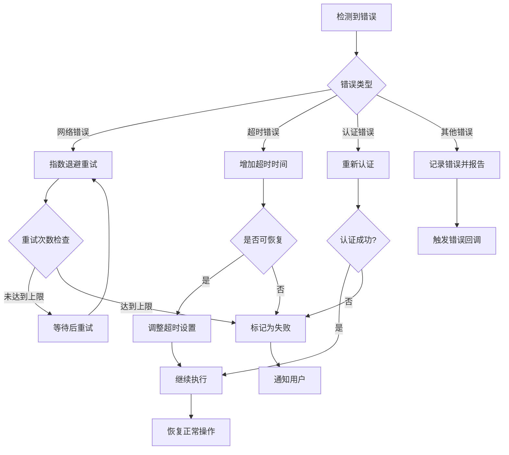

**图表来源**
- [runloop_runtime.py](file://third_party/runtime/impl/runloop/runloop_runtime.py#L76-L91)
- [action_execution_client.py](file://openhands/runtime/impl/action_execution/action_execution_client.py#L55-L67)

**章节来源**
- [runtime_status.py](file://openhands/runtime/runtime_status.py#L4-L25)
- [runloop_runtime.py](file://third_party/runtime/impl/runloop/runloop_runtime.py#L76-L91)

### Runloop API访问令牌配置

#### 环境变量配置

Runloop集成通过环境变量进行配置，确保安全性：

```python
# 必需的环境变量
RUNLOOP_API_KEY = os.getenv("RUNLOOP_API_KEY")

# 验证配置
if not runloop_api_key:
    raise ValueError(
        "RUNLOOP_API_KEY environment variable is required for Runloop runtime"
    )
```

#### 安全最佳实践

1. **密钥管理**：使用环境变量存储API密钥
2. **权限控制**：限制API密钥的访问范围
3. **审计日志**：记录API调用和错误信息
4. **超时处理**：设置合理的请求超时时间

**章节来源**
- [runloop_runtime.py](file://third_party/runtime/impl/runloop/runloop_runtime.py#L44-L49)
- [__init__.py](file://third_party/runtime/impl/runloop/__init__.py#L3-L5)

### 代理工作流管道

#### 工作流定义

Runloop集成支持多种类型的代理工作流：

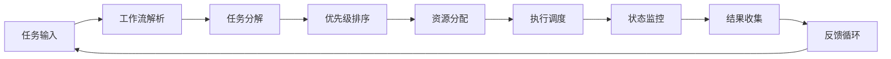

#### 任务跟踪机制

系统集成了任务跟踪工具，支持以下功能：

- **状态管理**：todo、in_progress、done三种状态
- **动态更新**：实时跟踪任务进展
- **依赖管理**：处理任务间的依赖关系
- **错误处理**：自动识别和处理任务失败

**章节来源**
- [task_tracker.py](file://openhands/agenthub/codeact_agent/tools/task_tracker.py#L103-L146)

### 跨平台数据交换

#### 数据传输协议

Runloop集成实现了标准化的数据交换协议：

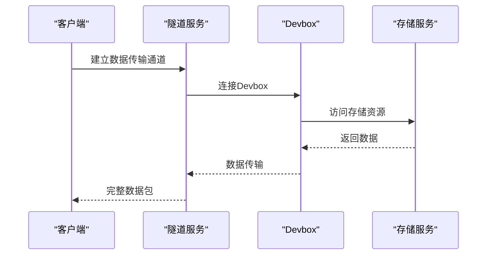

#### 数据格式标准化

系统支持多种数据格式的转换和传输：

- **JSON格式**：用于配置和元数据交换
- **二进制数据**：用于大文件传输
- **流式传输**：用于实时数据流
- **压缩传输**：优化带宽使用

### 错误恢复策略

#### 多层次错误处理

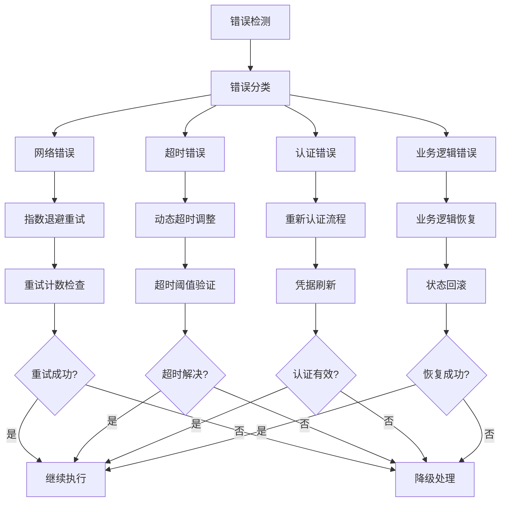

**图表来源**
- [runloop_runtime.py](file://third_party/runtime/impl/runloop/runloop_runtime.py#L76-L91)
- [action_execution_client.py](file://openhands/runtime/impl/action_execution/action_execution_client.py#L55-L67)

#### VSCode集成支持

Runloop还提供了VSCode集成功能，支持远程开发：

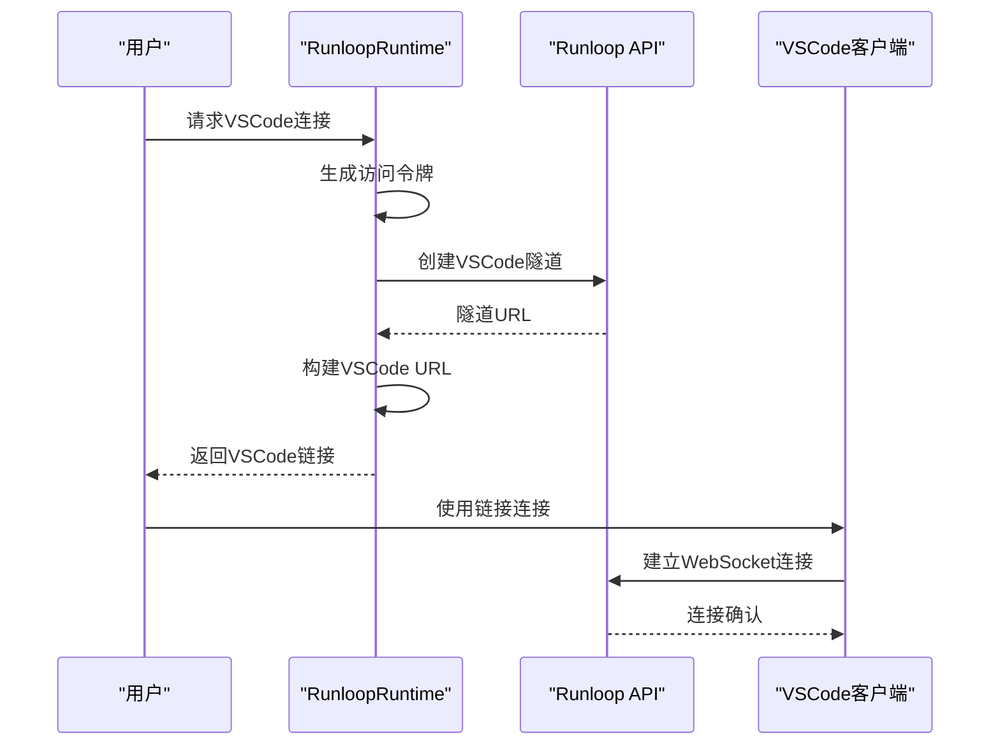

**图表来源**
- [runloop_runtime.py](file://third_party/runtime/impl/runloop/runloop_runtime.py#L184-L205)

**章节来源**
- [runloop_runtime.py](file://third_party/runtime/impl/runloop/runloop_runtime.py#L184-L205)

## 依赖关系分析

### 核心依赖关系图

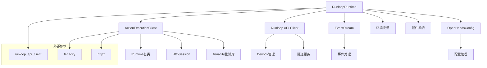

**图表来源**
- [runloop_runtime.py](file://third_party/runtime/impl/runloop/runloop_runtime.py#L1-L20)
- [action_execution_client.py](file://openhands/runtime/impl/action_execution/action_execution_client.py#L1-L20)

### 第三方库依赖

| 库名称 | 版本要求 | 用途 |
|--------|----------|------|
| runloop_api_client | 最新版本 | Runloop API客户端 |
| tenacity | >=8.0.0 | 重试机制 |
| httpx | >=0.24.0 | HTTP客户端 |
| pydantic | >=1.10.0 | 数据验证 |

**章节来源**
- [runloop_runtime.py](file://third_party/runtime/impl/runloop/runloop_runtime.py#L1-L20)

## 性能考虑

### 并发处理优化

1. **信号量控制**：使用信号量确保同时只有一个动作被执行
2. **异步处理**：支持异步动作执行
3. **连接池**：复用HTTP连接减少开销
4. **缓存机制**：缓存频繁访问的数据

### 内存管理

- **对象池**：重用常用对象减少GC压力
- **流式处理**：大文件采用流式处理避免内存溢出
- **垃圾回收**：及时清理不再使用的资源

### 网络优化

- **连接复用**：使用HTTP/2连接复用
- **压缩传输**：启用gzip压缩减少传输量
- **超时设置**：合理设置超时避免长时间等待

## 故障排除指南

### 常见问题及解决方案

#### API密钥配置问题

**问题描述**：RUNLOOP_API_KEY环境变量未正确设置

**解决方案**：
1. 检查环境变量是否已设置
2. 验证API密钥的有效性
3. 确认密钥具有必要的权限

#### Devbox启动失败

**问题描述**：Devbox无法正常启动

**诊断步骤**：
1. 检查网络连接
2. 验证API密钥有效性
3. 查看Runloop仪表板状态
4. 检查资源配额限制

#### 连接超时问题

**问题描述**：与Runloop服务的连接超时

**解决方案**：
1. 增加超时时间设置
2. 检查防火墙设置
3. 验证网络稳定性

#### 任务执行失败

**问题描述**：动作执行过程中出现错误

**排查方法**：
1. 检查动作参数的有效性
2. 验证Devbox状态
3. 查看详细的错误日志
4. 检查资源使用情况

**章节来源**
- [runloop_runtime.py](file://third_party/runtime/impl/runloop/runloop_runtime.py#L44-L49)
- [runloop_runtime.py](file://third_party/runtime/impl/runloop/runloop_runtime.py#L76-L91)

### 日志和监控

系统提供了完善的日志记录和监控功能：

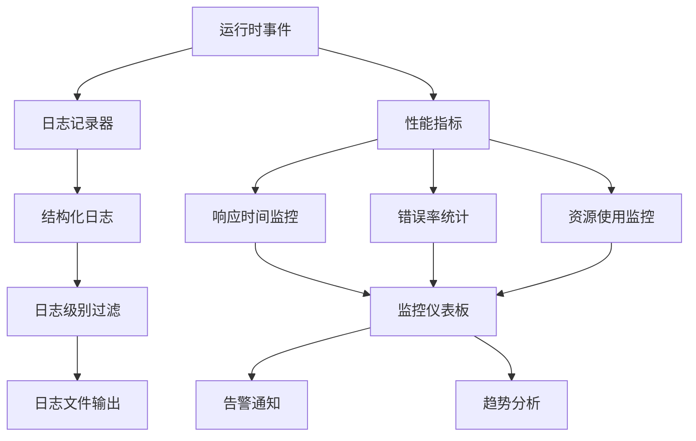

## 结论

Runloop集成为OpenHands平台提供了强大而灵活的自动化代理协调机制。通过其先进的Devbox技术、可靠的状态同步协议和完善的错误恢复策略，该集成能够支持复杂的AI代理工作负载。

### 主要优势

1. **高性能**：基于Runloop Devbox的快速沙箱环境
2. **可靠性**：多重错误恢复和状态同步机制
3. **可扩展性**：支持大规模并发执行
4. **安全性**：完善的API密钥管理和访问控制
5. **易用性**：简化的配置和部署流程

### 未来发展方向

- **性能优化**：进一步提升执行效率和资源利用率
- **功能扩展**：支持更多类型的代理工作流
- **监控增强**：提供更详细的性能监控和分析
- **集成深化**：与其他平台的深度集成

Runloop集成代表了现代AI代理运行时的一个重要发展方向，为构建可靠的自动化系统奠定了坚实的基础。