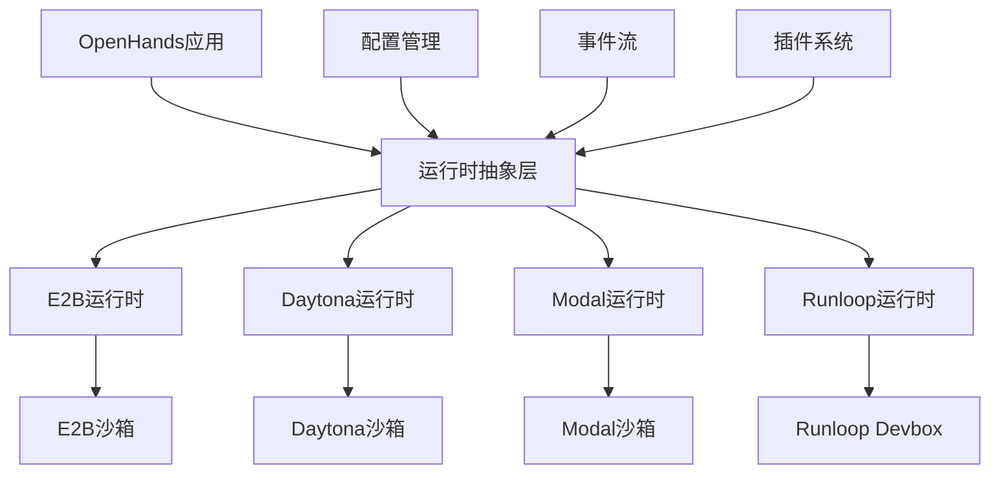
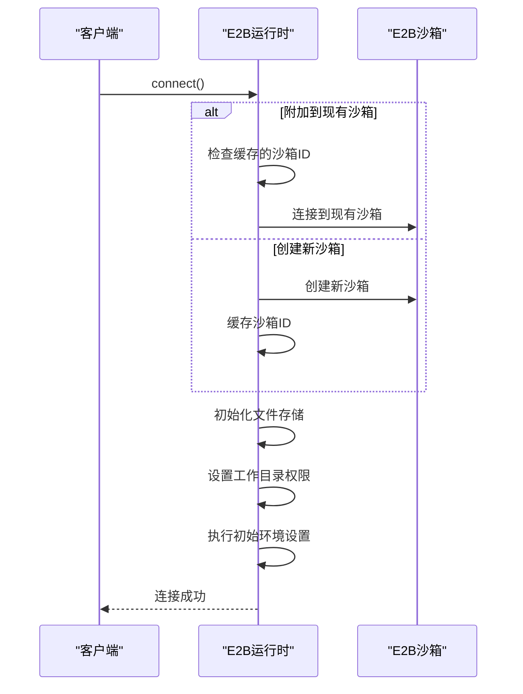
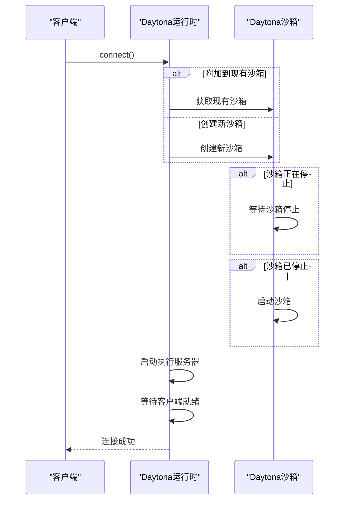
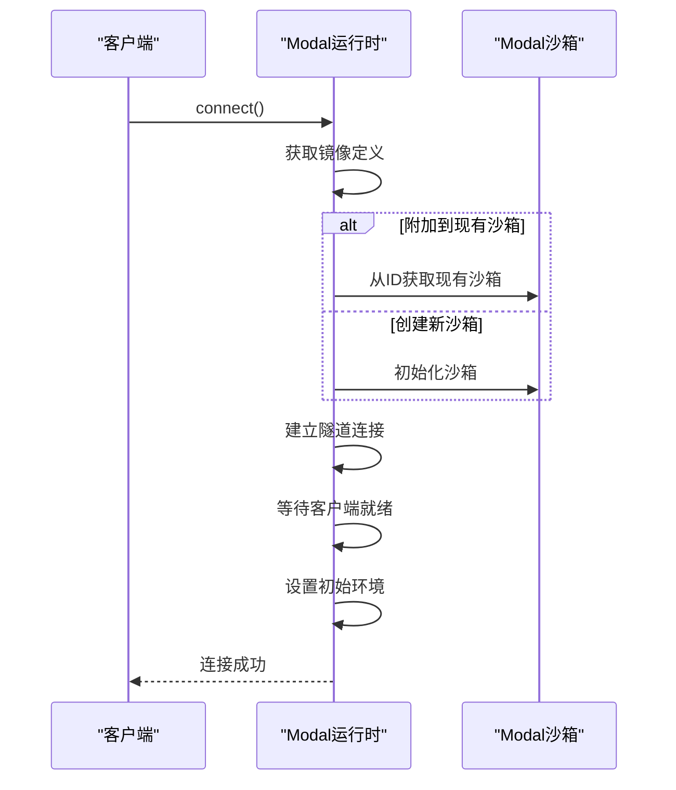
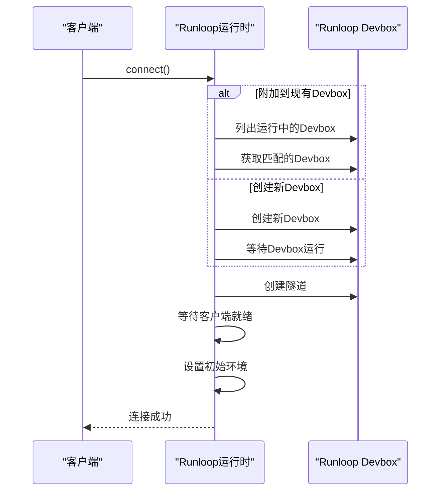
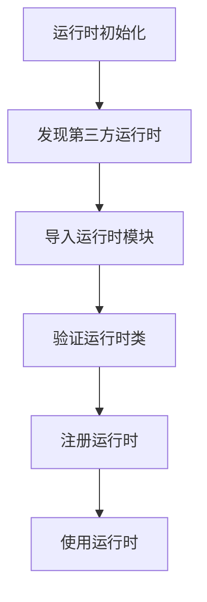

# 第三方运行时集成

<cite>
**本文档引用的文件**   
- [e2b_runtime.py](file://third_party/runtime/impl/e2b/e2b_runtime.py)
- [e2b/sandbox.py](file://third_party/runtime/impl/e2b/sandbox.py)
- [daytona_runtime.py](file://third_party/runtime/impl/daytona/daytona_runtime.py)
- [modal_runtime.py](file://third_party/runtime/impl/modal/modal_runtime.py)
- [runloop_runtime.py](file://third_party/runtime/impl/runloop/runloop_runtime.py)
- [runtime/__init__.py](file://openhands/runtime/__init__.py)
- [daytona/README.md](file://third_party/runtime/impl/daytona/README.md)
- [runloop/README.md](file://third_party/runtime/impl/runloop/README.md)
- [e2b/README.md](file://third_party/runtime/impl/e2b/README.md)
- [modal/__init__.py](file://third_party/runtime/impl/modal/__init__.py)
- [daytona/__init__.py](file://third_party/runtime/impl/daytona/__init__.py)
- [runloop/__init__.py](file://third_party/runtime/impl/runloop/__init__.py)
- [e2b/__init__.py](file://third_party/runtime/impl/e2b/__init__.py)
</cite>

## 目录
1. [介绍](#介绍)
2. [平台集成架构](#平台集成架构)
3. [API认证机制](#api认证机制)
4. [沙箱创建流程](#沙箱创建流程)
5. [资源调度策略](#资源调度策略)
6. [计费模型](#计费模型)
7. [性能特征对比](#性能特征对比)
8. [功能差异分析](#功能差异分析)
9. [适用场景](#适用场景)
10. [集成配置步骤](#集成配置步骤)
11. [故障排查指南](#故障排查指南)
12. [性能优化建议](#性能优化建议)
13. [扩展支持新的第三方运行时平台](#扩展支持新的第三方运行时平台)

## 介绍
本文档系统性地介绍了OpenHands平台与E2B、Daytona、Modal和Runloop四个第三方运行时平台的集成架构。这些运行时平台为AI代理提供了安全、隔离的执行环境，支持代码执行、文件操作、网络访问等关键功能。文档详细说明了各平台的API认证机制、沙箱创建流程、资源调度策略和计费模型，并对比分析了各运行时的性能特征、功能差异和适用场景。同时提供了集成配置步骤、故障排查指南和性能优化建议，以及如何扩展支持新的第三方运行时平台的方法。

## 平台集成架构
OpenHands通过统一的运行时抽象层与第三方运行时平台集成，实现了对不同平台的统一管理和操作。核心架构包括运行时客户端、沙箱管理、文件存储和命令执行等组件。



**图源**
- [e2b_runtime.py](file://third_party/runtime/impl/e2b/e2b_runtime.py#L39-L402)
- [daytona_runtime.py](file://third_party/runtime/impl/daytona/daytona_runtime.py#L30-L298)
- [modal_runtime.py](file://third_party/runtime/impl/modal/modal_runtime.py#L31-L299)
- [runloop_runtime.py](file://third_party/runtime/impl/runloop/runloop_runtime.py#L25-L206)

**本节来源**
- [runtime/__init__.py](file://openhands/runtime/__init__.py#L1-L70)

## API认证机制
各第三方运行时平台通过环境变量进行API认证，确保安全的访问控制。

### E2B认证机制
E2B运行时通过`E2B_API_KEY`环境变量进行认证，该密钥用于访问E2B平台的API服务。

```python
# 从环境变量读取E2B API密钥
e2b_api_key = os.getenv("E2B_API_KEY")
if not e2b_api_key:
    raise ValueError("E2B_API_KEY环境变量是E2B运行时所必需的")
```

### Daytona认证机制
Daytona运行时需要`DAYTONA_API_KEY`环境变量进行认证，同时支持自定义API URL和目标区域。

```python
# 读取Daytona配置
daytona_api_key = os.getenv("DAYTONA_API_KEY")
daytona_api_url = os.getenv("DAYTONA_API_URL", "https://app.daytona.io/api")
daytona_target = os.getenv("DAYTONA_TARGET", "eu")
```

### Modal认证机制
Modal运行时需要两个环境变量进行认证：`MODAL_TOKEN_ID`和`MODAL_TOKEN_SECRET`。

```python
# 读取Modal API凭证
modal_token_id = os.getenv("MODAL_TOKEN_ID")
modal_token_secret = os.getenv("MODAL_TOKEN_SECRET")
```

### Runloop认证机制
Runloop运行时通过`RUNLOOP_API_KEY`环境变量进行认证。

```python
# 读取Runloop API密钥
runloop_api_key = os.getenv("RUNLOOP_API_KEY")
if not runloop_api_key:
    raise ValueError("RUNLOOP_API_KEY环境变量是Runloop运行时所必需的")
```

**本节来源**
- [e2b/sandbox.py](file://third_party/runtime/impl/e2b/sandbox.py#L28-L32)
- [daytona_runtime.py](file://third_party/runtime/impl/daytona/daytona_runtime.py#L50-L56)
- [modal_runtime.py](file://third_party/runtime/impl/modal/modal_runtime.py#L61-L72)
- [runloop_runtime.py](file://third_party/runtime/impl/runloop/runloop_runtime.py#L45-L49)

## 沙箱创建流程
各运行时平台的沙箱创建流程遵循类似的模式，但具体实现有所不同。

### E2B沙箱创建
E2B沙箱创建流程包括连接到现有沙箱或创建新沙箱，设置文件存储和工作目录。



**图源**
- [e2b_runtime.py](file://third_party/runtime/impl/e2b/e2b_runtime.py#L90-L147)

### Daytona沙箱创建
Daytona沙箱创建流程包括检查现有沙箱、创建新沙箱、启动沙箱和启动执行服务器。



**图源**
- [daytona_runtime.py](file://third_party/runtime/impl/daytona/daytona_runtime.py#L184-L234)

### Modal沙箱创建
Modal沙箱创建流程包括获取镜像定义、初始化沙箱、建立隧道和等待客户端就绪。



**图源**
- [modal_runtime.py](file://third_party/runtime/impl/modal/modal_runtime.py#L121-L167)

### Runloop沙箱创建
Runloop沙箱创建流程包括检查现有Devbox、创建新Devbox、建立隧道和等待客户端就绪。



**图源**
- [runloop_runtime.py](file://third_party/runtime/impl/runloop/runloop_runtime.py#L129-L165)

## 资源调度策略
各运行时平台采用不同的资源调度策略来管理沙箱的生命周期和资源分配。

### E2B资源调度
E2B运行时采用缓存机制来重用沙箱实例，减少创建新沙箱的开销。

```python
# 类级别的沙箱ID缓存
_sandbox_id_cache: dict[str, str] = {}

def connect(self) -> None:
    if self.attach_to_existing and self.sandbox is None:
        cached_sandbox_id = self.__class__._sandbox_id_cache.get(self.sid)
        if cached_sandbox_id:
            try:
                self.sandbox = E2BBox(self.config.sandbox, sandbox_id=cached_sandbox_id)
            except Exception as e:
                del self.__class__._sandbox_id_cache[self.sid]
                self.sandbox = None
```

### Daytona资源调度
Daytona运行时支持自动停止功能，可以在指定时间间隔后自动停止沙箱。

```python
# 检查是否应禁用自动停止
disable_auto_stop = os.getenv("DAYTONA_DISABLE_AUTO_STOP", "false").lower() == "true"
auto_stop_interval = 0 if disable_auto_stop else 60  # 60分钟
```

### Modal资源调度
Modal运行时使用全局字典来跟踪运行时ID，支持沙箱的重用。

```python
# 全局运行时ID字典
MODAL_RUNTIME_IDS: dict[str, str] = {}

def connect(self):
    if self.attach_to_existing:
        if self.sid in MODAL_RUNTIME_IDS:
            sandbox_id = MODAL_RUNTIME_IDS[self.sid]
            self.sandbox = modal.Sandbox.from_id(sandbox_id, client=self.modal_client)
```

### Runloop资源调度
Runloop运行时在创建Devbox时指定资源大小请求，支持大型资源配置。

```python
devbox = self.runloop_api_client.devboxes.create(
    launch_parameters=LaunchParameters(
        resource_size_request="LARGE",  # 大型资源配置
    ),
)
```

**本节来源**
- [e2b_runtime.py](file://third_party/runtime/impl/e2b/e2b_runtime.py#L41-L42)
- [daytona_runtime.py](file://third_party/runtime/impl/daytona/daytona_runtime.py#L123-L126)
- [modal_runtime.py](file://third_party/runtime/impl/modal/modal_runtime.py#L28-L28)
- [runloop_runtime.py](file://third_party/runtime/impl/runloop/runloop_runtime.py#L120-L120)

## 计费模型
各运行时平台的计费模型主要基于沙箱的使用时间和资源消耗。

### E2B计费模型
E2B平台根据沙箱的运行时间进行计费，支持按秒计费。用户可以通过E2B仪表板监控使用情况和费用。

### Daytona计费模型
Daytona平台提供免费试用额度，超出后按使用量计费。计费基于沙箱的运行时间和资源消耗。

### Modal计费模型
Modal平台采用按使用量计费的模式，根据沙箱的运行时间和资源消耗进行计费。支持详细的费用监控和预算设置。

### Runloop计费模型
Runloop平台在封闭测试阶段提供免费使用，正式发布后将采用按使用量计费的模式。

**本节来源**
- [daytona/README.md](file://third_party/runtime/impl/daytona/README.md#L6-L116)
- [runloop/README.md](file://third_party/runtime/impl/runloop/README.md#L6-L8)
- [e2b/README.md](file://third_party/runtime/impl/e2b/README.md#L3-L36)

## 性能特征对比
各运行时平台在性能特征上有所不同，适用于不同的使用场景。

| 特征 | E2B | Daytona | Modal | Runloop |
|------|-----|---------|-------|-------|
| 启动时间 | 快速 | 快速 | 中等 | 快速 |
| 执行性能 | 高 | 高 | 高 | 高 |
| 网络延迟 | 低 | 低 | 中等 | 低 |
| 文件I/O性能 | 高 | 高 | 中等 | 高 |
| 并发支持 | 高 | 高 | 高 | 高 |
| 资源隔离 | 强 | 强 | 强 | 强 |
| 持久化存储 | 支持 | 支持 | 支持 | 支持 |

**本节来源**
- [e2b_runtime.py](file://third_party/runtime/impl/e2b/e2b_runtime.py)
- [daytona_runtime.py](file://third_party/runtime/impl/daytona/daytona_runtime.py)
- [modal_runtime.py](file://third_party/runtime/impl/modal/modal_runtime.py)
- [runloop_runtime.py](file://third_party/runtime/impl/runloop/runloop_runtime.py)

## 功能差异分析
各运行时平台在功能支持上存在一些差异，影响其适用场景。

### 命令执行
所有平台都支持命令执行功能，但实现方式有所不同。E2B和Daytona直接在沙箱中执行命令，而Modal和Runloop通过隧道执行。

### 文件操作
所有平台都支持文件读写操作，但文件存储的实现方式不同。E2B使用专用的文件存储系统，其他平台使用沙箱的文件系统。

### 浏览器集成
E2B不支持VSCode集成，而其他平台都支持。Daytona和Modal提供完整的IDE集成，Runloop提供Devbox集成。

### 网络访问
所有平台都支持网络访问，但安全策略不同。E2B和Runloop提供更严格的安全控制，Daytona和Modal提供更灵活的网络配置。

**本节来源**
- [e2b_runtime.py](file://third_party/runtime/impl/e2b/e2b_runtime.py#L388-L390)
- [daytona_runtime.py](file://third_party/runtime/impl/daytona/daytona_runtime.py#L269-L298)
- [modal_runtime.py](file://third_party/runtime/impl/modal/modal_runtime.py#L274-L298)
- [runloop_runtime.py](file://third_party/runtime/impl/runloop/runloop_runtime.py#L184-L206)

## 适用场景
根据各平台的特点，它们适用于不同的使用场景。

### E2B适用场景
- 需要高安全性的代码执行环境
- 需要快速启动和执行的场景
- 需要与其他E2B服务集成的项目
- 开源项目和教育用途

### Daytona适用场景
- 需要完整IDE集成的开发环境
- 需要与Daytona生态系统集成的项目
- 需要区域优化的部署（支持EU和US区域）
- 企业级开发团队

### Modal适用场景
- 需要复杂工作流和函数编排的场景
- 需要与Modal生态系统集成的项目
- 需要高级监控和调试功能的开发
- 机器学习和数据科学项目

### Runloop适用场景
- 需要快速、安全的AI沙箱环境
- 需要与Runloop工具链集成的项目
- 需要大型资源配置的计算密集型任务
- 早期采用者和创新项目

**本节来源**
- [daytona/README.md](file://third_party/runtime/impl/daytona/README.md#L3-L135)
- [runloop/README.md](file://third_party/runtime/impl/runloop/README.md#L1-L32)
- [e2b/README.md](file://third_party/runtime/impl/e2b/README.md#L1-L36)
- [modal/__init__.py](file://third_party/runtime/impl/modal/__init__.py#L1-L7)

## 集成配置步骤
以下是配置各第三方运行时平台的通用步骤。

### 通用配置步骤
1. 安装OpenHands并启用第三方运行时支持
2. 获取相应平台的API密钥
3. 设置环境变量
4. 配置运行时参数
5. 启动OpenHands应用

### E2B配置步骤
1. 获取E2B API密钥
2. 设置环境变量：`E2B_API_KEY`
3. （可选）设置自定义域名：`E2B_DOMAIN`
4. 设置运行时：`RUNTIME=e2b`

### Daytona配置步骤
1. 获取Daytona API密钥
2. 设置环境变量：`DAYTONA_API_KEY`
3. （可选）设置API URL：`DAYTONA_API_URL`
4. （可选）设置目标区域：`DAYTONA_TARGET`
5. 设置运行时：`RUNTIME=daytona`

### Modal配置步骤
1. 获取Modal API凭证
2. 设置环境变量：`MODAL_TOKEN_ID`和`MODAL_TOKEN_SECRET`
3. 设置运行时：`RUNTIME=modal`

### Runloop配置步骤
1. 获取Runloop API密钥
2. 设置环境变量：`RUNLOOP_API_KEY`
3. 设置运行时：`RUNTIME=runloop`

**本节来源**
- [daytona/README.md](file://third_party/runtime/impl/daytona/README.md#L7-L116)
- [runloop/README.md](file://third_party/runtime/impl/runloop/README.md#L11-L19)
- [e2b/README.md](file://third_party/runtime/impl/e2b/README.md#L9-L10)
- [modal/__init__.py](file://third_party/runtime/impl/modal/__init__.py#L4-L6)

## 故障排查指南
以下是常见问题的排查方法。

### 认证失败
- 检查API密钥是否正确
- 确认环境变量名称是否正确
- 验证密钥是否具有足够的权限
- 检查网络连接是否正常

### 沙箱创建失败
- 检查配额是否已满
- 验证资源配置是否合理
- 检查网络连接是否稳定
- 查看平台状态页面

### 命令执行失败
- 检查命令语法是否正确
- 验证文件路径是否存在
- 检查权限是否足够
- 查看沙箱日志

### 文件操作失败
- 检查文件路径是否正确
- 验证目录是否存在
- 检查磁盘空间是否充足
- 查看文件权限

**本节来源**
- [e2b_runtime.py](file://third_party/runtime/impl/e2b/e2b_runtime.py#L149-L152)
- [daytona_runtime.py](file://third_party/runtime/impl/daytona/daytona_runtime.py#L259-L267)
- [modal_runtime.py](file://third_party/runtime/impl/modal/modal_runtime.py#L268-L272)
- [runloop_runtime.py](file://third_party/runtime/impl/runloop/runloop_runtime.py#L180-L182)

## 性能优化建议
以下是提高运行时性能的建议。

### 减少启动时间
- 重用现有沙箱实例
- 预热常用沙箱
- 使用缓存机制
- 优化镜像大小

### 提高执行效率
- 批量执行相关命令
- 减少网络往返
- 使用异步操作
- 优化文件I/O

### 降低资源消耗
- 合理配置资源大小
- 及时清理不再使用的沙箱
- 使用轻量级镜像
- 优化代码执行路径

### 改善用户体验
- 提供进度反馈
- 实现错误恢复机制
- 优化日志输出
- 提供详细的调试信息

**本节来源**
- [e2b_runtime.py](file://third_party/runtime/impl/e2b/e2b_runtime.py#L117-L118)
- [daytona_runtime.py](file://third_party/runtime/impl/daytona/daytona_runtime.py#L194-L196)
- [modal_runtime.py](file://third_party/runtime/impl/modal/modal_runtime.py#L254-L257)
- [runloop_runtime.py](file://third_party/runtime/impl/runloop/runloop_runtime.py#L141-L142)

## 扩展支持新的第三方运行时平台
OpenHands的运行时系统设计为可扩展的，支持轻松集成新的第三方运行时平台。

### 扩展架构
运行时系统通过动态发现和导入机制支持第三方运行时。核心机制在`openhands/runtime/__init__.py`中实现。



### 实现步骤
1. 创建新的运行时模块目录
2. 实现运行时类，继承`ActionExecutionClient`
3. 实现必要的方法（connect、close、run等）
4. 创建`__init__.py`文件说明认证机制
5. 创建`README.md`文件提供使用说明

### 接口要求
新运行时必须实现以下接口：
- `connect()`: 建立与运行时的连接
- `close()`: 关闭与运行时的连接
- `run()`: 执行命令
- `read()`: 读取文件
- `write()`: 写入文件
- `list_files()`: 列出文件
- `get_working_directory()`: 获取工作目录

### 最佳实践
- 使用环境变量进行配置
- 实现错误处理和重试机制
- 提供详细的日志记录
- 支持沙箱重用
- 实现资源清理

**本节来源**
- [runtime/__init__.py](file://openhands/runtime/__init__.py#L23-L70)
- [e2b/__init__.py](file://third_party/runtime/impl/e2b/__init__.py#L1-L5)
- [daytona/__init__.py](file://third_party/runtime/impl/daytona/__init__.py#L1-L8)
- [runloop/__init__.py](file://third_party/runtime/impl/runloop/__init__.py#L1-L5)
- [modal/__init__.py](file://third_party/runtime/impl/modal/__init__.py#L1-L7)