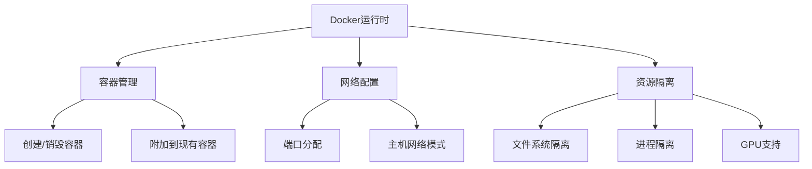
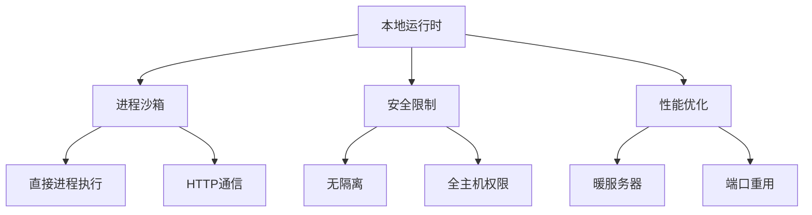
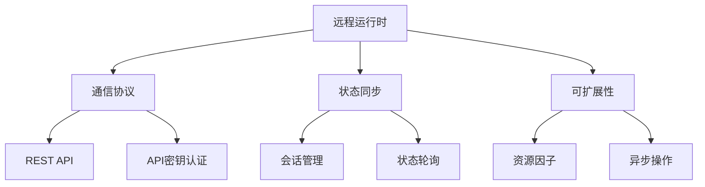
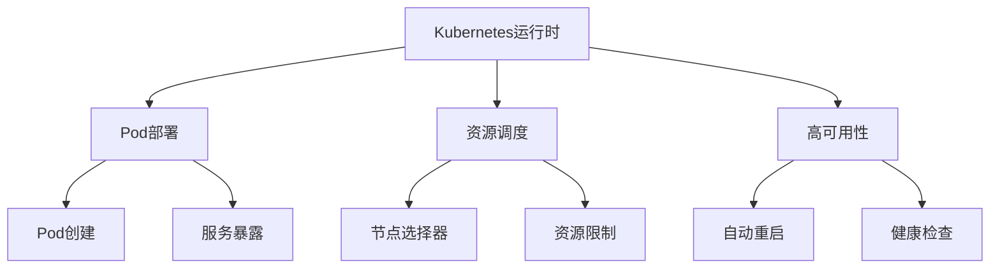
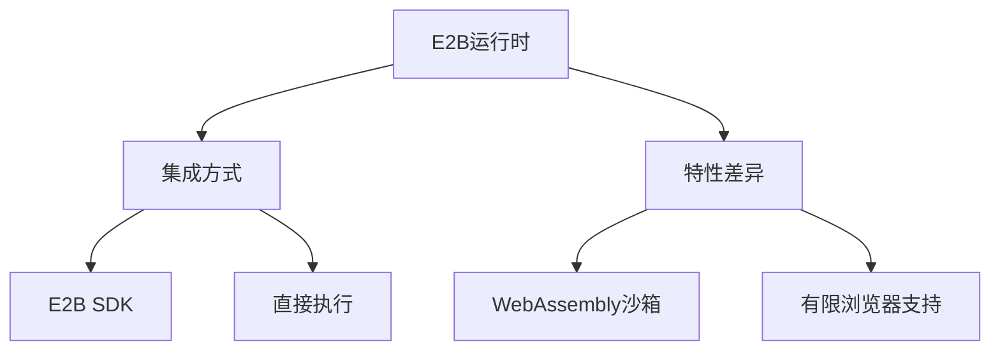
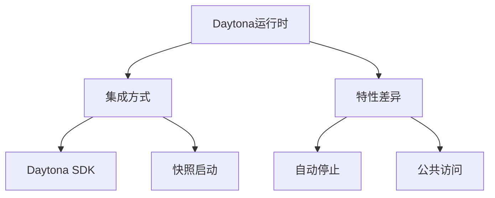
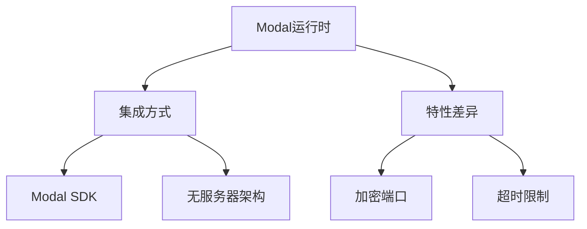
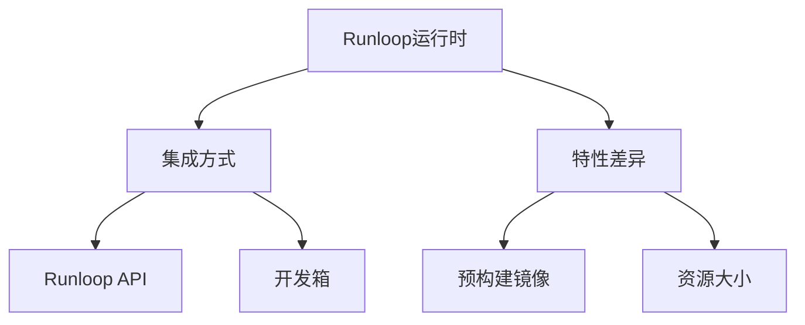

# 运行时实现类型

<cite>
**本文档引用的文件**   
- [base.py](file://openhands/runtime/base.py)
- [docker_runtime.py](file://openhands/runtime/impl/docker/docker_runtime.py)
- [local_runtime.py](file://openhands/runtime/impl/local/local_runtime.py)
- [remote_runtime.py](file://openhands/runtime/impl/remote/remote_runtime.py)
- [kubernetes_runtime.py](file://openhands/runtime/impl/kubernetes/kubernetes_runtime.py)
- [e2b_runtime.py](file://third_party/runtime/impl/e2b/e2b_runtime.py)
- [daytona_runtime.py](file://third_party/runtime/impl/daytona/daytona_runtime.py)
- [modal_runtime.py](file://third_party/runtime/impl/modal/modal_runtime.py)
- [runloop_runtime.py](file://third_party/runtime/impl/runloop/runloop_runtime.py)
</cite>

## 目录
1. [介绍](#介绍)
2. [Docker运行时](#docker运行时)
3. [本地运行时](#本地运行时)
4. [远程运行时](#远程运行时)
5. [Kubernetes运行时](#kubernetes运行时)
6. [第三方运行时集成](#第三方运行时集成)
   - [E2B运行时](#e2b运行时)
   - [Daytona运行时](#daytona运行时)
   - [Modal运行时](#modal运行时)
   - [Runloop运行时](#runloop运行时)
7. [性能特征与最佳实践](#性能特征与最佳实践)

## 介绍
OpenHands支持多种运行时类型，每种类型都针对不同的使用场景和部署需求进行了优化。这些运行时提供了从本地开发到云规模部署的完整解决方案，具有不同的隔离级别、资源管理和通信机制。本文档详细介绍了各种运行时类型的实现细节、配置选项和适用场景。

**Section sources**
- [base.py](file://openhands/runtime/base.py#L1-L116)

## Docker运行时
Docker运行时是OpenHands的默认运行时，它使用Docker容器为每个会话创建隔离的执行环境。该运行时通过Docker API管理容器生命周期，包括创建、启动、暂停、恢复和销毁容器。

### 容器管理
Docker运行时通过`DockerRuntime`类实现，该类继承自`ActionExecutionClient`。在初始化时，它会检查是否存在现有容器，如果不存在则创建新的容器。容器名称以`openhands-runtime-`为前缀，后跟会话ID。运行时支持附加到现有容器，这对于会话恢复和调试非常有用。

### 网络配置
Docker运行时为容器分配多个端口：
- **执行服务器端口**：范围30000-39999，用于与动作执行服务器通信
- **VSCode端口**：范围40000-49999，用于VSCode集成
- **应用端口**：范围50000-59999，用于暴露应用程序

运行时使用端口锁定机制来防止端口冲突，并支持主机网络模式。当使用主机网络时，容器直接使用主机的网络堆栈，这可以提高网络性能但会降低隔离性。

### 资源隔离
Docker运行时通过以下机制实现资源隔离：
- **文件系统隔离**：工作空间通过卷挂载到容器中，支持读写模式和只读模式
- **进程隔离**：每个会话在独立的容器中运行，与其他会话完全隔离
- **网络隔离**：容器在独立的网络命名空间中运行，可以配置自定义网络
- **GPU支持**：通过`enable_gpu`配置选项启用，允许容器访问主机的GPU资源

运行时还支持覆盖挂载，为每个容器提供独立的写入层，同时共享只读的基础文件系统。

**Diagram sources**
- [docker_runtime.py](file://openhands/runtime/impl/docker/docker_runtime.py#L75-L766)

**Section sources**
- [docker_runtime.py](file://openhands/runtime/impl/docker/docker_runtime.py#L75-L766)

## 本地运行时
本地运行时直接在主机上执行动作，不使用任何容器化技术。这种运行时提供了最高的性能，但牺牲了安全隔离。

### 进程沙箱
本地运行时通过`LocalRuntime`类实现，该类在主机上直接启动动作执行服务器。服务器进程作为子进程运行，并通过HTTP与主应用程序通信。运行时使用信号量确保一次只执行一个动作，防止并发问题。

### 安全限制
由于本地运行时缺乏隔离，它提供了以下安全警告：
- 所有动作都以运行OpenHands的用户权限执行
- 没有文件系统或网络隔离
- 直接访问主机资源

因此，本地运行时仅建议在受控的开发环境中使用，不应用于生产环境或处理不受信任的代码。

### 性能优化
本地运行时通过以下机制优化性能：
- **暖服务器**：预启动服务器进程以减少会话启动时间
- **端口重用**：缓存和重用端口分配
- **直接文件访问**：避免容器文件系统开销

运行时支持配置暖服务器数量，以平衡启动时间和资源消耗。

**Diagram sources**
- [local_runtime.py](file://openhands/runtime/impl/local/local_runtime.py#L124-L823)

**Section sources**
- [local_runtime.py](file://openhands/runtime/impl/local/local_runtime.py#L124-L823)

## 远程运行时
远程运行时设计用于在远程环境中执行，支持分布式部署和云规模扩展。

### 通信协议
远程运行时通过REST API与远程服务器通信。它使用HTTP客户端发送动作执行请求并接收观察结果。通信使用API密钥进行身份验证，确保安全性。运行时支持重试机制，以处理网络不稳定的情况。

### 状态同步
远程运行时通过以下机制实现状态同步：
- **会话管理**：每个会话都有唯一的ID，用于跟踪状态
- **状态轮询**：定期检查远程运行时的状态
- **错误恢复**：自动处理连接丢失和服务器重启

运行时支持暂停和恢复功能，允许在不丢失状态的情况下暂停会话。

### 可扩展性
远程运行时设计为高度可扩展：
- **资源因子**：可配置资源分配
- **异步操作**：非阻塞通信
- **连接池**：复用HTTP连接

这种运行时特别适合大规模并行评估和生产部署。

**Diagram sources**
- [remote_runtime.py](file://openhands/runtime/impl/remote/remote_runtime.py#L39-L615)

**Section sources**
- [remote_runtime.py](file://openhands/runtime/impl/remote/remote_runtime.py#L39-L615)

## Kubernetes运行时
Kubernetes运行时在Kubernetes集群中部署Pod来运行代理代码，利用Kubernetes的编排能力。

### Pod部署
Kubernetes运行时通过`KubernetesRuntime`类实现，该类使用Kubernetes Python客户端创建和管理Pod。每个会话对应一个Pod，Pod名称以`openhands-runtime-`为前缀。运行时创建以下Kubernetes资源：
- **Pod**：运行动作执行服务器
- **服务**：暴露Pod的网络端点
- **Ingress**：提供外部访问

### 资源调度
Kubernetes运行时支持高级资源调度功能：
- **节点选择器**：将Pod调度到特定节点
- **容忍度**：允许Pod在有污点的节点上运行
- **资源请求和限制**：配置CPU和内存资源

运行时还支持持久卷声明(PVC)，为Pod提供持久化存储。

### 高可用性
Kubernetes运行时利用Kubernetes的高可用性特性：
- **自动重启**：Pod失败时自动重启
- **健康检查**：就绪探针确保Pod准备就绪
- **服务发现**：通过服务名称访问Pod

这种运行时适合需要高可用性和弹性的生产环境。

**Diagram sources**
- [kubernetes_runtime.py](file://openhands/runtime/impl/kubernetes/kubernetes_runtime.py#L61-L753)

**Section sources**
- [kubernetes_runtime.py](file://openhands/runtime/impl/kubernetes/kubernetes_runtime.py#L61-L753)

## 第三方运行时集成
OpenHands支持多种第三方运行时，通过插件架构实现集成。

### E2B运行时
E2B运行时使用E2B安全沙箱环境，提供强大的安全隔离。

#### 集成方式
E2B运行时通过`E2BRuntime`类实现，该类使用E2B SDK创建和管理沙箱。运行时直接与E2B API通信，执行命令和文件操作。它不使用动作执行服务器，而是直接在沙箱中执行动作。

#### 特性差异
- **安全隔离**：基于WebAssembly的沙箱，提供强隔离
- **文件系统**：使用E2B文件存储，不支持本地文件系统访问
- **浏览器支持**：有限的浏览器功能，不支持交互式浏览

E2B运行时特别适合需要高安全性的场景。

**Diagram sources**
- [e2b_runtime.py](file://third_party/runtime/impl/e2b/e2b_runtime.py#L39-L403)

**Section sources**
- [e2b_runtime.py](file://third_party/runtime/impl/e2b/e2b_runtime.py#L39-L403)

### Daytona运行时
Daytona运行时使用Daytona云开发环境，提供完整的开发工作区。

#### 集成方式
Daytona运行时通过`DaytonaRuntime`类实现，该类使用Daytona SDK创建沙箱。运行时从快照创建沙箱，支持快速启动。它使用标签来跟踪会话状态。

#### 特性差异
- **快照支持**：从预配置的快照启动，减少初始化时间
- **自动停止**：可配置空闲超时自动停止
- **公共访问**：支持公共URL访问开发环境

Daytona运行时适合需要完整开发环境的场景。

**Diagram sources**
- [daytona_runtime.py](file://third_party/runtime/impl/daytona/daytona_runtime.py#L30-L298)

**Section sources**
- [daytona_runtime.py](file://third_party/runtime/impl/daytona/daytona_runtime.py#L30-L298)

### Modal运行时
Modal运行时使用Modal云计算平台，提供无服务器计算能力。

#### 集成方式
Modal运行时通过`ModalRuntime`类实现，该类使用Modal SDK创建沙箱。运行时使用Modal应用和沙箱来管理执行环境。它通过环境变量进行身份验证。

#### 特性差异
- **无服务器**：按需启动，自动扩展
- **加密端口**：支持端到端加密通信
- **超时限制**：有明确的执行时间限制

Modal运行时适合需要弹性扩展的场景。

**Diagram sources**
- [modal_runtime.py](file://third_party/runtime/impl/modal/modal_runtime.py#L31-L299)

**Section sources**
- [modal_runtime.py](file://third_party/runtime/impl/modal/modal_runtime.py#L31-L299)

### Runloop运行时
Runloop运行时使用Runloop AI沙箱环境，提供专门的AI开发环境。

#### 集成方式
Runloop运行时通过`RunloopRuntime`类实现，该类使用Runloop API创建开发箱(Devbox)。运行时通过API密钥进行身份验证，并使用预构建的镜像。

#### 特性差异
- **预构建镜像**：使用优化的AI开发镜像
- **资源大小**：可配置资源大小(LARGE)
- **启动命令**：支持自定义启动命令

Runloop运行时适合AI开发和实验场景。

**Diagram sources**
- [runloop_runtime.py](file://third_party/runtime/impl/runloop/runloop_runtime.py#L25-L206)

**Section sources**
- [runloop_runtime.py](file://third_party/runtime/impl/runloop/runloop_runtime.py#L25-L206)

## 性能特征与最佳实践
不同运行时类型具有不同的性能特征和适用场景。

### 性能特征
| 运行时类型 | 启动时间 | 执行速度 | 内存开销 | 网络延迟 |
|-----------|---------|---------|---------|---------|
| Docker | 中等 | 高 | 中等 | 低 |
| 本地 | 快 | 最高 | 低 | 最低 |
| 远程 | 慢 | 中等 | 低 | 高 |
| Kubernetes | 慢 | 高 | 高 | 低 |
| E2B | 中等 | 中等 | 中等 | 中等 |
| Daytona | 快 | 高 | 中等 | 低 |
| Modal | 中等 | 中等 | 低 | 中等 |
| Runloop | 中等 | 高 | 中等 | 低 |

### 适用场景
- **Docker运行时**：开发、测试和生产环境的默认选择
- **本地运行时**：快速开发和调试，需要最高性能的场景
- **远程运行时**：大规模并行评估和云规模部署
- **Kubernetes运行时**：需要高可用性和弹性的生产环境
- **E2B运行时**：需要高安全隔离的场景
- **Daytona运行时**：需要完整开发工作区的场景
- **Modal运行时**：需要弹性扩展的无服务器场景
- **Runloop运行时**：AI开发和实验场景

### 配置最佳实践
1. **安全性**：在生产环境中始终使用隔离的运行时(Docker、Kubernetes或第三方运行时)
2. **性能**：根据工作负载选择合适的运行时，平衡性能和资源消耗
3. **可扩展性**：对于大规模部署，选择支持水平扩展的运行时
4. **成本**：考虑运行时的资源消耗和成本，选择性价比最高的方案
5. **维护**：选择有良好文档和支持的运行时，降低维护成本

**Section sources**
- [base.py](file://openhands/runtime/base.py#L1-L116)
- [docker_runtime.py](file://openhands/runtime/impl/docker/docker_runtime.py#L75-L766)
- [local_runtime.py](file://openhands/runtime/impl/local/local_runtime.py#L124-L823)
- [remote_runtime.py](file://openhands/runtime/impl/remote/remote_runtime.py#L39-L615)
- [kubernetes_runtime.py](file://openhands/runtime/impl/kubernetes/kubernetes_runtime.py#L61-L753)
- [e2b_runtime.py](file://third_party/runtime/impl/e2b/e2b_runtime.py#L39-L403)
- [daytona_runtime.py](file://third_party/runtime/impl/daytona/daytona_runtime.py#L30-L298)
- [modal_runtime.py](file://third_party/runtime/impl/modal/modal_runtime.py#L31-L299)
- [runloop_runtime.py](file://third_party/runtime/impl/runloop/runloop_runtime.py#L25-L206)