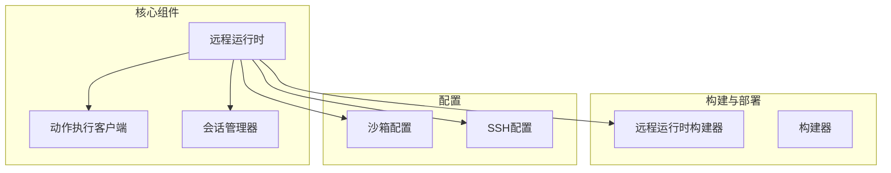
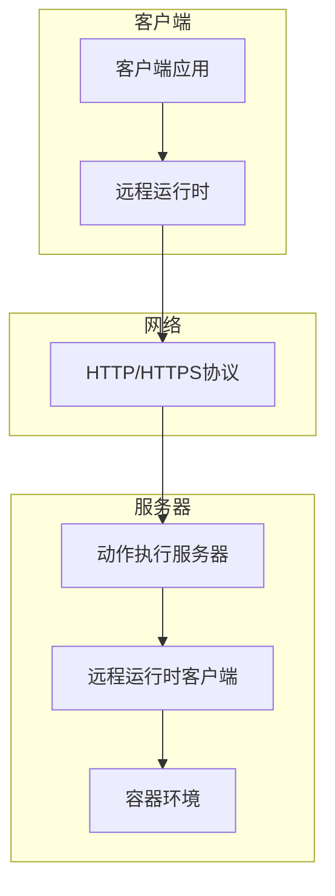
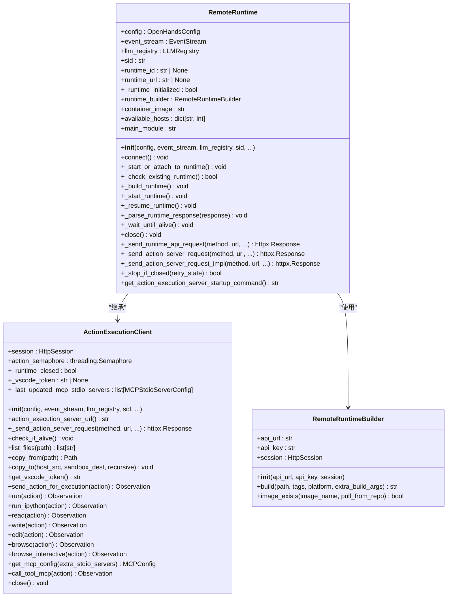
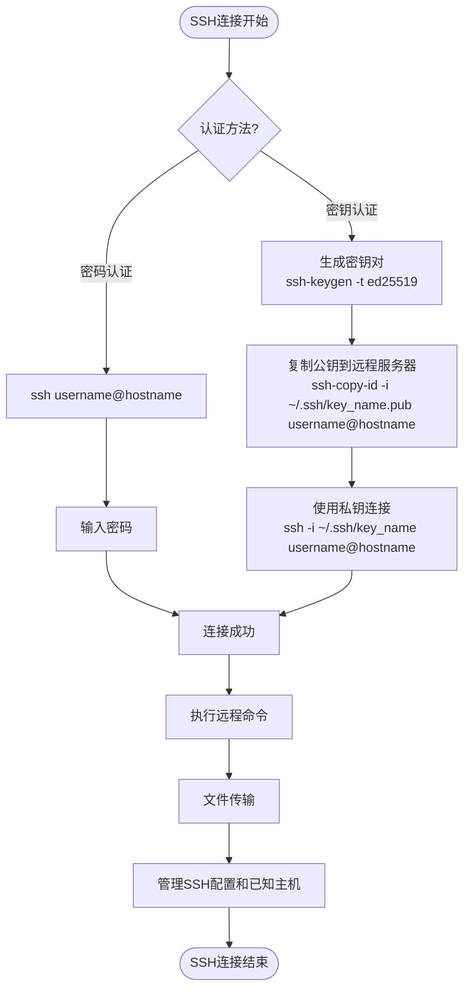
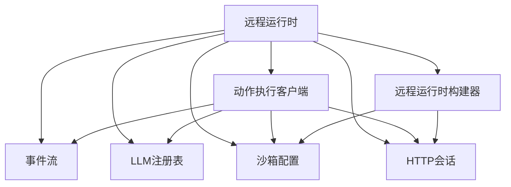
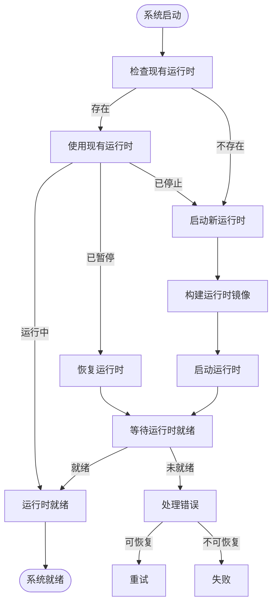

# 远程运行时

<cite>
**本文档引用的文件**   
- [remote_runtime.py](file://openhands/runtime/impl/remote/remote_runtime.py)
- [action_execution_client.py](file://openhands/runtime/impl/action_execution/action_execution_client.py)
- [session.py](file://openhands/server/session/session.py)
- [remote.py](file://openhands/runtime/builder/remote.py)
- [ssh.md](file://microagents/ssh.md)
- [sandbox_config.py](file://openhands/core/config/sandbox_config.py)
</cite>

## 目录
1. [引言](#引言)
2. [项目结构](#项目结构)
3. [核心组件](#核心组件)
4. [架构概述](#架构概述)
5. [详细组件分析](#详细组件分析)
6. [依赖分析](#依赖分析)
7. [性能考虑](#性能考虑)
8. [故障恢复策略](#故障恢复策略)
9. [安全配置](#安全配置)
10. [应用场景](#应用场景)

## 引言
远程运行时是OpenHands框架中的关键组件，它允许在分布式网络环境中执行任务。该系统通过SSH通信协议实现远程命令执行、文件同步和状态持久化，为开发者提供了一个强大的分布式开发环境。本文档将全面阐述远程运行时的执行架构、连接管理、会话保持以及网络故障恢复策略。

## 项目结构
远程运行时功能主要分布在以下几个目录中：
- `openhands/runtime/impl/remote/`：包含远程运行时的核心实现
- `microagents/`：包含SSH微代理等远程连接相关功能
- `openhands/server/session/`：处理会话管理和连接管理
- `openhands/core/config/`：包含运行时配置选项



**Diagram sources**
- [remote_runtime.py](file://openhands/runtime/impl/remote/remote_runtime.py)
- [action_execution_client.py](file://openhands/runtime/impl/action_execution/action_execution_client.py)
- [session.py](file://openhands/server/session/session.py)
- [remote.py](file://openhands/runtime/builder/remote.py)

**Section sources**
- [remote_runtime.py](file://openhands/runtime/impl/remote/remote_runtime.py)
- [action_execution_client.py](file://openhands/runtime/impl/action_execution/action_execution_client.py)
- [session.py](file://openhands/server/session/session.py)

## 核心组件
远程运行时的核心组件包括远程运行时类、动作执行客户端、会话管理器和远程运行时构建器。这些组件协同工作，实现了跨网络环境的执行架构。

**Section sources**
- [remote_runtime.py](file://openhands/runtime/impl/remote/remote_runtime.py)
- [action_execution_client.py](file://openhands/runtime/impl/action_execution/action_execution_client.py)
- [session.py](file://openhands/server/session/session.py)

## 架构概述
远程运行时采用客户端-服务器架构，通过HTTP/HTTPS协议与远程执行服务器通信。系统支持多种运行时类，包括sysbox和gvisor，提供了灵活的资源隔离选项。



**Diagram sources**
- [remote_runtime.py](file://openhands/runtime/impl/remote/remote_runtime.py)
- [action_execution_server.py](file://openhands/runtime/action_execution_server.py)

## 详细组件分析

### 远程运行时分析
远程运行时组件负责管理与远程执行服务器的连接，处理命令执行、文件传输和状态管理。

#### 类图


**Diagram sources**
- [remote_runtime.py](file://openhands/runtime/impl/remote/remote_runtime.py)
- [action_execution_client.py](file://openhands/runtime/impl/action_execution/action_execution_client.py)
- [remote.py](file://openhands/runtime/builder/remote.py)

### SSH微代理分析
SSH微代理提供了建立和管理SSH连接到远程机器的能力，支持密码和密钥认证等多种认证方法。

#### 流程图


**Diagram sources**
- [ssh.md](file://microagents/ssh.md)

**Section sources**
- [remote_runtime.py](file://openhands/runtime/impl/remote/remote_runtime.py)
- [action_execution_client.py](file://openhands/runtime/impl/action_execution/action_execution_client.py)
- [ssh.md](file://microagents/ssh.md)

## 依赖分析
远程运行时组件依赖于多个核心模块，包括事件流、LLM注册表、沙箱配置和HTTP会话管理。



**Diagram sources**
- [remote_runtime.py](file://openhands/runtime/impl/remote/remote_runtime.py)
- [action_execution_client.py](file://openhands/runtime/impl/action_execution/action_execution_client.py)
- [remote.py](file://openhands/runtime/builder/remote.py)

**Section sources**
- [remote_runtime.py](file://openhands/runtime/impl/remote/remote_runtime.py)
- [action_execution_client.py](file://openhands/runtime/impl/action_execution/action_execution_client.py)
- [remote.py](file://openhands/runtime/builder/remote.py)

## 性能考虑
远程运行时的性能优化主要集中在以下几个方面：

### 网络延迟优化
- **连接重试机制**：使用指数退避算法进行连接重试，减少网络波动的影响
- **请求超时设置**：合理设置API请求超时时间，避免长时间等待
- **批量操作**：支持文件批量传输，减少网络往返次数

### 资源利用优化
- **资源因子配置**：通过`remote_runtime_resource_factor`参数调整远程运行时的资源分配
- **容器镜像缓存**：利用远程构建器的镜像存在检查功能，避免重复构建
- **会话复用**：支持连接到现有运行时实例，减少启动开销

### 配置参数
以下是一些关键的性能调优参数：

| 参数名称 | 默认值 | 描述 |
|--------|------|------|
| `remote_runtime_init_timeout` | 300秒 | 远程运行时初始化超时时间 |
| `remote_runtime_api_timeout` | 30秒 | 远程运行时API请求超时时间 |
| `remote_runtime_enable_retries` | True | 是否启用远程运行时请求重试 |
| `remote_runtime_resource_factor` | 1.0 | 远程运行时资源分配因子 |
| `client_wait_timeout` | 30秒 | 客户端等待超时时间 |

**Section sources**
- [remote_runtime.py](file://openhands/runtime/impl/remote/remote_runtime.py)
- [sandbox_config.py](file://openhands/core/config/sandbox_config.py)

## 故障恢复策略
远程运行时系统实现了多层次的故障恢复机制，确保在各种异常情况下能够保持服务的可用性。

### 连接管理
- **自动重连**：当检测到连接中断时，系统会自动尝试重新连接
- **会话保持**：即使客户端断开连接，运行时实例也可以保持活动状态，等待重新连接
- **超时处理**：设置了合理的超时机制，避免因网络问题导致的长时间阻塞

### 状态持久化
- **会话状态保存**：运行时状态信息被持久化存储，支持在故障后恢复
- **命令执行状态跟踪**：每个命令的执行状态都被记录，便于故障排查
- **错误日志记录**：详细的错误日志帮助快速定位和解决问题

### 恢复流程


**Diagram sources**
- [remote_runtime.py](file://openhands/runtime/impl/remote/remote_runtime.py)

**Section sources**
- [remote_runtime.py](file://openhands/runtime/impl/remote/remote_runtime.py)
- [session.py](file://openhands/server/session/session.py)

## 安全配置
远程运行时系统提供了多种安全配置选项，确保在分布式环境中的安全执行。

### 认证与授权
- **API密钥认证**：使用API密钥进行身份验证，确保只有授权用户可以访问远程运行时
- **会话密钥**：为每个会话生成唯一的会话密钥，增强安全性
- **权限控制**：通过配置文件限制用户权限，防止越权操作

### SSH安全最佳实践
- **密钥权限管理**：确保私钥文件权限为600，公钥文件权限为644，SSH目录权限为700
- **禁用密码认证**：推荐使用密钥认证，禁用密码认证以提高安全性
- **定期轮换密钥**：定期更换SSH密钥，减少密钥泄露的风险

### 安全配置示例
```bash
# 设置正确的文件权限
chmod 600 ~/.ssh/id_ed25519
chmod 644 ~/.ssh/id_ed25519.pub
chmod 700 ~/.ssh

# SSH配置文件示例
Host alias
    HostName hostname_or_ip
    User username
    IdentityFile ~/.ssh/key_name
    Port 22
    ServerAliveInterval 60
    ServerAliveCountMax 3
```

**Section sources**
- [ssh.md](file://microagents/ssh.md)
- [remote_runtime.py](file://openhands/runtime/impl/remote/remote_runtime.py)

## 应用场景
远程运行时在多种分布式开发环境中都有广泛的应用。

### 分布式评估
- **并行执行**：支持在云环境中并行执行评估任务，提高效率
- **资源隔离**：每个评估任务在独立的容器环境中运行，确保结果的可靠性
- **可扩展性**：可以根据需要动态调整计算资源，适应不同规模的评估需求

### 云开发环境
- **远程开发**：开发者可以在本地编辑代码，而在远程服务器上执行和调试
- **资源共享**：多个开发者可以共享高性能的远程计算资源
- **环境一致性**：确保开发、测试和生产环境的一致性

### 持续集成/持续部署
- **自动化测试**：在远程环境中执行自动化测试，确保代码质量
- **部署验证**：在部署前在远程环境中验证应用功能
- **性能测试**：利用远程高性能服务器进行压力测试和性能分析

**Section sources**
- [remote_runtime.py](file://openhands/runtime/impl/remote/remote_runtime.py)
- [ssh.md](file://microagents/ssh.md)