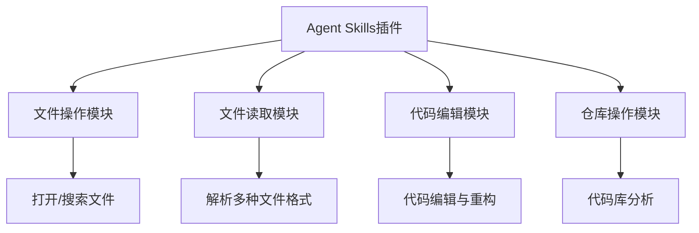
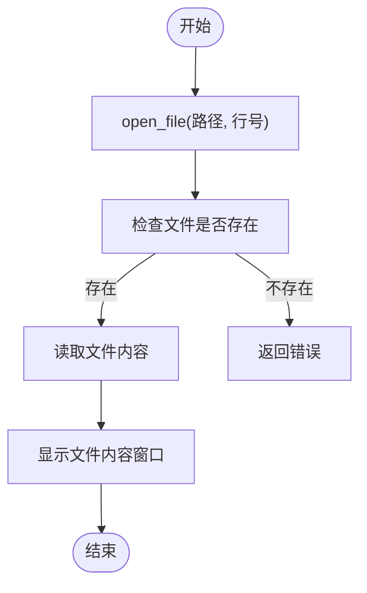
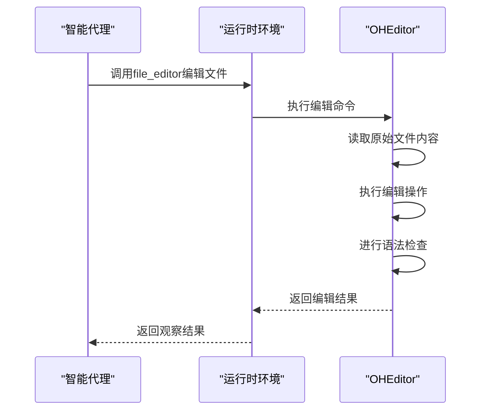

# Agent Skills插件

<cite>
**本文档引用的文件**
- [agentskills.py](file://openhands/runtime/plugins/agent_skills/agentskills.py)
- [file_ops.py](file://openhands/runtime/plugins/agent_skills/file_ops/file_ops.py)
- [file_readers.py](file://openhands/runtime/plugins/agent_skills/file_reader/file_readers.py)
- [repo_ops.py](file://openhands/runtime/plugins/agent_skills/repo_ops/repo_ops.py)
- [file_editor.py](file://openhands/runtime/plugins/agent_skills/file_editor/__init__.py)
- [action_execution_server.py](file://openhands/runtime/action_execution_server.py)
- [requirement.py](file://openhands/runtime/plugins/requirement.py)
- [dependency.py](file://openhands/runtime/plugins/agent_skills/utils/dependency.py)
- [config.py](file://openhands/runtime/plugins/agent_skills/utils/config.py)
</cite>

## 目录
1. [简介](#简介)
2. [核心功能模块](#核心功能模块)
3. [文件操作技能](#文件操作技能)
4. [代码编辑功能](#代码编辑功能)
5. [仓库管理技能](#仓库管理技能)
6. [插件注册与执行流程](#插件注册与执行流程)
7. [权限控制与安全机制](#权限控制与安全机制)
8. [配置选项](#配置选项)
9. [错误处理](#错误处理)
10. [性能优化建议](#性能优化建议)

## 简介

Agent Skills插件是OpenHands框架中的核心功能组件，为智能代理提供了一系列文件操作、代码编辑和仓库管理的能力。该插件通过模块化设计，将不同的技能分类组织，使代理能够执行复杂的开发任务。插件通过Python导入机制动态加载各种功能模块，并在运行时环境中提供这些技能。

**Section sources**
- [agentskills.py](file://openhands/runtime/plugins/agent_skills/agentskills.py)
- [README.md](file://openhands/runtime/plugins/agent_skills/README.md)

## 核心功能模块

Agent Skills插件主要由四个功能模块组成：文件操作、文件读取、代码编辑和仓库操作。这些模块通过统一的导入机制集成到运行时环境中，为代理提供全面的开发能力。

**Diagram sources**
- [agentskills.py](file://openhands/runtime/plugins/agent_skills/agentskills.py)
- [__init__.py](file://openhands/runtime/plugins/agent_skills/__init__.py)

## 文件操作技能

文件操作模块提供了丰富的文件处理能力，包括文件打开、搜索、导航等功能。这些技能通过一系列函数实现，使代理能够高效地浏览和操作文件系统。

### 主要接口

| 函数名 | 参数 | 描述 |
|-------|------|------|
| open_file | path: str, line_number: int, context_lines: int | 打开指定路径的文件并定位到特定行 |
| goto_line | line_number: int | 移动到文件的指定行号 |
| scroll_down | 无参数 | 向下滚动100行 |
| scroll_up | 无参数 | 向上滚动100行 |
| search_dir | search_term: str, dir_path: str | 在指定目录中搜索包含特定文本的文件 |
| search_file | search_term: str, file_path: str | 在指定文件中搜索特定文本 |
| find_file | file_name: str, dir_path: str | 在指定目录中查找文件名匹配的文件 |

**Diagram sources**
- [file_ops.py](file://openhands/runtime/plugins/agent_skills/file_ops/file_ops.py)

**Section sources**
- [file_ops.py](file://openhands/runtime/plugins/agent_skills/file_ops/file_ops.py)

## 代码编辑功能

代码编辑功能通过集成外部库openhands_aci.editor实现，提供了强大的代码编辑能力。该功能不仅支持基本的文本替换，还集成了语法检查等高级特性。

### 实现机制

代码编辑功能的核心是file_editor函数，它通过OHEditor类封装了各种编辑操作。编辑器支持多种命令，包括查看文件、字符串替换、插入行等。

**Diagram sources**
- [file_editor.py](file://openhands/runtime/plugins/agent_skills/file_editor/__init__.py)
- [action_execution_server.py](file://openhands/runtime/action_execution_server.py)

**Section sources**
- [file_editor.py](file://openhands/runtime/plugins/agent_skills/file_editor/__init__.py)

## 仓库管理技能

仓库管理技能模块提供了对代码库的高级分析能力，使代理能够理解代码库的结构和内容。这些技能对于处理大型项目特别有用。

### 功能接口

- explore_tree_structure: 探索代码库的目录结构
- get_entity_contents: 获取特定实体的内容
- search_code_snippets: 在代码库中搜索代码片段

这些功能通过集成openhands_aci.indexing.locagent.tools实现，为代理提供了深入分析代码库的能力。

**Section sources**
- [repo_ops.py](file://openhands/runtime/plugins/agent_skills/repo_ops/repo_ops.py)

## 插件注册与执行流程

Agent Skills插件的注册和执行遵循OpenHands框架的标准插件机制。插件通过Plugin基类实现，并在运行时环境中被动态加载和初始化。

### 注册机制

插件通过AgentSkillsRequirement类定义其需求，包括名称和文档。插件本身通过AgentSkillsPlugin类实现，遵循插件接口规范。

**Diagram sources**
- [requirement.py](file://openhands/runtime/plugins/requirement.py)
- [__init__.py](file://openhands/runtime/plugins/agent_skills/__init__.py)

### 执行流程

插件的执行流程始于运行时环境的初始化。当运行时启动时，会根据配置加载指定的插件。Agent Skills插件在初始化过程中，通过import_functions工具函数将各个模块的功能导入到全局命名空间。

**Section sources**
- [action_execution_server.py](file://openhands/runtime/action_execution_server.py)
- [dependency.py](file://openhands/runtime/plugins/agent_skills/utils/dependency.py)

## 权限控制与安全机制

Agent Skills插件在设计时考虑了安全性和权限控制，确保代理在执行操作时不会对系统造成意外损害。

### 安全特性

- 文件路径验证：所有文件操作都经过路径有效性检查
- 权限检查：确保代理只能访问授权的文件和目录
- 语法检查：代码编辑操作会进行语法验证，防止引入错误

**Section sources**
- [file_ops.py](file://openhands/runtime/plugins/agent_skills/file_ops/file_ops.py)
- [file_editor.py](file://openhands/runtime/plugins/agent_skills/file_editor/__init__.py)

## 配置选项

Agent Skills插件支持通过环境变量进行配置，以适应不同的运行时需求。

### 主要配置

- OPENAI_API_KEY: 用于文件读取模块的OpenAI API密钥
- OPENAI_BASE_URL: OpenAI API的基础URL
- OPENAI_MODEL: 使用的OpenAI模型名称
- MAX_TOKEN: API调用的最大token数

这些配置主要影响文件读取模块中需要调用外部API的功能，如音频、图像和视频文件的解析。

**Section sources**
- [config.py](file://openhands/runtime/plugins/agent_skills/utils/config.py)

## 错误处理

插件实现了全面的错误处理机制，确保在出现问题时能够提供有用的反馈信息。

### 错误类型

- 文件不存在错误：当尝试操作不存在的文件时
- 权限错误：当没有足够权限访问文件或目录时
- 语法错误：当代码编辑引入语法错误时
- API调用错误：当外部API调用失败时

错误信息通过标准的观察结果返回给代理，帮助其理解和纠正问题。

**Section sources**
- [file_ops.py](file://openhands/runtime/plugins/agent_skills/file_ops/file_ops.py)
- [file_readers.py](file://openhands/runtime/plugins/agent_skills/file_reader/file_readers.py)

## 性能优化建议

为了确保Agent Skills插件的高效运行，建议采取以下优化措施：

1. **合理使用搜索功能**：避免在大型目录中进行全文搜索，尽量限定搜索范围
2. **批量操作**：将多个文件操作合并为单个操作，减少上下文切换
3. **缓存结果**：对于重复的文件读取操作，考虑缓存结果
4. **限制编辑范围**：在进行代码编辑时，明确指定编辑范围，避免不必要的文件读取

这些优化措施可以帮助提高代理的执行效率，减少资源消耗。

**Section sources**
- [file_ops.py](file://openhands/runtime/plugins/agent_skills/file_ops/file_ops.py)
- [file_editor.py](file://openhands/runtime/plugins/agent_skills/file_editor/__init__.py)