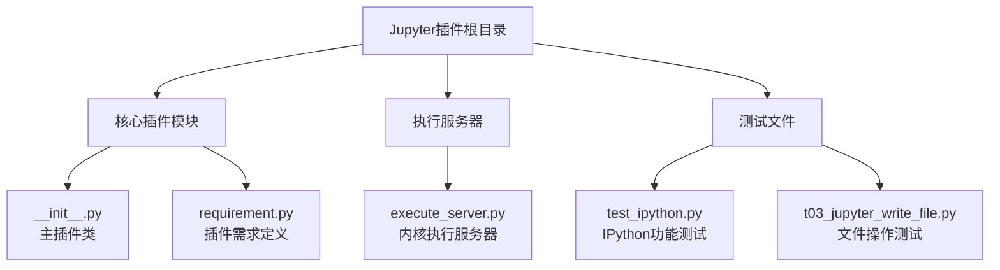
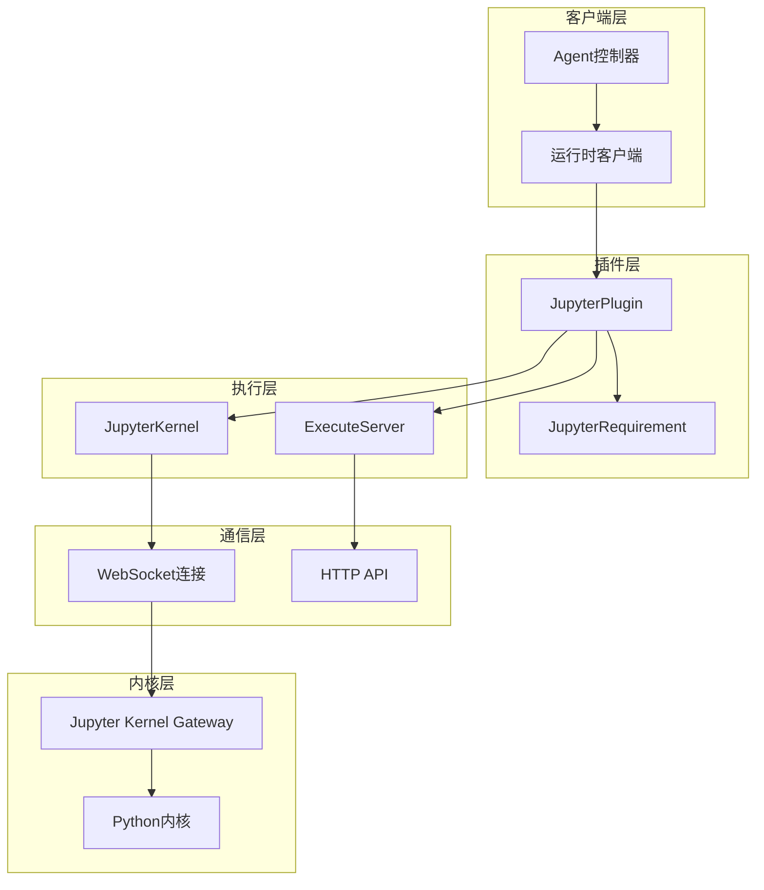
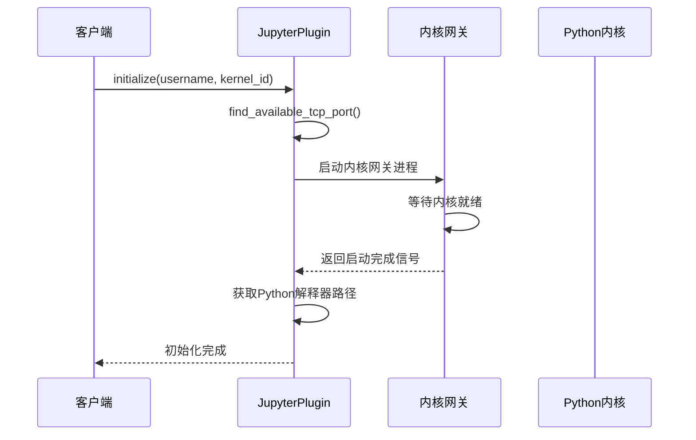
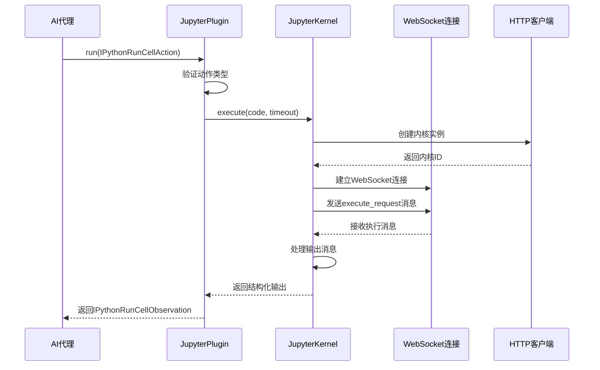
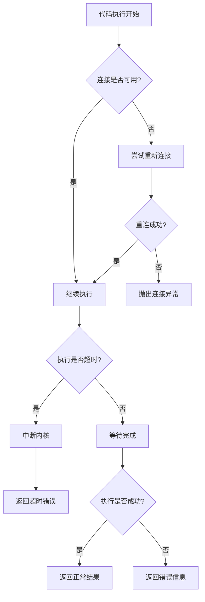
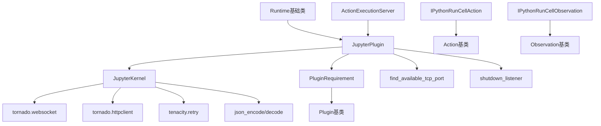

# Jupyter插件

<cite>
**本文档中引用的文件**
- [openhands/runtime/plugins/jupyter/__init__.py](file://openhands/runtime/plugins/jupyter/__init__.py)
- [openhands/runtime/plugins/jupyter/execute_server.py](file://openhands/runtime/plugins/jupyter/execute_server.py)
- [openhands/runtime/plugins/requirement.py](file://openhands/runtime/plugins/requirement.py)
- [openhands/events/action/action.py](file://openhands/events/action/action.py)
- [openhands/events/action/commands.py](file://openhands/events/action/commands.py)
- [openhands/events/observation/commands.py](file://openhands/events/observation/commands.py)
- [openhands/runtime/base.py](file://openhands/runtime/base.py)
- [openhands/runtime/action_execution_server.py](file://openhands/runtime/action_execution_server.py)
- [tests/runtime/test_ipython.py](file://tests/runtime/test_ipython.py)
- [openhands/agenthub/codeact_agent/tools/ipython.py](file://openhands/agenthub/codeact_agent/tools/ipython.py)
- [evaluation/integration_tests/tests/t03_jupyter_write_file.py](file://evaluation/integration_tests/tests/t03_jupyter_write_file.py)
</cite>

## 目录
1. [简介](#简介)
2. [项目结构](#项目结构)
3. [核心组件](#核心组件)
4. [架构概览](#架构概览)
5. [详细组件分析](#详细组件分析)
6. [依赖关系分析](#依赖关系分析)
7. [性能考虑](#性能考虑)
8. [故障排除指南](#故障排除指南)
9. [结论](#结论)

## 简介

OpenHands Jupyter插件是一个强大的内核集成系统，为AI代理提供了在隔离环境中执行Python代码的能力。该插件通过Jupyter Kernel Gateway实现了与Jupyter内核的通信，支持交互式代码执行、实时输出处理和多平台兼容性。

该插件的核心功能包括：
- 启动和管理Jupyter内核进程
- 处理代码单元格的执行请求
- 管理内核状态和生命周期
- 提供与前端的WebSocket通信协议
- 支持图像输出和文本输出的混合处理
- 实现超时控制和错误恢复机制

## 项目结构

Jupyter插件的文件组织结构清晰，主要分为以下几个部分：



**图表来源**
- [openhands/runtime/plugins/jupyter/__init__.py](file://openhands/runtime/plugins/jupyter/__init__.py#L1-L182)
- [openhands/runtime/plugins/jupyter/execute_server.py](file://openhands/runtime/plugins/jupyter/execute_server.py#L1-L310)

**章节来源**
- [openhands/runtime/plugins/jupyter/__init__.py](file://openhands/runtime/plugins/jupyter/__init__.py#L1-L182)
- [openhands/runtime/plugins/jupyter/execute_server.py](file://openhands/runtime/plugins/jupyter/execute_server.py#L1-L310)

## 核心组件

### JupyterPlugin类

JupyterPlugin是插件系统的核心类，负责管理Jupyter内核的整个生命周期。

#### 主要属性
- `kernel_gateway_port`: 内核网关端口号（40000-49999范围内的可用端口）
- `kernel_id`: 内核标识符，默认为'openhands-default'
- `gateway_process`: 网关进程对象（异步子进程或同步Popen）
- `python_interpreter_path`: Python解释器路径

#### 关键方法
- `initialize()`: 初始化插件，启动内核网关
- `_run()`: 内部执行方法，处理IPython运行单元格动作
- `run()`: 公共执行接口，返回IPython运行单元格观察结果

### JupyterKernel类

JupyterKernel类封装了与Jupyter内核的实际通信逻辑。

#### 核心功能
- WebSocket连接管理
- 消息序列化和反序列化
- 执行请求处理
- 输出结果收集和格式化
- 心跳机制和连接恢复

**章节来源**
- [openhands/runtime/plugins/jupyter/__init__.py](file://openhands/runtime/plugins/jupyter/__init__.py#L31-L182)
- [openhands/runtime/plugins/jupyter/execute_server.py](file://openhands/runtime/plugins/jupyter/execute_server.py#L53-L310)

## 架构概览

Jupyter插件采用分层架构设计，确保了良好的可扩展性和维护性：



**图表来源**
- [openhands/runtime/plugins/jupyter/__init__.py](file://openhands/runtime/plugins/jupyter/__init__.py#L31-L182)
- [openhands/runtime/plugins/jupyter/execute_server.py](file://openhands/runtime/plugins/jupyter/execute_server.py#L53-L310)

## 详细组件分析

### 插件初始化流程

插件初始化过程涉及多个步骤，确保内核环境的正确设置：



**图表来源**
- [openhands/runtime/plugins/jupyter/__init__.py](file://openhands/runtime/plugins/jupyter/__init__.py#L38-L149)

#### 平台特定处理

插件支持多种操作系统，针对不同平台有专门的处理逻辑：

- **Unix系统(Linux/macOS)**: 使用异步子进程和bash脚本
- **Windows系统**: 使用同步子进程和特殊命令格式

### 代码执行流程

代码执行是插件的核心功能，涉及复杂的通信协议：



**图表来源**
- [openhands/runtime/plugins/jupyter/__init__.py](file://openhands/runtime/plugins/jupyter/__init__.py#L151-L181)
- [openhands/runtime/plugins/jupyter/execute_server.py](file://openhands/runtime/plugins/jupyter/execute_server.py#L142-L257)

### 数据序列化和通信协议

插件使用JSON格式进行数据交换，支持多种消息类型：

#### 消息格式规范

执行请求消息结构：
```json
{
    "header": {
        "username": "",
        "version": "5.0",
        "session": "",
        "msg_id": "uuid",
        "msg_type": "execute_request"
    },
    "parent_header": {},
    "channel": "shell",
    "content": {
        "code": "print('Hello World')",
        "silent": false,
        "store_history": false,
        "user_expressions": {},
        "allow_stdin": false
    },
    "metadata": {},
    "buffers": {}
}
```

#### 输出消息处理

插件支持多种类型的输出消息：
- `stream`: 文本流输出
- `execute_result`: 执行结果
- `display_data`: 显示数据（如图像）
- `error`: 错误信息
- `execute_reply`: 执行完成确认

### 错误处理机制

插件实现了多层次的错误处理策略：



**图表来源**
- [openhands/runtime/plugins/jupyter/execute_server.py](file://openhands/runtime/plugins/jupyter/execute_server.py#L221-L236)

**章节来源**
- [openhands/runtime/plugins/jupyter/__init__.py](file://openhands/runtime/plugins/jupyter/__init__.py#L151-L181)
- [openhands/runtime/plugins/jupyter/execute_server.py](file://openhands/runtime/plugins/jupyter/execute_server.py#L142-L257)

### 配置选项和环境变量

插件支持多种配置选项来适应不同的运行环境：

#### 环境变量配置

| 变量名 | 默认值 | 描述 |
|--------|--------|------|
| `SU_TO_USER` | `'true'` | 是否切换到指定用户 |
| `LOCAL_RUNTIME_MODE` | `''` | 是否启用本地运行模式 |
| `OPENHANDS_REPO_PATH` | `''` | OpenHands仓库路径（本地模式必需） |
| `JUPYTER_GATEWAY_PORT` | `'8888'` | Jupyter网关端口 |
| `JUPYTER_EXEC_SERVER_PORT` | `''` | 执行服务器端口 |

#### 运行时配置

插件会根据运行时环境自动调整行为：
- 在Docker容器中运行时，使用`su - {username}`切换用户
- 在本地开发环境中，直接使用当前环境
- 支持Windows和Unix系统的差异化处理

**章节来源**
- [openhands/runtime/plugins/jupyter/__init__.py](file://openhands/runtime/plugins/jupyter/__init__.py#L16-L149)

## 依赖关系分析

Jupyter插件的依赖关系体现了其模块化设计：



**图表来源**
- [openhands/runtime/plugins/jupyter/__init__.py](file://openhands/runtime/plugins/jupyter/__init__.py#L1-L15)
- [openhands/runtime/plugins/jupyter/execute_server.py](file://openhands/runtime/plugins/jupyter/execute_server.py#L1-L16)

### 外部依赖

插件依赖以下外部库：
- `tornado`: WebSocket和HTTP服务器框架
- `tenacity`: 重试机制库
- `asyncio`: 异步编程支持

### 内部依赖

插件与OpenHands核心系统的集成点：
- 事件系统：通过Action和Observation进行通信
- 运行时系统：作为插件被运行时管理
- 日志系统：使用统一的日志记录机制

**章节来源**
- [openhands/runtime/plugins/jupyter/__init__.py](file://openhands/runtime/plugins/jupyter/__init__.py#L1-L15)
- [openhands/runtime/plugins/jupyter/execute_server.py](file://openhands/runtime/plugins/jupyter/execute_server.py#L1-L16)

## 性能考虑

### 超时控制

插件实现了多层次的超时控制机制：

- **执行超时**: 默认120秒，可通过`IPythonRunCellAction.timeout`参数自定义
- **连接超时**: WebSocket连接建立超时
- **内核响应超时**: 内核对消息的响应时间限制

### 资源管理

- **端口分配**: 自动查找可用端口，避免冲突
- **进程管理**: 正确关闭内核网关进程
- **内存优化**: 及时清理临时数据和连接

### 并发处理

插件支持并发执行多个代码单元格，但每个内核实例在同一时间只能处理一个执行请求。

## 故障排除指南

### 常见问题及解决方案

#### 1. 内核启动失败
**症状**: 插件初始化时出现连接错误
**原因**: 
- 端口被占用
- Python环境配置错误
- Jupyter相关包未安装

**解决方案**:
- 检查端口可用性
- 验证Python环境
- 确保安装了`jupyter kernelgateway`

#### 2. 执行超时
**症状**: 代码执行超过设定时间
**解决方案**:
- 增加超时时间设置
- 优化代码执行逻辑
- 检查死循环或长时间运行的操作

#### 3. 图像输出问题
**症状**: 图像无法正确显示
**原因**: 
- 图像数据编码问题
- 浏览器不支持Base64图像

**解决方案**:
- 检查图像数据格式
- 使用标准图像格式

### 调试技巧

1. **启用调试日志**: 设置`DEBUG=true`环境变量
2. **检查网络连接**: 验证WebSocket连接状态
3. **监控资源使用**: 关注CPU和内存使用情况

**章节来源**
- [openhands/runtime/plugins/jupyter/execute_server.py](file://openhands/runtime/plugins/jupyter/execute_server.py#L221-L236)
- [tests/runtime/test_ipython.py](file://tests/runtime/test_ipython.py#L1-L200)

## 结论

OpenHands Jupyter插件提供了一个强大而灵活的代码执行环境，通过精心设计的架构实现了以下关键特性：

### 主要优势

1. **跨平台兼容性**: 支持Windows、Linux和macOS系统
2. **异步处理能力**: 利用asyncio实现高效的并发处理
3. **容错机制**: 完善的错误处理和恢复策略
4. **标准化接口**: 遵循Jupyter消息协议
5. **安全隔离**: 在沙箱环境中执行代码

### 应用场景

- AI代理的代码编写和测试
- 数据分析和可视化
- 教育和研究应用
- 自动化脚本执行

### 未来发展方向

- 支持更多编程语言内核
- 增强安全沙箱功能
- 优化性能和资源使用
- 扩展与IDE的集成

该插件为OpenHands平台提供了坚实的代码执行基础，使得AI代理能够在真实的编程环境中进行有效的学习和工作。