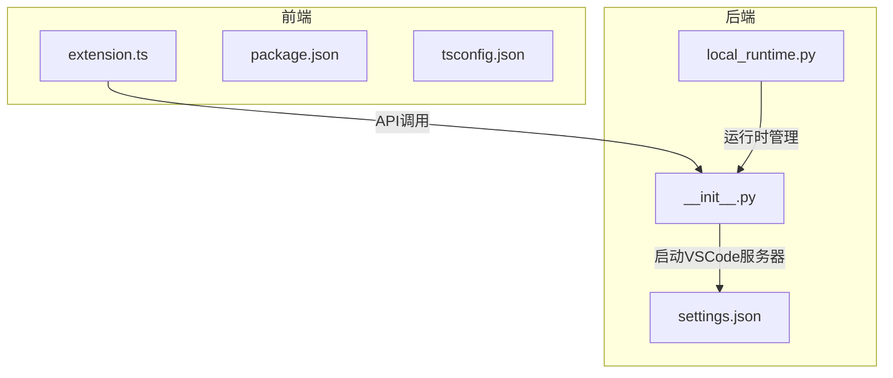
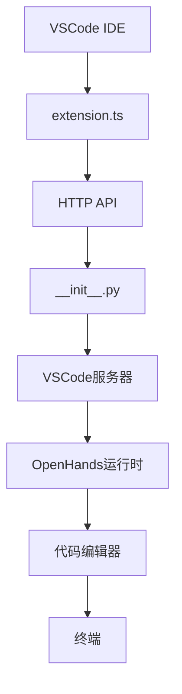
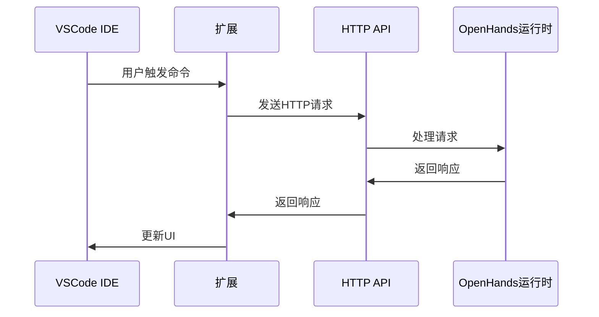
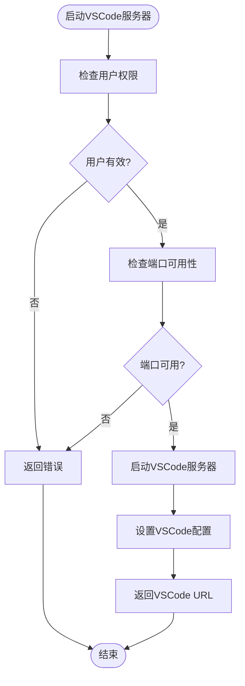
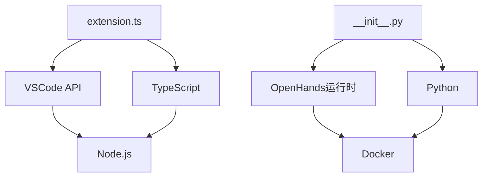

# VSCode扩展

<cite>
**本文档引用的文件**
- [extension.ts](file://openhands/integrations/vscode/src/extension.ts)
- [package.json](file://openhands/integrations/vscode/package.json)
- [README.md](file://openhands/integrations/vscode/README.md)
- [settings.json](file://openhands/runtime/plugins/vscode/settings.json)
- [__init__.py](file://openhands/runtime/plugins/vscode/__init__.py)
- [local_runtime.py](file://openhands/runtime/impl/local/local_runtime.py)
- [base.py](file://openhands/runtime/base.py)
- [action_execution_client.py](file://openhands/runtime/impl/action_execution/action_execution_client.py)
- [vscode-url-helper.ts](file://frontend/src/utils/vscode-url-helper.ts)
- [v1-conversation-service.api.ts](file://frontend/src/api/conversation-service/v1-conversation-service.api.ts)
</cite>

## 目录
1. [简介](#简介)
2. [项目结构](#项目结构)
3. [核心组件](#核心组件)
4. [架构概述](#架构概述)
5. [详细组件分析](#详细组件分析)
6. [依赖分析](#依赖分析)
7. [性能考虑](#性能考虑)
8. [故障排除指南](#故障排除指南)
9. [结论](#结论)

## 简介
OpenHands VSCode扩展是OpenHands项目的重要组成部分，它为开发者提供了一个无缝集成的开发环境。该扩展通过与后端服务的通信，实现了远程开发支持机制，允许用户在VSCode中直接启动和管理AI辅助的编程会话。扩展支持多种功能，包括启动新对话、使用当前文件内容和选择文本上下文，以及安全的终端管理和自动虚拟环境检测。通过VSCode的Shell Integration API，扩展能够精确控制命令执行和终端状态，确保开发过程的流畅性和安全性。

## 项目结构
OpenHands VSCode扩展的项目结构清晰，主要分为前端和后端两大部分。前端部分位于`openhands/integrations/vscode`目录下，包含TypeScript源代码、配置文件和资源文件。后端部分则分布在`openhands/runtime/plugins/vscode`和`openhands/runtime/impl`等目录中，负责处理VSCode服务器的启动和管理。这种分离的架构设计使得前端和后端可以独立开发和测试，同时通过定义良好的API进行通信。

**图表来源**
- [extension.ts](file://openhands/integrations/vscode/src/extension.ts)
- [__init__.py](file://openhands/runtime/plugins/vscode/__init__.py)
- [local_runtime.py](file://openhands/runtime/impl/local/local_runtime.py)

**章节来源**
- [extension.ts](file://openhands/integrations/vscode/src/extension.ts)
- [__init__.py](file://openhands/runtime/plugins/vscode/__init__.py)

## 核心组件
VSCode扩展的核心组件包括前端的TypeScript实现和后端的Python插件。前端组件负责与VSCode IDE交互，提供用户界面和命令处理。后端组件则负责启动和管理VSCode服务器，处理与OpenHands运行时的通信。这些组件通过定义良好的API进行交互，确保了系统的稳定性和可维护性。

**章节来源**
- [extension.ts](file://openhands/integrations/vscode/src/extension.ts)
- [__init__.py](file://openhands/runtime/plugins/vscode/__init__.py)

## 架构概述
OpenHands VSCode扩展的架构设计遵循了现代Web应用的典型模式，采用了前后端分离的设计。前端部分使用TypeScript编写，利用VSCode的API与IDE进行交互。后端部分使用Python编写，作为OpenHands运行时的插件，负责管理VSCode服务器的生命周期。前后端通过HTTP API和WebSocket进行通信，实现了实时的数据同步和命令执行。

**图表来源**
- [extension.ts](file://openhands/integrations/vscode/src/extension.ts)
- [__init__.py](file://openhands/runtime/plugins/vscode/__init__.py)

## 详细组件分析

### 前端组件分析
前端组件主要由`extension.ts`文件实现，它定义了VSCode扩展的入口点和主要功能。通过VSCode的API，扩展能够注册命令、创建终端和执行命令。使用Shell Integration API，扩展可以精确控制命令的执行和终端的状态，确保开发过程的流畅性。

#### 对于API/服务组件：

**图表来源**
- [extension.ts](file://openhands/integrations/vscode/src/extension.ts)
- [v1-conversation-service.api.ts](file://frontend/src/api/conversation-service/v1-conversation-service.api.ts)

### 后端组件分析
后端组件主要由`__init__.py`文件实现，它作为OpenHands运行时的插件，负责启动和管理VSCode服务器。通过环境变量和配置文件，插件能够灵活地配置VSCode服务器的端口、连接令牌和工作区路径。插件还负责处理与前端的通信，提供VSCode服务器的URL和连接令牌。

#### 对于复杂逻辑组件：

**图表来源**
- [__init__.py](file://openhands/runtime/plugins/vscode/__init__.py)
- [settings.json](file://openhands/runtime/plugins/vscode/settings.json)

**章节来源**
- [__init__.py](file://openhands/runtime/plugins/vscode/__init__.py)
- [settings.json](file://openhands/runtime/plugins/vscode/settings.json)

## 依赖分析
VSCode扩展的依赖关系清晰，前端依赖VSCode的API和TypeScript编译器，后端依赖OpenHands运行时和Python环境。通过`package.json`文件，前端的依赖关系被明确地定义，包括VSCode API、TypeScript和其他开发工具。后端的依赖关系则通过Python的包管理工具进行管理，确保了环境的一致性和可移植性。

**图表来源**
- [package.json](file://openhands/integrations/vscode/package.json)
- [__init__.py](file://openhands/runtime/plugins/vscode/__init__.py)

**章节来源**
- [package.json](file://openhands/integrations/vscode/package.json)
- [__init__.py](file://openhands/runtime/plugins/vscode/__init__.py)

## 性能考虑
在性能方面，VSCode扩展通过多种机制确保了高效和响应迅速的用户体验。首先，通过缓存VSCode服务器的连接令牌，减少了重复的认证请求。其次，使用异步编程模型，避免了阻塞操作，提高了系统的响应速度。此外，通过合理的资源管理和错误处理，扩展能够在各种环境下稳定运行。

## 故障排除指南
在使用VSCode扩展时，可能会遇到一些常见问题。例如，VSCode服务器无法启动，可能是由于端口被占用或用户权限不足。此时，可以通过检查日志文件和环境变量来诊断问题。另一个常见问题是命令执行失败，这可能是由于Shell Integration API不支持或命令格式错误。通过启用调试日志，可以更详细地了解问题的根源。

**章节来源**
- [extension.ts](file://openhands/integrations/vscode/src/extension.ts)
- [__init__.py](file://openhands/runtime/plugins/vscode/__init__.py)

## 结论
OpenHands VSCode扩展通过前后端分离的架构设计，实现了强大的远程开发支持功能。前端组件利用VSCode的API提供了丰富的用户界面，后端组件则通过灵活的配置和高效的通信机制，确保了系统的稳定性和性能。通过详细的文档和故障排除指南，开发者可以轻松地使用和维护这个扩展，提高开发效率和代码质量。