# 运行时插件系统

<cite>
**本文档中引用的文件**  
- [requirement.py](file://openhands/runtime/plugins/requirement.py)
- [agent_skills.py](file://openhands/runtime/plugins/agent_skills/agentskills.py)
- [file_ops.py](file://openhands/runtime/plugins/agent_skills/file_ops/file_ops.py)
- [repo_ops.py](file://openhands/runtime/plugins/agent_skills/repo_ops/repo_ops.py)
- [jupyter/__init__.py](file://openhands/runtime/plugins/jupyter/__init__.py)
- [jupyter/execute_server.py](file://openhands/runtime/plugins/jupyter/execute_server.py)
- [vscode/__init__.py](file://openhands/runtime/plugins/vscode/__init__.py)
- [action_execution_server.py](file://openhands/runtime/action_execution_server.py)
- [__init__.py](file://openhands/runtime/plugins/__init__.py)
</cite>

## 目录
1. [插件架构概述](#插件架构概述)
2. [Agent Skills插件系统](#agent-skills插件系统)
3. [Jupyter插件机制](#jupyter插件机制)
4. [VSCode插件支持](#vscode插件支持)
5. [插件加载与依赖管理](#插件加载与依赖管理)
6. [安全沙箱机制](#安全沙箱机制)
7. [自定义插件开发指南](#自定义插件开发指南)

## 插件架构概述

OpenHands运行时插件系统提供了一个可扩展的架构，允许在沙箱环境中集成各种功能。插件系统基于抽象基类设计，所有插件都必须继承`Plugin`基类并实现必要的方法。

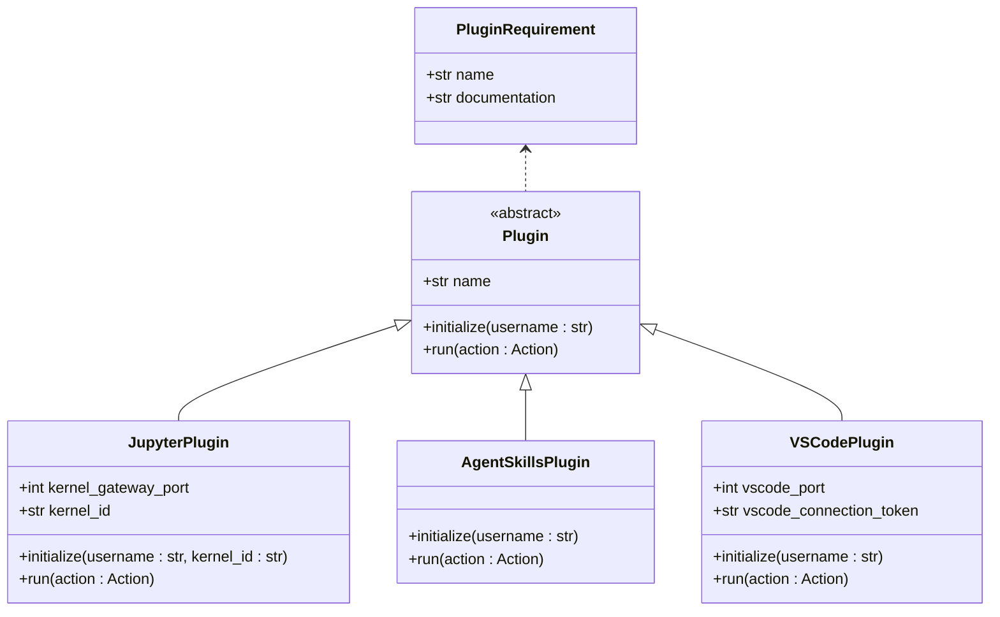

**插件来源**  
- [requirement.py](file://openhands/runtime/plugins/requirement.py#L8-L24)
- [__init__.py](file://openhands/runtime/plugins/__init__.py#L21-L25)

## Agent Skills插件系统

Agent Skills插件为智能体提供了丰富的文件操作、代码编辑和仓库管理能力。该插件通过导入多个子模块来提供完整的功能集。

### 文件操作技能

Agent Skills插件提供了全面的文件操作功能，包括文件浏览、搜索和导航。这些功能通过`file_ops`模块实现，为智能体提供了类似IDE的文件操作体验。

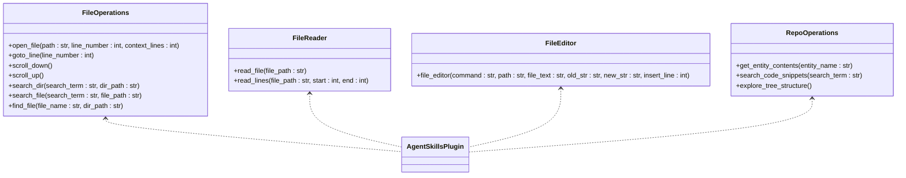

**插件来源**  
- [file_ops.py](file://openhands/runtime/plugins/agent_skills/file_ops/file_ops.py#L183-L403)
- [agentskills.py](file://openhands/runtime/plugins/agent_skills/agentskills.py#L3-L45)

### 代码编辑功能

代码编辑功能通过集成`openhands_aci.editor`模块实现，提供了强大的代码编辑能力。`file_editor`函数是主要的编辑接口，支持多种编辑命令。

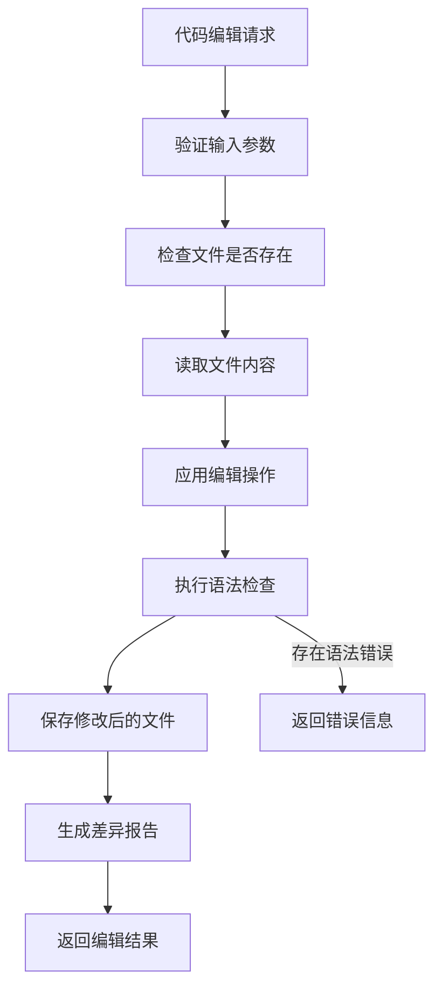

**插件来源**  
- [file_editor.py](file://openhands/runtime/plugins/agent_skills/file_editor/__init__.py#L6)
- [file_ops.py](file://openhands/runtime/plugins/agent_skills/file_ops/file_ops.py#L88-L111)

### 仓库管理技能

仓库管理技能通过`repo_ops`模块提供，集成了代码索引和搜索功能。这些功能基于`openhands_aci.indexing.locagent.tools`模块实现。

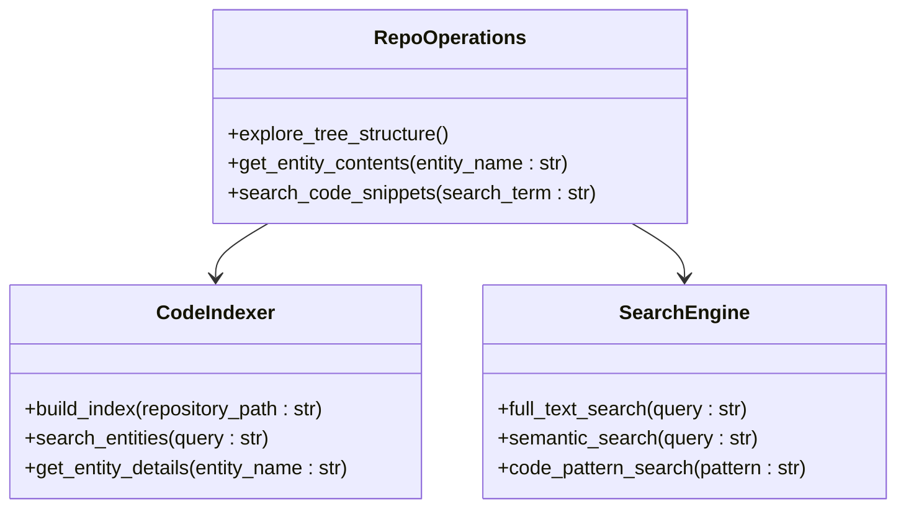

**插件来源**  
- [repo_ops.py](file://openhands/runtime/plugins/agent_skills/repo_ops/repo_ops.py#L1-L12)
- [agentskills.py](file://openhands/runtime/plugins/agent_skills/agentskills.py#L15-L25)

## Jupyter插件机制

Jupyter插件提供了内核集成和代码执行能力，允许在沙箱环境中执行Python代码并获取执行结果。

### 内核集成架构

Jupyter插件通过启动Jupyter内核网关来实现代码执行功能。该插件负责管理内核生命周期，包括启动、初始化和关闭。

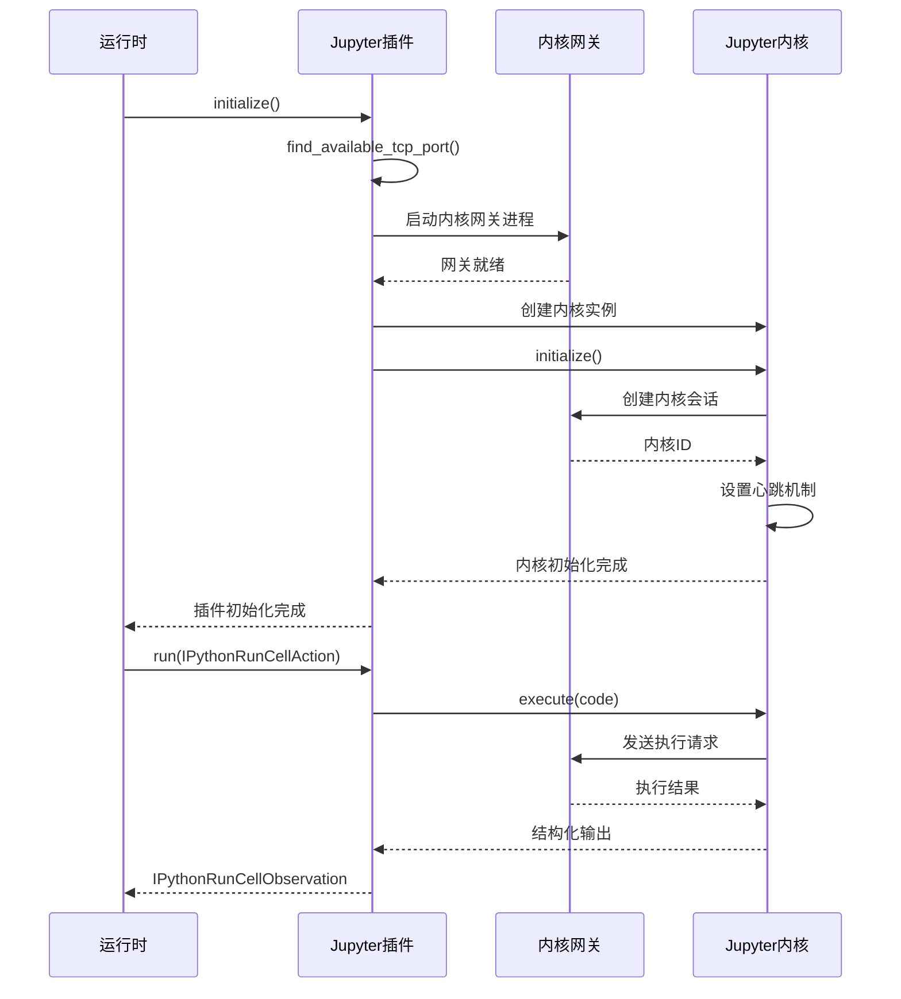

**插件来源**  
- [jupyter/__init__.py](file://openhands/runtime/plugins/jupyter/__init__.py#L38-L181)
- [execute_server.py](file://openhands/runtime/plugins/jupyter/execute_server.py#L53-L309)

### 代码执行流程

代码执行流程涉及多个组件的协同工作，确保代码在安全的环境中执行并返回结构化结果。

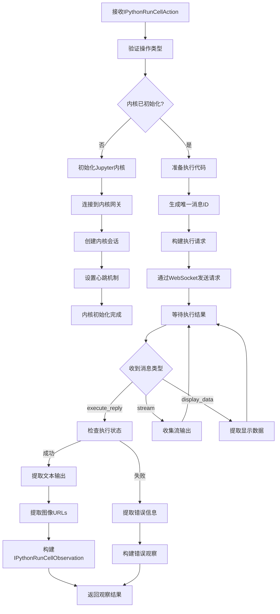

**插件来源**  
- [execute_server.py](file://openhands/runtime/plugins/jupyter/execute_server.py#L142-L258)
- [jupyter/__init__.py](file://openhands/runtime/plugins/jupyter/__init__.py#L151-L181)

## VSCode插件支持

VSCode插件提供了远程开发支持，允许用户通过浏览器访问VSCode开发环境。

### 远程开发架构

VSCode插件通过启动OpenVSCode Server来提供远程开发功能。该插件负责配置VSCode环境并启动服务器进程。

```mermaid
classDiagram
class VSCodePlugin {
+int vscode_port
+str vscode_connection_token
+_setup_vscode_settings()
+initialize(username : str)
+run(action : Action)
}
class OpenVSCodeServer {
+int port
+str connection_token
+workspace_path : str
+base_path : str
+start_server()
+stop_server()
}
class VSCodeSettings {
+settings.json
+extensions.json
+keybindings.json
}
VSCodePlugin --> OpenVSCodeServer
VSCodePlugin --> VSCodeSettings
VSCodeSettings --> ".vscode目录"
```

**插件来源**  
- [vscode/__init__.py](file://openhands/runtime/plugins/vscode/__init__.py#L50-L157)

### 配置与初始化

VSCode插件的初始化过程包括设置VSCode配置文件和启动服务器进程。

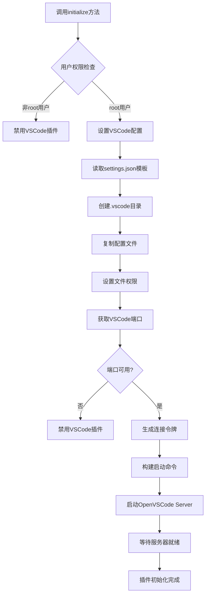

**插件来源**  
- [vscode/__init__.py](file://openhands/runtime/plugins/vscode/__init__.py#L59-L132)

## 插件加载与依赖管理

插件系统通过配置驱动的方式管理插件的加载和依赖关系，确保插件按正确顺序初始化。

### 插件加载机制

插件加载机制在`ActionExecutor`初始化时执行，根据配置加载指定的插件并进行初始化。

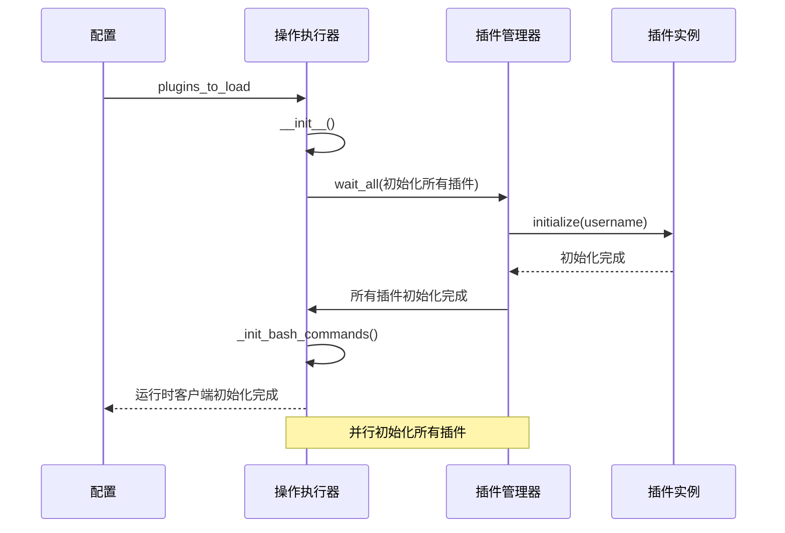

**插件来源**  
- [action_execution_server.py](file://openhands/runtime/action_execution_server.py#L301-L327)
- [command.py](file://openhands/runtime/utils/command.py#L21-L82)

### 依赖管理策略

依赖管理通过命令行参数和环境变量实现，确保插件之间的正确依赖关系。

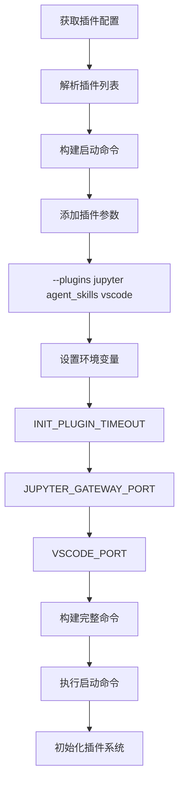

**插件来源**  
- [command.py](file://openhands/runtime/utils/command.py#L40-L43)
- [action_execution_server.py](file://openhands/runtime/action_execution_server.py#L68)

## 安全沙箱机制

运行时插件系统运行在安全的沙箱环境中，通过多种机制确保执行安全。

### 沙箱隔离策略

沙箱环境通过容器化技术实现隔离，限制插件的系统访问权限。

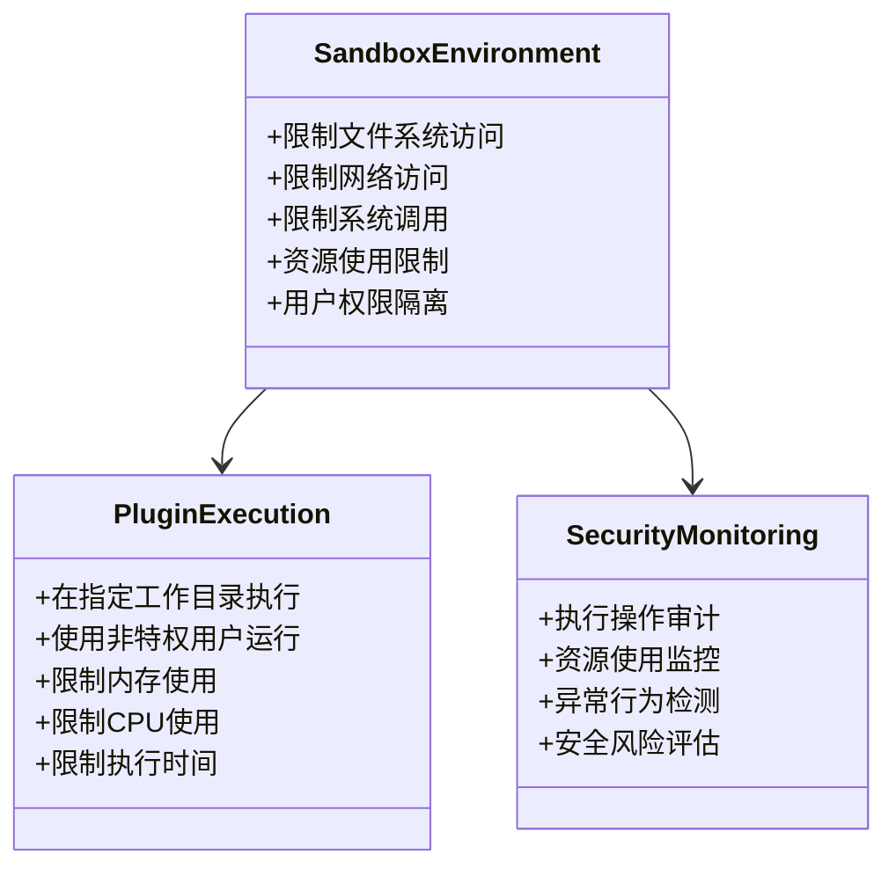

**插件来源**  
- [action_execution_server.py](file://openhands/runtime/action_execution_server.py#L171-L200)
- [runtime_init.py](file://openhands/runtime/utils/runtime_init.py)

### 安全风险控制

系统通过安全风险评估机制控制潜在的安全威胁。

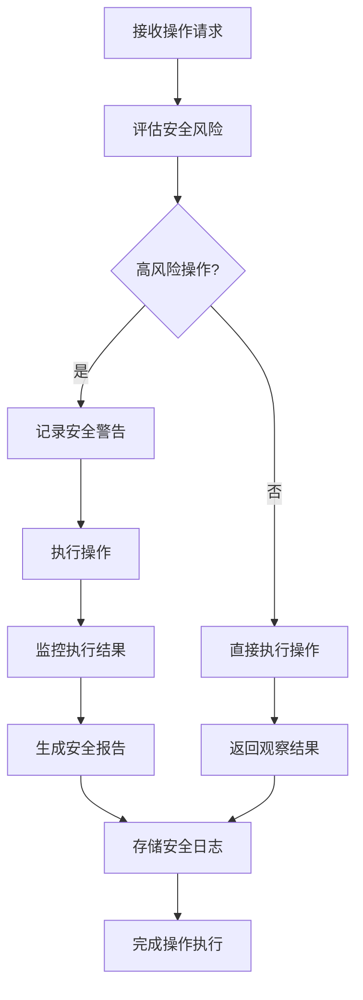

**插件来源**  
- [action.py](file://openhands/events/action/action.py#L114)
- [action_execution_server.py](file://openhands/runtime/action_execution_server.py)

## 自定义插件开发指南

开发自定义插件需要遵循特定的接口定义和实现规范。

### 插件接口定义

自定义插件必须实现`Plugin`基类定义的接口，包括名称属性和必要的方法。

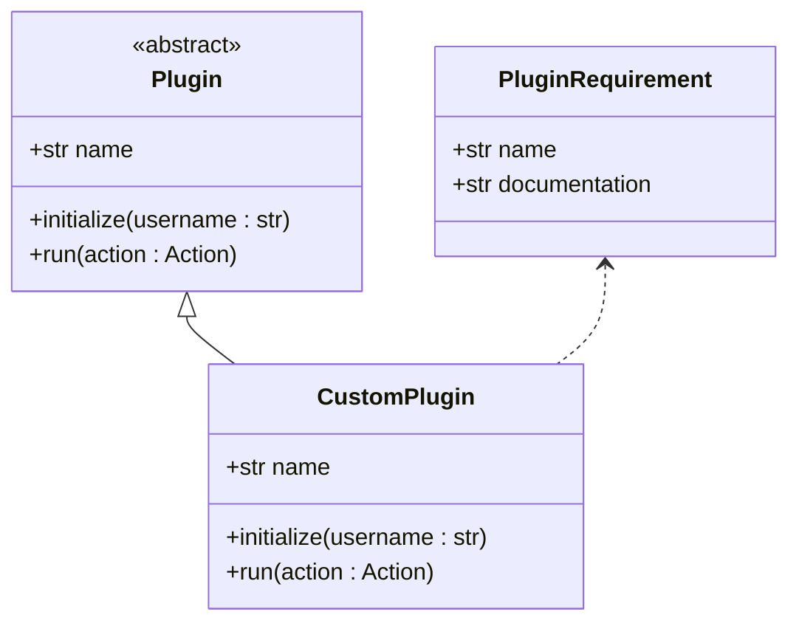

**插件来源**  
- [requirement.py](file://openhands/runtime/plugins/requirement.py#L8-L24)

### 配置方法

插件通过配置文件或环境变量进行配置，确保灵活性和可管理性。

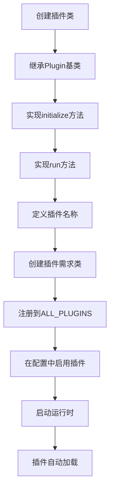

**插件来源**  
- [__init__.py](file://openhands/runtime/plugins/__init__.py#L21-L25)
- [requirement.py](file://openhands/runtime/plugins/requirement.py#L27-L32)

### 调试技巧

调试插件时可以使用日志记录和逐步初始化的方法来排查问题。

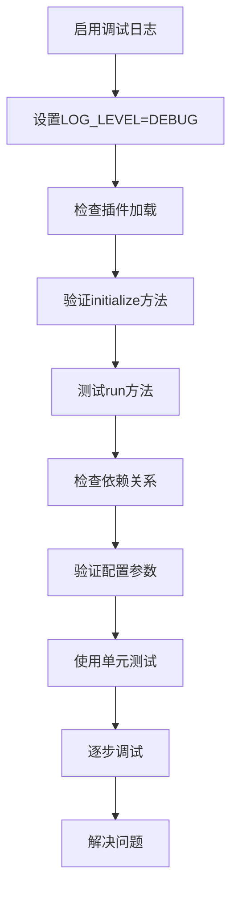

**插件来源**  
- [action_execution_server.py](file://openhands/runtime/action_execution_server.py#L301-L327)
- [logger.py](file://openhands/core/logger.py)