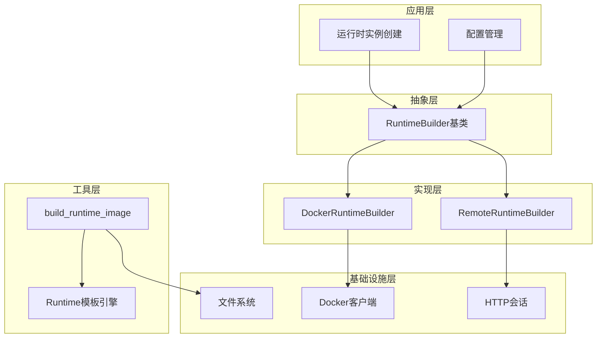
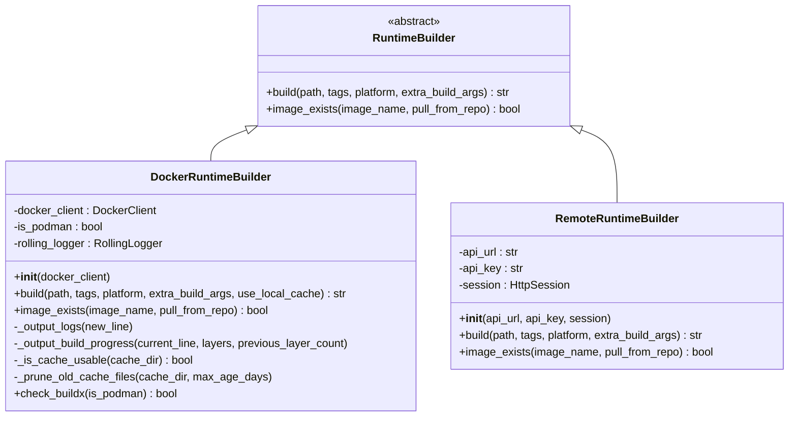
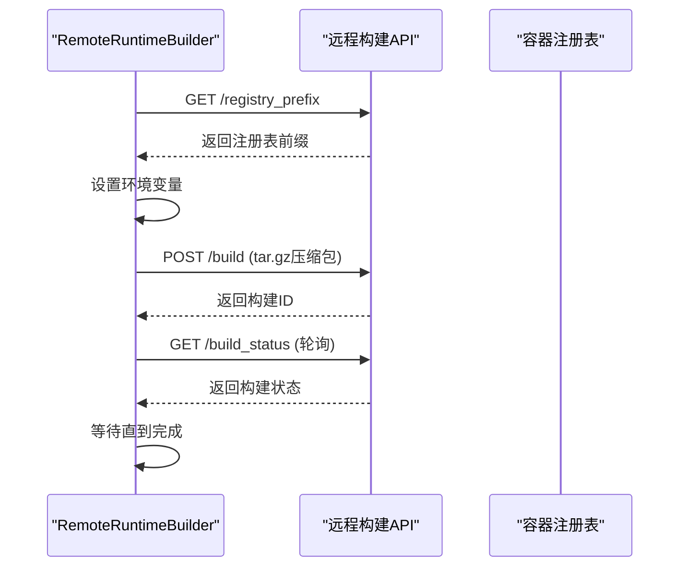
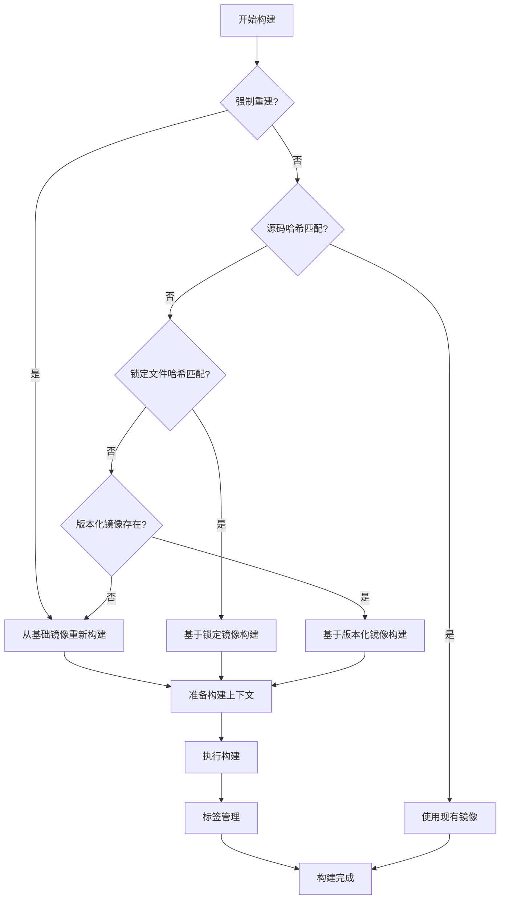
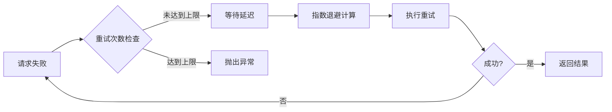

# 运行时构建器

<cite>
**本文档中引用的文件**
- [base.py](file://openhands/runtime/builder/base.py)
- [docker.py](file://openhands/runtime/builder/docker.py)
- [remote.py](file://openhands/runtime/builder/remote.py)
- [__init__.py](file://openhands/runtime/builder/__init__.py)
- [runtime_build.py](file://openhands/runtime/utils/runtime_build.py)
- [docker_runtime.py](file://openhands/runtime/impl/docker/docker_runtime.py)
- [remote_runtime.py](file://openhands/runtime/impl/remote/remote_runtime.py)
- [sandbox_config.py](file://openhands/core/config/sandbox_config.py)
- [test_runtime_build.py](file://tests/unit/runtime/builder/test_runtime_build.py)
- [test_remote_runtime.py](file://tests/runtime/test_stress_remote_runtime.py)
</cite>

## 目录
1. [简介](#简介)
2. [架构概述](#架构概述)
3. [RuntimeBuilder抽象工厂模式](#runtimebuilder抽象工厂模式)
4. [Docker运行时构建器](#docker运行时构建器)
5. [远程运行时构建器](#远程运行时构建器)
6. [构建过程详解](#构建过程详解)
7. [错误处理与超时控制](#错误处理与超时控制)
8. [资源清理机制](#资源清理机制)
9. [扩展点与自定义实现](#扩展点与自定义实现)
10. [最佳实践](#最佳实践)

## 简介

运行时构建器（Runtime Builder）是OpenHands系统中的核心组件，负责根据配置创建和管理不同类型的运行时实例。该系统采用抽象工厂模式设计，支持多种运行时环境的统一构建和管理，包括本地Docker容器、远程服务器等。

运行时构建器的主要职责包括：
- 根据配置选择合适的构建策略
- 管理容器镜像的构建、拉取和缓存
- 处理构建过程中的错误和异常
- 提供统一的接口用于运行时实例的创建

## 架构概述

运行时构建器系统采用分层架构设计，包含以下核心组件：

**图表来源**
- [base.py](file://openhands/runtime/builder/base.py#L4-L42)
- [docker.py](file://openhands/runtime/builder/docker.py#L15-L420)
- [remote.py](file://openhands/runtime/builder/remote.py#L18-L148)

## RuntimeBuilder抽象工厂模式

### 基础接口设计

RuntimeBuilder采用抽象工厂模式，定义了运行时构建的核心接口：

**图表来源**
- [base.py](file://openhands/runtime/builder/base.py#L4-L42)
- [docker.py](file://openhands/runtime/builder/docker.py#L15-L420)
- [remote.py](file://openhands/runtime/builder/remote.py#L18-L148)

### 工厂方法实现

抽象工厂模式通过RuntimeBuilder基类定义统一接口，具体实现类负责具体的构建逻辑：

**节来源**
- [base.py](file://openhands/runtime/builder/base.py#L4-L42)
- [__init__.py](file://openhands/runtime/builder/__init__.py#L1-L4)

## Docker运行时构建器

### 镜像管理功能

DockerRuntimeBuilder提供了完整的镜像管理能力：

#### 版本兼容性检查
- 支持Docker Engine 18.09+和Podman 4.9+
- 自动检测BuildKit可用性
- 动态安装Docker二进制文件（容器内场景）

#### 缓存优化机制
- 本地缓存目录：`/tmp/.buildx-cache`
- 支持增量构建和层缓存
- 定期清理过期缓存文件

#### 构建参数配置
- 平台特定构建（linux/amd64, linux/arm64）
- 自定义构建参数传递
- BuildKit启用和配置

**节来源**
- [docker.py](file://openhands/runtime/builder/docker.py#L15-L420)

### 容器配置与启动参数

Docker构建器支持丰富的容器配置选项：

#### 网络配置
- 端口映射和暴露
- 网络模式选择
- 环境变量设置

#### 存储配置
- 卷挂载管理
- 工作目录设置
- 文件权限控制

#### 资源限制
- 内存限制配置
- CPU配额设置
- 临时存储管理

**节来源**
- [docker_runtime.py](file://openhands/runtime/impl/docker/docker_runtime.py#L130-L140)

### 启动参数管理

构建器支持多种启动参数配置：

#### 基础参数
- 基础镜像选择
- 构建上下文路径
- 镜像标签管理

#### 高级参数
- 平台目标设置
- 额外构建参数
- 缓存策略配置

**节来源**
- [docker.py](file://openhands/runtime/builder/docker.py#L51-L249)

## 远程运行时构建器

### 连接管理

RemoteRuntimeBuilder负责与远程构建服务的交互：

#### API通信
- HTTP/HTTPS协议支持
- 认证令牌管理
- 请求重试机制

#### 连接池管理
- 会话持久化
- 连接超时控制
- 错误恢复策略

**节来源**
- [remote.py](file://openhands/runtime/builder/remote.py#L18-L148)

### 初始化流程

远程构建器的初始化包含以下步骤：

#### 注册表前缀获取

**图表来源**
- [remote.py](file://openhands/runtime/builder/remote.py#L28-L120)

#### 镜像存在性检查
- 异步构建状态查询
- 超时控制机制
- 错误状态处理

**节来源**
- [remote.py](file://openhands/runtime/builder/remote.py#L122-L148)

## 构建过程详解

### 构建策略选择

系统根据不同的条件自动选择最优的构建策略：

**图表来源**
- [runtime_build.py](file://openhands/runtime/utils/runtime_build.py#L191-L256)

### 构建上下文准备

构建过程包含多个阶段的上下文准备：

#### 源码复制
- OpenHands核心代码
- MicroAgents组件
- 配置文件和依赖

#### Dockerfile生成
- 模板引擎渲染
- 构建参数注入
- 平台特定配置

**节来源**
- [runtime_build.py](file://openhands/runtime/utils/runtime_build.py#L260-L306)

### 镜像标签策略

系统采用多层级的镜像标签策略：

#### 标签层次结构
1. **源码标签**：基于源码哈希生成
2. **锁定标签**：基于依赖文件哈希
3. **版本标签**：基于OpenHands版本

#### 标签命名规范
- 长度限制处理
- 字符集规范化
- 唯一性保证

**节来源**
- [runtime_build.py](file://openhands/runtime/utils/runtime_build.py#L179-L189)

## 错误处理与超时控制

### 错误分类与处理

运行时构建器实现了完善的错误处理机制：

#### 系统级错误
- Docker版本不兼容
- 权限不足
- 资源不足

#### 网络级错误
- 连接超时
- 网络不可达
- API限流

#### 应用级错误
- 构建失败
- 镜像不存在
- 配置错误

**节来源**
- [docker.py](file://openhands/runtime/builder/docker.py#L199-L223)
- [remote.py](file://openhands/runtime/builder/remote.py#L64-L70)

### 超时控制机制

系统实现了多层次的超时控制：

#### 构建超时
- 总构建时间限制（30分钟）
- 单个操作超时控制
- 渐进式重试策略

#### 网络超时
- HTTP请求超时
- 连接建立超时
- 数据传输超时

**节来源**
- [remote.py](file://openhands/runtime/builder/remote.py#L77-L82)

### 重试策略

系统采用指数退避的重试策略：

**图表来源**
- [remote.py](file://openhands/runtime/builder/remote.py#L537-L546)

## 资源清理机制

### 自动清理策略

运行时构建器实现了全面的资源清理机制：

#### 缓存清理
- 过期缓存文件删除
- 定期维护任务
- 存储空间监控

#### 构建产物清理
- 中间镜像清理
- 临时文件删除
- 日志文件管理

**节来源**
- [docker.py](file://openhands/runtime/builder/docker.py#L371-L421)

### 内存管理

系统实现了智能的内存管理策略：

#### 内存限制
- 运行时内存监控
- OOM保护机制
- 资源使用报告

#### 垃圾回收
- 对象生命周期管理
- 循环引用检测
- 资源泄漏防护

**节来源**
- [test_remote_runtime.py](file://tests/runtime/test_stress_remote_runtime.py#L377-L394)

## 扩展点与自定义实现

### 自定义构建器开发

开发者可以通过继承RuntimeBuilder基类来实现自定义构建器：

#### 必需实现的方法
- `build()`：核心构建逻辑
- `image_exists()`：镜像存在性检查

#### 可选增强功能
- 日志记录增强
- 性能监控
- 自定义配置支持

**节来源**
- [base.py](file://openhands/runtime/builder/base.py#L4-L42)

### 插件集成点

系统提供了多个插件集成点：

#### 构建钩子
- 构建前预处理
- 构建后后处理
- 错误处理钩子

#### 配置扩展
- 自定义配置项
- 动态配置加载
- 配置验证机制

**节来源**
- [sandbox_config.py](file://openhands/core/config/sandbox_config.py#L96-L123)

### 第三方集成

系统支持与第三方构建服务集成：

#### 容器编排平台
- Kubernetes集成
- Docker Swarm支持
- Cloud Native构建

#### 持续集成服务
- GitHub Actions集成
- GitLab CI集成
- Jenkins插件支持

## 最佳实践

### 性能优化建议

#### 构建性能优化
- 启用BuildKit加速
- 使用本地缓存
- 并行构建策略

#### 资源使用优化
- 合理设置资源限制
- 监控资源使用情况
- 定期清理无用资源

**节来源**
- [docker.py](file://openhands/runtime/builder/docker.py#L144-L150)

### 安全考虑

#### 镜像安全
- 验证镜像来源
- 扫描已知漏洞
- 使用最小权限原则

#### 网络安全
- HTTPS通信加密
- API密钥安全存储
- 网络访问控制

**节来源**
- [remote.py](file://openhands/runtime/builder/remote.py#L22-L26)

### 监控与调试

#### 日志管理
- 结构化日志输出
- 分级日志配置
- 日志轮转策略

#### 性能监控
- 构建时间统计
- 资源使用监控
- 错误率跟踪

**节来源**
- [docker.py](file://openhands/runtime/builder/docker.py#L309-L314)

### 故障排除

#### 常见问题解决
- Docker版本兼容性
- 网络连接问题
- 权限配置错误

#### 调试工具
- 详细的错误信息
- 构建过程追踪
- 状态诊断工具

**节来源**
- [test_runtime_build.py](file://tests/unit/runtime/builder/test_runtime_build.py#L244-L685)