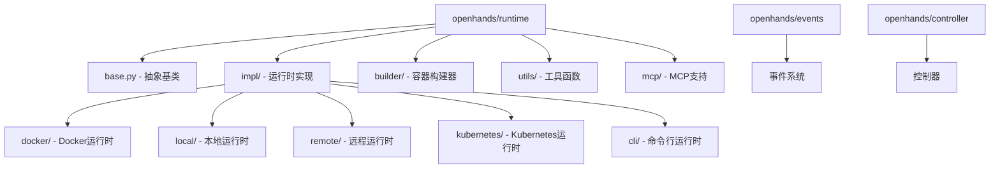
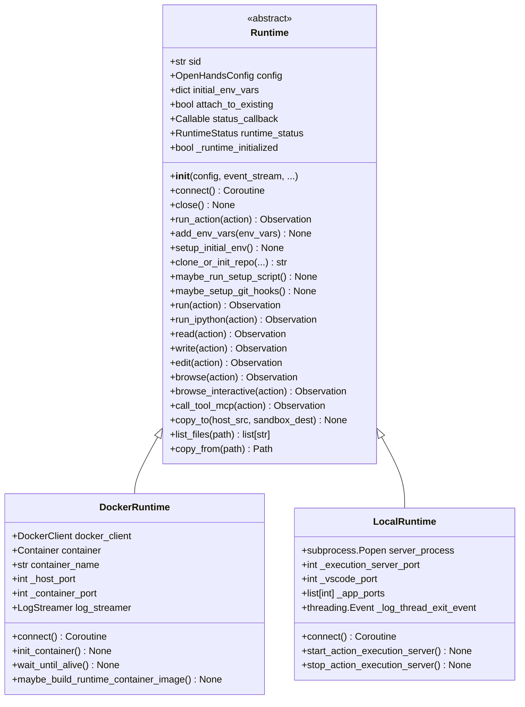
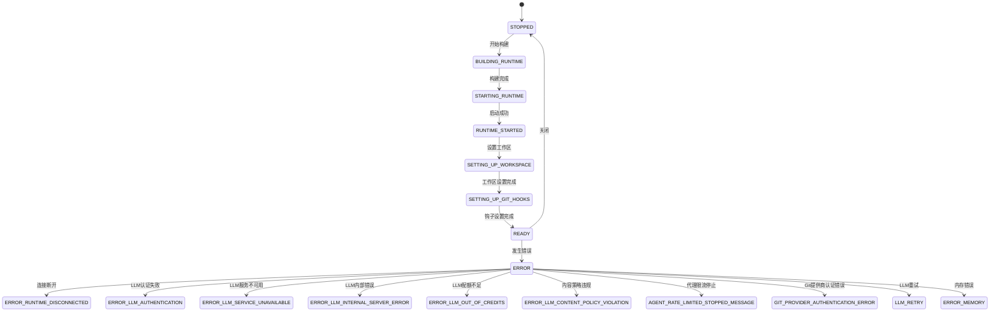
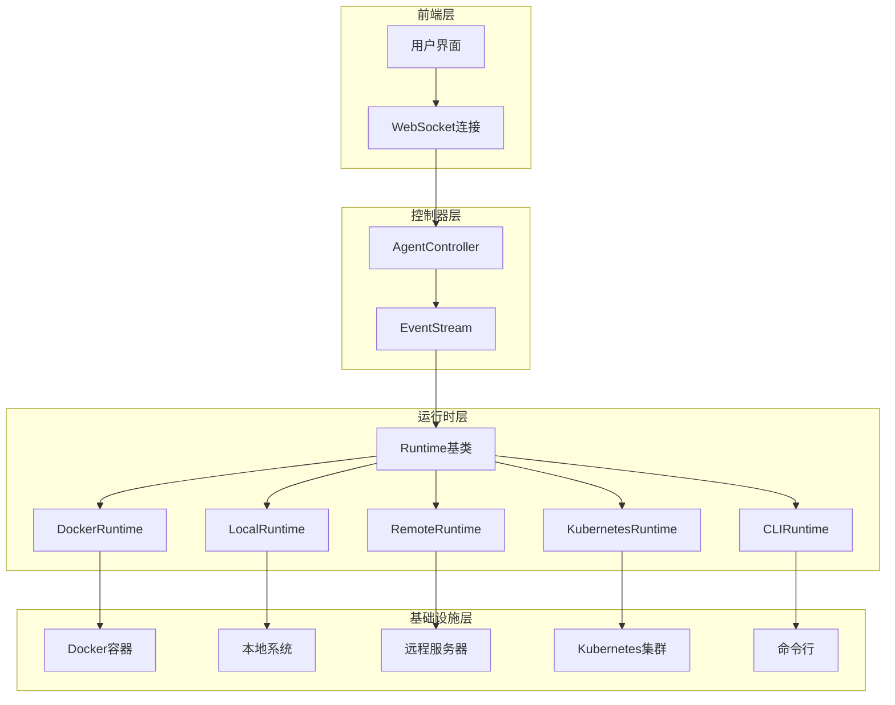
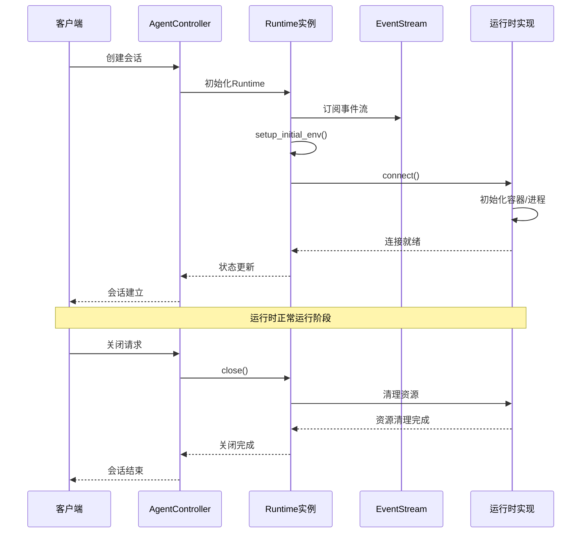
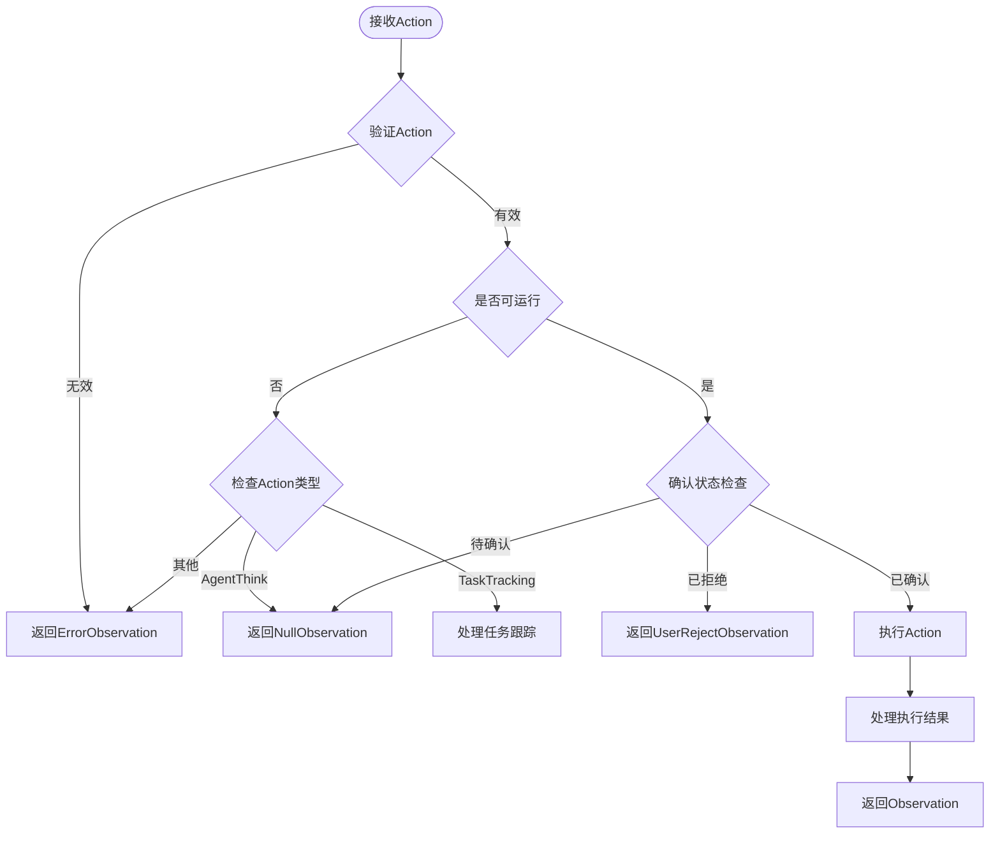
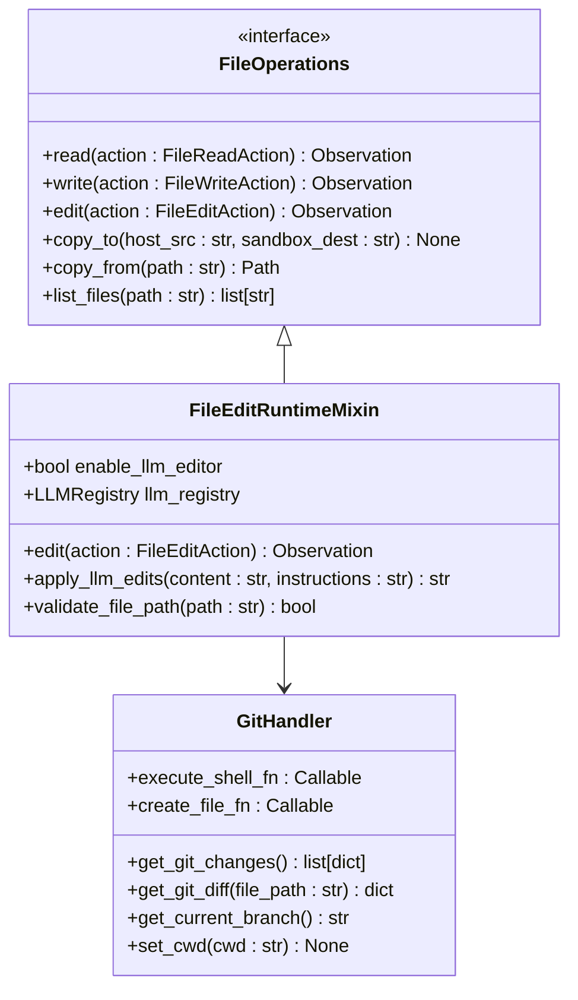
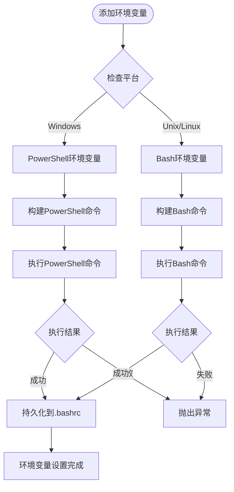
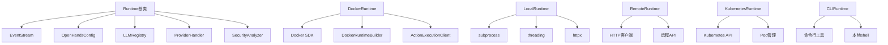

# 运行时核心架构

<cite>
**本文档中引用的文件**
- [openhands/runtime/base.py](file://openhands/runtime/base.py)
- [openhands/runtime/__init__.py](file://openhands/runtime/__init__.py)
- [openhands/runtime/runtime_status.py](file://openhands/runtime/runtime_status.py)
- [openhands/runtime/impl/docker/docker_runtime.py](file://openhands/runtime/impl/docker/docker_runtime.py)
- [openhands/runtime/impl/local/local_runtime.py](file://openhands/runtime/impl/local/local_runtime.py)
- [openhands/events/event.py](file://openhands/events/event.py)
- [openhands/controller/agent_controller.py](file://openhands/controller/agent_controller.py)
- [openhands/runtime/README.md](file://openhands/runtime/README.md)
</cite>

## 目录
1. [简介](#简介)
2. [项目结构](#项目结构)
3. [核心组件](#核心组件)
4. [架构概览](#架构概览)
5. [详细组件分析](#详细组件分析)
6. [依赖关系分析](#依赖关系分析)
7. [性能考虑](#性能考虑)
8. [故障排除指南](#故障排除指南)
9. [结论](#结论)

## 简介

OpenHands运行时核心架构是一个高度模块化和可扩展的系统，为智能代理提供了安全、隔离的执行环境。该架构通过抽象基类设计实现了多种运行时环境的支持，包括Docker容器、本地执行、远程服务器和Kubernetes集群等。

运行时系统的核心目标是：
- 提供统一的代理执行接口
- 支持多种部署模式和环境
- 确保安全性和资源隔离
- 实现高效的资源管理和监控

## 项目结构

OpenHands运行时系统采用分层架构设计，主要包含以下核心目录：

**图表来源**
- [openhands/runtime/base.py](file://openhands/runtime/base.py#L1-L50)
- [openhands/runtime/__init__.py](file://openhands/runtime/__init__.py#L1-L30)

**章节来源**
- [openhands/runtime/__init__.py](file://openhands/runtime/__init__.py#L1-L120)
- [openhands/runtime/README.md](file://openhands/runtime/README.md#L1-L50)

## 核心组件

### Runtime抽象基类

Runtime抽象基类是整个运行时系统的核心，定义了所有运行时实现必须遵循的接口规范：

**图表来源**
- [openhands/runtime/base.py](file://openhands/runtime/base.py#L91-L200)
- [openhands/runtime/impl/docker/docker_runtime.py](file://openhands/runtime/impl/docker/docker_runtime.py#L75-L150)
- [openhands/runtime/impl/local/local_runtime.py](file://openhands/runtime/impl/local/local_runtime.py#L124-L200)

### 运行时状态管理系统

运行时状态管理是确保系统稳定性的关键组件：

**图表来源**
- [openhands/runtime/runtime_status.py](file://openhands/runtime/runtime_status.py#L1-L25)

**章节来源**
- [openhands/runtime/base.py](file://openhands/runtime/base.py#L237-L244)
- [openhands/runtime/runtime_status.py](file://openhands/runtime/runtime_status.py#L1-L25)

## 架构概览

OpenHands运行时架构采用事件驱动的设计模式，通过观察者模式实现组件间的松耦合通信：

**图表来源**
- [openhands/controller/agent_controller.py](file://openhands/controller/agent_controller.py#L101-L200)
- [openhands/events/event.py](file://openhands/events/event.py#L1-L50)

## 详细组件分析

### 运行时生命周期管理

运行时的生命周期管理涉及初始化、启动、运行和关闭四个主要阶段：

**图表来源**
- [openhands/runtime/base.py](file://openhands/runtime/base.py#L129-L180)
- [openhands/controller/agent_controller.py](file://openhands/controller/agent_controller.py#L116-L180)

### 命令执行机制

运行时系统提供了统一的命令执行接口，支持多种类型的命令：

**图表来源**
- [openhands/runtime/base.py](file://openhands/runtime/base.py#L928-L1015)

### 文件操作接口

运行时系统提供了完整的文件操作能力，支持读取、写入、编辑和复制等操作：

**图表来源**
- [openhands/runtime/base.py](file://openhands/runtime/base.py#L1085-L1128)
- [openhands/runtime/utils/edit.py](file://openhands/runtime/utils/edit.py)

**章节来源**
- [openhands/runtime/base.py](file://openhands/runtime/base.py#L928-L1015)
- [openhands/runtime/base.py](file://openhands/runtime/base.py#L1085-L1128)

### 环境变量管理

运行时系统提供了强大的环境变量管理功能，支持跨平台兼容性：

**图表来源**
- [openhands/runtime/base.py](file://openhands/runtime/base.py#L247-L320)

**章节来源**
- [openhands/runtime/base.py](file://openhands/runtime/base.py#L247-L320)

### 进程管理与监控

不同运行时实现采用了不同的进程管理策略：

#### Docker运行时进程管理
- 使用Docker SDK管理容器生命周期
- 自动端口映射和网络配置
- 日志流式传输和实时监控

#### 本地运行时进程管理  
- 直接启动和管理子进程
- 使用临时工作空间隔离
- 进程间通信和状态同步

**章节来源**
- [openhands/runtime/impl/docker/docker_runtime.py](file://openhands/runtime/impl/docker/docker_runtime.py#L170-L200)
- [openhands/runtime/impl/local/local_runtime.py](file://openhands/runtime/impl/local/local_runtime.py#L124-L200)

## 依赖关系分析

运行时系统的依赖关系体现了清晰的分层架构：

**图表来源**
- [openhands/runtime/base.py](file://openhands/runtime/base.py#L1-L50)
- [openhands/runtime/impl/docker/docker_runtime.py](file://openhands/runtime/impl/docker/docker_runtime.py#L1-L50)

**章节来源**
- [openhands/runtime/base.py](file://openhands/runtime/base.py#L1-L50)
- [openhands/runtime/__init__.py](file://openhands/runtime/__init__.py#L1-L120)

## 性能考虑

运行时系统在设计时充分考虑了性能优化：

### 资源隔离与限制
- Docker容器提供强隔离性
- 内存和CPU使用量监控
- 自动垃圾回收机制

### 并发处理
- 异步事件处理
- 多线程日志处理
- 非阻塞I/O操作

### 缓存策略
- 容器镜像缓存
- 环境变量预加载
- 文件系统缓存

## 故障排除指南

### 常见问题及解决方案

#### 运行时连接失败
1. 检查Docker守护进程状态
2. 验证网络连接配置
3. 查看容器日志输出

#### 权限问题
1. 确认用户权限设置
2. 检查文件系统挂载权限
3. 验证SELinux/AppArmor配置

#### 性能问题
1. 监控资源使用情况
2. 调整容器资源配置
3. 优化文件系统访问模式

**章节来源**
- [openhands/runtime/base.py](file://openhands/runtime/base.py#L375-L400)
- [openhands/controller/agent_controller.py](file://openhands/controller/agent_controller.py#L346-L363)

## 结论

OpenHands运行时核心架构展现了现代软件系统设计的最佳实践：

### 设计优势
- **高度模块化**：通过抽象基类实现的可插拔架构
- **跨平台兼容**：统一接口支持多种运行环境
- **安全可靠**：完善的错误处理和资源管理机制
- **易于扩展**：清晰的接口定义便于新运行时实现

### 技术创新
- 事件驱动的异步处理模式
- 统一的观察者模式实现
- 智能的状态管理和恢复机制
- 完善的日志记录和监控体系

该架构不仅满足了当前的功能需求，还为未来的扩展和优化奠定了坚实的基础，是构建大规模智能代理系统的重要基础设施。