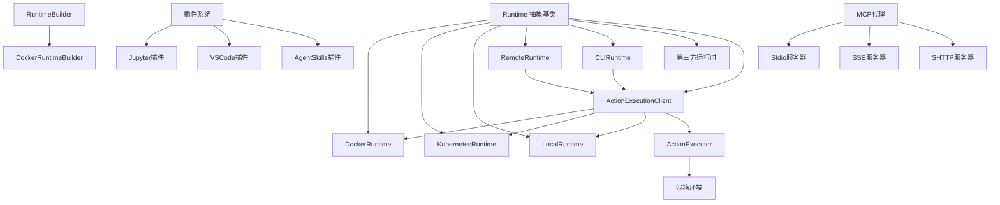
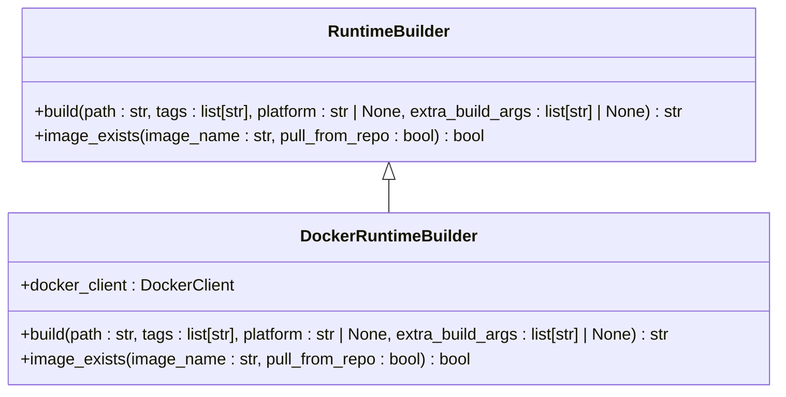
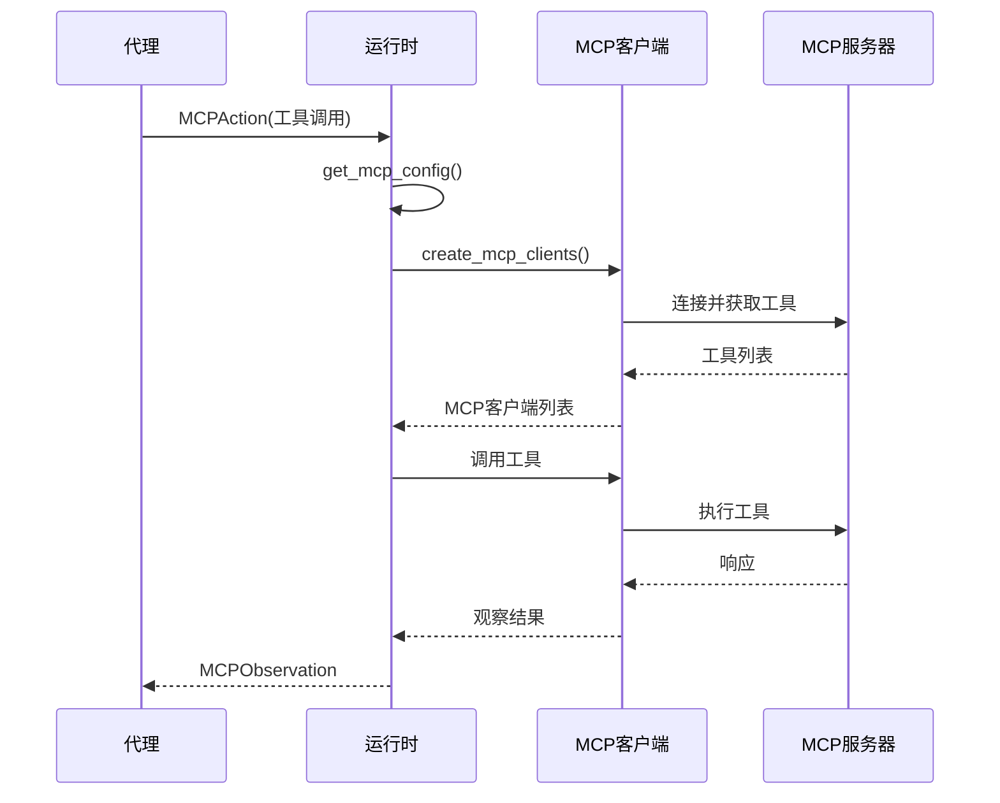
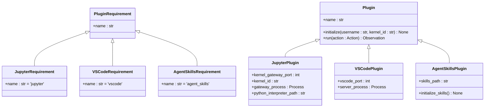
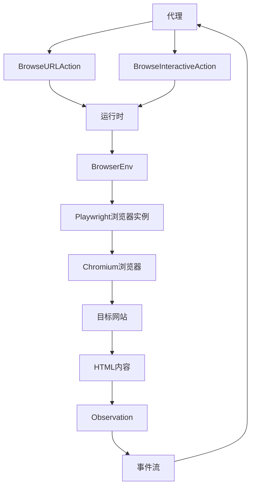
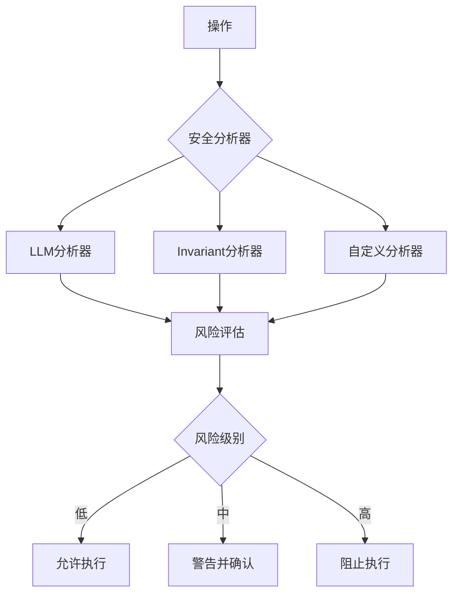

# 运行时环境

<cite>
**本文档引用的文件**
- [base.py](file://openhands/runtime/base.py)
- [docker_runtime.py](file://openhands/runtime/impl/docker/docker_runtime.py)
- [kubernetes_runtime.py](file://openhands/runtime/impl/kubernetes/kubernetes_runtime.py)
- [local_runtime.py](file://openhands/runtime/impl/local/local_runtime.py)
- [remote_runtime.py](file://openhands/runtime/impl/remote/remote_runtime.py)
- [__init__.py](file://openhands/runtime/__init__.py)
- [README.md](file://openhands/runtime/README.md)
- [builder.py](file://openhands/runtime/builder/base.py)
- [docker.py](file://openhands/runtime/builder/docker.py)
- [mcp_config.py](file://openhands/core/config/mcp_config.py)
- [plugins](file://openhands/runtime/plugins/__init__.py)
- [jupyter](file://openhands/runtime/plugins/jupyter/__init__.py)
- [vscode](file://openhands/runtime/plugins/vscode/__init__.py)
- [action_execution_server.py](file://openhands/runtime/action_execution_server.py)
- [containers/runtime/README.md](file://containers/runtime/README.md)
- [containers/app/Dockerfile](file://containers/app/Dockerfile)
</cite>

## 目录
1. [简介](#简介)
2. [运行时架构设计](#运行时架构设计)
3. [核心运行时实现](#核心运行时实现)
4. [运行时构建器](#运行时构建器)
5. [MCP代理集成](#mcp代理集成)
6. [插件系统](#插件系统)
7. [浏览器环境集成](#浏览器环境集成)
8. [性能基准与资源管理](#性能基准与资源管理)
9. [安全隔离机制](#安全隔离机制)

## 简介

OpenHands运行时环境为智能代理提供了一个安全、隔离的执行环境，支持多种部署模式和集成方式。该系统设计旨在为代理提供与外部环境交互的能力，同时确保执行的安全性和可控性。运行时环境通过抽象层实现了多种后端实现，包括Docker、Kubernetes、本地和远程执行模式，使用户可以根据具体需求选择最适合的部署方案。

运行时环境的核心功能包括：Bash沙箱执行、浏览器交互、文件系统操作、环境变量管理以及插件扩展能力。系统采用异步编程模型（asyncio）以提高执行效率，并通过事件流机制与代理核心进行通信。所有与外部环境的交互都通过运行时进行管理，确保了受控和安全的执行环境。

## 运行时架构设计

OpenHands运行时环境采用模块化架构设计，以实现灵活性和可扩展性。核心架构基于抽象基类`Runtime`，定义了所有运行时实现必须遵循的接口。这种设计模式允许系统支持多种不同的执行后端，同时保持一致的API和行为。



**架构来源**
- [base.py](file://openhands/runtime/base.py#L91-L115)
- [docker_runtime.py](file://openhands/runtime/impl/docker/docker_runtime.py#L75-L200)
- [kubernetes_runtime.py](file://openhands/runtime/impl/kubernetes/kubernetes_runtime.py#L61-L200)
- [local_runtime.py](file://openhands/runtime/impl/local/local_runtime.py#L124-L200)

**运行时来源**
- [__init__.py](file://openhands/runtime/__init__.py#L14-L21)

## 核心运行时实现

### Docker运行时

Docker运行时是OpenHands的默认执行环境，它利用Docker容器技术为代理提供隔离的执行环境。每个会话都会创建一个独立的Docker容器，确保不同任务之间的完全隔离。Docker运行时通过`ActionExecutionClient`与容器内的`ActionExecutor`服务进行通信，执行各种操作。

Docker运行时的关键特性包括：
- 为每个会话创建独立的Docker容器
- 通过HTTP调用执行容器内的操作
- 支持实时日志记录和调试
- 提供直接访问本地文件系统的功能
- 利用容器隔离确保安全执行

Docker运行时使用预定义的端口范围来管理不同服务的通信：
- 执行服务器端口范围：30000-39999
- VSCode端口范围：40000-49999
- 应用程序端口范围：50000-59999

在Windows系统或WSL2环境中，这些端口范围会相应调整以避免冲突。

**Docker运行时来源**
- [docker_runtime.py](file://openhands/runtime/impl/docker/docker_runtime.py#L43-L54)
- [base.py](file://openhands/runtime/base.py#L91-L115)

### Kubernetes运行时

Kubernetes运行时专为在Kubernetes集群中部署而设计，特别适用于Kind等环境。该实现使用Kubernetes Python客户端来创建和管理Pod，使代理能够在Kubernetes环境中运行。Kubernetes运行时通过创建Pod来执行代理代码，利用Kubernetes的资源管理和调度能力。

Kubernetes运行时的关键特性包括：
- 在Kubernetes集群中创建Pod来运行代理
- 使用Kubernetes Python客户端管理Pod生命周期
- 支持节点选择器和容忍度配置
- 通过服务和入口暴露运行时端点
- 利用持久卷声明（PVC）管理持久化存储

Kubernetes运行时需要在配置中指定命名空间、节点选择器和容忍度等参数，以确保Pod能够正确调度和运行。

**Kubernetes运行时来源**
- [kubernetes_runtime.py](file://openhands/runtime/impl/kubernetes/kubernetes_runtime.py#L61-L200)
- [base.py](file://openhands/runtime/base.py#L91-L115)

### 本地运行时

本地运行时直接在主机上运行`action_execution_server`，无需Docker容器。这种模式适用于开发和测试场景，特别是当Docker不可用或不希望使用时。本地运行时通过直接在主机上启动服务器进程来执行操作，提供最快的执行速度。

本地运行时的关键特性包括：
- 直接在主机上运行执行服务器
- 无容器开销，执行速度最快
- 直接访问本地系统资源
- 最小化设置要求
- 适用于开发和测试

**重要提示**：本地运行时不提供任何隔离，因为它直接在主机上运行。所有操作都以运行OpenHands的用户权限执行。对于需要适当隔离的安全执行，建议使用Docker运行时。

**本地运行时来源**
- [local_runtime.py](file://openhands/runtime/impl/local/local_runtime.py#L124-L200)
- [base.py](file://openhands/runtime/base.py#L91-L115)

### 远程运行时

远程运行时设计用于在远程环境中执行，支持分布式执行和基于云的部署。该实现通过连接到运行`ActionExecutor`的远程服务器来执行操作，将请求发送到远程客户端。远程运行时适用于生产环境、可扩展性要求高的场景以及本地资源受限的情况。

远程运行时的关键特性包括：
- 连接到远程服务器运行的ActionExecutor
- 通过HTTP请求执行远程操作
- 支持分布式执行和云部署
- 减少本地资源使用
- 潜在的安全性提升

远程运行时主要用于并行评估场景，如SWE-Bench基准测试。

**远程运行时来源**
- [remote_runtime.py](file://openhands/runtime/impl/remote/remote_runtime.py#L224-L248)
- [base.py](file://openhands/runtime/base.py#L91-L115)

## 运行时构建器

### 运行时构建器架构

运行时构建器系统负责创建和管理运行时环境的镜像。该系统采用抽象工厂模式，定义了`RuntimeBuilder`接口，允许不同的构建后端实现。目前主要支持`DockerRuntimeBuilder`，但架构设计允许扩展其他构建系统。



**构建器来源**
- [builder.py](file://openhands/runtime/builder/base.py#L4-L42)
- [docker.py](file://openhands/runtime/builder/docker.py)
- [__init__.py](file://openhands/runtime/builder/__init__.py#L1-L4)

### 构建流程

运行时构建流程涉及动态生成Dockerfile，该文件依赖于基础镜像和基于当前OpenHands提交的Python源代码分发包。构建过程通过`runtime_build`工具完成，该工具生成必要的Dockerfile、配置文件和运行时源代码分发文件。

构建命令示例：
```bash
poetry run python3 -m openhands.runtime.utils.runtime_build \
    --base_image nikolaik/python-nodejs:python3.12-nodejs22 \
    --build_folder containers/runtime
```

构建过程会生成一个包含所有必要依赖的运行时镜像，确保代理在一致的环境中执行。

**构建流程来源**
- [containers/runtime/README.md](file://containers/runtime/README.md#L1-L13)
- [containers/app/Dockerfile](file://containers/app/Dockerfile#L1-L96)

## MCP代理集成

### MCP配置管理

MCP（Model Context Protocol）代理集成允许OpenHands代理与外部工具和服务进行交互。MCP配置通过`MCPConfig`类管理，支持多种服务器类型：SSE（Server-Sent Events）、SHTTP（Simple HTTP）和stdio服务器。

MCP配置可以通过环境变量或配置文件进行设置，支持以下配置项：
- `mcp_host`: MCP主机地址
- `mcp.shttp_servers`: SHTTP服务器配置列表
- `mcp.sse_servers`: SSE服务器配置列表
- `mcp.stdio_servers`: stdio服务器配置列表



**MCP集成来源**
- [mcp_config.py](file://openhands/core/config/mcp_config.py)
- [cli_runtime.py](file://openhands/runtime/impl/cli/cli_runtime.py#L701-L736)
- [utils.py](file://openhands/mcp/utils.py#L162-L293)

### MCP工作流程

MCP代理的工作流程包括以下步骤：
1. **配置加载**：从环境变量或配置文件加载MCP配置
2. **客户端创建**：根据配置创建相应的MCP客户端
3. **工具发现**：从MCP服务器获取可用工具列表
4. **工具调用**：代理执行MCPAction时，运行时调用相应的MCP工具
5. **结果处理**：将MCP服务器的响应转换为观察结果并返回给代理

在Windows系统上，MCP功能被禁用，因为Windows不支持必要的stdio管道功能。

**MCP工作流程来源**
- [test_mcp_action.py](file://tests/runtime/test_mcp_action.py#L311-L343)
- [utils.py](file://openhands/mcp/utils.py#L162-L293)

## 插件系统

### 插件架构

OpenHands运行时支持可扩展的插件系统，允许在运行时环境中集成额外的功能。插件系统基于`PluginRequirement`和`Plugin`抽象，目前支持以下核心插件：



**插件系统来源**
- [plugins/__init__.py](file://openhands/runtime/plugins/__init__.py#L1-L26)
- [jupyter/__init__.py](file://openhands/runtime/plugins/jupyter/__init__.py#L1-L44)
- [vscode/__init__.py](file://openhands/runtime/plugins/vscode/__init__.py#L129-L157)

### Jupyter插件

Jupyter插件为运行时环境提供交互式Python执行能力。该插件启动Jupyter内核网关，允许代理执行IPython代码单元。Jupyter插件的关键特性包括：

- 启动Jupyter内核网关服务
- 管理Jupyter内核生命周期
- 在Bash会话和Jupyter内核之间同步工作目录
- 提供Python解释器路径信息

Jupyter插件通过WebSocket与内核通信，执行代码并返回结果。插件还负责在内核初始化时执行预定义的工具代码。

**Jupyter插件来源**
- [jupyter/__init__.py](file://openhands/runtime/plugins/jupyter/__init__.py#L1-L44)
- [execute_server.py](file://openhands/runtime/plugins/jupyter/execute_server.py#L53-L187)
- [action_execution_server.py](file://openhands/runtime/action_execution_server.py#L399-L461)

### VSCode插件

VSCode插件为运行时环境集成VSCode代码编辑器功能。该插件启动VSCode服务器，允许用户通过浏览器访问完整的VSCode界面。VSCode插件的关键特性包括：

- 启动VSCode服务器并管理其生命周期
- 设置VSCode配置文件（settings.json）
- 通过特定端口暴露VSCode服务
- 确保配置文件对所有用户可读写

VSCode插件在工作区创建`.vscode`目录，并将预配置的`settings.json`文件复制到该目录，确保一致的编辑器体验。

**VSCode插件来源**
- [vscode/__init__.py](file://openhands/runtime/plugins/vscode/__init__.py#L129-L157)
- [action_execution_server.py](file://openhands/runtime/action_execution_server.py)

## 浏览器环境集成

### 浏览器交互架构

OpenHands运行时通过`BrowserEnv`类处理Web浏览操作，为代理提供与网页交互的能力。浏览器环境集成允许代理执行浏览URL、交互式浏览等操作，支持复杂的Web自动化任务。



浏览器环境使用Playwright作为底层浏览器自动化工具，提供可靠的网页交互能力。系统支持无头模式和有头模式，可根据需要进行配置。

**浏览器集成来源**
- [README.md](file://openhands/runtime/README.md#L91-L93)
- [local_runtime.py](file://openhands/runtime/impl/local/local_runtime.py#L118-L122)

## 性能基准与资源管理

### 资源管理策略

OpenHands运行时环境实施了多种资源管理策略，以确保高效和稳定的执行。这些策略包括：

- **端口管理**：使用预定义的端口范围并实现端口锁定机制，防止端口冲突
- **内存管理**：通过异步编程模型和适当的超时设置优化内存使用
- **进程管理**：使用信号监听器管理运行时生命周期，确保资源正确释放
- **缓存策略**：实现LRU缓存以提高频繁操作的性能

运行时环境还支持性能监控和基准测试，可用于评估不同运行时实现的性能特征。系统提供了详细的日志记录功能，支持调试和性能分析。

**资源管理来源**
- [docker_runtime.py](file://openhands/runtime/impl/docker/docker_runtime.py#L37-L38)
- [port_lock.py](file://openhands/runtime/utils/port_lock.py)
- [async_utils.py](file://openhands/utils/async_utils.py)

### 性能优化

OpenHands运行时环境通过多种机制实现性能优化：

- **异步执行**：使用asyncio框架实现非阻塞I/O操作
- **连接池**：复用HTTP连接以减少建立连接的开销
- **批量操作**：合并多个小操作以减少网络往返
- **缓存机制**：缓存频繁访问的数据和计算结果

系统还实现了重试机制，使用tenacity库处理临时性故障，提高系统的可靠性。

**性能优化来源**
- [base.py](file://openhands/runtime/base.py#L73-L77)
- [tenacity_stop.py](file://openhands/utils/tenacity_stop.py)
- [http_session.py](file://openhands/utils/http_session.py)

## 安全隔离机制

### 安全分析器

OpenHands运行时环境集成了安全分析器，用于检测和防止潜在的安全风险。系统支持多种安全分析器，包括：

- **LLM风险分析器**：使用语言模型检测潜在的安全问题
- **Invariant分析器**：基于规则的安全检查
- **自定义分析器**：支持第三方安全工具集成

安全分析器通过事件流接收操作，并在执行前进行安全检查。系统允许配置不同的风险严重性级别，以平衡安全性和功能性。



**安全机制来源**
- [security/__init__.py](file://openhands/security/__init__.py#L1-L8)
- [analyzer.py](file://openhands/security/analyzer.py)
- [llm.py](file://openhands/security/llm.py)
- [frontend/src/routes/llm-settings.tsx](file://frontend/src/routes/llm-settings.tsx#L380-L427)

### 隔离策略

OpenHands运行时环境实施了多层次的隔离策略：

- **容器隔离**：Docker运行时使用容器技术提供进程和文件系统隔离
- **用户隔离**：在容器内创建专用用户，限制权限
- **网络隔离**：控制容器网络访问，防止未经授权的网络通信
- **文件系统隔离**：限制对主机文件系统的访问，仅允许通过指定挂载点访问

对于本地运行时，系统明确警告缺乏隔离，建议仅在受控环境中使用。

**隔离策略来源**
- [docker_runtime.py](file://openhands/runtime/impl/docker/docker_runtime.py)
- [local_runtime.py](file://openhands/runtime/impl/local/local_runtime.py#L160-L168)
- [app/Dockerfile](file://containers/app/Dockerfile#L38-L68)